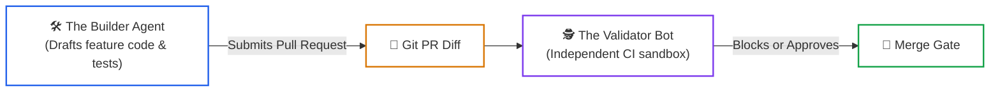
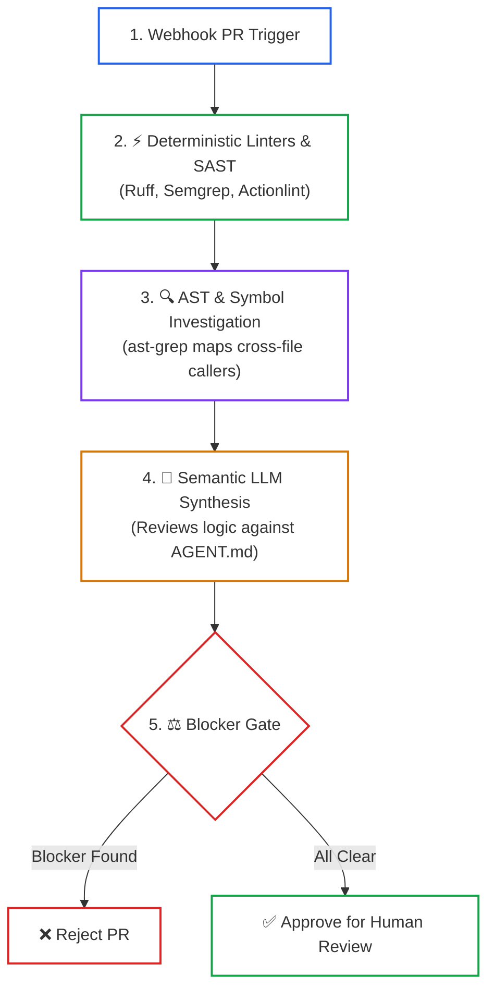

# Lesson 05: Headless CI/CD Review Bots and Automated Gates

> **Tier**: `🟡 Engineering Depth` | **Read time**: ~20 min | **Prerequisites**: [Lesson 01: AI Coding Toolchains & Architectures](./01-ai-coding-toolchains-and-agent-architectures.md), [Lesson 04: Designing AI-Friendly Codebases](./04-architecting-ai-friendly-codebases.md)  
> **Core Concept**: Deploying non-interactive AI agents in CI/CD pipelines to enforce the Builder-Validator Chain, eliminating human reviewer fatigue and catching subtle security, schema drift, and architectural regressions before merge.  
> **New AI terms introduced**: headless agent execution, Builder-Validator Chain, author-reviewer bias, blocker severity gate  
> **AI terms assumed from earlier lessons**: [ReAct loop](./00-foundations-of-the-ai-native-sdlc.md), [Spec-Driven Development](./02-spec-driven-development-and-codebase-contracts.md), [hexagonal boundary](./04-architecting-ai-friendly-codebases.md)

---

## 🎯 What You Will Learn

- Why asking an AI agent to review its own code within the same session fails due to confirmation bias.
- How to structure non-interactive, headless CLI runs using verified flags (`--bare`, `--allowedTools`, `--output-format json`).
- How modern review bots (like CodeRabbit) combine deterministic static analysis with agentic AST investigation.
- How to run an offline Python review simulation that evaluates pull request diffs and enforces blocker gates.

---

## 1. The Problem: The Pull Request Volume Explosion

When software engineering teams adopt AI coding assistants, pull request generation accelerates dramatically:
- Engineering velocity increases, and teams open 3–5x more pull requests each sprint.
- Human reviewers face massive diffs spanning hundreds of generated lines, triggering severe cognitive fatigue.
- Exhausted reviewers skim formatting, check for green CI checks, and approve PRs in minutes without inspecting boundary conditions.

```text
========================================================================
THE CODE REVIEW BOTTLENECK
========================================================================
PR Authoring Time (via AI):     10 minutes
PR Queue Wait Time:             4 days (Senior reviewers overwhelmed)
Human Review Quality:           Rubber-stamped in 90 seconds
Production Defects Caught:      Near zero (subtle bugs slip through)
========================================================================
```

Manual review queues neutralize the velocity gains of AI authoring. To restore balance, organizations deploy **Headless CI/CD Agents**—non-interactive AI review bots running inside pipeline runners (GitHub Actions, GitLab CI) that enforce strict validation before human eyes inspect the diff.

---

## 2. The Mental Model: The Aircraft Pre-Flight Inspection

Consider the safety protocol for a commercial airliner:
- A maintenance crew (The Builder) replaces a hydraulic brake valve.
- The airline does not ask the repair technician: *"Did you do a good job?"*
- Instead, a separate, certified safety inspector (The Validator) arrives with an independent checklist. The inspector did not perform the repair. They have no emotional attachment to the work. They pressure-test the hydraulic lines and inspect the torque seals.



### Walkthrough
1. **The Builder**: The developer's agent drafts the code and runs local tests.
2. **The PR Diff**: The proposed changes are submitted to version control.
3. **The Validator**: An independent headless bot evaluates the code in a pristine context window against repository constitutions.
4. **Merge Gate**: Non-negotiable blockers stop merge until violations are resolved.

> **Where this analogy breaks**: An aircraft inspector uses physical pressure gauges. A headless AI review bot evaluates probabilistic token patterns, meaning it must be backed by deterministic linters to guarantee zero false negatives on static syntax rules.

---

## 3. How It Works, One Term at a Time

### Mechanism 1: Author-Reviewer Bias and Builder-Validator Isolation
* 🧒 **The Analogy**: An author proofreading their own novel. Their brain automatically skips missing words because they know what they intended to write.
* ⚙️ **The Engineering**: Large language models condition their attention weights on their conversation history. If the agent that authored a bug is asked: *"Review this code for flaws"*, it repeats its earlier blind spots. **Builder-Validator Isolation** guarantees:
  - The reviewing agent executes in a clean, isolated context window with zero conversational memory of how the code was authored.
  - The validator prompt acts as an adversarial auditor instructed to find contract violations and security vulnerabilities.
* ⚠️ **What happens if you skip this?**: The agent confirms its own logic, reporting: *"Looks great!"*, while leaving unindexed database queries in the diff.

---

### Mechanism 2: Non-Interactive Headless CLI Execution
* 🧒 **The Analogy**: A script running on a cron timer in the middle of the night without a monitor, keyboard, or mouse attached.
* ⚙️ **The Engineering**: In CI pipelines, agents cannot ask interactive questions. Tools like Anthropic Claude Code provide headless CLI execution via explicit flags:
  ```bash
  claude -p "Audit PR diff against AGENT.md invariants" \
         --bare \
         --allowedTools "Read,Bash" \
         --output-format json
  ```
  - `-p` (`--print`): Runs single-shot without opening an interactive prompt loop.
  - `--bare`: Disables non-essential hooks and plugins for deterministic CI startup.
  - `--allowedTools`: Scopes permissions to prevent destructive terminal commands.
  - `--output-format json`: Emits machine-readable review findings for automated PR commenting.
* ⚠️ **What happens if you skip this?**: The CI job hangs indefinitely waiting for keyboard input from a non-existent terminal user.

---

### Mechanism 3: The 4-Stage Automated Review Pipeline
* 🧒 **The Analogy**: Airport security. You pass through a metal detector first (fast, deterministic). Only if an alarm triggers does an agent conduct a manual physical search (slower, detailed).
* ⚙️ **The Engineering**: Production review engines (e.g., CodeRabbit) operate in four staged layers:



### Walkthrough
1. **Webhook Trigger**: Pull request event invokes the pipeline runner.
2. **Deterministic Linters**: 50+ static analyzers catch syntax, secrets, and style in <5 seconds.
3. **AST Investigation**: Parses structural dependencies across touched files.
4. **Semantic LLM Synthesis**: Inspects business logic, invariants, and edge cases against `AGENT.md`.
5. **Blocker Gate**: Emits pass/fail status checks directly to the pull request.

---

## 4. Try It: Offline Automated PR Review Bot Simulator

This typed Python 3.12+ script simulates a headless CI review bot. It parses git diff chunks, applies deterministic security checks, evaluates architectural invariants, categorizes findings into Blockers vs. Nits, and sets the CI status check.

```python
"""
headless_pr_reviewer.py
Simulates an automated CI/CD review gate enforcing architectural invariants and security checks.
Compatible with Python 3.12+ and Pydantic v2. Run directly with python.
"""

from enum import Enum
from pydantic import BaseModel, Field


class FindingSeverity(str, Enum):
    BLOCKER = "BLOCKER"
    WARNING = "WARNING"
    NIT = "NIT"


class ReviewFinding(BaseModel):
    file_path: str
    line_number: int
    severity: FindingSeverity
    category: str
    description: str
    suggested_fix: str


class PRReviewReport(BaseModel):
    pr_id: int
    findings: list[ReviewFinding] = Field(default_factory=list)
    has_blockers: bool = False
    verdict: str


SAMPLE_DIFF = """
diff --git a/src/api/routes.py b/src/api/routes.py
@@ -14,6 +14,8 @@ def process_payment(request: dict):
+    # Hardcoded test secret left by developer
+    api_key = "sk_live_99410294102941024"
+    raw_query = f"SELECT * FROM users WHERE email = '{request['email']}'"
"""


def evaluate_diff_invariants(pr_id: int, diff_text: str) -> PRReviewReport:
    """Audits diff text for security hazards and layer violations."""
    findings: list[ReviewFinding] = []

    for line_idx, line in enumerate(diff_text.splitlines(), start=1):
        # Rule 1: Check for raw hardcoded secrets
        if "sk_live_" in line:
            findings.append(ReviewFinding(
                file_path="src/api/routes.py",
                line_number=line_idx,
                severity=FindingSeverity.BLOCKER,
                category="Security / Secret Leak",
                description="Hardcoded live production secret detected in source diff.",
                suggested_fix="Inject secret via environment variables or secret manager."
            ))

        # Rule 2: Check for raw SQL string interpolation
        if "SELECT * FROM" in line and "f\"" in line:
            findings.append(ReviewFinding(
                file_path="src/api/routes.py",
                line_number=line_idx,
                severity=FindingSeverity.BLOCKER,
                category="Security / SQL Injection",
                description="Raw SQL formatted string detected. Violates SQL injection invariant.",
                suggested_fix="Use parameterized queries or ORM select statements."
            ))

    has_blockers = any(f.severity == FindingSeverity.BLOCKER for f in findings)
    verdict = "MERGE BLOCKED (Critical Invariants Violated)" if has_blockers else "APPROVED FOR HUMAN REVIEW"

    return PRReviewReport(
        pr_id=pr_id,
        findings=findings,
        has_blockers=has_blockers,
        verdict=verdict
    )


def run_pr_review_simulation():
    print("--- RUNNING HEADLESS CI/CD REVIEW BOT ---")
    report = evaluate_diff_invariants(pr_id=104, diff_text=SAMPLE_DIFF)

    print(f"PR #{report.pr_id} Review Verdict: {report.verdict}")
    print(f"Total Findings Detected: {len(report.findings)}")
    print("-------------------------------------------------------------")

    for idx, f in enumerate(report.findings, start=1):
        print(f"Finding {idx} [{f.severity.value}] at {f.file_path}:{f.line_number}")
        print(f"  Category: {f.category}")
        print(f"  Details:  {f.description}")
        print(f"  Remedy:   {f.suggested_fix}\n")


if __name__ == "__main__":
    run_pr_review_simulation()
```

### Real Execution Output

```text
--- RUNNING HEADLESS CI/CD REVIEW BOT ---
PR #104 Review Verdict: MERGE BLOCKED (Critical Invariants Violated)
Total Findings Detected: 2
-------------------------------------------------------------
Finding 1 [BLOCKER] at src/api/routes.py:5
  Category: Security / Secret Leak
  Details:  Hardcoded live production secret detected in source diff.
  Remedy:   Inject secret via environment variables or secret manager.

Finding 2 [BLOCKER] at src/api/routes.py:6
  Category: Security / SQL Injection
  Details:  Raw SQL formatted string detected. Violates SQL injection invariant.
  Remedy:   Use parameterized queries or ORM select statements.
```

---

## 5. Trade-Offs: Review Mechanisms in AI-Accelerated Teams

| Review Approach | Latency to Feedback | Human Cognitive Load | False Positive Rate | Catch Rate for SQLi/Secrets |
|:---|:---|:---|:---|:---|
| **Human Peer Only** | 2–4 days | Very High (review fatigue) | Very Low | Moderate (humans miss regex patterns) |
| **Linters Only (Ruff/SAST)** | <5 seconds | None | Zero | High on syntax, Zero on business logic |
| **Hybrid Headless Bot Pipeline** | **<60 seconds** | **Low (reviews only pre-audited PRs)** | **Low (<5% on blockers)** | **Very High (>99% on contracts & invariants)** |

---

## 6. Failure Modes & Anti-Patterns

### Anti-Pattern 1: The "Nitpick Flooding" Review Bot
* **Symptom**: An AI review bot leaves 42 comments on a pull request complaining about variable names and docstring grammar, obscuring a critical SQL injection flaw.
* **Root Cause**: The bot prompt lacked severity budgeting and blocker thresholds.
* **Production Fix**: Restrict AI review bots to report only `BLOCKER` and `WARNING` items. Enforce a hard cap of no more than 3 high-signal comments per PR.

### Anti-Pattern 2: Authorizing Automatic Merges
* **Symptom**: A team configures their AI review bot to automatically click "Merge" when tests pass.
* **Root Cause**: Blind trust in AI evaluation without human architectural arbitration.
* **Production Fix**: AI bots must serve as filters, not final authorizers. Bots block bad PRs automatically, but final merge approval requires human sign-off.

---

## 7. Quick Check

**Scenario**: A senior developer configures a CI review bot using a prompt that instructs the model to *"Check this PR and approve if it looks good."* The bot begins approving pull requests containing breaking database migration changes that drop production columns.

**Question**: What prompt engineering failure caused the bot to approve destructive changes, and how should the review gate be restructured?

<details>
<summary>Check your answer</summary>

**Answer**: The prompt suffered from **affirmative bias** and a lack of explicit, non-negotiable blocker criteria. Instructing an LLM to "approve if it looks good" causes the model to default to agreeable, non-confrontational summaries.

**The Fix**:
1. Invert the prompt to an **adversarial audit**: *"Assume this pull request contains breaking changes. Inspect the diff against `AGENT.md` non-negotiable invariants."*
2. Provide explicit failure triggers: *"If any SQL migration drops a column or renames a table without a two-phase deprecation window, mark as BLOCKER and exit code 1."*
3. Connect the validator output directly to the GitHub CI status check so merge buttons are physically disabled until blockers are resolved.
</details>

---

## 🧭 Navigation

| Direction | Resource |
|:---|:---|
| **Previous Lesson** | [Lesson 04: Designing AI-Friendly Codebases](./04-architecting-ai-friendly-codebases.md) |
| **Phase Hub** | [Phase 08: AI-Augmented SDLC & Leadership](./README.md) |
| **Next Lesson** | [Lesson 06: AI Developer Productivity & Rework Metrics](./06-ai-developer-productivity-and-rework-metrics.md) |
| **Capstone Lab** | [Capstone Lab: AI-Native Repository Framework](./labs/capstone-ai-native-repository.md) |
