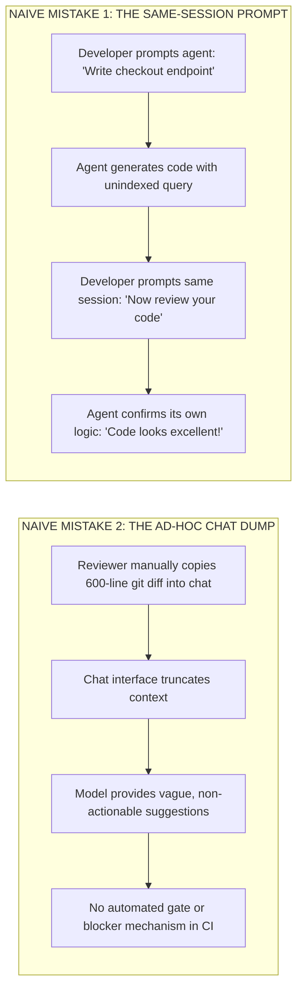
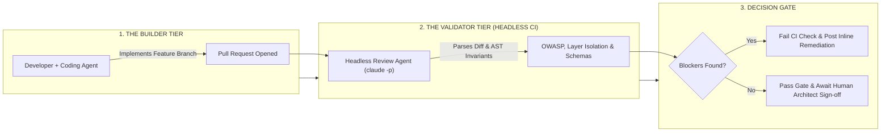
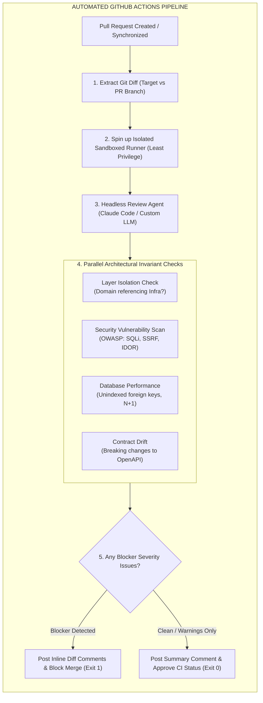
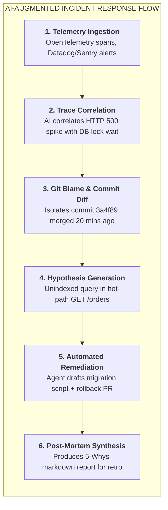

# Headless CI/CD Review Bots: Builder-Validator Isolation & Automated PR Auditing

| Depth Tier | Recommended Audience | Estimated Completion Time | Key Prerequisites |
|---|---|---|---|
| `🟡 IMPORTANT / NEXT` | Senior Engineers, Tech Leads, Architects | ~22 minutes | Lesson 01 (Autonomous Toolchains & Loops) |

> **Core Concept**: Deploying autonomous coding agents non-interactively in CI/CD pipelines to enforce the Builder-Validator Chain, eliminating human reviewer fatigue and catching subtle security, schema drift, and layer violations before pull request merge.

---

## 1. The Architectural Problem

In traditional software development, code review is the primary defense against production defects. A senior engineer spends 30–60 minutes reviewing a pull request, looking for logic errors, missing edge cases, security vulnerabilities, and stylistic deviations.

In the AI-augmented era, this manual review model breaks down:
- **Diff Volume Explosion**: With coding agents generating code rapidly, teams produce 3–5x more pull requests daily.
- **Reviewer Cognitive Overload**: Human reviewers face hundreds of lines of AI-generated diffs, leading to severe review fatigue.
- **Rubber-Stamp Approvals**: Reviewers glance at code formatting, verify that CI tests passed, and approve PRs within minutes without inspecting boundary conditions.
- **Review Latency Bottleneck**: PRs sit unmerged for days because senior engineers are overwhelmed by review queues, neutralizing the velocity gains of AI authoring.

To break this bottleneck, enterprise engineering organizations deploy **Headless CI/CD Agents**—non-interactive AI review bots integrated directly into pipeline automation (e.g., GitHub Actions, GitLab CI).

---

## 2. Why Naive Approaches Fail: Author-Reviewer Bias

When developers or teams attempt to use AI for code review naively, they usually make one of two critical errors:



### 1. Same-Session Author-Reviewer Bias
An LLM that generated a piece of code inside a specific conversation context has conditioned its attention weights on its own decisions. Asking the same agent in the same session to "review its own code" rarely uncovers defects. The agent repeats its earlier blind spots.

### 2. Lack of Automated CI Enforcement
Manual chat-based reviews are disconnected from the build pipeline. Even if a chat assistant flags a potential SQL injection vulnerability, there is no automated gate preventing the PR from being merged into main.

---

## 3. The Core Mental Model: The Builder-Validator Chain

Imagine pre-flight inspection for commercial aircraft:
- The maintenance crew (The Builder) finishes repairing the hydraulic braking system.
- The airline does not ask the repair technician: *"Did you do a good job?"*
- Instead, an independent **Quality Assurance Inspector** (The Validator) approaches the aircraft with a separate checklist, independent diagnostic gauges, and zero personal attachment to the repair.
- The aircraft cannot be cleared for takeoff until the independent inspector signs off.



In AI-native engineering, this is the **Builder-Validator Chain**: the agent or engineer that authored the feature is physically and semantically separated from the automated validator agent running headlessly in CI.

---

## 4. Architecture & Mechanics: Headless Non-Interactive Execution

Modern autonomous CLI agents (such as Claude Code) support non-interactive execution modes designed specifically for automated pipelines:

```bash
# Non-interactive, headless execution emitting machine-parseable JSON
claude -p \
  --output-format json \
  --json-schema 'contracts/schemas/pr-review-verdict.json' \
  "Review the staged git diff against rules in AGENT.md. Flag any layer violations or unindexed queries."
```

### The Key Headless CLI Flags
- **`-p` / `--print`**: Runs the agent in non-interactive print mode. The agent reads the context, executes its reasoning, outputs the response to stdout, and exits cleanly with code 0 or 1 without waiting for keyboard input.
- **`--output-format json`**: Emits structured JSON rather than conversational markdown, enabling CI runners to parse verdicts programmatically using tools like `jq`.
- **`--json-schema <path>`**: Constrains the model's output to conform strictly to a predefined JSON Schema, guaranteeing that fields like `has_blockers`, `severity`, and `inline_comments` exist.
- **`--bare`**: Skips loading local user hooks or interactive terminal animations for predictable, hermetic execution inside containerized CI runners.

---

## 5. Automated PR Review Pipeline Architecture



### Step-by-Step Walkthrough
1. **Trigger & Diff Extraction**: On every `pull_request` event, the workflow extracts the unified git diff between the target branch (`main`) and the PR branch.
2. **Sandboxed Runner Execution**: The job runs inside an ephemeral, isolated container with read-only permissions on repository code, preventing unvetted scripts from altering branches.
3. **Automated Invariant Inspection**: The review agent evaluates the diff against four non-negotiable vectors:
   - *Layer Isolation*: Ensures domain models do not import database contexts or HTTP frameworks.
   - *Security*: Checks for unsanitized inputs, hardcoded secrets, or prompt injection vectors.
   - *Performance*: Flags missing indexes on foreign key columns and unbounded queries.
   - *Contract Drift*: Verifies that OpenAPI schemas remain backward-compatible.
4. **Enforcement Gate**: If any blocker issue is detected, the bot posts inline remediation comments and fails the status check, preventing merge until fixed.

---

## 6. Incident Response & Automated Root Cause Analysis (RCA)

The same headless agentic pattern transforms production incident response. When alerts trigger, automated triage bots correlate real-time telemetry with recent code commits:



### Production Example: Automated RCA Generated by Incident Bot
```markdown
# Incident RCA Report: INC-2026-09-8821
**Severity:** SEV-1 (Production API Partial Outage)  
**Duration:** 28 minutes (14:10 UTC – 14:38 UTC)  
**Impact:** 14.2% of checkout attempts failed with HTTP 500.

## Root Cause Analysis (Five-Whys)
1. **Why did checkouts fail?** PostgreSQL queries timed out with error `55P03: lock_not_available`.
2. **Why were locks unavailable?** The `ProcessOrder` transaction held an exclusive table lock on `CustomerLoyalty`.
3. **Why did it hold an exclusive lock?** A newly added query executed an `UPDATE` without an index on `CustomerExternalId`.
4. **Why was the index missing?** The agent that generated migration `0042_add_loyalty.sql` did not specify an index.
5. **Why was it merged?** The PR review bot rule for SQL performance was disabled for files under `migrations/`.

## Remediation & Preventative Actions
- [x] Applied hotfix migration adding `CONCURRENTLY` index on `CustomerLoyalty(CustomerExternalId)`.
- [x] Restored PR review bot rule: Mandatory `EXPLAIN ANALYZE` evaluation for all schema additions.
```

---

## 7. Trade-offs & Telemetry

| Dimension | Manual Peer Review Only | Automated Headless Review Bot |
|---|---|---|
| **Time to First Review (TTFR)** | 2.5–6.0 hours (human latency) | **Sub-60 seconds (immediate CI run)** |
| **Review Fatigue Resistance** | Low (degrades after 3rd PR of the day) | **Infinite (consistent across 1,000 PRs)** |
| **Architectural Depth** | Good at high-level business nuance | Exceptional at syntax, security, and layer rules |
| **Operational Expenditure** | High developer salary time | $0.05–$0.20 in token costs per PR review |

---

## 8. Production Failure Modes & Anti-Patterns

### Anti-Pattern: Unbounded Write Permissions in CI Review Bots
- **The Failure**: Granting the automated review bot full repository write permissions to directly commit "fixes" onto the PR branch.
- **The Blast Radius**: If the review bot hallucinates or misinterprets an architectural requirement, it can overwrite developer work or push insecure code directly into the candidate branch.
- **The Remediation**: Enforce the **Principle of Least Privilege**. Review bots must have strictly read-only access to source code and comment-only permissions on PRs. All code changes must be accepted by a human engineer.

---

## 🧭 Navigation

| Role | Target Resource |
|---|---|
| **Previous Lesson** | [Lesson 04: Designing AI-Friendly Codebases](./04-architecting-ai-friendly-codebases.md) |
| **Phase Overview** | [Phase 08 Hub: AI-Augmented SDLC & Leadership](./README.md) |
| **Next Lesson** | [Lesson 06: AI Engineering Productivity & Rework Metrics](./06-ai-developer-productivity-and-rework-metrics.md) |
| **Hands-On Capstone** | [Capstone Lab: AI-Native Repository Framework](./labs/capstone-ai-native-repository.md) |
