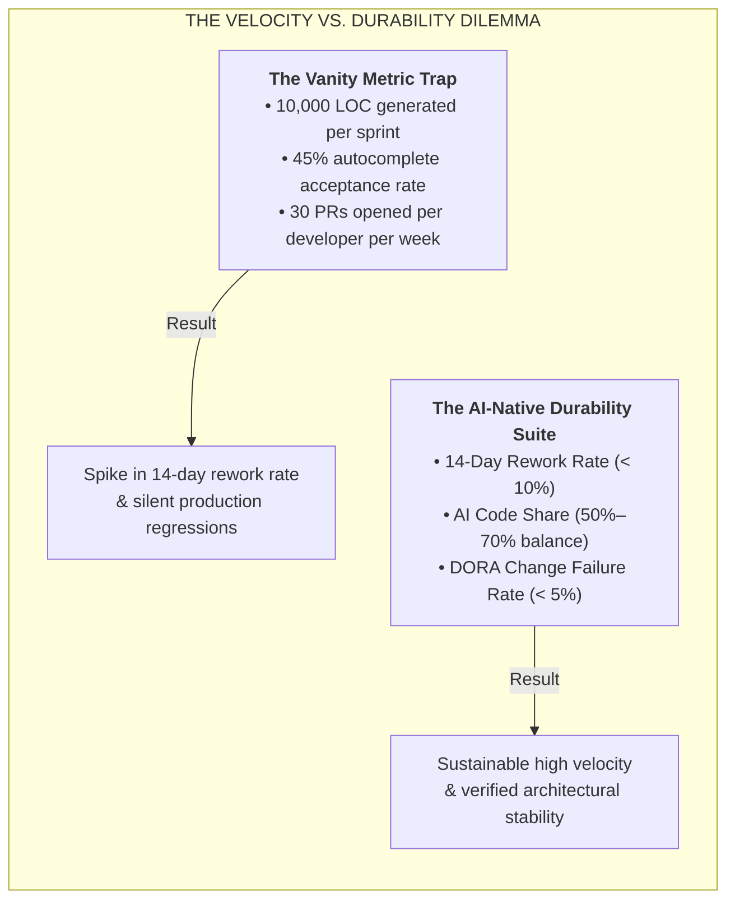
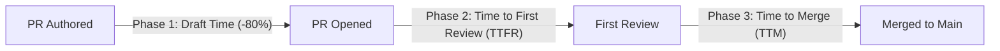
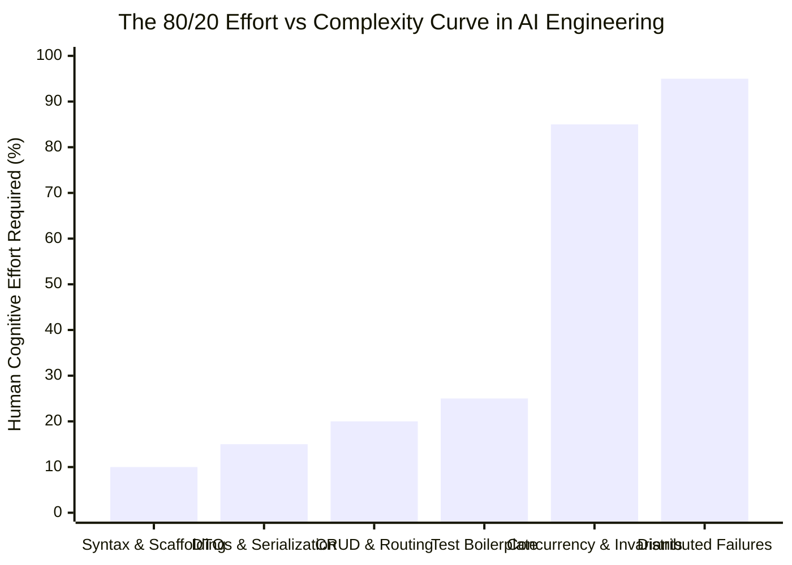
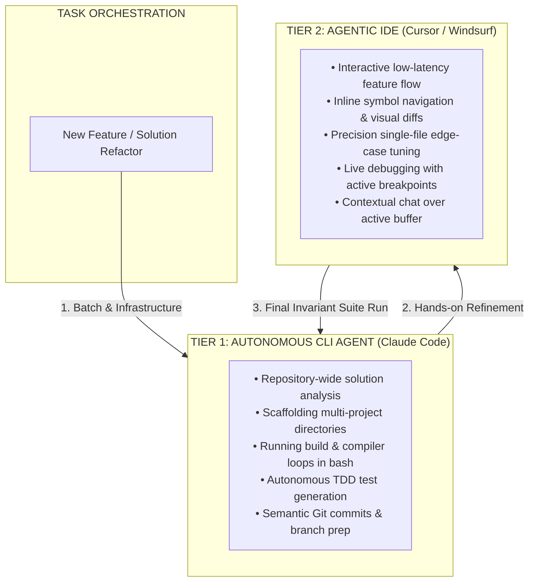

# AI Engineering Productivity: 14-Day Rework Rate, AI Code Share & DORA Metrics

| Depth Tier | Recommended Audience | Estimated Completion Time | Key Prerequisites |
|---|---|---|---|
| `🟡 IMPORTANT / NEXT` | Senior Engineers, Tech Leads, Engineering Directors | ~20 minutes | Lesson 01 (The AI-Native SDLC Paradigm) |

> **Core Concept**: Measuring developer efficiency in the era of Software 3.0 by abandoning flawed vanity metrics (Lines of Code, autocomplete acceptance) and instituting durable engineering metrics: 14-day rework rate, AI Code Share bounds, and DORA change failure rates.

---

## 1. The Architectural Problem

When an engineering executive invests $50,000 in enterprise AI coding licenses, they inevitably ask the lead architect:
```text
"Are our engineering teams 40% faster? What metrics prove our return on investment?"
```

If an engineering lead responds with traditional software metrics—**Lines of Code (LOC) produced**, **Commit Velocity**, or **Autocomplete Suggestion Acceptance Rate**—they are measuring how fast the organization is accumulating technical debt.

In the era of autonomous agents:
- Generating 10,000 lines of boilerplate code takes less than 30 seconds. Measuring LOC rewards code explosion and duplicate utility sprawl.
- Measuring "Suggestion Acceptance Rate" rewards rubber-stamping: an engineer blindly accepting tab-completions scores higher than a staff engineer who rejects an AI hallucination.
- Measuring "Closed Story Points" breaks down because story pointing was invented to estimate human typing and syntax translation complexity, which agents render near-instantaneous.

To evaluate real productivity, engineering leaders must measure **engineering durability and cognitive leverage** rather than raw text generation.

---

## 2. Why Naive Approaches Fail: The Vanity Metric Trap



When teams optimize for vanity metrics, engineers are incentivized to prompt agents for massive code dumps. The immediate output looks impressive on management dashboards. But two weeks later, the team's velocity halts: developers are consumed by debugging unhandled concurrency bugs, patching unindexed database queries, and rewriting brittle agent-generated logic.

---

## 3. The Core Mental Model: The Bricklayer's Mortar Cannon

Imagine a construction site where a bricklayer acquires a high-speed robotic mortar cannon capable of laying 5,000 bricks before lunch:
- A naive project manager measuring **"bricks laid per day"** declares the mason a 10x superstar.
- But two weeks later, the structural engineer inspects the building. Every eighth brick is tilted five degrees off plumb. The mortar did not cure properly because the mason was moving too fast. The entire third floor must be condemned, demolished, and relaid by hand.
- If you do not measure **"how many walls are still standing upright after 14 days"**, high code generation is simply accelerated demolition.

---

## 4. Architecture & Mechanics: The Core AI-Specific Metric Suite

Senior architects evaluate team productivity using three primary AI-native durability metrics:

### Metric 1: AI Code Share (%)
Measures the proportion of committed code synthesized by AI versus authored directly by human engineers:

```text
AI Code Share (%) = (Lines of Code / AST Nodes Synthesized by AI / Total Committed Lines / AST Nodes) * 100
```

- **The Strategic Benchmark**:
  - **Healthy Monitored Range (50%–70%)**: Indicates high leverage on boilerplate, CRUD scaffolding, DTO mappings, migration scripts, and test harnesses.
  - **The Danger Zone (> 85%)**: Indicates developers are "vibe coding"—copying wholesale agent generations without deep mental modeling of domain logic.
  - **The Domain Invariant Rule (< 25%)**: Core business rules, cryptographic primitives, and authorization middleware should maintain an AI Code Share of under 25%, requiring hands-on human architectural ownership.

---

### Metric 2: AI vs. Human PR Cycle Time
Track PR velocity by dissecting the cycle into three distinct operational intervals:



| Phase | Human Baseline | AI-Augmented Baseline | Lead Architect Takeaway |
|:---|:---|:---|:---|
| **Authoring Time** | 4.5 Hours | **45 Minutes (-80%)** | Agents write code rapidly; initial draft speed is rarely the bottleneck. |
| **Time to First Review (TTFR)** | 2.5 Hours | **4.2 Hours (+68% Danger)** | **The Bloat Trap**: If developers submit 800-line AI diffs without summaries, reviewers experience cognitive fatigue and delay reviews. |
| **Time to Merge (TTM)** | 28 Hours | **2.5 Hours (-91% Optimized)** | Achieved **only** when automated AI review bots pre-verify schema drift and test invariants before humans review. |

---

### Metric 3: The 14-Day Rework Rate (Code Churn)
Measures the percentage of code that must be rewritten, modified, or deleted shortly after merging:

```text
14-Day Rework Rate (%) = (Lines Added in PR Modified or Deleted within 14 Days / Total Lines Added in Original PR) * 100
```

- **The Canary in the Coal Mine**:
  - **Industry Human Baseline**: 6%–9% code churn within 14 days.
  - **Vibe Coding Codebases**: Frequently spikes to **24%–38%**. The code compiled on Day 1, but broke under staging loads, missed business edge cases, or conflicted with adjacent services on Day 8.
  - **The Target for Verified AI Engineering**: Maintain 14-day rework **below 10%**. If this metric trends upward over two consecutive sprints, pause feature work to audit repository context standards and review gates.

---

## 5. The 80/20 Effort vs. Complexity Dynamic

In autonomous software development, the Pareto principle manifests in a non-linear cognitive dynamic:



- **The 80% (Fast Path)**: AI coding assistants can generate 80% of any enterprise feature—API routes, data transfer objects, entity definitions, SQL queries, and basic test assertions—in **20% of the total time**.
- **The 20% (The Architectural Crucible)**: The remaining 20% of the system—race condition mitigation, database transaction boundaries, distributed state consensus, graceful degradation under network partitions, and strict authorization invariants—requires **80% of the senior engineer's cognitive energy**.
- **The Failure Mode**: Naive engineering leads assume that because an agent generated the first 80% in 15 minutes, it can generate the remaining 20% in 5 minutes. Attempting to automate the final 20% with vague prompts leads directly to production outages.

---

## 6. Dual-Tool Workflows: CLI Agent + Agentic IDE

High-performing senior engineers in 2026 do not force a false choice between a CLI assistant and an IDE assistant. They orchestrate a **Dual-Tool Workflow**, pairing specialized tools according to task granularity:



- **When to Use the CLI Agent (Claude Code)**:
  - Multi-file refactorings spanning 20+ files across multiple solution folders.
  - Automated dependency modernization (upgrading packages and fixing breaking compiler diagnostics).
  - Writing the initial test suite against an OpenAPI specification before opening an editor.
- **When to Use the Agentic IDE (Cursor / Windsurf)**:
  - Flow-state interactive programming where visual diffs, tab autocompletion, and editor breakpoints matter.
  - Inspecting UI/UX components and localized business logic.
  - Precision surgical edits where the engineer wants line-by-line review before accepting diffs.

---

## 7. Vanity Metrics vs. Value Metrics Comparison

| Vanity / Flawed Metric | Why It Fails in AI SDLC | Modern AI-Native Replacement | Target Production Benchmark |
|:---|:---|:---|:---|
| **Lines of Code (LOC) Produced** | Rewards boilerplate explosion and encourages copy-paste bloat. | **Semantic AST Density & AI Code Share %** | 50%–70% overall AI share; < 25% in core domain invariants. |
| **Suggestion Acceptance Rate** | Measuring accepted autocompletions encourages low-friction rubber-stamping. | **14-Day Rework Rate (Code Churn)** | < 10% of merged PR lines modified within 14 days. |
| **Commit Velocity / Day** | Agents make 20 micro-commits trivial; measures noise, not progress. | **Time to Merge (TTM) with Invariant Gates** | < 4 Hours from branch creation to production merge. |
| **Story Points Burned** | AI makes estimating based on typing complexity obsolete. | **DORA Change Failure Rate (CFR)** | < 5% of releases causing customer-facing degradation. |
| **PR Review Latency** | Humans delay reviews when presented with uncontextualized AI code dumps. | **Reviewer Cognitive Load Index** | Diff < 300 lines, accompanied by automated invariant verification proof. |

---

## 8. Production Failure Modes & Anti-Patterns

### Anti-Pattern: The Codebase Domain Knowledge Atrophy
- **The Failure Mode**: Engineers rely exclusively on coding agents to navigate and edit unfamiliar codebases, never reading the underlying data models or understanding transaction boundaries.
- **The Consequence**: During a critical production outage where AI assistants are unavailable or hallucinating, engineers cannot diagnose or fix the root cause manually.
- **The Remediation**: Conduct regular architecture walkthroughs and manual incident post-mortems. Rotate engineers through maintenance drills where they inspect and trace systems without AI assistance.

---

## 🧭 Navigation

| Role | Target Resource |
|---|---|
| **Previous Lesson** | [Lesson 05: Headless CI/CD Review Bots & Automated Gates](./05-headless-ci-cd-agents-and-automated-review-gates.md) |
| **Phase Overview** | [Phase 08 Hub: AI-Augmented SDLC & Leadership](./README.md) |
| **Next Lesson** | [Lesson 07: Enterprise AI Delivery Governance & Accelerators](./07-enterprise-ai-delivery-governance-and-accelerators.md) |
| **Hands-On Capstone** | [Capstone Lab: AI-Native Repository Framework](./labs/capstone-ai-native-repository.md) |
