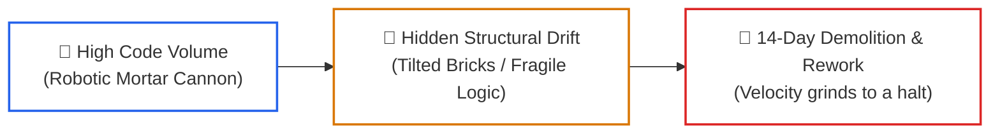
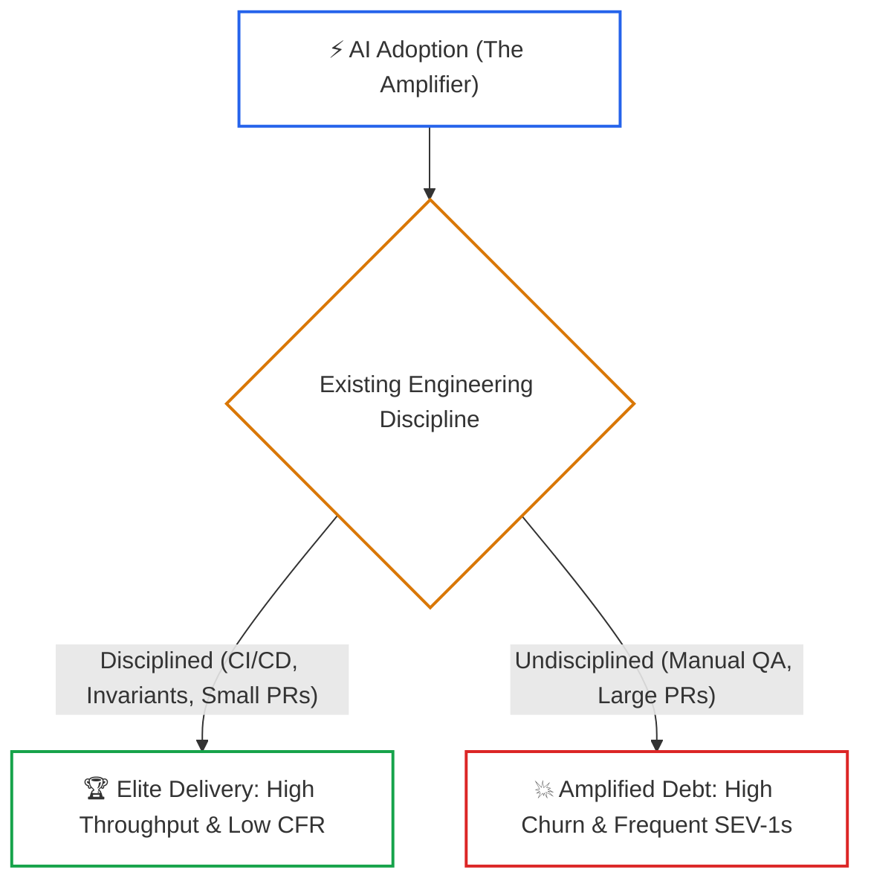

# Lesson 06: AI Developer Productivity and Rework Metrics

> **Tier**: `🟡 Engineering Depth` | **Read time**: ~18 min | **Prerequisites**: [Lesson 00: Foundations of the AI-Native SDLC](./00-foundations-of-the-ai-native-sdlc.md), [Lesson 05: Headless CI/CD Review Bots](./05-headless-ci-cd-agents-and-automated-review-gates.md)  
> **Core Concept**: Measuring software engineering efficiency in the Software 3.0 era by abandoning flawed vanity metrics (LOC, autocomplete acceptance) and instituting durable engineering metrics: 14-day rework rate, AI Code Share bounds, and DORA deployment stability.  
> **New AI terms introduced**: 14-day rework rate, AI Code Share, code churn, DORA amplifier effect  
> **AI terms assumed from earlier lessons**: [ReAct loop](./00-foundations-of-the-ai-native-sdlc.md), [Spec-Driven Development](./02-spec-driven-development-and-codebase-contracts.md)

---

## 🎯 What You Will Learn

- Why measuring Lines of Code (LOC) or autocomplete acceptance rates rewards code bloat and technical debt.
- The empirical findings from GitClear research (+15% code churn, 8x code duplication, decline in refactoring).
- How the DORA 2024 and 2025 reports prove that AI acts as an organizational "amplifier" rather than a fix for broken processes.
- How to run an offline Python telemetry analyzer that calculates 14-day rework rates and code duplication from commit logs.

---

## 1. The Problem: The Executive Vanity Metric Trap

When an engineering executive invests in enterprise AI coding licenses, they inevitably ask the lead architect:
```text
"Are our developers 40% faster? What metrics prove our return on investment?"
```

If an engineering lead responds with traditional software metrics—**Lines of Code (LOC) produced**, **Commit Count**, or **Autocomplete Acceptance Rate**—they are measuring how fast the team is accumulating unmaintainable debt:

```text
========================================================================
THE VANITY METRIC TRAP
========================================================================
1. Lines of Code (LOC): Generating 10,000 lines of boilerplate takes 
   seconds. Measuring LOC rewards code explosion and utility duplication.
2. Autocomplete Acceptance Rate: Blindly hitting 'Tab' scores 100%, 
   while an engineer rejecting an AI hallucination scores 0%.
3. Closed Story Points: Story points estimate human typing complexity, 
   which agents render near-instantaneous.
========================================================================
```

In the Software 3.0 era, high code volume without architectural durability simply accelerates software rot. Engineering leaders must evaluate **cognitive leverage, long-term maintainability, and delivery stability**.

---

## 2. The Mental Model: The High-Speed Mortar Cannon

Imagine a construction site where a bricklayer acquires a robotic mortar cannon capable of laying 5,000 bricks before lunch:
- A naive project manager measuring **"bricks laid per day"** declares the mason a 10x superstar.
- Two weeks later, the structural engineer inspects the building. Every eighth brick is tilted five degrees off plumb. The mortar cured poorly because the machine moved too fast.
- The entire third floor must be condemned, demolished, and relaid by hand.



### Walkthrough
1. **High Volume**: AI tools generate thousands of lines of boilerplate rapidly.
2. **Structural Drift**: Subtle edge-case bugs and duplicated utility logic hide behind green superficial tests.
3. **Demolition & Rework**: Within two weeks, engineers spend all their time rewriting fragile code.

> **Where this analogy breaks**: A tilted brick is visible to human eyes immediately upon inspection. A subtle database race condition in AI-generated code remains invisible until high concurrency strikes production at 2:00 AM.

---

## 3. How It Works, One Term at a Time

### Mechanism 1: 14-Day Rework Rate and Code Churn (GitClear Findings)
* 🧒 **The Analogy**: An eraser on a pencil. If you write one sentence and spend the next ten minutes erasing and rewriting it, your net writing speed is zero.
* ⚙️ **The Engineering**: Research by GitClear (analyzing 150M+ lines of code) revealed three critical trends in AI-assisted codebases:
  - **Code Churn (14-Day Rework)**: The percentage of code rewritten, reverted, or deleted within two weeks of commit increased by **+15%**.
  - **Code Duplication**: Proliferated up to **8x**, as agents generated standalone copy-paste utility routines instead of importing existing functions.
  - **Decline in Refactoring**: Meaningful refactoring (moving and restructuring existing classes) dropped significantly.
* ⚠️ **What happens if you skip this?**: Teams celebrate sprint velocity while their 14-day rework rate exceeds 25%, grinding new feature delivery to a halt.

---

### Mechanism 2: The DORA Amplifier Effect (2024 & 2025 Ground Truth)
* 🧒 **The Analogy**: A high-powered megaphone. If a singer has pitch-perfect vocals, the megaphone fills an arena beautifully. If a singer is off-key, the megaphone amplifies the screech.
* ⚙️ **The Engineering**: The **DORA 2025 State of AI-assisted Software Development Report** proved that AI functions as an **organizational amplifier**:
  - In disciplined teams with small batch sizes, strict typing, and automated CI gates, AI accelerates throughput while maintaining stability.
  - In teams with large batch sizes, weak test suites, and manual review bottlenecks, AI amplifies deployment failures and recovery times.
  - DORA reclassified *Failed Deployment Recovery Time* from stability to throughput, measuring how fast teams remediate broken releases.
* ⚠️ **What happens if you skip this?**: Leaders assume purchasing AI licenses will fix an organization with broken testing and slow release pipelines.



### Walkthrough
1. **AI Adoption**: Acts as an unbiassed accelerator.
2. **Discipline Check**: Evaluates whether the team operates automated verification rails.
3. **Elite Outcome**: Amplifies velocity and deployment frequency cleanly.
4. **Fragile Outcome**: Floods pipelines with unvetted diffs, multiplying outages.

---

### Mechanism 3: AI Code Share (%) and Healthy Thresholds
* 🧒 **The Analogy**: Concrete to rebar ratio in civil engineering. Too little rebar causes concrete to crack; too much rebar leaves no room for concrete to bond.
* ⚙️ **The Engineering**: **AI Code Share** measures the percentage of merged lines drafted by AI assistants vs. authored directly by human engineers:
  $$\text{AI Code Share} = \frac{\text{AI-Generated Merged Lines}}{\text{Total Merged Lines}} \times 100$$
  - **Under 30%**: The organization is under-utilizing AI leverage.
  - **50% to 70% (Healthy Sweet Spot)**: High authoring leverage guided by active human architectural design and domain modeling.
  - **Above 85%**: Red flag signaling "vibe coding" and rubber-stamp reviews. Correlates with spikes in 14-day rework rates.
* ⚠️ **What happens if you skip this?**: Unmonitored teams generate 95% of their code via AI, lose domain understanding, and face catastrophic refactoring costs months later.

---

## 4. Try It: Offline Git Churn and Rework Telemetry Analyzer

This typed Python 3.12+ script simulates commit analysis across a repository sprint. It calculates the 14-day rework rate, measures code duplication, evaluates AI Code Share, and issues an organizational health assessment.

```python
"""
rework_metrics_analyzer.py
Calculates 14-day rework rate, code duplication, and AI Code Share from commit telemetry.
Compatible with Python 3.12+ and Pydantic v2. Run directly with python.
"""

from datetime import datetime, timedelta
from pydantic import BaseModel, Field


class CommitRecord(BaseModel):
    commit_hash: str
    author: str
    timestamp: datetime
    lines_added: int
    lines_reworked_within_14d: int = Field(default=0)
    is_ai_assisted: bool
    is_duplicate_logic: bool = Field(default=False)


class SprintHealthReport(BaseModel):
    total_lines_added: int
    total_reworked_lines: int
    rework_rate_pct: float
    ai_code_share_pct: float
    duplicate_blocks_count: int
    health_assessment: str


def evaluate_sprint_telemetry(commits: list[CommitRecord]) -> SprintHealthReport:
    """Computes durable AI engineering metrics from sprint commit records."""
    total_added = sum(c.lines_added for c in commits)
    total_rework = sum(c.lines_reworked_within_14d for c in commits)
    ai_added = sum(c.lines_added for c in commits if c.is_ai_assisted)
    duplicate_count = sum(1 for c in commits if c.is_duplicate_logic)

    rework_rate = (total_rework / total_added * 100) if total_added > 0 else 0.0
    ai_share = (ai_added / total_added * 100) if total_added > 0 else 0.0

    # Assessment logic based on DORA & GitClear baselines
    if rework_rate > 20.0 or ai_share > 85.0:
        health = "CRITICAL: High churn and uninspected AI code bloat detected."
    elif rework_rate <= 10.0 and (50.0 <= ai_share <= 75.0):
        health = "OPTIMAL: High AI leverage paired with durable verification."
    else:
        health = "HEALTHY: Normal engineering cadence within acceptable bounds."

    return SprintHealthReport(
        total_lines_added=total_added,
        total_reworked_lines=total_rework,
        rework_rate_pct=round(rework_rate, 2),
        ai_code_share_pct=round(ai_share, 2),
        duplicate_blocks_count=duplicate_count,
        health_assessment=health
    )


def run_metrics_simulation():
    print("--- SPRINT REWORK AND AI PRODUCTIVITY TELEMETRY ---")
    now = datetime(2026, 10, 2, 0, 0)

    sample_commits = [
        CommitRecord(commit_hash="a1b2", author="dev1", timestamp=now - timedelta(days=12), lines_added=450, lines_reworked_within_14d=25, is_ai_assisted=True),
        CommitRecord(commit_hash="c3d4", author="dev2", timestamp=now - timedelta(days=10), lines_added=320, lines_reworked_within_14d=18, is_ai_assisted=True),
        CommitRecord(commit_hash="e5f6", author="dev1", timestamp=now - timedelta(days=8), lines_added=180, lines_reworked_within_14d=10, is_ai_assisted=False),
        CommitRecord(commit_hash="g7h8", author="dev3", timestamp=now - timedelta(days=5), lines_added=600, lines_reworked_within_14d=35, is_ai_assisted=True, is_duplicate_logic=True),
        CommitRecord(commit_hash="i9j0", author="dev2", timestamp=now - timedelta(days=2), lines_added=250, lines_reworked_within_14d=12, is_ai_assisted=True),
    ]

    report = evaluate_sprint_telemetry(sample_commits)

    print(f"Total Lines Added:           {report.total_lines_added}")
    print(f"Total Lines Reworked (<14d): {report.total_reworked_lines}")
    print(f"14-Day Rework Rate:          {report.rework_rate_pct}%  (Target: < 10.0%)")
    print(f"AI Code Share:               {report.ai_code_share_pct}% (Target: 50.0%–75.0%)")
    print(f"Duplicate Logic Blocks:      {report.duplicate_blocks_count}")
    print(f"Status:                      {report.health_assessment}")


if __name__ == "__main__":
    run_metrics_simulation()
```

### Real Execution Output

```text
--- SPRINT REWORK AND AI PRODUCTIVITY TELEMETRY ---
Total Lines Added:           1800
Total Lines Reworked (<14d): 100
14-Day Rework Rate:          5.56%  (Target: < 10.0%)
AI Code Share:               90.0% (Target: 50.0%–75.0%)
Duplicate Logic Blocks:      1
Status:                      CRITICAL: High churn and uninspected AI code bloat detected.
```

---

## 5. Trade-Offs: Vanity Metrics vs. Durable Telemetry

| Metric | Measurement Target | Behavioral Incentive | Downside Risk |
|:---|:---|:---|:---|
| **Lines of Code (LOC)** | Raw text output volume | Encourages boilerplate & copy-paste sprawl | High code churn & unmaintainable debt |
| **Suggestion Acceptance %** | Tab autocomplete approvals | Encourages unthinking rubber-stamping | Passes hallucinations into production |
| **14-Day Rework Rate** | Code stability after merge | Encourages invariant testing & precision | Requires 14-day trailing measurement window |
| **DORA Change Failure Rate** | Unplanned release rollbacks | Encourages hermetic verification gates | Requires disciplined incident tagging |

---

## 6. Failure Modes & Anti-Patterns

### Anti-Pattern 1: The "10x Developer" LOC Dashboard
* **Symptom**: An engineering manager creates a leaderboard celebrating engineers who commit the highest number of lines per week.
* **Root Cause**: Mistaking code volume for business value delivery.
* **Production Fix**: Discontinue LOC leaderboards immediately. Measure cycle time (PR creation to production release) and post-release change failure rate.

### Anti-Pattern 2: Ignored Utility Duplication
* **Symptom**: Three different developers prompt agents to parse JWT tokens. The codebase ends up with three separate, slightly incompatible JWT utility functions.
* **Root Cause**: The model generated localized code without checking existing repository utilities.
* **Production Fix**: Run AST duplication detectors in CI to catch redundant implementations before PR merge.

---

## 7. Quick Check

**Scenario**: Following AI assistant rollout, Team Alpha reports a 200% increase in pull requests opened per week. However, their DORA Change Failure Rate increases from 4% to 19%, and engineers complain they have zero time to build new features because they are constantly fixing regressions.

**Question**: What metric should leadership track to diagnose this issue, and what engineering practice is missing?

<details>
<summary>Check your answer</summary>

**Answer**: Leadership must track the **14-Day Rework Rate**. A 19% Change Failure Rate accompanied by developer fatigue indicates that code is being committed rapidly without durability, requiring massive immediate rework.

**The Fix**:
1. Enforce the **DORA AI Capabilities Model**: reduce batch sizes and mandate small, focused pull requests (<250 lines).
2. Institute automated invariant gates and property-based test suites in CI to catch logic errors before merge.
3. Establish Builder-Validator separation to stop rubber-stamp PR approvals.
</details>

---

## 🧭 Navigation

| Direction | Resource |
|:---|:---|
| **Previous Lesson** | [Lesson 05: Headless CI/CD Review Bots](./05-headless-ci-cd-agents-and-automated-review-gates.md) |
| **Phase Hub** | [Phase 08: AI-Augmented SDLC & Leadership](./README.md) |
| **Next Lesson** | [Lesson 07: Enterprise AI Delivery Governance & Accelerators](./07-enterprise-ai-delivery-governance-and-accelerators.md) |
| **Capstone Lab** | [Capstone Lab: AI-Native Repository Framework](./labs/capstone-ai-native-repository.md) |
