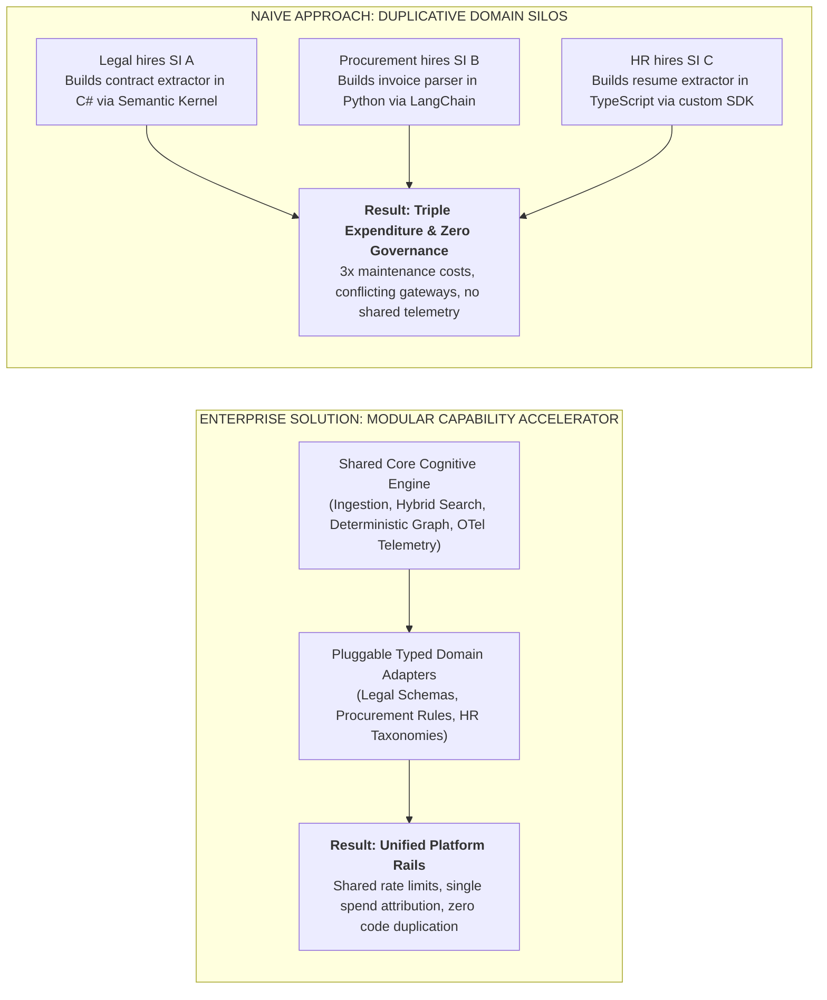
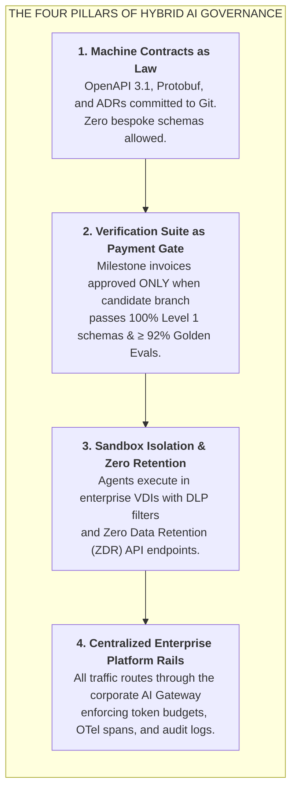
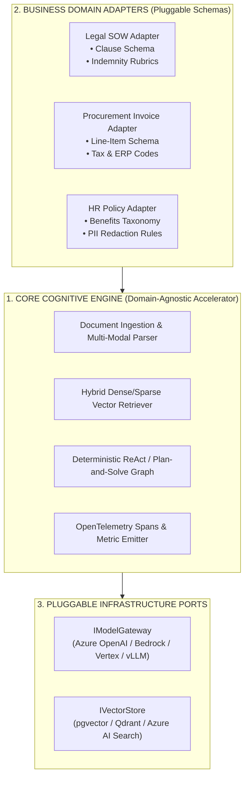
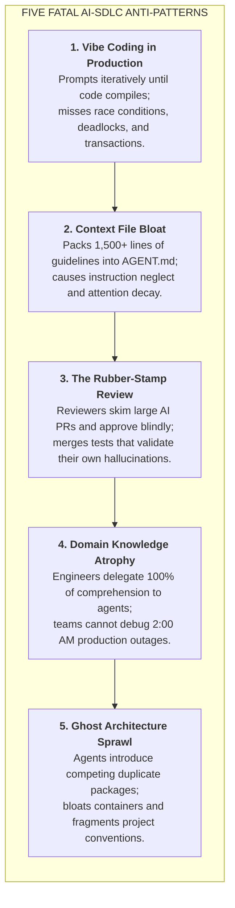

# Enterprise AI Delivery: Governing Hybrid Teams & Modular Capability Accelerators

| Depth Tier | Recommended Audience | Estimated Completion Time | Key Prerequisites |
|---|---|---|---|
| `🔵 ADVANCED / SPECIALIZED` | Staff Engineers, Solutions Architects, Engineering Directors | ~25 minutes | Lesson 02 (Spec-Driven Development), Lesson 05 (Headless CI/CD) |

> **Core Concept**: Technical governance of hybrid enterprise delivery teams (internal platform + external systems integrators) using executable ADR contracts, and designing pluggable, domain-agnostic AI capability accelerators that eliminate duplicative business silos.

---

## 1. The Architectural Problem

Large enterprise AI initiatives rarely happen in isolated engineering silos. Strategic digital transformations almost always involve **hybrid delivery models**: internal core platform teams collaborating with external Systems Integrators (SIs), boutique AI consultancies, and staff augmentation partners.

Without seasoned technical leadership and rigid architectural governance, these hybrid engagements rapidly descend into technical fragmentation, vendor lock-in, and unmaintainable debt:
- External partners are commercially incentivized for **velocity to demo**—shipping a flashy proof-of-concept in six weeks to trigger contractual milestone sign-offs.
- In doing so, external teams often hardcode proprietary third-party libraries, embed raw API keys in controllers, write superficial unit tests with mocked fixtures that hide prompt hallucinations, and roll off after six months, leaving internal engineering with an unmaintainable "black-box" asset.
- Concurrently, multiple internal business units (Legal, Procurement, HR) hire different consultancies to solve the exact same problem (e.g., document parsing), incurring 3x licensing fees, 3x maintenance overhead, and zero architectural reuse.

To succeed at enterprise scale, Lead Architects must institute **The Four Pillars of Hybrid AI Delivery** and construct **Modular AI Capability Accelerators**.

---

## 2. Why Naive Approaches Fail: The Duplicative Silo Trap



When business domains operate independently without architectural oversight, they reinvent the same cognitive retrieval, extraction, and evaluation infrastructure. The resulting architectures cannot share cache tiers, cannot unify rate limits, and fragment enterprise observability.

---

## 3. The Core Mental Model: The Four Pillars of Hybrid Delivery Governance

To maintain architectural integrity across hybrid teams, senior architects mandate four non-negotiable operational pillars:



### 1. Machine Contracts (ADRs & Schemas) as Inviolable Law
Before external developers write a single prompt or line of code, internal architects publish **Architecture Decision Records (ADRs)** and formal interface contracts (OpenAPI 3.1, JSON Schema, Protobuf). External partners cannot invent bespoke data schemas or bypass established hexagonal boundaries.

### 2. The Verification Harness as Contractual Acceptance Gate
Commercial contracts with external delivery partners must explicitly tie milestone acceptance and invoice payments to automated verification test suites:
- 100% pass rate on Level 1 deterministic schema and type assertions.
- Greater than or equal to 92% accuracy on the enterprise Golden Evaluation Benchmark (Level 2 LLM-as-a-judge).
- Algorithmic fairness invariants (Disparate Impact Ratio DIR ≥ 0.80 via Fairlearn).
- Latency and cost SLAs (Time-to-First-Token TTFT < 800ms, token envelope adherence).
- *"Demo vibes" in an executive steering committee do not constitute delivery.*

### 3. Context Boundary Isolation & IP Sanitization
External partner coding agents (Cursor, Windsurf, Claude Code) must run within isolated enterprise virtual desktop infrastructure (VDI) or corporate developer sandboxes. Strict Data Loss Prevention (DLP) filters prevent proprietary code or customer PII from leaking to unvetted models. All endpoints must feature **Zero Data Retention (ZDR)** agreements.

### 4. Centralized Enterprise Platform Rails
External teams are never issued raw cloud provider credentials. All model calls route through the enterprise **AI Gateway** (e.g., LiteLLM, Azure APIM, or Portkey), enforcing rate limits, tenant spend attribution, PII tokenization, and distributed OpenTelemetry span capture out of the box.

---

## 4. Architecture & Mechanics: Modular AI Capability Accelerators

Senior architects design **Modular AI Capability Accelerators**—domain-agnostic cognitive kernels that serve multiple distinct business domains through pluggable typed adapters:



### Visual Walkthrough
1. **Core Cognitive Engine (Domain-Agnostic)**: Manages semantic caching, context compaction, observation pruning, and OTel distributed tracing. Contains zero hardcoded prompts or domain rules.
2. **Pluggable Business Domain Adapters**: Provide strongly typed Pydantic schemas defining target outputs, few-shot trajectories, and domain-specific invariant validators.
3. **Pluggable Infrastructure Ports**: Implement Hexagonal ports (`IModelGateway`, `IVectorStore`), allowing the enterprise to switch model providers without altering core engine logic.

---

## 5. Production Reference Implementation: Capability Accelerator Kernel

This Python 3.12+ implementation demonstrates a domain-agnostic cognitive engine serving multiple enterprise domains via typed Pydantic v2 adapters:

```python
"""
reusable_capability_accelerator.py
Enterprise AI Accelerator Kernel:
Demonstrates a domain-agnostic cognitive extraction and reasoning engine
serving multiple business units via pluggable domain adapters.
"""

from abc import ABC, abstractmethod
from typing import TypeVar, Generic, Type
from pydantic import BaseModel, Field
import logging

logging.basicConfig(level=logging.INFO, format="%(asctime)s [%(levelname)s] %(message)s")
logger = logging.getLogger("EnterpriseAccelerator")

TSchema = TypeVar("TSchema", bound=BaseModel)


# 1. Pluggable Domain Adapter Interface
class BaseDomainAdapter(ABC, Generic[TSchema]):
    """Defines domain-specific contracts, prompts, and target schemas."""

    @property
    @abstractmethod
    def domain_name(self) -> str:
        pass

    @property
    @abstractmethod
    def target_schema(self) -> Type[TSchema]:
        pass

    @abstractmethod
    def build_system_prompt(self) -> str:
        pass

    @abstractmethod
    def validate_business_invariants(self, extracted_data: TSchema) -> bool:
        """Domain-specific post-extraction assertion gate."""
        pass


# 2. Reusable Core Cognitive Engine (Domain-Agnostic)
class CoreCognitiveEngine:
    """
    Domain-agnostic accelerator runtime:
    Handles execution safety, telemetry, LLM gateway communication,
    and schema validation. Reusable across 100% of business units.
    """

    def process_document(self, raw_text: str, adapter: BaseDomainAdapter[TSchema]) -> TSchema:
        logger.info(f"Executing cognitive engine for domain: '{adapter.domain_name}'")
        
        system_prompt = adapter.build_system_prompt()
        target_cls = adapter.target_schema
        
        # In production: invoke centralized AI gateway with structured output format
        # Simulated verified extraction matching target schema
        if adapter.domain_name == "Legal_Contracts":
            simulated_payload = {
                "contract_title": "Enterprise Cloud Master Services Agreement",
                "liability_cap_usd": 2500000.0,
                "governing_law": "Delaware",
                "indemnity_unlimited": False
            }
        else:
            simulated_payload = {
                "invoice_number": "INV-2026-8812",
                "total_amount_usd": 48500.0,
                "vendor_tax_id": "US-XX99120",
                "line_items_count": 6
            }

        extracted_instance = target_cls.model_validate(simulated_payload)

        # Enforce Domain Invariant Verification Gate
        if not adapter.validate_business_invariants(extracted_instance):
            logger.error(f"Invariant validation failed for domain '{adapter.domain_name}'")
            raise ValueError(f"Domain invariant check rejected output for {adapter.domain_name}")

        logger.info(f"Extraction verified successfully for {adapter.domain_name}")
        return extracted_instance


# 3. Domain Adapter A: Corporate Legal
class LegalContractSchema(BaseModel):
    contract_title: str
    liability_cap_usd: float = Field(gt=0.0)
    governing_law: str
    indemnity_unlimited: bool

class LegalDomainAdapter(BaseDomainAdapter[LegalContractSchema]):
    @property
    def domain_name(self) -> str:
        return "Legal_Contracts"

    @property
    def target_schema(self) -> Type[LegalContractSchema]:
        return LegalContractSchema

    def build_system_prompt(self) -> str:
        return "You are an enterprise legal assistant. Extract contract title, liability cap, and governing law."

    def validate_business_invariants(self, extracted: LegalContractSchema) -> bool:
        # Invariant: Enterprise policy rejects unlimited indemnification without GC waiver
        return not extracted.indemnity_unlimited


# 4. Domain Adapter B: Accounts Payable & Procurement
class InvoiceSchema(BaseModel):
    invoice_number: str
    total_amount_usd: float = Field(gt=0.0)
    vendor_tax_id: str
    line_items_count: int = Field(ge=1)

class ProcurementDomainAdapter(BaseDomainAdapter[InvoiceSchema]):
    @property
    def domain_name(self) -> str:
        return "Procurement_AP"

    @property
    def target_schema(self) -> Type[InvoiceSchema]:
        return InvoiceSchema

    def build_system_prompt(self) -> str:
        return "You are an AP processing assistant. Extract invoice number, total amount, and vendor tax ID."

    def validate_business_invariants(self, extracted: InvoiceSchema) -> bool:
        # Invariant: Invoices > $0 must have a non-empty vendor tax ID
        return extracted.total_amount_usd > 0 and len(extracted.vendor_tax_id) > 5


# Demonstration: Same engine serving multiple distinct domains
if __name__ == "__main__":
    engine = CoreCognitiveEngine()

    # 1. Execute for Corporate Legal
    legal_adapter = LegalDomainAdapter()
    legal_doc = engine.process_document("Simulated Agreement text...", legal_adapter)
    print("\nLegal Deliverable:\n", legal_doc.model_dump_json(indent=2))

    # 2. Execute for Procurement with ZERO engine modifications
    procure_adapter = ProcurementDomainAdapter()
    ap_doc = engine.process_document("Simulated Invoice text...", procure_adapter)
    print("\nProcurement Deliverable:\n", ap_doc.model_dump_json(indent=2))
```

---

## 6. Five Fatal AI-SDLC Anti-Patterns

Senior engineering leaders must monitor and eliminate five critical anti-patterns across their organizations:



1. **Vibe Coding in Production**: Iteratively prompting an agent until code compiles locally without verifying edge cases, transactions, or concurrency.
2. **Context File Bloat**: Packing 1,000+ lines of style notes and outdated APIs into `AGENT.md`, triggering LLM attention degradation and instruction neglect.
3. **The Rubber-Stamp Review**: Approving agent-generated PRs because CI tests passed, failing to see that the agent mocked out its own bugs.
4. **Codebase Domain Knowledge Atrophy**: Engineers losing mental models of data flows, rendering the team helpless during critical outages when AI tools degrade.
5. **Ghost Architecture & Dependency Sprawl**: Agents importing competing packages across services (`Newtonsoft.Json` alongside `System.Text.Json`), creating dependency fragmentation.

---

## 7. Trade-offs & Telemetry

| Enterprise Strategy | Upfront Platform Investment | Long-Term Maintenance Cost | Cross-Domain Reuse |
|---|---|---|---|
| **Independent SI Silos** | Low (each team funds its own tool) | Extreme (3x maintenance, no shared learning) | Zero (isolated codebases) |
| **Modular Capability Accelerators** | Medium (requires core platform team) | **Low (single engine maintained by core team)** | **High (> 80% code reuse across units)** |
| **Strict Contract Gates** | Requires writing formal ADRs & specs | **Minimal (eliminates post-roll-off rewrites)** | **High (machine contracts enforce consistency)** |

---

## 8. Production Failure Modes & Anti-Patterns

### Anti-Pattern: Unverified Milestone Sign-Offs
- **The Failure**: Executive steering committees approving external vendor milestone invoices based on a pre-recorded demo video or a scripted staging UI walk-through.
- **The Consequence**: Six months later, when the partner rolls off, internal engineers discover the system has 0% integration test coverage, crashes under load, and leaks PII.
- **The Remediation**: Make passing the automated CI verification test suite a contractual prerequisite for invoice sign-off. Never approve an invoice on "demo vibes."

---

## 🧭 Navigation

| Role | Target Resource |
|---|---|
| **Previous Lesson** | [Lesson 06: AI Developer Productivity & Rework Metrics](./06-ai-developer-productivity-and-rework-metrics.md) |
| **Phase Overview** | [Phase 08 Hub: AI-Augmented SDLC & Leadership](./README.md) |
| **Hands-On Capstone** | [Capstone Lab: AI-Native Repository Framework](./labs/capstone-ai-native-repository.md) |
