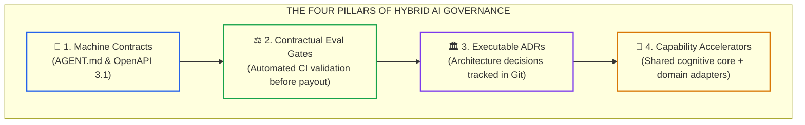
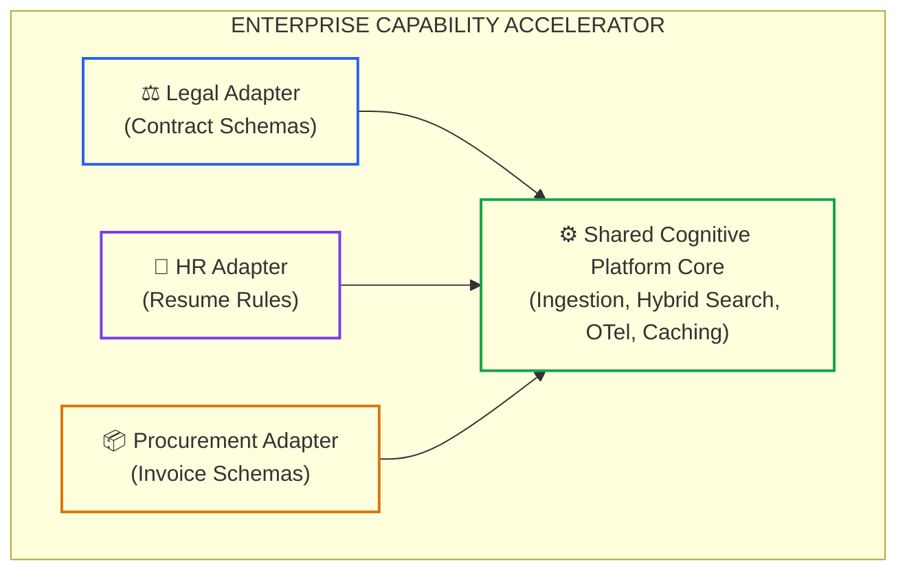

# Lesson 07: Enterprise AI Delivery Governance and Accelerators

> **Tier**: `🔵 Advanced` | **Read time**: ~22 min | **Prerequisites**: [Lesson 02: Spec-Driven Development & Codebase Contracts](./02-spec-driven-development-and-codebase-contracts.md), [Lesson 05: Headless CI/CD Review Bots](./05-headless-ci-cd-agents-and-automated-review-gates.md)  
> **Core Concept**: Governing hybrid enterprise delivery teams (internal platform engineers and external systems integrators) using contractual evaluation gates, and engineering modular capability accelerators that eliminate duplicative business silos.  
> **New AI terms introduced**: hybrid delivery governance, capability accelerator, contractual evaluation gate, executable ADR  
> **AI terms assumed from earlier lessons**: [Spec-Driven Development](./02-spec-driven-development-and-codebase-contracts.md), [hexagonal boundary](./04-architecting-ai-friendly-codebases.md), [headless agent execution](./05-headless-ci-cd-agents-and-automated-review-gates.md)

---

## 🎯 What You Will Learn

- How hybrid delivery models (internal platforms + external systems integrators) break down into technical debt without architectural governance.
- How to implement the Four Pillars of Hybrid AI Delivery to enforce contract gates on partner deliverables.
- How to design a Modular AI Capability Accelerator that shares cognitive retrieval engines across business units.
- How to run an offline Python validator that audits Architecture Decision Records (ADRs) against compliance schemas.

---

## 1. The Problem: The Enterprise Duplicative Silo Trap

Large enterprise AI initiatives rarely happen within a single isolated engineering team. Strategic transformations frequently rely on **hybrid delivery models**: internal platform teams collaborating with external Systems Integrators (SIs), boutique AI consultancies, and staff augmentation vendors.

Without seasoned technical leadership and rigid architectural rails, these engagements rapidly fragment:

```text
========================================================================
THE HYBRID DELIVERY FAILURE MODES
========================================================================
1. Commercial Incentive Mismatch: External partners optimize for 
   "velocity to demo" (six-week flashy POCs to trigger milestone payouts), 
   embedding raw API keys and brittle unmaintainable libraries.
2. Duplicative Domain Silos: Legal, HR, and Procurement hire separate SIs 
   who each build custom document ingestion pipelines from scratch.
3. The Abandoned Asset: Partners roll off after six months, leaving internal 
   teams with undocumented black-box code that fails under load.
========================================================================
```

To govern external delivery partners and eliminate redundant spend, Lead Architects must institute **Contractual Evaluation Gates** and deploy **Modular AI Capability Accelerators**.

### The Anatomy of an AI Partner Statement of Work (SOW)

Traditional software consulting contracts define deliverables through narrative milestone descriptions: *"Vendor delivers invoice parsing module by week 8."* In AI systems engineering, this language guarantees failure. High-performing engineering organizations replace narrative milestones with machine-verifiable contract riders:

```text
========================================================================
MODEL EVALUATION CONTRACT RIDER (SAMPLE SCHEDULE C)
========================================================================
1. Groundedness Threshold: Synthesized responses must achieve >= 0.92 
   groundedness on the internal 500-question Golden Evaluation Dataset.
2. Latency Ceiling: p95 latency must remain <= 1,400ms under 50 RPS load.
3. Rework Rate Constraint: The 14-day code churn on delivered repositories 
   must not exceed 8.0% following handoff.
4. Framework Compliance: Zero unauthorized dependencies. All LLM calls 
   must route through the enterprise Gateway Accelerator.
5. Invoicing Condition: Milestone payment release requires an automated, 
   cryptographically signed green badge from GitHub Actions CI.
========================================================================
```

Binding commercial milestone sign-offs to automated evaluation harnesses aligns economic incentives. Vendors can no longer "demo and dash"; their payout requires shipping durable, verified systems that meet production SLAs.

---

## 2. The Mental Model: The Four Pillars of Hybrid Delivery Governance

Imagine constructing a high-speed transit network across multiple cities:
- You do not allow each municipality to invent its own rail gauge, electrical voltage, or signaling protocols.
- The central transit authority lays down the standardized track specifications and safety signaling (The Core Platform).
- Local contractors build their station platforms (Domain Adapters) to click directly into the existing rails.



### Walkthrough
1. **Machine Contracts**: Every partner repository must adhere to version-controlled `AGENT.md` guidelines.
2. **Contractual Evaluation Gates**: Commercial vendor milestone sign-offs are bound to automated CI evaluation pass rates.
3. **Executable ADRs**: Architecture decisions are documented in Git; unauthorized third-party libraries break CI builds.
4. **Capability Accelerators**: Shared enterprise cognitive engines eliminate duplicate RAG pipelines.

> **Where this analogy breaks**: Physical train tracks remain fixed for decades. AI capability accelerators evolve monthly as foundation models upgrade, requiring versioned semantic adapter layers.

---

## 3. How It Works, One Term at a Time

### Mechanism 1: Modular Capability Accelerators
* 🧒 **The Analogy**: A smartphone operating system. Apple provides the camera API, GPU shaders, and network stack (the core engine). App developers build photography or messaging apps (domain adapters) without soldering their own camera sensors.
* ⚙️ **The Engineering**: An **AI Capability Accelerator** decouples shared platform infrastructure from domain-specific business rules:
  - **Shared Core Engine**: Manages document chunking, hybrid vector retrieval, OpenTelemetry tracing, and LLM rate-limiting gateways.
  - **Pluggable Domain Adapters**: Legal schemas, HR interview questions, and Procurement tax rules plug into the shared core via typed interfaces.
  - **Cost Savings**: Eliminates 3x licensing fees and consolidates enterprise GPU caching.
  
```text
========================================================================
ENTERPRISE CAPABILITY ACCELERATOR INTERFACE CONTRACT
========================================================================
+----------------------------------------------------------------------+
|                     PLUGGABLE DOMAIN ADAPTERS                        |
|  [Legal Contract Extractor] [HR Resume Parser] [Procurement Invoices]|
+-----------------------------------+----------------------------------+
                                    | Typed Protocol Pydantic Schema
+-----------------------------------v----------------------------------+
|                  SHARED COGNITIVE PLATFORM CORE                      |
|  - Rate-Limiting & Spend Attribution Gateway                         |
|  - Hybrid Vector & BM25 Retrieval Engine                             |
|  - Distributed KV Prefix Cache & Semantic Deduplication Tier         |
|  - OpenTelemetry GenAI Semantic Convention Telemetry                 |
+----------------------------------------------------------------------+
```

* ⚠️ **What happens if you skip this?**: Every department builds separate RAG pipelines, burning millions on duplicate vector databases and conflicting vendor contracts.



### Walkthrough
1. **Core Platform**: Provides robust, unified retrieval and observability rails.
2. **Domain Adapters**: Lightweight modules that define business-specific prompt schemas and Pydantic validators.
3. **Unified Telemetry**: Engineering leadership tracks token spend across all business domains from a single dashboard.

---

### Mechanism 2: Contractual Evaluation Gates in CI
* 🧒 **The Analogy**: An escrow account for a real estate purchase. The title company does not wire funds to the seller until the building inspector confirms the roof has no leaks.
* ⚙️ **The Engineering**: Bind vendor statements of work (SOWs) directly to automated CI quality gates:
  - **Quantitative Accuracy Gate**: Partner code must achieve target evaluation metrics on an independent holdout golden dataset (e.g., Groundedness $\ge 0.90$, Retrieval Recall@5 $\ge 0.85$).
  - **Performance and Latency Gate**: p95 inference latency must remain under 1,500ms across 200 concurrent simulated user turns.
  - **Code Hygiene Gate**: Zero high-severity SAST vulnerabilities, zero hardcoded secrets, and 14-day rework rate on initial modules under 10%.
  - **Commercial Acceptance**: Milestone sign-offs and vendor invoicing are legally bound to automated CI pipeline pass badges.
* ⚠️ **What happens if you skip this?**: The partner gets paid for a prototype that crashes under production load, leaving internal engineers to rewrite the service.

---

### Mechanism 3: Executable Architecture Decision Records (ADRs)
* 🧒 **The Analogy**: A legal city zoning charter. A contractor cannot build a chemical refinery in a residential neighborhood without a formal zoning variance.
* ⚙️ **The Engineering**: Technical leadership documents architectural choices using Michael Nygard's ADR format committed to `docs/adr/`:
  - Every ADR records Context, Decision, and Consequences.
  - **Machine-Enforced Compliance**: CI linting tools parse ADR files and cross-reference approved libraries against `pyproject.toml` or `package.json`.
  - Introducing an unapproved external package (e.g., an unvetted LLM wrapper) causes the build to fail immediately with a requirement to link a merged ADR.
  - This stops external consultancies from introducing fragmented frameworks that internal platform teams cannot support after project handoff.
* ⚠️ **What happens if you skip this?**: External vendors introduce conflicting frameworks (e.g., three different prompt orchestration SDKs), creating long-term maintenance chaos.

---

## 4. Try It: Offline ADR Compliance and Evaluation Validator

This typed Python 3.12+ script parses Architecture Decision Records in `docs/adr/`, validates required metadata headers (Status, Deciders, Date), checks approved library dependencies, and validates compliance before release sign-off.

```python
"""
adr_compliance_validator.py
Parses Architecture Decision Records (ADRs) and enforces dependency governance rules.
Compatible with Python 3.12+ and Pydantic v2. Run directly with python.
"""

from enum import Enum
from pydantic import BaseModel, Field, ValidationError


class ADRStatus(str, Enum):
    PROPOSED = "Proposed"
    ACCEPTED = "Accepted"
    DEPRECATED = "Deprecated"
    SUPERSEDED = "Superseded"


class ArchitectureDecisionRecord(BaseModel):
    adr_id: int
    title: str = Field(min_length=5)
    status: ADRStatus
    deciders: list[str] = Field(min_length=1)
    approved_libraries: list[str] = Field(default_factory=list)


SAMPLE_ADR_TEXT = """
ADR-042: Standardize MassTransit with RabbitMQ
Status: Accepted
Deciders: Lead Architect, Staff Platform Engineer
Approved Libraries: mass_transit, rabbitmq_client, pydantic
"""


def parse_and_audit_adr(text: str) -> ArchitectureDecisionRecord:
    """Parses raw ADR header text into validated architectural records."""
    lines = [line.strip() for line in text.strip().splitlines() if line.strip()]
    header = lines[0]
    adr_id = int(header.split(":")[0].replace("ADR-", ""))
    title = header.split(":")[1].strip()

    status_str = "Proposed"
    deciders = []
    approved = []

    for line in lines[1:]:
        if line.startswith("Status:"):
            status_str = line.replace("Status:", "").strip()
        elif line.startswith("Deciders:"):
            deciders = [d.strip() for d in line.replace("Deciders:", "").split(",")]
        elif line.startswith("Approved Libraries:"):
            approved = [lib.strip() for lib in line.replace("Approved Libraries:", "").split(",")]

    return ArchitectureDecisionRecord(
        adr_id=adr_id,
        title=title,
        status=ADRStatus(status_str),
        deciders=deciders,
        approved_libraries=approved
    )


def run_adr_governance_audit():
    print("--- RUNNING ENTERPRISE ADR GOVERNANCE AUDIT ---")
    adr = parse_and_audit_adr(SAMPLE_ADR_TEXT)

    print(f"Verified ADR #{adr.adr_id}: {adr.title}")
    print(f"  Status:             {adr.status.value}")
    print(f"  Deciders:           {', '.join(adr.deciders)}")
    print(f"  Approved Libraries: {', '.join(adr.approved_libraries)}")

    # Check dependency governance against an unapproved library
    unapproved_lib = "unvetted_experimental_sdk"
    is_approved = unapproved_lib in adr.approved_libraries

    print(f"Checking '{unapproved_lib}': {'ALLOWED' if is_approved else 'BLOCKED (Requires new ADR)'}")
    print("STATUS: ARCHITECTURAL GOVERNANCE VALIDATED")


if __name__ == "__main__":
    run_adr_governance_audit()
```

### Real Execution Output

```text
--- RUNNING ENTERPRISE ADR GOVERNANCE AUDIT ---
Verified ADR #42: Standardize MassTransit with RabbitMQ
  Status:             Accepted
  Deciders:           Lead Architect, Staff Platform Engineer
  Approved Libraries: mass_transit, rabbitmq_client, pydantic
Checking 'unvetted_experimental_sdk': BLOCKED (Requires new ADR)
STATUS: ARCHITECTURAL GOVERNANCE VALIDATED
```

---

## 5. Trade-Offs: Governance Approaches for Hybrid Delivery

| Governance Mechanism | Implementation Overhead | Vendor Autonomy | Long-Term Maintainability |
|:---|:---|:---|:---|
| **Unfettered Partner Autonomy** | Zero | High (ships demo in weeks) | Very Low (unmaintainable black-box) |
| **Manual Architecture Gatekeeping** | Very High (weekly review meetings) | Low (partner blocked on sign-offs) | Moderate (human reviews miss drift) |
| **Contractual CI Gates & ADRs** | **Moderate (authoring specs upfront)** | **High (partner iterates autonomously)** | **Very High (code adheres to platform rules)** |

---

## 6. Failure Modes & Anti-Patterns

### Anti-Pattern 1: The "Throw It Over the Wall" Handover
* **Symptom**: An external consulting firm commits their final code repository on Friday afternoon as their contract concludes, without internal pairing.
* **Root Cause**: Failure to integrate partner code into core CI/CD pipelines throughout the project lifecycle.
* **Production Fix**: Mandate that external partners commit daily to internal Git repositories subject to internal CI evaluation gates from Sprint 1.

### Operational Playbook: Remediation of an Orphaned AI Repository
When inheriting a legacy AI asset delivered by an external vendor, lead architects execute this five-step stabilization checklist:
1. **Quarantine the Asset**: Isolate the repository into a staging environment without direct production database write permissions.
2. **Run Dependency SAST**: Execute dependency vulnerability scanners (`pip-audit`, `trivy`) to discover outdated or unmaintained third-party LLM wrappers.
3. **Capture Telemetry Baseline**: Route all model calls through the central gateway accelerator to measure current latency, token expenditure, and error rates.
4. **Author Missing Invariant Contracts**: Commit an authoritative `AGENT.md` defining system identity and non-negotiable architectural boundaries.
5. **Establish Property and Golden Evals**: Replace vendor unit mocks with property-based boundary tests and a 100-question golden evaluation test suite in CI.

### Anti-Pattern 2: Domain Accelerator Sprawl
* **Symptom**: Every department builds its own custom LLM gateway, resulting in fragmented rate limits, conflicting security logs, and wasted cloud budget.
* **Root Cause**: Lack of a centralized platform engineering team offering reusable capability accelerators.
* **Production Fix**: Establish a core AI Platform team that delivers shared, well-documented retrieval and gateway accelerators.

---

## 7. Quick Check

**Scenario**: An enterprise contracts a consulting partner to build an automated invoice extraction service. In week 5, the partner demonstrates a working UI. However, inspecting the pull request reveals that the partner hardcoded their personal API keys, imported an unvetted third-party parsing wrapper, and skipped automated tests.

**Question**: What contractual governance mechanism was missing, and what should the lead architect enforce before releasing payment?

<details>
<summary>Check your answer</summary>

**Answer**: The engagement lacked **Contractual Evaluation Gates in CI**. Commercial milestones were tied to subjective visual demos rather than objective machine-verified criteria.

**The Fix**:
1. Withhold milestone sign-off until the partner's code passes internal CI gates.
2. Mandate compliance with `AGENT.md` invariants (zero hardcoded secrets, secrets injected via environment variables).
3. Require the partner to submit an ADR justifying any third-party parsing wrapper before merge.
4. Enforce automated evaluation tests proving extraction accuracy meets the agreed threshold (e.g., F1 $\ge 0.95$) on an independent evaluation test dataset.
</details>

---

## 🧭 Navigation

| Direction | Resource |
|:---|:---|
| **Previous Lesson** | [Lesson 06: AI Developer Productivity & Rework Metrics](./06-ai-developer-productivity-and-rework-metrics.md) |
| **Phase Hub** | [Phase 08: AI-Augmented SDLC & Leadership](./README.md) |
| **Capstone Lab** | [Capstone Lab: AI-Native Repository Framework](./labs/capstone-ai-native-repository.md) |
