# Phase 08: AI-Augmented SDLC & Engineering Leadership

> **A comprehensive, production-grade guide for Senior Developers, Tech Leads, and Software Architects navigating the transition from manual syntax creation to AI-native software engineering, autonomous coding agents, and architectural leadership in the era of Software 3.0.**

---

> Curriculum taxonomy aligns with the [3-tier classification defined in the root README](../README.md) (`[MUST-HAVE]` 🔴, `[GOOD-TO-HAVE]` 🟡, `[KNOWLEDGE-BASE]` 🔵).

---

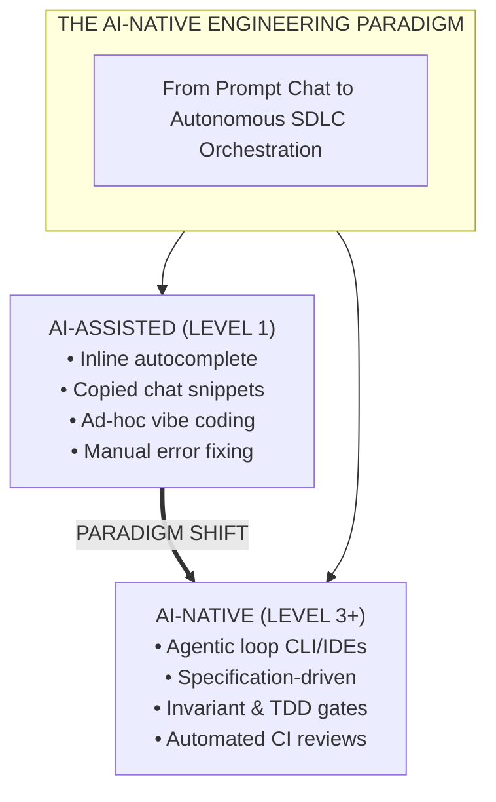

---

## 📑 Table of Contents

1. [Executive Summary & Lead Mental Model [MUST-HAVE] 🔴](#1-executive-summary--lead-mental-model-must-have-)
2. [Why This Matters for Senior & Lead Developers [MUST-HAVE] 🔴](#2-why-this-matters-for-senior--lead-developers-must-have-)
3. [Visual System Architecture & Flow Diagrams [MUST-HAVE] 🔴](#3-visual-system-architecture--flow-diagrams-must-have-)
4. [Comprehensive Comparison Tables [MUST-HAVE] 🔴](#4-comprehensive-comparison-tables-must-have-)
5. [Deep-Dive Topics & Subtopics [MUST-HAVE] 🔴](#5-deep-dive-topics--subtopics-must-have-)
6. [Production Failure Modes & Anti-Patterns [MUST-HAVE] 🔴](#6-production-failure-modes--anti-patterns-must-have-)
7. [Practical Templates & Production Implementations [MUST-HAVE] 🔴](#7-practical-templates--production-implementations-must-have-)
8. [Curated Verified Resources [KNOWLEDGE-BASE] 🔵](#8-curated-verified-resources-knowledge-base-)
9. [Capstone Challenge: Establish an Enterprise AI-Native Repository Framework [MUST-HAVE] 🔴](#9-capstone-challenge-establish-an-enterprise-ai-native-repository-framework-must-have-)

---

## 1. Executive Summary & Lead Mental Model [MUST-HAVE] 🔴

### The AI-Native Engineering Paradigm

Software engineering is undergoing a platform shift comparable to the move from assembly to high-level compiled languages. Historically, development meant human engineers manually translating intent into syntax line-by-line, navigating files, writing tests retroactively, and reviewing diffs in web interfaces.

The first generation of developer AI (2021–2023) introduced **AI-assisted programming**: inline autocomplete (GitHub Copilot) and chat sidebars (ChatGPT, Claude). Developers remained primary typists, prompting LLMs for isolated functions and pasting snippets into editors.

The modern standard is the **AI-Native Software Engineering Lifecycle (SDLC)**:
1. **Developer as System Architect and Verification Arbiter**: Leads define domain models, system invariants, interface contracts, and automated verification suites. Autonomous agents implement changes against these specifications.
2. **Context-Engineered Repositories Over Ad-Hoc Prompts**: Repositories provide machine-readable metadata (`AGENT.md`, OpenAPI specs, Protobuf definitions, type annotations) guiding autonomous agent execution and validation loops.
3. **Continuous Verification Replaces Vibe Coding**: Probabilistic generation is bounded by deterministic test harnesses, static analysis, linter gates, and architectural boundary tests. Code is accepted only when satisfying executable constraints.
4. **Autonomous Agent Workflows Span the Full SDLC**: Agents analyze issues, draft ADRs, generate test matrices, perform atomic multi-file refactors, audit pull requests, and triage production incidents from OpenTelemetry traces.

### The SDLC Evolution Spectrum

| Dimension | Traditional SDLC | AI-Assisted SDLC | AI-Native SDLC |
|---|---|---|---|
| **Primary Interface** | Text Editor / IDE | Chat Sidebar + Tab | Autonomous CLI & Agentic IDE |
| **Unit of Work** | Line / Function | Method / File Snippet | Feature Branch / Pull Request |
| **Context Source** | Developer Memory | Active File Buffer | Full Repo Graph + MCP Servers |
| **Execution Loop** | Manual Read-Write | Manual Copy-Paste | Agentic ReAct (Tool-use loop) |
| **Quality Gate** | Manual Review + CI | Manual Review + CI | TDD Invariants + AI Review Bot |
| **Primary Constraint** | Typing & Search | Context Limits & Hallucinations | System Design & Verification |

### The Shift from Synthesizer to Editor & Verification Arbiter

In the AI-native lifecycle, code generation is abundant and low-cost. **The engineering bottleneck shifts to comprehension, verification, and system design**. 

A senior engineer orchestrating concurrent coding agents can produce thousands of lines of verified, architecturally aligned code daily. However, without rigorous guardrails, this velocity creates technical debt at scale. The architect's primary duty is ensuring velocity does not compromise architectural coherence, security boundaries, and domain invariants.

---

## 2. Why This Matters for Senior & Lead Developers [MUST-HAVE] 🔴

Leading engineering organizations through this transition requires confronting hard technical and organizational challenges:

### 1. Architecting Systems that Autonomous Agents Can Reason About
Traditional codebases often harbor implicit assumptions, hidden side effects, dynamic typing shortcuts, and tribal knowledge. Humans navigate these through intuition; autonomous agents fail catastrophically. Senior architects must construct **semantically predictable architectures**:
- Strongly typed domain models with zero tolerance for untyped dictionaries or `dynamic` primitives.
- Explicit interface boundaries (ports and adapters / hexagonal architectures) that isolate dependencies.
- Machine-readable contracts (OpenAPI 3.1, Protobuf 3, JSON Schema) as immutable single sources of truth.
- Hermetic test suites running locally in sub-minute windows for fast agent feedback loops.

### 2. Eliminating the "Vibe Coding" Epidemic in Enterprise Codebases
"Vibe coding"—iteratively prompting an agent until code compiles without understanding edge cases, transactions, or concurrency—threatens enterprise stability. Engineering leads must institute automated CI gates rejecting code that lacks test provenance, invariant validation, and architectural alignment.

### 3. Scaling Developer Velocity Without Knowledge Atrophy
Delegating implementation entirely to agents risks degrading domain comprehension. Engineering leads must cultivate a culture of **discernment and verification**, prioritizing critical evaluation and stress-testing of agent outputs over typing speed.

### 4. Navigating the Karpathy Continuum: Software 1.0 → 2.0 → 3.0
Computing has evolved through three distinct paradigms:
- **Software 1.0 (Classical Code)**: Human-authored explicit logic (C++, C#, Python, Go). Deterministic and interpretable, but fragile with ambiguous tasks.
- **Software 2.0 (Neural Networks)**: Optimization algorithms (gradient descent) searching parameter spaces defined by weights and data. High perceptual ability, but opaque and non-deterministic.
- **Software 3.0 (Agentic Systems)**: Foundation models acting as reasoning engines that orchestrate Software 1.0 tools, write Software 1.0 code, call Software 2.0 models, and execute complex workflows steered by specifications and protocols.

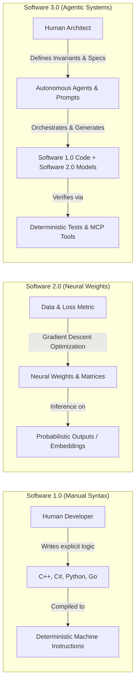

---

## 3. Visual System Architecture & Flow Diagrams [MUST-HAVE] 🔴

### The AI-Native SDLC Pipeline

The following diagram illustrates the complete, closed-loop software engineering lifecycle augmented by autonomous agents and deterministic verification gates:

```mermaid
flowchart TD
    subgraph SPEC["1. Specification & Requirements"]
        A["Feature Request / PRD"] --> B["AI Requirements Breakdown Agent"]
        B -->|"Extracts user stories"| C["Edge-Case & Failure Mode Generator"]
        C -->|"Synthesizes"| D["Gherkin / Executable Acceptance Criteria"]
    end

    subgraph ARCH["2. Architectural RFC & Design"]
        D --> E["Architectural Design Agent"]
        E -->|"Evaluates trade-offs"| F["Trade-off Matrix & Sequence Diagrams"]
        F -->|"Generates formal contracts"| G["OpenAPI 3.1 / Protobuf Schemas"]
        G -->|"Human Sign-off"| H{"Lead Architect Gate"}
    end

    subgraph TDD["3. Test-Driven Development (TDD)"]
        H -->|"Approved Spec"| I["AI Test Generation Agent"]
        I -->|"Writes failing tests"| J["Unit, Integration & Property Tests (RED)"]
    end

    subgraph CODE["4. Implementation & Refactoring"]
        J --> K["Autonomous Coding Agent (Claude Code / Cursor)"]
        K -->|"Generates code to satisfy tests"| L["Local Build & Test Runner (GREEN)"]
        L -->|"Fails tests"| K
        L -->|"Passes tests"| M["AI Refactoring & Optimization Loop"]
        M -->|"Enforces style & DRY"| N["Clean, Passing Feature Branch"]
    end

    subgraph REVIEW["5. Automated Review & CI/CD"]
        N --> O["Pull Request Submitted"]
        O --> P["AI PR Security & Arch Review Bot"]
        P -->|"Checks schema drift, SQLi, invariants"| Q{"Automated PR Gate"}
        Q -->|"Violations detected"| K
        Q -->|"Approved"| R["Human Peer / Lead Review"]
        R -->|"Merge"| S["CI/CD Deployment to Staging/Prod"]
    end

    subgraph OBS["6. Production Observability & RCA"]
        S --> T["Telemetry, Logs & Traces (OpenTelemetry)"]
        T -->|"Exception / Alert"| U["AI RCA & Incident Triage Agent"]
        U -->|"Correlates logs & stack trace"| V["Automated Post-Mortem & Fix PR"]
        V -->|"Feeds back into"| I
    end

    style H fill:#f96,stroke:#333,stroke-width:2px
    style Q fill:#f96,stroke:#333,stroke-width:2px
    style R fill:#f96,stroke:#333,stroke-width:2px
```

---

### Repository Context Hierarchy for Coding Agents

Autonomous agents navigate codebases hierarchically. Providing the right abstraction level at each layer prevents context exhaustion and hallucinations:

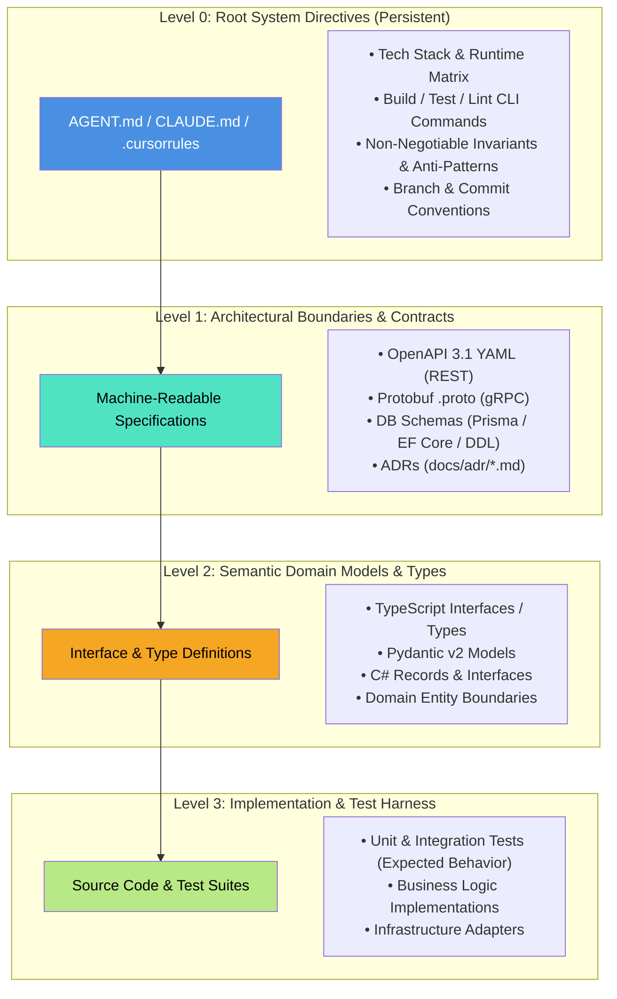

---

## 4. Comprehensive Comparison Tables [MUST-HAVE] 🔴

### Modern AI Coding Agents: Deep Architecture & Capability Matrix

| Attribute / Tool | **Claude Code** | **Cursor** | **Windsurf** | **GitHub Copilot** | **Gemini Code Assist** |
|---|---|---|---|---|---|
| **Primary Interface** | Terminal / CLI Agent | Dedicated IDE (VS Code Fork) | Dedicated IDE (VS Code Fork) | IDE Plugin (VS Code, VS, JetBrains) | IDE Plugin & Cloud Console |
| **Core Architecture** | CLI-driven ReAct loop over bash, file ops, git | Custom native client with shadow workspaces | Custom Cascade flow engine with deep LSP | LSP extension + background chat server | Cloud-backed agent with Google Cloud context |
| **Context Strategy** | Local file tools, git history, bash grep/find | `@codebase` RAG + vector index + fast tree indexing | Cascade Flow tracker + active terminal monitoring | Workspace indexing + active editor tabs | Repository context graph + Vertex AI grounding |
| **Autonomous Execution** | Full shell access (runs tests, git, linter, builds) | Background terminal runner (with user approval) | Native terminal integration in Cascade flow | Terminal commands suggested in chat (manual exec) | Cloud Shell & terminal command generation |
| **Multi-File Refactoring**| Native (reads files, plans edits, runs patches) | Composer (multi-file simultaneous editing) | Multi-file Cascade generation | Step-by-step file suggestion in Workspace | Multi-file suggestions in Gemini CLI/IDE |
| **Tool / Protocol Support**| Model Context Protocol (MCP), custom CLI hooks | `.cursorrules`, custom command rules | `.windsurfrules`, Cascade workflows | Custom agent plugins, GitHub Copilot Extensions | Google ADK, Google Cloud tool calling |
| **Enterprise Privacy** | Anthropic enterprise zero-retention API policies | SOC 2 Type II, privacy mode (no code training) | SOC 2 Type II, zero data retention mode | Enterprise data protection, no model training | Google Cloud enterprise IAM & zero customer data logging |
| **Ideal Architectural Role**| Autonomous batch tasks, CI/CD, deep terminal dev | Interactive daily coding, rapid multi-file features| Flow-state interactive development with terminal | Baseline enterprise-wide autocomplete & chat | GCP-centric cloud architecture & pipeline dev |

---

### Traditional SDLC vs. AI-Assisted vs. AI-Native SDLC

| Lifecycle Phase | **Traditional SDLC (Manual)** | **AI-Assisted (Chat & Snippets)** | **AI-Native SDLC (Agent-Orchestrated)** |
|---|---|---|---|
| **Requirements & User Stories** | PM writes PRD in Confluence; engineers manually extract technical acceptance criteria over multiple grooming sessions. | Engineers paste PRD paragraphs into ChatGPT to ask "What edge cases did I miss?" | Agent ingests PRD, cross-references existing schema, generates Gherkin acceptance tests, and flags unhandled error modes automatically. |
| **System Architecture & RFCs** | Architect spends weeks creating trade-off decks, sequence diagrams, and interface drafts by hand. | Architect uses chat to brainstorm pros/cons of databases or generate initial Mermaid syntax. | Agent generates comparative trade-off matrix, benchmarks latency/cost profiles, generates OpenAPI 3.1 contracts, and drafts complete ADR. |
| **Test Design & TDD** | Tests often written after code (or skipped entirely under deadline pressure); manual mocking of dependencies. | Developer prompts: "Write unit tests for this function I just wrote" (retroactive testing). | AI-driven TDD: Agent generates full parameterized unit, integration, and property test suites *before* any implementation code exists. |
| **Code Implementation** | Developer types all boilerplate, business logic, mapping code, and unit tests manually. | Developer uses tab autocomplete and prompts chat for utility snippets; manually copies/pastes. | Developer specifies interface constraints; agent plans multi-file diff, writes code, executes local compiler/test runner, and fixes failures iteratively. |
| **Code Review & Quality Gates** | Human peer spends 45 minutes spotting syntax nits, missing null checks, and style deviations; deep architectural flaws often missed. | Human reviewer runs a local linter or pastes diff into chat for a summary. | Multi-tier AI Review Agent inspects PR against architectural invariants, SQL injection vectors, and breaking contract changes before human sees it. |
| **Maintenance & Modernization** | Multi-month manual code migration initiatives (e.g., .NET Framework to .NET 8/9, Python 2 to 3). | Developers convert individual classes one at a time via chat windows. | Autonomous agent processes solution tree file-by-file, runs automated migration recipes, compiles, fixes errors, and issues atomic PRs. |
| **Incident Response & RCA** | On-call engineer manually sifts through thousands of Splunk/CloudWatch logs and traces to reconstruct root cause. | Engineer pastes stack trace into chat to decipher obscure exceptions. | Autonomous triage agent ingests OTel trace, correlates exception logs, isolates faulty commit, and drafts complete RCA with repro test case. |

---

## 5. Deep-Dive Topics & Subtopics [MUST-HAVE] 🔴

### 5.1 The AI Developer Toolchain [MUST-HAVE] 🔴

#### 1. Autonomous Coding Agents in Practice
Autonomous coding agents differ fundamentally from autocomplete extensions. They operate via an **observe-orient-decide-act (OODA) or ReAct (Reason + Act)** loop:
1. **Observe**: The agent reads workspace directory structures, file contents, git statuses, and compiler/test diagnostics.
2. **Reason**: The agent evaluates its progress toward a stated goal, synthesizes dependencies, and determines the next necessary atomic action.
3. **Act**: The agent executes a tool—such as modifying a file chunk, creating a directory, running a build command via bash, or querying an external documentation server.
4. **Evaluate**: The agent analyzes tool output (e.g., standard error from a failing test) and decides whether to self-correct or conclude the task.

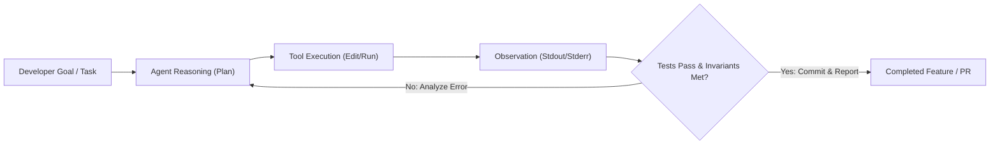

#### 2. Protocol Integration: LSP vs. Model Context Protocol (MCP)
Modern AI-native engineering environments bridge two essential protocol layers:
- **Language Server Protocol (LSP)**: Provides deterministic, AST-based code intelligence (type checking, symbol navigation, go-to-definition, reference counting). Agents query LSP endpoints to eliminate symbol and signature hallucinations.
- **Model Context Protocol (MCP)**: An open standard created by Anthropic allowing agents to discover and invoke external tools and context (database schemas, GitHub/Jira issues, Sentry error logs, cloud CLI tools) via structured JSON-RPC 2.0.

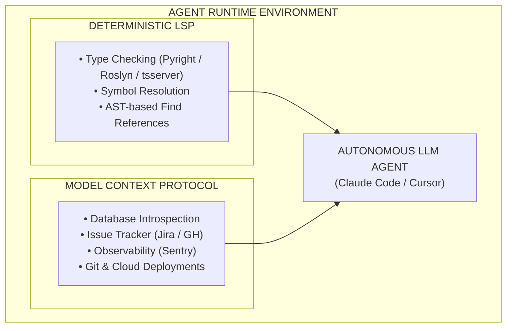

---

### 5.2 The AI-Native SDLC End-to-End [MUST-HAVE] 🔴

#### Step 1: Requirements & Product Specifications
AI agents excel at identifying boundary edge cases that human product managers overlook. By feeding a preliminary PRD into an analysis agent, teams can generate an **exhaustive failure mode and edge-case matrix**:

```markdown
<!-- Prompt Pattern: PRD Boundary & Edge-Case Synthesizer -->
You are a Principal Software Architect and QA Lead. Analyze the following Product Requirements Document (PRD).
For every functional requirement:
1. Identify at least 3 edge cases (concurrency, network partition, boundary numerical limits, malformed payloads).
2. Synthesize testable Given-When-Then (Gherkin) acceptance criteria.
3. Identify all implicit assumptions that require clarification before architectural sign-off.
```

*Example Output Generated for an E-Commerce Checkout Service*:
```gherkin
Feature: Order Checkout Invariant Enforcement

  Scenario: Concurrent checkout of the final inventory item
    Given an item "SKU-9921" has an available inventory of 1
    When User A and User B concurrently submit a checkout request within a 10ms window
    Then exactly one user receives HTTP 201 Created with an active Order ID
    And the other user receives HTTP 409 Conflict with error code "INSUFFICIENT_STOCK"
    And the inventory balance in PostgreSQL never drops below 0
    And an audit log entry is recorded with trace correlation across both transactions
```

---

#### Step 2: Architectural RFC & Design
Rather than drafting RFCs in isolation, senior architects use AI to benchmark competing architectural patterns, synthesize trade-off matrices, and generate machine-readable contracts.

##### Architectural Trade-Off Analysis Example
```markdown
| Architectural Option | Latency (p99) | Operational Complexity | Cost at 10M req/day | Consistency Model | Failure Blast Radius |
|---|---|---|---|---|---|
| **A: PostgreSQL + Read Replicas** | 12ms | Low (Standard managed DB) | $350 / month | Strong (Primary) / Eventual (Replicas) | High (Single writer database bottleneck) |
| **B: DynamoDB + DAX Caching** | 2ms | Medium (Key design overhead) | $1,200 / month | Eventual (Standard) / Strong (Optional) | Low (Partition-isolated scaling) |
| **C: Redis Fronted CockroachDB** | 4ms | High (Multi-cluster consensus) | $2,100 / month | Strict Serializable | Minimal (Multi-region active-active survivable) |
```

##### Interface-First Contract Synthesis
Before writing business logic, the architect uses an agent to produce strict **OpenAPI 3.1** or **Protobuf** specifications:

```yaml
# contracts/payment-service.yaml
openapi: 3.1.0
info:
  title: Payment Gateway Processing API
  version: 1.0.0
paths:
  /v1/payments/charges:
    post:
      summary: Process an idempotent customer payment charge
      operationId: processPaymentCharge
      parameters:
        - name: Idempotency-Key
          in: header
          required: true
          schema:
            type: string
            format: uuid
      requestBody:
        required: true
        content:
          application/json:
            schema:
              $ref: '#/components/schemas/PaymentRequest'
      responses:
        '201':
          description: Payment processed successfully
          content:
            application/json:
              schema:
                $ref: '#/components/schemas/PaymentResponse'
        '409':
          description: Idempotent replay detected or concurrent operation pending
          content:
            application/json:
              schema:
                $ref: '#/components/schemas/ApiError'
components:
  schemas:
    PaymentRequest:
      type: object
      required: [customerId, amountInCents, currency]
      properties:
        customerId:
          type: string
          format: uuid
        amountInCents:
          type: integer
          minimum: 50
          maximum: 100000000
        currency:
          type: string
          pattern: '^[A-Z]{3}$'
```

---

#### Step 3: Test-Driven Development (TDD) with AI

The classical Agile **Red-Green-Refactor** loop achieves peak efficiency when paired with coding agents:
1. **Red (Specification as Tests)**: The agent is instructed *not* to write business logic yet, but solely to write the comprehensive test suite based on the OpenAPI or domain contract. Every test must initially fail.
2. **Green (Minimal Compliant Code)**: The agent implements the simplest possible production code to make all test assertions pass.
3. **Refactor (Architectural Optimization)**: The agent refactors the code to eliminate duplication, enhance algorithmic efficiency, and enforce architectural invariants, verified continuously by automated test execution.

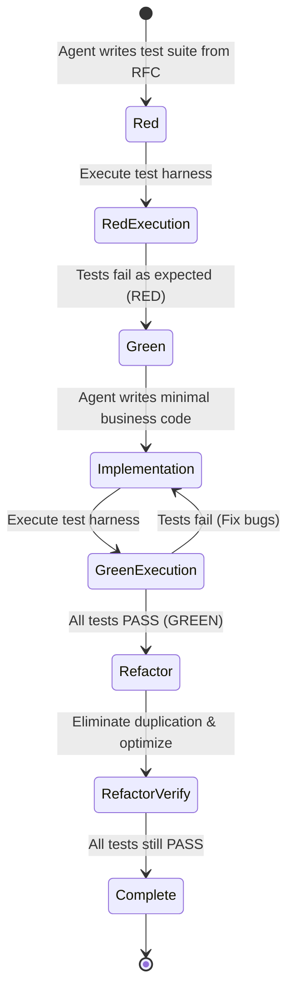

##### Executable TDD Example (C# / .NET 9)
```csharp
// tests/PaymentService.Tests/PaymentProcessorTests.cs
using System.Net;
using FluentAssertions;
using Xunit;
using Moq;

namespace PaymentService.Tests;

public class PaymentProcessorTests
{
    private readonly Mock<IPaymentGatewayClient> _gatewayMock = new();
    private readonly Mock<IIdempotencyStore> _idempotencyStoreMock = new();
    private readonly PaymentProcessor _sut;

    public PaymentProcessorTests()
    {
        _sut = new PaymentProcessor(_gatewayMock.Object, _idempotencyStoreMock.Object);
    }

    [Fact]
    public async Task ProcessPayment_WhenIdempotencyKeyExists_ReturnsCachedResultWithoutCallingGateway()
    {
        // Arrange
        var idempotencyKey = Guid.NewGuid();
        var cachedResponse = new PaymentResult(Guid.NewGuid(), 5000, "USD", PaymentStatus.Succeeded);
        
        _idempotencyStoreMock
            .Setup(x => x.TryGetCachedResultAsync(idempotencyKey, CancellationToken.None))
            .ReturnsAsync(cachedResponse);

        var request = new ProcessPaymentCommand(Guid.NewGuid(), 5000, "USD", idempotencyKey);

        // Act
        var result = await _sut.ProcessPaymentAsync(request, CancellationToken.None);

        // Assert
        result.Should().BeEquivalentTo(cachedResponse);
        _gatewayMock.Verify(x => x.ChargeCardAsync(It.IsAny<GatewayChargeRequest>(), It.IsAny<CancellationToken>()), Times.Never);
    }

    [Theory]
    [InlineData(0)]
    [InlineData(-100)]
    [InlineData(49)] // Below minimum 50 cents requirement
    public async Task ProcessPayment_WhenAmountIsInvalid_ThrowsValidationException(long invalidAmount)
    {
        // Arrange
        var command = new ProcessPaymentCommand(Guid.NewGuid(), invalidAmount, "USD", Guid.NewGuid());

        // Act
        Func<Task> act = async () => await _sut.ProcessPaymentAsync(command, CancellationToken.None);

        // Assert
        await act.Should().ThrowAsync<ArgumentOutOfRangeException>()
            .WithParameterName("amountInCents");
    }
}
```

---

#### Step 4: Code Generation & Legacy Modernization

A premier use case for autonomous agents is multi-file refactoring and modernization of legacy codebases (e.g., migrating monolithic **.NET Framework 4.8 WCF/ASP.NET** services to **.NET 8/9 ASP.NET Core** minimal APIs, or migrating Python 2.7 scripts to modern Python 3.12 with Pydantic v2).

##### Case Study: Modernizing Legacy .NET Framework WCF to .NET 9 Minimal API
*Before (Legacy .NET Framework 4.8 WCF Service Contract)*:
```csharp
// Legacy WCF ServiceContract (System.ServiceModel, .NET Framework 4.8)
[ServiceContract]
public interface IOrderService
{
    [OperationContract]
    [FaultContract(typeof(OrderFault))]
    OrderResponse PlaceOrder(OrderRequest request);
}

[DataContract]
public class OrderRequest
{
    [DataMember]
    public int CustomerId { get; set; }
    [DataMember]
    public decimal TotalAmount { get; set; }
}
```

*After (Modern .NET 9 Clean Architecture Minimal API with C# 13 Features)*:
```csharp
// Modern .NET 9 Minimal API Endpoint (C# 13, Native AOT-ready)
namespace OrderService.Endpoints;

public record PlaceOrderRequest(
    Guid CustomerId,
    [property: Range(1, 10_000_000)] decimal TotalAmount,
    string Currency = "USD"
);

public record PlaceOrderResponse(
    Guid OrderId,
    string Status,
    DateTimeOffset CreatedAtUtc
);

public static class OrderEndpoints
{
    public static RouteGroupBuilder MapOrderEndpoints(this RouteGroupBuilder group)
    {
        group.MapPost("/", async (
            PlaceOrderRequest request,
            IOrderHandler handler,
            CancellationToken ct) =>
        {
            var result = await handler.HandleOrderAsync(request, ct);
            return result.Match(
                order => TypedResults.Created($"/api/v1/orders/{order.OrderId}", order),
                error => TypedResults.Problem(statusCode: (int)error.StatusCode, title: error.Message)
            );
        })
        .WithName("PlaceOrder")
        .WithOpenApi()
        .RequireRateLimiting("StrictFinancialLimit");

        return group;
    }
}
```

---

#### Step 5: Automated Code Review & Security Scanning

Human code reviewers suffer from fatigue, cognitive overload, and rubber-stamp syndrome. An autonomous PR review agent provides consistent, non-tiring enforcement of architectural rules, security boundaries, and performance invariants.

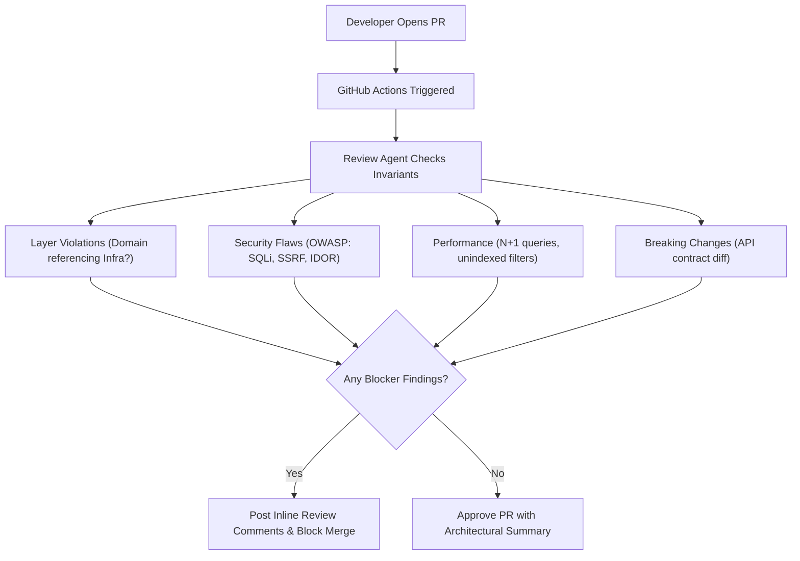

---

#### Step 6: Incident Response & Automated Root Cause Analysis (RCA)

When production failures occur, minutes matter. An AI-augmented incident response pipeline ingests real-time telemetry, correlates traces, and provides actionable remediation PRs.

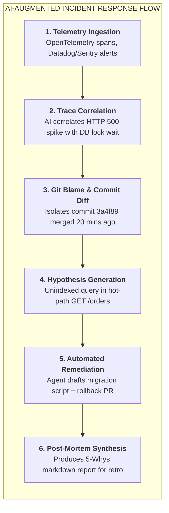

##### Automated Post-Mortem Incident Template Generated by AI
```markdown
# Incident RCA Report: INC-2026-09-8821
**Date:** September 26, 2026  
**Severity:** SEV-1 (Production API Partial Outage)  
**Impact:** 14.2% of checkout attempts failed between 14:10 UTC and 14:38 UTC (28 minutes).

## Executive Summary
A database deadlocking cascade occurred in the `Orders` table following the deployment of release `v2.14.0`. The newly introduced `CustomerLoyalty` update lacked an indexed foreign key, causing table-level lock escalation under high concurrent write loads.

## Five-Whys Root Cause Analysis
1. **Why did checkouts fail?** Database queries timed out with PostgreSQL error `55P03: lock_not_available`.
2. **Why were locks unavailable?** The `ProcessOrder` transaction held an exclusive table lock on `CustomerLoyalty`.
3. **Why did it hold an exclusive lock?** A newly added query executed an `UPDATE CustomerLoyalty SET Points = Points + ? WHERE CustomerExternalId = ?` without an index on `CustomerExternalId`.
4. **Why was the index missing?** The agent that generated migration `0042_add_loyalty.sql` did not specify an index, and the PR review bot had its SQL performance rule disabled for migration files.
5. **Why was the rule disabled?** A legacy configuration override in `.agent/rules.yaml` excluded files under `migrations/`.

## Remediation & Preventative Actions
- [x] Applied hotfix migration adding `CONCURRENTLY` index on `CustomerLoyalty(CustomerExternalId)`.
- [x] Restored PR review bot rule: Mandatory `EXPLAIN ANALYZE` evaluation for all SQL schema additions.
- [x] Added automated load test gate simulating 500 concurrent checkout writes in pre-production staging.
```

---

### 5.3 Designing Codebases for AI Agents ("AI-Friendliness") [MUST-HAVE] 🔴

To maximize coding agent accuracy and prevent hallucinations, system architectures must be optimized for **machine comprehension**.

#### Principles of AI-Friendly Codebases

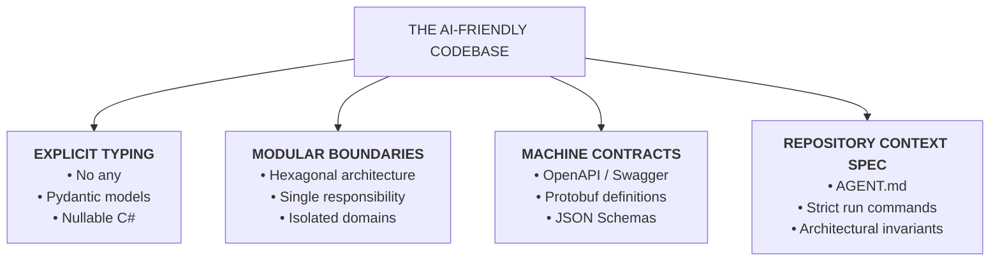

1. **Strict Static Typing**: Dynamically typed or unannotated code forces agents to infer property structures, driving hallucinations. Mandate strict TypeScript (`strict: true`, no `any`), Python with Pydantic v2 and `mypy --strict`, C# with `<Nullable>enable</Nullable>`, or Go/Rust.
2. **Clear Interface Boundaries (Ports & Adapters)**: Domain logic must not directly couple to databases or external APIs. Dependency injection allows agents to construct hermetic unit tests without mocking infrastructure trees.
3. **Modular File Sizing (< 300 Lines per File)**: Monolithic files degrade attention mechanisms and cause context truncation. Enforce single-responsibility modules.
4. **Machine-Readable API Contracts as Truth**: Maintain OpenAPI 3.1 or Protobuf specifications directly in the repository; validate code changes using contract linters (`spectral lint`, `buf lint`).
5. **Context Anchors (`AGENT.md`, `CLAUDE.md`, `.cursorrules`)**: Provide concise, structured operational manuals at the repository root defining build, test, and style invariants.

---

### 5.4 Engineering Leadership in the AI Era [MUST-HAVE] 🔴

#### 1. Managing Probabilistic Code Generation
Writing code is no longer purely deterministic. When dealing with probabilistic language models:
- **Zero Unreviewed Agent Commits**: Every line of agent-generated code must be reviewed by a human engineer who understands the implications and accepts production ownership.
- **Verification Provenance**: Require pull requests to demonstrate test execution output, coverage metrics, and linter runs before requesting human review.
- **Defensive Coding Standards**: Explicitly train engineers to look for common LLM failure modes: hallucinated package imports, subtly inverted boolean logic, unhandled exception paths, and insecure default configurations.

#### 2. Measuring Team Productivity: DORA in the AI Era
Traditional metrics like Lines of Code (LOC), commit counts, or closed story points are fundamentally broken in an AI-assisted world where an agent can generate 10,000 lines of boilerplate in seconds.

Senior engineering leadership must evaluate productivity using the **DORA (DevOps Research and Assessment)** framework supplemented by AI-specific health metrics:

```markdown
| Metric Category | Traditional DORA Metric | Impact in AI-Native SDLC | Target Benchmark |
|---|---|---|---|
| **Velocity** | **Lead Time for Changes (LTFC)** | Drastically compresses from weeks to hours if automated review gates are robust. | $< 4$ Hours from commit to production |
| **Velocity** | **Deployment Frequency (DF)** | Increases significantly due to smaller, atomic, agent-assisted pull requests. | Multiple deployments per day per team |
| **Quality** | **Change Failure Rate (CFR)** | The critical canary metric: if CFR rises, agents are generating unverified technical debt. | $< 5\%$ of production releases |
| **Recovery** | **Time to Restore Service (TTRS)** | Compresses as AI incident triage agents isolate root causes and suggest rollback/fixes rapidly. | $< 30$ Minutes |
| **AI Health** | **Architectural Drift Index** | Measures frequency of unauthorized dependency additions and architectural layer violations. | Zero unapproved exceptions |
| **AI Health** | **PR Rework Rate** | Percentage of PRs requiring > 3 review cycles due to agent hallucination or missed criteria. | $< 10\%$ of pull requests |
```

#### 3. Mentoring Senior & Junior Developers: The Apprenticeship Dilemma
One of the most pressing organizational challenges in software leadership is the **Apprenticeship Crisis**:
- *The Dilemma*: Historically, junior developers learned the craft by writing repetitive boilerplate, simple CRUD endpoints, unit tests, and bug fixes. Today, AI agents perform these tasks instantaneously. If junior engineers don't write basic code, how do they develop the intuition required to become senior architects?
- *The Solution: Up-leveling Early-Career Engineers*:
  1. **Shift Focus to Code Auditing & Discernment**: Train junior engineers to act as code reviewers for the agent, verifying correctness, testing edge cases, and checking performance.
  2. **Pair Programming with Agents**: Have junior engineers describe architectural intent to the agent, verify each step, and explain *why* the agent's initial approach was suboptimal.
  3. **Mandatory Deep-Dive Drills**: Conduct weekly team drills where developers inspect generated code down to the assembly, IL, or runtime execution level to understand underlying mechanisms.

---

## 6. Production Failure Modes & Anti-Patterns [MUST-HAVE] 🔴

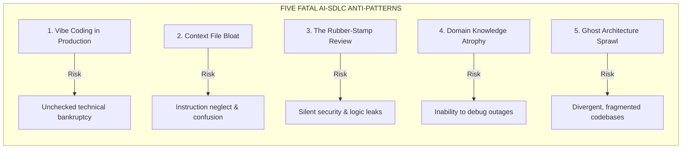

### Anti-Pattern 1: "Vibe Coding" in Enterprise Systems
* **Failure Mode**: Prompts an agent iteratively until code runs locally, without verifying edge cases, transactions, or concurrency.
* **Consequence**: Subtle race conditions, unindexed queries, memory leaks, and technical bankruptcy in production.
* **Remediation**: Enforce mandatory CI coverage gates and require authors to pass architecture reviews explaining state transitions.

### Anti-Pattern 2: Context Bloat in Repository Instruction Files
* **Failure Mode**: Packing 1,000+ lines of style notes, outdated APIs, and generic advice into `.cursorrules` or `CLAUDE.md`.
* **Consequence**: **Instruction Neglect & Attention Degradation**. LLMs lose focus across bloated system prompts, missing critical invariants.
* **Remediation**: Keep root context files under **150–200 lines**. Limit to non-negotiable build/test commands, core invariants, and document links.

### Anti-Pattern 3: Bypassing Human Code Review for Agent PRs ("The Rubber Stamp")
* **Failure Mode**: Reviewers glance at agent-generated PRs for seconds and approve because CI passed.
* **Consequence**: Tests written by an agent to test its own code replicate its blind spots, silently merging flawed business logic.
* **Remediation**: Audit test assertions against independent product specifications; mandate explicit human verification of boundary invariants.

### Anti-Pattern 4: Codebase Domain Knowledge Atrophy
* **Failure Mode**: Engineers rely exclusively on agents to navigate unfamiliar code, losing mental models of system data flows.
* **Consequence**: During major outages where AI tools degrade or hallucinate, teams cannot diagnose root causes manually.
* **Remediation**: Conduct regular architecture walkthroughs and manual post-mortems; rotate engineers through maintenance tasks without AI assistance.

### Anti-Pattern 5: Ghost Architecture & Dependency Sprawl
* **Failure Mode**: Agents introduce competing duplicate packages across microservices (e.g., `Newtonsoft.Json` alongside `System.Text.Json`, or `axios` alongside `fetch`).
* **Consequence**: Bloated containers, dependency conflicts, expanded attack surfaces, and fragmented standards.
* **Remediation**: Specify package allowlists in `AGENT.md`; enforce CI linter checks blocking unauthorized dependencies.

---

## 7. Practical Templates & Production Implementations [MUST-HAVE] 🔴

Complete, ready-to-adopt specifications, workflows, and automation scripts are available in the [`examples/`](./examples/) directory.

### 7.1 Production-Ready Master `AGENT.md` Specification
> **Specification**: [`examples/AGENT.md`](./examples/AGENT.md)

A standardized contract placed in the root of the enterprise repository that instructs AI coding assistants (Copilot, Cursor, Claude Code, Antigravity) on architectural invariants, prohibited dependencies, and build verification commands.

---

### 7.2 Automated Multi-Agent PR Reviewer GitHub Action
> **Workflow**: [`examples/pr_review_workflow.yml`](./examples/pr_review_workflow.yml)

A GitHub Actions CI/CD workflow that triggers on every pull request, fans out diff analysis across parallel security, performance, and architecture review agents, and posts a consolidated review comment.

---

### 7.3 Automated Semantic Git Commit & ADR Generator Script
> **Script**: [`examples/generate_adr.py`](./examples/generate_adr.py)

A developer CLI utility that parses staged git diffs, extracts architectural decisions, formats conventional commits, and writes formal Architecture Decision Records (ADRs) conforming to standard templates.

```python
# Semantic commit and ADR generation excerpt from examples/generate_adr.py
def generate_adr_from_diff(diff_text: str) -> str:
    prompt = f"Analyze the following git diff and produce an ADR conforming to MADR template:\n\n{diff_text}"
    response = client.chat.completions.create(
        model="gpt-4o",
        messages=[{"role": "user", "content": prompt}],
        temperature=0.1
    )
    return response.choices[0].message.content
```

## 8. Curated Verified Resources [KNOWLEDGE-BASE] 🔵

To deepen your mastery of the AI-native software engineering lifecycle and leadership, consult these authoritative resources:

### 1. Autonomous Coding Agents & Architectures
- **[Anthropic Claude Code Documentation](https://docs.anthropic.com/en/docs/agents-and-tools/claude-code)**: Official reference for Claude Code CLI, tool execution, and architecture.
- **[Building Effective Agents (Anthropic Engineering)](https://www.anthropic.com/engineering/building-effective-agents)**: The foundational guide on agentic loops, prompt chaining, and evaluation harness design.
- **[Cursor Documentation & Rules](https://docs.cursor.com/)**: Comprehensive reference for `@codebase` indexing, `.cursorrules`, and multi-file composer mechanics.
- **[Google Agents CLI](https://google.github.io/agents-cli/)**: Command-line developer tool for scaffolding, testing, and deploying autonomous coding agents.
- **[Model Context Protocol Specification](https://spec.modelcontextprotocol.io/)** & [GitHub Repository](https://github.com/modelcontextprotocol): Complete RFC-level standard for connecting coding agents to tools and databases.

### 2. Engineering Leadership, Productivity & Frameworks
- **[Andrej Karpathy: Software 2.0 (Medium)](https://karpathy.medium.com/software-2-0-2e88b8a3a459)**: The seminal essay defining the shift from explicit syntax to learned neural weights, leading to Software 3.0 agent orchestration.
- **[Google Agent Development Kit (ADK)](https://google.github.io/adk-docs/)** & [GitHub Repository](https://github.com/google/adk-python): Code-first multi-agent orchestration framework for production systems.
- **[Inspect AI (UK AI Safety Institute)](https://inspect.aisi.org.uk/)** & [GitHub Repository](https://github.com/UKGovernmentBEIS/inspect_ai): Open-source testing and evaluation framework for agentic workflows in CI/CD.
- **[Microsoft Research: The SPACE Framework for Developer Productivity](https://queue.acm.org/detail.cfm?id=3454124)**: Overcoming simplistic metrics (LOC) with Satisfaction, Performance, Activity, Communication, and Efficiency.
- **[GitHub Copilot Impact Studies](https://github.blog/news-insights/research/research-quantifying-github-copilots-impact-on-developer-productivity-and-happiness/)**: Quantitative empirical research on developer flow, task completion rates, and cognitive strain.

---

## 9. Capstone Challenge: Establish an Enterprise AI-Native Repository Framework [MUST-HAVE] 🔴

> Structure an enterprise repository with machine-readable directives (`AGENT.md`), automated CI PR review bots, and TDD verification.
> 
> 👉 **[View Capstone Challenge Specification](./labs/capstone-ai-native-repository.md)**

---

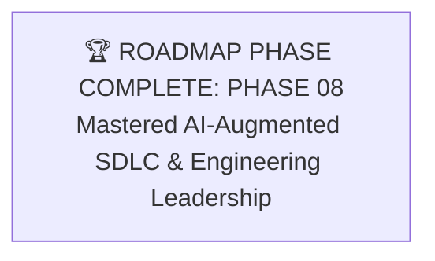
