# Phase 08: AI-Augmented SDLC & Engineering Leadership

> **A comprehensive, production-grade guide for Senior Developers, Tech Leads, and Software Architects navigating the transition from manual syntax creation to AI-native software engineering, autonomous coding agents, and architectural leadership in the era of Software 3.0.**

---

> Curriculum taxonomy aligns with the [3-tier classification defined in the root README](../README.md) (`[MUST-HAVE]` 🔴, `[GOOD-TO-HAVE]` 🟡, `[KNOWLEDGE-BASE]` 🔵).

---

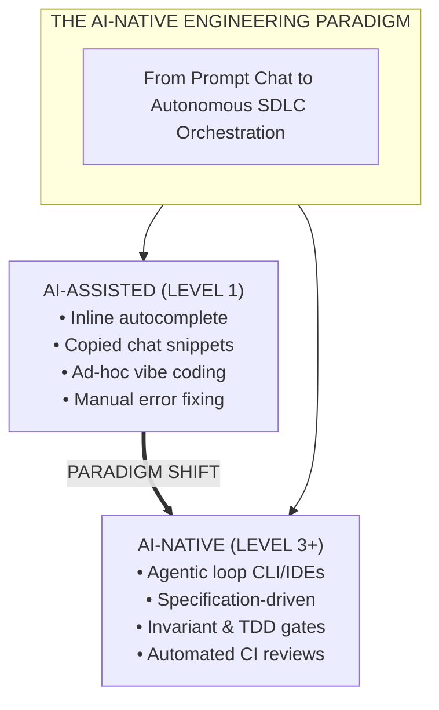

---

## 📑 Table of Contents

1. [Executive Summary & Lead Mental Model [MUST-HAVE] 🔴](#1-executive-summary--lead-mental-model-must-have-)
2. [Why This Matters for Senior & Lead Developers [MUST-HAVE] 🔴](#2-why-this-matters-for-senior--lead-developers-must-have-)
3. [Visual System Architecture & Flow Diagrams [MUST-HAVE] 🔴](#3-visual-system-architecture--flow-diagrams-must-have-)
4. [Comprehensive Comparison Tables [MUST-HAVE] 🔴](#4-comprehensive-comparison-tables-must-have-)
   - [2026 Agentic Coding Assistants Comparison: The Big Seven Matrix [MUST-HAVE] 🔴](#2026-agentic-coding-assistants-comparison-the-big-seven-matrix-must-have-)
   - [Traditional SDLC vs. AI-Assisted vs. AI-Native SDLC](#traditional-sdlc-vs-ai-assisted-vs-ai-native-sdlc)
5. [Deep-Dive Topics & Subtopics [MUST-HAVE] 🔴](#5-deep-dive-topics--subtopics-must-have-)
   - [5.1 The AI Developer Toolchain [MUST-HAVE] 🔴](#51-the-ai-developer-toolchain-must-have-)
   - [5.2 The AI-Native SDLC End-to-End [MUST-HAVE] 🔴](#52-the-ai-native-sdlc-end-to-end-must-have-)
   - [5.3 Designing Codebases for AI Agents ("AI-Friendliness") [MUST-HAVE] 🔴](#53-designing-codebases-for-ai-agents-ai-friendliness-must-have-)
   - [5.4 Engineering Leadership in the AI Era [MUST-HAVE] 🔴](#54-engineering-leadership-in-the-ai-era-must-have-)
   - [5.5 The Trust Gap & Verified Agentic Engineering [MUST-HAVE] 🔴](#55-the-trust-gap--verified-agentic-engineering-must-have-)
   - [5.6 AI-Specific Developer Productivity Metrics [GOOD-TO-HAVE] 🟡](#56-ai-specific-developer-productivity-metrics-good-to-have-)
   - [5.7 Codebase Context Standards [MUST-HAVE] 🔴](#57-codebase-context-standards-must-have-)
6. [Production Failure Modes & Anti-Patterns [MUST-HAVE] 🔴](#6-production-failure-modes--anti-patterns-must-have-)
7. [Practical Templates & Production Implementations [MUST-HAVE] 🔴](#7-practical-templates--production-implementations-must-have-)
8. [Curated Verified Resources [KNOWLEDGE-BASE] 🔵](#8-curated-verified-resources-knowledge-base-)
9. [Capstone Challenge: Establish an Enterprise AI-Native Repository Framework [MUST-HAVE] 🔴](#9-capstone-challenge-establish-an-enterprise-ai-native-repository-framework-must-have-)

---

## 1. Executive Summary & Lead Mental Model [MUST-HAVE] 🔴

### The AI-Native Engineering Paradigm

Software engineering is undergoing a platform shift comparable to the move from assembly to high-level compiled languages. Historically, development meant human engineers manually translating intent into syntax line-by-line, navigating files, writing tests retroactively, and reviewing diffs in web interfaces.

The first generation of developer AI (2021–2023) introduced **AI-assisted programming**: inline autocomplete (GitHub Copilot) and chat sidebars (ChatGPT, Claude). Developers remained primary typists, prompting LLMs for isolated functions and pasting snippets into editors.

The modern standard is the **AI-Native Software Engineering Lifecycle (SDLC)**:
1. **Developer as System Architect and Verification Arbiter**: Leads define domain models, system invariants, interface contracts, and automated verification suites. Autonomous agents implement changes against these specifications.
2. **Context-Engineered Repositories Over Ad-Hoc Prompts**: Repositories provide machine-readable metadata (`AGENT.md`, OpenAPI specs, Protobuf definitions, type annotations) guiding autonomous agent execution and validation loops.
3. **Continuous Verification Replaces Vibe Coding**: Probabilistic generation is bounded by deterministic test harnesses, static analysis, linter gates, and architectural boundary tests. Code is accepted only when satisfying executable constraints.
4. **Autonomous Agent Workflows Span the Full SDLC**: Agents analyze issues, draft ADRs, generate test matrices, perform atomic multi-file refactors, audit pull requests, and triage production incidents from OpenTelemetry traces.

### The SDLC Evolution Spectrum

| Dimension | Traditional SDLC | AI-Assisted SDLC | AI-Native SDLC |
|---|---|---|---|
| **Primary Interface** | Text Editor / IDE | Chat Sidebar + Tab | Autonomous CLI & Agentic IDE |
| **Unit of Work** | Line / Function | Method / File Snippet | Feature Branch / Pull Request |
| **Context Source** | Developer Memory | Active File Buffer | Full Repo Graph + MCP Servers |
| **Execution Loop** | Manual Read-Write | Manual Copy-Paste | Agentic ReAct (Tool-use loop) |
| **Quality Gate** | Manual Review + CI | Manual Review + CI | TDD Invariants + AI Review Bot |
| **Primary Constraint** | Typing & Search | Context Limits & Hallucinations | System Design & Verification |

### The Shift from Synthesizer to Editor & Verification Arbiter

In the AI-native lifecycle, code generation is abundant and low-cost. **The engineering bottleneck shifts to comprehension, verification, and system design**. 

A senior engineer orchestrating concurrent coding agents can produce thousands of lines of verified, architecturally aligned code daily. However, without rigorous guardrails, this velocity creates technical debt at scale. The architect's primary duty is ensuring velocity does not compromise architectural coherence, security boundaries, and domain invariants.

---

## 2. Why This Matters for Senior & Lead Developers [MUST-HAVE] 🔴

Leading engineering organizations through this transition requires confronting hard technical and organizational challenges:

### 1. Architecting Systems that Autonomous Agents Can Reason About
Traditional codebases often harbor implicit assumptions, hidden side effects, dynamic typing shortcuts, and tribal knowledge. Humans navigate these through intuition; autonomous agents fail catastrophically. Senior architects must construct **semantically predictable architectures**:
- Strongly typed domain models with zero tolerance for untyped dictionaries or `dynamic` primitives.
- Explicit interface boundaries (ports and adapters / hexagonal architectures) that isolate dependencies.
- Machine-readable contracts (OpenAPI 3.1, Protobuf 3, JSON Schema) as immutable single sources of truth.
- Hermetic test suites running locally in sub-minute windows for fast agent feedback loops.

### 2. Eliminating the "Vibe Coding" Epidemic in Enterprise Codebases
"Vibe coding"—iteratively prompting an agent until code compiles without understanding edge cases, transactions, or concurrency—threatens enterprise stability. Engineering leads must institute automated CI gates rejecting code that lacks test provenance, invariant validation, and architectural alignment.

### 3. Scaling Developer Velocity Without Knowledge Atrophy
Delegating implementation entirely to agents risks degrading domain comprehension. Engineering leads must cultivate a culture of **discernment and verification**, prioritizing critical evaluation and stress-testing of agent outputs over typing speed.

### 4. Navigating the Karpathy Continuum: Software 1.0 → 2.0 → 3.0
Computing has evolved through three distinct paradigms:
- **Software 1.0 (Classical Code)**: Human-authored explicit logic (C++, C#, Python, Go). Deterministic and interpretable, but fragile with ambiguous tasks.
- **Software 2.0 (Neural Networks)**: Optimization algorithms (gradient descent) searching parameter spaces defined by weights and data. High perceptual ability, but opaque and non-deterministic.
- **Software 3.0 (Agentic Systems)**: Foundation models acting as reasoning engines that orchestrate Software 1.0 tools, write Software 1.0 code, call Software 2.0 models, and execute complex workflows steered by specifications and protocols.

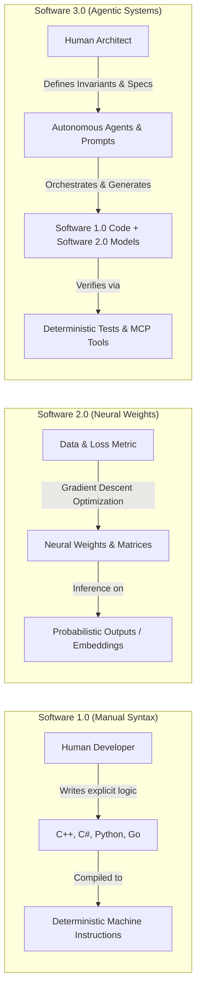

---

## 3. Visual System Architecture & Flow Diagrams [MUST-HAVE] 🔴

### The AI-Native SDLC Pipeline

The following diagram illustrates the complete, closed-loop software engineering lifecycle augmented by autonomous agents and deterministic verification gates:

```mermaid
flowchart TD
    subgraph SPEC["1. Specification & Requirements"]
        A["Feature Request / PRD"] --> B["AI Requirements Breakdown Agent"]
        B -->|"Extracts user stories"| C["Edge-Case & Failure Mode Generator"]
        C -->|"Synthesizes"| D["Gherkin / Executable Acceptance Criteria"]
    end

    subgraph ARCH["2. Architectural RFC & Design"]
        D --> E["Architectural Design Agent"]
        E -->|"Evaluates trade-offs"| F["Trade-off Matrix & Sequence Diagrams"]
        F -->|"Generates formal contracts"| G["OpenAPI 3.1 / Protobuf Schemas"]
        G -->|"Human Sign-off"| H{"Lead Architect Gate"}
    end

    subgraph TDD["3. Test-Driven Development (TDD)"]
        H -->|"Approved Spec"| I["AI Test Generation Agent"]
        I -->|"Writes failing tests"| J["Unit, Integration & Property Tests (RED)"]
    end

    subgraph CODE["4. Implementation & Refactoring"]
        J --> K["Autonomous Coding Agent (Claude Code / Cursor)"]
        K -->|"Generates code to satisfy tests"| L["Local Build & Test Runner (GREEN)"]
        L -->|"Fails tests"| K
        L -->|"Passes tests"| M["AI Refactoring & Optimization Loop"]
        M -->|"Enforces style & DRY"| N["Clean, Passing Feature Branch"]
    end

    subgraph REVIEW["5. Automated Review & CI/CD"]
        N --> O["Pull Request Submitted"]
        O --> P["AI PR Security & Arch Review Bot"]
        P -->|"Checks schema drift, SQLi, invariants"| Q{"Automated PR Gate"}
        Q -->|"Violations detected"| K
        Q -->|"Approved"| R["Human Peer / Lead Review"]
        R -->|"Merge"| S["CI/CD Deployment to Staging/Prod"]
    end

    subgraph OBS["6. Production Observability & RCA"]
        S --> T["Telemetry, Logs & Traces (OpenTelemetry)"]
        T -->|"Exception / Alert"| U["AI RCA & Incident Triage Agent"]
        U -->|"Correlates logs & stack trace"| V["Automated Post-Mortem & Fix PR"]
        V -->|"Feeds back into"| I
    end

    style H fill:#f96,stroke:#333,stroke-width:2px
    style Q fill:#f96,stroke:#333,stroke-width:2px
    style R fill:#f96,stroke:#333,stroke-width:2px
```

---

### Repository Context Hierarchy for Coding Agents

Autonomous agents navigate codebases hierarchically. Providing the right abstraction level at each layer prevents context exhaustion and hallucinations:

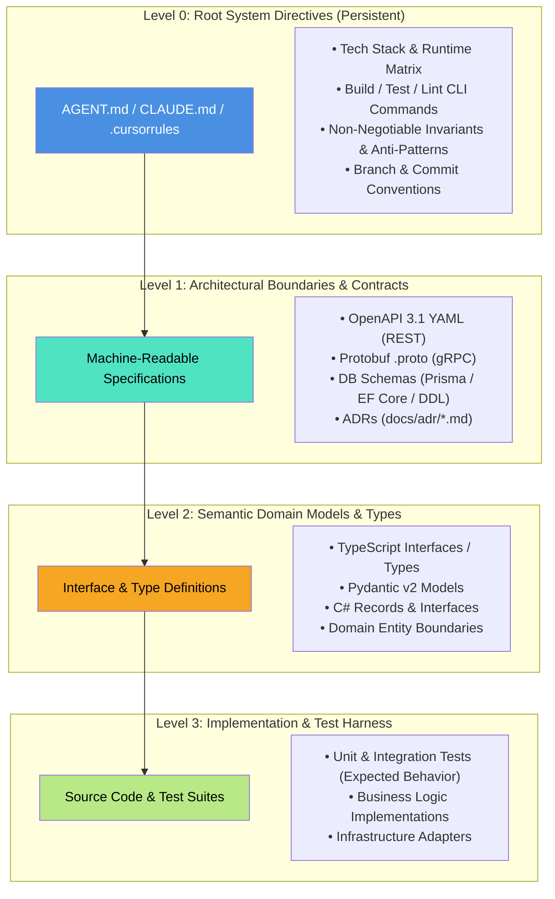

---

## 4. Comprehensive Comparison Tables [MUST-HAVE] 🔴

### 2026 Agentic Coding Assistants Comparison: The Big Seven Matrix [MUST-HAVE] 🔴

The developer tooling landscape in 2026 has transitioned from simple tab-autocomplete to full autonomous agentic execution loops. Senior architects must understand the architectural trade-offs, context grounding models, and blast radiuses across the seven major assistants:

| Dimension / Assistant | **Claude Code (CLI)** | **Cursor (IDE)** | **Windsurf (Cascade)** | **GitHub Copilot** | **OpenAI Codex (Cloud)** | **Gemini Code Assist** | **Amazon Q Developer** |
|:---|:---|:---|:---|:---|:---|:---|:---|
| **Primary Form Factor** | Standalone Terminal / CLI Agent | Dedicated Agentic IDE (VS Code Fork) | Dedicated Agentic IDE (Cascade Engine) | Universal IDE Plugin (VS Code, JetBrains, Visual Studio) | Cloud-Native Sandbox / Canvas & Background Agent | IDE Plugin & Cloud Workstations | IDE Plugin, CLI Agent & AWS Management Console |
| **Foundation Engine** | Claude 3.7 Sonnet (Hybrid CoT reasoning tokens) | Multi-Model Picker (Claude 3.7 Sonnet, GPT-4.5 / o3, o3-mini) | Claude 3.7 Sonnet, GPT-4.5 / o3 + proprietary FIM models | Multi-Model Picker (Claude 3.7, GPT-4.5 / o3, o1/o3-mini) | OpenAI o3 / o4-mini, GPT-4.5 / o3, Codex VM runtime | Gemini 2.5 Pro / Flash (Up to 2M token context window) | Anthropic Claude 3.5/3.7 + Amazon Titan (via Bedrock) |
| **Execution Loop Architecture** | Direct ReAct loop over bash, local file tools, git, and compiler outputs | Native client with shadow workspaces & speculative diff staging | Cascade Flow engine tracking real-time developer intent & active terminals | Client-side LSP extension paired with cloud chat orchestrator | Cloud-hosted headless ReAct loop in containerized sandboxes | Vertex AI grounding engine with workspace semantic graph | Enterprise agent orchestrator with AWS SDK tool execution |
| **Codebase Context Strategy** | Local ripgrep, AST-grep, git commit history, file tree traversal | `@codebase` Merkle vector index + AST symbol index | Cascade Flow tracker + active terminal log stream + workspace graph | Workspace symbol indexing + active tab embeddings + repo search | Full repository cloud clone snapshot + AST symbol graph | Gemini 2M context window ingestion + Google Code Search graph | AWS CodeConnections repo index + AST security analyzer |
| **Multi-File Refactoring** | Native autonomous patch generation, multi-file search & replace, test loop | Composer: simultaneous multi-file streaming diffs with atomic accept/reject | Multi-file Cascade flows with step-by-step dependency tracking | Multi-file edits via Copilot Edits / Workspace side-by-side diffs | Autonomous branch-wide refactoring with pull request generation | Multi-file suggestions via inline diffs and chat integration | Automated enterprise transformations (Java 8/11→17/21, .NET Core) |
| **Terminal / Shell Autonomy** | Full shell autonomy (executes builds, runs tests, git commands, npm/dotnet) | Integrated terminal runner with 1-click human execution approval | Autonomous terminal commands within Cascade flow with guardrails | Suggests bash commands in terminal chat (manual enter required) | Sandboxed headless cloud Linux container execution (ephemeral VM) | Cloud Shell integration & terminal generation via Cloud Code | Amazon Q CLI agent for bash, AWS CLI commands, & cloud scripts |
| **Protocol & Extensibility** | Model Context Protocol (MCP) native client, custom CLI commands | `.cursorrules`, `.cursor/rules/*.mdc`, MCP client support | `.windsurfrules`, custom Cascade tools, MCP integration | GitHub Copilot Extensions, Copilot Agent Mode, custom instructions | OpenAPI 3.0 tool schemas, GitHub App webhooks, Python sandbox | Google Agent Development Kit (ADK), Vertex AI Extensions, GCP IAM | AWS Bedrock agent protocol, Lambda tool hooks, IAM role policies |
| **Enterprise Privacy & Security** | Anthropic commercial zero-retention API; no code training | SOC 2 Type II, Privacy Mode (zero retention, no code training) | SOC 2 Type II, enterprise zero data retention policy | Enterprise data protection, commercial IP indemnification, no training | Enterprise tenant isolation, SOC 2 Type II, zero model training | GCP compliance (ISO 27001, SOC 1/2/3), zero prompt/code retention | AWS enterprise IAM boundary, zero customer code used for training |
| **Optimal Architectural Role** | Deep batch refactors, CI/CD triage, test harness generation, terminal devs | Fast daily feature development, interactive multi-file coding | Flow-state interactive development with tight terminal-editor loops | Universal baseline enterprise autocomplete, inline chat, and PR summaries | Asynchronous background maintenance, issue-to-PR unattended bots | Monorepo reasoning with huge contexts, GCP-native cloud systems | Enterprise legacy modernization, AWS cloud infrastructure (CDK/IaC) |
| **Critical Blind Spot / Pitfall** | High token consumption on broad exploratory queries without tight specs | Can desync or drop context if Merkle vector index becomes stale | Smaller extension ecosystem compared to vanilla VS Code marketplace | Autocomplete bias toward legacy patterns; multi-file refactors slower | High latency for interactive coding; no direct local laptop context | Slower cold-start reasoning on non-GCP/non-Go/Java stacks | AWS ecosystem lock-in; weaker on multi-cloud / non-AWS architectures |

---

### Traditional SDLC vs. AI-Assisted vs. AI-Native SDLC

| Lifecycle Phase | **Traditional SDLC (Manual)** | **AI-Assisted (Chat & Snippets)** | **AI-Native SDLC (Agent-Orchestrated)** |
|---|---|---|---|
| **Requirements & User Stories** | PM writes PRD in Confluence; engineers manually extract technical acceptance criteria over multiple grooming sessions. | Engineers paste PRD paragraphs into ChatGPT to ask "What edge cases did I miss?" | Agent ingests PRD, cross-references existing schema, generates Gherkin acceptance tests, and flags unhandled error modes automatically. |
| **System Architecture & RFCs** | Architect spends weeks creating trade-off decks, sequence diagrams, and interface drafts by hand. | Architect uses chat to brainstorm pros/cons of databases or generate initial Mermaid syntax. | Agent generates comparative trade-off matrix, benchmarks latency/cost profiles, generates OpenAPI 3.1 contracts, and drafts complete ADR. |
| **Test Design & TDD** | Tests often written after code (or skipped entirely under deadline pressure); manual mocking of dependencies. | Developer prompts: "Write unit tests for this function I just wrote" (retroactive testing). | AI-driven TDD: Agent generates full parameterized unit, integration, and property test suites *before* any implementation code exists. |
| **Code Implementation** | Developer types all boilerplate, business logic, mapping code, and unit tests manually. | Developer uses tab autocomplete and prompts chat for utility snippets; manually copies/pastes. | Developer specifies interface constraints; agent plans multi-file diff, writes code, executes local compiler/test runner, and fixes failures iteratively. |
| **Code Review & Quality Gates** | Human peer spends 45 minutes spotting syntax nits, missing null checks, and style deviations; deep architectural flaws often missed. | Human reviewer runs a local linter or pastes diff into chat for a summary. | Multi-tier AI Review Agent inspects PR against architectural invariants, SQL injection vectors, and breaking contract changes before human sees it. |
| **Maintenance & Modernization** | Multi-month manual code migration initiatives (e.g., .NET Framework to .NET 8/9, Python 2 to 3). | Developers convert individual classes one at a time via chat windows. | Autonomous agent processes solution tree file-by-file, runs automated migration recipes, compiles, fixes errors, and issues atomic PRs. |
| **Incident Response & RCA** | On-call engineer manually sifts through thousands of Splunk/CloudWatch logs and traces to reconstruct root cause. | Engineer pastes stack trace into chat to decipher obscure exceptions. | Autonomous triage agent ingests OTel trace, correlates exception logs, isolates faulty commit, and drafts complete RCA with repro test case. |

---

## 5. Deep-Dive Topics & Subtopics [MUST-HAVE] 🔴

### 5.1 The AI Developer Toolchain [MUST-HAVE] 🔴

#### 1. Autonomous Coding Agents in Practice
Autonomous coding agents differ fundamentally from autocomplete extensions. They operate via an **observe-orient-decide-act (OODA) or ReAct (Reason + Act)** loop:
1. **Observe**: The agent reads workspace directory structures, file contents, git statuses, and compiler/test diagnostics.
2. **Reason**: The agent evaluates its progress toward a stated goal, synthesizes dependencies, and determines the next necessary atomic action.
3. **Act**: The agent executes a tool—such as modifying a file chunk, creating a directory, running a build command via bash, or querying an external documentation server.
4. **Evaluate**: The agent analyzes tool output (e.g., standard error from a failing test) and decides whether to self-correct or conclude the task.

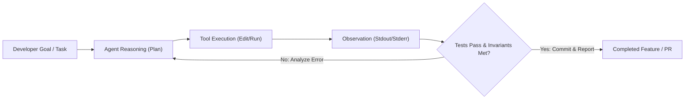

#### 2. Protocol Integration: LSP vs. Model Context Protocol (MCP)
Modern AI-native engineering environments bridge two essential protocol layers:
- **Language Server Protocol (LSP)**: Provides deterministic, AST-based code intelligence (type checking, symbol navigation, go-to-definition, reference counting). Agents query LSP endpoints to eliminate symbol and signature hallucinations.
- **Model Context Protocol (MCP)**: An open standard created by Anthropic allowing agents to discover and invoke external tools and context (database schemas, GitHub/Jira issues, Sentry error logs, cloud CLI tools) via structured JSON-RPC 2.0.

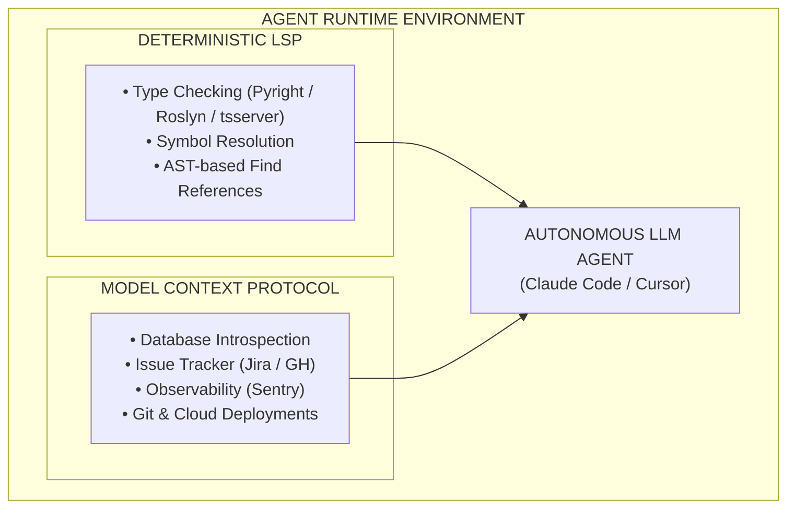

---

### 5.2 The AI-Native SDLC End-to-End [MUST-HAVE] 🔴

#### Step 1: Requirements & Product Specifications
AI agents excel at identifying boundary edge cases that human product managers overlook. By feeding a preliminary PRD into an analysis agent, teams can generate an **exhaustive failure mode and edge-case matrix**:

```markdown
<!-- Prompt Pattern: PRD Boundary & Edge-Case Synthesizer -->
You are a Principal Software Architect and QA Lead. Analyze the following Product Requirements Document (PRD).
For every functional requirement:
1. Identify at least 3 edge cases (concurrency, network partition, boundary numerical limits, malformed payloads).
2. Synthesize testable Given-When-Then (Gherkin) acceptance criteria.
3. Identify all implicit assumptions that require clarification before architectural sign-off.
```

*Example Output Generated for an E-Commerce Checkout Service*:
```gherkin
Feature: Order Checkout Invariant Enforcement

  Scenario: Concurrent checkout of the final inventory item
    Given an item "SKU-9921" has an available inventory of 1
    When User A and User B concurrently submit a checkout request within a 10ms window
    Then exactly one user receives HTTP 201 Created with an active Order ID
    And the other user receives HTTP 409 Conflict with error code "INSUFFICIENT_STOCK"
    And the inventory balance in PostgreSQL never drops below 0
    And an audit log entry is recorded with trace correlation across both transactions
```

---

#### Step 2: Architectural RFC & Design
Rather than drafting RFCs in isolation, senior architects use AI to benchmark competing architectural patterns, synthesize trade-off matrices, and generate machine-readable contracts.

##### Architectural Trade-Off Analysis Example
```markdown
| Architectural Option | Latency (p99) | Operational Complexity | Cost at 10M req/day | Consistency Model | Failure Blast Radius |
|---|---|---|---|---|---|
| **A: PostgreSQL + Read Replicas** | 12ms | Low (Standard managed DB) | $350 / month | Strong (Primary) / Eventual (Replicas) | High (Single writer database bottleneck) |
| **B: DynamoDB + DAX Caching** | 2ms | Medium (Key design overhead) | $1,200 / month | Eventual (Standard) / Strong (Optional) | Low (Partition-isolated scaling) |
| **C: Redis Fronted CockroachDB** | 4ms | High (Multi-cluster consensus) | $2,100 / month | Strict Serializable | Minimal (Multi-region active-active survivable) |
```

##### Interface-First Contract Synthesis
Before writing business logic, the architect uses an agent to produce strict **OpenAPI 3.1** or **Protobuf** specifications:

```yaml
# contracts/payment-service.yaml
openapi: 3.1.0
info:
  title: Payment Gateway Processing API
  version: 1.0.0
paths:
  /v1/payments/charges:
    post:
      summary: Process an idempotent customer payment charge
      operationId: processPaymentCharge
      parameters:
        - name: Idempotency-Key
          in: header
          required: true
          schema:
            type: string
            format: uuid
      requestBody:
        required: true
        content:
          application/json:
            schema:
              $ref: '#/components/schemas/PaymentRequest'
      responses:
        '201':
          description: Payment processed successfully
          content:
            application/json:
              schema:
                $ref: '#/components/schemas/PaymentResponse'
        '409':
          description: Idempotent replay detected or concurrent operation pending
          content:
            application/json:
              schema:
                $ref: '#/components/schemas/ApiError'
components:
  schemas:
    PaymentRequest:
      type: object
      required: [customerId, amountInCents, currency]
      properties:
        customerId:
          type: string
          format: uuid
        amountInCents:
          type: integer
          minimum: 50
          maximum: 100000000
        currency:
          type: string
          pattern: '^[A-Z]{3}$'
```

---

#### Step 3: Test-Driven Development (TDD) with AI

The classical Agile **Red-Green-Refactor** loop achieves peak efficiency when paired with coding agents:
1. **Red (Specification as Tests)**: The agent is instructed *not* to write business logic yet, but solely to write the comprehensive test suite based on the OpenAPI or domain contract. Every test must initially fail.
2. **Green (Minimal Compliant Code)**: The agent implements the simplest possible production code to make all test assertions pass.
3. **Refactor (Architectural Optimization)**: The agent refactors the code to eliminate duplication, enhance algorithmic efficiency, and enforce architectural invariants, verified continuously by automated test execution.

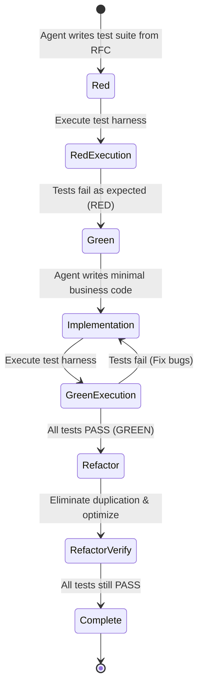

##### Executable TDD Example (C# / .NET 9)
```csharp
// tests/PaymentService.Tests/PaymentProcessorTests.cs
using System.Net;
using FluentAssertions;
using Xunit;
using Moq;

namespace PaymentService.Tests;

public class PaymentProcessorTests
{
    private readonly Mock<IPaymentGatewayClient> _gatewayMock = new();
    private readonly Mock<IIdempotencyStore> _idempotencyStoreMock = new();
    private readonly PaymentProcessor _sut;

    public PaymentProcessorTests()
    {
        _sut = new PaymentProcessor(_gatewayMock.Object, _idempotencyStoreMock.Object);
    }

    [Fact]
    public async Task ProcessPayment_WhenIdempotencyKeyExists_ReturnsCachedResultWithoutCallingGateway()
    {
        // Arrange
        var idempotencyKey = Guid.NewGuid();
        var cachedResponse = new PaymentResult(Guid.NewGuid(), 5000, "USD", PaymentStatus.Succeeded);
        
        _idempotencyStoreMock
            .Setup(x => x.TryGetCachedResultAsync(idempotencyKey, CancellationToken.None))
            .ReturnsAsync(cachedResponse);

        var request = new ProcessPaymentCommand(Guid.NewGuid(), 5000, "USD", idempotencyKey);

        // Act
        var result = await _sut.ProcessPaymentAsync(request, CancellationToken.None);

        // Assert
        result.Should().BeEquivalentTo(cachedResponse);
        _gatewayMock.Verify(x => x.ChargeCardAsync(It.IsAny<GatewayChargeRequest>(), It.IsAny<CancellationToken>()), Times.Never);
    }

    [Theory]
    [InlineData(0)]
    [InlineData(-100)]
    [InlineData(49)] // Below minimum 50 cents requirement
    public async Task ProcessPayment_WhenAmountIsInvalid_ThrowsValidationException(long invalidAmount)
    {
        // Arrange
        var command = new ProcessPaymentCommand(Guid.NewGuid(), invalidAmount, "USD", Guid.NewGuid());

        // Act
        Func<Task> act = async () => await _sut.ProcessPaymentAsync(command, CancellationToken.None);

        // Assert
        await act.Should().ThrowAsync<ArgumentOutOfRangeException>()
            .WithParameterName("amountInCents");
    }
}
```

---

#### Step 4: Code Generation & Legacy Modernization

A premier use case for autonomous agents is multi-file refactoring and modernization of legacy codebases (e.g., migrating monolithic **.NET Framework 4.8 WCF/ASP.NET** services to **.NET 8/9 ASP.NET Core** minimal APIs, or migrating Python 2.7 scripts to modern Python 3.12 with Pydantic v2).

##### Case Study: Modernizing Legacy .NET Framework WCF to .NET 9 Minimal API
*Before (Legacy .NET Framework 4.8 WCF Service Contract)*:
```csharp
// Legacy WCF ServiceContract (System.ServiceModel, .NET Framework 4.8)
[ServiceContract]
public interface IOrderService
{
    [OperationContract]
    [FaultContract(typeof(OrderFault))]
    OrderResponse PlaceOrder(OrderRequest request);
}

[DataContract]
public class OrderRequest
{
    [DataMember]
    public int CustomerId { get; set; }
    [DataMember]
    public decimal TotalAmount { get; set; }
}
```

*After (Modern .NET 9 Clean Architecture Minimal API with C# 13 Features)*:
```csharp
// Modern .NET 9 Minimal API Endpoint (C# 13, Native AOT-ready)
namespace OrderService.Endpoints;

public record PlaceOrderRequest(
    Guid CustomerId,
    [property: Range(1, 10_000_000)] decimal TotalAmount,
    string Currency = "USD"
);

public record PlaceOrderResponse(
    Guid OrderId,
    string Status,
    DateTimeOffset CreatedAtUtc
);

public static class OrderEndpoints
{
    public static RouteGroupBuilder MapOrderEndpoints(this RouteGroupBuilder group)
    {
        group.MapPost("/", async (
            PlaceOrderRequest request,
            IOrderHandler handler,
            CancellationToken ct) =>
        {
            var result = await handler.HandleOrderAsync(request, ct);
            return result.Match(
                order => TypedResults.Created($"/api/v1/orders/{order.OrderId}", order),
                error => TypedResults.Problem(statusCode: (int)error.StatusCode, title: error.Message)
            );
        })
        .WithName("PlaceOrder")
        .WithOpenApi()
        .RequireRateLimiting("StrictFinancialLimit");

        return group;
    }
}
```

---

#### Step 5: Automated Code Review & Security Scanning

Human code reviewers suffer from fatigue, cognitive overload, and rubber-stamp syndrome. An autonomous PR review agent provides consistent, non-tiring enforcement of architectural rules, security boundaries, and performance invariants.

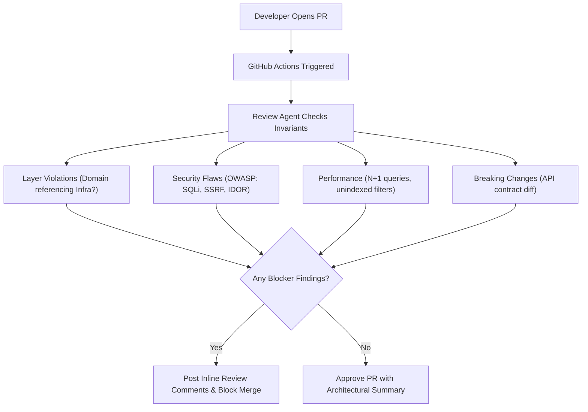

---

#### Step 6: Incident Response & Automated Root Cause Analysis (RCA)

When production failures occur, minutes matter. An AI-augmented incident response pipeline ingests real-time telemetry, correlates traces, and provides actionable remediation PRs.

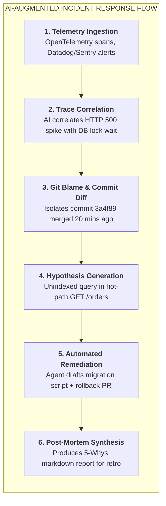

##### Automated Post-Mortem Incident Template Generated by AI
```markdown
# Incident RCA Report: INC-2026-09-8821
**Date:** September 26, 2026  
**Severity:** SEV-1 (Production API Partial Outage)  
**Impact:** 14.2% of checkout attempts failed between 14:10 UTC and 14:38 UTC (28 minutes).

## Executive Summary
A database deadlocking cascade occurred in the `Orders` table following the deployment of release `v2.14.0`. The newly introduced `CustomerLoyalty` update lacked an indexed foreign key, causing table-level lock escalation under high concurrent write loads.

## Five-Whys Root Cause Analysis
1. **Why did checkouts fail?** Database queries timed out with PostgreSQL error `55P03: lock_not_available`.
2. **Why were locks unavailable?** The `ProcessOrder` transaction held an exclusive table lock on `CustomerLoyalty`.
3. **Why did it hold an exclusive lock?** A newly added query executed an `UPDATE CustomerLoyalty SET Points = Points + ? WHERE CustomerExternalId = ?` without an index on `CustomerExternalId`.
4. **Why was the index missing?** The agent that generated migration `0042_add_loyalty.sql` did not specify an index, and the PR review bot had its SQL performance rule disabled for migration files.
5. **Why was the rule disabled?** A legacy configuration override in `.agent/rules.yaml` excluded files under `migrations/`.

## Remediation & Preventative Actions
- [x] Applied hotfix migration adding `CONCURRENTLY` index on `CustomerLoyalty(CustomerExternalId)`.
- [x] Restored PR review bot rule: Mandatory `EXPLAIN ANALYZE` evaluation for all SQL schema additions.
- [x] Added automated load test gate simulating 500 concurrent checkout writes in pre-production staging.
```

---

### 5.3 Designing Codebases for AI Agents ("AI-Friendliness") [MUST-HAVE] 🔴

To maximize coding agent accuracy and prevent hallucinations, system architectures must be optimized for **machine comprehension**.

#### Principles of AI-Friendly Codebases

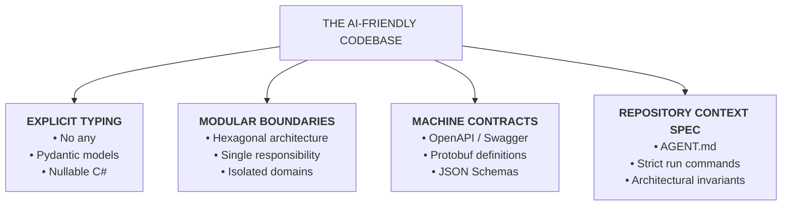

1. **Strict Static Typing**: Dynamically typed or unannotated code forces agents to infer property structures, driving hallucinations. Mandate strict TypeScript (`strict: true`, no `any`), Python with Pydantic v2 and `mypy --strict`, C# with `<Nullable>enable</Nullable>`, or Go/Rust.
2. **Clear Interface Boundaries (Ports & Adapters)**: Domain logic must not directly couple to databases or external APIs. Dependency injection allows agents to construct hermetic unit tests without mocking infrastructure trees.
3. **Modular File Sizing (< 300 Lines per File)**: Monolithic files degrade attention mechanisms and cause context truncation. Enforce single-responsibility modules.
4. **Machine-Readable API Contracts as Truth**: Maintain OpenAPI 3.1 or Protobuf specifications directly in the repository; validate code changes using contract linters (`spectral lint`, `buf lint`).
5. **Context Anchors (`AGENT.md`, `CLAUDE.md`, `.cursorrules`)**: Provide concise, structured operational manuals at the repository root defining build, test, and style invariants.

---

### 5.4 Engineering Leadership in the AI Era [MUST-HAVE] 🔴

#### 1. Managing Probabilistic Code Generation
Writing code is no longer purely deterministic. When dealing with probabilistic language models:
- **Zero Unreviewed Agent Commits**: Every line of agent-generated code must be reviewed by a human engineer who understands the implications and accepts production ownership.
- **Verification Provenance**: Require pull requests to demonstrate test execution output, coverage metrics, and linter runs before requesting human review.
- **Defensive Coding Standards**: Explicitly train engineers to look for common LLM failure modes: hallucinated package imports, subtly inverted boolean logic, unhandled exception paths, and insecure default configurations.

#### 2. Measuring Team Productivity: DORA in the AI Era
Traditional metrics like Lines of Code (LOC), commit counts, or closed story points are fundamentally broken in an AI-assisted world where an agent can generate 10,000 lines of boilerplate in seconds.

Senior engineering leadership must evaluate productivity using the **DORA (DevOps Research and Assessment)** framework supplemented by AI-specific health metrics:

```markdown
| Metric Category | Traditional DORA Metric | Impact in AI-Native SDLC | Target Benchmark |
|---|---|---|---|
| **Velocity** | **Lead Time for Changes (LTFC)** | Drastically compresses from weeks to hours if automated review gates are robust. | $< 4$ Hours from commit to production |
| **Velocity** | **Deployment Frequency (DF)** | Increases significantly due to smaller, atomic, agent-assisted pull requests. | Multiple deployments per day per team |
| **Quality** | **Change Failure Rate (CFR)** | The critical canary metric: if CFR rises, agents are generating unverified technical debt. | $< 5\%$ of production releases |
| **Recovery** | **Time to Restore Service (TTRS)** | Compresses as AI incident triage agents isolate root causes and suggest rollback/fixes rapidly. | $< 30$ Minutes |
| **AI Health** | **Architectural Drift Index** | Measures frequency of unauthorized dependency additions and architectural layer violations. | Zero unapproved exceptions |
| **AI Health** | **PR Rework Rate** | Percentage of PRs requiring > 3 review cycles due to agent hallucination or missed criteria. | $< 10\%$ of pull requests |
```

#### 3. Mentoring Senior & Junior Developers: The Apprenticeship Dilemma
One of the most pressing organizational challenges in software leadership is the **Apprenticeship Crisis**:
- *The Dilemma*: Historically, junior developers learned the craft by writing repetitive boilerplate, simple CRUD endpoints, unit tests, and bug fixes. Today, AI agents perform these tasks instantaneously. If junior engineers don't write basic code, how do they develop the intuition required to become senior architects?
- *The Solution: Up-leveling Early-Career Engineers*:
  1. **Shift Focus to Code Auditing & Discernment**: Train junior engineers to act as code reviewers for the agent, verifying correctness, testing edge cases, and checking performance.
  2. **Pair Programming with Agents**: Have junior engineers describe architectural intent to the agent, verify each step, and explain *why* the agent's initial approach was suboptimal.
  3. **Mandatory Deep-Dive Drills**: Conduct weekly team drills where developers inspect generated code down to the assembly, IL, or runtime execution level to understand underlying mechanisms.

---

### 5.5 The Trust Gap & Verified Agentic Engineering [MUST-HAVE] 🔴

> **☕ The Coffee Chat Summary**: Look across your engineering department in late 2026. Virtually everyone—over **90% of developers**—uses an AI assistant every single week. Cursor is open, Claude Code is humming in the terminal, Copilot is autocompleting. But pull those same senior developers aside and ask: *"Do you actually trust the code it generates?"* The number plummets to **29%**. That massive chasm is **The Trust Gap**. The solution isn't to retreat into manual typing; it's transitioning from sloppy "vibe coding" to **Verified Agentic Engineering**, where probabilistic agents operate inside deterministic invariant harnesses.

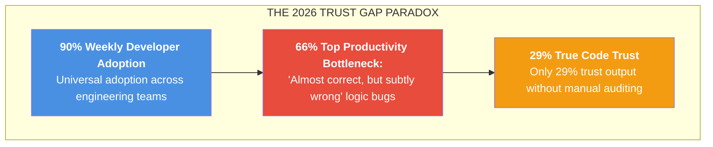

#### 1. The Bottleneck: "Almost Correct, But Subtly Wrong"
When a traditional compiler or runtime throws a syntax error or a `NullReferenceException`, it fails loudly and immediately (Fail-Fast). The developer fixes it in 30 seconds.

Probabilistic coding agents introduce an entirely new failure mode: **code that is syntactically pristine, beautifully formatted, adheres to linting rules, passes its own superficial unit tests, but is catastrophically, subtly wrong**.
- **66% of software engineers** report that detecting and debugging these subtle semantic bugs is their **#1 productivity bottleneck** in AI-augmented workflows.
- These bugs slip past standard peer reviews because human reviewers suffer from *cognitive complacency*: when code looks elegant and has green unit tests, reviewers naturally drop their guard.

#### 💡 The Mental Model: The Savant Intern & The Karpathy Iron Man Suit (ELI10)
Imagine you hire a 16-year-old savant intern. They have memorized every computer science textbook ever printed. They can type 250 words per minute without blinking.
- **The Vibe Coding Trap**: You ask the intern: *"Build a high-throughput bank account transfer service."* In 15 seconds, they hand you 200 lines of gorgeous, idiomatic C# code. You skim it, see async methods, and ship it to production. At midnight, two concurrent transfers hit the account simultaneously. The intern never worked on a real banking system, so they didn't implement atomic database locks or idempotency keys. Money vanishes into thin air.
- **The Karpathy Iron Man Suit**: In late 2026, Andrej Karpathy reframed the true role of AI in engineering: **We are not building an autopilot where the pilot sleeps in the passenger cabin; we are stepping into Tony Stark's Iron Man suit.**
  The suit amplifies your physical strength a hundredfold (supersonic code generation, instant multi-file refactoring, autonomous test generation). But **you are the pilot inside the helmet**. You set the flight trajectory, dictate the tactical invariants, and monitor the heads-up display (HUD). You do not fire a single repulsor blast until your deterministic onboard computers confirm the target locks.

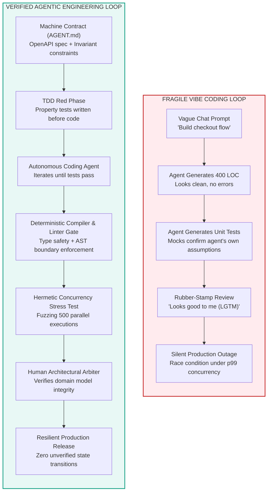

#### 🔥 Production War Story: The 2:14 AM Concurrency Cascade
> *It's 2:14 AM on a Sunday. PagerDuty sounds a SEV-1 klaxon: `SubscriptionRenewalService` has locked up, PostgreSQL connection pool exhaustion is logging `53300: too_many_connections`, and the billing service is timing out at the p99 threshold (45,000ms).*
>
> *The on-call tech lead inspects git blame. Commit `4b88fa` was merged on Friday afternoon with the title: 'AI modernization of renewal batch worker using async parallelism.'*
>
> *The PR author used an agentic assistant. The agent generated the following routine:*

```csharp
// THE SUBTLE TIMEBOMB GENERATED BY THE AGENT:
public async Task ProcessRenewalsAsync(List<SubscriptionId> pendingIds)
{
    // The agent's idea of 'high performance': spawn unbounded concurrent tasks!
    var tasks = pendingIds.Select(async id =>
    {
        // BUG 1: Creating a brand-new DI scope and DB connection for every single item
        using var scope = _serviceProvider.CreateScope();
        var db = scope.ServiceProvider.GetRequiredService<BillingDbContext>();
        
        var sub = await db.Subscriptions.FindAsync(id);
        if (sub != null && !sub.IsProcessed)
        {
            // BUG 2: Non-atomic check-then-act without row-level lock (SELECT FOR UPDATE)
            sub.IsProcessed = true;
            await db.SaveChangesAsync();
            await _paymentGateway.ChargeCustomerAsync(sub.CustomerId, sub.Amount);
        }
    });

    await Task.WhenAll(tasks);
}
```

> *The failure was catastrophic:*
> 1. At 2:00 AM, the cron job triggered for 18,000 scheduled renewals. The code spawned 18,000 unbounded concurrent tasks in 40 milliseconds, completely exhausting the database pool of 200 connections.
> 2. Because the agent wrote unit tests using an in-memory database mock with only 3 test items, the mock connection pool never saturated!
> 3. Even worse: because `sub.IsProcessed` was not guarded by a database transaction or distributed lock, network retries from the payment gateway resulted in **1,120 customers being charged twice**.
>
> *The fix required rolling back the commit, issuing $142,000 in customer refunds, and establishing an invariant rule in `AGENT.md` forbidding unbounded `Task.WhenAll` over database contexts.*

#### 2. Comparison: Vibe Coding vs. Verified Agentic Engineering

| Dimension | Vibe Coding (Level 1–2) | Verified Agentic Engineering (Level 3–4) |
|:---|:---|:---|
| **Core Philosophy** | "If it compiles and tests pass, ship it." | "Code is guilty until proven innocent by deterministic invariants." |
| **Primary Artifact** | Conversational chat prompts in IDE window. | Version-controlled machine contracts (`AGENT.md`, OpenAPI, Protobuf). |
| **Testing Approach** | Agent writes unit tests testing its own hallucinations. | Human/Spec-first invariant, property-based, and concurrency tests. |
| **Execution Loop** | Unbounded trial-and-error until error disappears. | Closed ReAct loop with compiler, linter, and AST feedback gates. |
| **Failure Detection** | Discovered in staging or 2:00 AM production alerts. | Caught in local hermetic test harness before PR creation. |
| **Human Role** | Typist who prompts and blindly nods at diffs. | Pilot in the Iron Man suit: System Architect & Verification Arbiter. |
| **Code Longevity** | High churn; rewritten every 3 months due to debt. | Stable, maintainable, aligned with long-term architecture. |

#### 3. Production Verification Harness Implementations

To close the trust gap, senior architects mandate executable verification harnesses that test system invariants rather than static mocks.

##### Python: Contract Invariant Verification with Pydantic v2 & Hypothesis
This pattern uses property-based testing (`Hypothesis`) to fuzz the agent's implementation across 200 randomized edge cases, preventing subtle boundary bugs:

```python
# tests/test_payment_invariants.py
from decimal import Decimal
from uuid import UUID, uuid4
import pytest
from hypothesis import given, strategies as st
from pydantic import BaseModel, Field, field_validator

# 1. Machine-Readable Domain Specification (The Contract)
class PaymentTransferCommand(BaseModel):
    transaction_id: UUID
    source_account_id: UUID
    target_account_id: UUID
    amount: Decimal = Field(gt=Decimal("0.00"), max_digits=12, decimal_places=2)
    idempotency_key: str = Field(min_length=16, max_length=64)

    @field_validator("target_account_id")
    @classmethod
    def prevent_self_transfer(cls, v: UUID, info) -> UUID:
        if "source_account_id" in info.data and v == info.data["source_account_id"]:
            raise ValueError("Invariant violation: Source and target accounts cannot be identical.")
        return v

# 2. Hypothesis Property Test: Stress-testing invariant rules against agent output
@given(
    amount=st.decimals(min_value=Decimal("0.01"), max_value=Decimal("1000000.00"), places=2),
    idempotency_key=st.text(min_size=16, max_size=64, alphabet=st.characters(blacklist_categories=("Cs",)))
)
def test_transfer_invariants_hold_across_domain_boundaries(amount: Decimal, idempotency_key: str):
    source_id = uuid4()
    target_id = uuid4()

    # Invariant 1: Valid transfers must instantiate cleanly
    cmd = PaymentTransferCommand(
        transaction_id=uuid4(),
        source_account_id=source_id,
        target_account_id=target_id,
        amount=amount,
        idempotency_key=idempotency_key
    )
    assert cmd.amount > Decimal("0.00")
    assert cmd.source_account_id != cmd.target_account_id

def test_transfer_invariant_rejects_circular_transfer():
    same_id = uuid4()
    # Invariant 2: Circular transfers MUST raise a validation error
    with pytest.raises(ValueError, match="Source and target accounts cannot be identical"):
        PaymentTransferCommand(
            transaction_id=uuid4(),
            source_account_id=same_id,
            target_account_id=same_id,
            amount=Decimal("50.00"),
            idempotency_key="unique-idemp-key-12345"
        )
```

##### C# (.NET 9): Concurrency Invariant & Bounded Execution Gate
This test proves that parallel execution cannot exceed database connection bounds, neutralizing the exact bug from our war story:

```csharp
// tests/BillingService.Tests/RenewalConcurrencyInvariantTests.cs
using System.Collections.Concurrent;
using FluentAssertions;
using Xunit;

namespace BillingService.Tests;

public class RenewalConcurrencyInvariantTests
{
    private const int MaxAllowedConcurrentDbConnections = 10;

    [Fact]
    public async Task ProcessRenewalsAsync_UnderHighLoad_NeverExceedsConnectionPoolThreshold()
    {
        // Arrange: 100 concurrent renewals to process
        var subscriptionIds = Enumerable.Range(1, 100).Select(_ => Guid.NewGuid()).ToList();
        var activeConnectionGauge = new ConcurrentGauge();
        var peakConcurrentConnections = 0;

        // Simulated worker using bounded semaphore gate
        var worker = new BoundedRenewalWorker(
            maxConcurrency: MaxAllowedConcurrentDbConnections,
            onDbAccess: async () =>
            {
                var current = activeConnectionGauge.Increment();
                lock (subscriptionIds)
                {
                    if (current > peakConcurrentConnections) peakConcurrentConnections = current;
                }
                await Task.Delay(10); // Simulate database I/O latency
                activeConnectionGauge.Decrement();
            });

        // Act: Process all 100 subscriptions
        await worker.ProcessBatchAsync(subscriptionIds, CancellationToken.None);

        // Assert: Invariant MUST hold - peak connections never exceeded pool limit
        peakConcurrentConnections.Should().BeLessThanOrEqualTo(MaxAllowedConcurrentDbConnections,
            "Bounded worker invariant violated: connection pool saturation could cause production outage!");
    }
}

// Production Bounded Worker Implementation
public class BoundedRenewalWorker(int maxConcurrency, Func<Task> onDbAccess)
{
    private readonly SemaphoreSlim _throttle = new(maxConcurrency, maxConcurrency);

    public async Task ProcessBatchAsync(IEnumerable<Guid> items, CancellationToken ct)
    {
        await Parallel.ForEachAsync(items, new ParallelOptions
        {
            MaxDegreeOfParallelism = maxConcurrency,
            CancellationToken = ct
        }, async (id, token) =>
        {
            await _throttle.WaitAsync(token);
            try
            {
                await onDbAccess();
            }
            finally
            {
                _throttle.Release();
            }
        });
    }
}

public class ConcurrentGauge
{
    private int _count;
    public int Increment() => Interlocked.Increment(ref _count);
    public void Decrement() => Interlocked.Decrement(ref _count);
}
```

---

### 5.6 AI-Specific Developer Productivity Metrics [GOOD-TO-HAVE] 🟡

> **☕ The Coffee Chat Summary**: If your VP of Engineering walks into your office and asks: *"We spent $50,000 on Cursor and Claude Code licenses this quarter. Are we 40% faster?"*—what metric do you show them? If you show them **Lines of Code (LOC)** or **Commit Velocity**, you're measuring how fast you're digging your own technical grave. Modern AI-native engineering requires a disciplined suite of metrics that balance raw generation speed against production durability.

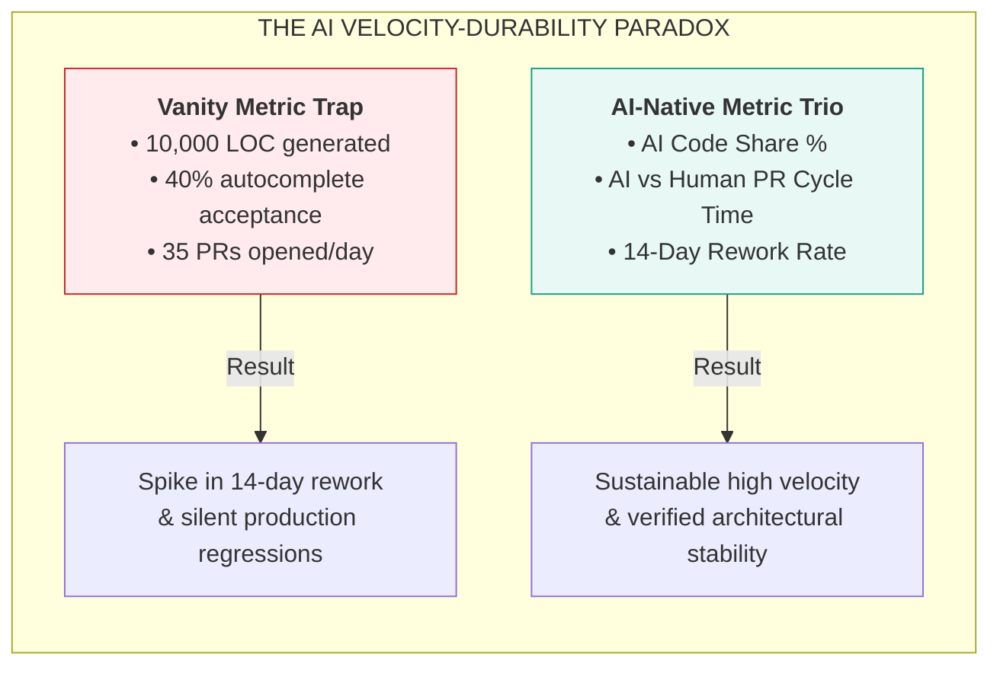

#### 💡 The Bricklayer Analogy (ELI10)
Imagine a bricklayer who purchases a robotic mortar cannon. With the cannon, they can lay 5,000 bricks before lunch.
- A naive project manager who measures **"bricks laid per day"** declares the mason a 10x superstar.
- But two weeks later, the structural engineer inspects the building. Every eighth brick is tilted 5 degrees off plumb. The mortar didn't cure properly because the mason was moving too fast. The entire third floor has to be condemned, demolished, and relaid by hand.
- If you don't track **"how many walls are still standing upright after 14 days" (14-day rework rate)**, high code generation is just accelerated demolition.

#### 1. The Core AI-Specific Metric Suite

##### Metric 1: AI Code Share (%)
$$\text{AI Code Share} = \left( \frac{\text{Lines of Code / AST Nodes Synthesized by AI}}{\text{Total Committed Lines / AST Nodes}} \right) \times 100$$

- **The Strategic Benchmark**:
  - **Healthy Monitored Range: 50% – 70%**: Indicates high leverage on boilerplate, CRUD scaffolding, DTO mappings, migration scripts, and test harnesses.
  - **The Danger Zone ($> 85\%$)**: Indicates developers are "vibe coding"—copying wholesale agent generations without deep mental modeling of domain logic.
  - **The Domain Invariant Rule**: Core business rules, cryptographic primitives, and authorization middleware should maintain an AI Code Share of $< 25\%$, requiring hands-on human architectural ownership.

##### Metric 2: AI vs. Human PR Cycle Time
Track PR velocity by dissecting the cycle into three distinct operational intervals:

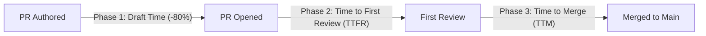

| Phase | Human Baseline | AI-Augmented Baseline | Lead Architect Takeaway |
|:---|:---|:---|:---|
| **Authoring Time** | 4.5 Hours | **45 Minutes (-80%)** | Agents write code rapidly; initial draft speed is rarely the bottleneck anymore. |
| **Time to First Review (TTFR)** | 2.5 Hours | **4.2 Hours (+68% Danger)** | **The Bloat Trap**: If developers submit 800-line AI diffs without summaries, reviewers experience cognitive overload and delay reviews. |
| **Time to Merge (TTM)** | 28 Hours | **2.5 Hours (-91% Optimized)** | Achieved **only** when automated AI review bots pre-verify schema drift and test invariants before humans review. |

##### Metric 3: The 14-Day Rework Rate (Code Churn)
$$\text{14-Day Rework Rate} = \left( \frac{\text{Lines Added in PR that are Modified or Deleted within 14 Days}}{\text{Total Lines Added in Original PR}} \right) \times 100$$

- **The Canary in the Coal Mine**:
  - **Industry Human Baseline**: 6% – 9% code churn within 14 days.
  - **Vibe Coding Codebases**: Frequently spikes to **24% – 38%**. The code compiled on Day 1, but broke under staging loads, missed business edge cases, or conflicted with adjacent services on Day 8.
  - **The Target for Verified AI Engineering**: Maintain 14-day rework **$< 10\%$**. If this metric trends upward over two consecutive sprints, pause feature work to audit repository context standards and review gates.

---

#### 2. The 80/20 Rule of AI Engineering
In autonomous software development, the Pareto principle manifests in a stark, non-linear dynamic:

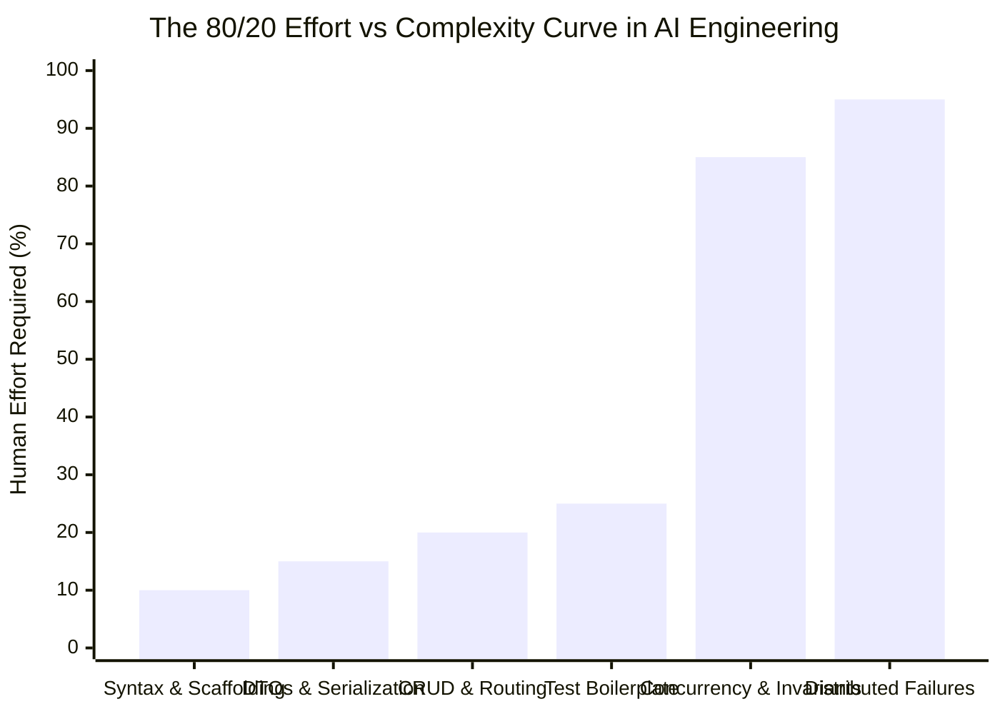

- **The 80% (Fast Path)**: AI coding assistants can generate 80% of any enterprise feature—API routes, data transfer objects, entity definitions, SQL queries, and basic test assertions—in **20% of the total time**.
- **The 20% (The Architectural Crucible)**: The remaining 20% of the system—race condition mitigation, database transaction boundaries, distributed state consensus, graceful degradation under network partitions, and strict authorization invariants—requires **80% of the senior engineer's cognitive energy**.
- **The Failure Mode**: Naive engineering leads assume that because an agent generated the first 80% in 15 minutes, it can generate the remaining 20% in 5 minutes. Attempting to automate the final 20% with vague prompts leads directly to production outages.

---

#### 3. Dual-Tool Workflows: The Modern Power Setup
High-performing senior engineers in 2026 do not force a false choice between a CLI assistant and an IDE assistant. They orchestrate a **Dual-Tool Workflow**, pairing specialized tools according to task granularity:

```mermaid
flowchart TD
    subgraph ARCH["TASK ORCHESTRATION"]
        T["New Feature / Solution Refactor"]
    end
    
    subgraph TIER1["TIER 1: AUTONOMOUS CLI AGENT (Claude Code)"]
        direction TB
        C1["• Repository-wide solution analysis\n• Scaffolding multi-project directories\n• Running build & compiler loops in bash\n• Autonomous TDD test generation\n• Semantic Git commits & branch prep"]
    end

    subgraph TIER2["TIER 2: AGENTIC IDE (Cursor / Windsurf)"]
        direction TB
        U1["• Interactive low-latency feature flow\n• Inline symbol navigation & visual diffs\n• Precision single-file edge-case tuning\n• Live debugging with active breakpoints\n• Contextual chat over active buffer"]
    end

    T -->|"1. Batch & Infrastructure"| TIER1
    TIER1 -->|"2. Hands-on Refinement"| TIER2
    TIER2 -->|"3. Final Invariant Suite Run"| TIER1
    
    style TIER1 fill:#e8f4f8,stroke:#2980b9,stroke-width:2px
    style TIER2 fill:#fef9e7,stroke:#f39c12,stroke-width:2px
```

- **When to Use the CLI Agent (Claude Code)**:
  - Multi-file refactorings spanning 20+ files across multiple solution folders.
  - Automated dependency modernization (e.g., upgrading packages and fixing breaking compiler diagnostics).
  - Writing the initial test suite against an OpenAPI specification before opening an editor.
  - Running git bisect and correlating failure logs from automated test runs.
- **When to Use the Agentic IDE (Cursor / Windsurf)**:
  - Flow-state interactive programming where visual diffs, tab autocompletion, and editor breakpoints matter.
  - Inspecting UI/UX components and localized business logic.
  - Precision surgical edits where the engineer wants line-by-line review before accepting diffs.

---

#### 4. Comparison: Traditional Vanity Metrics vs. Modern AI-Native Value Metrics

| Vanity / Flawed Metric | Why It Fails in AI SDLC | Modern AI-Native Replacement | Target Production Benchmark |
|:---|:---|:---|:---|
| **Lines of Code (LOC) Produced** | Rewards boilerplate explosion and encourages copy-paste bloat. | **Semantic AST Density & AI Code Share %** | 50%–70% overall AI share; $< 25\%$ in core domain invariants. |
| **Suggestion Acceptance Rate** | Measuring accepted autocompletions encourages low-friction rubber-stamping. | **14-Day Rework Rate (Code Churn)** | $< 10\%$ of merged PR lines modified within 14 days. |
| **Commit Velocity / Day** | Agents make 20 micro-commits trivial; measures noise, not progress. | **Time to Merge (TTM) with Invariant Gates** | $< 4$ Hours from branch creation to production merge. |
| **Story Points Burned** | AI makes estimating based on typing complexity obsolete. | **DORA Change Failure Rate (CFR)** | $< 5\%$ of releases causing customer-facing degradation. |
| **PR Review Latency** | Humans delay reviews when presented with uncontextualized AI code dumps. | **Reviewer Cognitive Load Index** | Diff $< 300$ lines, accompanied by automated invariant verification proof. |

---

### 5.7 Codebase Context Standards [MUST-HAVE] 🔴

> **☕ The Coffee Chat Summary**: Think about how most developers interact with AI: they open a chat window and type: *"Hey, remember we're using Python 3.12, please use Pydantic v2, don't use raw SQL, and make sure to use async."* Two hours later, in a new chat session, they have to retype it. Their colleague on the next desk prompts slightly differently, and the agent outputs completely contradictory patterns. That is the madness of **ad-hoc prompting**. In 2026, top engineering teams replace ad-hoc prompts with **Codebase Context Standards (`AGENT.md`, `CLAUDE.md`, `.cursorrules`)**—version-controlled, machine-readable contracts committed directly into the repository root.

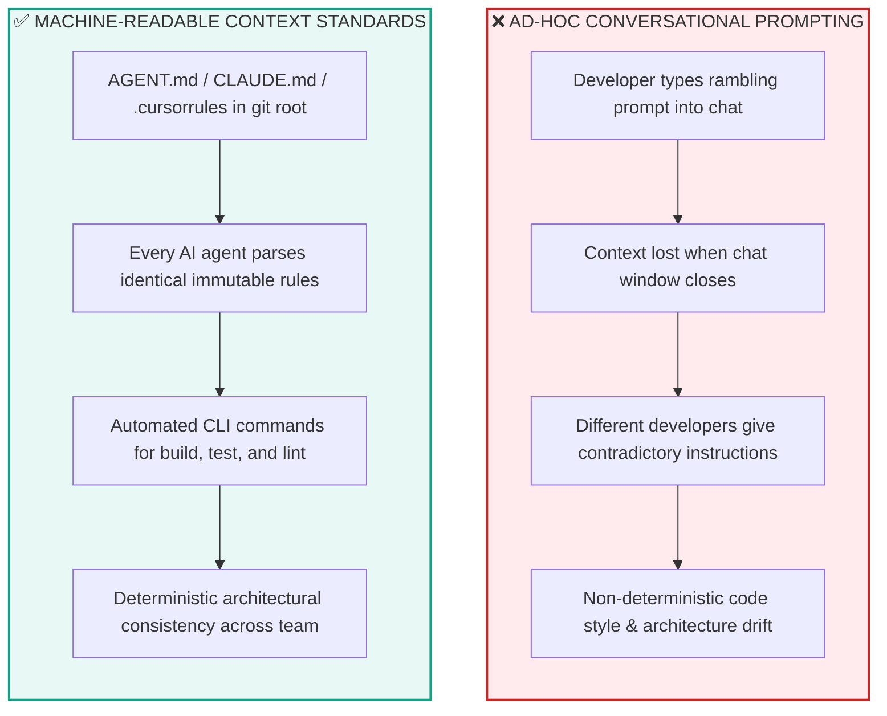

#### 💡 The Michelin Kitchen Analogy (ELI10)
Imagine a world-class restaurant kitchen with 12 line cooks.
- If the executive chef had to walk up to every line cook every morning and say: *"Cut the carrots into 2-inch matchsticks, cook the risotto with unsalted butter, and never use tap water,"* the kitchen would descend into chaos within an hour.
- Instead, the kitchen has an **immutable, laminated Station Handbook** posted at every prep counter. It specifies the exact knife cuts, oven temperatures, allergen protocols, and presentation plating.
- `AGENT.md`, `CLAUDE.md`, and `.cursorrules` are the laminated station handbooks of your software repository. The moment an autonomous agent enters your codebase, it reads the handbook and knows the rules of the house.

---

#### 1. The Context Ingestion Hierarchy
Modern autonomous agents do not read your codebase as an undifferentiated blob of text. They ingest context in a strict hierarchical order to maximize reasoning efficiency:

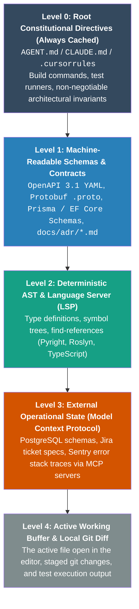

---

#### 2. The Big Three Context Standards Compared

| Standard | Primary Agent Ecosystem | Repo Location | Loading Mechanism | Scoping & Globbing | Best Use Case |
|:---|:---|:---|:---|:---|:---|
| **`AGENT.md`** | **Universal / Cross-Platform** (Claude Code, Cursor, Windsurf, custom agents) | Root `/AGENT.md` | Ingested by convention at agent initialization. | Global repository-wide architectural invariants. | **The Industry Standard**: Master contract for multi-agent workflows. |
| **`CLAUDE.md`** | **Anthropic Claude Code (CLI)** | Root `/CLAUDE.md` | Automatically parsed on every Claude Code session launch. | Global CLI directives and workflow preferences. | **Terminal Autonomy**: Build commands, test runners, and bash tool permissions. |
| **`.cursorrules` / `.cursor/rules/*.mdc`** | **Cursor IDE** | Root `/.cursorrules` or `/.cursor/rules/*.mdc` | Embedded into Cursor prompt context via `@codebase`. | Supports glob patterns (e.g., `globs: src/api/**/*.ts`). | **Interactive IDE Flow**: Precision file-specific lint and syntax conventions. |
| **`copilot-instructions.md`** | **GitHub Copilot** | `/.github/copilot-instructions.md` | Injected into GitHub Copilot chat and inline completions. | Global repository-wide instruction set. | **Universal Baseline**: Enforcing basic team conventions in standard Copilot. |

---

#### 3. Production Context Standard Implementations

##### A. Production-Grade Master `AGENT.md`
This contract is committed at the root of the repository. It instructs any visiting agent on runtime matrix, build commands, and architectural taboos:

```markdown
# AGENT.md - Enterprise Service Architecture Contract

## 1. System Identity & Tech Stack Matrix
- **Service Name**: PaymentProcessing.Service
- **Primary Runtime**: .NET 9 (C# 13) / ASP.NET Core Minimal APIs
- **Database Engine**: PostgreSQL 16 with pgvector & EF Core 9
- **Messaging Bus**: RabbitMQ via MassTransit 8.2
- **Serialization**: System.Text.Json (STJ) with Native AOT source generators only

## 2. Deterministic CLI Verification Commands
Coding agents MUST execute these exact commands to verify changes before proposing diffs:
- **Build**: `dotnet build PaymentProcessing.sln --configuration Release /warnaserror`
- **Unit & Invariant Tests**: `dotnet test tests/PaymentProcessing.Tests/ --filter Category=Unit`
- **Integration Tests**: `dotnet test tests/PaymentProcessing.IntegrationTests/ --no-build`
- **Linter & Style Check**: `dotnet format --verify-no-changes`

## 3. Non-Negotiable Architectural Invariants
1. **Zero Raw Dictionaries in Domain Logic**: All request/response payloads MUST use immutable C# `record` types with explicit validation attributes. Never use `Dictionary<string, object>` or `dynamic`.
2. **Prohibited Dependencies**:
   - DO NOT import `Newtonsoft.Json` (Use `System.Text.Json`).
   - DO NOT import `AutoMapper` (Write explicit mapping extension methods).
   - DO NOT use `Dapper` in domain handlers (Use repository interfaces).
3. **Hexagonal Architecture Boundaries**:
   - `src/Domain` must NEVER reference `src/Infrastructure` or `src/Api`.
   - All external network calls (Stripe, PayPal, AWS) MUST implement an interface located in `src/Domain/Contracts`.
4. **Idempotency & Concurrency**:
   - Every mutation endpoint MUST require an `Idempotency-Key` HTTP header (UUIDv4).
   - Unbounded concurrency (`Task.WhenAll` over unthrottled lists) is strictly prohibited. Always use `Parallel.ForEachAsync` with an explicit `MaxDegreeOfParallelism`.

## 4. Contract Single Sources of Truth
- **REST Endpoints**: Strictly adhere to `contracts/openapi.yaml`.
- **Database Migrations**: Add migrations only via `dotnet ef migrations add <Name> --project src/Infrastructure`.
```

##### B. Production `CLAUDE.md` for Terminal CLI Execution
This file is tailored for Claude Code CLI to enable autonomous shell testing loops without context exhaustion:

```markdown
# CLAUDE.md - Operational Directives for Claude Code CLI

## Build & Test Harness
- Always run tests with fail-fast flag: `pytest -x -q`
- Run typecheck: `mypy --strict src/`
- Run linter: `ruff check src/ --fix`

## Workflow Conventions
- When implementing a feature, write or run the failing test FIRST (RED), then implement minimal code to pass (GREEN).
- Do not edit files outside `src/` and `tests/` without explicit instructions.
- Commit messages MUST adhere to Conventional Commits: `feat(payments): add idempotency token store`.
- If a test fails after an edit, inspect git diff first before modifying test assertions.
```

##### C. Modular `.cursor/rules/api-endpoints.mdc` for Scoped IDE Rules
Modern Cursor uses modular `.mdc` files scoped to specific file paths using glob patterns:

```markdown
---
description: Rules for ASP.NET Core Minimal API Endpoints
globs: src/Api/Endpoints/**/*.cs
alwaysApply: false
---

# Minimal API Endpoint Standards

- Endpoints must be defined as static extension methods on `RouteGroupBuilder`.
- Use TypedResults for all return types (e.g., `Results<Ok<TResponse>, NotFound, ProblemHttpResult>`).
- Always attach `.WithName()`, `.WithOpenApi()`, and `.RequireRateLimiting()`.
- Inject dependencies via method parameters using `[FromServices]`, never through field injection.
```

---

#### 4. The Anti-Pattern: The 1,800-Line Prompt Dump
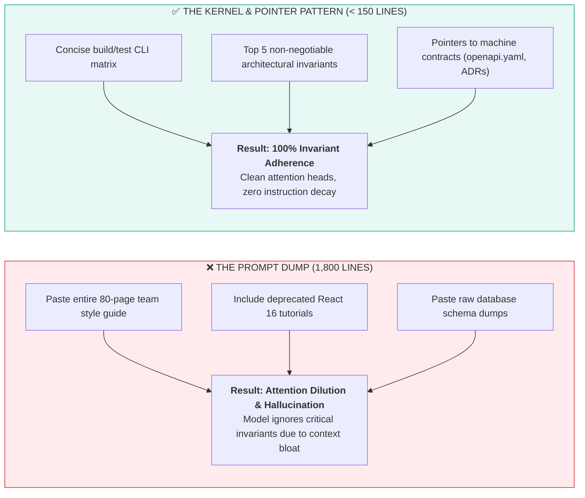

- **The Failure Mode**: Packing 1,500+ lines of stylistic opinions, obsolete coding guidelines, and generic programming advice into `.cursorrules` or `AGENT.md`.
- **The LLM Physics**: Large language models suffer from **Context Window Dilution** and **"Lost in the Middle" attention degradation**. When a context file exceeds 200 lines, the model's attention heads lose focus on critical safety rules, leading to erratic instruction following.
- **The Remediation**: The **Kernel & Pointer Pattern**:
  - Keep root context files under **150–200 lines**.
  - Restrict content to: (1) System identity, (2) Exact CLI build/test commands, (3) Top 5 architectural invariants, and (4) Relative file paths pointing to machine-readable contracts (`contracts/openapi.yaml`, `docs/adr/`).

---

## 6. Production Failure Modes & Anti-Patterns [MUST-HAVE] 🔴

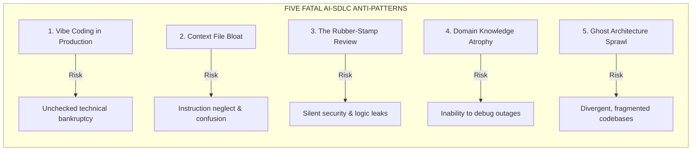

### Anti-Pattern 1: "Vibe Coding" in Enterprise Systems
* **Failure Mode**: Prompts an agent iteratively until code runs locally, without verifying edge cases, transactions, or concurrency.
* **Consequence**: Subtle race conditions, unindexed queries, memory leaks, and technical bankruptcy in production.
* **Remediation**: Enforce mandatory CI coverage gates and require authors to pass architecture reviews explaining state transitions.

### Anti-Pattern 2: Context Bloat in Repository Instruction Files
* **Failure Mode**: Packing 1,000+ lines of style notes, outdated APIs, and generic advice into `.cursorrules` or `CLAUDE.md`.
* **Consequence**: **Instruction Neglect & Attention Degradation**. LLMs lose focus across bloated system prompts, missing critical invariants.
* **Remediation**: Keep root context files under **150–200 lines**. Limit to non-negotiable build/test commands, core invariants, and document links.

### Anti-Pattern 3: Bypassing Human Code Review for Agent PRs ("The Rubber Stamp")
* **Failure Mode**: Reviewers glance at agent-generated PRs for seconds and approve because CI passed.
* **Consequence**: Tests written by an agent to test its own code replicate its blind spots, silently merging flawed business logic.
* **Remediation**: Audit test assertions against independent product specifications; mandate explicit human verification of boundary invariants.

### Anti-Pattern 4: Codebase Domain Knowledge Atrophy
* **Failure Mode**: Engineers rely exclusively on agents to navigate unfamiliar code, losing mental models of system data flows.
* **Consequence**: During major outages where AI tools degrade or hallucinate, teams cannot diagnose root causes manually.
* **Remediation**: Conduct regular architecture walkthroughs and manual post-mortems; rotate engineers through maintenance tasks without AI assistance.

### Anti-Pattern 5: Ghost Architecture & Dependency Sprawl
* **Failure Mode**: Agents introduce competing duplicate packages across microservices (e.g., `Newtonsoft.Json` alongside `System.Text.Json`, or `axios` alongside `fetch`).
* **Consequence**: Bloated containers, dependency conflicts, expanded attack surfaces, and fragmented standards.
* **Remediation**: Specify package allowlists in `AGENT.md`; enforce CI linter checks blocking unauthorized dependencies.

---

## 7. Practical Templates & Production Implementations [MUST-HAVE] 🔴

Complete, ready-to-adopt specifications, workflows, and automation scripts are available in the [`examples/`](./examples/) directory.

### 7.1 Production-Ready Master `AGENT.md` Specification
> **Specification**: [`examples/AGENT.md`](./examples/AGENT.md)

A standardized contract placed in the root of the enterprise repository that instructs AI coding assistants (Copilot, Cursor, Claude Code, Antigravity) on architectural invariants, prohibited dependencies, and build verification commands.

---

### 7.2 Automated Multi-Agent PR Reviewer GitHub Action
> **Workflow**: [`examples/pr_review_workflow.yml`](./examples/pr_review_workflow.yml)

A GitHub Actions CI/CD workflow that triggers on every pull request, fans out diff analysis across parallel security, performance, and architecture review agents, and posts a consolidated review comment.

---

### 7.3 Automated Semantic Git Commit & ADR Generator Script
> **Script**: [`examples/generate_adr.py`](./examples/generate_adr.py)

A developer CLI utility that parses staged git diffs, extracts architectural decisions, formats conventional commits, and writes formal Architecture Decision Records (ADRs) conforming to standard templates.

```python
# Semantic commit and ADR generation excerpt from examples/generate_adr.py
def generate_adr_from_diff(diff_text: str) -> str:
    prompt = f"Analyze the following git diff and produce an ADR conforming to MADR template:\n\n{diff_text}"
    response = client.chat.completions.create(
        model="gpt-4.5",
        messages=[{"role": "user", "content": prompt}],
        temperature=0.1
    )
    return response.choices[0].message.content
```

## 8. Curated Verified Resources [KNOWLEDGE-BASE] 🔵

To deepen your mastery of the AI-native software engineering lifecycle and leadership, consult these authoritative resources:

### 1. Autonomous Coding Agents & Architectures
- **[Anthropic Claude Code Documentation](https://docs.anthropic.com/en/docs/agents-and-tools/claude-code)**: Official reference for Claude Code CLI, tool execution, and architecture.
- **[Building Effective Agents (Anthropic Engineering)](https://www.anthropic.com/engineering/building-effective-agents)**: The foundational guide on agentic loops, prompt chaining, and evaluation harness design.
- **[Cursor Documentation & Rules](https://docs.cursor.com/)**: Comprehensive reference for `@codebase` indexing, `.cursorrules`, and multi-file composer mechanics.
- **[Google Agents CLI](https://google.github.io/agents-cli/)**: Command-line developer tool for scaffolding, testing, and deploying autonomous coding agents.
- **[Model Context Protocol Specification](https://spec.modelcontextprotocol.io/)** & [GitHub Repository](https://github.com/modelcontextprotocol): Complete RFC-level standard for connecting coding agents to tools and databases.

### 2. Engineering Leadership, Productivity & Frameworks
- **[Andrej Karpathy: Software 2.0 (Medium)](https://karpathy.medium.com/software-2-0-2e88b8a3a459)**: The seminal essay defining the shift from explicit syntax to learned neural weights, leading to Software 3.0 agent orchestration.
- **[Google Agent Development Kit (ADK)](https://google.github.io/adk-docs/)** & [GitHub Repository](https://github.com/google/adk-python): Code-first multi-agent orchestration framework for production systems.
- **[Inspect AI (UK AI Safety Institute)](https://inspect.aisi.org.uk/)** & [GitHub Repository](https://github.com/UKGovernmentBEIS/inspect_ai): Open-source testing and evaluation framework for agentic workflows in CI/CD.
- **[Microsoft Research: The SPACE Framework for Developer Productivity](https://queue.acm.org/detail.cfm?id=3454124)**: Overcoming simplistic metrics (LOC) with Satisfaction, Performance, Activity, Communication, and Efficiency.
- **[GitHub Copilot Impact Studies](https://github.blog/news-insights/research/research-quantifying-github-copilots-impact-on-developer-productivity-and-happiness/)**: Quantitative empirical research on developer flow, task completion rates, and cognitive strain.

---

## 9. Capstone Challenge: Establish an Enterprise AI-Native Repository Framework [MUST-HAVE] 🔴

> Structure an enterprise repository with machine-readable directives (`AGENT.md`), automated CI PR review bots, and TDD verification.
> 
> 👉 **[View Capstone Challenge Specification](./labs/capstone-ai-native-repository.md)**

---

```mermaid
flowchart LR
    Done["🏆 ROADMAP PHASE COMPLETE: PHASE 08<br/>Mastered AI-Augmented SDLC & Engineering Leadership"]
```
