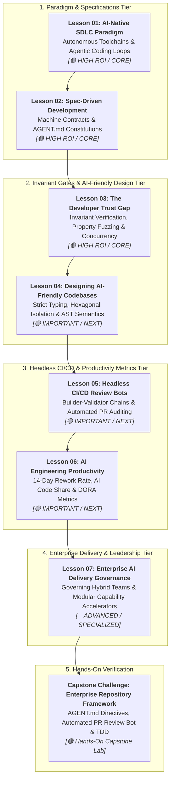

# Phase 08: AI-Augmented SDLC & Engineering Leadership

> **Architectural overview and learning progression for Lead Developers, Staff Engineers, and Solutions Architects.**

---

## 🎯 Phase Engineering Goal

Phase 08 equips senior technical leaders to transition their organizations from fragile "vibe coding" and manual syntax authoring into an **AI-native software engineering lifecycle (Software 3.0)**. 

By the end of this phase, you will be able to:
- Transform developers from manual typists into **system architects and verification arbiters** governing autonomous ReAct coding loops.
- Implement **Spec-Driven Development (SDD)** using machine-readable codebase constitutions (`AGENT.md`, `.cursor/rules/*.mdc`, OpenAPI 3.1) that prevent attention dilution and instruction decay.
- Close **The Developer Trust Gap** (92% adoption vs. 29% trust) by binding probabilistic agents inside deterministic invariant harnesses, property-based fuzzing (`Hypothesis`), and bounded concurrency controls.
- Design **AI-friendly codebases** utilizing strict static typing, hexagonal architecture boundaries (ports and adapters), and Language Server Protocol (LSP) AST symbol intelligence.
- Deploy **headless CI/CD review bots** executing non-interactively in GitHub Actions (`claude -p --output-format json`) to enforce the Builder-Validator Chain.
- Evaluate developer productivity using **durability metrics** (14-day rework rate, AI Code Share %, DORA Change Failure Rate) rather than flawed vanity metrics.
- Govern **hybrid enterprise delivery teams** (internal platform + external systems integrators) using contractual evaluation gates and reusable, domain-agnostic capability accelerators.

---

## 🗺️ Learning Path & System Topology

### Visual Walkthrough of the Phase Architecture
1. **Paradigm & Specifications (Lessons 01 & 02)**: We establish the foundation of Software 3.0. The developer transitions from syntax authoring to system verification, defining version-controlled machine contracts (`AGENT.md`) to guide autonomous agents.
2. **Invariants & AI-Friendliness (Lessons 03 & 04)**: We overcome the Trust Gap. Probabilistic agents are bound inside property-based test suites and bounded concurrency semaphores, supported by strictly typed hexagonal architectures.
3. **Headless Automation & Metrics (Lessons 05 & 06)**: We scale review capacity. Non-interactive CI agents enforce the Builder-Validator Chain, while engineering leadership measures sustainability using 14-day rework rates and AI Code Share bounds.
4. **Enterprise Governance (Lesson 07)**: We manage large-scale hybrid delivery teams (internal core + SI partners) through contractual evaluation gates and reusable cognitive capability accelerators.
5. **Hands-On Capstone**: Learners deploy an enterprise-grade AI-native repository framework complete with machine contracts, headless PR review bots, and automated ADR generation.

---

## 📚 Modular Curriculum Lessons (Master Navigation Table)

| # | Lesson Module | Depth Tier | Est. Time | Core Systems Focus | Key Engineering Outcome |
|---|---|:---:|:---:|---|---|
| **01** | [The AI-Native SDLC Paradigm & Toolchains](./01-ai-native-sdlc-paradigm-and-toolchain.md) | `🟢 HIGH ROI / CORE` | ~20 min | Software 1.0 to 3.0 paradigm shift, OODA/ReAct execution loops, Big Seven assistant comparison. | Transition from syntax typist to system architect and verification arbiter. |
| **02** | [Spec-Driven Development & Codebase Contracts](./02-spec-driven-development-and-codebase-contracts.md) | `🟢 HIGH ROI / CORE` | ~22 min | Intent vs. implementation separation, `AGENT.md` master contract, `.cursor/rules/*.mdc`, Kernel & Pointer pattern. | Elimination of ad-hoc prompt drift and 100% adherence to repository rules. |
| **03** | [The Developer Trust Gap & Verified Engineering](./03-the-trust-gap-and-verified-agentic-engineering.md) | `🟢 HIGH ROI / CORE` | ~25 min | 92% adoption vs 29% trust, subtle semantic bugs, Hypothesis property fuzzing, .NET 9 concurrency bounds. | Neutralizing the 2:14 AM concurrency cascade and catching silent logic bugs. |
| **04** | [Designing AI-Friendly Codebases & Strict Typing](./04-architecting-ai-friendly-codebases.md) | `🟡 IMPORTANT / NEXT` | ~20 min | Static typing (Pydantic v2, C# Nullable), Hexagonal ports & adapters, modular file sizing, legacy modernization. | Structuring systems so autonomous agents reason with zero hallucinations. |
| **05** | [Headless CI/CD Review Bots & Automated Gates](./05-headless-ci-cd-agents-and-automated-review-gates.md) | `🟡 IMPORTANT / NEXT` | ~22 min | Non-interactive CLI runs (`claude -p --output-format json`), Builder-Validator isolation, automated incident RCA. | Automated PR review gates catching security, layer, and SQL regressions. |
| **06** | [AI Developer Productivity & Rework Metrics](./06-ai-developer-productivity-and-rework-metrics.md) | `🟡 IMPORTANT / NEXT` | ~20 min | Flawed vanity metrics (LOC, commits), 14-day rework rate (<10%), AI Code Share %, Dual-Tool workflows. | Data-driven engineering leadership proving genuine ROI and system durability. |
| **07** | [Enterprise AI Delivery Governance & Accelerators](./07-enterprise-ai-delivery-governance-and-accelerators.md) | `🔵 ADVANCED / SPECIALIZED` | ~25 min | Hybrid team governance (internal + SI), contractual evaluation gates, reusable modular capability accelerators. | Eliminating duplicative domain silos and enforcing architecture across partners. |

---

## 🛠️ Associated Hands-On Labs & Production Templates

- **Phase Capstone Challenge**: [Establish an Enterprise AI-Native Repository Framework](./labs/capstone-ai-native-repository.md)
  - Configure root machine-readable contracts (`AGENT.md`).
  - Deploy a Headless GitHub Actions PR Review Bot with blocker severity enforcement.
  - Execute a verified Red-Green-Refactor TDD loop on a .NET 9 + PostgreSQL service.
- **Production Templates & Reference Implementations**:
  - Located in the [`examples/`](./examples/) directory:
    - [`AGENT.md`](./examples/AGENT.md): Enterprise repository context and rules contract.
    - [`pr_review_workflow.yml`](./examples/pr_review_workflow.yml): Multi-agent PR review GitHub Action.
    - [`generate_adr.py`](./examples/generate_adr.py): Automated semantic commit and ADR generator CLI utility.
    - [`ADR-042-kafka-event-ingestion.md`](./examples/ADR-042-kafka-event-ingestion.md): Michael Nygard compliant architecture decision record.

---

## 📋 Prerequisites & Cross-Phase Dependencies

- **Required Prior Knowledge**:
  - [Phase 01: Context Engineering](../01-prompt-and-context-engineering/README.md) — Token budgeting, context ASTs, and compaction.
  - [Phase 03: Tools & Model Context Protocol](../03-tools-and-model-context-protocol/README.md) — Tool discovery, JSON-RPC 2.0 schemas, and sandboxing.
  - [Phase 04: Stateful Agent Orchestration](../04-agentic-systems-and-orchestration/README.md) — Bounded ReAct loops, state machines, and event stores.
  - [Phase 05: AI Security & Guardrails](../05-ai-security-and-guardrails/README.md) — Privilege quarantine and OWASP GenAI defenses.
  - [Phase 06: GenAI Evals & Observability](../06-evals-and-observability/README.md) — OpenTelemetry tracing and automated evaluation judges.
- **Downstream Culmination**:
  - Synthesizes the technical disciplines of Phases 00 through 07 into the daily operational practice of enterprise software engineering and organizational leadership.

---

## 📚 Curated Primary Sources & Verification References

- **[Anthropic Claude Code Engineering Documentation](https://docs.anthropic.com/en/docs/agents-and-tools/claude-code)**: Official reference for headless execution, tool permissions, and CLI architecture.
- **[Cursor Rules Specification](https://docs.cursor.com/)**: Comprehensive reference for modular `.cursor/rules/*.mdc` scoping and codebase indexing.
- **[Stack Overflow Developer Survey](https://survey.stackoverflow.co/)**: Quantitative research verifying the 92% adoption vs. 29% developer trust gap.
- **[Andrej Karpathy: Software 2.0 & Software 3.0](https://karpathy.medium.com/software-2-0-2e88b8a3a459)**: The foundational essay on computing paradigms and agentic loops.
- **[DORA: DevOps Research and Assessment](https://dora.dev/)**: The definitive framework for engineering velocity, stability, and lead time.

---

## 🧭 Navigation

### Phase Progression
- **Previous Phase**: **[← Phase 07: High-Throughput Serving & LLMOps](../07-production-deployment-and-llmops/README.md)**
- **Curriculum Overview**: **[Master Curriculum Syllabus & Roadmap](../README.md)**

### Direct Chapter & Lesson Directory
- **[Lesson 01: The AI-Native SDLC Paradigm & Toolchains](./01-ai-native-sdlc-paradigm-and-toolchain.md)**
- **[Lesson 02: Spec-Driven Development & Codebase Contracts](./02-spec-driven-development-and-codebase-contracts.md)**
- **[Lesson 03: The Developer Trust Gap & Verified Engineering](./03-the-trust-gap-and-verified-agentic-engineering.md)**
- **[Lesson 04: Designing AI-Friendly Codebases & Strict Typing](./04-architecting-ai-friendly-codebases.md)**
- **[Lesson 05: Headless CI/CD Review Bots & Automated Gates](./05-headless-ci-cd-agents-and-automated-review-gates.md)**
- **[Lesson 06: AI Developer Productivity & Rework Metrics](./06-ai-developer-productivity-and-rework-metrics.md)**
- **[Lesson 07: Enterprise AI Delivery Governance & Accelerators](./07-enterprise-ai-delivery-governance-and-accelerators.md)**
- **[Hands-On Capstone: Establish an Enterprise Repository Framework](./labs/capstone-ai-native-repository.md)**
