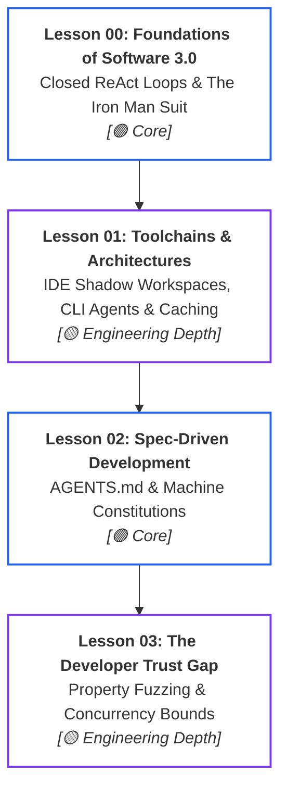
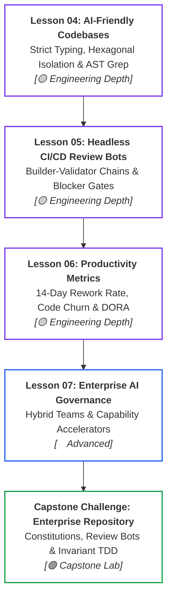

# Phase 08: AI-Augmented SDLC and Engineering Leadership

> **Architectural overview and learning progression for Lead Developers, Staff Engineers, and Solutions Architects.**

---

## 🎯 Phase Engineering Goal

Phase 08 equips senior technical leaders to transition their organizations from fragile "vibe coding" and manual syntax authoring into an **AI-native software engineering lifecycle (Software 3.0)**.

By the end of this phase, you will be able to:
- Transform developers from manual syntax typists into **system architects and verification arbiters** governing autonomous ReAct coding loops.
- Implement **Spec-Driven Development (SDD)** using machine-readable codebase constitutions (`AGENT.md`, `.cursor/rules/*.mdc`, OpenAPI 3.1) that prevent attention dilution and instruction decay.
- Close **The Developer Trust Gap** (84% adoption vs. 29% trust in 2025 survey data) by binding probabilistic agents inside deterministic invariant harnesses, property-based fuzzing, and bounded concurrency controls.
- Design **AI-friendly codebases** utilizing strict static typing, hexagonal architecture boundaries (ports and adapters), and Language Server Protocol (LSP) AST symbol intelligence.
- Deploy **headless CI/CD review bots** executing non-interactively in GitHub Actions (`claude -p --bare --allowedTools`) to enforce the Builder-Validator Chain.
- Evaluate developer productivity using **durability metrics** (14-day rework rate, AI Code Share bounds, DORA Change Failure Rate) rather than flawed vanity metrics.
- Govern **hybrid enterprise delivery teams** (internal platform + external systems integrators) using contractual evaluation gates and reusable, domain-agnostic capability accelerators.

---

## 🗺️ Learning Path & System Topology

### Track A: Foundations, Contracts & Invariant Verification

#### Walkthrough (Track A)
1. **Lesson 00 (Foundations)**: Establishes the Software 1.0/2.0/3.0 paradigm shift and runs a self-correcting ReAct loop harness.
2. **Lesson 01 (Toolchains)**: Inspects shadow workspace buffers, standalone CLI agents, and prefix prompt caching economics.
3. **Lesson 02 (Contracts)**: Enforces version-controlled repository constitutions (`AGENT.md`) via the Kernel & Pointer pattern.
4. **Lesson 03 (Trust Gap)**: Dismantles circular test mocks using property-based fuzzing and thread-safe concurrency bounds.

---

### Track B: Architecture, Headless CI/CD & Enterprise Governance

#### Walkthrough (Track B)
1. **Lesson 04 (Codebase Design)**: Structures repositories for machine navigation using ports, adapters, and file budgets (<300 LOC).
2. **Lesson 05 (Headless CI/CD)**: Deploys independent review bots enforcing the Builder-Validator Chain in automated pipelines.
3. **Lesson 06 (Metrics)**: Tracks organizational health using GitClear 14-day rework rates and DORA delivery stability.
4. **Lesson 07 (Enterprise Governance)**: Governs hybrid delivery teams through contractual evaluation gates and shared cognitive accelerators.
5. **Capstone Lab**: Synthesizes the entire phase by configuring root machine contracts, deploying a review bot, and executing verified TDD.

---

## 📚 Modular Curriculum Lessons (Master Navigation Table)

| # | Lesson Module | Depth Tier | Est. Time | Core Systems Focus | Key Engineering Outcome |
|:---:|---|:---:|:---:|---|---|
| **00** | [Foundations of the AI-Native SDLC (Software 3.0)](./00-foundations-of-the-ai-native-sdlc.md) | `🟢 Core` | ~12 min | Software 1.0 to 3.0 paradigm shift, Karpathy's Iron Man suit, closed ReAct execution loops. | Transition from syntax typist to system architect and verification arbiter. |
| **01** | [AI Coding Toolchains & Agent Architectures](./01-ai-coding-toolchains-and-agent-architectures.md) | `🟡 Engineering Depth` | ~18 min | IDE shadow workspaces, CLI agents, cloud sandboxes, Merkle AST indexing, 5-min TTL prompt caching. | Evaluating execution blast radiuses, indexing strategies, and prompt cache economics. |
| **02** | [Spec-Driven Development & Codebase Contracts](./02-spec-driven-development-and-codebase-contracts.md) | `🟢 Core` | ~14 min | `AGENTS.md` open Linux Foundation standard, `.cursor/rules/*.mdc`, OpenAPI 3.1, Kernel & Pointer pattern. | Eliminating ad-hoc prompt drift and keeping repository constitutions under 150 lines. |
| **03** | [The Developer Trust Gap & Verified Engineering](./03-the-trust-gap-and-verified-agentic-engineering.md) | `🟡 Engineering Depth` | ~20 min | Stack Overflow 2025 trust gap (84% adoption vs 29% trust), circular testing trap, property fuzzing. | Neutralizing the 2:14 AM concurrency cascade and catching subtle semantic bugs. |
| **04** | [Designing AI-Friendly Codebases & Strict Typing](./04-architecting-ai-friendly-codebases.md) | `🟡 Engineering Depth` | ~18 min | Strict typing (Pydantic v2), hexagonal ports and adapters, <300 LOC file limits, AST semantics. | Structuring systems so autonomous agents reason with zero symbol hallucinations. |
| **05** | [Headless CI/CD Review Bots & Automated Gates](./05-headless-ci-cd-agents-and-automated-review-gates.md) | `🟡 Engineering Depth` | ~20 min | Non-interactive CLI runs (`claude -p --bare`), Builder-Validator isolation, 4-stage review pipelines. | Automated PR review gates catching security, layer, and SQL regressions before merge. |
| **06** | [AI Developer Productivity & Rework Metrics](./06-ai-developer-productivity-and-rework-metrics.md) | `🟡 Engineering Depth` | ~18 min | Vanity metrics vs. durability metrics, GitClear 14-day rework rate (+15% churn), DORA amplifier effect. | Data-driven engineering leadership proving genuine ROI and system durability. |
| **07** | [Enterprise AI Delivery Governance & Accelerators](./07-enterprise-ai-delivery-governance-and-accelerators.md) | `🔵 Advanced` | ~22 min | Hybrid team governance (internal + SI), contractual evaluation gates, modular capability accelerators. | Eliminating duplicative domain silos and enforcing architecture across partners. |

---

## 🛠️ Associated Hands-On Labs & Production Templates

- **Phase Capstone Challenge**: [Establish an Enterprise AI-Native Repository Framework](./labs/capstone-ai-native-repository.md)
  - Configure root machine-readable contracts (`AGENT.md`).
  - Deploy a Headless GitHub Actions PR Review Bot with blocker severity enforcement.
  - Execute a verified Red-Green-Refactor TDD loop on a .NET 9 + PostgreSQL service.
- **Production Templates & Reference Implementations**:
  - Located in the [`examples/`](./examples/) directory:
    - [`AGENT.md`](./examples/AGENT.md): Enterprise repository context and rules contract.
    - [`pr_review_workflow.yml`](./examples/pr_review_workflow.yml): Multi-agent PR review GitHub Action.
    - [`generate_adr.py`](./examples/generate_adr.py): Automated semantic commit and ADR generator CLI utility.
    - [`ADR-042-kafka-event-ingestion.md`](./examples/ADR-042-kafka-event-ingestion.md): Michael Nygard compliant architecture decision record.

---

## 📋 Prerequisites & Cross-Phase Dependencies

- **Required Prior Knowledge**:
  - [Phase 01: Context Engineering](../01-prompt-and-context-engineering/README.md) — Token budgeting, context ASTs, and compaction.
  - [Phase 03: Tools & Model Context Protocol](../03-tools-and-model-context-protocol/README.md) — Tool discovery, JSON-RPC schemas, and sandboxing.
  - [Phase 04: Stateful Agent Orchestration](../04-agentic-systems-and-orchestration/README.md) — Bounded ReAct loops, state machines, and event stores.
  - [Phase 05: AI Security & Guardrails](../05-ai-security-and-guardrails/README.md) — Privilege quarantine and OWASP GenAI defenses.
  - [Phase 06: GenAI Evals & Observability](../06-evals-and-observability/README.md) — OpenTelemetry tracing and automated evaluation judges.
- **Downstream Culmination**:
  - Synthesizes the technical disciplines of Phases 00 through 07 into the daily operational practice of enterprise software engineering and organizational leadership.

---

## 📚 Curated Primary Sources & Verification References

- **[Anthropic Claude Code Engineering Documentation](https://docs.anthropic.com/en/docs/agents-and-tools/claude-code)**: Official reference for headless execution, tool permissions, and CLI architecture.
- **[Cursor Rules Specification](https://docs.cursor.com/)**: Comprehensive reference for modular `.cursor/rules/*.mdc` scoping and codebase indexing.
- **[Stack Overflow Developer Survey](https://survey.stackoverflow.co/)**: Quantitative research verifying the 84% adoption vs. 29% developer trust gap.
- **[GitClear "Coding on Copilot" Research](https://www.gitclear.com/)**: Multi-year empirical research on 14-day code churn (+15%), code duplication (8x), and refactoring decline.
- **[DORA: DevOps Research and Assessment](https://dora.dev/)**: 2024 and 2025 research reports on rework rates and AI as an organizational amplifier.
- **[Andrej Karpathy: Software 2.0 & Software 3.0](https://karpathy.medium.com/software-2-0-2e88b8a3a459)**: The foundational essay on computing paradigms and agentic loops.

---

## 🧭 Navigation

### Phase Progression
- **Previous Phase**: **[← Phase 07: High-Throughput Serving & LLMOps](../07-production-deployment-and-llmops/README.md)**
- **Curriculum Overview**: **[Master Curriculum Syllabus & Roadmap](../README.md)**

### Direct Chapter & Lesson Directory
- **[Lesson 00: Foundations of the AI-Native SDLC (Software 3.0)](./00-foundations-of-the-ai-native-sdlc.md)**
- **[Lesson 01: AI Coding Toolchains & Agent Architectures](./01-ai-coding-toolchains-and-agent-architectures.md)**
- **[Lesson 02: Spec-Driven Development & Codebase Contracts](./02-spec-driven-development-and-codebase-contracts.md)**
- **[Lesson 03: The Developer Trust Gap & Verified Engineering](./03-the-trust-gap-and-verified-agentic-engineering.md)**
- **[Lesson 04: Designing AI-Friendly Codebases & Strict Typing](./04-architecting-ai-friendly-codebases.md)**
- **[Lesson 05: Headless CI/CD Review Bots & Automated Gates](./05-headless-ci-cd-agents-and-automated-review-gates.md)**
- **[Lesson 06: AI Developer Productivity & Rework Metrics](./06-ai-developer-productivity-and-rework-metrics.md)**
- **[Lesson 07: Enterprise AI Delivery Governance & Accelerators](./07-enterprise-ai-delivery-governance-and-accelerators.md)**
- **[Hands-On Capstone: Establish an Enterprise Repository Framework](./labs/capstone-ai-native-repository.md)**
