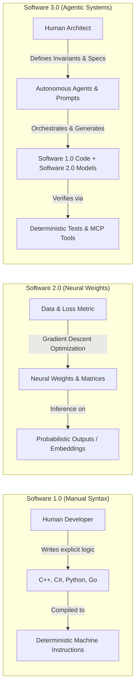
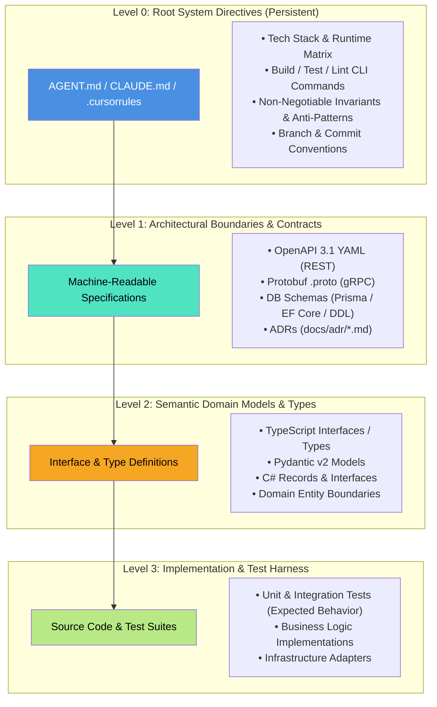
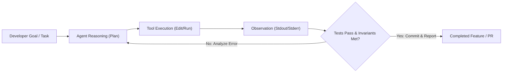
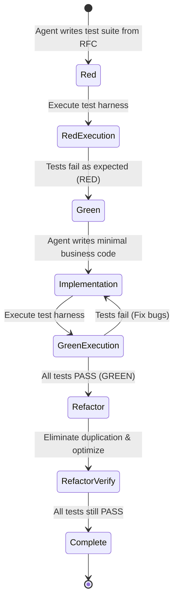
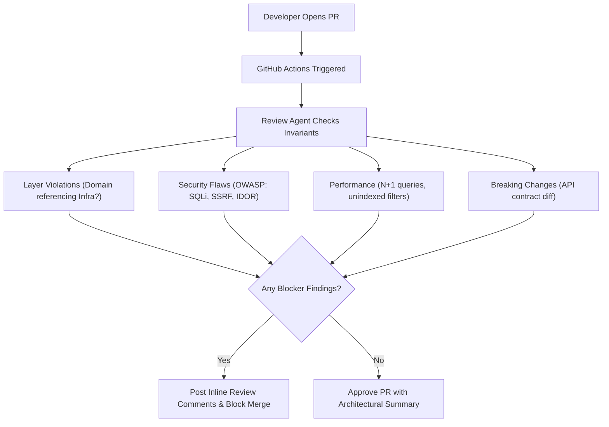

# Phase 08: AI-Augmented SDLC & Engineering Leadership

> **A comprehensive, production-grade guide for Senior Developers, Tech Leads, and Software Architects navigating the transition from manual syntax creation to AI-native software engineering, autonomous coding agents, and architectural leadership in the era of Software 3.0.**

---

### 🎯 Architectural Mastery Tiers
- **[MUST-HAVE]** 🔴 : Core AI-native engineering competencies (`AGENT.md` specification, AI developer toolchain, TDD specification-driven workflows, AI-assisted code reviews, avoiding vibe coding traps).
- **[GOOD-TO-HAVE]** 🟡 : Advanced agentic SDLC automation (automated ADR generators, AI incident triage bots, multi-agent repo maintenance, synthetic bug generation).
- **[KNOWLEDGE-BASE]** 🔵 : Historical evolution of software abstractions (Karpathy continuum Software 1.0 → 2.0 → 3.0), academic developer productivity studies.

---

```
                       ┌─────────────────────────────────────────────────────────┐
                       │          THE AI-NATIVE ENGINEERING PARADIGM             │
                       │   From Prompt Chat to Autonomous SDLC Orchestration     │
                       └────────────────────────────┬────────────────────────────┘
                                                    │
             ┌──────────────────────────────────────┴──────────────────────────────────────┐
             ▼                                                                             ▼
┌─────────────────────────┐                                                   ┌─────────────────────────┐
│  AI-ASSISTED (LEVEL 1)  │                                                   │   AI-NATIVE (LEVEL 3+)  │
│  • Inline autocomplete  │                                                   │  • Agentic loop CLI/IDEs│
│  • Copied chat snippets │        ────────── PARADIGM SHIFT ──────────►      │  • Specification-driven │
│  • Ad-hoc vibe coding   │                                                   │  • Invariant & TDD gates│
│  • Manual error fixing  │                                                   │  • Automated CI reviews │
└─────────────────────────┘                                                   └─────────────────────────┘
```

---

## 📑 Table of Contents

1. [Executive Summary & Lead Mental Model [MUST-HAVE] 🔴](#1-executive-summary--lead-mental-model-)
   - [The AI-Native Engineering Paradigm](#the-ai-native-engineering-paradigm)
   - [The Shift from Synthesizer to Editor & Verification Arbiter](#the-shift-from-synthesizer-to-editor--verification-arbiter)
2. [Why This Matters for Senior & Lead Developers [MUST-HAVE] 🔴](#2-why-this-matters-for-senior--lead-developers-)
   - [1. Architecting Systems that Autonomous Agents Can Reason About](#1-architecting-systems-that-autonomous-agents-can-reason-about)
   - [2. Eliminating the "Vibe Coding" Epidemic in Enterprise Codebases](#2-eliminating-the-vibe-coding-epidemic-in-enterprise-codebases)
   - [3. Scaling Developer Velocity Without Knowledge Atrophy](#3-scaling-developer-velocity-without-knowledge-atrophy)
   - [4. Navigating the Karpathy Continuum: Software 1.0 → 2.0 → 3.0](#4-navigating-the-karpathy-continuum-software-10-to-20-to-30)
3. [Visual System Architecture & Flow Diagrams [MUST-HAVE] 🔴](#3-visual-system-architecture--flow-diagrams-)
   - [The AI-Native SDLC Pipeline](#the-ai-native-sdlc-pipeline)
   - [Repository Context Hierarchy for Coding Agents](#repository-context-hierarchy-for-coding-agents)
4. [Comprehensive Comparison Tables [MUST-HAVE] 🔴](#4-comprehensive-comparison-tables-)
   - [Modern AI Coding Agents: Deep Architecture & Capability Matrix](#modern-ai-coding-agents-deep-architecture--capability-matrix)
   - [Traditional SDLC vs. AI-Assisted vs. AI-Native SDLC](#traditional-sdlc-vs-ai-assisted-vs-ai-native-sdlc)
5. [Deep-Dive Topics & Subtopics [MUST-HAVE] 🔴](#5-deep-dive-topics--subtopics-)
   - [5.1 The AI Developer Toolchain [MUST-HAVE] 🔴](#51-the-ai-developer-toolchain-must-have-)
   - [5.2 The AI-Native SDLC End-to-End [MUST-HAVE] 🔴](#52-the-ai-native-sdlc-end-to-end-must-have-)
   - [5.3 Designing Codebases for AI Agents ("AI-Friendliness") [MUST-HAVE] 🔴](#53-designing-codebases-for-ai-agents-ai-friendliness-must-have-)
   - [5.4 Engineering Leadership in the AI Era [MUST-HAVE] 🔴](#54-engineering-leadership-in-the-ai-era-must-have-)
6. [Production Failure Modes & Anti-Patterns [MUST-HAVE] 🔴](#6-production-failure-modes--anti-patterns-)
7. [Practical Templates & Production Implementations [MUST-HAVE] 🔴](#7-practical-templates--production-implementations-)
   - [7.1 Production-Ready Master `AGENT.md` Specification [MUST-HAVE] 🔴](#71-production-ready-master-agentmd-specification)
   - [7.2 Automated AI Pull Request Reviewer Bot [MUST-HAVE] 🔴](#72-automated-ai-pull-request-reviewer-bot)
   - [7.3 End-to-End Architectural Decision Record (ADR) Generator [GOOD-TO-HAVE] 🟡](#73-end-to-end-architectural-decision-record-adr-generator)
8. [Curated Verified Resources [KNOWLEDGE-BASE] 🔵](#8-curated-verified-resources-)
9. [Capstone Challenge: Establish an Enterprise AI-Native Repository Framework [MUST-HAVE] 🔴](#9-capstone-challenge-establish-an-enterprise-ai-native-repository-framework-)

---

## 1. Executive Summary & Lead Mental Model [MUST-HAVE] 🔴

### The AI-Native Engineering Paradigm

Software engineering is undergoing its most profound platform shift since the transition from assembly language to high-level compiled languages. For the past two decades, software development has been defined by human developers translating business intent into syntactical code line-by-line, navigating files manually, writing tests retroactively, and reviewing pull requests line-by-line in web interfaces.

The first generation of developer AI (2021–2023) introduced **AI-assisted programming**: inline autocomplete (GitHub Copilot tab-completion) and conversational chat sidebars (ChatGPT, Claude web interfaces). In this model, the developer remains the primary typist and search engine, occasionally prompting an LLM to generate isolated functions or regex patterns, then copy-pasting the output into their editor.

The emerging standard is the **AI-Native Software Engineering Lifecycle (SDLC)**. In this paradigm:
1. **The Developer Transitions from Typist to System Architect and Verification Arbiter**: The human lead focuses on defining unambiguous domain models, system invariants, interface contracts, and automated verification suites. The AI agent acts as a high-velocity junior-to-mid engineer implementing changes against those strict specifications.
2. **Context-Engineered Repositories Replace Ad-Hoc Prompts**: Repositories are designed with machine-readable metadata (`AGENT.md`, OpenAPI specs, Protobuf definitions, type annotations) that guide autonomous agents through discovery, execution, and validation loops without human hand-holding.
3. **Continuous Verification Replaces "Vibe Coding"**: Probabilistic code generation is tethered by deterministic test harnesses, static analysis, linter gates, and architectural boundary tests. Code is never accepted because it "looks right"; it is accepted because it passes formal, executable constraints.
4. **Autonomous Agent Workflows Span the Full SDLC**: Agents do not merely write snippets inside an open editor buffer; they analyze issue requirements, draft architectural decision records (ADRs), generate test matrices, perform atomic multi-file refactors, scan pull requests for security flaws, and triage production incidents from OpenTelemetry traces.

```
┌─────────────────────────────────────────────────────────────────────────────────────────────────┐
│                                    THE SDLC EVOLUTION SPECTRUM                                  │
├────────────────────┬────────────────────┬───────────────────────┬───────────────────────────────┤
│ Dimension          │ Traditional SDLC   │ AI-Assisted SDLC      │ AI-Native SDLC                │
├────────────────────┼────────────────────┼───────────────────────┼───────────────────────────────┤
│ Primary Interface  │ Text Editor / IDE  │ Chat Sidebar + Tab    │ Autonomous CLI & Agentic IDE  │
│ Unit of Work       │ Line / Function    │ Method / File Snippet │ Feature Branch / Pull Request │
│ Context Source     │ Developer Memory   │ Active File Buffer    │ Full Repo Graph + MCP Servers │
│ Execution Loop     │ Manual Read-Write  │ Manual Copy-Paste     │ Agentic ReAct (Tool-use loop) │
│ Quality Gate       │ Manual Review + CI │ Manual Review + CI    │ TDD Invariants + AI Review Bot│
│ Primary Constraint │ Typing & Search    │ Context Limits & Halluc.│ System Design & Verification  │
└────────────────────┴────────────────────┴───────────────────────┴───────────────────────────────┘
```

### The Shift from Synthesizer to Editor & Verification Arbiter

In the AI-native lifecycle, writing code becomes cheap, fast, and abundant. Consequently, **the bottleneck moves from code generation to code comprehension, verification, and system design**. 

A senior engineer who can write 200 lines of pristine code a day is eclipsed by a senior engineer who can orchestrate three concurrent coding agents to produce 2,000 lines of verified, architecturally aligned code per day. However, without rigorous architectural guardrails, this amplified velocity creates **instant technical debt at scale**. The lead engineer’s primary responsibility is ensuring that velocity does not compromise architectural coherence, security boundaries, and domain invariants.

---

## 2. Why This Matters for Senior & Lead Developers [MUST-HAVE] 🔴

Leading engineering organizations through this transition requires confronting hard technical and organizational challenges:

### 1. Architecting Systems that Autonomous Agents Can Reason About
Traditional codebases frequently contain implicit assumptions, hidden side effects, dynamic typing shortcuts, and tribal knowledge documented only in Slack threads. Humans navigate these through intuition and hallway conversations; autonomous AI agents fail on them catastrophically. Senior architects must build **semantically predictable architectures**:
- Strongly typed domain models with zero tolerance for untyped dictionaries or `dynamic` primitives.
- Explicit interface boundaries (ports and adapters / hexagonal architectures) that isolate third-party dependencies.
- Machine-readable contracts (OpenAPI 3.1, Protobuf 3, JSON Schema) acting as immutable single sources of truth.
- Hermetic test suites that run locally in sub-minute execution windows, enabling agents to execute tight feedback loops.

### 2. Eliminating the "Vibe Coding" Epidemic in Enterprise Codebases
"Vibe coding"—the practice of prompting an agent until code compiles and visually runs once, then committing it without deep comprehension—is an existential threat to enterprise stability. Senior leads must institute policies and automated CI gates that reject code lacking test provenance, invariant validation, and architectural alignment.

### 3. Scaling Developer Velocity Without Knowledge Atrophy
If junior and senior engineers blindly delegate implementation to agents, teams risk losing deep domain knowledge and systemic understanding of their software. Engineering leads must cultivate a culture of **discernment and verification**, where reading, analyzing, and stress-testing agent outputs is treated as a higher-status skill than raw typing speed.

### 4. Navigating the Karpathy Continuum: Software 1.0 → 2.0 → 3.0
As articulated by Andrej Karpathy, computing has evolved through three distinct paradigms:
- **Software 1.0 (Classical Code)**: Explicit instructions written by humans in languages like C++, C#, Python, or Go. Deterministic, interpretable, but fragile when handling perceptual or open-ended tasks.
- **Software 2.0 (Neural Networks)**: Code written by optimization algorithms (gradient descent) searching a parameter space defined by weights and datasets. Highly capable at perception and pattern recognition, but opaque and non-deterministic.
- **Software 3.0 (Agentic Prompting & Orchestration)**: Software systems where foundation models (LLMs) act as reasoning engines that orchestrate Software 1.0 tools, write Software 1.0 code, call Software 2.0 models, and execute complex workflows guided by natural language specifications, system prompts, and tool protocols.



---

## 3. Visual System Architecture & Flow Diagrams [MUST-HAVE] 🔴

### The AI-Native SDLC Pipeline

The following diagram illustrates the complete, closed-loop software engineering lifecycle augmented by autonomous agents and deterministic verification gates:

```mermaid
flowchart TD
    subgraph SPEC["1. Specification & Requirements"]
        A["Feature Request / PRD"] --> B["AI Requirements Breakdown Agent"]
        B -->|"Extracts user stories"| C["Edge-Case & Failure Mode Generator"]
        C -->|"Synthesizes"| D["Gherkin / Executable Acceptance Criteria"]
    end

    subgraph ARCH["2. Architectural RFC & Design"]
        D --> E["Architectural Design Agent"]
        E -->|"Evaluates trade-offs"| F["Trade-off Matrix & Sequence Diagrams"]
        F -->|"Generates formal contracts"| G["OpenAPI 3.1 / Protobuf Schemas"]
        G -->|"Human Sign-off"| H{"Lead Architect Gate"}
    end

    subgraph TDD["3. Test-Driven Development (TDD)"]
        H -->|"Approved Spec"| I["AI Test Generation Agent"]
        I -->|"Writes failing tests"| J["Unit, Integration & Property Tests (RED)"]
    end

    subgraph CODE["4. Implementation & Refactoring"]
        J --> K["Autonomous Coding Agent (Claude Code / Cursor)"]
        K -->|"Generates code to satisfy tests"| L["Local Build & Test Runner (GREEN)"]
        L -->|"Fails tests"| K
        L -->|"Passes tests"| M["AI Refactoring & Optimization Loop"]
        M -->|"Enforces style & DRY"| N["Clean, Passing Feature Branch"]
    end

    subgraph REVIEW["5. Automated Review & CI/CD"]
        N --> O["Pull Request Submitted"]
        O --> P["AI PR Security & Arch Review Bot"]
        P -->|"Checks schema drift, SQLi, invariants"| Q{"Automated PR Gate"}
        Q -->|"Violations detected"| K
        Q -->|"Approved"| R["Human Peer / Lead Review"]
        R -->|"Merge"| S["CI/CD Deployment to Staging/Prod"]
    end

    subgraph OBS["6. Production Observability & RCA"]
        S --> T["Telemetry, Logs & Traces (OpenTelemetry)"]
        T -->|"Exception / Alert"| U["AI RCA & Incident Triage Agent"]
        U -->|"Correlates logs & stack trace"| V["Automated Post-Mortem & Fix PR"]
        V -->|"Feeds back into"| I
    end

    style H fill:#f96,stroke:#333,stroke-width:2px
    style Q fill:#f96,stroke:#333,stroke-width:2px
    style R fill:#f96,stroke:#333,stroke-width:2px
```



---

### Repository Context Hierarchy for Coding Agents

Autonomous agents navigate codebases hierarchically. Providing the right abstraction level at each layer prevents context exhaustion and hallucinations:



---

## 4. Comprehensive Comparison Tables [MUST-HAVE] 🔴

### Modern AI Coding Agents: Deep Architecture & Capability Matrix

| Attribute / Tool | **Claude Code** | **Cursor** | **Windsurf** | **GitHub Copilot** | **Gemini Code Assist** |
|---|---|---|---|---|---|
| **Primary Interface** | Terminal / CLI Agent | Dedicated IDE (VS Code Fork) | Dedicated IDE (VS Code Fork) | IDE Plugin (VS Code, VS, JetBrains) | IDE Plugin & Cloud Console |
| **Core Architecture** | CLI-driven ReAct loop over bash, file ops, git | Custom native client with shadow workspaces | Custom Cascade flow engine with deep LSP | LSP extension + background chat server | Cloud-backed agent with Google Cloud context |
| **Context Strategy** | Local file tools, git history, bash grep/find | `@codebase` RAG + vector index + fast tree indexing | Cascade Flow tracker + active terminal monitoring | Workspace indexing + active editor tabs | Repository context graph + Vertex AI grounding |
| **Autonomous Execution** | Full shell access (runs tests, git, linter, builds) | Background terminal runner (with user approval) | Native terminal integration in Cascade flow | Terminal commands suggested in chat (manual exec) | Cloud Shell & terminal command generation |
| **Multi-File Refactoring**| Native (reads files, plans edits, runs patches) | Composer (multi-file simultaneous editing) | Multi-file Cascade generation | Step-by-step file suggestion in Workspace | Multi-file suggestions in Gemini CLI/IDE |
| **Tool / Protocol Support**| Model Context Protocol (MCP), custom CLI hooks | `.cursorrules`, custom command rules | `.windsurfrules`, Cascade workflows | Custom agent plugins, GitHub Copilot Extensions | Google ADK, Google Cloud tool calling |
| **Enterprise Privacy** | Anthropic enterprise zero-retention API policies | SOC 2 Type II, privacy mode (no code training) | SOC 2 Type II, zero data retention mode | Enterprise data protection, no model training | Google Cloud enterprise IAM & zero customer data logging |
| **Ideal Architectural Role**| Autonomous batch tasks, CI/CD, deep terminal dev | Interactive daily coding, rapid multi-file features| Flow-state interactive development with terminal | Baseline enterprise-wide autocomplete & chat | GCP-centric cloud architecture & pipeline dev |

---

### Traditional SDLC vs. AI-Assisted vs. AI-Native SDLC

| Lifecycle Phase | **Traditional SDLC (Manual)** | **AI-Assisted (Chat & Snippets)** | **AI-Native SDLC (Agent-Orchestrated)** |
|---|---|---|---|
| **Requirements & User Stories** | PM writes PRD in Confluence; engineers manually extract technical acceptance criteria over multiple grooming sessions. | Engineers paste PRD paragraphs into ChatGPT to ask "What edge cases did I miss?" | Agent ingests PRD, cross-references existing schema, generates Gherkin acceptance tests, and flags unhandled error modes automatically. |
| **System Architecture & RFCs** | Architect spends weeks creating trade-off decks, sequence diagrams, and interface drafts by hand. | Architect uses chat to brainstorm pros/cons of databases or generate initial Mermaid syntax. | Agent generates comparative trade-off matrix, benchmarks latency/cost profiles, generates OpenAPI 3.1 contracts, and drafts complete ADR. |
| **Test Design & TDD** | Tests often written after code (or skipped entirely under deadline pressure); manual mocking of dependencies. | Developer prompts: "Write unit tests for this function I just wrote" (retroactive testing). | AI-driven TDD: Agent generates full parameterized unit, integration, and property test suites *before* any implementation code exists. |
| **Code Implementation** | Developer types all boilerplate, business logic, mapping code, and unit tests manually. | Developer uses tab autocomplete and prompts chat for utility snippets; manually copies/pastes. | Developer specifies interface constraints; agent plans multi-file diff, writes code, executes local compiler/test runner, and fixes failures iteratively. |
| **Code Review & Quality Gates** | Human peer spends 45 minutes spotting syntax nits, missing null checks, and style deviations; deep architectural flaws often missed. | Human reviewer runs a local linter or pastes diff into chat for a summary. | Multi-tier AI Review Agent inspects PR against architectural invariants, SQL injection vectors, and breaking contract changes before human sees it. |
| **Maintenance & Modernization** | Multi-month manual code migration initiatives (e.g., .NET Framework to .NET 8/9, Python 2 to 3). | Developers convert individual classes one at a time via chat windows. | Autonomous agent processes solution tree file-by-file, runs automated migration recipes, compiles, fixes errors, and issues atomic PRs. |
| **Incident Response & RCA** | On-call engineer manually sifts through thousands of Splunk/CloudWatch logs and traces to reconstruct root cause. | Engineer pastes stack trace into chat to decipher obscure exceptions. | Autonomous triage agent ingests OTel trace, correlates exception logs, isolates faulty commit, and drafts complete RCA with repro test case. |

---

## 5. Deep-Dive Topics & Subtopics [MUST-HAVE] 🔴

### 5.1 The AI Developer Toolchain [MUST-HAVE] 🔴

#### 1. Autonomous Coding Agents in Practice
Autonomous coding agents differ fundamentally from autocomplete extensions. They operate via an **observe-orient-decide-act (OODA) or ReAct (Reason + Act)** loop:
1. **Observe**: The agent reads workspace directory structures, file contents, git statuses, and compiler/test diagnostics.
2. **Reason**: The agent evaluates its progress toward a stated goal, synthesizes dependencies, and determines the next necessary atomic action.
3. **Act**: The agent executes a tool—such as modifying a file chunk, creating a directory, running a build command via bash, or querying an external documentation server.
4. **Evaluate**: The agent analyzes tool output (e.g., standard error from a failing test) and decides whether to self-correct or conclude the task.



#### 2. Protocol Integration: LSP vs. Model Context Protocol (MCP)
Modern AI-native engineering environments bridge two essential protocol layers:
- **Language Server Protocol (LSP)**: Provides deterministic, abstract syntax tree (AST)-based intelligence (type checking, symbol navigation, go-to-definition, reference counting). Agents query LSP endpoints to avoid hallucinating method names or property signatures.
- **Model Context Protocol (MCP)**: An open standard created by Anthropic that allows agents to securely discover and invoke external tools and resources (database schemas, GitHub issues, Jira tickets, Sentry error logs, cloud CLI tools) via structured JSON-RPC 2.0 messages.

```
┌────────────────────────────────────────────────────────────────────────┐
│                        AGENT RUNTIME ENVIRONMENT                       │
│                                                                        │
│  ┌────────────────────────┐            ┌────────────────────────────┐  │
│  │   DETERMINISTIC LSP    │            │   MODEL CONTEXT PROTOCOL   │  │
│  │ • Type Checking (Pyright/│          │ • Database Introspection   │  │
│  │   Roslyn / tsserver)   │            │ • Issue Tracker (Jira/GH)  │  │
│  │ • Symbol Resolution    │            │ • Observability (Sentry)   │  │
│  │ • AST-based Find Refs  │            │ • Git & Cloud Deployments  │  │
│  └───────────┬────────────┘            └─────────────┬──────────────┘  │
│              │                                       │                 │
│              └───────────────────┬───────────────────┘                 │
│                                  ▼                                     │
│                     ┌────────────────────────┐                         │
│                     │  AUTONOMOUS LLM AGENT  │                         │
│                     │ (Claude Code / Cursor) │                         │
│                     └────────────────────────┘                         │
└────────────────────────────────────────────────────────────────────────┘
```

---

### 5.2 The AI-Native SDLC End-to-End [MUST-HAVE] 🔴

#### Step 1: Requirements & Product Specifications
AI agents excel at identifying boundary edge cases that human product managers overlook. By feeding a preliminary PRD into an analysis agent, teams can generate an **exhaustive failure mode and edge-case matrix**:

```markdown
<!-- Prompt Pattern: PRD Boundary & Edge-Case Synthesizer -->
You are a Principal Software Architect and QA Lead. Analyze the following Product Requirements Document (PRD).
For every functional requirement:
1. Identify at least 3 edge cases (concurrency, network partition, boundary numerical limits, malformed payloads).
2. Synthesize testable Given-When-Then (Gherkin) acceptance criteria.
3. Identify all implicit assumptions that require clarification before architectural sign-off.
```

*Example Output Generated for an E-Commerce Checkout Service*:
```gherkin
Feature: Order Checkout Invariant Enforcement

  Scenario: Concurrent checkout of the final inventory item
    Given an item "SKU-9921" has an available inventory of 1
    When User A and User B concurrently submit a checkout request within a 10ms window
    Then exactly one user receives HTTP 201 Created with an active Order ID
    And the other user receives HTTP 409 Conflict with error code "INSUFFICIENT_STOCK"
    And the inventory balance in PostgreSQL never drops below 0
    And an audit log entry is recorded with trace correlation across both transactions
```

---

#### Step 2: Architectural RFC & Design
Rather than drafting RFCs in isolation, senior architects use AI to benchmark competing architectural patterns, synthesize trade-off matrices, and generate machine-readable contracts.

##### Architectural Trade-Off Analysis Example
```markdown
| Architectural Option | Latency (p99) | Operational Complexity | Cost at 10M req/day | Consistency Model | Failure Blast Radius |
|---|---|---|---|---|---|
| **A: PostgreSQL + Read Replicas** | 12ms | Low (Standard managed DB) | $350 / month | Strong (Primary) / Eventual (Replicas) | High (Single writer database bottleneck) |
| **B: DynamoDB + DAX Caching** | 2ms | Medium (Key design overhead) | $1,200 / month | Eventual (Standard) / Strong (Optional) | Low (Partition-isolated scaling) |
| **C: Redis Fronted CockroachDB** | 4ms | High (Multi-cluster consensus) | $2,100 / month | Strict Serializable | Minimal (Multi-region active-active survivable) |
```

##### Interface-First Contract Synthesis
Before writing business logic, the architect uses an agent to produce strict **OpenAPI 3.1** or **Protobuf** specifications:

```yaml
# contracts/payment-service.yaml
openapi: 3.1.0
info:
  title: Payment Gateway Processing API
  version: 1.0.0
paths:
  /v1/payments/charges:
    post:
      summary: Process an idempotent customer payment charge
      operationId: processPaymentCharge
      parameters:
        - name: Idempotency-Key
          in: header
          required: true
          schema:
            type: string
            format: uuid
      requestBody:
        required: true
        content:
          application/json:
            schema:
              $ref: '#/components/schemas/PaymentRequest'
      responses:
        '201':
          description: Payment processed successfully
          content:
            application/json:
              schema:
                $ref: '#/components/schemas/PaymentResponse'
        '409':
          description: Idempotent replay detected or concurrent operation pending
          content:
            application/json:
              schema:
                $ref: '#/components/schemas/ApiError'
components:
  schemas:
    PaymentRequest:
      type: object
      required: [customerId, amountInCents, currency]
      properties:
        customerId:
          type: string
          format: uuid
        amountInCents:
          type: integer
          minimum: 50
          maximum: 100000000
        currency:
          type: string
          pattern: '^[A-Z]{3}$'
```

---

#### Step 3: Test-Driven Development (TDD) with AI

The classical Agile **Red-Green-Refactor** loop achieves peak efficiency when paired with coding agents:
1. **Red (Specification as Tests)**: The agent is instructed *not* to write business logic yet, but solely to write the comprehensive test suite based on the OpenAPI or domain contract. Every test must initially fail.
2. **Green (Minimal Compliant Code)**: The agent implements the simplest possible production code to make all test assertions pass.
3. **Refactor (Architectural Optimization)**: The agent refactors the code to eliminate duplication, enhance algorithmic efficiency, and enforce architectural invariants, verified continuously by automated test execution.



##### Executable TDD Example (C# / .NET 9)
```csharp
// tests/PaymentService.Tests/PaymentProcessorTests.cs
using System.Net;
using FluentAssertions;
using Xunit;
using Moq;

namespace PaymentService.Tests;

public class PaymentProcessorTests
{
    private readonly Mock<IPaymentGatewayClient> _gatewayMock = new();
    private readonly Mock<IIdempotencyStore> _idempotencyStoreMock = new();
    private readonly PaymentProcessor _sut;

    public PaymentProcessorTests()
    {
        _sut = new PaymentProcessor(_gatewayMock.Object, _idempotencyStoreMock.Object);
    }

    [Fact]
    public async Task ProcessPayment_WhenIdempotencyKeyExists_ReturnsCachedResultWithoutCallingGateway()
    {
        // Arrange
        var idempotencyKey = Guid.NewGuid();
        var cachedResponse = new PaymentResult(Guid.NewGuid(), 5000, "USD", PaymentStatus.Succeeded);
        
        _idempotencyStoreMock
            .Setup(x => x.TryGetCachedResultAsync(idempotencyKey, CancellationToken.None))
            .ReturnsAsync(cachedResponse);

        var request = new ProcessPaymentCommand(Guid.NewGuid(), 5000, "USD", idempotencyKey);

        // Act
        var result = await _sut.ProcessPaymentAsync(request, CancellationToken.None);

        // Assert
        result.Should().BeEquivalentTo(cachedResponse);
        _gatewayMock.Verify(x => x.ChargeCardAsync(It.IsAny<GatewayChargeRequest>(), It.IsAny<CancellationToken>()), Times.Never);
    }

    [Theory]
    [InlineData(0)]
    [InlineData(-100)]
    [InlineData(49)] // Below minimum 50 cents requirement
    public async Task ProcessPayment_WhenAmountIsInvalid_ThrowsValidationException(long invalidAmount)
    {
        // Arrange
        var command = new ProcessPaymentCommand(Guid.NewGuid(), invalidAmount, "USD", Guid.NewGuid());

        // Act
        Func<Task> act = async () => await _sut.ProcessPaymentAsync(command, CancellationToken.None);

        // Assert
        await act.Should().ThrowAsync<ArgumentOutOfRangeException>()
            .WithParameterName("amountInCents");
    }
}
```

---

#### Step 4: Code Generation & Legacy Modernization

A premier use case for autonomous agents is multi-file refactoring and modernization of legacy codebases (e.g., migrating monolithic **.NET Framework 4.8 WCF/ASP.NET** services to **.NET 8/9 ASP.NET Core** minimal APIs, or migrating Python 2.7 scripts to modern Python 3.12 with Pydantic v2).

##### Case Study: Modernizing Legacy .NET Framework WCF to .NET 9 Minimal API
*Before (Legacy .NET Framework 4.8 WCF Service Contract)*:
```csharp
// Legacy WCF ServiceContract (System.ServiceModel, .NET Framework 4.8)
[ServiceContract]
public interface IOrderService
{
    [OperationContract]
    [FaultContract(typeof(OrderFault))]
    OrderResponse PlaceOrder(OrderRequest request);
}

[DataContract]
public class OrderRequest
{
    [DataMember]
    public int CustomerId { get; set; }
    [DataMember]
    public decimal TotalAmount { get; set; }
}
```

*After (Modern .NET 9 Clean Architecture Minimal API with C# 13 Features)*:
```csharp
// Modern .NET 9 Minimal API Endpoint (C# 13, Native AOT-ready)
namespace OrderService.Endpoints;

public record PlaceOrderRequest(
    Guid CustomerId,
    [property: Range(1, 10_000_000)] decimal TotalAmount,
    string Currency = "USD"
);

public record PlaceOrderResponse(
    Guid OrderId,
    string Status,
    DateTimeOffset CreatedAtUtc
);

public static class OrderEndpoints
{
    public static RouteGroupBuilder MapOrderEndpoints(this RouteGroupBuilder group)
    {
        group.MapPost("/", async (
            PlaceOrderRequest request,
            IOrderHandler handler,
            CancellationToken ct) =>
        {
            var result = await handler.HandleOrderAsync(request, ct);
            return result.Match(
                order => TypedResults.Created($"/api/v1/orders/{order.OrderId}", order),
                error => TypedResults.Problem(statusCode: (int)error.StatusCode, title: error.Message)
            );
        })
        .WithName("PlaceOrder")
        .WithOpenApi()
        .RequireRateLimiting("StrictFinancialLimit");

        return group;
    }
}
```

---

#### Step 5: Automated Code Review & Security Scanning

Human code reviewers suffer from fatigue, cognitive overload, and rubber-stamp syndrome. An autonomous PR review agent provides consistent, non-tiring enforcement of architectural rules, security boundaries, and performance invariants.



---

#### Step 6: Incident Response & Automated Root Cause Analysis (RCA)

When production failures occur, minutes matter. An AI-augmented incident response pipeline ingests real-time telemetry, correlates traces, and provides actionable remediation PRs.

```
┌─────────────────────────────────────────────────────────────────────────┐
│                    AI-AUGMENTED INCIDENT RESPONSE FLOW                  │
├─────────────────────────────────────────────────────────────────────────┤
│ 1. Telemetry Ingestion: OpenTelemetry spans, Datadog/Sentry alerts      │
│ 2. Trace Correlation: AI correlates HTTP 500 spike with DB lock wait    │
│ 3. Git Blame & Commit Diff: Isolates commit 3a4f89 merged 20 mins ago   │
│ 4. Hypothesis Generation: Unindexed query in hot-path `GET /orders`     │
│ 5. Automated Remediation: Agent drafts migration script + rollback PR   │
│ 6. Post-Mortem Synthesis: Produces 5-Whys markdown report for retro     │
└─────────────────────────────────────────────────────────────────────────┘
```

##### Automated Post-Mortem Incident Template Generated by AI
```markdown
# Incident RCA Report: INC-2026-09-8821
**Date:** September 26, 2026  
**Severity:** SEV-1 (Production API Partial Outage)  
**Impact:** 14.2% of checkout attempts failed between 14:10 UTC and 14:38 UTC (28 minutes).

## Executive Summary
A database deadlocking cascade occurred in the `Orders` table following the deployment of release `v2.14.0`. The newly introduced `CustomerLoyalty` update lacked an indexed foreign key, causing table-level lock escalation under high concurrent write loads.

## Five-Whys Root Cause Analysis
1. **Why did checkouts fail?** Database queries timed out with PostgreSQL error `55P03: lock_not_available`.
2. **Why were locks unavailable?** The `ProcessOrder` transaction held an exclusive table lock on `CustomerLoyalty`.
3. **Why did it hold an exclusive lock?** A newly added query executed an `UPDATE CustomerLoyalty SET Points = Points + ? WHERE CustomerExternalId = ?` without an index on `CustomerExternalId`.
4. **Why was the index missing?** The agent that generated migration `0042_add_loyalty.sql` did not specify an index, and the PR review bot had its SQL performance rule disabled for migration files.
5. **Why was the rule disabled?** A legacy configuration override in `.agent/rules.yaml` excluded files under `migrations/`.

## Remediation & Preventative Actions
- [x] Applied hotfix migration adding `CONCURRENTLY` index on `CustomerLoyalty(CustomerExternalId)`.
- [x] Restored PR review bot rule: Mandatory `EXPLAIN ANALYZE` evaluation for all SQL schema additions.
- [x] Added automated load test gate simulating 500 concurrent checkout writes in pre-production staging.
```

---

### 5.3 Designing Codebases for AI Agents ("AI-Friendliness") [MUST-HAVE] 🔴

To maximize the productivity of coding agents while preventing hallucinations, software architectures must be optimized for **machine comprehension**.

#### Principles of AI-Friendly Codebases

```
                     ┌───────────────────────────────────────────────┐
                     │          THE AI-FRIENDLY CODEBASE             │
                     └───────────────────────┬───────────────────────┘
                                             │
      ┌──────────────────┬───────────────────┴───────────────────┬──────────────────┐
      ▼                  ▼                                       ▼                  ▼
┌──────────────┐  ┌──────────────┐                        ┌──────────────┐  ┌──────────────┐
│  EXPLICIT    │  │  MODULAR     │                        │  MACHINE     │  │ REPOSITORY   │
│  TYPING      │  │  BOUNDARIES  │                        │  CONTRACTS   │  │ CONTEXT SPEC │
│ • No `any`   │  │ • Hexagonal  │                        │ • OpenAPI    │  │ • AGENT.md   │
│ • Pydantic   │  │ • Single     │                        │ • Protobuf   │  │ • Strict run │
│ • Nullable C#│  │   Resp.      │                        │ • Schemas    │  │   commands   │
└──────────────┘  └──────────────┘                        └──────────────┘  └──────────────┘
```

1. **Strict Static Typing**: 
   - Dynamically typed, unannotated code forces agents to guess property names and structures, leading to rampant hallucinations.
   - Use strict TypeScript (`strict: true`, no `any`), Python with Pydantic v2 and complete type hints (checked via `mypy --strict`), C# with nullable reference types (`<Nullable>enable</Nullable>`), or Go/Rust.
2. **Clear Interface Boundaries (Ports & Adapters)**:
   - Business logic must not directly instantiate database clients, HTTP clients, or cloud SDKs.
   - Using dependency injection and interface abstractions allows agents to write isolated, deterministic unit tests without having to understand or mock an entire infrastructure graph.
3. **Modular File Sizing (< 300 Lines per File)**:
   - Giant 3,000-line "God classes" degrade an agent's attention mechanism and risk context exhaustion.
   - Break classes into small, cohesive modules where each file has a single responsibility.
4. **Machine-Readable API Contracts as Truth**:
   - Maintain OpenAPI 3.1 or Protobuf specifications directly in the repository.
   - Instruct agents to validate their code changes against these contracts via automated linting (`spectral lint` or `buf lint`).
5. **Context Anchors (`AGENT.md`, `CLAUDE.md`, `.cursorrules`)**:
   - Provide a concise, highly structured markdown file at the repository root that acts as the agent’s operational manual.

---

### 5.4 Engineering Leadership in the AI Era [MUST-HAVE] 🔴

#### 1. Managing Probabilistic Code Generation
Writing code is no longer purely deterministic. When dealing with probabilistic language models:
- **Zero Unreviewed Agent Commits**: Every line of agent-generated code must be reviewed by a human engineer who understands the implications and accepts production ownership.
- **Verification Provenance**: Require pull requests to demonstrate test execution output, coverage metrics, and linter runs before requesting human review.
- **Defensive Coding Standards**: Explicitly train engineers to look for common LLM failure modes: hallucinated package imports, subtly inverted boolean logic, unhandled exception paths, and insecure default configurations.

#### 2. Measuring Team Productivity: DORA in the AI Era
Traditional metrics like Lines of Code (LOC), commit counts, or closed story points are fundamentally broken in an AI-assisted world where an agent can generate 10,000 lines of boilerplate in seconds.

Senior engineering leadership must evaluate productivity using the **DORA (DevOps Research and Assessment)** framework supplemented by AI-specific health metrics:

```markdown
| Metric Category | Traditional DORA Metric | Impact in AI-Native SDLC | Target Benchmark |
|---|---|---|---|
| **Velocity** | **Lead Time for Changes (LTFC)** | Drastically compresses from weeks to hours if automated review gates are robust. | $< 4$ Hours from commit to production |
| **Velocity** | **Deployment Frequency (DF)** | Increases significantly due to smaller, atomic, agent-assisted pull requests. | Multiple deployments per day per team |
| **Quality** | **Change Failure Rate (CFR)** | The critical canary metric: if CFR rises, agents are generating unverified technical debt. | $< 5\%$ of production releases |
| **Recovery** | **Time to Restore Service (TTRS)** | Compresses as AI incident triage agents isolate root causes and suggest rollback/fixes rapidly. | $< 30$ Minutes |
| **AI Health** | **Architectural Drift Index** | Measures frequency of unauthorized dependency additions and architectural layer violations. | Zero unapproved exceptions |
| **AI Health** | **PR Rework Rate** | Percentage of PRs requiring > 3 review cycles due to agent hallucination or missed criteria. | $< 10\%$ of pull requests |
```

#### 3. Mentoring Senior & Junior Developers: The Apprenticeship Dilemma
One of the most pressing organizational challenges in software leadership is the **Apprenticeship Crisis**:
- *The Dilemma*: Historically, junior developers learned the craft by writing repetitive boilerplate, simple CRUD endpoints, unit tests, and bug fixes. Today, AI agents perform these tasks instantaneously. If junior engineers don't write basic code, how do they develop the intuition required to become senior architects?
- *The Solution: Up-leveling Early-Career Engineers*:
  1. **Shift Focus to Code Auditing & Discernment**: Train junior engineers to act as code reviewers for the agent, verifying correctness, testing edge cases, and checking performance.
  2. **Pair Programming with Agents**: Have junior engineers describe architectural intent to the agent, verify each step, and explain *why* the agent's initial approach was suboptimal.
  3. **Mandatory Deep-Dive Drills**: Conduct weekly team drills where developers inspect generated code down to the assembly, IL, or runtime execution level to understand underlying mechanisms.

---

## 6. Production Failure Modes & Anti-Patterns [MUST-HAVE] 🔴

```
┌────────────────────────────────────────────────────────────────────────┐
│                      FIVE FATAL AI-SDLC ANTI-PATTERNS                  │
├────────────────────────────────────────────────────────────────────────┤
│ 1. Vibe Coding in Production  ──────► Unchecked technical bankruptcy   │
│ 2. Context File Bloat         ──────► Instruction neglect & confusion  │
│ 3. The Rubber-Stamp Review    ──────► Silent security & logic leaks    │
│ 4. Domain Knowledge Atrophy   ──────► Inability to debug outages       │
│ 5. Ghost Architecture Sprawl  ──────► Divergent, fragmented codebases  │
└────────────────────────────────────────────────────────────────────────┘
```

### Anti-Pattern 1: "Vibe Coding" in Enterprise Systems
* **The Failure Mode**: A developer uses Cursor or Claude Code to build a feature by iteratively reprompting ("it failed with error X, fix it") until the application appears to work on their local machine. No comprehensive automated tests are written, and the developer cannot explain how the generated code handles edge cases, transaction rollbacks, or concurrency.
* **The Consequence**: Subtle race conditions, unindexed database queries, memory leaks, and architectural degradation in production.
* **Remediation**: Enforce a mandatory CI gate: every PR must contain executable integration/unit tests with minimum coverage thresholds, and the author must pass a peer architecture review explaining the state machine.

### Anti-Pattern 2: Context Bloat in Repository Instruction Files
* **The Failure Mode**: Teams create a single, massive 1,500-line `.cursorrules` or `CLAUDE.md` file containing every style preference, historical meeting note, outdated API snippet, and generic advice ("write clean code").
* **The Consequence**: **Instruction Neglect & Attention Degradation**. Large language models suffer from degraded attention over bloated system prompts. When overwhelmed with irrelevant guidelines, agents ignore critical architectural invariants.
* **Remediation**: Keep root context files under **150–200 lines**. Focus exclusively on non-negotiable build commands, testing instructions, core invariants, and links to specialized documents.

### Anti-Pattern 3: Bypassing Human Code Review for Agent PRs ("The Rubber Stamp")
* **The Failure Mode**: Because an agent generated the code and CI tests passed, human reviewers glance at the PR for 15 seconds and click "Approve".
* **The Consequence**: Tests written by an agent to test its own code often mirror the agent's blind spots. If the agent misunderstood the business requirement, both the code and the tests will be consistently incorrect.
* **Remediation**: Require that test assertions be reviewed against the independent product specification, and mandate that human reviewers explicitly verify boundary invariant conditions.

### Anti-Pattern 4: Codebase Domain Knowledge Atrophy
* **The Failure Mode**: Senior developers rely completely on agents to navigate and edit unfamiliar areas of the codebase. Over time, nobody on the engineering team possesses a comprehensive mental model of the system’s data flow or failure modes.
* **The Consequence**: During a critical production outage when AI tooling is unavailable, degraded, or hallucinating, the team is paralyzed and unable to diagnose the root cause manually.
* **Remediation**: Conduct regular "Architecture Walkthroughs" and manual incident post-mortems. Rotate engineers through codebase maintenance tasks without AI assistance to preserve core diagnostic capabilities.

### Anti-Pattern 5: Ghost Architecture & Dependency Sprawl
* **The Failure Mode**: When tasked with solving minor problems across different microservices, agents introduce duplicate libraries (e.g., Service A uses `Newtonsoft.Json`, Service B uses `System.Text.Json`; Service C uses `axios`, Service D uses native `fetch`).
* **The Consequence**: Massive dependency trees, conflicting vulnerability alerts, bloated container images, and fractured internal standards.
* **Remediation**: Define an explicit package allowlist in `AGENT.md` and configure automated linter rules that fail builds when unapproved dependencies are introduced into `package.json` or `.csproj`.

---

## 7. Practical Templates & Production Implementations [MUST-HAVE] 🔴

### 7.1 Production-Ready Master `AGENT.md` Specification [MUST-HAVE] 🔴

Place this file at the root of an enterprise repository (`/AGENT.md`) to guide autonomous agents like Claude Code, Cursor, Windsurf, or Antigravity:

```markdown
# Repository Agent Guidelines: Order & Payment Microservice

> This document defines operational instructions, architectural invariants, and verification gates for autonomous coding agents operating within this repository.

---

## 1. Environment & Build Commands
- **Runtime**: .NET 9 SDK (v9.0.100+) / C# 13 / PostgreSQL 16
- **Build Solution**: `dotnet build OrderService.sln --configuration Release /warnaserror`
- **Run Unit Tests**: `dotnet test tests/OrderService.UnitTests/OrderService.UnitTests.csproj --logger "console;verbosity=normal"`
- **Run Integration Tests**: `dotnet test tests/OrderService.IntegrationTests/OrderService.IntegrationTests.csproj` (requires local Docker daemon for Testcontainers)
- **Format & Lint**: `dotnet format --verify-no-changes`

---

## 2. Non-Negotiable Architectural Invariants
1. **Hexagonal Layer Separation**:
   - `OrderService.Domain`: ZERO external dependencies. Contains pure domain entities, value objects, and domain events. Never reference EF Core or ASP.NET packages here.
   - `OrderService.Application`: Contains MediatR commands, queries, and business use cases. References Domain only.
   - `OrderService.Infrastructure`: Implements persistence, external APIs, and message brokers. References Application and Domain.
   - `OrderService.Api`: Presentation minimal APIs and middleware. References Application and Infrastructure.
2. **Deterministic Typing**:
   - `<Nullable>enable</Nullable>` is enforced across all projects. No warnings tolerated.
   - Never use `dynamic`, untyped objects, or reflection for data mapping.
3. **Immutability & Value Objects**:
   - Use C# `record` for all DTOs, Commands, Queries, and Value Objects.
   - State mutations on Domain Entities must occur through explicit methods returning `Result<T>` or raising domain events.
4. **Data Access & Idempotency**:
   - All state-altering HTTP endpoints (`POST`, `PUT`, `PATCH`) must enforce the `Idempotency-Key` HTTP header.
   - Never write raw unparameterized SQL strings. All queries must utilize EF Core with compiled queries or strongly typed Dapper queries with explicit parameter mapping.

---

## 3. Allowed Dependencies & Tooling
- **Validation**: `FluentValidation` (v11.x)
- **Object Mapping**: Explicit extension methods or `Mapperly` (Source-generated). Do NOT introduce AutoMapper.
- **Testing**: `xUnit`, `FluentAssertions`, `Moq`, `Testcontainers.PostgreSql`.
- **JSON Serialization**: `System.Text.Json` (Source generated where applicable). Do NOT add `Newtonsoft.Json`.

---

## 4. Execution Workflow for Agents
When assigned an issue or feature implementation:
1. **Explore**: Read the relevant domain entities and existing test suites before modifying code.
2. **Test First (TDD)**: Add failing unit tests in `OrderService.UnitTests` covering both happy-path and boundary edge cases.
3. **Implement**: Write minimal, clean code to satisfy the tests while strictly honoring the hexagonal layer boundaries.
4. **Verify**: Execute `dotnet test` locally and verify that ALL tests pass.
5. **Lint Check**: Run `dotnet format --verify-no-changes` to ensure zero style deviations.
6. **Report**: Summarize changes, citing modified files and test execution output.
```

---

### 7.2 Automated AI Pull Request Reviewer Bot [MUST-HAVE] 🔴

#### GitHub Actions Workflow Configuration
```yaml
# .github/workflows/ai-pr-review.yml
name: AI Pull Request Architectural Review

on:
  pull_request:
    types: [opened, synchronize, reopened]

permissions:
  contents: read
  pull-requests: write

jobs:
  review:
    runs-on: ubuntu-latest
    if: github.actor != 'dependabot[bot]'
    steps:
      - name: Checkout Codebase
        uses: actions/checkout@v4
        with:
          fetch-depth: 0

      - name: Extract PR Diff
        id: pr_diff
        run: |
          git diff origin/${{ github.base_ref }}...HEAD > diff.patch
          echo "diff_size=$(wc -c < diff.patch)" >> $GITHUB_OUTPUT

      - name: Run AI Architectural Review
        if: steps.pr_diff.outputs.diff_size > 0
        uses: actions/github-script@v7
        env:
          GEMINI_API_KEY: ${{ secrets.GEMINI_API_KEY }}
          ANTHROPIC_API_KEY: ${{ secrets.ANTHROPIC_API_KEY }}
        with:
          script: |
            const fs = require('fs');
            const diff = fs.readFileSync('diff.patch', 'utf8');
            
            // Limit diff size to protect token context window
            const truncatedDiff = diff.slice(0, 50000);
            
            const systemPrompt = `You are a Principal Software Architect and Lead Security Reviewer.
            Review the attached pull request git diff against strict production standards:
            1. Architectural Layer Violations (e.g., Domain referencing DB or Web infrastructure)
            2. Security Vulnerabilities (SQL injection, unvalidated inputs, missing auth, sensitive data logging)
            3. Performance Invariants (N+1 database queries, thread blocking async-over-sync, unindexed searches)
            4. Breaking Contract Changes (Removed/renamed public API fields without deprecation)
            
            Format your response strictly as valid Markdown using the following structure:
            ## 🔍 AI Architectural & Security PR Review
            ### 🚦 Verdict: [APPROVED | CHANGES REQUESTED | BLOCKER]
            ### ⚠️ Critical Findings & Invariant Violations
            - (List files, line numbers, and concrete remediation suggestions)
            ### 🛡️ Security & Performance Assessment
            - (Detail any SQL, concurrency, or performance risks)
            ### 💡 Commendations & Best Practices Observed
            - (Highlight well-designed patterns)`;
            
            // Invoke the AI model and post review comment
            // (Integration implementation calls Claude / Gemini API and posts via github.rest.pulls.createReview)
            console.log("Executing automated architectural evaluation...");
```

#### Production PR Reviewer System Prompt & Evaluation Rubric
```markdown
You are a Principal Software Architect conducting a rigorous code review on an enterprise pull request.

Evaluate the provided git diff using this four-tier severity rubric:

[BLOCKER]:
- Any architectural layer violation (e.g., Domain entity importing infrastructure packages).
- Critical security vulnerabilities: SQL injection, SSRF, broken object-level authorization (BOLA), hardcoded secrets.
- Breaking API contract modifications without backward-compatibility versioning.
- Thread-blocking calls in asynchronous paths (e.g., `.Result`, `.Wait()`, `Thread.Sleep()`).

[WARNING]:
- Missing test coverage for new public methods or newly added branch conditions.
- Missing database indexes on new foreign key relations or query filter properties.
- Unbounded collection queries (missing pagination / `Take()` clauses).
- Inconsistent error handling or swallowing exceptions silently.

[NIT]:
- Minor naming deviations or docstring omissions.

Output your review with exact file names, line references, code diff suggestions, and an unambiguous verdict: APPROVED, CHANGES REQUESTED, or BLOCKED.
```

---

### 7.3 End-to-End Architectural Decision Record (ADR) Generator [GOOD-TO-HAVE] 🟡

To institutionalize architectural knowledge, teams should automate the drafting of Architectural Decision Records using the **Michael Nygard format**:

```markdown
<!-- Prompt Pattern: Automated Architectural Decision Record Generator -->
You are a Lead Software Architect. Draft a formal Architectural Decision Record (ADR) in the Michael Nygard format based on the following technical context:

CONTEXT:
We are designing the event ingestion pipeline for our Telemetry Analytics Service. Expected volume is 50,000 events/second with peaks at 150,000 events/second. Events must be processed in strict per-device chronological order. The current solution uses synchronous REST calls to a single relational database, which is experiencing connection pool exhaustion and deadlocks under load.

OPTIONS EVALUATED:
1. Apache Kafka / AWS MSK
2. AWS SQS FIFO Queues
3. RabbitMQ with Consistent Hash Exchange

Draft the ADR including:
- Title, Status, Context, Decision, Consequences (Positive, Negative, and Neutral), and Compliance Verification.
```

*Generated Production ADR Output*:
```markdown
# ADR-0028: Adoption of Apache Kafka for Scalable Partitioned Telemetry Ingestion

- **Status**: Accepted
- **Deciders**: Lead Architect, Principal Data Engineer, SecOps Lead
- **Date**: 2026-09-26
- **Technical Story**: TECH-4192 (Telemetry Scalability Bottleneck)

## Context & Problem Statement
Our current telemetry ingestion pipeline relies on synchronous HTTP POST endpoints persisting directly to PostgreSQL. Under peak loads of 150,000 events/sec, database connection pools exhaust, causing HTTP 504 timeouts and unrecoverable telemetry data loss. Events from each individual IoT device must be processed in strict chronological order to maintain valid state tracking.

## Decision Drivers
- Support for sustained 50,000 events/sec and 150,000 events/sec burst capacity.
- Strict per-device ordering guarantees.
- Retention capability allowing up to 7 days of replayability during downstream service outages.
- Operational overhead and infrastructure cost.

## Considered Options
1. **Option A**: Apache Kafka (Managed AWS MSK / Confluent)
2. **Option B**: AWS SQS FIFO Queues
3. **Option C**: RabbitMQ with Consistent Hash Exchange

## Decision Outcome
Chosen Option: **Option A (Apache Kafka)**.

### Rationale:
- **Partition-Keyed Ordering**: By utilizing `DeviceId` as the Kafka message partition key, events for any single device are guaranteed to be processed in strict chronological sequence by a single partition consumer.
- **High Throughput & Low Latency**: Kafka's append-only sequential log architecture effortlessly handles 150k events/sec at single-digit millisecond write latencies.
- **Replayability**: Configurable multi-day log retention allows consumer services to be taken down for maintenance and replay state without data loss.

### Discarded Alternatives:
- *AWS SQS FIFO*: Enforces a hard limit of 300 messages/sec (or 3,000/sec with batching), requiring complex multi-queue sharding that introduces excessive operational complexity and cost at 150,000 events/sec.
- *RabbitMQ*: While capable of high throughput, RabbitMQ's performance degrades when queues accumulate millions of unacknowledged messages during downstream outages, lacking native multi-day replay logs.

## Consequences & Trade-offs
### Positive:
- Decouples ingestion ingestion HTTP edge proxies from downstream analytics processors.
- Provides durable, fault-tolerant event streaming with zero message loss.
- Enables new analytical consumer microservices to subscribe to the same stream independently.

### Negative / Operational Costs:
- Increases operational complexity: requires monitoring consumer lag, partition skew, and rebalance storms.
- Requires team training on distributed log semantics and offset management.
- Infrastructure cost of managed Kafka cluster (\$1,800/month baseline).

## Compliance & Verification
- CI/CD pipelines must verify that all Kafka event payloads validate against registered Protobuf schemas.
- OpenTelemetry distributed trace contexts must be injected into Kafka message headers for end-to-end tracing.
```

---

## 8. Curated Verified Resources [KNOWLEDGE-BASE] 🔵

To deepen your mastery of the AI-native software engineering lifecycle and leadership, consult these authoritative resources:

### 1. Autonomous Coding Agents & Architectures
- **[Anthropic Claude Code Documentation](https://docs.anthropic.com/en/docs/agents-and-tools/claude-code)**: Official reference for Claude Code CLI, tool execution, and architecture.
- **[Building Effective Agents (Anthropic Engineering)](https://www.anthropic.com/engineering/building-effective-agents)**: The foundational guide on agentic loops, prompt chaining, and evaluation harness design.
- **[Cursor Documentation & Rules](https://docs.cursor.com/)**: Comprehensive reference for `@codebase` indexing, `.cursorrules`, and multi-file composer mechanics.
- **[Model Context Protocol Specification](https://spec.modelcontextprotocol.io/)**: Complete RFC-level standard for connecting coding agents to tools and databases.

### 2. Engineering Leadership, Productivity & Vision
- **[Andrej Karpathy: Software 2.0 (Medium)](https://karpathy.medium.com/software-2-0-2e88b8a3a459)**: The seminal essay defining the shift from explicit syntax to learned neural weights, leading to Software 3.0 agent orchestration.
- **[Microsoft Research: The SPACE Framework for Developer Productivity](https://queue.acm.org/detail.cfm?id=3454124)**: Overcoming simplistic metrics (LOC) with Satisfaction, Performance, Activity, Communication, and Efficiency.
- **[GitHub Copilot Impact Studies](https://github.blog/news-insights/research/research-quantifying-github-copilots-impact-on-developer-productivity-and-happiness/)**: Quantitative empirical research on developer flow, task completion rates, and cognitive strain.
- **[Google Agent Development Kit (ADK)](https://google.github.io/adk-docs/)**: Multi-agent orchestration framework for code-first software systems.

---

## 9. Capstone Challenge: Establish an Enterprise AI-Native Repository Framework [MUST-HAVE] 🔴

### Objective
Your challenge is to transform a standard enterprise repository into a fully configured, AI-native software engineering environment capable of guiding autonomous coding agents, verifying invariants, and preventing architectural degradation.

### Requirements & Deliverables

#### Task 1: Complete `AGENT.md` Specification
Create a comprehensive `AGENT.md` configuration file for a multi-tier microservice (.NET 9 Web API + React 19 Frontend + PostgreSQL database). The file must specify:
1. Exact CLI commands for building, running unit tests, executing database migrations, and running linters.
2. Explicit hexagonal / clean architecture layer dependency rules.
3. Code styling, typing, and immutability invariants.
4. An approved third-party library allowlist and a list of strictly banned libraries.
5. The step-by-step TDD workflow the agent must execute before opening a pull request.

#### Task 2: Automated GitHub Actions PR Review Bot
Implement a complete GitHub Actions workflow (`.github/workflows/ai-pr-review.yml`) and an associated review prompt that:
1. Extracts the pull request git diff against the target branch.
2. Evaluates the diff against architectural layer rules, OWASP Top 10 vulnerabilities, and database indexing rules.
3. Automatically posts inline review comments on the pull request with line numbers and suggested remediation diffs.
4. Fails the CI status check if any `[BLOCKER]` severity findings are discovered.

#### Task 3: AI-Assisted Architectural Decision Record (ADR) Workflow
Design an automated CLI script or agent workflow that:
1. Ingests a high-level system design problem statement and a set of competing technical options.
2. Evaluates latency, operational complexity, financial cost, and failure modes across options.
3. Produces a finalized Markdown ADR conforming to the Michael Nygard template in `/docs/adr/`.
4. Updates the repository's master ADR index table automatically.

---

```
                       ┌─────────────────────────────────────────────────────────┐
                       │          ROADMAP PHASE COMPLETE: PHASE 08               │
                       │    Mastered AI-Augmented SDLC & Engineering Leadership   │
                       └─────────────────────────────────────────────────────────┘
```
