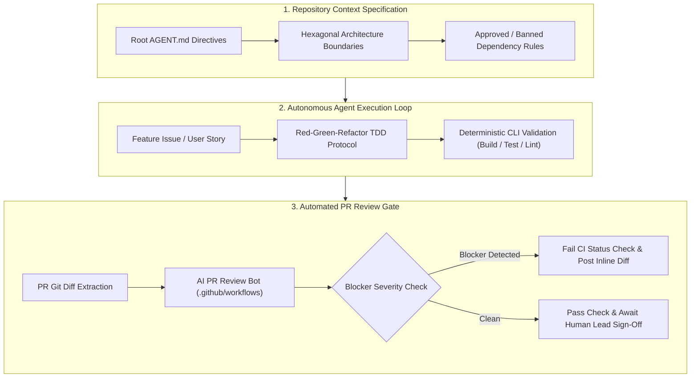

# Capstone Engineering Challenge: Establish an Enterprise AI-Native Repository Framework

> **Architectural Capstone**: Transform an enterprise repository into a fully autonomous, context-engineered software development environment with machine-readable directives, automated CI code review bots, and continuous invariant verification.
>
> [← Back to Phase 08 Hub](../README.md) • [Master Curriculum Overview](../../README.md)

---



### Visual Walkthrough of the Capstone Flow
1. **Context Engineering Tier**: The repository root establishes explicit machine-readable constraints (`AGENT.md`), defining build commands, architectural boundaries, and dependency allowlists.
2. **Autonomous Execution Loop**: The coding agent ingests user stories, writes failing test suites first (RED), implements minimal compliant code (GREEN), and verifies via deterministic CLI tools.
3. **Automated Review & Gating**: Headless CI review bots inspect pull request diffs for security and boundary violations, automatically blocking merge if blockers exist.

---

## Objective

Design and deploy an enterprise-grade AI-native repository framework for a mission-critical multi-tier service (.NET 9 Web API + React 19 Frontend + PostgreSQL). The repository must supply unambiguous machine-readable directives to coding agents (Claude Code, Cursor, Windsurf), enforce architectural invariants via automated CI review bots, and automate architectural governance.

---

## Architectural Requirements & Deliverables

### Task 1: Production Master `AGENT.md` Specification
Create a comprehensive `/AGENT.md` at the repository root guiding autonomous coding agents:
1. **Deterministic CLI Toolchain**: Exact commands for build (`Release /warnaserror`), unit tests (`dotnet test`), integration tests (via Testcontainers), and linting (`dotnet format --verify-no-changes`).
2. **Hexagonal Architecture Rules**: Strict directional dependencies (`Domain` has zero dependencies; `Application` references `Domain`; `Infrastructure` references `Application`/`Domain`; `Api` references `Application`/`Infrastructure`).
3. **Typing & Immutability Invariants**: Enforce `<Nullable>enable</Nullable>`, C# records for DTOs/commands/queries, and explicit value object patterns with zero tolerance for `dynamic`.
4. **Dependency Governance**: Explicit allowlist (`FluentValidation`, `Mapperly`, `Testcontainers`, `System.Text.Json`) and strict denylist (ban `AutoMapper`, `Newtonsoft.Json`, unparameterized SQL clients).
5. **Agent Execution Protocol**: Step-by-step TDD workflow: inspect domain → write failing tests (RED) → implement minimal code (GREEN) → refactor with verification → run linter.

### Task 2: Automated GitHub Actions PR Review Bot
Implement an automated architectural review workflow (`.github/workflows/ai-pr-review.yml`) and review evaluation prompt:
1. **Diff Extraction**: Extract git diff between target branch and pull request branch with a token safety ceiling.
2. **Invariant & Security Audit**: Analyze diffs against:
   - Layer boundary breaches (e.g., Domain entity referencing Entity Framework or infrastructure).
   - OWASP Top 10 vulnerabilities (SQLi, SSRF, IDOR, sensitive logging).
   - Database query performance (missing indexes on foreign keys, unpaginated collections, async-over-sync deadlocks).
   - Breaking API contracts (unversioned removals or alterations to public endpoints).
3. **Structured PR Commentary**: Automatically post inline comments citing file names, line numbers, and concrete remediation code diffs.
4. **CI Enforcement Gate**: Return exit code 1 to block PR merging if any blocker severity issue is discovered.

### Task 3: AI-Assisted Architectural Decision Record (ADR) Workflow
Implement an automated CLI script or agent workflow (`scripts/generate-adr.py` or `.agent/workflows/adr.md`):
1. **Context Ingestion**: Ingest high-level engineering dilemma, throughput/latency SLA targets, and candidate solutions.
2. **Trade-Off Matrix Synthesis**: Systematically evaluate candidates against latency, operational complexity, cloud monthly expenditure, and failure blast radius.
3. **Standard ADR Generation**: Output completed Markdown ADR matching the Michael Nygard format into `/docs/adr/`.
4. **Catalog Indexing**: Automatically update the master ADR index table in `/docs/adr/README.md`.

---

## Verification Criteria & Production Acceptance Rubric

| Milestone | Deliverable | Production Verification Standard |
|---|---|---|
| **M1: Directives & Constraints** | Root `AGENT.md` | Autonomous agent correctly parses commands, executes TDD workflow, and rejects requests to add banned dependencies (`Newtonsoft.Json`). |
| **M2: PR Review Bot & Gating** | `.github/workflows/ai-pr-review.yml` | Injected anti-patterns (unindexed foreign key query, domain layer EF reference) trigger automated blocker verdicts and block CI merge. |
| **M3: TDD Specification Loop** | Unit & Integration Test Suites | Agent executes Red-Green-Refactor loop: tests fail before implementation, pass after implementation, and maintain 100% layer isolation. |
| **M4: Automated ADR Engine** | ADR Generator Workflow | Ingests partitioned telemetry design problem; produces compliant Michael Nygard ADR with trade-off matrix and updates ADR catalog. |

---

## Implementation Verification Scenarios

### Scenario A: Enforcing Anti-Vibe Coding Gates
1. Commit a feature without automated test coverage.
2. Run automated verification gate.
3. **Expected Result**: CI gate rejects PR with diagnostic: `Missing test provenance for modified public method OrderService.Application.Commands.CancelOrder`.

### Scenario B: Blocking Layer Violations
1. Inject an Entity Framework Core `DbContext` reference into an entity inside `OrderService.Domain`.
2. Run the PR review bot.
3. **Expected Result**: Bot flags `[BLOCKER]: Domain model references Infrastructure data persistence. Violates Hexagonal Invariant #1.` Merging is prevented.

---

## 🧪 Automated Grading & Verification Test Runner

Run the automated evaluation suite to verify all capstone milestones offline:

```bash
python 08-ai-augmented-sdlc-and-leadership/labs/verify_capstone.py
```

### Expected Evaluation Output:
```text
================================================================
      PHASE 08 CAPSTONE CHALLENGE: AUTOMATED EVALUATION         
================================================================

[✅ PASS] M1: Repository AGENT.md Contract
       AGENT.md verified (51 lines, under 150-line ceiling). All invariant sections present.

[✅ PASS] M2: Headless PR Review Bot & Invariant Gate
       Review bot successfully blocked SQLi & layer violations, and cleanly approved compliant diff.

[✅ PASS] M3: Automated ADR Synthesis Engine
       Generated ADR strictly adheres to Michael Nygard schema and outputs cleanly.

----------------------------------------------------------------
Final Score: 3/3 Milestones Passed (100.0%)
VERDICT: CAPSTONE CHALLENGE ACCEPTED (100% PRODUCTION READY)
```

---

## 🧭 Navigation

| Role | Target Resource |
|---|---|
| **Phase Overview** | [Phase 08 Hub: AI-Augmented SDLC & Leadership](../README.md) |
| **Lesson 00** | [Lesson 00: Foundations of the AI-Native SDLC (Software 3.0)](../00-foundations-of-the-ai-native-sdlc.md) |
| **Lesson 01** | [Lesson 01: AI Coding Toolchains & Agent Architectures](../01-ai-coding-toolchains-and-agent-architectures.md) |
| **Lesson 02** | [Lesson 02: Spec-Driven Development & Codebase Contracts](../02-spec-driven-development-and-codebase-contracts.md) |
| **Lesson 07** | [Lesson 07: Enterprise AI Delivery Governance & Accelerators](../07-enterprise-ai-delivery-governance-and-accelerators.md) |
