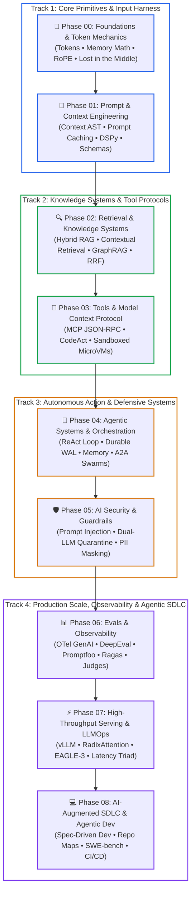

# 🗺️ The Complete AI Engineer Roadmap (Phases 00–08)

> **A practical, systems-first roadmap for software engineers transitioning into production AI engineering.**  
> Every concept, phase, and subtopic is explained in simple, everyday language without confusing academic jargon.
>
> [← Master Curriculum & Architecture (README.md)](./README.md) • [📖 Glossary by Practice](./ai-engineering-glossary-by-practice.md) • [🤖 Learning with Agents](./LEARNING_WITH_AGENTS.md) • [🏗️ Platform Infrastructure Roadmap](./ai-platform-and-agent-infrastructure-roadmap.md)

---

## 📑 Table of Contents

- [🗺️ Master Visual Roadmap](#️-master-visual-roadmap)
- [Phase 00: Foundations & Token Mechanics](#phase-00-foundations--token-mechanics)
  - [0.1 Role Foundations: AI Engineer vs. Machine Learning Engineer](#01-role-foundations-ai-engineer-vs-machine-learning-engineer)
  - [0.2 Large Language Models & Token Mechanics](#02-large-language-models--token-mechanics)
  - [0.3 Generation Mechanics & Sampling Parameters](#03-generation-mechanics--sampling-parameters)
  - [0.4 Hardware Constraints & Compute Physics](#04-hardware-constraints--compute-physics)
  - [0.5 Model Tiers & Open-Weight Foundations](#05-model-tiers--open-weight-foundations)
- [Phase 01: Prompt & Context Engineering](#phase-01-prompt--context-engineering)
  - [1.1 Context Architecture & The Prompt AST](#11-context-architecture--the-prompt-ast)
  - [1.2 Context Compaction & Token Budgeting](#12-context-compaction--token-budgeting)
  - [1.3 Prompt Caching Mechanics & Prefix Alignment](#13-prompt-caching-mechanics--prefix-alignment)
  - [1.4 Programmatic Prompt Optimization & Delimiters](#14-programmatic-prompt-optimization--delimiters)
  - [1.5 Structured Outputs & Schema Contracts](#15-structured-outputs--schema-contracts)
- [Phase 02: Retrieval & Knowledge Systems](#phase-02-retrieval--knowledge-systems)
  - [2.1 Embeddings & Dense Semantic Vector Space](#21-embeddings--dense-semantic-vector-space)
  - [2.2 Vector Storage, Indexing & Approximate Nearest Neighbors](#22-vector-storage-indexing--approximate-nearest-neighbors)
  - [2.3 Sparse Keyword Search & Hybrid Search](#23-sparse-keyword-search--hybrid-search)
  - [2.4 Reciprocal Rank Fusion & Cross-Encoder Reranking](#24-reciprocal-rank-fusion--cross-encoder-reranking)
  - [2.5 Advanced Retrieval: Contextual RAG, HyDE & GraphRAG](#25-advanced-retrieval-contextual-rag-hyde--graphrag)
  - [2.6 Ingestion Pipelines & Late Chunking](#26-ingestion-pipelines--late-chunking)
  - [2.7 Multi-Tenant Isolation & Enterprise Data Partitioning](#27-multi-tenant-isolation--enterprise-data-partitioning)
- [Phase 03: Tools & Model Context Protocol (MCP)](#phase-03-tools--model-context-protocol-mcp)
  - [3.1 Function Calling & Foreign-Function Interfaces](#31-function-calling--foreign-function-interfaces)
  - [3.2 The Model Context Protocol Standard](#32-the-model-context-protocol-standard)
  - [3.3 Protocol Transports: stdio vs. Streamable HTTP/SSE](#33-protocol-transports-stdio-vs-streamable-httpsse)
  - [3.4 MCP Primitives: Tools, Resources, Prompts & Roots](#34-mcp-primitives-tools-resources-prompts--roots)
  - [3.5 The CodeAct Paradigm: Executable Code Actions](#35-the-codeact-paradigm-executable-code-actions)
  - [3.6 Execution Sandboxing & Zero-Trust Tool Security](#36-execution-sandboxing--zero-trust-tool-security)
- [Phase 04: Agentic Systems & Stateful Orchestration](#phase-04-agentic-systems--stateful-orchestration)
  - [4.1 Autonomous Agent Fundamentals & The ReAct Loop](#41-autonomous-agent-fundamentals--the-react-loop)
  - [4.2 Durable Execution & Event-Sourced Write-Ahead Logs](#42-durable-execution--event-sourced-write-ahead-logs)
  - [4.3 Agent Memory Hierarchy & Time-Travel Debugging](#43-agent-memory-hierarchy--time-travel-debugging)
  - [4.4 Bounded Iterations, Tool Call Repair & Infinite Loop Prevention](#44-bounded-iterations-tool-call-repair--infinite-loop-prevention)
  - [4.5 Multi-Agent Systems & Agent-to-Agent Protocols](#45-multi-agent-systems--agent-to-agent-protocols)
- [Phase 05: AI Security & Guardrails](#phase-05-ai-security--guardrails)
  - [5.1 Threat Modeling & The OWASP Top 10 for LLMs](#51-threat-modeling--the-owasp-top-10-for-llms)
  - [5.2 Direct & Indirect Prompt Injection Defenses](#52-direct--indirect-prompt-injection-defenses)
  - [5.3 Multi-Turn Jailbreak Defenses & Crescendo Attacks](#53-multi-turn-jailbreak-defenses--crescendo-attacks)
  - [5.4 Dual-LLM Quarantine Architecture](#54-dual-llm-quarantine-architecture)
  - [5.5 Semantic Firewalls, PII Masking & Runtime Guardrails](#55-semantic-firewalls-pii-masking--runtime-guardrails)
  - [5.6 Algorithmic Fairness, Bias Detection & Explainability](#56-algorithmic-fairness-bias-detection--explainability)
- [Phase 06: Evals & Observability](#phase-06-evals--observability)
  - [6.1 Evaluation Hierarchy: Deterministic vs. Model-Based Evals](#61-evaluation-hierarchy-deterministic-vs-model-based-evals)
  - [6.2 Production Evaluation Frameworks: DeepEval, Promptfoo & Ragas](#62-production-evaluation-frameworks-deepeval-promptfoo--ragas)
  - [6.3 Groundedness, Faithfulness & Hallucination Scoring](#63-groundedness-faithfulness--hallucination-scoring)
  - [6.4 LLM-as-a-Judge Calibration & Bias Mitigation](#64-llm-as-a-judge-calibration--bias-mitigation)
  - [6.5 Agent Trajectory Evaluation](#65-agent-trajectory-evaluation)
  - [6.6 OpenTelemetry GenAI Observability & Trace Waterfalls](#66-opentelemetry-genai-observability--trace-waterfalls)
- [Phase 07: High-Throughput Serving & LLMOps](#phase-07-high-throughput-serving--llmops)
  - [7.1 Serving Engine Internals & PagedAttention](#71-serving-engine-internals--pagedattention)
  - [7.2 Serving Latency Triad & KV-Cache Sizing Math](#72-serving-latency-triad--kv-cache-sizing-math)
  - [7.3 Prefix Caching & RadixAttention KV-Cache Sharing](#73-prefix-caching--radixattention-kv-cache-sharing)
  - [7.4 Speculative Decoding: EAGLE-3 & P-EAGLE](#74-speculative-decoding-eagle-3--p-eagle)
  - [7.5 Resilient AI Gateways & Traffic Control](#75-resilient-ai-gateways--traffic-control)
  - [7.6 Model Fine-Tuning Realities & Parameter-Efficient Tuning](#76-model-fine-tuning-realities--parameter-efficient-tuning)
- [Phase 08: AI-Augmented SDLC & Agentic Development](#phase-08-ai-augmented-sdlc--agentic-development)
  - [8.1 Spec-Driven Development vs. Vibe Coding](#81-spec-driven-development-vs-vibe-coding)
  - [8.2 The Agentic Coding Loop & Terminal Execution](#82-the-agentic-coding-loop--terminal-execution)
  - [8.3 Agentic Extensibility: Skills, Hooks, Plugins & Environment Setup](#83-agentic-extensibility-skills-hooks-plugins--environment-setup)
  - [8.4 Codebase Context: Repo Maps & Tree-sitter ASTs](#84-codebase-context-repo-maps--tree-sitter-asts)
  - [8.5 Automated TDD Loops & Compiler Verification Gates](#85-automated-tdd-loops--compiler-verification-gates)
  - [8.6 Agentic Coding Tools & SWE-bench Benchmarks](#86-agentic-coding-tools--swe-bench-benchmarks)
  - [8.7 Autonomous Pull Request Reviews & CI/CD Agents](#87-autonomous-pull-request-reviews--cicd-agents)
  - [8.8 Enterprise Governance, ISO 42001 & EU AI Act Compliance](#88-enterprise-governance-iso-42001--eu-ai-act-compliance)
- [🧪 Hands-On Labs & Interactive Companion Notebooks](#-hands-on-labs--interactive-companion-notebooks)
- [🧭 Navigation](#-navigation)

---

## 🗺️ Master Visual Roadmap



### Visual Roadmap Walkthrough:
1. **Track 1 (Blue / Primitives)**: Master tokens, GPU memory math, attention mechanics, and compiled prompt structures (Phase 00 & 01).
2. **Track 2 (Green / Knowledge & Tools)**: Ground models with Contextual RAG, GraphRAG, and connect them to external APIs over MCP and CodeAct (Phase 02 & 03).
3. **Track 3 (Amber / Action & Defenses)**: Build crash-resilient agents backed by durable Write-Ahead Logs (WAL) and secure them against prompt injection with dual-LLM quarantines (Phase 04 & 05).
4. **Track 4 (Purple / Scale & SDLC)**: Instrument traces with OpenTelemetry, serve models with PagedAttention and speculative decoding, and lead engineering with Spec-Driven agentic workflows (Phase 06, 07 & 08).

---

## Phase 00: Foundations & Token Mechanics
### Understand how models process text, guess words, and consume hardware resources.

[📂 Explore Phase 00 Hub & Lessons](./00-foundations-and-token-mechanics/README.md)

### 0.1 **Role Foundations: AI Engineer vs. Machine Learning Engineer**
> An AI Engineer uses foundation models, databases, and APIs to ship reliable software. An ML Engineer trains neural networks from scratch on GPU clusters.

- **0.1.1 AI Engineer Responsibilities** -> Connecting foundation models to enterprise databases, microservice APIs, and user interfaces using deterministic software harnesses.
- **0.1.2 Machine Learning (ML) Engineer Responsibilities** -> Designing model architectures, curating massive training datasets, and running distributed gradient descent on GPU clusters.
- **0.1.3 The Software 3.0 Mindset** -> Shifting from handwritten if-statements (Software 1.0) and trained statistical models (Software 2.0) to prompt context engineering and probabilistic reasoning microservices.

### 0.2 **Large Language Models & Token Mechanics**
> A Large Language Model (LLM) predicts text one token at a time based on probabilities, not a database lookup.

- **0.2.1 Tokens** -> Subword fragments (around 3 to 4 letters) that models read and generate instead of full words.
- **0.2.2 Byte-Pair Encoding (BPE)** -> An algorithm that merges frequent character pairs into a fixed vocabulary table (typically 32,000 to 128,000 tokens).
- **0.2.3 Context Window** -> The maximum token budget (prompt input plus generated response) an LLM can process in a single request.
- **0.2.4 "Lost in the Middle" Effect** -> The proven U-shaped attention curve where models remember facts at the start and end of prompts, but miss facts buried in the middle.
- **0.2.5 Hallucination** -> A confident false statement generated when a model completes statistical patterns without factual grounding context.

### 0.3 **Generation Mechanics & Sampling Parameters**
> Models generate text one token at a time by calculating probability odds across their entire vocabulary.

- **0.3.1 Autoregressive Generation** -> Sequential generation where each newly predicted token is added back to the prompt before predicting the next token.
- **0.3.2 Logits & Softmax** -> Raw unnormalized scores (logits) converted into probabilities summing to 1.0 using the softmax math function.
- **0.3.3 Temperature** -> A dial scaling logits; `0.0` forces deterministic greedy choice, while higher numbers (`0.7`–`1.0`) increase lexical variety.
- **0.3.4 Top-P (Nucleus Sampling)** -> A filter restricting choices to the smallest set of tokens whose combined odds exceed probability P.
- **0.3.5 Top-K Sampling** -> A filter restricting choices to the K highest-probability tokens, cutting off strange wild guesses.

### 0.4 **Hardware Constraints & Compute Physics**
> AI inference is strictly bounded by GPU memory bandwidth and Video RAM (VRAM) capacity.

- **0.4.1 Arithmetic Intensity & Roofline Model** -> The ratio of compute operations (FLOPs) to memory reads (Bytes). Prefill is compute-bound; decoding is memory-bandwidth bound.
- **0.4.2 Key-Value (KV) Cache** -> GPU memory buffers storing past attention vectors so the model does not recalculate them for every new word.
- **0.4.3 Prefill Phase vs. Decode Phase** -> Prefill processes the prompt in parallel with high compute intensity. Decode generates words one by one with low compute intensity.
- **0.4.4 Multi-Query (MQA) & Grouped-Query Attention (GQA)** -> Techniques that share Key and Value attention heads to slash KV-cache memory usage by 4x to 8x.
- **0.4.5 Rotary Position Embedding (RoPE)** -> The modern positional encoding method used in Llama, Mistral, and Qwen that allows models to handle long context windows.

### 0.5 **Model Tiers & Open-Weight Foundations**
> Select between cloud APIs and local open-weight models based on cost, speed, and privacy.

- **0.5.1 Commercial Cloud APIs** -> Ready-to-use cloud models (OpenAI, Anthropic, Google Gemini) billed per million tokens with zero GPU management.
- **0.5.2 Open-Weight Foundations** -> Downloadable models (Meta Llama, Mistral, Qwen) that run on private servers using runtimes like Ollama or vLLM.
- **0.5.3 Small Language Models (SLMs)** -> Fast, compact models (1B to 14B parameters, like Phi-4 and Qwen 2.5) that handle classification and extraction cheaply.
- **0.5.4 Quantization (AWQ, GPTQ, GGUF)** -> Compressing 16-bit weights into 8-bit or 4-bit numbers, allowing models to fit inside much smaller GPU memory.

---

## Phase 01: Prompt & Context Engineering
### Structure model inputs to enforce deterministic interfaces and maximize cache reuse.

[📂 Explore Phase 01 Hub & Lessons](./01-prompt-and-context-engineering/README.md)

### 1.1 **Context Architecture & The Prompt AST**
> Treat prompts as compiled Abstract Syntax Trees (ASTs) rather than glued-together text strings.

- **1.1.1 The Context Abstract Syntax Tree (AST)** -> Breaking prompts into modular nodes (System Rules, Exemplars, Dynamic Context, User Request).
- **1.1.2 Instruction Hierarchy** -> Ordering prompt layers so high-priority system rules cannot be overridden by untrusted user data.
- **1.1.3 Zero-Shot vs. Few-Shot Prompting** -> Giving instructions alone (zero-shot) versus supplying clear input-output examples (few-shot) for format compliance.
- **1.1.4 Chain-of-Thought (CoT)** -> Instructing the model to show its step-by-step reasoning before answering, preventing logic and calculation errors.

### 1.2 **Context Compaction & Token Budgeting**
> Actively manage the token budget to avoid memory overflows and lost instructions.

- **1.2.1 Maximum Effective Context Window (MECW)** -> The practical token limit before an LLM's retrieval accuracy drops.
- **1.2.2 Context Compaction Pipelines** -> Summarizing older conversation turns, stripping useless HTML markup, and pruning irrelevant details.
- **1.2.3 Token Budget Allocation** -> Reserving dedicated token limits for system prompts, chat history, retrieved notes, and generated output.

### 1.3 **Prompt Caching Mechanics & Prefix Alignment**
> Structure prompt beginnings so inference engines reuse precomputed KV-cache states.

- **1.3.1 Ephemeral Prefix Caching** -> Saving precomputed KV caches for identical leading prompt tokens, cutting latency by 80% and cost by 90%.
- **1.3.2 Static Prefix Ordering** -> Placing unchanging text (system instructions, tool declarations) at the absolute start of the prompt.
- **1.3.3 Dynamic Suffix Placement** -> Confining variable parameters (timestamps, user questions) to the end of the prompt to avoid breaking cache hits.

### 1.4 **Programmatic Prompt Optimization & Delimiters**
> Move from brittle manual prompt tweaking to algorithmic prompt optimization.

- **1.4.1 Declarative Optimization (DSPy / MIPROv2)** -> Compiling prompts programmatically by using Stanford DSPy and Bayesian optimizers (MIPROv2) to discover high-performing instructions automatically.
- **1.4.2 XML Boundary Delimiters** -> Isolating untrusted data using explicit structural tags (`<context>`, `<instructions>`, `<user_input>`).
- **1.4.3 System Prompt Extraction Defense** -> Hardening system instructions against jailbreak attempts that try to leak internal prompts.

### 1.5 **Structured Outputs & Schema Contracts**
> Force models to return strictly valid JSON payloads matching Pydantic and JSON schemas.

- **1.5.1 Grammar-Constrained Decoding** -> Masking invalid token logits using Finite State Machines (FSMs) so schema violations are mathematically impossible.
- **1.5.2 Pydantic v2 Schema Contracts** -> Declaring typed Python models with data validations and type assertions.
- **1.5.3 Automated Output Recovery** -> Feeding validation error traces back to the model for single-turn syntax correction.

---

## Phase 02: Retrieval & Knowledge Systems
### Ground models with private enterprise data using hybrid search and ranking algorithms.

[📂 Explore Phase 02 Hub & Lessons](./02-rag-and-knowledge-systems/README.md)

### 2.1 **Embeddings & Dense Semantic Vector Space**
> Convert text chunks into high-dimensional numerical coordinates that capture conceptual meaning.

- **2.1.1 Semantic Embeddings** -> Dense vectors (typically 768 to 3,072 numbers) acting as concept coordinates in geometric space.
- **2.1.2 Distance Metrics (Cosine Similarity vs. Dot Product)** -> Measuring vector angles (cosine) or combined angle and length (dot product) to calculate similarity.
- **2.1.3 Embedding Model Selection** -> Balancing latency, context limits, and language accuracy when choosing embedding models.

### 2.2 **Vector Storage, Indexing & Approximate Nearest Neighbors**
> Specialized databases designed to find closest matching vectors in milliseconds across millions of items.

- **2.2.1 Hierarchical Navigable Small World (HNSW)** -> A multi-layer graph index delivering logarithmic search speeds over vector spaces.
- **2.2.2 ACORN Indexing** -> Predicate-aware graph traversal algorithms that prevent graph disconnection on heavily filtered enterprise queries.
- **2.2.3 Vector Tombstones & Compaction** -> Managing soft deletes and background graph compaction to prevent search accuracy drops over time.

### 2.3 **Sparse Keyword Search & Hybrid Search**
> Combine exact word matching with semantic concept search to eliminate exact-match blind spots.

- **2.3.1 BM25 (Best Matching 25)** -> A sparse keyword index that scores documents by term frequency, excelling at exact SKUs and IDs.
- **2.3.2 The Vector-Only Blindspot** -> Dense vectors frequently confuse similar alphanumeric codes (e.g., `ERR_001` vs `ERR_002`) where exact word match is mandatory.
- **2.3.3 Hybrid Search** -> Querying dense vector indexes and sparse BM25 indexes simultaneously across the same documents.

### 2.4 **Reciprocal Rank Fusion & Cross-Encoder Reranking**
> Merge search results and re-score top candidates for maximum precision.

- **2.4.1 Reciprocal Rank Fusion (RRF)** -> Merging ranked lists using a simple rank formula without needing score normalization:
  ```text
  RRF_Score(d) = Σ [ 1 / (60 + rank_m(d)) ]  for each search method m
  ```
- **2.4.2 Cross-Encoder Rerankers** -> Deep transformer models scoring query-document pairs together for fine-grained relevance at slightly higher latency.
- **2.4.3 Two-Stage Retrieval** -> Fast first-stage hybrid retrieval (getting top 50 matches) followed by precision cross-encoder reranking (passing top 5 to the LLM).

### 2.5 **Advanced Retrieval: Contextual RAG, HyDE & GraphRAG**
> Overcome the limitations of simple passage chunking.

- **2.5.1 Contextual Retrieval (Anthropic)** -> Prepending document-level context to each chunk before embedding, cutting retrieval failures by 35% to 67%.
- **2.5.2 Hypothetical Document Embeddings (HyDE)** -> Asking the model to write a hypothetical answer first, then embedding that answer to find real documents.
- **2.5.3 GraphRAG (Microsoft / Neo4j)** -> Extracting entities, relationships, and Leiden community summaries to answer complex multi-hop questions.
- **2.5.4 Late Interaction / ColBERT** -> Storing multi-vector token representations to compute fine-grained token alignments instead of single vectors.

### 2.6 **Ingestion Pipelines & Late Chunking**
> Prepare, clean, and partition documents into clean contextual units.

- **2.6.1 Chunking Strategies** -> Splitting text by character count, sentence boundaries, or structural markdown headers.
- **2.6.2 Late Chunking** -> Embedding the entire document first and pooling embeddings into chunk spans to preserve cross-paragraph meaning.

### 2.7 **Multi-Tenant Isolation & Enterprise Data Partitioning**
> Prevent cross-tenant data leakage in corporate knowledge bases.

- **2.7.1 Tenant Pre-Filtering** -> Restricting search at the index boundary before scoring, preventing unauthorized data from ever leaking into results.
- **2.7.2 Document-Level RBAC** -> Checking retrieved chunks against user security permissions before sending context to the model.

---

## Phase 03: Tools & Model Context Protocol (MCP)
### Connect models to external APIs, databases, and services using standardized wire protocols.

[📂 Explore Phase 03 Hub & Lessons](./03-tools-and-model-context-protocol/README.md)

### 3.1 **Function Calling & Foreign-Function Interfaces**
> Enable models to invoke external tools instead of just outputting text.

- **3.1.1 Tool Declaration Schemas** -> JSON Schema descriptions defining tool names, descriptions, parameter types, and required fields.
- **3.1.2 Parallel Tool Execution** -> Handling model responses that request multiple function calls in a single turn.
- **3.1.3 Tool Choice Controls** -> Forcing tool usage (`required`), allowing optional calls (`auto`), or disabling tools (`none`).

### 3.2 **The Model Context Protocol Standard**
> An open standard for connecting AI clients to tools and data, governed by the Linux Foundation's Agentic AI Foundation (AAIF).

- **3.2.1 The Universal Adapter Model** -> Eliminating custom tool connectors for each LLM provider by using one standard protocol.
- **3.2.2 Architecture: Client, Host, and Server** -> The **Host** (e.g. IDE/runtime) manages security; the **Client** maintains connections; the **Server** exposes tools.
- **3.2.3 JSON-RPC 2.0 Core** -> Typed bidirectional messages (`tools/call`, `resources/read`, `prompts/get`).

### 3.3 **Protocol Transports: stdio vs. Streamable HTTP/SSE**
> Managing how MCP messages travel between systems.

- **3.3.1 Local Process Transport (`stdio`)** -> Spawning local server subprocesses over standard input and standard output for development.
- **3.3.2 Server-Sent Events (SSE) & Streamable HTTP** -> Cloud-native networking for connecting distributed agents to remote microservices.

### 3.4 **MCP Primitives: Tools, Resources, Prompts & Roots**
> Core capabilities exposed across the protocol.

- **3.4.1 Tools** -> Executable actions (running SQL, sending emails, processing payments).
- **3.4.2 Resources** -> Read-only data streams (file descriptors, database records) for zero-hallucination grounding.
- **3.4.3 Prompts** -> Reusable prompt templates and slash-commands exposed directly by the server.
- **3.4.4 Roots & Reverse Sampling** -> Workspace root inspection and server-initiated model completion requests (`sampling/createMessage`).

### 3.5 **The CodeAct Paradigm: Executable Code Actions**
> Having agents write and execute Python code in a sandboxed REPL instead of rigid JSON schemas (ICML 2024).

- **3.5.1 Code-as-Actions** -> Letting the agent write Python code to orchestrate loops, data filters, and multi-step math directly.
- **3.5.2 Token & Step Efficiency** -> Solving complex data analysis tasks in fewer round-trips than traditional JSON tool calling.

### 3.6 **Execution Sandboxing & Zero-Trust Tool Security**
> Isolate untrusted code execution from backend infrastructure.

- **3.6.1 MicroVM Sandboxing (Firecracker / E2B)** -> Running agent code in lightweight, hardware-isolated virtual machines booting in under 200ms.
- **3.6.2 Syscall Interception (gVisor)** -> Trapping Linux system calls in user space to prevent container breakout exploits.
- **3.6.3 Egress Firewalls** -> Denying outbound network access by default and injecting credentials securely so models never see raw API keys.

---

## Phase 04: Agentic Systems & Stateful Orchestration
### Build autonomous multi-turn systems that reason, act, persist state, and recover from failures.

[📂 Explore Phase 04 Hub & Lessons](./04-agentic-systems-and-orchestration/README.md)

### 4.1 **Autonomous Agent Fundamentals & The ReAct Loop**
> Combining reasoning steps with action execution inside an iterative loop.

- **4.1.1 The ReAct Loop (Reason + Act)** -> Repeating cycles where the model thinks, invokes a tool, observes the output, and decides the next move.
- **4.1.2 Agents vs. Chatbots** -> Chatbots answer questions in one turn; agents autonomously pursue goals across multiple turns.
- **4.1.3 Deterministic Software Harness** -> The outer code wrapper that manages state, enforces limits, and terminates execution safely.

### 4.2 **Durable Execution & Event-Sourced Write-Ahead Logs**
> Ensure agent workflows survive crashes without losing progress.

- **4.2.1 Event-Sourced Write-Ahead Logs (WAL)** -> Appending every prompt, thought, tool call, and tool output to an append-only disk ledger before acting.
- **4.2.2 State Rehydration** -> Rebuilding an agent's working memory from its event log after unexpected container restarts.
- **4.2.3 Tool Idempotency Keys** -> Attaching unique transaction keys to tool calls so retrying never charges a user twice.

### 4.3 **Agent Memory Hierarchy & Time-Travel Debugging**
> Managing how agents remember information over short and long horizons.

- **4.3.1 Memory Tiers** -> Active scratchpad (in context), episodic memory (past sessions in SQL), and semantic memory (timeless facts in vector DBs).
- **4.3.2 Time-Travel Debugging & Replay** -> Pausing an agent run, rewinding past turns, editing context, and resuming execution.

### 4.4 **Bounded Iterations, Tool Call Repair & Infinite Loop Prevention**
> Keep agents from running away, deadlocking, or draining budgets.

- **4.4.1 Bounded Iteration Caps** -> Setting hard maximum loop limits (typically 5 to 10 turns) and token spending caps per task.
- **4.4.2 Action Fingerprinting** -> Hashing recent tool calls and parameters to detect repetitive loops and break them early.
- **4.4.3 Automated Tool Repair** -> Automatically detecting schema mismatches (e.g. string instead of float) and coercing parameters cleanly.

### 4.5 **Multi-Agent Systems & Agent-to-Agent Protocols**
> Coordinate teams of specialized agents to solve large tasks.

- **4.5.1 Subagent Delegation** -> Spawning focused subagents (Planner, Researcher, Coder, Reviewer) with clean, separate context windows.
- **4.5.2 Agent-to-Agent (A2A) Protocols** -> Open messaging protocols and Agent Cards for cross-framework collaboration (Linux Foundation standard).
- **4.5.3 Distributed Sagas & Compensating Actions** -> Designing rollback steps when multi-step workflows fail midway through execution.

---

## Phase 05: AI Security & Guardrails
### Defend systems against prompt injections, data exfiltration, toxic outputs, and model drift.

[📂 Explore Phase 05 Hub & Lessons](./05-ai-security-and-guardrails/README.md)

### 5.1 **Threat Modeling & The OWASP Top 10 for LLMs**
> Systematically identify vulnerabilities unique to generative AI.

- **5.1.1 OWASP Top 10 for LLMs** -> Standard risk checklist including prompt injection, data disclosure, and excessive agency.
- **5.1.2 Direct vs. Indirect Injections** -> Direct attacks come from user prompts; indirect attacks hide in external web pages, emails, or uploaded PDFs.

### 5.2 **Direct & Indirect Prompt Injection Defenses**
> Stop untrusted text from overriding system directives.

- **5.2.1 Data vs. Instruction Separation** -> Quarantining untrusted data using explicit structural tags and treating text strictly as data.
- **5.2.2 Canary Tokens** -> Injecting secret canary strings into system prompts to detect and block prompt leakage attempts immediately.

### 5.3 **Multi-Turn Jailbreak Defenses & Crescendo Attacks**
> Defend against subtle, iterative attack vectors.

- **5.3.1 Crescendo Attacks** -> Adversaries gradually nudging conversations over many turns to bypass single-turn safety filters.
- **5.3.2 Encoding & Obfuscation Filters** -> Detecting Base64, ROT13, or cipher payloads designed to bypass simple keyword blocklists.
- **5.3.3 Context Stuffing DoS** -> Flooding context windows to trigger GPU out-of-memory errors and burn token budgets.

### 5.4 **Dual-LLM Quarantine Architecture**
> Use an isolated model to inspect external text before the main reasoning model reads it.

- **5.4.1 Untrusted Text Quarantine** -> Routing external content through an unprivileged analyzer model that strips instructions.
- **5.4.2 Privilege Separation** -> Ensuring models with sensitive tool permissions never process raw, uninspected web content.

### 5.5 **Semantic Firewalls, PII Masking & Runtime Guardrails**
> Validate inputs and outputs against corporate security policies.

- **5.5.1 PII Masking (Microsoft Presidio)** -> Redacting names, credit cards, and social security numbers before sending prompts to cloud models.
- **5.5.2 Input & Output Guardrails** -> Scanning prompts for jailbreaks and checking outputs for toxic claims or hallucinated commitments.
- **5.5.3 Guardrail Models (Llama Guard, NeMo Guardrails)** -> Lightweight models tuned to classify prompt and response safety in real time.

### 5.6 **Algorithmic Fairness, Bias Detection & Explainability**
> Ensure algorithmic fairness and compliance in enterprise decisions.

- **5.6.1 Fairness Metrics** -> Measuring Disparate Impact and Demographic Parity to prevent biased automated outcomes.
- **5.6.2 Explainability (SHAP / LIME)** -> Calculating feature attribution to explain why a specific classification was made.

---

## Phase 06: Evals & Observability
### Quantify model accuracy, evaluate tool trajectories, and monitor production traces with OpenTelemetry.

[📂 Explore Phase 06 Hub & Lessons](./06-evals-and-observability/README.md)

### 6.1 **Evaluation Hierarchy: Deterministic vs. Model-Based Evals**
> Build a testing pyramid combining fast code assertions with capable model judges.

- **6.1.1 Deterministic Assertions** -> Invariant code checks testing output JSON schemas, latency budgets, and regex patterns.
- **6.1.2 Golden Evaluation Datasets** -> Curated banks of representative inputs paired with verified reference outputs.
- **6.1.3 Automated CI/CD Regression Gates** -> Running evaluations on pull requests to stop regressions before deploying prompts or tools.

### 6.2 **Production Evaluation Frameworks: DeepEval, Promptfoo & Ragas**
> Industry-standard evaluation tools for development and release pipelines.

- **6.2.1 Promptfoo** -> CLI tool for side-by-side model benchmarking, prompt iteration, and security red-teaming.
- **6.2.2 DeepEval** -> `pytest`-native evaluation framework for gating Python pull requests with unit test assertions.
- **6.2.3 Ragas** -> Specialized evaluation library scoring RAG metrics (Context Precision, Context Recall, Faithfulness).

### 6.3 **Groundedness, Faithfulness & Hallucination Scoring**
> Mathematically score whether outputs are truthful and supported by retrieved context.

- **6.3.1 Faithfulness (Groundedness)** -> The percentage of claims in the generated response directly supported by retrieved text.
- **6.3.2 Answer Relevance** -> Checking if the output directly answers the user's question without adding fluff.
- **6.3.3 Context Recall** -> Checking if the retrieval engine retrieved all necessary facts.

### 6.4 **LLM-as-a-Judge Calibration & Bias Mitigation**
> Use capable models to grade outputs against explicit guidelines.

- **6.4.1 Scoring Rubrics** -> Clear guidelines (1 to 5 scale or pass/fail) given to judge models to keep grading objective.
- **6.4.2 Verbosity & Self-Enhancement Biases** -> Calibrating judges to prevent favoring overly long answers or preferring their own model family.

### 6.5 **Agent Trajectory Evaluation**
> Grade the sequence of tool calls made by an autonomous agent.

- **6.5.1 Trajectory Diffing** -> Comparing an agent's tool steps against a golden reference path to verify efficiency.
- **6.5.2 Tool Call Precision** -> Measuring whether the agent picked the right tool and passed clean, valid parameters.

### 6.6 **OpenTelemetry GenAI Observability & Trace Waterfalls**
> Monitor and trace AI requests across distributed production environments.

- **6.6.1 OTel GenAI Semantic Conventions** -> Standardized trace attributes (`gen_ai.agent.id`, `gen_ai.tool.name`, `gen_ai.usage.input_tokens`) from the dedicated `semantic-conventions-genai` repo.
- **6.6.2 Distributed Trace Waterfalls** -> Recording an entire user transaction as a nested tree of spans showing latency per step.
- **6.6.3 Golden Signals (Cost, Latency, Errors)** -> Live dashboards tracking Time to First Token (TTFT), error spikes, and token spending per tenant.

---

## Phase 07: High-Throughput Serving & LLMOps
### Optimize inference speed, manage GPU memory, and deploy resilient gateways.

[📂 Explore Phase 07 Hub & Lessons](./07-production-deployment-and-llmops/README.md)

### 7.1 **Serving Engine Internals & PagedAttention**
> Understand how modern inference engines manage GPU memory under high load.

- **7.1.1 Continuous Batching** -> Inserting new requests dynamically into running GPU batches without waiting for long sequences to finish.
- **7.1.2 PagedAttention (vLLM)** -> Managing KV-cache memory in virtual pages (like OS virtual memory), eliminating memory waste and boosting throughput by 2x to 4x.

### 7.2 **Serving Latency Triad & KV-Cache Sizing Math**
> Accurately measure latency and calculate GPU memory footprints.

- **7.2.1 The Latency Triad** -> **TTFT** (Time to First Token - prefill speed), **TPOT** (Time Per Output Token - decode speed), and **ITL** (Inter-Token Latency - streaming smoothness).
- **7.2.2 KV-Cache Sizing Formula** -> Calculate exact GPU VRAM needed for caching:
  ```text
  VRAM (Bytes) = 2 * Layers * Heads * HeadDim * BatchSize * SeqLen * PrecisionBytes
  ```

### 7.3 **Prefix Caching & RadixAttention KV-Cache Sharing**
> Reuse computed attention states across divergent agent turns and concurrent requests.

- **7.3.1 RadixAttention (SGLang)** -> Storing KV caches as a compressed prefix tree to automatically discover and reuse common prompt prefixes.
- **7.3.2 Context-Augmented Generation (CAG)** -> Pre-loading static enterprise documents into cached memory, turning slow RAG lookups into instant token generation.

### 7.4 **Speculative Decoding: EAGLE-3 & P-EAGLE**
> Bypass memory-bandwidth bottlenecks to speed up generation.

- **7.4.1 Speculative Drafting** -> Using a lightweight draft model to propose tokens verified in parallel by the target model.
- **7.4.2 EAGLE-3 & P-EAGLE** -> Advanced speculative draft heads fusing multi-layer hidden states and drafting in parallel, doubling generation speed with zero quality loss.

### 7.5 **Resilient AI Gateways & Traffic Control**
> Manage traffic spikes, quotas, caching, and multi-provider failover.

- **7.5.1 Token-Bucket Rate Limiting** -> Throttling requests per tenant by Requests Per Minute (RPM) and Tokens Per Minute (TPM).
- **7.5.2 Semantic Response Caching** -> Returning cached answers for semantically equivalent questions using fast vector similarity checks.
- **7.5.3 Multi-Provider Failover** -> Routing traffic to secondary providers or falling back to local SLMs during cloud API outages.

### 7.6 **Model Fine-Tuning Realities & Parameter-Efficient Tuning**
> Know when to fine-tune models versus relying on context engineering.

- **7.6.1 The Decision Triad** -> Prompting fixes format; RAG provides factual knowledge; Fine-tuning adjusts style, domain vocabulary, or small model behaviors.
- **7.6.2 Parameter-Efficient Fine-Tuning (PEFT / LoRA)** -> Freezing base model weights and training lightweight low-rank adapters, slashing GPU memory needs during training.

---

## Phase 08: AI-Augmented SDLC & Agentic Development
### Master Spec-Driven Development, autonomous coding agents, repo maps, and engineering leadership.

[📂 Explore Phase 08 Hub & Lessons](./08-ai-augmented-sdlc-and-leadership/README.md)

### 8.1 **Spec-Driven Development vs. Vibe Coding**
> Replace unstructured prompt-driven coding with formal, verifiable specifications.

- **8.1.1 The Dangers of "Vibe Coding"** -> Asking LLMs to write code from informal prompts creates compounding technical debt, subtle edge cases, and architectural drift.
- **8.1.2 The Spec-Driven Development (SDD) Cycle** -> Writing formal specs (`SPEC.md`), defining typing contracts, letting agents generate code, and verifying conformance via compilers and tests.

### 8.2 **The Agentic Coding Loop & Terminal Execution**
> The core Plan → Execute → Observe → Iterate cycle powering modern coding agents.

- **8.2.1 Autonomous Agent Loops** -> Coding agents plan changes, execute tool calls (read files, run shell commands), inspect errors, and iterate until tests pass.
- **8.2.2 Human Permission Gates** -> Prompting developers for explicit approval before running destructive shell commands or deleting files.
- **8.2.3 File Edit Strategies** -> Whole-file rewriting vs. unified diffs vs. targeted search-and-replace blocks for reliable file patching.

### 8.3 **Agentic Extensibility: Skills, Hooks, Plugins & Environment Setup**
> Structure agent capabilities so instructions and safety rules stay modular without bloating context.

- **8.3.1 Modular Agent Skills (`SKILL.md`)** -> Self-contained task instructions loaded on demand via progressive disclosure, preventing context window exhaustion.
- **8.3.2 Deterministic Lifecycle Hooks** -> Code checkpoints triggered before or after tool executions (`pre-tool`, `post-tool`, `pre-commit`) to enforce linting, formatting, and safety rules.
- **8.3.3 Agent Plugins & Packs** -> Distributable packages bundling multiple skills, hooks, and MCP servers into sharable team extensions.
- **8.3.4 Environment Setup & Sandboxing** -> Setting up isolated virtual environments (`uv`, `venv`), devcontainers, and shell allowlists so agents develop safely.
- **8.3.5 Specialized Subagent Personas** -> Dividing large tasks across distinct agent roles (Architect, Coder, Reviewer, Tester) with scoped permissions.

### 8.4 **Codebase Context: Repo Maps & Tree-sitter ASTs**
> Help agents navigate large repositories without burning context windows.

- **8.4.1 Compressed Repo Maps** -> Generating a ranked map of classes, functions, and cross-file dependencies so agents understand repo architecture without reading every line.
- **8.4.2 Tree-sitter AST Parsing** -> Concrete syntax tree parsing across 100+ languages to extract precise symbol definitions and relationships.
- **8.4.3 Repository Directives (`AGENTS.md`, `CLAUDE.md`)** -> Defining project boundaries, typing rules, testing requirements, and architectural standards for agents.

### 8.5 **Automated TDD Loops & Compiler Verification Gates**
> Close the development loop using deterministic compiler and test feedback.

- **8.5.1 Test-Driven Development (TDD) Loops** -> Writing failing tests first, letting the agent generate the minimal code to pass, and verifying with test runners.
- **8.5.2 Compiler & Linter Feedback Loops** -> Feeding syntax errors, type checker outputs (`mypy`, `tsc`), and linter warnings back to the agent for automated repair.

### 8.6 **Agentic Coding Tools & SWE-bench Benchmarks**
> Leading tools and industry standards for evaluating autonomous coding performance.

- **8.6.1 Terminal-Native Coding Agents** -> Command-line agents with direct shell and file access (Anthropic Claude Code, Aider, OpenHands, Google Antigravity).
- **8.6.2 IDE-Integrated Coding Assistants** -> Context-aware editor agents (Cursor, Windsurf, GitHub Copilot).
- **8.6.3 SWE-bench & SWE-bench Verified** -> The industry standard benchmark evaluating agent ability to solve real-world GitHub issues end-to-end.

### 8.7 **Autonomous Pull Request Reviews & CI/CD Agents**
> Embed review and triage agents directly into developer workflows.

- **8.7.1 Automated PR Review Agents** -> Checking code diffs against architectural guidelines, spotting security regressions, and validating test coverage.
- **8.7.2 Automated Bug Localization** -> Running failing CI test logs through agents to locate, patch, and verify bug fixes autonomously.

### 8.8 **Enterprise Governance, ISO 42001 & EU AI Act Compliance**
> Manage risk and compliance across enterprise AI deployments.

- **8.8.1 EU AI Act Obligations** -> Classifying systems by risk tiers (Prohibited, High-Risk, GPAI, Minimal) and enforcing audit logging and transparency.
- **8.8.2 ISO/IEC 42001 (AIMS)** -> Implementing Artificial Intelligence Management Systems to treat evaluation scorecards, guardrail logs, and agent audit trails as compliance evidence.

---

## 🧪 Hands-On Labs & Interactive Companion Notebooks

Every major phase in this roadmap is paired with a verified CLI evaluation lab and an interactive **Google Colab companion notebook** (runnable with 1 click, zero local setup):

| Phase / Milestone | Canonical Lab Guide | Google Colab Companion Notebook | 1-Click Launch |
| :--- | :--- | :--- | :---: |
| **Phase 00: Token Mechanics** | [Phase 00 Capstone Lab](./00-foundations-and-token-mechanics/labs/capstone-token-economics-analyzer.md) | [`00_token_mechanics_and_kv_cache.ipynb`](./notebooks/00_token_mechanics_and_kv_cache.ipynb) | [](https://colab.research.google.com/github/dip4k/senior-engineer-to-ai-engineer-roadmap/blob/main/notebooks/00_token_mechanics_and_kv_cache.ipynb) |
| **Phase 01: Context Engineering** | [Phase 01 Capstone Lab](./01-prompt-and-context-engineering/labs/capstone-context-engineering-pipeline.md) | [`01_prompt_caching_and_budgeting.ipynb`](./notebooks/01_prompt_caching_and_budgeting.ipynb) | [](https://colab.research.google.com/github/dip4k/senior-engineer-to-ai-engineer-roadmap/blob/main/notebooks/01_prompt_caching_and_budgeting.ipynb) |
| **Phase 02: Hybrid Retrieval & RAG** | [Lab 01: Multi-Tenant RAG](./labs/lab-01-multi-tenant-hybrid-rag.md) | [`02_hybrid_rag_and_rrf_visualizer.ipynb`](./notebooks/02_hybrid_rag_and_rrf_visualizer.ipynb) | [](https://colab.research.google.com/github/dip4k/senior-engineer-to-ai-engineer-roadmap/blob/main/notebooks/02_hybrid_rag_and_rrf_visualizer.ipynb) |
| **Phase 03: Tools & Protocols (MCP)** | [Lab 02: Tool Execution MCP](./labs/lab-02-tool-execution-with-mcp.md) | [`03_mcp_client_and_tool_inspector.ipynb`](./notebooks/03_mcp_client_and_tool_inspector.ipynb) | [](https://colab.research.google.com/github/dip4k/senior-engineer-to-ai-engineer-roadmap/blob/main/notebooks/03_mcp_client_and_tool_inspector.ipynb) |
| **Phase 04: Stateful Agent Loops** | [Lab 03: Stateful Orchestration](./labs/lab-03-stateful-agent-orchestration.md) | [`04_stateful_agent_and_wal_replay.ipynb`](./notebooks/04_stateful_agent_and_wal_replay.ipynb) | [](https://colab.research.google.com/github/dip4k/senior-engineer-to-ai-engineer-roadmap/blob/main/notebooks/04_stateful_agent_and_wal_replay.ipynb) |
| **Phase 05: Gateways & Failure Defenses** | [Lab 04: Agent Failure Defense](./labs/lab-04-agent-failure-defense.md) | [`05_token_bucket_and_failure_defense.ipynb`](./notebooks/05_token_bucket_and_failure_defense.ipynb) | [](https://colab.research.google.com/github/dip4k/senior-engineer-to-ai-engineer-roadmap/blob/main/notebooks/05_token_bucket_and_failure_defense.ipynb) |
| **Phase 06: Observability & Evals** | [Lab 05: Tracing & Observability](./labs/lab-05-ai-observability-tracing.md) | [`06_eval_flywheel_and_trace_trees.ipynb`](./notebooks/06_eval_flywheel_and_trace_trees.ipynb) | [](https://colab.research.google.com/github/dip4k/senior-engineer-to-ai-engineer-roadmap/blob/main/notebooks/06_eval_flywheel_and_trace_trees.ipynb) |
| **Phase 07: ML Fairness & Explainability** | [Lab 07: ML Fairness & XAI](./labs/lab-07-hybrid-ml-fairness-and-explainability.md) | [`07_ml_fairness_and_shap_explainability.ipynb`](./notebooks/07_ml_fairness_and_shap_explainability.ipynb) | [](https://colab.research.google.com/github/dip4k/senior-engineer-to-ai-engineer-roadmap/blob/main/notebooks/07_ml_fairness_and_shap_explainability.ipynb) |

*For complete local and cloud execution instructions, see the [Companion Notebook Directory](./notebooks/README.md).*

---

## 🧭 Navigation
 
- **Master Curriculum Syllabus**: [← Back to Master Curriculum & Architecture (README.md)](./README.md)
- **Interactive Companion Notebooks**: [📓 Google Colab Notebook Suite](./notebooks/README.md)
- **Practice Glossary**: [📖 Production AI & Agentic Glossary by Practice](./ai-engineering-glossary-by-practice.md)
- **Interactive Learning**: [🤖 Interactive Learning & Practice with Agents](./LEARNING_WITH_AGENTS.md)
- **Platform Infrastructure**: [🏗️ Senior AI Platform & Agent Infrastructure Roadmap](./ai-platform-and-agent-infrastructure-roadmap.md)
- **Technology Strategy**: [🗺️ Emerging AI Technology Roadmap (2025–2026)](./ai-technology-roadmap-2025-2026.md)
- **Phase Hubs**:
  - [Phase 00: Foundations & Token Mechanics](./00-foundations-and-token-mechanics/README.md)
  - [Phase 01: Prompt & Context Engineering](./01-prompt-and-context-engineering/README.md)
  - [Phase 02: Retrieval & Knowledge Systems](./02-rag-and-knowledge-systems/README.md)
  - [Phase 03: Tools & Model Context Protocol](./03-tools-and-model-context-protocol/README.md)
  - [Phase 04: Agentic Systems & Orchestration](./04-agentic-systems-and-orchestration/README.md)
  - [Phase 05: AI Security & Guardrails](./05-ai-security-and-guardrails/README.md)
  - [Phase 06: Evals & Observability](./06-evals-and-observability/README.md)
  - [Phase 07: High-Throughput Serving & LLMOps](./07-production-deployment-and-llmops/README.md)
  - [Phase 08: AI-Augmented SDLC & Leadership](./08-ai-augmented-sdlc-and-leadership/README.md)
