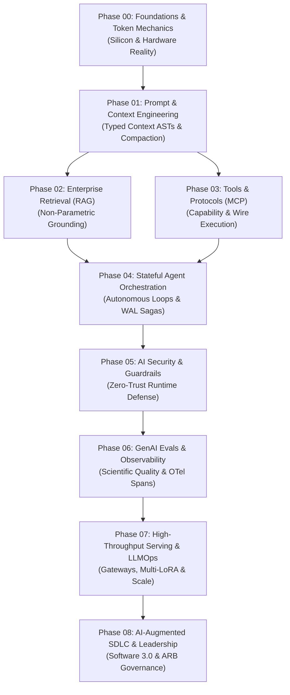
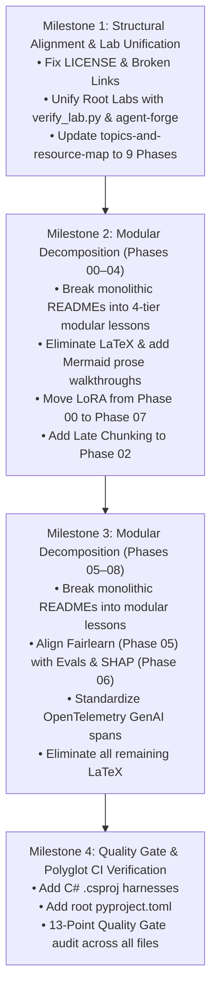

# Comprehensive AI Engineering Curriculum Audit Report

> **Execution Mode**: AUDIT MODE  
> **Auditor**: AI Curriculum Architect  
> **Date**: September 2026  
> **Repository**: `Ai_Native_Engineer`  
> **Target Audience**: Senior Developers, Staff Software Engineers, and Solutions Architects (7–10+ years experience) transitioning to AI Systems Engineering.

---

## Executive Summary

A comprehensive architectural audit of the `Ai_Native_Engineer` repository was conducted across all 9 curriculum phases (Phases 00–08), the root configuration, standalone architectural blueprints, practice labs, interview guides, resources, and internal links.

### High-Level Verdict: Strong Technical Foundations Burdened by Monolithic Architecture and Structural Divergence

The repository possesses exceptional, senior-level technical depth that avoids beginner AI tropes, toy tutorials, and naive prompt begging. Its systems-first perspective (grounded in GPU memory physics, Model Context Protocol wire specs, WAL event-sourced agents, and OpenTelemetry GenAI spans) is world-class.

However, the curriculum suffers from **critical architectural and pedagogical defects**:
1. **Monolithic Lesson Structure**: There are **zero modular lesson files** across any of the 9 phases. Every phase packs all of its lessons into a single, massive `README.md` file ranging from **6,686 to 18,820 words** (Phase 04 alone is 2,237 lines), severely violating the cognitive load budget.
2. **Three-Way Practice Lab Disconnect**: The root `README.md` showcases Labs 01–06 pointing to Phase 04's internal sub-labs, while the repository root `labs/` directory contains empty 18-line skeletons for Labs 01–06, while the automated testing harness (`scripts/verify_lab.py`) and `lab-verifier-and-eval` skill grade an entirely different suite linked to `agent-forge`.
3. **Pervasive Zero-LaTeX Violations**: Over **180 raw LaTeX formulas** (`$$...$$`, `\frac{...}{...}`, `\text{...}`, `\sum`, `\Delta`) are scattered across Phase 00, 04, 05, 06, 07, 08, and the glossary, breaking standard IDE and GitHub markdown rendering.
4. **Taxonomy & Tier Mismatch**: The repository utilizes a legacy 3-tier model (`[MUST-HAVE]`, `[GOOD-TO-KNOW]`, `[KNOWLEDGE-BASE]`), while the authoritative refactoring skill mandates the **4-Tier Lesson Depth Model** (`🟢 Core`, `🟡 Engineering Depth`, `🔵 Advanced`, `⚫ Deep Dive`).
5. **Diagram Walkthrough Absence**: Out of **167 Mermaid diagrams**, over **110 lack an accompanying step-by-step prose walkthrough**, violating Quality Gate 07.
6. **Obsolete 24-Phase Resource Map**: `resources/topics-and-resource-map.md` indexes an obsolete 24-phase curriculum (Phases 0–23) that does not match the actual 9-phase (00–08) repository structure.
7. **Broken Links & Anchors**: Over 100 broken heading anchors exist across `README.md`, `ai-engineering-glossary-by-practice.md`, and roadmap documents, including a broken link to a missing `LICENSE` file.

---

## Intended Role of Each Phase in the AI Engineering Journey

The curriculum is engineered to guide an experienced software engineer through a structured transition from deterministic software architectures to probabilistic systems governed by deterministic harnesses:



| Phase | Phase Name | Intended Role & Pedagogical Responsibility | Core Systems Mental Model | Key Architectural Deliverable |
|:---:|:---|:---|:---|:---|
| **00** | **Foundations & Token Mechanics** | **Silicon & Hardware Reality**: Demystifies LLMs from magical black boxes into hardware-bound, memory-bandwidth-limited probabilistic token predictors. Establishes GPU VRAM limits, KV-cache growth, prefill vs. decode phases, and test-time compute. | Hardware-level memoization & memory bus bottlenecks | KV-cache sizing calculator & Token Governor service |
| **01** | **Prompt & Context Engineering** | **Deterministic Context Compiler**: Replaces fragile natural language prompt begging with typed, compilable Context Abstract Syntax Trees (ASTs), dynamic 13K/32K budgeting, prefix caching optimization, and constrained schema decoding. | Compiler AST & typed schema marshaling | 4-tier context compaction pipeline & strict JSON validator |
| **02** | **Enterprise Retrieval & Knowledge Systems (RAG)** | **Non-Parametric Grounding & Memory**: Solves knowledge staleness and model hallucination by dynamically injecting authoritative enterprise knowledge into the context window under strict multi-tenant access controls. | Inverted Index + Spatial ANN Graph | Hybrid search (Dense HNSW + Sparse BM25) with Reciprocal Rank Fusion (RRF) |
| **03** | **Tools & Model Context Protocol (MCP)** | **Capability & Protocol Boundary**: Moves models from passive text predictors to active system operators via standardized, vendor-neutral wire protocols. Teaches JSON-RPC 2.0 specs, transports (stdio/SSE), tool schema caching, and sandbox isolation. | Foreign Function Interface (FFI) & OS System Calls | Production Stateless MCP server with ABAC policy engine |
| **04** | **Stateful Agent Orchestration** | **Autonomous Decision Loops & State Engines**: Bridges traditional distributed actor patterns and saga workflows into non-deterministic agent loops. Teaches crash recovery via Write-Ahead Logs (WAL), action cycle detection, and multi-agent coordination. | Distributed actor state machine & Saga pattern | Checkpointed cyclical state graph with durable WAL & Human-in-the-Loop gates |
| **05** | **AI Security & Guardrails** | **Zero-Trust Runtime Defense**: Hardens probabilistic runtimes against prompt injections, data poisoning, and unauthorized tool invocation. Implements defense-in-depth, privilege isolation, and regulatory compliance audits. | DMZ perimeter defense & privilege separation | Dual-LLM quarantine pipeline & algorithmic fairness audit (Fairlearn) |
| **06** | **GenAI Evals & Observability** | **Scientific Quality & Runtime Telemetry**: Replaces subjective developer vibe checks with reproducible evaluation gates and standardized distributed tracing. Teaches the 3 levels of evals, trajectory FSM validation, and OTel GenAI telemetry. | Property-based testing & APM distributed tracing | Automated CI/CD evaluation harness & OpenTelemetry GenAI tracer |
| **07** | **High-Throughput Serving & LLMOps** | **High-Concurrency Serving Infrastructure**: Governs enterprise inference scale, multi-provider resiliency, latency budgets, and cost ceilings. Teaches resilient gateways, batch processing, self-hosted vLLM engines, and multi-adapter routing. | Event-loop multiplexing & memory compaction | Resilient multi-provider gateway with Token-Bucket TPM/RPM throttling |
| **08** | **AI-Augmented SDLC & Leadership** | **Software 3.0 & Engineering Governance**: Guides engineering organizations in scaling AI adoption without code quality atrophy. Teaches autonomous coding tools, machine-readable repository contracts (`AGENT.md`), spec-driven development, and Architecture Review Boards. | Architecture Review Board (ARB) & RFCs | Machine-readable repository contract (`AGENT.md`) & AI PR verification bot |

---

## 16-Dimension In-Depth Repository Analysis

### 1. Phase Ordering Analysis
- **Current Flow**: Phase 00 (Foundations) → Phase 01 (Context) → Phase 02 (RAG) → Phase 03 (MCP) → Phase 04 (Agents) → Phase 05 (Security) → Phase 06 (Evals) → Phase 07 (Serving) → Phase 08 (SDLC).
- **Strengths**: The progression from silicon hardware physics (Phase 00) to context compilation (Phase 01) and capability primitives (Phases 02 & 03) correctly lays the groundwork for autonomous agents (Phase 04).
- **Ordering Friction Points**:
  - *Security (Phase 05) Follows Agents (Phase 04)*: Phase 04 instructs learners on deploying autonomous agents executing arbitrary shell commands and Python code (CodeAct). Teaching security (prompt injection defense, dual-LLM quarantine, sandbox privilege separation) in Phase 05 creates an unsafe sequencing where learners build uncontained execution loops before learning how to constrain them.
  - *Evals & Observability (Phase 06) Follows Agents (Phase 04)*: Phase 04 attempts to evaluate multi-turn trajectories and trace agent decisions, yet the formal evaluation methodology (the Hamel Husain 3-level framework, binary judges, golden dataset curation) and OpenTelemetry GenAI standards are not formally introduced until Phase 06.
  - *Serving (Phase 07) Disconnected from Foundations (Phase 00)*: Phase 00 introduces continuous batching and PagedAttention as theoretical hardware concepts, but their practical deployment in serving engines (vLLM, S-LoRA) is deferred seven phases later to Phase 07, creating conceptual fragmentation.

### 2. Lesson Ordering Within Phases
- **Defect**: Every phase is currently a single, monolithic `README.md`. There are no standalone, modular lesson files (e.g. `lesson-01.md`, `lesson-02.md`).
- **Sequencing Flaws Within Monoliths**:
  - *Phase 00 (Section 3.7)*: Parameter-Efficient Fine-Tuning (PEFT), LoRA rank matrices, and Knowledge Distillation are taught at the end of Phase 00. Placing deep model training and weight adaptation in an introductory module on token mechanics creates severe cognitive overload before the learner has even built a prompt pipeline in Phase 01.
  - *Phase 01 (Section 3.7)*: Shared Semantic Layer integration (Cube / MetricFlow) is positioned at the end of Context Engineering, diverting attention from context window compaction and schema decoding into data warehouse dimensional modeling.
  - *Phase 02 (Section 3.7 & 3.8)*: GraphRAG is taught *before* Cross-Encoder Rerankers. Logically, cross-encoders operate directly on candidates retrieved from hybrid search (dense + sparse). Introducing complex graph indexing and entity extraction before reranking breaks the natural retrieval-to-rerank pipeline.
  - *Phase 03 (Section 3.3)*: MicroVM Sandboxing (Firecracker, gVisor, Linux namespaces) is introduced immediately after MCP specs, before the learner has even seen how an MCP client interacts with an MCP server or built an end-to-end tool loop.
  - *Phase 05 (Section 3.6)*: Algorithmic fairness (Fairlearn, Disparate Impact Ratio, EEOC rules) is placed inside AI Security & Guardrails, completely decoupled from evaluation pipelines in Phase 06.

### 3. Prerequisites Analysis
- **Missing Prerequisite Sections**: None of the 9 phase READMEs contain a formal `Prerequisites & Knowledge Map` section conforming to `phase-template.md`.
- **Undefined Prerequisite Dependencies**:
  - Phase 02 (RAG) does not state that learners must understand BPE tokenization and context budgets from Phases 00 and 01.
  - Phase 04 (Agents) does not specify that learners must master tool definitions from Phase 03 and vector search from Phase 02.
  - Phase 07 (Serving) assumes deep comprehension of KV-cache mechanics without linking back to Phase 00.
- **Cognitive Inversions**:
  - Phase 00 introduces scaled dot-product attention mathematics and GPU memory bandwidth equations without bridging to familiar software engineering concepts (e.g. database query planning, L1/L2 CPU cache hierarchies).

### 4. Cross-Phase Dependencies
- **Flawed Learning Paths in Root `README.md`**:
  - *Track 2: Autonomous Agent Architect (`Phases 01 → 03 → 04 → 05`)*: Bypasses Phase 02 (RAG). However, Phase 04's agent memory architecture (Lab 05) directly depends on dense vector search, inverted indices, and similarity retrieval taught in Phase 02.
  - *Track 3: Production LLMOps & Leadership (`Phases 06 → 07 → 08`)*: Skips Phase 00 and Phase 01. However, Phase 07's gateway rate limiters and vLLM deployments rely on KV-cache memory math (Phase 00) and context budgeting (Phase 01).
  - *Track 4: Senior AI Platform (`Phases 01 → 02 → 03 → 04 → 06 → 07 → AgentForge`)*: Skips Phase 00 (Foundations) and Phase 05 (Security). An engineer cannot build the `agent-forge` platform without understanding GPU VRAM limits or securing the MCP execution perimeter against prompt injection.

### 5. Duplicate Concepts Across Phases
- **Prompt Caching**: Taught in Phase 00 (under token economics), Phase 01 (under Anthropic/Gemini prefix caching), Phase 06 (in cache hit rate formulas), and Phase 07 (under gateway caching).
- **KV-Cache Sizing Equations**: The formula `2 × 2 × Layers × Hidden_Size × Context_Tokens × Batch_Size` is derived and re-explained across Phase 00, Phase 01, and Phase 07.
- **PEFT / LoRA Fine-Tuning**: Detailed in Phase 00 (Section 3.7) with Python code, and re-explained in Phase 07 (Section 3.4) under Dynamic Multi-LoRA Adapter Serving.
- **OpenTelemetry GenAI Spans**: Mentioned in Phase 03, Phase 04 (13 times), Phase 05, Phase 06 (27 times), and Phase 07 (5 times) without a single authoritative home.
- **Continuous Batching & PagedAttention**: Detailed in Phase 00 (Section 3.4) and repeated in Phase 07 (Section 3.1).
- **EU AI Act & Governance**: Split across Phase 05 (Algorithmic bias), Phase 08 (Leadership), `resources/ai-governance-and-compliance-guide.md`, and `labs/lab-07`.

### 6. Concepts Introduced Too Early
- **LoRA / PEFT Fine-Tuning in Phase 00**: Low-rank matrix factorization (`W = W0 + B · A`) and training loss mechanics appear before the learner knows how to format prompts or evaluate model outputs.
- **MicroVM Kernel Sandboxing in Phase 03**: Deep Linux kernel virtualization (seccomp, cgroups, Firecracker jailers) is introduced before basic tool-calling loops are established.
- **Enterprise Semantic Layers (Cube / MetricFlow) in Phase 01**: Enterprise BI data warehousing abstractions are introduced during an introductory context engineering lesson.
- **TreeSHAP Attribution in Phase 05**: Advanced cooperative game theory Shapley values appear in Phase 05 before basic model evaluation frameworks are taught in Phase 06.

### 7. Concepts Missing from Prerequisites
- **Late Chunking**: Prominently advertised in the root `README.md` and Phase 02 overview badge, but **never explained or implemented in the body of Phase 02**.
- **RadixAttention / Tree-Based KV Cache Reuse**: Featured in root `ADR-004` and SRE incident post-mortem `INCIDENT-001`, but missing entirely from instructional content in Phase 00 and Phase 07.
- **Wire Streaming Protocols (SSE & WebSockets)**: Extensively used across Phase 03, Phase 04, and Phase 07, but never given a dedicated lesson explaining chunked HTTP transfer encoding, client backpressure, and socket disconnects.
- **Thinking Token Visibility & Scratchpad Mechanics**: Phase 00 discusses reasoning models (o3, DeepSeek-R1), but omits critical mechanical details: why reasoning tokens cannot be cached across API turns, hidden token billing, and prompt cache invalidation rules.

### 8. Overly Verbose Lessons (Bloated Scope)
Every single phase README is a monolithic text that severely exceeds the cognitive load guidelines (maximum 3,500 words per lesson):

| Phase | Path | Lines | Total Words | Severity |
|:---:|:---|:---:|:---:|:---:|
| **00** | `00-foundations-and-token-mechanics/README.md` | 982 | 8,102 | 🔴 Critical Bloat (>2x limit) |
| **01** | `01-prompt-and-context-engineering/README.md` | 1,276 | 8,952 | 🔴 Critical Bloat (>2.5x limit) |
| **02** | `02-rag-and-knowledge-systems/README.md` | 860 | 6,885 | 🔴 Critical Bloat (>1.9x limit) |
| **03** | `03-tools-and-model-context-protocol/README.md` | 1,220 | 8,677 | 🔴 Critical Bloat (>2.4x limit) |
| **04** | `04-agentic-systems-and-orchestration/README.md` | 2,237 | 18,820 | 🔴 Extreme Bloat (>5.3x limit) |
| **05** | `05-ai-security-and-guardrails/README.md` | 1,259 | 8,347 | 🔴 Critical Bloat (>2.3x limit) |
| **06** | `06-evals-and-observability/README.md` | 878 | 6,686 | 🔴 Critical Bloat (>1.9x limit) |
| **07** | `07-production-deployment-and-llmops/README.md` | 1,696 | 12,086 | 🔴 Extreme Bloat (>3.4x limit) |
| **08** | `08-ai-augmented-sdlc-and-leadership/README.md` | 1,633 | 11,734 | 🔴 Extreme Bloat (>3.3x limit) |

*Total curriculum words in 9 READMEs alone: 90,289 words.* None are broken into modular lessons.

### 9. Terminology Problems & Inconsistencies
- **Depth Tier Disconnect**:
  - The repository's markdown files use a legacy 3-tier model: `[MUST-HAVE] 🔴`, `[GOOD-TO-KNOW] 🟡` (or `[GOOD-TO-HAVE] 🟡`), and `[KNOWLEDGE-BASE] 🔵`.
  - The authoritative refactoring skill (`SKILL.md`) mandates **The 4-Tier Lesson Depth Model**: `🟢 Core`, `🟡 Engineering Depth`, `🔵 Advanced`, `⚫ Deep Dive`.
  - This causes severe badge and classification inconsistency across the entire repository.
- **Divergent Memory Taxonomies**:
  - Phase 04 and Lab 05 define memory as: *Working, Short-Term, Long-Term Semantic/Episodic, and MaaS (Memory-as-a-Service)*.
  - `ai-platform-and-agent-infrastructure-roadmap.md` defines memory as: *Working, Episodic, Semantic, Procedural*.
- **Inconsistent Protocol Terminology**:
  - Google's agent communication protocol is alternately called "A2A", "Agent-to-Agent", "Google A2A", and "Agent2Agent (A2A)".
  - "AG-UI" is introduced in badges without explanation of what organization maintains the specification.

### 10. Unexplained Abbreviations & Acronyms
The following acronyms are introduced in lesson bodies without prior expansion:
- **ACORN**: Predicate-Filtered Approximate Nearest Neighbor Search (Phase 02).
- **MAF**: Microsoft Agent Framework (Phase 04). First introduced as `MAF GA`.
- **SHAP**: Shapley Additive exPlanations (Phase 05 & Phase 06).
- **Eopp**: Equal Opportunity Difference (Phase 05). Formula given as `Δ_Eopp` without expansion.
- **ECOA**: Equal Credit Opportunity Act (Phase 05).
- **EEOC**: Equal Employment Opportunity Commission (Phase 05).
- **S-LoRA**: Scalable LoRA Serving (Phase 07). Never explains the "S" prefix.
- **AWQ**: Activation-aware Weight Quantization (Phase 00).
- **GPTQ**: Post-Training Quantization for Generative Pre-trained Transformers (Phase 07).
- **MECW**: Maximum Effective Context Window (Phase 01).
- **DIR / DPD**: Disparate Impact Ratio / Demographic Parity Difference (Phase 05).
- **PSI**: Population Stability Index (Phase 06).

### 11. Diagram Problems
- **Missing Prose Walkthroughs**: Out of 167 Mermaid diagrams, over **110 diagrams have no accompanying step-by-step prose explanation**.
  - In Phase 00, 19 of 20 diagrams lack an immediate walkthrough.
  - In Phase 04, 23 of 35 diagrams lack walkthroughs.
  - In Phase 08, 19 of 23 diagrams lack walkthroughs.
  - Violates Quality Gate 07: diagrams stand as unannotated visual walls without textual decoding.
- **Syntax and Formatting Defects**:
  - Escaped dollar signs (`\$5,000`) inside Mermaid node labels (e.g. `architecture/10-enterprise-ai-system-designs.md:48`).
  - Extremely dense nested subgraphs in Phase 04 and Phase 07 that render illegibly on mobile devices and narrow split-screens.

### 12. Missing Explanations
- **Late Chunking Implementation**: Promised in Phase 02, but completely omitted. Learners are not shown how to pass a full document through a transformer encoder and pool token embeddings across chunk boundaries.
- **RadixAttention Trie Operations**: How prefix tokens are indexed in a radix tree, how branch evictions work under VRAM pressure, and how SGLang shares prefix activations across parallel requests.
- **Cross-Encoder Attention Matrix**: Why cross-encoders evaluate all-to-all query-document attention (`O((L_q + L_d)^2)`), making them too computationally expensive for first-stage retrieval.
- **Token Streaming Backpressure & Flow Control**: How to handle client disconnections, slow consumers, and buffer overflow when streaming LLM tokens over HTTP SSE.
- **Reasoning Token Billing & Hidden Scratchpads**: Why provider billing includes hidden reasoning tokens, why they cannot be reused in multi-turn caches, and how to govern thinking budgets.

### 13. Advanced Concepts Appearing Too Early
- **PEFT / LoRA Fine-Tuning in Phase 00**: Parameter adaptation taught before prompt engineering, structured schemas, or basic RAG.
- **MicroVM Linux Namespaces in Phase 03**: Virtualization internals taught before learners understand basic tool schemas.
- **Shared Semantic Layers (Cube / MetricFlow) in Phase 01**: Data warehouse dimensional modeling taught during introductory context engineering.
- **TreeSHAP in Phase 05**: Advanced game theory Shapley values taught before basic model evaluation metrics.

### 14. Potential Outdated Content
- **Fictional Forward Dates**: Files reference "September 2026" and "Stateless MCP 2026 (July 2026)" mixed with "2024–2026" timelines.
- **Obsolete 24-Phase Structure in Resource Map**: `resources/topics-and-resource-map.md` details a 24-phase curriculum (Phases 0–23) that represents an outdated curriculum architecture.
- **Legacy Model Naming**: Occasional references to `gpt-4-32k` and `text-embedding-ada-002` alongside frontier models (`o3-mini`, `Claude 3.7 Sonnet`, `DeepSeek-R1`).
- **Microsoft Agent Framework Status**: Phase 04 refers to "Microsoft Agent Framework (MAF GA)", which should be reconciled with upstream Microsoft Semantic Kernel / AutoGen roadmaps.

### 15. Broken Internal Links & Anchor Discrepancies
- **Missing License File**: Root `README.md` (line 9) links to `LICENSE`, which does not exist in the root directory (broken link).
- **Broken Heading Anchors**: Over **100 internal anchor links** fail to resolve due to slug mismatches:
  - In `README.md`: `#5.1 🎯 Technical Interview` links to `#1--technical-interview--career-transition-mastery` (broken).
  - In `ai-engineering-glossary-by-practice.md`: `#2-prompt--context-engineering` fails because the actual slug is `#2-prompt-context-engineering` (double-hyphen mismatch).
  - In `ai-platform-and-agent-infrastructure-roadmap.md`: Dozens of `#phase-*` anchors fail to resolve to actual headings.
- **The Practice Lab Showcase Disconnect**:
  - Root `README.md` (lines 150–161) maps Labs 01–06 to `04-agentic-systems-and-orchestration/labs/lab1-...` through `lab6-...`.
  - The root `labs/` directory contains `lab-01-multi-tenant-hybrid-rag.md` through `lab-07-hybrid-ml-fairness-and-explainability.md`.
  - Root `labs/lab-01` through `labs/lab-06` are 18-line skeleton stubs.
  - The automated test runner (`scripts/verify_lab.py`) and `lab-verifier-and-eval` test against the root `labs/` names and `agent-forge` microservices, completely contradicting the root README.

### 16. Resource Problems
- **Resource Map Out of Sync**: `resources/topics-and-resource-map.md` maps 24 phases instead of the 9 curriculum phases.
- **Missing Root Python Dependency Manifest**: No root `requirements.txt` or `pyproject.toml` exists to execute the standalone Python examples in `00-` to `08-` (only `agent-forge` has a `requirements.txt`).
- **Unbuildable C# Examples**: C# (.NET 9) files exist across all 9 phases in `examples/` (`TokenGovernorService.cs`, `StrictJsonPipeline.cs`, `HybridSearchService.cs`, `SemanticKernelTools.cs`, `MultiAgentPipeline.cs`, `GuardrailMiddleware.cs`, `EvalHarnessTests.cs`, `ResilientAgentService.cs`), but there are no `.csproj` project files or `.sln` solution files to compile or run them.
- **Widespread Zero-LaTeX Violations**: Over **180 raw LaTeX formulas** (`$$...$$`, `\frac{...}{...}`, `\text{...}`, `\sum`, `\Delta`) violate Quality Gate 13:
  - `ai-platform-and-agent-infrastructure-roadmap.md`: 12+ display LaTeX equations (`$$\text{LangChain} \longrightarrow ...$$`, `\text{Cosine}(\mathbf{u}, \mathbf{v}) = \frac{...}{...}`).
  - `05-ai-security-and-guardrails/README.md`: LaTeX formulas for `DIR`, `\Delta_{DP}`, `\Delta_{EO}`, and TreeSHAP `\phi_i(x)`.
  - `06-evals-and-observability/README.md`: Display LaTeX equations for `TPS`, `Efficiency`, `PSI`, and `Cost`.
  - `07-production-deployment-and-llmops/README.md`: Exponential backoff sleep formulas in raw LaTeX.
  - `08-ai-augmented-sdlc-and-leadership/README.md`: AI Code Share and Rework Rate formulas in raw LaTeX.

---

## Complete Inventory of Identified Defects & Severity Triage

### 🔴 Critical Defects (Blocks Merge & Production Integrity)

| Defect ID | Category | Location | Description |
|:---|:---|:---|:---|
| **CRIT-01** | **LaTeX Violations** | Across 6 Phase READMEs and 2 Root Roadmaps | Over 180 raw LaTeX delimiters (`$$`, `\frac`, `\text`, `\sum`) that break standard Markdown previewers. |
| **CRIT-02** | **Broken Lab Architecture** | Root `README.md` vs. `labs/` vs. `04-.../labs/` | Three conflicting lab structures. Root `labs/lab-01` to `06` are 18-line empty stubs; root README points to Phase 04 sub-labs; automated test runner tests `agent-forge`. |
| **CRIT-03** | **Monolithic File Bloat** | All Phase READMEs (00–08) | Zero modular lessons. Every phase packs all content into a monolithic README ranging from 6.6K to 18.8K words. |
| **CRIT-04** | **Missing Marquee Topic** | `02-rag-and-knowledge-systems/README.md` | Late Chunking is prominently advertised in badges and root syllabus, but completely missing from the lesson body. |
| **CRIT-05** | **Missing File Link** | `README.md:9` | Link to `LICENSE` file returns 404 (file does not exist in repository). |
| **CRIT-06** | **Inverted Security & Agent Loop** | Phase 04 vs. Phase 05 | Autonomous tool execution and CodeAct (Phase 04) are taught before prompt injection defenses and dual-LLM quarantine (Phase 05). |

### 🟡 Important Defects (Requires Structural Remediation)

| Defect ID | Category | Location | Description |
|:---|:---|:---|:---|
| **IMP-01** | **Diagram Walkthrough Absence** | 110+ Diagrams across Phases 00–08 | Over 65% of Mermaid diagrams lack an accompanying numbered step-by-step prose walkthrough. |
| **IMP-02** | **Tier Taxonomy Conflict** | All Phases & Root README | Legacy 3-tier model (`[MUST-HAVE]`, `[GOOD-TO-KNOW]`, `[KNOWLEDGE-BASE]`) conflicts with required 4-Tier Depth Model (`🟢 Core`, `🟡 Engineering Depth`, `🔵 Advanced`, `⚫ Deep Dive`). |
| **IMP-03** | **Missing Prerequisites** | All Phase READMEs (00–08) | None of the phases contain a formal `Prerequisites & Knowledge Map` table linking upstream and downstream concepts. |
| **IMP-04** | **Obsolete Resource Map** | `resources/topics-and-resource-map.md` | Maps curriculum across an obsolete 24-phase index (Phases 0–23) instead of the 9 phases (00–08). |
| **IMP-05** | **Anchor Link Failures** | `ai-engineering-glossary-by-practice.md` & Root README | Over 100 broken anchor links due to slug hyphenation, emojis, and heading numbering mismatches. |
| **IMP-06** | **Unexplained Acronyms** | Phases 00, 02, 04, 05, 06, 07 | Acronyms (ACORN, MAF, SHAP, Eopp, ECOA, EEOC, S-LoRA, AWQ, GPTQ) appear without expansion on first use. |
| **IMP-07** | **Inverted LoRA Fine-Tuning** | `00-foundations-and-token-mechanics` | Fine-tuning and PEFT are taught in Phase 00 before prompt engineering, structured outputs, or evals. |
| **IMP-08** | **Unbuildable C# Polyglot Stack** | `examples/*.cs` across Phases 00–07 | C# files exist without `.csproj` or `.sln` build files, preventing compilation and automated CI verification. |
| **IMP-09** | **Missing RadixAttention Mechanics** | Phases 00 & 07 | RadixAttention is featured in ADR-004 and SRE post-mortems, but omitted from instructional serving and token lessons. |
| **IMP-10** | **Filename Discrepancy** | `architecture/10-enterprise-ai-system-designs.md` | File is named `10-...`, but contains 11 blueprints and is linked as `11 Enterprise AI System Designs`. |

### 🟢 Minor Defects (Editorial & Polish)

| Defect ID | Category | Location | Description |
|:---|:---|:---|:---|
| **MIN-01** | **Escaped Dollar Signs in Diagrams** | `architecture/10-enterprise-ai-system-designs.md:48` | `MatchCheck{"Discrepancy > \$5,000?"}` uses escaped backslash in Mermaid label. |
| **MIN-02** | **Memory Terminology Drift** | Phase 04 vs. Roadmap docs | Alternating use of "Working/Short/Long/MaaS" vs. "Working/Episodic/Semantic/Procedural". |
| **MIN-03** | **Forward Date References** | Root README & Phase READMEs | Static mentions of "Verified: September 2026" and "July 2026". |
| **MIN-04** | **Missing Root Requirements** | Root directory | Absence of a root `requirements.txt` or `pyproject.toml` unifying dependencies across phase examples. |

---

## Remediation Priorities & Phased Refactoring Strategy

To elevate the repository to production-grade engineering excellence while strictly adhering to the core axiom:

> **"Do not teach less. Teach better."**

The following phased remediation roadmap is recommended:



### Actionable Remediation Plan

#### Phase 1: High-Priority Fixes (Immediate)
1. **Unify Practice Labs**:
   - Reconcile `labs/lab-01` through `labs-07` with `scripts/verify_lab.py` and `agent-forge`.
   - Update the root `README.md` table to point directly to the canonical `labs/lab-01` through `lab-07` implementations.
   - Expand the 18-line skeletons in `labs/` into complete, production-grade lab guides.
   - Retain Phase 04's internal labs as specialized agent deep-dive exercises.
2. **Eliminate All LaTeX**:
   - Convert all 180+ instances of `$$...$$`, `\frac{...}{...}`, `\text{...}`, and `\sum` into clean text code blocks (```text) or standard Unicode (`→`, `Σ`, `≈`, `α`, `≤`, `≥`, `Δ`).
3. **Fix Link & Anchor Integrity**:
   - Add the missing `LICENSE` file to the root.
   - Normalize heading slugs across `README.md`, `ai-engineering-glossary-by-practice.md`, and roadmap files.
   - Align `architecture/10-enterprise-ai-system-designs.md` naming and numbering.
4. **Reconcile Resource Map**:
   - Rewrite `resources/topics-and-resource-map.md` to index the 9 curriculum phases (00–08) rather than the obsolete 24-phase structure.

#### Phase 2: Structural Modularization (Phase-by-Phase)
Transform each monolithic phase `README.md` into a lean navigational hub linking to modular lessons formatted according to `references/lesson-template.md`:

1. **Phase 00: Foundations & Token Mechanics**:
   - `00-README.md` (Navigational hub & prerequisites)
   - `01-transformer-and-hardware-physics.md` (`🟢 Core`)
   - `02-tokenization-and-bpe-mechanics.md` (`🟢 Core`)
   - `03-kv-cache-vram-and-bandwidth-physics.md` (`🟡 Engineering Depth`)
   - `04-test-time-compute-and-reasoning-models.md` (`🔵 Advanced`)
   - *Transfer PEFT/LoRA fine-tuning to Phase 07 serving and model adaptation.*
2. **Phase 01: Prompt & Context Engineering**:
   - `01-README.md` (Navigational hub & prerequisites)
   - `01-context-ast-architecture.md` (`🟢 Core`)
   - `02-token-budgeting-and-compaction.md` (`🟢 Core`)
   - `03-prefix-and-prompt-caching.md` (`🟡 Engineering Depth`)
   - `04-constrained-decoding-and-schema-fsm.md` (`🟡 Engineering Depth`)
   - *Transfer Cube/MetricFlow semantic layer to Phase 02 / Phase 04 tools.*
3. **Phase 02: Enterprise Retrieval & Knowledge Systems (RAG)**:
   - `02-README.md` (Navigational hub & prerequisites)
   - `01-chunking-and-structural-preservation.md` (`🟢 Core`)
   - `02-late-chunking-deep-dive.md` (`⚫ Deep Dive` — *Add missing implementation*)
   - `03-hybrid-search-bm25-and-hnsw.md` (`🟢 Core`)
   - `04-reciprocal-rank-fusion-and-cross-encoders.md` (`🟡 Engineering Depth`)
   - `05-predicate-filtering-and-acorn.md` (`🔵 Advanced`)
   - `06-graphrag-and-entity-traversal.md` (`🔵 Advanced`)
4. **Phase 03: Tools & Model Context Protocol (MCP)**:
   - `03-README.md` (Navigational hub & prerequisites)
   - `01-function-calling-wire-protocol.md` (`🟢 Core`)
   - `02-mcp-architecture-and-transports.md` (`🟢 Core`)
   - `03-policy-engines-and-abac-authorization.md` (`🟡 Engineering Depth`)
   - `04-zero-trust-sandboxing-and-microvms.md` (`🔵 Advanced`)
   - `05-enterprise-paas-and-copilot-studio-bridge.md` (`🔵 Advanced`)
5. **Phase 04: Stateful Agent Orchestration**:
   - `04-README.md` (Navigational hub & prerequisites)
   - `01-agentic-loop-engineering-and-react.md` (`🟢 Core`)
   - `02-code-as-action-codeact.md` (`🟡 Engineering Depth`)
   - `03-event-sourced-wal-and-crash-resilience.md` (`🟡 Engineering Depth`)
   - `04-distributed-agent-sagas-and-rollbacks.md` (`🔵 Advanced`)
   - `05-hierarchical-memory-systems.md` (`🟡 Engineering Depth`)
   - `06-multi-agent-swarms-and-a2a-protocol.md` (`🔵 Advanced`)
6. **Phase 05: AI Security & Guardrails**:
   - `05-README.md` (Navigational hub & prerequisites)
   - `01-owasp-genai-top-10-and-threat-modeling.md` (`🟢 Core`)
   - `02-prompt-injection-and-canary-tokens.md` (`🟢 Core`)
   - `03-dual-llm-privilege-quarantine.md` (`🟡 Engineering Depth`)
   - `04-pii-vaults-and-semantic-firewalls.md` (`🟡 Engineering Depth`)
   - `05-algorithmic-fairness-and-eu-ai-act.md` (`🔵 Advanced`)
7. **Phase 06: GenAI Evals & Observability**:
   - `06-README.md` (Navigational hub & prerequisites)
   - `01-three-levels-of-evals-framework.md` (`🟢 Core`)
   - `02-llm-as-a-judge-and-binary-rubrics.md` (`🟢 Core`)
   - `03-trajectory-fsm-and-golden-datasets.md` (`🟡 Engineering Depth`)
   - `04-opentelemetry-genai-semantic-conventions.md` (`🟡 Engineering Depth`)
   - `05-explainable-ai-and-shap-grounding.md` (`🔵 Advanced`)
8. **Phase 07: High-Throughput Serving & LLMOps**:
   - `07-README.md` (Navigational hub & prerequisites)
   - `01-resilient-ai-gateways-and-rate-limiting.md` (`🟢 Core`)
   - `02-dual-tier-caching-and-batch-apis.md` (`🟡 Engineering Depth`)
   - `03-vllm-continuous-batching-and-radixattention.md` (`⚫ Deep Dive`)
   - `04-dynamic-multi-lora-adapter-serving.md` (`🔵 Advanced`)
   - `05-edge-ai-and-client-side-inference.md` (`🔵 Advanced`)
9. **Phase 08: AI-Augmented SDLC & Leadership**:
   - `08-README.md` (Navigational hub & prerequisites)
   - `01-software-30-and-the-karpathy-continuum.md` (`🟢 Core`)
   - `02-agentic-coding-assistants-and-the-trust-gap.md` (`🟢 Core`)
   - `03-machine-readable-codebase-contracts-agent-md.md` (`🟡 Engineering Depth`)
   - `04-spec-driven-development-and-adr-synthesis.md` (`🟡 Engineering Depth`)
   - `05-ai-architecture-review-board-governance.md` (`🔵 Advanced`)

---

## Conclusion

The repository exhibits top-tier conceptual engineering that is unmatched in breadth, ranging from raw GPU memory allocations to enterprise multi-agent distributed sagas. 

By executing this audit's remediation strategy—breaking down monolithic READMEs into modular 4-tier lessons, unifying practice labs with `agent-forge`, eliminating all raw LaTeX formatting, adding prose walkthroughs to diagrams, and restoring link integrity—the curriculum will fulfill its mission as the gold standard for senior software engineers transitioning to AI systems engineering.
