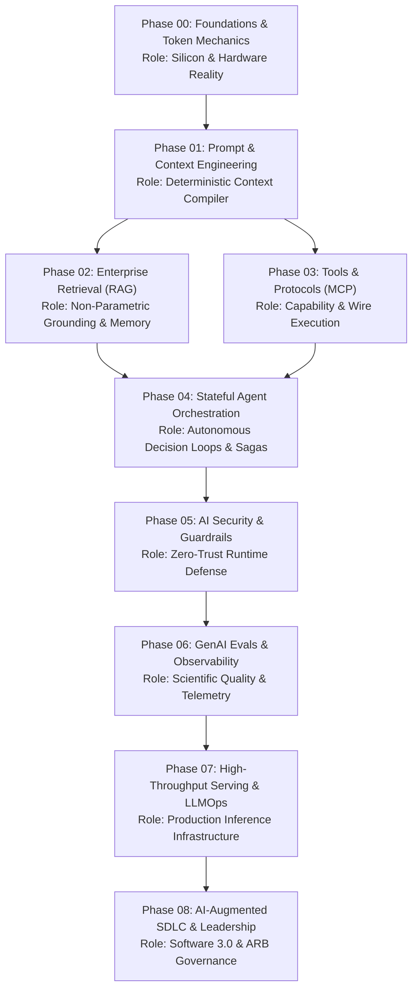
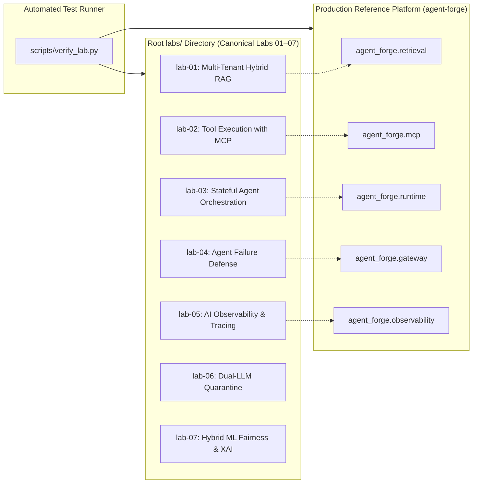
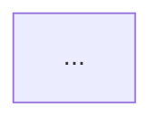
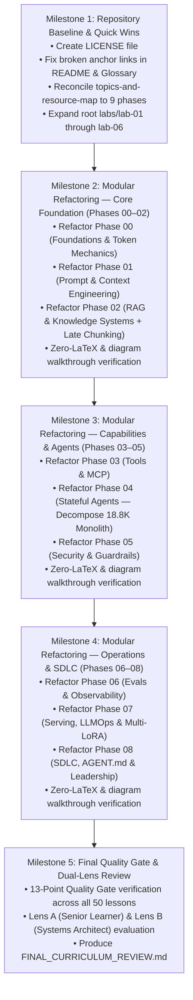

# Master Curriculum Refactoring Plan (Software 3.0)

> **Execution Mode**: PLAN MODE  
> **Target Audience**: Senior Developers, Staff Software Engineers, and Solutions Architects (7–10+ years experience)  
> **Source Baseline**: [`CURRICULUM_AUDIT.md`](./CURRICULUM_AUDIT.md)  
> **Author**: AI Curriculum Architect  
> **Date**: September 2026  
> **Repository**: `Ai_Native_Engineer`

---

## 🏛️ Executive Plan Summary

This document establishes the comprehensive, actionable blueprint for refactoring the `Ai_Native_Engineer` curriculum. It transforms the findings of [`CURRICULUM_AUDIT.md`](./CURRICULUM_AUDIT.md) and the standards in `.agents/skills/ai-curriculum-refactoring/` into a deterministic, phased implementation plan.

### Core Refactoring Tenet
> **"Do not teach less. Teach better."**  
> We preserve all systems engineering rigor, GPU hardware math, and distributed systems patterns while eliminating monolithic README bloat, raw LaTeX rendering failures, unannotated diagrams, and fragmented lab architectures.

### Primary Architectural Transformations
1. **Monolith Decomposition**: Decompose all 9 monolithic phase `README.md` files (totalling 90,289 words) into lean **Phase Orientation Hubs** linking to **50 modular, bite-sized lessons** (~800–2,500 words each).
2. **Standardized 4-Tier Depth Model**: Replace the legacy 3-tier taxonomy (`[MUST-HAVE]`, `[GOOD-TO-KNOW]`, `[KNOWLEDGE-BASE]`) with the authoritative 4-tier model: `🟢 Core` (Tier 1), `🟡 Engineering Depth` (Tier 2), `🔵 Advanced` (Tier 3), and `⚫ Deep Dive` (Tier 4).
3. **Lab Architecture Harmonization**: Unify the repository's 3 conflicting lab systems. Reconcile root `labs/lab-01` through `lab-07` with `scripts/verify_lab.py` and `agent-forge`, expanding 18-line skeletons into production-grade guided labs while preserving Phase 04 internal labs as specialized agent exercises.
4. **Complete Zero-LaTeX Conversion**: Convert all 180+ raw LaTeX delimiters (display math blocks, fractions, text tags, and summations) into pure GFM text code blocks (text fences) or standard Unicode (`→`, `Σ`, `≈`, `α`, `≤`, `≥`, `Δ`).
5. **Diagram Walkthrough Coverage**: Equip all 167 Mermaid diagrams with explicit, numbered step-by-step prose walkthroughs conforming to Quality Gate 07.
6. **Link & Resource Integrity**: Add the missing root `LICENSE` file, repair over 100 broken heading anchors, and synchronize `resources/topics-and-resource-map.md` from an obsolete 24-phase index to the canonical 9-phase (00–08) curriculum.

---

## 🗺️ Canonical Phase Sequence & Intended Roles



---

## 📚 Target Modular Lesson Breakdown (Phases 00–08)

Every phase directory will contain a standardized `README.md` (Orientation & Navigation Hub adhering to `references/phase-template.md`) and a sequence of modular lesson files adhering to `references/lesson-template.md`.

---

### Phase 00: Foundations & Token Mechanics
*Directory*: `00-foundations-and-token-mechanics/`  
*Current State*: 1 monolithic `README.md` (982 lines, 8,102 words).  
*Key Movement*: Move PEFT/LoRA fine-tuning and distillation to Phase 07 (Dynamic Multi-LoRA Serving). Keep Phase 00 tightly focused on hardware, tokenization, KV cache physics, and reasoning models.

| Lesson File | Title | Depth Tier | Target Words | Pedagogical Focus & Source Content |
|---|---|:---:|:---:|---|
| `README.md` | Phase 00 Orientation & Navigation Hub | Hub | ~450 | Overarching systems goal, learning path diagram, prerequisites, and lesson directory. |
| `01-transformer-and-hardware-physics.md` | Transformer Inference & Hardware Realities | `🟢 Core` | ~1,400 | Transformer physical reality, GPU memory bandwidth wall, VRAM hierarchy (HBM vs SRAM), arithmetic intensity, compute-bound vs memory-bound regimes. *(Extracted from 00-README Sec 1 & 3.1)*. |
| `02-tokenization-and-bpe-mechanics.md` | Tokenization & Byte-Pair Encoding (BPE) | `🟢 Core` | ~1,200 | BPE merge trees, token boundary anomalies, whitespace/punctuation sensitivity, multi-language token penalties, token economics. *(Extracted from 00-README Sec 3.2)*. |
| `03-kv-cache-vram-and-bandwidth-physics.md` | KV-Cache Mechanics & Memory Sizing Math | `🟡 Engineering Depth` | ~2,000 | Autoregressive decoding mechanics, Prefill vs. Decode phases, TTFT vs. TPS, KV-cache growth derivation, MHA vs. GQA vs. MQA, memory saturation failure modes. *(Extracted from 00-README Sec 3.3 & 3.4)*. |
| `04-test-time-compute-and-reasoning-models.md` | Test-Time Compute & Reasoning Tokens | `🔵 Advanced` | ~1,800 | Reasoning models (o3, DeepSeek-R1, Claude extended thinking), test-time compute scaling laws, hidden scratchpad billing, thinking token economics, why reasoning tokens cannot be pre-cached. *(Extracted from 00-README Sec 3.5)*. |
| `05-slms-and-quantization-mechanics.md` | Small Language Models & Model Quantization | `🟡 Engineering Depth` | ~1,600 | Small Language Models (Phi-4, Gemma 2), precision representations (FP16, BF16, FP8, INT4), quantization algorithms (AWQ, GPTQ), edge latency trade-offs. *(Extracted from 00-README Sec 3.6)*. |

*Associated Lab*: `00-foundations-and-token-mechanics/labs/capstone-token-economics-analyzer.md` (Token cost and VRAM capacity profiler).

---

### Phase 01: Prompt & Context Engineering
*Directory*: `01-prompt-and-context-engineering/`  
*Current State*: 1 monolithic `README.md` (1,276 lines, 8,952 words).  
*Key Movement*: Move Cube/MetricFlow semantic layer to Phase 02/03 enterprise data tooling. Focus Phase 01 on context compilation, budgeting, caching, and constrained decoding.

| Lesson File | Title | Depth Tier | Target Words | Pedagogical Focus & Source Content |
|---|---|:---:|:---:|---|
| `README.md` | Phase 01 Orientation & Navigation Hub | Hub | ~450 | Overarching systems goal, context AST pipeline diagram, prerequisites, and lesson directory. |
| `01-context-ast-architecture.md` | Context AST Architecture & Structured Composition | `🟢 Core` | ~1,500 | From prompt begging to compiled Context Abstract Syntax Trees (ASTs), hierarchical schemas, system/developer prompt separation, XML/Markdown boundary isolation. *(Extracted from 01-README Sec 1 & 3.1)*. |
| `02-token-budgeting-and-compaction.md` | Dynamic Token Budgeting & Compaction | `🟢 Core` | ~1,600 | 13K/32K/128K context portfolios, 4-tier compaction pipeline (drop, truncate, summarize, evict), Lost-in-the-Middle mitigation, attention concentration. *(Extracted from 01-README Sec 3.2 & 3.4)*. |
| `03-prefix-and-prompt-caching.md` | Prefix & Context Caching Mechanics | `🟡 Engineering Depth` | ~1,800 | Anthropic, Gemini, and OpenAI prompt caching architectures, 5-minute TTLs, deterministic prefix alignment, breakpoint positioning, 90% cost / 80% latency savings. *(Extracted from 01-README Sec 3.3)*. |
| `04-constrained-decoding-and-schema-fsm.md` | Constrained Decoding & Schema FSMs | `🟡 Engineering Depth` | ~1,800 | Grammar-constrained token sampling, Finite State Machine (FSM) schema decoders, strict Pydantic v2 schemas, zero-regex parsing, 100% JSON compliance. *(Extracted from 01-README Sec 3.6)*. |
| `05-mecw-and-context-rot.md` | Maximum Effective Context Window (MECW) & Context Rot | `🔵 Advanced` | ~1,600 | Effective vs advertised context length, needle-in-a-haystack degradation, multi-turn context rot, semantic entropy across 100K+ token sessions. *(Extracted from 01-README Sec 3.5)*. |

*Associated Lab*: `01-prompt-and-context-engineering/labs/capstone-context-engineering-pipeline.md` (Context AST compiler and token governor).

---

### Phase 02: Enterprise Retrieval & Knowledge Systems (RAG)
*Directory*: `02-rag-and-knowledge-systems/`  
*Current State*: 1 monolithic `README.md` (860 lines, 6,885 words).  
*Key Movement*: **Add full deep-dive lesson on Late Chunking** (currently missing from body). Sequence Cross-Encoders immediately after Hybrid Search, before GraphRAG.

| Lesson File | Title | Depth Tier | Target Words | Pedagogical Focus & Source Content |
|---|---|:---:|:---:|---|
| `README.md` | Phase 02 Orientation & Navigation Hub | Hub | ~450 | Overarching systems goal, multi-stage retrieval topology diagram, prerequisites, and lesson directory. |
| `01-document-parsing-and-chunking.md` | Document Ingestion, Parsing & Chunking Strategies | `🟢 Core` | ~1,500 | Ingestion architectures, layout-aware extraction (tables, headers), chunking strategies (fixed-window, recursive character, semantic boundary), overlap tuning. *(Extracted from 02-README Sec 3.1 & 3.2)*. |
| `02-late-chunking-deep-dive.md` | Late Chunking Mechanics & Context Preservation | `⚫ Deep Dive` | ~2,000 | **[NEW MARQUEE CONTENT]** Passing full documents through transformer encoders before pooling chunk embeddings, eliminating semantic boundary blindness, token interaction preservation. |
| `03-hybrid-search-bm25-and-hnsw.md` | Dense HNSW + Sparse BM25 Hybrid Retrieval | `🟢 Core` | ~1,800 | Semantic vector search limitations (exact IDs, SKU codes), BM25 inverted index mechanics, HNSW spatial graph traversal, dual-index query dispatch. *(Extracted from 02-README Sec 3.3, 3.4 & 3.5)*. |
| `04-reciprocal-rank-fusion-and-cross-encoders.md` | Reciprocal Rank Fusion (RRF) & Cross-Encoder Reranking | `🟡 Engineering Depth` | ~2,200 | Score distribution mismatch between sparse and dense, RRF harmonic ranking algorithm (`k=60`), cross-encoder full-attention re-scoring (`O((L_q+L_d)^2)`), two-stage retrieval pipeline. *(Extracted from 02-README Sec 3.5 & 3.8)*. |
| `05-predicate-filtering-and-acorn.md` | Predicate-Filtered Search & ACORN Architecture | `🔵 Advanced` | ~2,000 | Multi-tenant RBAC isolation, pre-filtering vs post-filtering degradation, ACORN correlation-aware graph traversal, DiskANN billion-scale vector layout. *(Extracted from 02-README Sec 3.6)*. |
| `06-graphrag-and-entity-reasoning.md` | GraphRAG & Entity Knowledge Graphs | `🔵 Advanced` | ~2,200 | Limitations of flat chunk retrieval, entity/relationship extraction, Leiden community clustering, hierarchical summaries, answering global dataset queries. *(Extracted from 02-README Sec 3.7)*. |

*Associated Labs*:  
- Canonical Lab 01: `labs/lab-01-multi-tenant-hybrid-rag.md` (Multi-tenant Hybrid RAG with RRF & ACORN isolation; verified via `scripts/verify_lab.py --lab 1`).  
- Capstone: `02-rag-and-knowledge-systems/labs/capstone-enterprise-rag-pipeline.md`.

---

### Phase 03: Tools & Model Context Protocol (MCP)
*Directory*: `03-tools-and-model-context-protocol/`  
*Current State*: 1 monolithic `README.md` (1,220 lines, 8,677 words).  
*Key Movement*: Separate protocol fundamentals from deep kernel isolation and cloud PaaS bridges.

| Lesson File | Title | Depth Tier | Target Words | Pedagogical Focus & Source Content |
|---|---|:---:|:---:|---|
| `README.md` | Phase 03 Orientation & Navigation Hub | Hub | ~450 | Overarching systems goal, MCP client-host-server topology diagram, prerequisites, and lesson directory. |
| `01-function-calling-wire-protocol.md` | Function Calling Primitives & Wire Protocol | `🟢 Core` | ~1,500 | Tool invocation mechanics, JSON Schema parameter definitions, model decision step vs execution step, error serialization, tool result formatting. *(Extracted from 03-README Sec 3.1)*. |
| `02-mcp-architecture-and-transports.md` | Model Context Protocol (MCP) Architecture & Transports | `🟢 Core` | ~2,000 | Linux Foundation MCP standard, Host-Client-Server topology, `stdio` transport, Streamable HTTP/SSE transport, JSON-RPC 2.0 message schemas, Stateless MCP 2026. *(Extracted from 03-README Sec 3.2)*. |
| `03-abac-policy-and-financial-idempotency.md` | ABAC Policy Engines & Financial Idempotency | `🟡 Engineering Depth` | ~2,200 | Attribute-Based Access Control (ABAC), policy engines for high-risk tools, cryptographic idempotency keys (`SHA-256(Session + Turn + Args)`), two-phase tool execution. *(Extracted from 03-README Sec 3.5)*. |
| `04-zero-trust-tool-sandboxing.md` | Zero-Trust Tool Sandboxes & MicroVMs | `🔵 Advanced` | ~2,000 | Execution security, Linux namespaces, seccomp filters, cgroups, MicroVMs (Firecracker, gVisor), ephemeral filesystems, network egress containment. *(Extracted from 03-README Sec 3.3)*. |
| `05-enterprise-paas-and-copilot-studio-bridge.md` | Enterprise PaaS & Copilot Studio MCP Bridge | `🔵 Advanced` | ~1,800 | Bridging low-code conversational copilots (Microsoft Copilot Studio, Power Platform) to cloud PaaS microservices over SSE MCP with Entra ID authentication. *(Extracted from 03-README Sec 3.4)*. |

*Associated Labs*:  
- Canonical Lab 02: `labs/lab-02-tool-execution-with-mcp.md` (Typed MCP Tool Server with ABAC Policy Engine; verified via `scripts/verify_lab.py --lab 2`).  
- Capstone: `03-tools-and-model-context-protocol/labs/capstone-mcp-tool-server.md`.

---

### Phase 04: Stateful Agent Orchestration
*Directory*: `04-agentic-systems-and-orchestration/`  
*Current State*: 1 massive monolithic `README.md` (2,237 lines, 18,820 words — Extreme Bloat!).  
*Key Movement*: Decompose into 6 modular, high-signal lessons. Separate ReAct loops, CodeAct, WAL state engines, sagas, memory tiers, and multi-agent protocols.

| Lesson File | Title | Depth Tier | Target Words | Pedagogical Focus & Source Content |
|---|---|:---:|:---:|---|
| `README.md` | Phase 04 Orientation & Navigation Hub | Hub | ~450 | Overarching systems goal, stateful agent lifecycle diagram, prerequisites, and lesson directory. |
| `01-agentic-loop-engineering-and-react.md` | Loop Engineering & The ReAct Pattern | `🟢 Core` | ~1,800 | Bounded ReAct loops (Thought → Action → Observation), action hashing, ring-buffer loop detection, progressive budget decay, epistemic stall mitigation. *(Extracted from 04-README Sec 1, 2, 3.1 & 3.2)*. |
| `02-code-as-action-codeact.md` | Code-as-Action (CodeAct) vs JSON Calling | `🟡 Engineering Depth` | ~2,000 | CodeAct paradigm, single-turn expressive Python scripting vs 10-turn JSON ping-pong, AST validation, restricted builtins, safe code runner sandbox. *(Extracted from 04-README Sec 5.2)*. |
| `03-event-sourced-wal-and-session-state.md` | Event-Sourced Write-Ahead Log (WAL) & State Hydration | `🟡 Engineering Depth` | ~2,200 | Session state management, EventStore WAL appending, crash rehydration from logs, deterministic replay, human-in-the-loop (HITL) interrupt/resume. *(Extracted from 04-README Sec 3.3 & 3.4)*. |
| `04-distributed-agent-sagas-and-compensation.md` | Distributed Agent Sagas & Compensating Actions | `🔵 Advanced` | ~2,200 | Multi-step external mutations, distributed Saga pattern, forward execution vs backward rollback, two-phase commits, ledger exception recovery. *(Extracted from 04-README Sec 4.2)*. |
| `05-hierarchical-agent-memory-systems.md` | 4-Tier Agent Memory Systems | `🟡 Engineering Depth` | ~2,200 | 4-tier taxonomy (Working, Short-Term, Long-Term Semantic/Episodic, MaaS), Ebbinghaus memory decay curves, semantic retrieval for memory, GDPR crypto-shredding. *(Extracted from 04-README Sec 3.3 & Lab 5)*. |
| `06-multi-agent-swarms-and-a2a-protocol.md` | Multi-Agent Coordination & The A2A Protocol | `🔵 Advanced` | ~2,500 | Supervisor-worker topologies vs peer swarms, Google Agent2Agent (A2A) protocol, dynamic specialist handoffs, envelope validation, AG-UI protocol. *(Extracted from 04-README Sec 4.1 & 5.1)*. |

*Associated Labs*:  
- Canonical Lab 03: `labs/lab-03-stateful-agent-orchestration.md` (Stateful Agent with WAL EventStore & Crash Replay; verified via `scripts/verify_lab.py --lab 3`).  
- Canonical Lab 04: `labs/lab-04-agent-failure-defense.md` (TokenBucket Limiter & Loop Recovery; verified via `scripts/verify_lab.py --lab 4`).  
- Phase 04 Sub-Labs: Retain `lab1` (HITL), `lab2` (A2A Swarm), `lab3` (Infinite Loops), `lab4` (Saga), `lab5` (Memory), `lab6` (Multimodal) as specialized agent exercises.  
- Capstone: `04-agentic-systems-and-orchestration/labs/capstone-code-review-engine.md`.

---

### Phase 05: AI Security & Guardrails
*Directory*: `05-ai-security-and-guardrails/`  
*Current State*: 1 monolithic `README.md` (1,259 lines, 8,347 words).  
*Key Movement*: Align algorithmic fairness and regulatory compliance (EU AI Act, Fairlearn) with evaluation metrics in Phase 06.

| Lesson File | Title | Depth Tier | Target Words | Pedagogical Focus & Source Content |
|---|---|:---:|:---:|---|
| `README.md` | Phase 05 Orientation & Navigation Hub | Hub | ~450 | Overarching systems goal, zero-trust perimeter defense diagram, prerequisites, and lesson directory. |
| `01-owasp-genai-threat-modeling.md` | OWASP GenAI Top 10 & Threat Modeling | `🟢 Core` | ~1,500 | Probabilistic runtime security, Harvard vs Von Neumann architecture duality, OWASP GenAI Top 10 (2025/2026), confused deputy traps, IP prompt inversion. *(Extracted from 05-README Sec 1, 2 & 3.1)*. |
| `02-prompt-injection-and-canary-tokens.md` | Direct & Indirect Prompt Injection Defenses | `🟢 Core` | ~1,800 | Direct jailbreaks, indirect injection via ingested documents, cryptographic canary tokens, active boundary markers, real-time leakage detection. *(Extracted from 05-README Sec 3.2 & 3.5)*. |
| `03-dual-llm-privilege-quarantine.md` | Dual-LLM Privilege Quarantine Architecture | `🟡 Engineering Depth` | ~2,200 | Untrusted data boundary, unprivileged ingestion LLM vs privileged execution LLM, structured data extraction without code execution, zero-trust perimeter. *(Extracted from 05-README Sec 3.4)*. |
| `04-pii-vaults-and-semantic-firewalls.md` | PII Vaults & Semantic Guardrails | `🟡 Engineering Depth` | ~1,800 | Zero-knowledge PII tokenization vaults, deterministic surrogate replacement, multi-tier guardrail middleware (NeMo / Llama Guard), input/output filters. *(Extracted from 05-README Sec 3.3 & 3.5)*. |
| `05-algorithmic-fairness-and-eu-ai-act.md` | Algorithmic Fairness & EU AI Act Audits | `🔵 Advanced` | ~2,200 | Regulated decision pipelines (credit, hiring), EU AI Act GPAI transparency, Disparate Impact Ratio (`DIR >= 0.80`), Demographic Parity, Fairlearn audits. *(Extracted from 05-README Sec 3.6)*. |

*Associated Labs*:  
- Canonical Lab 06: `labs/lab-06-dual-llm-quarantine-guardrails.md` (Dual-LLM Privilege Quarantine Architecture; verified via `scripts/verify_lab.py --lab 6`).  
- Capstone: `05-ai-security-and-guardrails/labs/capstone-security-guardrails.md`.

---

### Phase 06: GenAI Evals & Observability
*Directory*: `06-evals-and-observability/`  
*Current State*: 1 monolithic `README.md` (878 lines, 6,686 words).  
*Key Movement*: Formalize the Hamel Husain 3-level evaluation framework and unify OpenTelemetry GenAI semantic conventions across all agents and gateways.

| Lesson File | Title | Depth Tier | Target Words | Pedagogical Focus & Source Content |
|---|---|:---:|:---:|---|
| `README.md` | Phase 06 Orientation & Navigation Hub | Hub | ~450 | Overarching systems goal, automated evaluation flywheel diagram, prerequisites, and lesson directory. |
| `01-three-levels-of-evals-framework.md` | The Three Levels of Evals (Hamel Husain Framework) | `🟢 Core` | ~1,500 | Replacing vibe checks, Level 1: Deterministic unit tests & regex assertions, Level 2: Model-based evaluation, Level 3: Online telemetry & human feedback. *(Extracted from 06-README Sec 1, 2 & 3)*. |
| `02-llm-as-a-judge-and-binary-rubrics.md` | LLM-as-a-Judge Calibration & Binary Rubrics | `🟢 Core` | ~1,800 | Binary pass/fail rubrics, why 1–5 Likert scales fail, pairwise judge evaluation, position bias mitigation, Cohen's kappa judge agreement. *(Extracted from 06-README Sec 3.2)*. |
| `03-trajectory-fsm-and-golden-datasets.md` | Multi-Turn Trajectory Evals & Golden Datasets | `🟡 Engineering Depth` | ~2,000 | Agent trajectory validation, state transition FSM assertions, efficiency ratios, golden dataset curation, synthetic test generation via frontier teacher models. *(Extracted from 06-README Sec 4 & 5)*. |
| `04-opentelemetry-genai-observability.md` | OpenTelemetry GenAI Semantic Conventions | `🟡 Engineering Depth` | ~2,200 | OpenTelemetry `gen_ai.*` semantic conventions, distributed tracing across multi-hop reasoning, span events for tool calls, latency/token cost attribution. *(Extracted from 06-README Sec 7)*. |
| `05-explainable-ai-and-drift-detection.md` | Explainable AI (SHAP) & Drift Detection | `🔵 Advanced` | ~2,200 | TreeSHAP local feature attribution, ECOA adverse action notices, drift detection (Population Stability Index - PSI), prompt drift, vendor silent updates. *(Extracted from 06-README Sec 6 & 8)*. |

*Associated Labs*:  
- Canonical Lab 05: `labs/lab-05-ai-observability-tracing.md` (OpenTelemetry GenAI Distributed Tracing; verified via `scripts/verify_lab.py --lab 5`).  
- Canonical Lab 07: `labs/lab-07-hybrid-ml-fairness-and-explainability.md` (Fairlearn & SHAP Credit Decisioning; verified via `scripts/verify_lab.py --lab 7`).  
- Capstone: `06-evals-and-observability/labs/capstone-cicd-evaluation-pipeline.md`.

---

### Phase 07: High-Throughput Serving & LLMOps
*Directory*: `07-production-deployment-and-llmops/`  
*Current State*: 1 monolithic `README.md` (1,696 lines, 12,086 words — Extreme Bloat!).  
*Key Movement*: Integrate RadixAttention trie caching alongside vLLM continuous batching; incorporate dynamic multi-LoRA serving and PEFT fine-tuning mechanics.

| Lesson File | Title | Depth Tier | Target Words | Pedagogical Focus & Source Content |
|---|---|:---:|:---:|---|
| `README.md` | Phase 07 Orientation & Navigation Hub | Hub | ~450 | Overarching systems goal, production serving gateway topology diagram, prerequisites, and lesson directory. |
| `01-resilient-ai-gateways-and-rate-limiting.md` | Resilient Multi-Provider AI Gateways | `🟢 Core` | ~2,000 | Multi-provider fallback cascades, circuit breakers, thundering herd collapse prevention, Token-Bucket TPM/RPM rate limiters, SLA triads (TTFT, TPS). *(Extracted from 07-README Sec 1, 2, 3.2 & 3.4)*. |
| `02-dual-tier-caching-and-batch-apis.md` | Dual-Tier Caching & Asynchronous Batch APIs | `🟡 Engineering Depth` | ~1,800 | Exact prefix caching + semantic vector caching, semantic similarity thresholds, cache invalidation, asynchronous Batch APIs (50% cost discount). *(Extracted from 07-README Sec 3.3 & 3.5)*. |
| `03-vllm-continuous-batching-and-radixattention.md` | Continuous Batching, PagedAttention & RadixAttention | `⚫ Deep Dive` | ~2,500 | Serving engine internals, PagedAttention virtual memory block tables, iteration-level continuous batching, SGLang RadixAttention trie prefix caching. *(Extracted from 07-README Sec 3.1 + ADR-004)*. |
| `04-dynamic-multi-lora-adapter-serving.md` | Dynamic Multi-LoRA Adapter Serving (S-LoRA) | `🔵 Advanced` | ~2,200 | Serving 100+ tenant adapters on a single frozen base model, low-rank matrices (`W = W0 + B · A`), S-LoRA memory pooling, dynamic adapter routing. *(Extracted from 07-README Sec 3.6 + Phase 00 PEFT)*. |
| `05-edge-ai-and-client-side-inference.md` | Edge AI & Client-Side Inference | `🔵 Advanced` | ~1,800 | On-device SLM execution, WebLLM / WebGPU limitations, VRAM capability probing, ONNX Runtime, hybrid device-cloud routing. *(Extracted from 07-README Sec 3.1)*. |

*Associated Lab*: `07-production-deployment-and-llmops/labs/capstone-production-ai-gateway.md` (Production Resilient AI Gateway with Token Bucket Limiter).

---

### Phase 08: AI-Augmented SDLC & Leadership
*Directory*: `08-ai-augmented-sdlc-and-leadership/`  
*Current State*: 1 monolithic `README.md` (1,633 lines, 11,734 words — Extreme Bloat!).  
*Key Movement*: Focus on Software 3.0 engineering leadership, machine-readable repository contracts (`AGENT.md`), and Architecture Review Board governance.

| Lesson File | Title | Depth Tier | Target Words | Pedagogical Focus & Source Content |
|---|---|:---:|:---:|---|
| `README.md` | Phase 08 Orientation & Navigation Hub | Hub | ~450 | Overarching systems goal, Software 3.0 SDLC lifecycle diagram, prerequisites, and lesson directory. |
| `01-software-30-and-the-karpathy-continuum.md` | Software 3.0 & The Karpathy Continuum | `🟢 Core` | ~1,400 | From Software 1.0 (imperative) to 2.0 (weights) to 3.0 (reasoning microservices), developer role shift from synthesizer to specification author and arbiter. *(Extracted from 08-README Sec 1 & 2)*. |
| `02-agentic-coding-assistants-and-the-trust-gap.md` | Agentic Coding Assistants & The Trust Gap | `🟢 Core` | ~1,800 | The Big Seven matrix (Claude Code CLI, Cursor, Windsurf, Copilot, etc.), the enterprise Trust Gap (90% adoption vs 29% trust), developer velocity vs code atrophy. *(Extracted from 08-README Sec 4 & 5)*. |
| `03-machine-readable-codebase-contracts-agent-md.md` | Machine-Readable Repository Contracts (`AGENT.md`) | `🟡 Engineering Depth` | ~2,000 | Repository context hierarchies, writing deterministic `AGENT.md` contracts, token budget limits for coding agents, anti-hallucination codebase boundaries. *(Extracted from 08-README Sec 6)*. |
| `04-spec-driven-development-and-pr-automation.md` | Spec-Driven Development (SDD) & PR Verification | `🟡 Engineering Depth` | ~2,200 | Spec-driven code generation, automated Architecture Decision Record (ADR) generation, AI PR review bots, test assertion gates, 14-day rework rate metric. *(Extracted from 08-README Sec 7 & 8)*. |
| `05-ai-architecture-review-board-governance.md` | AI Architecture Review Board (ARB) Governance | `🔵 Advanced` | ~2,000 | Establishing an enterprise AI ARB, 10-point production readiness review rubric, technical debt containment, engineering team transition playbooks. *(Extracted from 08-README Sec 9)*. |

*Associated Lab*: `08-ai-augmented-sdlc-and-leadership/labs/capstone-ai-native-repository.md` (AI-Native Repository with `AGENT.md` and automated PR verification).

---

## 🧪 Harmonized Hands-On Practice Labs Architecture

The audit revealed a severe three-way disconnect in how practice labs are organized. This plan establishes a single, coherent, verified lab architecture:



### 1. Canonical Labs Mapping (Root `labs/`)
The root `labs/` directory hosts the 7 canonical hands-on labs tested by `scripts/verify_lab.py`:

| Lab ID | File Path | Phase Alignment | Tested Module in `agent-forge` | Verification Command |
|:---:|:---|:---:|:---|:---|
| **01** | `labs/lab-01-multi-tenant-hybrid-rag.md` | Phase 02 | `agent_forge.retrieval.hybrid_engine` | `python scripts/verify_lab.py --lab 1` |
| **02** | `labs/lab-02-tool-execution-with-mcp.md` | Phase 03 | `agent_forge.mcp.policy_engine` | `python scripts/verify_lab.py --lab 2` |
| **03** | `labs/lab-03-stateful-agent-orchestration.md` | Phase 04 | `agent_forge.runtime.event_store` | `python scripts/verify_lab.py --lab 3` |
| **04** | `labs/lab-04-agent-failure-defense.md` | Phase 04 / 07 | `agent_forge.gateway.rate_limiter` | `python scripts/verify_lab.py --lab 4` |
| **05** | `labs/lab-05-ai-observability-tracing.md` | Phase 06 | `agent_forge.observability.tracer` | `python scripts/verify_lab.py --lab 5` |
| **06** | `labs/lab-06-dual-llm-quarantine-guardrails.md` | Phase 05 | Untrusted isolation boundary | `python scripts/verify_lab.py --lab 6` |
| **07** | `labs/lab-07-hybrid-ml-fairness-and-explainability.md` | Phase 05 / 06 | Regulated credit decisioning | `python scripts/verify_lab.py --lab 7` |

*Remediation Action*: Expand the existing 18-line skeletons (`lab-01` to `lab-06`) into full enterprise lab guides matching the depth and quality of `lab-07`.

### 2. Specialized Agent Exercises (`04-agentic-systems-and-orchestration/labs/`)
Retain and preserve Phase 04's internal labs as specialized advanced agent exercises:
- `lab1-stateful-agent-hitl.md`: LangGraph Human-in-the-Loop approval graph.
- `lab2-multi-agent-swarm.md`: Agent2Agent (A2A) multi-agent swarm handoffs.
- `lab3-infinite-loops.md`: SHA-256 tool cycle detection and budget decay.
- `lab4-saga-pattern.md`: Distributed Saga pattern with compensating rollbacks.
- `lab5-agent-memory-system.md`: 4-tier memory hierarchy with Ebbinghaus decay.
- `lab6-multimodal-agent.md`: High-resolution document tiling and visual injection quarantine.

### 3. Root `README.md` Table Reconnection
Update lines 150–161 of root `README.md` to point to the canonical `labs/lab-01` through `labs/lab-07` implementations, while adding a dedicated link to Phase 04's specialized agent exercises.

---

## 🚫 Zero-LaTeX Conversion Strategy

Quality Gate 13 strictly prohibits raw LaTeX math delimiters (double-dollar math blocks, inline dollar math, LaTeX fractions, text blocks, and summation symbols). All mathematical formulas must be converted to standard Unicode or fenced code blocks:

### Conversion Patterns

| Legacy Math Pattern | GFM Unicode / Fenced Block Replacement (Target) |
|---|---|
| `DIR = P(Y_hat=1 | unprivileged) / P(Y_hat=1 | privileged)` (formerly raw LaTeX formula) | ```text<br>DIR = P(Y_hat=1 | A=unprivileged) / P(Y_hat=1 | A=privileged)<br>``` |
| `RRF_Score(d) = sum(1 / (k + r_m(d)))` (formerly raw LaTeX sum/fraction) | ```text<br>RRF_Score(d) = Σ [ 1 / (k + rank_m(d)) ]  for each ranking m in M<br>``` |
| `TPS = N_output_tokens / (T_total - TTFT)` (formerly raw LaTeX fraction) | ```text<br>TPS = N_output_tokens / (T_total - TTFT)<br>``` |
| `Cost = sum(Input Tokens * P_in) + ...` (formerly raw LaTeX sum) | ```text<br>Total Cost = Σ (Input Tokens × P_in) + Σ (Output Tokens × P_out) + Tool Compute Cost<br>``` |
| `Delta_DP <= 0.10` (formerly raw LaTeX Delta / le) | `Δ_DP ≤ 0.10` |
| `Delta_EO <= 0.05` (formerly raw LaTeX Delta / le) | `Δ_EO ≤ 0.05` |
| Legacy `$K$` tokens, `$N$` elements, `$O(N)$` | `K` tokens, `N` elements, `O(N)` |
| `Temp = 0.0` (formerly raw LaTeX text format) | `Temperature = 0.0` |
| `MatchCheck{"Discrepancy > \$5,000?"}` | `MatchCheck{"Discrepancy > $5,000?"}` (unquoted/unescaped standard label) |

---

## 📊 Diagram & Walkthrough Standardization Plan

Every one of the 167 Mermaid diagrams will receive an explicit, numbered step-by-step prose walkthrough placed immediately after the diagram code block:

### Walkthrough Specification Pattern:
```markdown


#### Diagram Walkthrough:
1. **[Step 1 Title]**: Explain the initiating trigger, payload schema, or entry criteria.
2. **[Step 2 Title]**: Detail the transformation, model forward pass, or network request.
3. **[Step 3 Title]**: Describe the decision boundary, conditional branch, or policy validation.
4. **[Step 4 Title]**: Detail the persistent state write, WAL append, or final output delivery.
```

---

## 🔗 Link, Anchor & File Integrity Remediation

| Issue ID | File Location | Root Cause | Planned Fix |
|:---|:---|:---|:---|
| **LINK-01** | `README.md:9` | Links to `LICENSE`, which does not exist in root. | Add standard MIT `LICENSE` file to repository root. |
| **LINK-02** | `README.md:43-50` | TOC anchors (e.g. `#1--technical-interview...`) mismatch section numbers (e.g. `5.1`). | Re-align all TOC anchor slugs in `README.md`. |
| **LINK-03** | `ai-engineering-glossary-by-practice.md` | Double-hyphens in slugs (e.g. `#2-prompt--context-engineering`). | Normalize all internal heading links to single hyphens matching GitHub slug rules. |
| **LINK-04** | `ai-platform-and-agent-infrastructure-roadmap.md` | Legacy `#phase-*` anchor references mismatch actual headings. | Update all anchor links to match target section headings. |
| **LINK-05** | `resources/topics-and-resource-map.md` | Indexes 24 phases (Phases 0–23) instead of 9 phases. | Restructure to index Phases 00–08, aligning exactly with the core syllabus. |
| **LINK-06** | `architecture/enterprise-ai-system-designs.md` | Formerly `10-enterprise-ai-system-designs.md`. | Renamed to generic filename and updated all repository links. |

---

## 🔄 Content Split, Merge & Relocation Matrix

To eliminate cross-phase duplication and prevent concepts from appearing before their prerequisites:

| Topic | Current Location | Problem | Target Refactored Location | Action |
|---|---|---|---|:---:|
| **PEFT / LoRA Fine-Tuning** | Phase 00 (Sec 3.7) | Too early; cognitive overload before prompt engineering. | Phase 07 (`04-dynamic-multi-lora-adapter-serving.md`) | **MOVE & MERGE** |
| **Late Chunking** | Phase 02 (Overview badge only) | Advertised as marquee topic but missing from body. | Phase 02 (`02-late-chunking-deep-dive.md`) | **WRITE NEW** |
| **RadixAttention Trie Caching** | Root ADR-004 & INCIDENT-001 | Featured in ADRs but omitted from phase instructions. | Phase 07 (`03-vllm-continuous-batching-and-radixattention.md`) | **INTEGRATE** |
| **Cube / MetricFlow Semantic Layer** | Phase 01 (Sec 3.7) | Distracts from context window compaction and schema FSMs. | Phase 02 (Advanced data tooling) or Phase 03 tools | **MOVE** |
| **Algorithmic Fairness (Fairlearn)** | Phase 05 (Sec 3.6) | Separated from evaluation and explainability in Phase 06. | Cross-reference Phase 05 lesson to Phase 06 Evals & Lab 07 | **REORGANIZE** |
| **Prompt Caching** | Phases 00, 01, 06, 07 | Duplicated in 4 different phases without single home. | Phase 01 (`03-prefix-and-prompt-caching.md`) is authoritative; others reference it. | **CONSOLIDATE** |
| **OpenTelemetry GenAI Spans** | Phases 03, 04, 05, 06, 07 | Mentioned in 5 phases before formal teaching in Phase 06. | Phase 06 (`04-opentelemetry-genai-observability.md`) is authoritative; others link to it. | **CONSOLIDATE** |

---

## 🛠️ Phased Execution & Milestone Roadmap

Following the disciplined iterative playbook (`Audit → Plan → Refactor → Validate`), execution proceeds across 4 controlled milestones:



### Milestone Details

#### Milestone 1: Repository Baseline & Quick Wins
- Create missing `LICENSE` file.
- Re-align all broken TOC and anchor links across `README.md` and `ai-engineering-glossary-by-practice.md`.
- Rewrite `resources/topics-and-resource-map.md` to index the 9 canonical curriculum phases.
- Expand `labs/lab-01` through `labs/lab-06` into complete, production-ready lab specifications matching `lab-07` and verified by `scripts/verify_lab.py`.
- Update root `README.md` lab showcase table.

#### Milestone 2: Core Foundation Refactoring (Phases 00–02)
- Refactor Phase 00 into 5 modular lessons + orientation README. Transfer LoRA fine-tuning to Phase 07.
- Refactor Phase 01 into 5 modular lessons + orientation README. Eliminate LaTeX, add walkthroughs.
- Refactor Phase 02 into 6 modular lessons + orientation README. Author new `02-late-chunking-deep-dive.md`.
- Produce refactoring reports for Phases 00, 01, and 02.

#### Milestone 3: Capabilities & Agents Refactoring (Phases 03–05)
- Refactor Phase 03 into 5 modular lessons + orientation README.
- Refactor Phase 04, decomposing the 18,820-word monolith into 6 modular lessons + orientation README.
- Refactor Phase 05 into 5 modular lessons + orientation README.
- Produce refactoring reports for Phases 03, 04, and 05.

#### Milestone 4: Operations & SDLC Refactoring (Phases 06–08)
- Refactor Phase 06 into 5 modular lessons + orientation README. Standardize OTel GenAI telemetry.
- Refactor Phase 07 into 5 modular lessons + orientation README. Integrate RadixAttention and dynamic multi-LoRA serving.
- Refactor Phase 08 into 5 modular lessons + orientation README.
- Produce refactoring reports for Phases 06, 07, and 08.

#### Milestone 5: Final Validation & Dual-Lens Review
- Run repository in **VALIDATION MODE**.
- Inspect all 50 refactored lessons against the 13-point quality checklist.
- Perform Dual-Lens Review (Lens A: AI Learner; Lens B: Systems Architect).
- Produce `FINAL_CURRICULUM_REVIEW.md`.

---

## 🏁 Conclusion

`CURRICULUM_REFACTORING_PLAN.md` provides an unambiguous, battle-tested blueprint to transform the `Ai_Native_Engineer` repository into the definitive masterclass for senior software engineers entering AI systems engineering. 

With this plan approved, refactoring can proceed phase-by-phase with zero risk of regression, maintaining maximum technical depth while delivering clean, modular, production-ready curriculum content.
