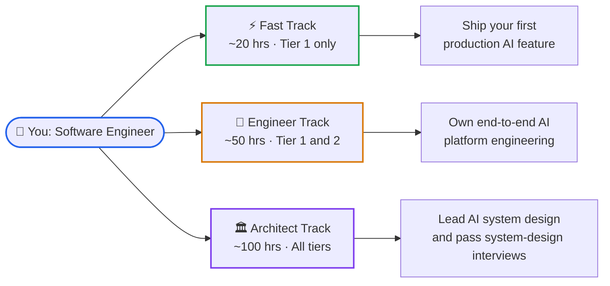
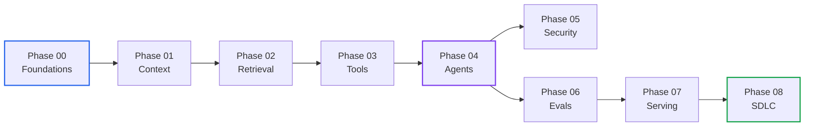

# Learning Paths: Senior Engineer to AI Engineer

> You are a working software engineer who knows software well but is new to AI engineering.
> Pick the track that fits your time budget and goal. Every track builds on the same 9 phases.

---

## 🗺️ The Three Tracks at a Glance

---

## ⚡ Fast Track — ~20 hours

**Goal**: understand enough to ship a production AI feature and avoid the most common mistakes.
**What you read**: Tier 1 (`🟢 Core`) lessons only. Skip every `🟡`, `🔵`, and `⚫` lesson.

| Phase | Core Lesson to Read | What You Unlock |
|---|---|---|
| [00 — Foundations](./00-foundations-and-token-mechanics/README.md) | Tokens and Tokenization | Know what you pay for and why context has a hard limit. |
| [01 — Context Engineering](./01-prompt-and-context-engineering/README.md) | Prompt Structure and In-Context Learning | Write prompts that produce reliable JSON, not random prose. |
| [02 — Retrieval](./02-rag-and-knowledge-systems/README.md) | Embeddings + Hybrid Search | Attach your company's knowledge to a model without retraining. |
| [03 — Tools and MCP](./03-tools-and-model-context-protocol/README.md) | MCP Wire Protocol Basics | Let a model call your APIs safely. |
| [04 — Agents](./04-agentic-systems-and-orchestration/README.md) | Bounded ReAct Loops | Build an agent that does not loop forever or lose memory on a crash. |
| [05 — Security](./05-ai-security-and-guardrails/README.md) | Prompt Injection and Dual-LLM Quarantine | Stop malicious inputs from hijacking your tools. |
| [06 — Evals](./06-evals-and-observability/README.md) | LLM-as-a-Judge Basics | Know if your system is getting better or worse after each change. |

**You are done when you can**: explain to a teammate why keyword search alone fails for an AI chat feature, scaffold a RAG endpoint with a threshold gate, and write an eval that catches hallucinations.

---

## 🔧 Engineer Track — ~50 hours

**Goal**: own and operate a full production AI platform including retrieval, agents, evals, and observability.
**What you read**: Tier 1 (`🟢 Core`) and Tier 2 (`🟡 Engineering Depth`) lessons.

Everything in the Fast Track, plus:

| Phase | Additional Depth Lessons | What You Unlock |
|---|---|---|
| [00 — Foundations](./00-foundations-and-token-mechanics/README.md) | KV Cache Memory + Quantization | Budget VRAM before you choose a model and a serving configuration. |
| [01 — Context Engineering](./01-prompt-and-context-engineering/README.md) | Constrained Grammar Decoding + Context Pruning | Force valid JSON output and prune token budgets under pressure. |
| [02 — Retrieval](./02-rag-and-knowledge-systems/README.md) | Cross-Encoder Reranking + GraphRAG | Hit the precision-recall ceiling for enterprise knowledge systems. |
| [03 — Tools and MCP](./03-tools-and-model-context-protocol/README.md) | ABAC Policy Gates + Tool Idempotency | Lock down which tools the model can call and in which conditions. |
| [04 — Agents](./04-agentic-systems-and-orchestration/README.md) | Event-Sourced WAL + Crash Replay | Guarantee an agent can resume from any failure point. |
| [05 — Security](./05-ai-security-and-guardrails/README.md) | Automated Red-Teaming | Run adversarial tests in CI before shipping. |
| [06 — Evals](./06-evals-and-observability/README.md) | OpenTelemetry GenAI Spans + CI Gates | Wire evals into your pipeline so regressions block deployment. |
| [07 — Serving](./07-production-deployment-and-llmops/README.md) | Continuous Batching + AWQ Quantization | Cut serving cost while keeping latency inside SLA. |

**You are done when you can**: design a RAG system with hybrid search and a reranking stage, explain KV cache eviction, run an LLM-as-a-judge eval in CI, and size a vLLM deployment for a given throughput target.

---

## 🏛️ Architect Track — ~100 hours

**Goal**: lead AI system design, make architectural trade-off decisions under pressure, and pass principal-level system design interviews.
**What you read**: all tiers including `🔵 Advanced` and `⚫ Deep Dive` lessons.

Everything in the Engineer Track, plus all Deep Dive and Advanced lessons:

| Phase | Deep Dive Area | What You Unlock |
|---|---|---|
| [00 — Foundations](./00-foundations-and-token-mechanics/README.md) | Attention Mechanics + Hardware Physics | Explain FLOP counts, memory bandwidth, and speculative decoding from first principles. |
| [02 — Retrieval](./02-rag-and-knowledge-systems/README.md) | HNSW Graph Internals | Tune ANN search parameters for recall vs. latency trade-offs. |
| [04 — Agents](./04-agentic-systems-and-orchestration/README.md) | Multi-Agent Supervisors + Distributed Rollback | Design a multi-domain agent system with saga-pattern rollback. |
| [07 — Serving](./07-production-deployment-and-llmops/README.md) | PagedAttention + Speculative Decoding Internals | Understand how vLLM schedules requests and where throughput ceilings come from. |
| [08 — SDLC](./08-ai-augmented-sdlc-and-leadership/README.md) | All 7 lessons | Run spec-driven AI development, agentic PR review gates, and AI governance. |

**You are done when you can**: design a 10M-document grounded search system under a p99 latency budget, justify every architectural layer in a trade-off table, and run a compliance audit of an AI platform.

---

## 🎯 Persona Entry Points

Not sure where to start? Pick your background:

| Background | Recommended Starting Point |
|---|---|
| **Backend / API Engineer** | Start at Phase 00. Follow the Fast Track, then extend to Engineer Track. |
| **Data / ML Engineer** | Start at Phase 02 (Retrieval). You already know embeddings — focus on RAG architecture and evaluation. |
| **SRE / Platform Engineer** | Phase 06 (Evals and Observability) and Phase 07 (Serving) are your highest-ROI phases. |
| **Security Engineer** | Start at Phase 05 (AI Security). Then trace back through Phase 03 (MCP tools) to understand the attack surface. |
| **Engineering Manager / Tech Lead** | Read the Tier 1 lessons from each phase in order. Phase 08 (SDLC) is required for your role. |

---

## 📐 Phase Dependency Chain

Reading phases out of order is possible but will leave gaps. Here is the minimal dependency chain:

**Short circuit rules**:
- SREs and Platform Engineers can jump directly to Phase 06 → 07 with only Phase 00 as prep.
- Security Engineers can jump to Phase 05 with Phase 00 + Phase 03 as prep.

---

## 🧭 Navigation

- **[AI Engineer Roadmap](./AI_ENGINEER_ROADMAP.md)** — Full conceptual map of the AI engineering discipline.
- **[Phase 00: Foundations](./00-foundations-and-token-mechanics/README.md)** — Start here for most tracks.
- **[Labs 01–07](./labs/)** — Hands-on verification harness for every phase.
