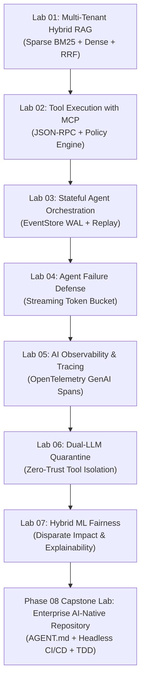

# 🎓 Learning & Practicing AI Engineering with Autonomous Agents
> **Interactive Multi-Agent Learning Harness for Senior Developers & AI Tech Leads**  
> Supports **Google Antigravity**, **Claude Code**, and **GitHub Copilot**.
>
> [← Master Curriculum & Architecture (README.md)](./README.md) • [🗺️ Full AI Engineer Roadmap](./AI_ENGINEER_ROADMAP.md) • [📖 Glossary by Practice](./ai-engineering-glossary-by-practice.md)

This repository is designed not merely to be read, but to be **experienced interactively** alongside AI pair-programming agents. By using the pre-configured agents, skills, and tools in this repo, you can practice production AI systems engineering hands-on.

---

## ⚡ The Tri-Agent Toolkit

| Feature | Google Antigravity (`agy`) | Claude Code CLI (`claude`) | GitHub Copilot (`@copilot`) |
|:---|:---|:---|:---|
| **Configuration File** | [GEMINI.md](./GEMINI.md) + [.agents/](./.agents/) | [CLAUDE.md](./CLAUDE.md) + [.claude/](./.claude/) | [.github/copilot-instructions.md](./.github/copilot-instructions.md) |
| **Modular Skills** | `.agents/skills/*/SKILL.md` | Skill system / Prompts | Reusable `.github/prompts/*.md` |
| **Interactive Commands** | Automatic skill activation | `/practice`, `/verify-lab`, `/refresh-content`, `/quiz` | Reusable Prompt Templates |
| **Testing Harness** | `python scripts/verify_lab.py --all` | `python scripts/verify_lab.py --all` | Terminal execution |
| **Web Search Integration** | Native `search_web` tool | Web search integration | Web search extensions |

---

## 🤖 Pre-Configured Agent Personas

You can summon specialized agent personas across all three platforms:

### 1. 🥋 `@coach` — General AI Engineering Practice Mentor (Roadmap & Live Web Search)
- **Role**: Open-ended, model-driven practice coach. Does **not** reference repo labs or internal framework files—instead, it dynamically generates real-time coding katas, architectural scenarios, and unit tests grounded by **live web search tools**.
- **How to invoke**:
  - **Antigravity**: *"Activate the ai-practice-coach skill. Let's do an AI engineering roadmap drill on KV-cache physics and memory bandwidth."*
  - **Claude Code**: Type `/coach` or ask *"Act as @coach and give me a live coding challenge on building an MCP tool dispatcher."*
  - **GitHub Copilot**: Load `.github/prompts/ai-practice-coach.prompt.md` or type *"Act as @coach and test me on building an in-memory Semantic Cache."*

### 2. 🎓 `@tutor` — AI Engineering Lead Mentor (Curriculum & Repo Labs)
- **Role**: Guides you through foundational principles, Socratic design challenges, and step-by-step lab implementations in this repo.
- **How to invoke**:
  - **Antigravity**: *"Activate the ai-engineering-tutor skill. Let's practice Lab 01 on Multi-Tenant RAG."*
  - **Claude Code**: Type `/practice` or ask *"Act as @tutor and guide me through Phase 01: Context Engineering."*
  - **GitHub Copilot**: Load `.github/prompts/learn-practice.prompt.md` or type *"Act as @tutor and quiz me on KV-cache budgeting."*

### 3. 🏛️ `@architect` — Distributed Agent Systems Engineer
- **Role**: Assists in designing and scaffolding resilient microservices, MCP servers, and WAL event-stores in `agent-forge/`.
- **How to invoke**:
  - **Antigravity**: *"Activate agent-forge-builder skill. Help me add a new MCP server for document redaction."*
  - **Claude Code**: Type `/architect`
  - **GitHub Copilot**: Load `.github/prompts/agent-architect.prompt.md`

### 4. 📡 `@refresher` — Autonomous Frontier Content Scout
- **Role**: Scans repository coverage, queries the web for the newest models, protocol revisions, and standards, and identifies curriculum gaps.
- **How to invoke**:
  - **Antigravity**: *"Activate repo-content-refresher skill. Find what's new in reasoning models and MCP specs."*
  - **Claude Code**: Type `/refresh-content`
  - **GitHub Copilot**: Load `.github/prompts/refresh-content.prompt.md`

### 5. 🛡️ `@security` — Adversarial Red-Team Evaluator
- **Role**: Evaluates prompt injection defenses, zero-trust policies, and dual-LLM quarantine pipelines.
- **How to invoke**:
  - Across all agents: *"Act as @security. Red-team my tool execution policy in `agent_forge/mcp/policy_engine.py`."*

### 6. 📐 `@curriculum` — AI Curriculum Architect & Editorial Lead
- **Role**: Audits, plans, refactors, and validates curriculum phases against production architectural standards and zero-LaTeX quality gates.
- **How to invoke**:
  - **Antigravity**: Select the `ai-curriculum-architect` workspace agent in `.agents/agents/`.
  - Across all agents: *"Act as @curriculum. Review Phase 08 for cognitive load budgeting and interface rigor."*

---

## 🚀 Hands-On Practice Labs & Capstone Harness

The repository contains 7 hands-on labs plus an enterprise Capstone mapped directly to the production microservices in `agent-forge/`:



| Lab | Architectural Focus | Corresponding Module | Automated Verification Command |
|:---|:---|:---|:---|
| **Lab 01** | Multi-Tenant Hybrid RAG & Isolation | `agent_forge/retrieval/` | `python scripts/verify_lab.py --lab 1` |
| **Lab 02** | Tool Execution with MCP | `agent_forge/mcp/` | `python scripts/verify_lab.py --lab 2` |
| **Lab 03** | Stateful Agent Orchestration & WAL | `agent_forge/runtime/` | `python scripts/verify_lab.py --lab 3` |
| **Lab 04** | Agent Failure Defense & Rate Limiter | `agent_forge/gateway/` | `python scripts/verify_lab.py --lab 4` |
| **Lab 05** | AI Observability & Tracing | `agent_forge/observability/` | `python scripts/verify_lab.py --lab 5` |
| **Lab 06** | Dual-LLM Quarantine Guardrails | `agent_forge/mcp/policy_engine.py` | `python scripts/verify_lab.py --lab 6` |
| **Lab 07** | Hybrid ML Fairness & Explainability | `labs/lab-07-hybrid-ml-fairness-and-explainability.md` | `python scripts/verify_lab.py --lab 7` |
| **Phase 08 Capstone** | Enterprise AI-Native SDLC Framework | `labs/capstone-ai-native-repository.md` | Capstone Acceptance Rubric & Headless Gates |

---

## 🧭 Step-by-Step Learning Walkthroughs

### Scenario A: Practicing with Claude Code CLI
1. Open your terminal in this repository.
2. Launch Claude Code:
   ```bash
   claude
   ```
3. Run the interactive practice command:
   ```bash
   /practice
   ```
4. Tell the agent: *"Let's implement Lab 01: Multi-Tenant Hybrid RAG"*.
5. Edit your implementation in `agent-forge/agent_forge/retrieval/hybrid_engine.py`.
6. Verify your progress:
   ```bash
   /verify-lab 1
   ```

---

### Scenario B: Practicing with Google Antigravity
1. Open this repository in Antigravity.
2. The agent automatically discovers skills in `.agents/skills/`.
3. In the chat, type:
   > *"I want to practice Phase 04: Agentic Systems. Guide me through building a Write-Ahead Log event store for crash recovery."*
4. Antigravity activates `ai-engineering-tutor` and `agent-forge-builder`.
5. When ready, ask Antigravity to run:
   > *"Run the automated verification suite to test our WAL implementation."*

---

### Scenario C: Practicing with GitHub Copilot
1. Open the repository in VS Code or your preferred IDE with GitHub Copilot Chat.
2. In Copilot Chat, reference the custom prompt:
   > `@workspace /learn-practice Guide me through Lab 02: Tool Execution with Model Context Protocol.`
3. Copilot reads `.github/copilot-instructions.md` and provides architectural guidance.
4. Execute tests in your terminal:
   ```bash
   python scripts/verify_lab.py --lab 2
   ```

---

## 📡 Keeping Content Fresh with Web Search

To ensure your knowledge and this repo stay at the frontier:

1. **Run the Gap Analyzer**:
   ```bash
   python scripts/refresh_content_scout.py --summary
   ```
2. **Review Missing Frontier Concepts**:
   Inspect the summary output in your terminal or generate a queries plan (`python scripts/refresh_content_scout.py --queries-only`).
3. **Execute Live Web Searches**:
   Ask your agent (Antigravity, Claude Code, or Copilot with web search):
   > *"Search the web for the latest updates on Anthropic Claude 3.7 / 4 reasoning tokens, Model Context Protocol spec revisions, and EU AI Act enforcement. Compare findings with our repository and draft additions for `ai-engineering-glossary-by-practice.md`."*
4. **Apply and Verify**:
   Commit updates and ensure test harnesses remain green:
   ```bash
   python scripts/verify_lab.py --all
   ```
