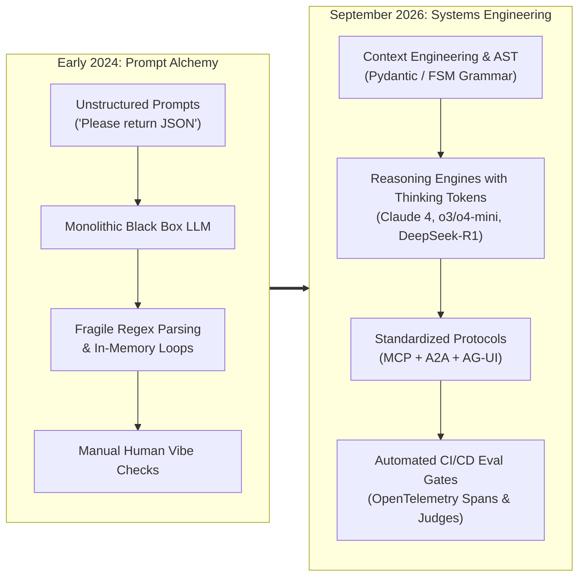
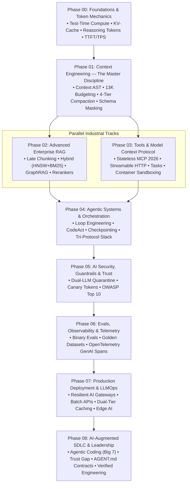
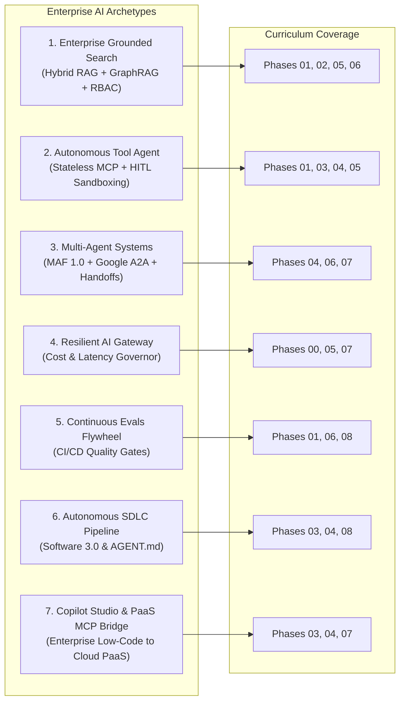
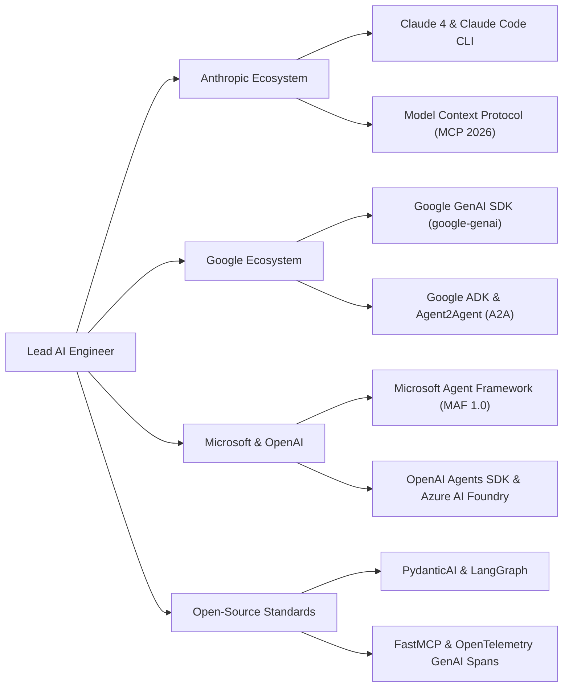

# 🚀 The AI-Native Engineer Roadmap
### Production Architecture, Autonomous Agents & Systems Engineering for Senior Tech Leads

> **The Definitive Engineering Curriculum**: Moving developers from fragile "vibe coding" and prompt alchemy to deterministic, production-grade **Software 3.0 systems engineering**.

Have you noticed how easy it is to build a mind-blowing AI demo over a weekend, but how brutally hard it is to keep it running in production on a Tuesday morning? 

When you move from traditional Software 1.0 (where an `if` statement behaves the exact same way every single time) to non-deterministic AI (where your core reasoning engine might hallucinate a JSON parameter or get trapped in an infinite loop), it's completely disorienting. 

This repository is not a collection of surface-level tutorials or marketing buzzwords. It is a battle-tested **architectural masterclass** treating Large Language Models not as magical oracles, but as **probabilistic reasoning microservices** governed by deterministic harnesses: finite-state-machine schemas, standardized wire protocols (MCP), hardware-aware KV-caches, and automated CI/CD evaluation gates.

> [!NOTE]
> **Calibrated Depth: The 4-Tier Model**
> This repository is a comprehensive masterclass spanning the entire modern AI engineering landscape. Every lesson is calibrated using our **[4-Tier Lesson Depth Model](#architectural-mastery-tiers)**:
> - **Tier 1: 🟢 Core**: Universal architectural principles (KV-cache physical realities, Context AST, late chunking, MCP wire protocol, WAL crash resilience, binary evals, OTel GenAI telemetry) that every senior AI engineer must master.
> - **Tier 2: 🟡 Engineering Depth**: Production systems engineering, failure modes, concurrency, latency ceilings, rate limiting, and defensive quarantine.
> - **Tier 3: 🔵 Advanced**: High-scale distributed patterns, multi-agent sagas, platform-specific enterprise implementations (Azure AI Search, AWS Bedrock, GCP Vertex), and specialized agent swarms.
> - **Tier 4: ⚫ Deep Dive**: Hardware memory hierarchy, GPU bandwidth, mathematical proofs, and custom kernel optimizations.
>
> Check the **[Recommended Learning Paths](#recommended-learning-paths)** to follow the curriculum tailored directly to your role (e.g., RAG Architect, Autonomous Agent Engineer, Platform Engineer, or Enterprise AI Lead).

> [!TIP]
> **New to AI Engineering Terminology? Start with the Glossary**  
> If you are encountering terms like *KV-cache, Late Chunking, ReAct loops, Model Context Protocol (MCP), or Hallucination* for the first time, keep the [**📖 Production AI & Agentic Glossary by Practice**](./ai-engineering-glossary-by-practice.md) open as your companion reference. It breaks down every core concept into **1–2 concise sentences** categorized across 21 engineering disciplines, complete with trade-off decision trees.

---

## 📑 Table of Contents

* 🤖 [**Interactive Learning & Practice with Agents (Antigravity, Claude Code, Copilot)**](./LEARNING_WITH_AGENTS.md) *(Pre-setup agents, skills, and automated grading)*
* 📖 [**Production AI & Agentic Glossary by Practice**](./ai-engineering-glossary-by-practice.md) *(Essential 1–2 sentence companion guide across 21 disciplines)*
1. [The AI Engineering Landscape: Then vs. Now](#the-ai-engineering-landscape-then-vs-now)
2. [Master Curriculum Syllabus (Phases 00–08)](#master-curriculum-syllabus)
3. [Recommended Learning Paths](#recommended-learning-paths)
4. [Hands-On Practice Labs Showcase](#hands-on-practice-labs-showcase)
5. [The Premier Standalone Engineering Guides](#the-premier-standalone-engineering-guides)
   * [5.1 🎯 Technical Interview & Career Transition Mastery](#technical-interview-career-transition-mastery)
   * [5.2 🏛️ Enterprise Architecture, Platform Core & System Design](#enterprise-architecture-platform-core-system-design)
   * [5.3 🛡️ Production SRE, Failure Defenses & Audit Gates](#production-sre-failure-defenses-audit-gates)
   * [5.4 ⚖️ Strategic Roadmaps, Governance & Regulated Systems](#strategic-roadmaps-governance-regulated-systems)
6. [Enterprise Architecture Blueprints](#enterprise-architecture-blueprints)
7. [Enterprise Protocols & Ecosystem Alignment](#enterprise-protocols-ecosystem-alignment)
8. [Architectural Mastery Tiers](#architectural-mastery-tiers)
9. [⚡ Quick Navigation & Master Hub](#quick-navigation-master-hub)

---

## 🕐 The AI Engineering Landscape: Then vs. Now

If you stepped away from AI engineering in early 2024 and returned today, you wouldn't just find smarter models—you would find an entirely different engineering discipline:

### 📊 Architectural Evolution

| Dimension | Early 2024 (Software 2.0 / Prompt Era) | September 2026 (Software 3.0 / Systems Era) |
|:---|:---|:---|
| **Core Skill** | Prompt Engineering (phrasing tricks) | **Context Engineering** (compiled ASTs, budgeting, compaction) |
| **Agent Maturity** | Research demos & fragile while-loops | **Loop Engineering** (action fingerprints, progressive budget decay) |
| **Tool Calling** | Ad-hoc JSON blobs & fragile regex | **Model Context Protocol (MCP)** (Linux Foundation standard) |
| **Memory Architecture** | Raw chat history dumps in RAM | **4-Tier Memory Taxonomy** (Working, Short-Term, Long-Term, MaaS) |
| **Multi-Agent Systems** | Uncontrolled conversational chatter | **Tri-Protocol Stack** (MCP + Google A2A + AG-UI) |
| **Reasoning Engine** | Manual Chain-of-Thought prompts | **Native Thinking Tokens** (o3/o4-mini, Claude Thinking, DeepSeek-R1) |
| **Context Ceilings** | 8K–128K tokens (frequent OOMs) | **200K–2M+ tokens** (MECW awareness & prompt caching) |
| **Cost Profile** | \$30–60 / 1M tokens (GPT-4) | **\$0.075–3.00 / 1M tokens** (200x spread, 50% off Batch APIs) |
| **Regulatory Compliance** | Voluntary best practices | **EU AI Act Enforced** (GPAI obligations, crypto-shredding) |
| **Coding Workflow** | Single-line tab autocomplete | **Autonomous Agentic Coding** (Claude Code CLI, Cursor, Windsurf) |

---

## 🗺️ Master Curriculum Syllabus

The curriculum progresses systematically from silicon and hardware inference realities up to multi-agent orchestration and engineering leadership:

### 📚 Syllabus & Module Directory

| Phase | Module Name | Core Architectural Deliverables | Duration | Target Level |
|:---:|:---|:---|:---:|:---:|
| **00** | [**Foundations & Token Mechanics**](./00-foundations-and-token-mechanics/README.md) | Transformer physical reality, KV-cache sizing, memory bandwidth wall, prefill vs decode, reasoning models (test-time compute), thinking token economics, SLMs (Phi-4, Gemma 2), and AWQ/GPTQ quantization mechanics. | 1 Week | Senior |
| **01** | [**Context Engineering: The Master Discipline**](./01-prompt-and-context-engineering/README.md) | Context AST architecture, 13K token budgeting portfolios, Prefix & Context Caching optimization, **Shared Semantic Layer integration (Cube / MetricFlow)**, 4-tier compaction pipeline, Lost-in-the-Middle mitigation, and MECW context rot. | 1 Week | Senior |
| **02** | [**RAG & Knowledge Systems**](./02-rag-and-knowledge-systems/README.md) | Chunking strategies, Late Chunking, Hybrid Search (Dense HNSW + Sparse BM25), Reciprocal Rank Fusion (RRF), ACORN predicate-filtered search, DiskANN, and GraphRAG. | 2 Weeks | Lead |
| **03** | [**Tools & Model Context Protocol (MCP)**](./03-tools-and-model-context-protocol/README.md) | The Linux Foundation MCP standard, Stateless Core (July 2026), Streamable HTTP/SSE, **Enterprise PaaS MCP Bridge (Copilot Studio & Cloud PaaS)**, Zero-Trust Tool Sandboxes (MicroVMs), financial idempotency keys, and tool schema caching. | 1 Week | Lead |
| **04** | [**Agentic Systems & Orchestration**](./04-agentic-systems-and-orchestration/README.md) | Event-Sourced Write-Ahead Log (WAL), crash rehydration, Loop Engineering (action hashing, budget decay), Microsoft Agent Framework (MAF GA), and the Tri-Protocol stack. | 2 Weeks | Staff |
| **05** | [**AI Security, Guardrails & Trust**](./05-ai-security-and-guardrails/README.md) | OWASP Top 10 for GenAI, Dual-LLM Quarantine pattern, cryptographic canary tokens, PII masking vaults, prompt injection defense, and **Algorithmic Bias, Disparate Impact & Fairlearn audits (EU AI Act compliance)**. | 1 Week | Lead |
| **06** | [**Evals, Observability & Telemetry**](./06-evals-and-observability/README.md) | Automated evaluation flywheels, multi-turn tool trajectory FSM validation, groundedness judges, **Explainable AI (XAI / SHAP attribution grounding)**, and OpenTelemetry `semantic-conventions-genai` repo standards. | 1 Week | Lead |
| **07** | [**Production Deployment & LLMOps**](./07-production-deployment-and-llmops/README.md) | Multi-provider resilient AI gateways, Token-Bucket TPM/RPM throttling, vector semantic caching, Batch APIs (50% discount), **Dynamic Multi-LoRA Adapter Serving (S-LoRA / vLLM multi-adapter routing)**, and Edge AI deployment. | 2 Weeks | Lead/Ops |
| **08** | [**AI-Augmented SDLC & Leadership**](./08-ai-augmented-sdlc-and-leadership/README.md) | The Big Seven agentic coding tools (Claude Code, Cursor, Windsurf), The Trust Gap (90% usage vs 29% trust), Verified Agentic Engineering, and machine-readable `AGENT.md` contracts. | Ongoing | Executive |

---

## 📖 Recommended Learning Paths

Choose the track tailored to your current focus and engineering background:

| Track | Objective | Target Modules | Primary Outcome |
|:---|:---|:---|:---|
| **Track 1: Precision Core & RAG** | Master retrieval and grounding | Phases 00 → 01 → 02 → 06 | Production-grade grounded search with Late Chunking, ACORN predicate search, GraphRAG, cross-encoder rerankers, and continuous evaluation gates. |
| **Track 2: Autonomous Agent Architect** | Build resilient tool-using swarms | Phases 01 → 03 → 04 → 05 | Stateful agents with strict JSON schemas, Stateless MCP servers, Google A2A protocol, loop engineering, and dual-LLM quarantine. |
| **Track 3: Production LLMOps & Leadership** | Enterprise infrastructure & governance | Phases 06 → 07 → 08 → Master Guides | Resilient multi-provider gateways, Batch API processing, OpenTelemetry tracing, `AGENT.md` codebase contracts, and EU AI Act compliance. |
| **Track 4: Senior AI Platform & Agent Infrastructure** | Master the unified agent harness & vector platform | Phases 01 → 02 → 03 → 04 → 06 → 07 → [AgentForge](./agent-forge) | Production AI platform core: cache-aware gateway, durable WAL agent loop, MCP zero-trust execution, ACORN predicate-filtered search, and OTel GenAI telemetry. |

---

## 🧪 Hands-On Practice Labs Showcase

Master production patterns through runnable, verified implementations in Python (Pydantic v2) and C# (.NET 9):

| Lab | Name | Core Architectural Deliverable | Lab Location |
|:---:|:---|:---|:---|
| **01** | **Multi-Tenant Hybrid RAG** | Sparse BM25 + Dense vector search with Reciprocal Rank Fusion (RRF `k=60`) and strict tenant isolation. | [`lab-01-multi-tenant-hybrid-rag.md`](./labs/lab-01-multi-tenant-hybrid-rag.md) |
| **02** | **Tool Execution with MCP** | Typed MCP tool server exposing secure JSON-RPC schemas governed by an ABAC Policy Engine. | [`lab-02-tool-execution-with-mcp.md`](./labs/lab-02-tool-execution-with-mcp.md) |
| **03** | **Stateful Agent Orchestration** | Bounded ReAct state machine appending transitions to an EventStore Write-Ahead Log (WAL) with crash recovery. | [`lab-03-stateful-agent-orchestration.md`](./labs/lab-03-stateful-agent-orchestration.md) |
| **04** | **Agent Failure Defense** | TokenBucketLimiter managing upfront token reservations and post-stream settlement against TPM/RPM limits. | [`lab-04-agent-failure-defense.md`](./labs/lab-04-agent-failure-defense.md) |
| **05** | **AI Observability & Tracing** | OpenTelemetry GenAI semantic conventions distributed tracing (`gen_ai.client.token.usage`). | [`lab-05-ai-observability-tracing.md`](./labs/lab-05-ai-observability-tracing.md) |
| **06** | **Dual-LLM Quarantine Guardrails** | Dual-LLM privilege quarantine isolating untrusted external inputs from privileged execution perimeters. | [`lab-06-dual-llm-quarantine-guardrails.md`](./labs/lab-06-dual-llm-quarantine-guardrails.md) |
| **07** | **Hybrid ML Fairness & Explainability** | Regulated financial credit & procurement pipeline: tabular ML risk scoring, Fairlearn bias audit, and SHAP attributions. | [`lab-07-hybrid-ml-fairness-and-explainability.md`](./labs/lab-07-hybrid-ml-fairness-and-explainability.md) |

*All 7 canonical labs are automatically verified via `python scripts/verify_lab.py --all`. For specialized agentic deep-dive exercises (HITL approval, A2A swarms, cycle detection, and distributed sagas), explore the [`04-agentic-systems-and-orchestration/labs/`](./04-agentic-systems-and-orchestration/labs/) directory. For the unified enterprise platform harness synthesizing these lab patterns, see [**AgentForge**](#2-enterprise-architecture-platform-core-system-design) under Enterprise Architecture below.*

---

## 🌟 The Premier Standalone Engineering Guides

In addition to the 9 curriculum phases, this repository provides battle-tested enterprise reference playbooks, runnable platform cores, SRE failure compendiums, and interview preparation guides—organized below by their engineering focus and operational usefulness:

### 1. 🎯 Technical Interview & Career Transition Mastery

*Target: Senior Developers, Tech Leads, and AI Architects preparing for high-stakes system design, technical architecture, and behavioral interviews.*

| Guide / Playbook | Artifact Type | Primary Usefulness & Target Objective |
| :--- | :--- | :--- |
| 📖 [**Production AI & Agentic Glossary by Practice**](./ai-engineering-glossary-by-practice.md) | **Glossary & Decision Matrix** | Rapid-recall 1–2 sentence explanations across 21 core practices, high-value trade-off rules, and senior architectural defense question trees. |
| 🎯 [**80/20 AI System Design Interview Prep Sheet**](./interview/80-20-ai-interview-prep-sheet.md) | **System Design Cheat Sheet** | Master 5 end-to-end enterprise blueprints, 25 architect Q&As, and tradeoff matrices (ReAct vs. DAG, Vector DB vs. relational, MCP vs. REST). |
| 🎙️ [**AI Platform Engineer Interview Handbook**](./interview/ai-platform-engineer-handbook.md) | **Platform & Infra Guide** | Hardware capacity math (KV-cache VRAM, 1B vector sizing), storage engine internals (HNSW tombstoning, ACORN), and 45-min live coding challenges. |
| 🎯 [**High-Stakes Behavioral & Scenario Guide**](./interview/high-stakes-behavioral-and-scenario-guide.md) | **Crisis Leadership Playbook** | The CARL+S framework for navigating cascading production outages, silent ML data leakage, and cross-functional engineering conflict. |
| 📘 [**The Senior Transition Guide**](./senior-transition-guide.md) | **90-Day Execution Roadmap** | Step-by-step roadmap for Senior .NET/Cloud Engineers bridging traditional Software 1.0 patterns into autonomous, agentic systems engineering. |

### 2. 🏛️ Enterprise Architecture, Platform Core & System Design

*Target: System architects, tech leads, and platform teams designing enterprise AI backbones and platform harnesses.*

| Guide / Blueprint | Artifact Type | Primary Usefulness & Target Objective |
| :--- | :--- | :--- |
| ⚒️ [**AgentForge Reference Platform Core**](./agent-forge/README.md) | **Runnable Platform Core** | Complete production reference implementation featuring hybrid search (BM25 + Dense + RRF), MCP 2026, WAL crash rehydration, and automated eval gates. |
| 🏗️ [**Senior AI Platform & Agent Infra Roadmap**](./ai-platform-and-agent-infrastructure-roadmap.md) | **Platform Systems Syllabus** | Comprehensive architecture for building zero-trust agent execution engines, enterprise vector platforms, and OpenTelemetry GenAI observability. |
| 🏗️ [**11 Enterprise AI System Designs**](#dedicated-architectural-blueprints-system-designs) | **System Design Blueprints** | Production blueprints across 11 core archetypes (e.g., Autonomous Sourcing Mesh, Shared Semantic Layers) with sequence diagrams and architect notes. |
| 🔌 [**Enterprise PaaS & Copilot Studio MCP Bridge**](./use-cases/use-case-07-copilot-studio-and-paas-mcp-bridge.md) | **Hybrid Integration Guide** | Concrete architecture connecting low-code Copilot Studio to cloud PaaS microservices via Streamable HTTP MCP and Microsoft Entra ID. |
| 🏛️ [**AI Architecture Decision Records (ADRs)**](./architecture/adrs/README.md) | **Formal Decision Records** | Defensible enterprise trade-off documentation settling pgvector vs. Qdrant, MCP vs. REST, System 2 reasoning models, and RadixAttention. |

### 3. 🛡️ Production SRE, Failure Defenses & Audit Gates

*Target: Tech leads and platform engineers taking AI systems to production with zero regressions and high availability.*

| Guide / Playbook | Artifact Type | Primary Usefulness & Target Objective |
| :--- | :--- | :--- |
| 🛡️ [**AI Production Readiness Review (PRR)**](./architecture/production-readiness-review.md) | **Enterprise Audit Gate** | 50-point go-live checklist verifying availability, hard token budgets, process sandboxing, state durability, and EU AI Act compliance before release. |
| 🚨 [**Production Post-Mortems & Failure Compendium**](./architecture/post-mortems/README.md) | **Blameless Incident RCAs** | Deep SRE post-mortems analyzing catastrophic real-world outages: cascading KV-cache stampedes, silent feature leakage, and cyclic agent deadlocks. |
| 🚨 [**Top 15 Beginner Mistakes in AI Engineering**](./resources/beginner-mistakes-cheatsheet.md) | **Defensive Anti-Pattern Guide** | 15 catastrophic AI traps (prompt begging, runaway loops, prefix taint, unsandboxed SQL tools) with 2:00 AM war stories and concrete code fixes. |

### 4. ⚖️ Strategic Roadmaps, Governance & Regulated Systems

*Target: Engineering leaders and architects ensuring regulatory compliance and long-term tech stack alignment.*

| Guide / Framework | Artifact Type | Primary Usefulness & Target Objective |
| :--- | :--- | :--- |
| 🗺️ [**Emerging AI Technology Roadmap (2025–2026)**](./ai-technology-roadmap-2025-2026.md) | **Strategic Horizon Scan** | 12-month adoption timeline covering test-time compute, Model Context Protocol (MCP), MicroVM sandboxing, RadixAttention, and GraphRAG. |
| ⚖️ [**AI Governance, Compliance & EU AI Act Guide**](./resources/ai-governance-and-compliance-guide.md) | **Compliance Checklist** | Practical engineering blueprint for EU AI Act 4-tier risk classification, GPAI transparency rules, NIST AI RMF, and GDPR crypto-shredding. |
| 📑 [**Comprehensive Curriculum & Phase Resource Map**](./resources/topics-and-resource-map.md) | **Curriculum Taxonomy** | Complete phase-by-phase reference map of official SDK docs, research papers, and standards across 9 phases. |
| 🛠️ [**Master Resource Index**](./resources/resource-index.md) | **Curated Tool Directory** | Centralized directory of enterprise LLMOps tools, benchmark suites, and vector database engines. |

---

## 🏢 Enterprise Architecture Blueprints

The curriculum maps directly to the seven primary enterprise AI architectural archetypes, supported by comprehensive system designs and deep-dive use case blueprints:

### 🏛️ Dedicated Architectural Blueprints & System Designs

* 🏗️ [**Enterprise AI System Designs**](./architecture/enterprise-ai-system-designs.md): Complete end-to-end production architectures (Problem Statement, Approach, Block Diagram, Senior/Architect Notes) including:
  - Financial Reconciliation & Exception Management Engine (Saga Pattern)
  - Enterprise Multi-Tenant Hybrid RAG with Graph Reasoning (GraphRAG + RBAC)
  - Autonomous Cloud Infrastructure SRE & Remediation Agent
  - Autonomous AI Coding & PR Verification Bot (Software 3.0 SDLC)
  - Omnichannel Customer Operations Triage & Peer Swarm (A2A + MCP)
  - Enterprise Dual-Tier AI Gateway with Cost Governor & Semantic Caching
  - Continuous Automated LLM Evaluation & Regression Gate (Hamel 3-Level Evals)
  - Dual-LLM Privilege Quarantine Architecture for Untrusted Ingestion
  - Autonomous Supply Chain Predictive Inventory Rebalancing Mesh
  - Enterprise HR & Corporate Policy Compliance Agent with PII Vault
  - **Autonomous Enterprise Sourcing & Procurement Mesh with Shared Semantic Layer** (Compare, Intake, SourceIQ)
* 🔌 [**Enterprise Architectural Use Cases (01–07)**](./use-cases/README.md): Production reference blueprints including **Use Case 07: Copilot Studio & Enterprise PaaS MCP Bridge** (connecting low-code conversational copilots to serverless Python/.NET MCP servers over SSE with Azure AI Search grounding and Entra ID authentication).

---

## 🏛️ Enterprise Protocols & Ecosystem Alignment

Modern AI systems engineering relies on open, standardized protocols rather than proprietary walled gardens:

---

## 🎯 Architectural Mastery Tiers

Every topic and lesson across the curriculum is classified using the **4-Tier Lesson Depth Model** so you can calibrate depth, prerequisites, and pacing:

* **Tier 1: 🟢 Core**: Non-negotiable foundation every engineer must master. Establishes primary mental models, basic mechanics, failure modes of the naive approach, and working reference implementations (~800–1,500 words).
* **Tier 2: 🟡 Engineering Depth**: Production systems engineering. Covers edge cases, concurrency, failure modes, memory budgeting, latency limits, and OpenTelemetry instrumentation (~1,200–2,500 words).
* **Tier 3: 🔵 Advanced**: High-scale distributed patterns, specialized enterprise extensions (e.g., GraphRAG, multi-agent sagas, speculative decoding, custom kernel optimizations) (~1,500–3,000 words).
* **Tier 4: ⚫ Deep Dive**: Zero-abstraction systems internals, mathematical proofs, hardware physics, wire protocol specifications, and memory layouts (e.g., PagedAttention block tables, BPE merge trees, RRF harmonic rank distributions) (~1,500–3,000 words).

---

## ⚡ Quick Navigation & Master Hub

Navigate directly to the core curriculum tracks, lab directories, and curated catalogs across the repository:

* 🗺️ [**Master Curriculum Syllabus (Phases 00–08)**](#master-curriculum-syllabus): Progressive 9-phase systems engineering syllabus from hardware inference to SDLC leadership.
* 🧪 [**Hands-On Practice Labs Showcase**](#hands-on-practice-labs-showcase): 7 runnable enterprise labs (Python/Pydantic & .NET 9) covering stateful agents, MCP, and SAGAs.
* 🌟 [**The Premier Standalone Engineering Guides**](#the-premier-standalone-engineering-guides): 16 specialized playbooks organized across Interview, Architecture, SRE, and Governance tracks.
* 🏢 [**Enterprise Architecture Blueprints**](#enterprise-architecture-blueprints): The 7 core enterprise AI archetypes and system design specifications.
* 🎯 [**Architectural Mastery Tiers**](#architectural-mastery-tiers): Taxonomy classification (🟢 Core, 🟡 Engineering Depth, 🔵 Advanced, ⚫ Deep Dive).
