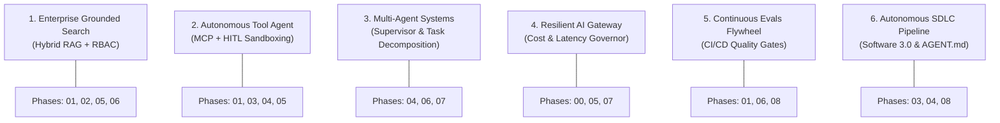
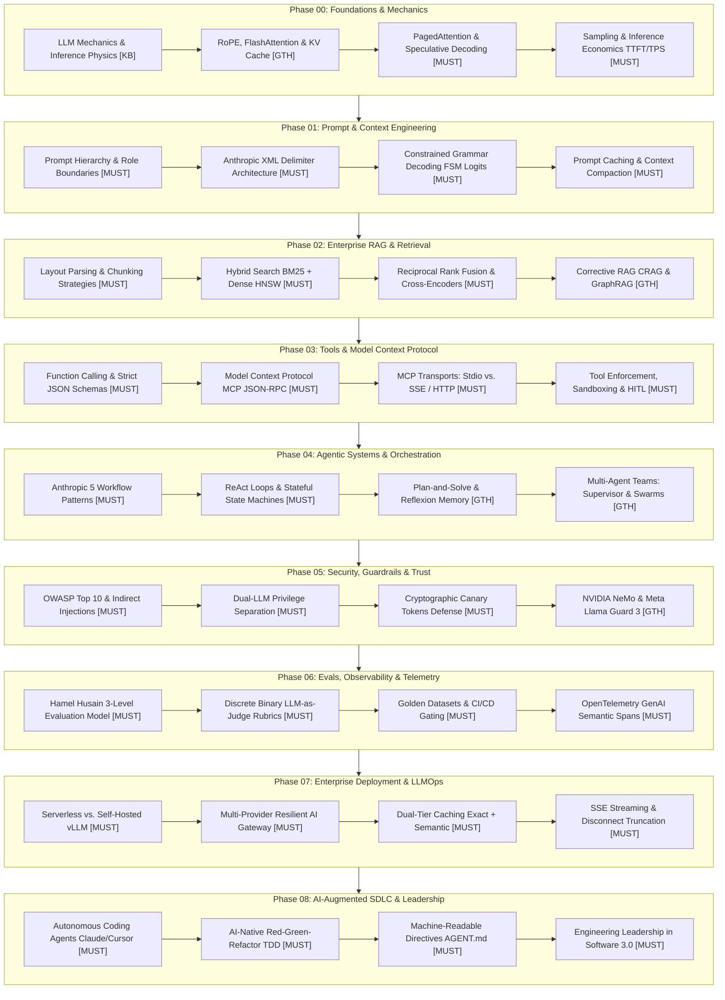
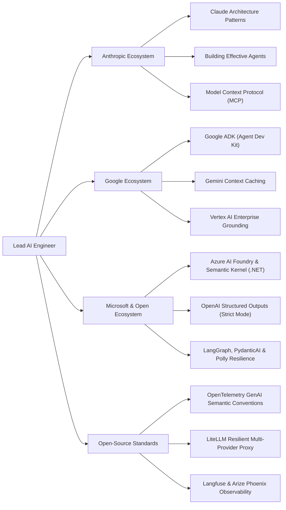

# AI Engineer & Agentic Systems Roadmap: Senior & Lead Developer Edition

> **A production-focused engineering curriculum and architectural reference designed for Senior Engineers, Tech Leads, and Software Architects building enterprise AI applications and autonomous agentic systems.**

---

```
                       ┌─────────────────────────────────────────────────────────┐
                       │           THE AI-NATIVE SENIOR ARCHITECT                │
                       │  System Design • Safety • Evals • Tooling • Production  │
                       └────────────────────────────┬────────────────────────────┘
                                                    │
             ┌──────────────────────────────────────┴──────────────────────────────────────┐
             ▼                                                                             ▼
┌─────────────────────────┐                                                   ┌─────────────────────────┐
│     AI POWER USER       │                                                   │       AI ENGINEER       │
│  • AI Coding Tools      │                                                   │  • LLM Inference Specs  │
│  • SDLC Acceleration    │                                                   │  • Context Engineering  │
│  • Architecture RFCs    │                                                   │  • Deterministic Evals  │
│  • Automated PR Reviews │                                                   │  • Production LLMOps    │
└────────────┬────────────┘                                                   └────────────┬────────────┘
             │                                                                             │
             └──────────────────────────────────────┬──────────────────────────────────────┘
                                                    ▼
                       ┌─────────────────────────────────────────────────────────┐
                       │              AGENTIC SYSTEMS & ORCHESTRATION            │
                       │  ReAct • MCP • Multi-Agent • State Machines • Memory    │
                       └─────────────────────────────────────────────────────────┘
```

---

## 🎯 Architecture Philosophy & Foundations

In enterprise software engineering, foundation models function as **probabilistic, remote microservices** characterized by non-zero latency, non-deterministic outputs, and token-based operational costs.

Senior developers and software architects approach AI not by training models from scratch, but by constructing **deterministic software harnesses** around probabilistic reasoning engines:

1. **Deterministic System Design**: Constraining probabilistic models into reliable, testable software components with strict schema validation and bounded state machines.
2. **Context & Token Economics**: Architecting prompt pipelines, token budgets, KV-cache reuse, and context windows with millisecond and dollar efficiency.
3. **Enterprise Knowledge & Grounding**: Designing hybrid, reranked RAG systems that eliminate hallucinations and enforce document-level multi-tenant security.
4. **Standardized Tool Protocols**: Leveraging the **Model Context Protocol (MCP)** and strict JSON schemas to connect models to enterprise databases, APIs, and file systems.
5. **Continuous Automated Evals**: Establishing deterministic regression test suites, discrete binary assertion gates, and golden datasets within CI/CD pipelines.
6. **Defensive Architecture**: Implementing runtime guardrails, indirect prompt injection defenses, dual-LLM privilege separation, canary tokens, and sandboxed runtimes.
7. **Production LLMOps**: Deploying resilient microservices across container runtimes (Cloud Run, Azure Container Apps, Kubernetes) and enterprise application stacks (Python, TypeScript, C#/.NET 9, Java/Go) with OpenTelemetry observability.
8. **AI-Native SDLC Leadership**: Structuring repositories with machine-readable contracts (`AGENT.md`) to guide autonomous coding agents.

---

## ⚡ The Senior Architect Fast-Track

Access the master synthesis blueprints and technical deep-dives:

👉 [**The Senior AI Engineer & Architect Transition Guide**](./senior-transition-guide.md)
- **Architectural Foundations**: The Software 1.0 $\to$ 2.0 $\to$ 3.0 paradigm shift and polyglot runtime design.
- **3-Tier AI Taxonomy**: 🔴 `[MUST-HAVE]` Production Core, 🟡 `[GOOD-TO-HAVE]` Advanced Optimization, and 🔵 `[KNOWLEDGE-BASE]` Conceptual Reference.
- **6 Enterprise Use Cases**: SDLC 3.0, Enterprise SDK Resilience, MCP & Sandboxing, Failure Modes & Defense, OTel Evals & Telemetry, and Agent Swarms (A2A).
- **6 Hands-On Practice Labs**: Production-grade engineering challenges covering RAG, MCP, State Machines, Loop Defense, OTel, and Quarantine.
- **90-Day Execution Roadmap** & Architectural Production Readiness Checklist.

👉 [**The 80/20 AI Engineering & System Design Interview Preparation Sheet**](./interview/80-20-ai-interview-prep-sheet.md)
- **System Design Blueprints**: Production Hybrid RAG, Multi-Provider Resilient AI Gateway, Autonomous Coding Agent with MCP, Customer Operations Multi-Agent Swarm.
- **Top 25 Senior/Lead Technical Questions & Architect-Grade Answers** with deep hardware, protocol, and failure mode tradeoffs.
- **Architectural Tradeoff Matrices**: RAG vs Fine-Tuning, Dense vs Hybrid Search, Autonomous ReAct vs Deterministic Workflows, Serverless vs vLLM.
- **Formulas & Mental Math**: KV-cache allocation, total request latency, and Reciprocal Rank Fusion math.

---

## 🏷️ The 3-Tier Classification Tagging System

Every topic and architectural pattern in this curriculum is categorized using a 3-tier taxonomy to optimize engineering focus:

```
┌──────────────────────────────────────────────────────────────────────────────────────────────────┐
│                                 THE 3-TIER CURRICULUM TAXONOMY                                   │
├────────────────────┬────────────────────────────────────────────────────────┬────────────────────┤
│ Tag                │ Meaning & Scope                                        │ Energy Allocation  │
├────────────────────┼────────────────────────────────────────────────────────┼────────────────────┤
│ `[MUST-HAVE]` 🔴   │ **Production Invariants & Core Architecture**          │ **80% Focus**      │
│                    │ Essential for enterprise applications, production      │ Must write code,   │
│                    │ reliability, immediate business ROI, and system        │ verify schemas,    │
│                    │ architecture. Non-negotiable foundation.               │ and defend design. │
├────────────────────┼────────────────────────────────────────────────────────┼────────────────────┤
│ `[GOOD-TO-HAVE]` 🟡│ **Advanced Scaling & Complex Orchestration**           │ **15% Focus**      │
│                    │ Advanced optimizations, multi-agent swarms, specialized│ Deploy when hitting│
│                    │ memory graphs, custom guardrails, and latency scaling. │ scale or latency   │
│                    │ Adopt as architectural complexity demands.             │ bottlenecks.       │
├────────────────────┼────────────────────────────────────────────────────────┼────────────────────┤
│ `[KNOWLEDGE-BASE]`🔵│ **Conceptual Reference & Architectural Intuition**    │ **5% Focus**       │
│                    │ Foundational mathematical concepts, training mechanics,│ Understand mental  │
│                    │ and hardware physics.                                  │ models; skip coding│
│                    │ Understand the concepts; skip coding from scratch.     │ from scratch.      │
└────────────────────┴────────────────────────────────────────────────────────┴────────────────────┘
```

---

## 📖 What to Read: Recommended Reading Paths

Follow these targeted reading orders depending on your architectural objective:

### Path A: Building Enterprise Knowledge & RAG Systems
1. [`./00-foundations-and-token-mechanics/README.md`](./00-foundations-and-token-mechanics/README.md): Token mechanics, KV-cache sizing, TTFT vs TPS economics.
2. [`./01-prompt-and-context-engineering/README.md`](./01-prompt-and-context-engineering/README.md): Structured outputs, prompt caching, context management.
3. [`./02-rag-and-knowledge-systems/README.md`](./02-rag-and-knowledge-systems/README.md): Hybrid search (BM25 + HNSW), Reciprocal Rank Fusion, Cross-Encoder reranking, multi-tenant RBAC.
4. [`./06-evals-and-observability/README.md`](./06-evals-and-observability/README.md): Discrete binary evaluations for retrieval precision and answer faithfulness.

### Path B: Building Autonomous Tool-Augmented Agents
1. [`./01-prompt-and-context-engineering/README.md`](./01-prompt-and-context-engineering/README.md): Constrained grammar decoding and schema validation.
2. [`./03-tools-and-model-context-protocol/README.md`](./03-tools-and-model-context-protocol/README.md): Model Context Protocol (MCP) JSON-RPC 2.0 standard, Stdio/SSE transports, container sandboxing.
3. [`./04-agentic-systems-and-orchestration/README.md`](./04-agentic-systems-and-orchestration/README.md): ReAct loops, deterministic state machines, checkpointing, timeout budgets.
4. [`./05-ai-security-and-guardrails/README.md`](./05-ai-security-and-guardrails/README.md): Dual-LLM quarantine pattern, prompt injection defense, canary tokens, HITL approval gates.

### Path C: Enterprise LLMOps, Infrastructure & Leadership
1. [`./07-production-deployment-and-llmops/README.md`](./07-production-deployment-and-llmops/README.md): Multi-provider resilient gateways (LiteLLM), circuit breaking, dual-tier caching, SSE streaming.
2. [`./08-ai-augmented-sdlc-and-leadership/README.md`](./08-ai-augmented-sdlc-and-leadership/README.md): Autonomous coding agents, machine-readable repository contracts (`AGENT.md`), automated PR review.
3. [`./senior-transition-guide.md`](./senior-transition-guide.md): Complete architectural implementation playbook and hands-on practice labs.
4. [`./interview/80-20-ai-interview-prep-sheet.md`](./interview/80-20-ai-interview-prep-sheet.md): Master system design blueprints and tradeoff cheat sheets.

---

## 🧪 Hands-On Practice Labs for Senior Engineers

To master production patterns, build and verify these six reference implementations:

| Lab | Name | Core Objective | Key Deliverables & Validation |
|:---:|:---|:---|:---|
| **Lab 1** | **Multi-Tenant Hybrid RAG** | Build an isolated retrieval pipeline combining lexical and semantic search. | Sparse BM25 + dense HNSW vector search, Reciprocal Rank Fusion (RRF), Cross-Encoder reranking (Cohere), and tenant-level metadata partition filters. |
| **Lab 2** | **Tool Execution with MCP** | Create a standards-compliant Model Context Protocol server and client. | JSON-RPC 2.0 over `stdio`/`SSE`, strict JSON Schemas for database/API tools, input validation rejecting mutating SQL, and sandboxed file access. |
| **Lab 3** | **Stateful Agent Orchestration** | Construct a resilient state machine with durable checkpointing. | Graph reducer state transitions (`Triage` $\to$ `Specialist` $\to$ `Validator`), SQLite/Redis checkpointing, and execution pause/resume for human approvals. |
| **Lab 4** | **Agent Failure Defense** | Implement defensive controls for common agent failure modes. | Rolling SHA-256 action hash loop detection (max 3 repeats), dry-run blast radius previews, and automated context compaction at 75% window capacity. |
| **Lab 5** | **AI Observability & Tracing** | Instrument distributed tracing across LLM calls and tool invocations. | OpenTelemetry GenAI semantic convention spans (`gen_ai.system`, `gen_ai.usage.*`), waterfall latency tracing, and telemetry export to Langfuse/Jaeger. |
| **Lab 6** | **Dual-LLM Quarantine & Guardrails** | Build an indirect prompt injection defense pipeline. | Unprivileged Reader model extracting untrusted inputs into typed schemas with zero tool access, cryptographic canary tokens, and egress leakage filters. |

*Detailed architectural specifications and step-by-step requirements for each lab are available in [`./senior-transition-guide.md`](./senior-transition-guide.md#5-hands-on-practice-labs-for-senior-engineers).*

---

## 🏢 The 6 Senior Enterprise AI Use Cases



### 1. Enterprise Grounded Search & Knowledge Assistant (Hybrid RAG + RBAC)
* **Roadmap Phases**: [`./01-prompt-and-context-engineering/README.md`](./01-prompt-and-context-engineering/README.md), [`./02-rag-and-knowledge-systems/README.md`](./02-rag-and-knowledge-systems/README.md), [`./05-ai-security-and-guardrails/README.md`](./05-ai-security-and-guardrails/README.md), [`./06-evals-and-observability/README.md`](./06-evals-and-observability/README.md)
* **Architecture Solution**:
  - Structural layout-aware parsing preserving headers and tabular structures.
  - Hybrid retrieval combining BM25 lexical search and dense vector HNSW search.
  - Reciprocal Rank Fusion (RRF) synthesized with cross-encoder semantic rerankers.
  - Document-level RBAC pre-filtering ensuring zero cross-tenant data leakage.
  - Citation grounding and natural language inference (NLI) faithfulness checks.

### 2. Autonomous Tool-Augmented Agent & Workflow Automation (MCP + HITL)
* **Roadmap Phases**: [`./01-prompt-and-context-engineering/README.md`](./01-prompt-and-context-engineering/README.md), [`./03-tools-and-model-context-protocol/README.md`](./03-tools-and-model-context-protocol/README.md), [`./04-agentic-systems-and-orchestration/README.md`](./04-agentic-systems-and-orchestration/README.md), [`./05-ai-security-and-guardrails/README.md`](./05-ai-security-and-guardrails/README.md)
* **Architecture Solution**:
  - Model Context Protocol (MCP) client-server architecture using JSON-RPC 2.0 over Stdio/SSE.
  - Strict JSON schema decoding via Finite State Machine (FSM) logit masking.
  - Principle of Least Agency with ephemeral container execution boundaries.
  - Asynchronous Human-in-the-Loop (HITL) step-up approval gates for state-mutating operations.

### 3. Multi-Agent Collaborative Systems (Supervisor / Hierarchical)
* **Roadmap Phases**: [`./04-agentic-systems-and-orchestration/README.md`](./04-agentic-systems-and-orchestration/README.md), [`./06-evals-and-observability/README.md`](./06-evals-and-observability/README.md), [`./07-production-deployment-and-llmops/README.md`](./07-production-deployment-and-llmops/README.md)
* **Architecture Solution**:
  - Central supervisor orchestrating specialized domain worker agents.
  - Deterministic state machine with cyclical graph reducers and durable checkpointing.
  - Message exchange over standardized JSON-RPC 2.0 or CloudEvents payloads.
  - OpenTelemetry distributed tracing correlating parent-child spans across agents.

### 4. High-Throughput Enterprise AI Gateway & Cost/Latency Governor
* **Roadmap Phases**: [`./00-foundations-and-token-mechanics/README.md`](./00-foundations-and-token-mechanics/README.md), [`./05-ai-security-and-guardrails/README.md`](./05-ai-security-and-guardrails/README.md), [`./07-production-deployment-and-llmops/README.md`](./07-production-deployment-and-llmops/README.md)
* **Architecture Solution**:
  - High-availability reverse proxy gateway (LiteLLM / Envoy) managing multi-provider routing and automated failover.
  - Circuit breakers with exponential backoff and decorrelated jitter.
  - Dual-tier caching: exact SHA-256 hash hit for deterministic prompts + semantic vector caching for similar queries.
  - High-performance Server-Sent Events (SSE) streaming with client disconnect truncation.

### 5. Automated Continuous Evals & Quality Flywheel (CI/CD Regression)
* **Roadmap Phases**: [`./01-prompt-and-context-engineering/README.md`](./01-prompt-and-context-engineering/README.md), [`./06-evals-and-observability/README.md`](./06-evals-and-observability/README.md), [`./08-ai-augmented-sdlc-and-leadership/README.md`](./08-ai-augmented-sdlc-and-leadership/README.md)
* **Architecture Solution**:
  - Hamel Husain 3-level evaluation hierarchy: code-level assertions $\to$ discrete binary LLM-as-a-judge $\to$ production telemetry.
  - Objective binary rubrics (Pass/Fail) replacing ambiguous numeric scales.
  - Golden test datasets curated from production anomalies and edge cases.
  - Automated CI/CD gates blocking pull requests that fail quality or regression thresholds.

### 6. AI-Native Engineering Acceleration & Autonomous Coding Pipeline
* **Roadmap Phases**: [`./03-tools-and-model-context-protocol/README.md`](./03-tools-and-model-context-protocol/README.md), [`./04-agentic-systems-and-orchestration/README.md`](./04-agentic-systems-and-orchestration/README.md), [`./08-ai-augmented-sdlc-and-leadership/README.md`](./08-ai-augmented-sdlc-and-leadership/README.md)
* **Architecture Solution**:
  - Autonomous coding agents (Claude Code, Cursor) grounded with machine-readable repository manifests (`AGENT.md`).
  - Test-Driven Invariant Verification (TDD) where automated tests act as correctness arbiters.
  - Automated PR review bots enforcing architectural boundaries and scanning for security regressions.

---

## 🗺️ Progression Roadmap



---

## 📚 Curriculum Structure & Phased Syllabus

| Phase | Directory | Focus & Key Deliverables | Estimated Time | Level |
|---|---|---|---|---|
| **00** | [**Foundations & Token Mechanics**](./00-foundations-and-token-mechanics/README.md) | 🔴 `[MUST-HAVE]`: TTFT vs TPS, KV-Cache VRAM formulas, PagedAttention, BPE Tokenization, Sampling Parameters, Reasoning Models.<br>🟡 `[GOOD-TO-HAVE]`: FlashAttention-2/3, RoPE context scaling, Speculative Decoding, GQA, MoE.<br>🔵 `[KNOWLEDGE-BASE]`: Transformer Q·K^T / sqrt(d_k) intuition, training loss mechanics. | 1-2 Weeks | Core |
| **01** | [**Prompt & Context Engineering**](./01-prompt-and-context-engineering/README.md) | 🔴 `[MUST-HAVE]`: Prompt Hierarchy, Anthropic XML tags, Constrained Grammar Decoding (FSM logit masking), Pydantic v2 schemas, Prompt Caching breakpoints.<br>🟡 `[GOOD-TO-HAVE]`: Context compaction, Lost-in-the-Middle mitigation, Assistant prefilling.<br>🔵 `[KNOWLEDGE-BASE]`: Soft prompt tuning concepts, cognitive prompt tax derivations. | 2 Weeks | Core |
| **02** | [**RAG & Enterprise Knowledge**](./02-rag-and-knowledge-systems/README.md) | 🔴 `[MUST-HAVE]`: Layout-aware parsing, Hierarchical chunking, Hybrid Search (Dense HNSW + BM25), Reciprocal Rank Fusion (RRF), Cross-Encoder Rerankers, Multi-tenant RBAC.<br>🟡 `[GOOD-TO-HAVE]`: Corrective RAG (CRAG), HyDE query expansion, GraphRAG, Managed Grounding.<br>🔵 `[KNOWLEDGE-BASE]`: Vector distance metric derivations, custom embedding training. | 2-3 Weeks | Advanced |
| **03** | [**Tools & Model Context Protocol**](./03-tools-and-model-context-protocol/README.md) | 🔴 `[MUST-HAVE]`: JSON-RPC 2.0 wire protocol, MCP Architecture, MCP Transports (Stdio vs SSE), Schema contracts, Error self-healing, Container sandboxing, HITL gates.<br>🟡 `[GOOD-TO-HAVE]`: MCP Reverse Sampling, Enterprise MCP servers, Tool choice forcing.<br>🔵 `[KNOWLEDGE-BASE]`: Custom binary RPC protocols, academic history of symbolic tool reasoning. | 2 Weeks | Advanced |
| **04** | [**Agentic Systems & Orchestration**](./04-agentic-systems-and-orchestration/README.md) | 🔴 `[MUST-HAVE]`: Workflows vs Agents (Anthropic 5 patterns), ReAct execution loops, Stateful state machines, Checkpointed runtimes, Token budgeting & loop timeouts.<br>🟡 `[GOOD-TO-HAVE]`: Plan-and-Solve, Reflexion memory, Multi-agent teams (Supervisor, Swarms), Frameworks (Google ADK, LangGraph, Semantic Kernel).<br>🔵 `[KNOWLEDGE-BASE]`: Multi-agent game theory, Nash equilibrium proofs. | 3 Weeks | Architect |
| **05** | [**AI Security, Guardrails & Trust**](./05-ai-security-and-guardrails/README.md) | 🔴 `[MUST-HAVE]`: OWASP LLM Top 10, Direct/Indirect injection defense, Dual-LLM Privilege Separation (Quarantine), Cryptographic canary tokens, Ephemeral sandboxing, HITL step-up auth.<br>🟡 `[GOOD-TO-HAVE]`: NVIDIA NeMo Guardrails, Meta Llama Guard 3, Semantic classifiers, NLI entailment grading.<br>🔵 `[KNOWLEDGE-BASE]`: Adversarial gradient attack derivations, differential privacy math. | 1-2 Weeks | Architect |
| **06** | [**Evals, Observability & Telemetry**](./06-evals-and-observability/README.md) | 🔴 `[MUST-HAVE]`: Hamel Husain 3-level evaluation framework, Discrete binary LLM-as-a-Judge rubrics, Golden dataset curation, OpenTelemetry GenAI semantic conventions, CI/CD PR gates.<br>🟡 `[GOOD-TO-HAVE]`: Agent trajectory unit testing, Langfuse/Arize Phoenix platforms, Synthetic test generation.<br>🔵 `[KNOWLEDGE-BASE]`: Academic benchmark statistical variance, inter-rater reliability formulas. | 2 Weeks | Architect |
| **07** | [**Production Deployment & LLMOps**](./07-production-deployment-and-llmops/README.md) | 🔴 `[MUST-HAVE]`: Serverless vs vLLM, LiteLLM Resilient AI Gateway, Tiered fallback routing, Dual-tier caching (Exact SHA-256 + Vector), SSE streaming with disconnect truncation, Quota budgeting.<br>🟡 `[GOOD-TO-HAVE]`: ASP.NET Core 9 / FastAPI microservices, GPU node pools, Asynchronous message queues, Polly v8 resilience.<br>🔵 `[KNOWLEDGE-BASE]`: Custom CUDA/Triton kernel optimization, compiling custom TensorRT-LLM engines. | 2 Weeks | Lead/Ops |
| **08** | [**AI-Augmented SDLC & Leadership**](./08-ai-augmented-sdlc-and-leadership/README.md) | 🔴 `[MUST-HAVE]`: Autonomous coding agents (Claude Code, Cursor), Machine-readable directives (`AGENT.md`), AI-driven TDD invariant verification, Automated PR review bots, Leadership in Software 3.0.<br>🟡 `[GOOD-TO-HAVE]`: Multi-file refactoring agents, Automated ADR/RFC generators, Team velocity metrics.<br>🔵 `[KNOWLEDGE-BASE]`: Philosophy and cognitive science of human-agent collaboration. | Ongoing | Executive |
| **Playbook** | [**Senior Transition Guide**](./senior-transition-guide.md) | 🔴 `[MUST-HAVE]`: Architecture Foundations, 3-Tier Taxonomy, 6 Enterprise Use Cases, 6 Hands-On Practice Labs, 90-Day Execution Roadmap. | 1 Week | Staff/Lead |
| **Interview** | [**80/20 Interview Prep Sheet**](./interview/80-20-ai-interview-prep-sheet.md) | 🔴 `[MUST-HAVE]`: Master System Design Blueprints, Top 25 Technical Interview Questions with Model Answers, Rapid-Fire Tradeoff Matrices, Red Flags vs Green Flags. | Continuous | Master |

---

## 🏛️ Ecosystem Alignment Matrix

This curriculum aligns with enterprise standards and frameworks across the major AI ecosystems:



---

## 🔗 Unified Master Resource Hub

A curated master index linking directly to verified official documentation, courses, books, and expert technical blogs is available in [**`resources/resource-index.md`**](./resources/resource-index.md).

### Quick Provider Links
- **Google Cloud & Gemini**: [Google AI for Developers](https://ai.google.dev/) • [Google Agent Development Kit (ADK)](https://google.github.io/adk-docs/) • [Gemini API Docs](https://ai.google.dev/gemini-api/docs)
- **Anthropic & Claude**: [Anthropic Documentation](https://docs.anthropic.com/) • [Building Effective Agents](https://www.anthropic.com/engineering/building-effective-agents) • [Claude Academy](https://academy.claude.com)
- **Model Context Protocol (MCP)**: [Official Specification & Guides](https://modelcontextprotocol.io/) • [MCP GitHub Organization](https://github.com/modelcontextprotocol)
- **Microsoft & Azure**: [Azure AI Foundry](https://learn.microsoft.com/azure/ai-services/) • [Microsoft Semantic Kernel](https://learn.microsoft.com/semantic-kernel/) • [Azure AI Search](https://learn.microsoft.com/azure/search/)
- **Observability & Evals**: [OpenTelemetry GenAI Conventions](https://opentelemetry.io/docs/specs/semconv/gen-ai/) • [Langfuse](https://langfuse.com/) • [Hamel Husain's Evals Guide](https://hamel.dev/blog/posts/evals/)

---

## 🛠️ How to Use This Repository

1. **Start with the Playbook**: Read [**`./senior-transition-guide.md`**](./senior-transition-guide.md) to understand the architectural paradigm shift, choose your reading path, and review the 90-day plan.
2. **Execute the Hands-On Labs**: Work through the six reference labs in [`./senior-transition-guide.md`](./senior-transition-guide.md#5-hands-on-practice-labs-for-senior-engineers) in Python, TypeScript, or C#/.NET.
3. **Explore Sequentially**: Navigate through each phase folder (`00` through `08`). Focus 80% of your time on `[MUST-HAVE]` 🔴 sections.
4. **Review the Architectural Impact**: Each phase begins with a dedicated *Why This Matters for Senior Developers* section covering production failure modes and engineering decisions.
5. **Prepare for System Design & Lead Interviews**: Study [**`./interview/80-20-ai-interview-prep-sheet.md`**](./interview/80-20-ai-interview-prep-sheet.md) for master blueprints, 25 architect Q&As, and tradeoff cheat tables.
