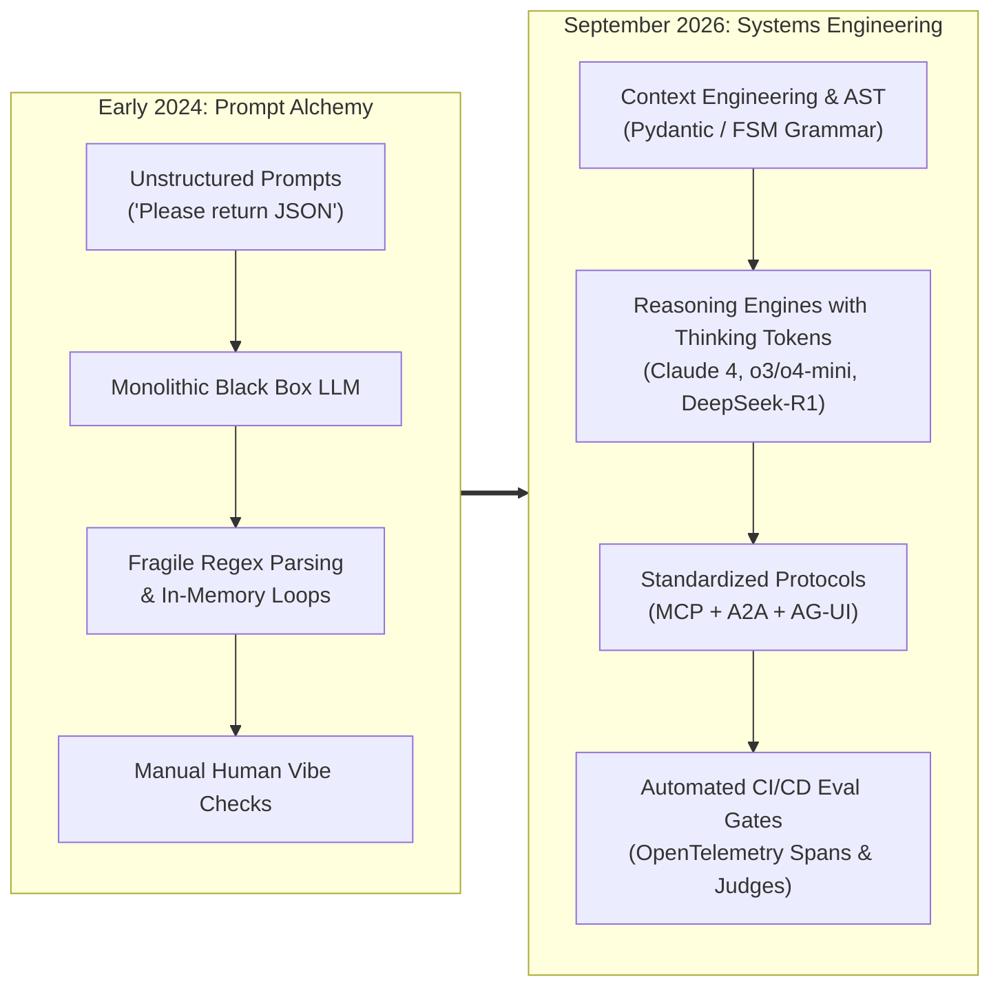
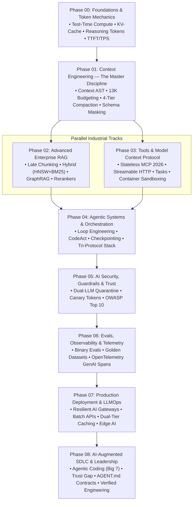
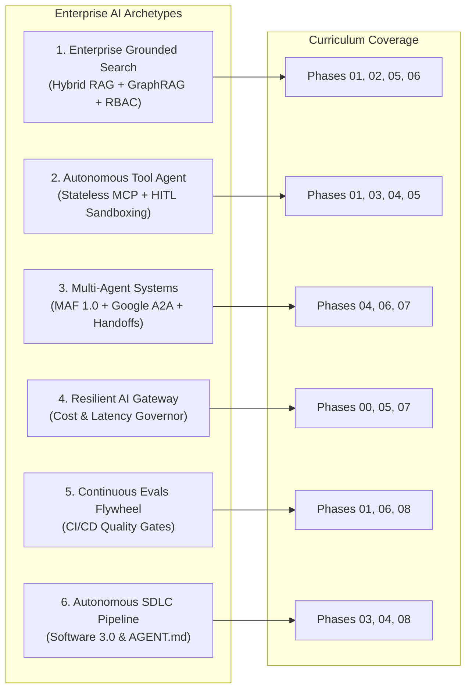
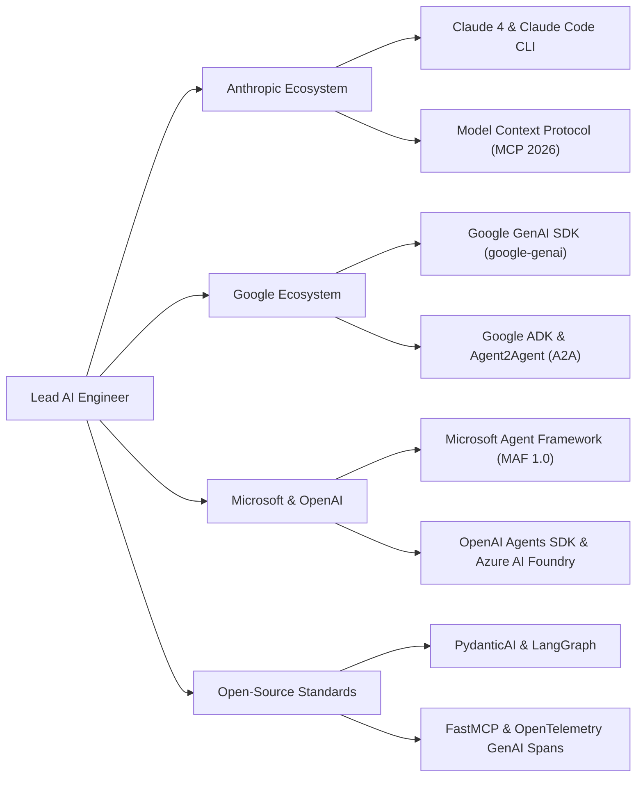

# 🚀 The AI-Native Engineer Roadmap
### Production Architecture, Autonomous Agents & Systems Engineering for Senior Tech Leads

> **The Definitive Engineering Curriculum**: Moving developers from fragile "vibe coding" and prompt alchemy to deterministic, production-grade **Software 3.0 systems engineering**.

Have you noticed how easy it is to build a mind-blowing AI demo over a weekend, but how brutally hard it is to keep it running in production on a Tuesday morning? 

When you move from traditional Software 1.0 (where an `if` statement behaves the exact same way every single time) to non-deterministic AI (where your core reasoning engine might hallucinate a JSON parameter or get trapped in an infinite loop), it's completely disorienting. 

This repository is not a collection of surface-level tutorials or marketing buzzwords. It is a battle-tested **architectural masterclass** treating Large Language Models not as magical oracles, but as **probabilistic reasoning microservices** governed by deterministic harnesses: finite-state-machine schemas, standardized wire protocols (MCP), hardware-aware KV-caches, and automated CI/CD evaluation gates.

---

## 📑 Table of Contents

1. [The AI Engineering Landscape: Then vs. Now](#-the-ai-engineering-landscape-then-vs-now)
2. [Master Curriculum Syllabus (Phases 00–08)](#-master-curriculum-syllabus)
3. [Recommended Learning Paths](#-recommended-learning-paths)
4. [Hands-On Practice Labs Showcase](#-hands-on-practice-labs-showcase)
5. [The Premier Standalone Engineering Guides](#-the-premier-standalone-engineering-guides)
6. [Enterprise Architecture Blueprints](#-enterprise-architecture-blueprints)
7. [Enterprise Protocols & Ecosystem Alignment](#-enterprise-protocols--ecosystem-alignment)
8. [Architectural Mastery Tiers](#-architectural-mastery-tiers)
9. [⚡ Quick Navigation & Reference Hub](#-quick-navigation--reference-hub)

---

## 🕐 The AI Engineering Landscape: Then vs. Now

If you stepped away from AI engineering in early 2024 and returned today, you wouldn't just find smarter models—you would find an entirely different engineering discipline:

### 📊 Architectural Evolution

| Dimension | Early 2024 (Software 2.0 / Prompt Era) | September 2026 (Software 3.0 / Systems Era) |
|:---|:---|:---|
| **Core Skill** | Prompt Engineering (phrasing tricks) | **Context Engineering** (compiled ASTs, budgeting, compaction) |
| **Agent Maturity** | Research demos & fragile while-loops | **Loop Engineering** (action fingerprints, progressive budget decay) |
| **Tool Calling** | Ad-hoc JSON blobs & fragile regex | **Model Context Protocol (MCP)** (Linux Foundation standard) |
| **Memory Architecture** | Raw chat history dumps in RAM | **4-Tier Memory Taxonomy** (Working, Short-Term, Long-Term, MaaS) |
| **Multi-Agent Systems** | Uncontrolled conversational chatter | **Tri-Protocol Stack** (MCP + Google A2A + AG-UI) |
| **Reasoning Engine** | Manual Chain-of-Thought prompts | **Native Thinking Tokens** (o3/o4-mini, Claude Thinking, DeepSeek-R1) |
| **Context Ceilings** | 8K–128K tokens (frequent OOMs) | **200K–2M+ tokens** (MECW awareness & prompt caching) |
| **Cost Profile** | \$30–60 / 1M tokens (GPT-4) | **\$0.075–3.00 / 1M tokens** (200x spread, 50% off Batch APIs) |
| **Regulatory Compliance** | Voluntary best practices | **EU AI Act Enforced** (GPAI obligations, crypto-shredding) |
| **Coding Workflow** | Single-line tab autocomplete | **Autonomous Agentic Coding** (Claude Code CLI, Cursor, Windsurf) |

---

## 🗺️ Master Curriculum Syllabus

The curriculum progresses systematically from silicon and hardware inference realities up to multi-agent orchestration and engineering leadership:

### 📚 Syllabus & Module Directory

| Phase | Module Name | Core Architectural Deliverables | Duration | Target Level |
|:---:|:---|:---|:---:|:---:|
| **00** | [**Foundations & Token Mechanics**](./00-foundations-and-token-mechanics/README.md) | Transformer physical reality, KV-cache sizing, memory bandwidth, prefill vs decode, reasoning models (test-time compute), thinking token economics, and SLMs (Phi-4, Gemma 2). | 1 Week | Senior |
| **01** | [**Context Engineering: The Master Discipline**](./01-prompt-and-context-engineering/README.md) | Context AST architecture, 13K token budgeting portfolios, Prefix & Context Caching optimization, 4-tier compaction pipeline, Lost-in-the-Middle mitigation, and MECW context rot. | 1 Week | Senior |
| **02** | [**RAG & Knowledge Systems**](./02-rag-and-knowledge-systems/README.md) | Chunking strategies, Late Chunking, Hybrid Search (Dense HNSW + Sparse BM25), Reciprocal Rank Fusion (RRF), ACORN predicate-filtered search, DiskANN, and GraphRAG. | 2 Weeks | Lead |
| **03** | [**Tools & Model Context Protocol (MCP)**](./03-tools-and-model-context-protocol/README.md) | The Linux Foundation MCP standard, Stateless Core (July 2026), Streamable HTTP/SSE, Zero-Trust Tool Sandboxes (MicroVMs), financial idempotency keys, and tool schema caching. | 1 Week | Lead |
| **04** | [**Agentic Systems & Orchestration**](./04-agentic-systems-and-orchestration/README.md) | Event-Sourced Write-Ahead Log (WAL), crash rehydration, Loop Engineering (action hashing, budget decay), Microsoft Agent Framework (MAF GA), and the Tri-Protocol stack. | 2 Weeks | Staff |
| **05** | [**AI Security, Guardrails & Trust**](./05-ai-security-and-guardrails/README.md) | OWASP Top 10 for GenAI, Dual-LLM Quarantine pattern, cryptographic canary tokens, PII masking vaults, prompt injection defense, and egress filtering. | 1 Week | Lead |
| **06** | [**Evals, Observability & Telemetry**](./06-evals-and-observability/README.md) | Automated evaluation flywheels, multi-turn tool trajectory FSM validation, groundedness judges, and the dedicated OpenTelemetry `semantic-conventions-genai` repo standards. | 1 Week | Lead |
| **07** | [**Production Deployment & LLMOps**](./07-production-deployment-and-llmops/README.md) | Multi-provider resilient AI gateways, Token-Bucket TPM/RPM throttling, vector semantic caching, Batch APIs (50% discount), and Edge AI deployment. | 2 Weeks | Lead/Ops |
| **08** | [**AI-Augmented SDLC & Leadership**](./08-ai-augmented-sdlc-and-leadership/README.md) | The Big Seven agentic coding tools (Claude Code, Cursor, Windsurf), The Trust Gap (90% usage vs 29% trust), Verified Agentic Engineering, and machine-readable `AGENT.md` contracts. | Ongoing | Executive |

---

## 📖 Recommended Learning Paths

Choose the track tailored to your current focus and engineering background:

| Track | Objective | Target Modules | Primary Outcome |
|:---|:---|:---|:---|
| **Track 1: Precision Core & RAG** | Master retrieval and grounding | Phases 00 → 01 → 02 → 06 | Production-grade grounded search with Late Chunking, ACORN predicate search, GraphRAG, cross-encoder rerankers, and continuous evaluation gates. |
| **Track 2: Autonomous Agent Architect** | Build resilient tool-using swarms | Phases 01 → 03 → 04 → 05 | Stateful agents with strict JSON schemas, Stateless MCP servers, Google A2A protocol, loop engineering, and dual-LLM quarantine. |
| **Track 3: Production LLMOps & Leadership** | Enterprise infrastructure & governance | Phases 06 → 07 → 08 → Master Guides | Resilient multi-provider gateways, Batch API processing, OpenTelemetry tracing, `AGENT.md` codebase contracts, and EU AI Act compliance. |
| **Track 4: Senior AI Platform & Agent Infrastructure** | Master the unified agent harness & vector platform | Phases 01 → 02 → 03 → 04 → 06 → 07 → [AgentForge](./agent-forge) | Production AI platform core: cache-aware gateway, durable WAL agent loop, MCP zero-trust execution, ACORN predicate-filtered search, and OTel GenAI telemetry. |

---

## 🧪 Hands-On Practice Labs Showcase

Master production patterns through runnable, verified implementations in Python (Pydantic v2) and C# (.NET 9):

| Lab | Name | Core Architectural Deliverable | Lab Location |
|:---:|:---|:---|:---|
| **01** | **Stateful Agent with HITL Approval** | Cyclical state machine with graph reducers, durable checkpointing, and execution pause/resume for human authorization. | [`lab1-stateful-agent-hitl.md`](./04-agentic-systems-and-orchestration/labs/lab1-stateful-agent-hitl.md) |
| **02** | **Multi-Agent Swarm with A2A Handoffs** | Dynamic specialist handoffs using the Agent2Agent (A2A) protocol with correlation tracking and envelope validation. | [`lab2-multi-agent-swarm.md`](./04-agentic-systems-and-orchestration/labs/lab2-multi-agent-swarm.md) |
| **03** | **Infinite Loop & Deadlock Recovery** | Cryptographic SHA-256 tool hashing, ring-buffer cycle detection, and progressive budget decay governors. | [`lab3-infinite-loops.md`](./04-agentic-systems-and-orchestration/labs/lab3-infinite-loops.md) |
| **04** | **Distributed Agent Saga Pattern** | Two-phase tool commits with forward actions and compensating rollback tools for failed external operations. | [`lab4-saga-pattern.md`](./04-agentic-systems-and-orchestration/labs/lab4-saga-pattern.md) |
| **05** | **Agent Memory & State Management** | 4-tier memory taxonomy (Working, Short-Term, Long-Term Semantic/Episodic), Ebbinghaus decay, MaaS, and GDPR crypto-shredding. | [`lab5-agent-memory-system.md`](./04-agentic-systems-and-orchestration/labs/lab5-agent-memory-system.md) |
| **06** | **Multimodal Vision & Document Agent** | High-resolution document tiling math, white-text visual injection quarantine, and schema-grounded financial invoice extraction. | [`lab6-multimodal-agent.md`](./04-agentic-systems-and-orchestration/labs/lab6-multimodal-agent.md) |
| **07** | **Enterprise Platform Core (`agent-forge`)** | Production reference implementation combining AI gateway, WAL crash rehydration, MCP 2026, ACORN/RRF hybrid retrieval, and OTel GenAI tracing. | [`agent-forge/`](./agent-forge/README.md) |

*For end-to-end module capstones (Token Economics Analyzer, Context Pipeline, Enterprise RAG Pipeline, MCP Server, Security Guardrails, and CI/CD Eval Gate), see each phase's `labs/` directory.*

---

## 🌟 The Premier Standalone Engineering Guides

In addition to the 9 curriculum phases, this repository provides authoritative enterprise reference playbooks, audit gates, and architectural records:

* 🏗️ [**Senior AI Platform & Agent Infrastructure Roadmap**](./ai-platform-and-agent-infrastructure-roadmap.md): The unified preparation curriculum and systems guide for Agent Harness Platform Engineers and Vector/RAG Platform Architects, featuring zero-trust tool execution, durable event loops, and OpenTelemetry GenAI observability.
* ⚒️ [**AgentForge Reference Platform (MVP / POC)**](./agent-forge/README.md): Complete, runnable reference implementation of an enterprise AI platform core with hybrid retrieval (BM25 + Dense + RRF), Model Context Protocol (MCP 2026), Write-Ahead Log (WAL) crash resilience, and automated CI/CD quality gates.
* 🛡️ [**The AI Production Readiness Review (PRR) Audit Gate**](./architecture/production-readiness-review.md): The 50-point enterprise go-live audit checklist across availability, token budgets, sandboxing, durability, OpenTelemetry, and EU AI Act compliance.
* 🏛️ [**AI Architecture Decision Records (ADRs)**](./architecture/adrs/README.md): Formal trade-off records settling foundational debates (`pgvector` vs Qdrant, Model Context Protocol vs REST, System 2 reasoning vs SLMs, RadixAttention vs external memory).
* 🚨 [**Production Post-Mortems & Failure Compendium**](./architecture/post-mortems/README.md): Detailed SRE root-cause analyses (RCAs) of catastrophic production outages, cascading KV-cache stampedes, silent feature leakage, and cyclic agent deadlocks.
* 🗺️ [**Emerging AI Technology Roadmap (2025–2026)**](./ai-technology-roadmap-2025-2026.md): Strategic roadmap covering test-time compute, Model Context Protocol (MCP), MicroVM sandboxing, RadixAttention KV-caching, GraphRAG, and ISO 42001 governance.
* 🎯 [**High-Stakes Behavioral & Scenario Interview Guide**](./interview/high-stakes-behavioral-and-scenario-guide.md): Battle-tested guide for Senior, Staff, and AI Engineers tackling crisis leadership, cascading production outages, silent ML data leakage, and the CARL+S framework.
* 🚨 [**Top 15 Beginner Mistakes in AI Engineering**](./resources/beginner-mistakes-cheatsheet.md): 15 catastrophic anti-patterns (prompt begging, runaway loops, prefix taint, unsandboxed SQL tools, vibe checks) with 2:00 AM war stories, ELI10 analogies, and concrete code fixes.
* ⚖️ [**AI Governance, Compliance & EU AI Act Guide**](./resources/ai-governance-and-compliance-guide.md): Practical engineering checklist for EU AI Act enforcement, 4-tier risk classification, GPAI model rules, NIST AI RMF, and GDPR Article 17 crypto-shredding.
* 🏗️ [**10 Enterprise AI System Designs**](./architecture/10-enterprise-ai-system-designs.md): Complete end-to-end system design blueprints (Problem Statement, Architectural Approach, Mermaid Diagrams, and Architect Notes) for core enterprise patterns.
* 🎯 [**80/20 AI System Design Interview Prep Sheet**](./interview/80-20-ai-interview-prep-sheet.md): Master cheat sheet for Senior & Staff AI Engineer interviews, covering 5 master system designs, 25 architect Q&As, and tradeoff matrices.
* 📘 [**The Senior AI Engineer & Architect Transition Guide**](./senior-transition-guide.md): The definitive guide for Senior Software Engineers transitioning from Software 1.0/2.0 to AI-Native Engineering, featuring a 90-day execution roadmap.

---

## 🏢 Enterprise Architecture Blueprints

The curriculum maps directly to the six primary enterprise AI architectural archetypes:

---

## 🏛️ Enterprise Protocols & Ecosystem Alignment

Modern AI systems engineering relies on open, standardized protocols rather than proprietary walled gardens:

---

## 🎯 Architectural Mastery Tiers

Every topic across the curriculum is classified using a pragmatic 3-tier taxonomy so you can prioritize your study time:

* **[MUST-HAVE] 🔴 (The 80% Core)**: Non-negotiable primitives, production failure modes, and architectural standards required to build systems that survive in production without crashing or overspending.
* **[GOOD-TO-HAVE] 🟡 (The 15% Advanced)**: Edge-case optimizations, emerging protocols, and multi-agent coordination patterns that separate Senior from Staff AI Engineers.
* **[KNOWLEDGE-BASE] 🔵 (The 5% Deep Theory)**: Historical context, hardware physics, and foundational papers for comprehensive mastery.

---

## ⚡ Quick Navigation & Reference Hub

* 🛡️ [**AI Production Readiness Review (PRR)**](./architecture/production-readiness-review.md): 50-point enterprise go-live audit gate (availability, token caps, sandboxing, evals).
* 🏛️ [**AI Architecture Decision Records (ADRs)**](./architecture/adrs/README.md): Battle-tested decisions on vector DBs, MCP, reasoning models, and KV caching.
* 🚨 [**Production Post-Mortems Compendium**](./architecture/post-mortems/README.md): Detailed blameless RCAs on cache stampedes, feature leakage, and agent loops.
* 🗺️ [**Emerging AI Technology Roadmap (2025–2026)**](./ai-technology-roadmap-2025-2026.md): Test-time compute, MCP, MicroVM sandboxing, RadixAttention KV caching, GraphRAG, and 12-month adoption timeline.
* 🎯 [**High-Stakes Behavioral & Scenario Interview Guide**](./interview/high-stakes-behavioral-and-scenario-guide.md): The CARL+S framework, 6 crisis archetypes, production outage scripts, and silent ML drift post-mortems.
* 🏗️ [**10 Enterprise AI System Designs**](./architecture/10-enterprise-ai-system-designs.md): End-to-end architectures (Problem, Approach, Block Diagram, Architect Notes).
* 🚨 [**Top 15 Beginner Mistakes Cheatsheet**](./resources/beginner-mistakes-cheatsheet.md): 15 catastrophic AI anti-patterns, production war stories, and architectural remedies.
* ⚖️ [**AI Governance & Compliance Guide**](./resources/ai-governance-and-compliance-guide.md): Practical engineering checklist for EU AI Act, NIST RMF, and GDPR crypto-shredding.
* 📘 [**The Senior Transition Guide**](./senior-transition-guide.md): The Software 1.0 → 3.0 shift, polyglot matrix, and 90-day execution plan.
* 🎯 [**80/20 System Design Interview Prep**](./interview/80-20-ai-interview-prep-sheet.md): 5 master blueprints, 25 architect Q&As, and tradeoff cheat sheets.
* 📑 [**Comprehensive Resource Map**](./resources/topics-and-resource-map.md): Direct links to official provider docs, SDKs, and courses across 24 phases.
* 🛠️ [**Master Resource Index**](./resources/resource-index.md): Curated documentation, seminal papers, and enterprise frameworks.
