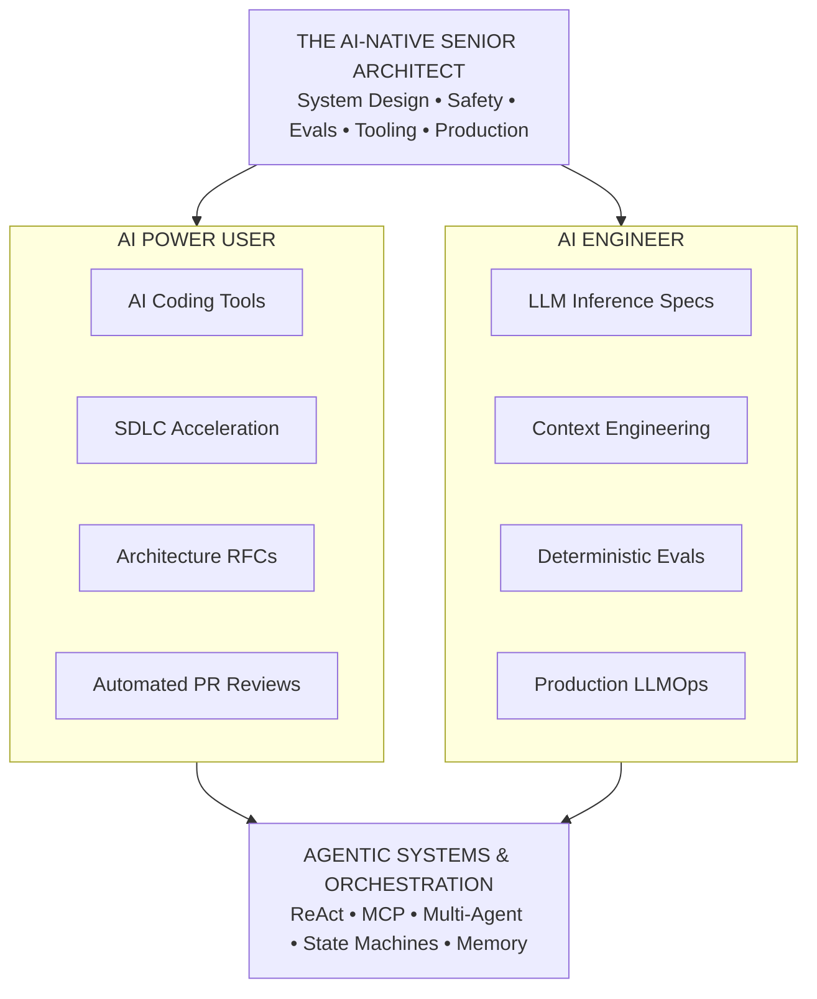
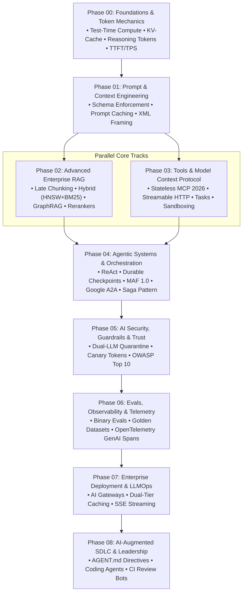
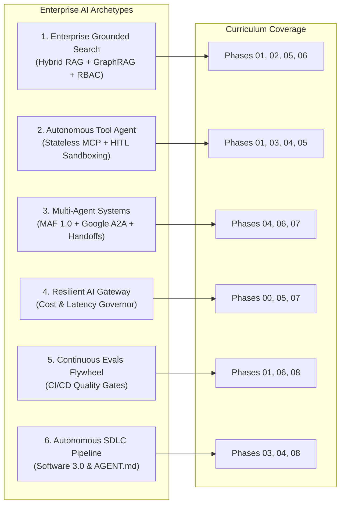
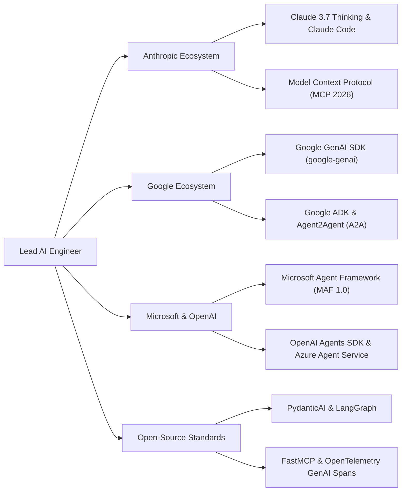

# AI Engineer & Agentic Systems Roadmap: Senior & Lead Developer Edition

> **A production-focused engineering masterclass for Senior Engineers, Tech Leads, and Software Architects building enterprise AI applications and autonomous agentic systems.**

Have you noticed how easy it is to build a mind-blowing AI demo over a weekend, but how brutally hard it is to keep it running in production on a Tuesday morning? 

When you move from traditional Software 1.0 (where an `if` statement behaves the exact same way every single time) to non-deterministic AI (where your core reasoning engine might hallucinate a JSON parameter or get trapped in an infinite loop), it's completely disorienting. 

This roadmap isn't a fluffy list of AI tools or marketing jargon. It's a pragmatic engineering blueprint. We are going to treat LLMs not as magic oracles, but as **probabilistic reasoning microservices** that need strict deterministic harnesses—think rate limits, bounded state machines, typed schemas, and human-in-the-loop authorization gates.

---

---

## 🗺️ Master Curriculum Progression

> **Rule of Thumb:** Don't skip straight to building multi-agent swarms. If you don't understand underlying inference physics (like the KV-Cache) or prompt caching economics, your agents will be slow, expensive, and fragile. Learn the physics first.

The curriculum is structured sequentially from inference physics to autonomous multi-agent systems and engineering leadership:

---

## 📚 Curriculum Structure & Phased Syllabus

| Phase | Directory | Focus & Key Deliverables | Estimated Time | Level |
|:---:|:---|:---|:---:|:---:|
| **00** | [**Foundations & Token Mechanics**](./00-foundations-and-token-mechanics/README.md) | Test-time compute & reasoning tokens (Claude 3.7 Thinking, OpenAI o1/o3-mini, DeepSeek R1), KV-Cache VRAM sizing formulas, TTFT vs TPS, PagedAttention. | 1-2 Weeks | Core |
| **01** | [**Prompt & Context Engineering**](./01-prompt-and-context-engineering/README.md) | Prompt hierarchy, Anthropic XML tags, FSM constrained grammar decoding, 5-min ephemeral prompt caching economics. | 2 Weeks | Core |
| **02** | [**Advanced Enterprise RAG**](./02-rag-and-knowledge-systems/README.md) | **4 Sub-Phases**: 2.1 Late Chunking & Multimodal Parsing • 2.2 Hybrid Search (Dense HNSW + BM25) • 2.3 Agentic RAG & GraphRAG • 2.4 Cross-Encoder Reranking & RBAC. | 2-3 Weeks | Advanced |
| **03** | [**Tools & Model Context Protocol**](./03-tools-and-model-context-protocol/README.md) | **MCP July 2026 Stateless Core**, Streamable HTTP transport, FastMCP servers, Tasks Extension for background jobs, CIMD auth, container sandboxing, HITL approval. | 2 Weeks | Advanced |
| **04** | [**Agentic Systems & Orchestration**](./04-agentic-systems-and-orchestration/README.md) | **5 Pillars**: 4.1 ReAct Cognitive Loops • 4.2 Durable State Checkpointing • 4.3 Swarms & Microsoft Agent Framework (MAF 1.0) • 4.4 Google Agent2Agent (A2A) Protocol • 4.5 Saga Pattern & Resilience. | 3 Weeks | Architect |
| **05** | [**AI Security, Guardrails & Trust**](./05-ai-security-and-guardrails/README.md) | OWASP LLM Top 10, Dual-LLM Privilege Separation (Quarantine), cryptographic canary tokens, NeMo / Llama Guard 3, ephemeral sandboxes. | 1-2 Weeks | Architect |
| **06** | [**Evals, Observability & Telemetry**](./06-evals-and-observability/README.md) | Hamel Husain 3-level evaluation model, binary LLM-as-a-judge rubrics, golden test sets, OpenTelemetry GenAI spans. | 2 Weeks | Architect |
| **07** | [**Production Deployment & LLMOps**](./07-production-deployment-and-llmops/README.md) | Serverless vs vLLM, LiteLLM Resilient AI Gateway, dual-tier caching (Exact SHA-256 + Vector), SSE streaming. | 2 Weeks | Lead/Ops |
| **08** | [**AI-Augmented SDLC & Leadership**](./08-ai-augmented-sdlc-and-leadership/README.md) | Autonomous coding agents (Claude Code, Cursor, Windsurf), `AGENT.md` contracts, AI-driven TDD verification, automated PR review. | Ongoing | Executive |
| **Playbook** | [**Senior Transition Guide**](./senior-transition-guide.md) | Software 1.0 $\to$ 3.0 shift, 6 enterprise use cases, 6 hands-on practice labs, and 90-day execution roadmap. | 1 Week | Staff/Lead |
| **Interview** | [**80/20 Interview Prep Sheet**](./interview/80-20-ai-interview-prep-sheet.md) | Master System Design Blueprints, 25 architect technical Q&As, tradeoff cheat matrices, and hardware formulas. | Continuous | Master |
| **Resource Map** | [**Comprehensive Resource Map**](./resources/topics-and-resource-map.md) | Phase-by-phase reference linking all 24 topics to official documentation, courses, and GitHub repositories. | Reference | All Levels |

---

## 🎯 Architectural Mastery Tiers

> **War Story:** I once saw a team spend three months and \$50,000 trying to train a custom model for extracting invoices, only to realize that a well-written prompt with a strict JSON schema and Anthropic's 5-minute cache could do it better, faster, and cheaper. Spend your energy where it actually counts.

Every topic across this roadmap is tagged with a 3-tier classification to focus your engineering energy where it delivers maximum ROI:

| Tier | Meaning & Scope | Focus Allocation |
|:---|:---|:---:|
| `[MUST-HAVE]` 🔴 | **Production Invariants & Core Architecture**: Essential for enterprise applications, production reliability, immediate business ROI, and system architecture. Non-negotiable foundation. | **80% Focus** |
| `[GOOD-TO-HAVE]` 🟡 | **Advanced Scaling & Complex Orchestration**: Swarm handoffs, specialized memory graphs, custom guardrails, latency optimizations, and high-concurrency scaling. | **15% Focus** |
| `[KNOWLEDGE-BASE]` 🔵 | **Conceptual Reference & Architectural Intuition**: Mathematical derivations, training physics, and hardware formulas. Understand mental models; skip coding from scratch. | **5% Focus** |

---

## 📖 Recommended Reading Paths

| Track | Objective | Target Phases | Key Outcome |
|:---|:---|:---|:---|
| **Path A** | **Enterprise Knowledge & Advanced RAG** | Phases 00 $\to$ 01 $\to$ 02 $\to$ 06 | Production grounded search with Late Chunking (highlighting the whole page instead of shredding it first), GraphRAG, cross-encoder reranking, and discrete binary evaluation. |
| **Path B** | **Autonomous Tool-Using Agents & Swarms** | Phases 01 $\to$ 03 $\to$ 04 $\to$ 05 | Stateful agents with strict JSON schemas, Stateless MCP 2026 (USB-C for AI), Google A2A protocol, durable state machines, and dual-LLM quarantine. |
| **Path C** | **LLMOps, Infrastructure & Leadership** | Phases 07 $\to$ 08 $\to$ Playbook $\to$ Interview | Resilient multi-provider gateways, OpenTelemetry tracing, `AGENT.md` repository directives, and system design mastery. |

---

## 🧪 Hands-On Practice Labs

Master production patterns by building and verifying these standalone reference implementations:

| Lab | Name | Core Architectural Deliverable | Lab File |
|:---:|:---|:---|:---|
| **01** | **Multi-Tenant Hybrid RAG** | BM25 + Dense HNSW search, Reciprocal Rank Fusion, and cross-encoder reranking with tenant isolation. | [View Lab](./labs/lab-01-multi-tenant-hybrid-rag.md) |
| **02** | **Tool Execution with MCP** | Model Context Protocol JSON-RPC 2.0 server & client with schema validation and container sandboxing. | [View Lab](./labs/lab-02-tool-execution-with-mcp.md) |
| **03** | **Stateful Agent Orchestration** | Directed state machine with graph reducers, durable SQLite checkpointing, and execution pause/resume. | [View Lab](./labs/lab-03-stateful-agent-orchestration.md) |
| **04** | **Agent Failure Defense** | Rolling SHA-256 action loop detection, blast radius previews, and automated context compaction at 75% capacity. | [View Lab](./labs/lab-04-agent-failure-defense.md) |
| **05** | **AI Observability & Tracing** | Distributed tracing with OpenTelemetry GenAI semantic spans, token metrics, and Jaeger/Langfuse export. | [View Lab](./labs/lab-05-ai-observability-tracing.md) |
| **06** | **Dual-LLM Quarantine & Guardrails** | Unprivileged Reader LLM parsing untrusted input, cryptographic canary tokens, and egress leakage filters. | [View Lab](./labs/lab-06-dual-llm-quarantine-guardrails.md) |

*For comprehensive module-specific capstones (e.g., Code Review Engine, CI/CD Eval Gate, Resilient AI Gateway), see each module's `labs/` directory.*

---

## 🏢 Enterprise Architecture Blueprints

The curriculum maps directly to the six primary enterprise AI architectural archetypes:

*Detailed architectural specifications, failure modes, and code samples for each blueprint are in [**`senior-transition-guide.md`**](./senior-transition-guide.md#4-deep-dive-on-the-6-senior-enterprise-ai-use-cases).*  
*For end-to-end production architectures with block diagrams, problem statements, and architect notes, see [**`10 Enterprise AI System Designs`**](./architecture/10-enterprise-ai-system-designs.md).*

---

## 🏛️ Ecosystem Alignment

---

## ⚡ Quick Navigation & Reference Hub

- 🏗️ [**10 Enterprise AI System Designs**](./architecture/10-enterprise-ai-system-designs.md): End-to-end architectures (Problem, Approach, Block Diagram, Architect Notes).
- 📘 [**The Senior Transition Guide**](./senior-transition-guide.md): The Software 1.0 $\to$ 3.0 shift, polyglot matrix, and 90-day execution plan.
- 🎯 [**80/20 System Design Interview Prep**](./interview/80-20-ai-interview-prep-sheet.md): 5 master blueprints, 25 architect Q&As, and tradeoff cheat sheets.
- 📑 [**Comprehensive Resource Map**](./resources/topics-and-resource-map.md): Direct links to official provider docs, SDKs, and courses across 24 phases.
- 🛠️ [**Master Resource Index**](./resources/resource-index.md): Curated documentation, seminal papers, and enterprise frameworks.
