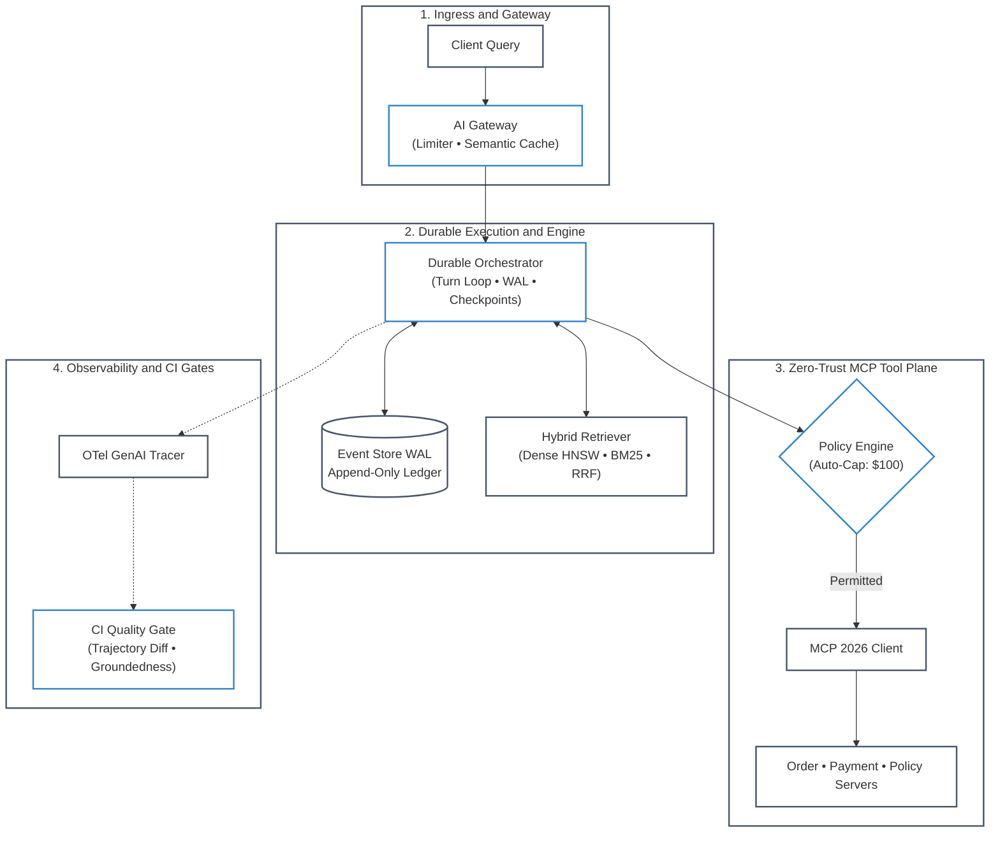

# ⚒️ AgentForge: Enterprise AI Platform & Retrieval Engine (MVP / POC)

[](#-architecture-overview)
[](requirements.txt)
[](#-open-telemetry-genai-tracing)

> **A Complete, Battle-Tested Reference Implementation of an Enterprise AI Platform Core.**  
> Designed to demonstrate the exact intersection of **Agent Platform Engineering** and **Vector Retrieval Architecture**.

---

## 🎯 What is AgentForge?

Most agent tutorials implement naive, in-memory `while` loops that break in production. If a server container restarts, if an LLM returns a malformed JSON argument, or if a network glitch triggers a retry, standard agent code either loses state or accidentally charges a user's credit card twice.

**AgentForge** is an enterprise-grade reference platform demonstrating how to govern probabilistic AI models with deterministic distributed systems engineering:

* **Resilient Model Gateway:** Token-bucket rate limiting (RPM/TPM per tenant), vector semantic caching, and prefix-cache-aware cost calculation.
* **Durable Agent Runtime:** Event-sourced Write-Ahead Logging (WAL), state checkpointing, and crash recovery (rehydration).
* **Model Context Protocol (MCP 2026):** Micro-servers for Orders, Payments, and Policies communicating via structured tool schemas.
* **Zero-Trust Security & Idempotency:** Parameter validation, threshold-based human approval checkpoints, and deterministic idempotency keys for financial transactions.
* **Hybrid Retrieval Engine:** Combines dense semantic vector search with sparse BM25 lexical search using Reciprocal Rank Fusion (RRF) and metadata filtering.
* **Automated CI/CD Quality Gates:** Multi-turn tool trajectory verification, hallucination/groundedness assertion, and cost/latency tracking.
* **OpenTelemetry GenAI Observability:** Distributed trace waterfalls adhering to the dedicated `semantic-conventions-genai` standards.

---

## 🏛️ Architecture Overview

The system is decomposed into 6 decoupled, single-responsibility modules:



#### Architecture Walkthrough:
1. **Ingress Check**: The AI Gateway intercepts incoming client queries, evaluates tenant rate limits via a streaming token bucket, and checks the vector semantic cache for instant hits.
2. **Hybrid Knowledge Retrieval**: Uncached queries trigger the hybrid retrieval engine, querying dense embeddings and sparse BM25 indices simultaneously with Reciprocal Rank Fusion ($k=60$).
3. **Durable Orchestration Loop**: The agent plans multi-turn steps, committing every turn and tool call to an append-only Write-Ahead Log (WAL) event store for crash recovery.
4. **Zero-Trust Policy Validation**: Proposed tool calls pass through an ABAC policy engine. Operations exceeding risk thresholds (e.g. refunds $> \$100$) pause execution for approval.
5. **Telemetry & CI Quality Gate**: OpenTelemetry GenAI spans record latency, tokens, and cost. Automated evals check trajectory compliance and factual groundedness before final emission.

---

## 🗺️ Curriculum & Hands-On Lab Alignment

AgentForge serves as the reference production platform tying together the curriculum's canonical phases and labs:

| Submodule | Target Phase | Hands-On Lab | Architectural Responsibility |
| :--- | :--- | :--- | :--- |
| `agent_forge/gateway/` | [Phase 01](../phase-01/) | [Lab 04: Agent Failure Defense](../labs/lab-04-agent-failure-defense.md) | Token bucket rate limiter, semantic cache, prefix cache optimization |
| `agent_forge/retrieval/` | [Phase 02](../phase-02/) | [Lab 01: Multi-Tenant Hybrid RAG](../labs/lab-01-multi-tenant-hybrid-rag.md) | ACORN-1 predicate traversal, BM25 + dense HNSW, RRF fusion, tombstones |
| `agent_forge/mcp/` | [Phase 03](../phase-03/) | [Lab 02: Tool Execution with MCP](../labs/lab-02-tool-execution-with-mcp.md) | JSON-RPC 2.0 stdio/SSE client, zero-trust policy engine, tool servers |
| `agent_forge/runtime/` | [Phase 04](../phase-04/) | [Lab 03: Stateful Agent Orchestration](../labs/lab-03-stateful-agent-orchestration.md) | Durable orchestrator loop, event-sourced WAL, tool repair, crash rehydration |
| `agent_forge/mcp/policy_engine.py` | [Phase 05](../phase-05/) | [Lab 06: Dual-LLM Quarantine Defenses](../labs/lab-06-dual-llm-quarantine-guardrails.md) | Zero-trust parameter validation, financial caps, idempotency keys |
| `agent_forge/evals/` | [Phase 06](../phase-06/) | [Lab 05: AI Observability & Tracing](../labs/lab-05-ai-observability-tracing.md) | Deterministic trajectory diff, groundedness evaluator, LLM-as-judge |
| `agent_forge/observability/` | [Phase 07](../phase-07/) | [Lab 05: AI Observability & Tracing](../labs/lab-05-ai-observability-tracing.md) | OpenTelemetry GenAI semantic conventions, trace waterfall export |
| `tests/test_all.py` & `demo.py` | [Phase 08](../phase-08/) | [E2E Platform Verification](../labs/README.md) | CI/CD test gates, automated regression harness, multi-turn replay |

---

## 📂 Directory Layout

```
agent-forge/
├── README.md                      # This comprehensive architectural guide
├── requirements.txt               # Dependencies (pure Python 3.10+ & Pydantic)
├── demo.py                        # Executable end-to-end production simulation
├── tests/
│   └── test_all.py                # Complete unit test suite (10/10 passing)
└── agent_forge/
    ├── gateway/
    │   ├── model_router.py        # Multi-provider routing, failover, & prefix caching
    │   ├── semantic_cache.py      # Vector cosine query cache
    │   └── rate_limiter.py        # Streaming token-bucket limiter (acquire & settle)
    ├── runtime/
    │   ├── orchestrator.py        # Durable agent loop, automated tool repair, WAL
    │   ├── event_store.py         # Write-Ahead Log (WAL) & crash rehydration
    │   └── state_models.py        # Strongly typed state envelopes (Pydantic)
    ├── mcp/
    │   ├── protocol.py            # Model Context Protocol JSON-RPC 2.0 client
    │   ├── policy_engine.py       # ABAC/RBAC zero-trust permission validator
    │   └── servers/               # Micro-MCP servers (Order, Payment, Policy)
    ├── retrieval/
    │   ├── vector_store.py        # Vector store with ACORN-1 predicate graph search & tombstones
    │   ├── bm25.py                # Pure-Python BM25 sparse lexical engine
    │   ├── hybrid_engine.py       # Reciprocal Rank Fusion (RRF) & metadata filtering
    │   └── embeddings.py          # Deterministic normalized embedding generator
    ├── evals/
    │   ├── trajectory_eval.py     # State machine validation for tool invocation order
    │   ├── groundedness.py        # Contextual faithfulness & anti-hallucination judge
    │   └── metrics.py             # Scorecard and cost reporting
    └── observability/
        ├── tracer.py              # OpenTelemetry GenAI semantic conventions instrumentation
        └── exporter.py            # Waterfall trace renderer
```

---

## ⚡ Quickstart: Running the End-to-End Demo

Clone the repository and run the self-contained demonstration:

```bash
cd agent-forge
python demo.py
```

### What the Demo Proves Live:
1. **Hybrid Retrieval**: Ingests a customer dispute query, runs dense vector similarity and sparse BM25 search in parallel, and merges candidate documents using Reciprocal Rank Fusion (\( k=60 \)).
2. **Durable Agent Loop**: Coordinates a multi-turn conversation where the model plans, calls `order_get_order`, inspects charges with `payment_get_transactions`, and checks refund eligibility against corporate policy.
3. **Crash Recovery**: Simulates a sudden process death, initializes a fresh orchestrator, and rehydrates the entire 9-message session state from the append-only event log.
4. **Idempotency Guarantee**: Retries the exact refund tool call to prove that duplicate charges are intercepted and deduplicated.
5. **OpenTelemetry GenAI Waterfall**: Outputs an end-to-end span tree with millisecond timings, token counts, and cost attribution.
6. **Automated CI Evaluation**: Runs deterministic trajectory validation and groundedness checks to assert that the agent took the authorized path without hallucination.

---

## 🔍 Deep-Dive: Core Engineering Concepts

### 1. Durable Execution vs. In-Memory While Loops
In standard agent frameworks, state is maintained as an in-memory Python list. If the pod restarts during a tool call, that context is destroyed.

AgentForge borrows **Write-Ahead Logging (WAL)** from database engines:
```python
# Every state mutation is appended as an immutable event
event_store.append(AgentEvent(
    session_id=session.session_id,
    turn_index=turn,
    event_type="tool_executing",
    payload={"tool": tool_call.name, "arguments": tool_call.arguments}
))
```
If a node crashes, `event_store.rehydrate_session(session_id)` loads the latest checkpoint and replays all subsequent events, restoring execution state seamlessly.

### 2. Reciprocal Rank Fusion (RRF)
Merging sparse BM25 scores (which range from 0 to 45+) and dense cosine similarities (which range from 0.0 to 1.0) with arbitrary weighting introduces bias. AgentForge implements Reciprocal Rank Fusion:
```text
RRF_Score(d) = Σ [ 1 / (k + rank_m(d)) ]  for m in {dense, sparse}
```
By default, `k = 60`. Documents appearing near the top of both search indices receive exponential rank boosts without fragile score normalization.

### 3. OpenTelemetry GenAI Semantic Conventions
Standard APM tools only monitor HTTP requests. AgentForge implements the dedicated `semantic-conventions-genai` taxonomy:
* `gen_ai.system`: `"anthropic"` / `"openai"`
* `gen_ai.request.model`: `"claude-3-5-sonnet-20241022"`
* `gen_ai.usage.input_tokens`: Input token usage with prompt cache tracking
* `gen_ai.tool.name`: Specific MCP tool invoked
* `idempotency_key`: Deduplication key tied to the span

---

## 💼 Interview Talking Points

When interviewing for Senior AI Platform Engineer or Vector Store Platform roles, use AgentForge as your concrete reference system:

* **On Reliability**: *"In AgentForge, I designed an event-sourced WAL where tool executions carry deterministic idempotency keys. Even if the network times out or the orchestrator retries, side-effecting operations like payment refunds are guaranteed to execute exactly once."*
* **On Retrieval Architecture**: *"Rather than relying exclusively on dense vector search, I implemented a hybrid retrieval engine combining BM25 lexical search with dense embeddings via Reciprocal Rank Fusion. This guarantees exact matches for order IDs while preserving semantic understanding of complex dispute policies."*
* **On Security**: *"I decoupled tool execution from the model using the Model Context Protocol (MCP 2026) governed by a zero-trust policy engine. Tool calls exceeding \$100 are automatically suspended into a `paused_for_approval` state machine rather than relying on LLM self-policing."*
