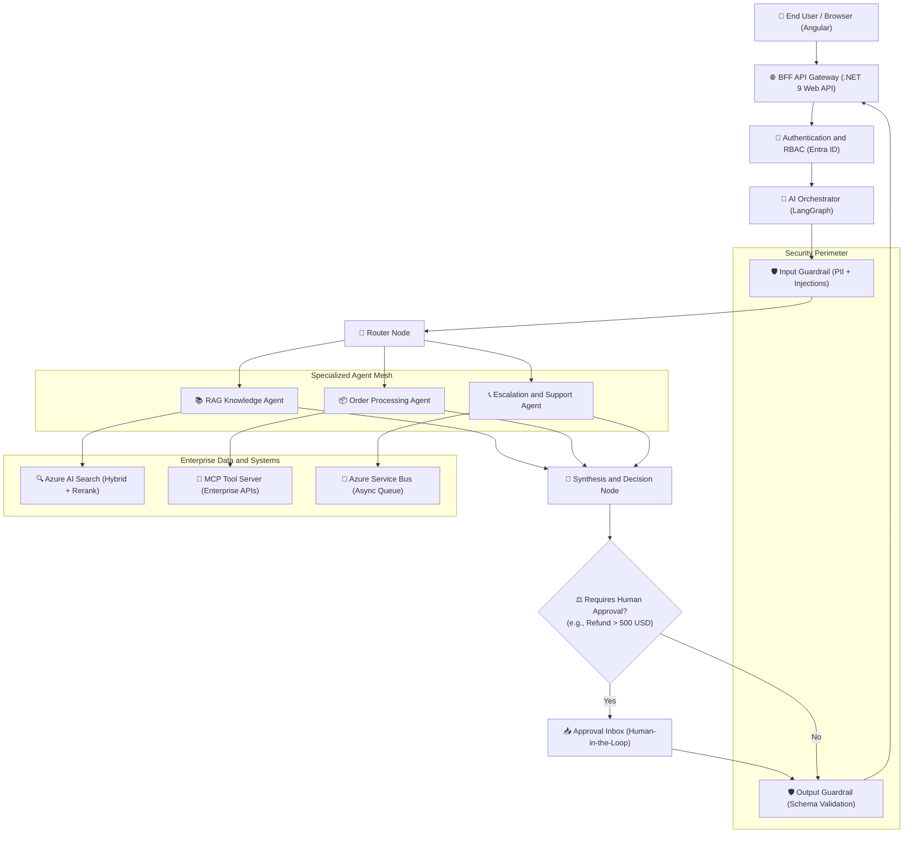

# 📖 Production AI & Agentic Engineering Glossary by Practice

> **The Definitive 1–2 Sentence Technical Glossary, Modern Keywords & Architectural Decision Matrix**  
> Formatted specifically for Senior Developers, Tech Leads, and AI Engineers transitioning into production AI and Agentic systems (2025–2026 Enterprise & TCS Interview Standard).

---

## 📑 Practice Directory

1. [LLM Fundamentals & Model Mechanics](#1-llm-fundamentals-model-mechanics)
2. [Prompt & Context Engineering](#2-prompt-context-engineering)
3. [Embeddings & Vector Databases](#3-embeddings-vector-databases)
4. [Retrieval-Augmented Generation (RAG) Architecture](#4-retrieval-augmented-generation-rag-architecture)
5. [Function Calling & Tool Execution](#5-function-calling-tool-execution)
6. [Agentic AI & Autonomous Decision Loops](#6-agentic-ai-autonomous-decision-loops)
7. [Agent Architecture Patterns](#7-agent-architecture-patterns)
8. [Workflows vs. Agents](#8-workflows-vs-agents)
9. [Frameworks: LangChain vs. LangGraph](#9-frameworks-langchain-vs-langgraph)
10. [Agent Memory & State Management](#10-agent-memory-state-management)
11. [Model Context Protocol (MCP)](#11-model-context-protocol-mcp)
12. [Multi-Agent Systems & Agent-to-Agent (A2A)](#12-multi-agent-systems-agent-to-agent-a2a)
13. [AI Security & Threat Mitigation](#13-ai-security-threat-mitigation)
14. [Guardrails & Validation Layers](#14-guardrails-validation-layers)
15. [Evaluation & LLM-as-a-Judge](#15-evaluation-llm-as-a-judge)
16. [Observability, Tracing & Telemetry](#16-observability-tracing-telemetry)
17. [Enterprise AI System Design & Scalability](#17-enterprise-ai-system-design-scalability)
18. [Enterprise Backend & Cloud Integration (.NET/Azure)](#18-enterprise-backend-cloud-integration-netazure)
19. [Python & DSA for AI Engineers](#19-python-dsa-for-ai-engineers)
20. [Machine Learning Foundations](#20-machine-learning-foundations)
21. [Transformer Architecture](#21-transformer-architecture)
22. [Engineering Decision Matrix (Trade-offs & Rules of Thumb)](#22-engineering-decision-matrix-trade-offs-rules-of-thumb)
23. [Enterprise Case Study: Operations Assistant Blueprint & Question Tree](#23-enterprise-case-study-operations-assistant-blueprint-question-tree)

---

## 1. LLM Fundamentals & Model Mechanics

*Core mechanics of generative models (LLMs), sampling behavior, compute constraints, and inference mechanics.*

| Term / Concept | 1–2 Sentence Explanation | Senior Engineering Context / Interview Takeaway |
| :--- | :--- | :--- |
| **Large Language Model (LLM)** | A deep neural network trained on massive amounts of text to predict the next word (token) in a sequence. It serves as a reasoning and generation engine rather than a traditional database. | Foundation runtime for enterprise agents and text pipelines. |
| **Token** | The atomic unit of text comprehension and generation in an LLM, typically representing 3–4 characters or a subword fragment. LLM pricing, compute latency, and memory consumption scale directly with total token count. | Governs API operating costs, throughput planning, and chunk sizing. |
| **Next-Token Prediction** | The fundamental training and inference process where the AI predicts text one token at a time based on odds, not database lookup. It calculates probabilities across its vocabulary to select each next token sequentially. | Essential mental model: an LLM is a probabilistic token predictor, not a database. |
| **Context Window** | The maximum token budget (prompt plus generated response) an LLM can process in a single inference call. Exceeding this boundary causes input truncation or catastrophic failure to retain earlier conversational details. | Requires active context pruning, chunking, or rolling memory. |
| **Context Window Overflow** | An error or silent truncation state occurring when prompt tokens combined with generation requests surpass the model's hard maximum limit. Production systems prevent this through pre-call token metering, sliding-window buffers, and summarization. | A critical runtime vulnerability that leads to dropped user instructions. |
| **Token Embeddings** | The initial mathematical projection of discrete token IDs into dense continuous vector space where semantic and syntactic relationships are encoded. They translate raw text inputs into numeric representations that transformer layers can compute. | The entry point where token sequences enter the transformer matrix math. |
| **Attention Mechanism** | The computational layer allowing each token in a sequence to dynamically weigh the importance and contextual relevance of every other token. It enables models to resolve long-range dependencies, pronoun references, and semantic associations. | The mathematical engine that replaced recurrent neural networks (RNNs). |
| **Transformer Block** | The fundamental repeating architectural module consisting of multi-head self-attention, layer normalization, residual connections, and feed-forward networks. Stacking these blocks creates deep foundation models capable of complex emergent reasoning. | Parameter count scales directly with the number and dimension of these blocks. |
| **Inference** | The operational execution phase where a trained model processes an input prompt and generates output tokens sequentially. Unlike static API lookups, inference is compute-intensive, memory-bandwidth bound, and carries non-zero latency per token. | Dictates hosting architecture, GPU provisioning, and streaming UI needs. |
| **Temperature** | A hyperparameter scaling the logits before the softmax layer to control the entropy of output generation. Lower values (0.0–0.2) force greedy, deterministic selection, while higher values (0.7–1.0) encourage lexical diversity. | Set to 0.0 for extraction, SQL generation, and code; higher for creative drafting. |
| **Top-K** | A sampling filter that hard-caps the token candidate pool to the K most probable tokens before softmax normalization. It eliminates bizarre token selections by discarding the long tail of low-confidence tokens entirely. | Useful for tight constraint enforcement in task-oriented agents. |
| **Top-P (Nucleus Sampling)** | A sampling strategy that restricts candidate token selection to the smallest cumulative probability set exceeding threshold P. It dynamically adjusts the candidate pool size based on the model’s prediction confidence. | Preferred over Temperature alone to avoid low-probability tail hallucinations. |
| **Hallucination** | The confident generation of syntactically plausible but factually incorrect or ungrounded statements. It stems from statistical pattern completion occurring in the absence of factual grounding or retrieval context. | Mitigated via grounded RAG, schema validation, and tool-based facts. |
| **Why Models Hallucinate** | LLMs optimize for statistical plausibility based on training weights, not factual truth, meaning they fill knowledge voids with probable-sounding tokens. Hallucinations spike when models are forced to answer questions outside their training data without grounding context. | The foundational reason why enterprise systems require RAG and tool verification. |
| **Deterministic vs. Non-Deterministic Output** | The phenomenon where identical input prompts produce varied responses due to floating-point concurrency and sampling parameters (Temperature > 0). It poses significant challenges for automated unit testing and enterprise compliance. | Countered by temperature pinning (0.0), structured JSON schemas, and seed setting. |
| **Why Same Prompt Produces Different Responses** | Even at Temperature = 0, floating-point operations across parallel GPU thread warps are non-associative, causing minute rounding variance that flips borderline token selections. Temperature, Top-P sampling, and dynamic system clock inputs also introduce deliberate non-determinism. | Crucial senior interview question explaining why LLM unit tests require assertions on schemas, not raw text. |
| **Model Parameters** | The internal learned weights and biases of the model that store its general knowledge and emergent capabilities. Parameter count correlates with reasoning depth and context comprehension, but directly increases GPU footprint and latency. | Guides model tier selection (e.g., lightweight Flash/Mini vs. flagship models). |
| **Token Cost Asymmetry** | Cloud LLM pricing structures where output tokens are typically billed at 3x to 5x the cost of input tokens, while cached input tokens receive deep discounts. Managing token economics requires minimizing output verbosity and structuring prompts for cache reuse. | Essential for optimizing total cost of ownership (TCO) in enterprise platforms. |
| **Latency (TTFT & TPOT)** | AI latency is split between Time-To-First-Token (TTFT), driven by prompt processing, and Time-Per-Output-Token (TPOT), driven by sequential generation. Optimizing TTFT demands KV caching and shorter prompts, whereas TPOT requires speculative decoding or smaller models. | Critical metric for user-facing SLA design and streaming architectures. |
| **KV Cache (Key-Value Cache)** | An inference memory buffer storing computed attention vectors of previously processed tokens to avoid recalculating them when predicting each new word. It dramatically speeds up generation but consumes gigabytes of GPU VRAM per concurrent session. | The primary hardware bottleneck limiting concurrent throughput on LLM servers. |
| **Prompt Caching** | An optimization technique where the provider stores precomputed KV-cache states for shared prefix prompts (e.g., system prompts, few-shot examples, large documents). Subsequent requests sharing that exact prefix execute with up to 80% lower latency and 50–90% lower input cost. | Essential pattern: place static instructions at the start of prompts to hit cache. |
| **Speculative Decoding** | An inference acceleration technique where a small, fast "draft" model proposes candidate tokens verified concurrently by a large "target" model in a single forward pass. It doubles generation speed without altering output quality or mathematical accuracy. | Key modern technique for slashing TPOT latency on flagship models. |
| **Test-Time Compute / Thinking Tokens** | Spending inference-time compute on internal reasoning chains (e.g., OpenAI o-series, DeepSeek-R1) before emitting user-visible tokens. It allows models to self-correct and verify complex logic, trading higher latency for state-of-the-art accuracy. | Used for high-stakes math, complex planning, coding, and architecture tasks. |
| **Model Selection Tiering** | The architectural practice of routing tasks across small, medium, and frontier models based on task complexity. Lightweight models handle classification and extraction cheaply, reserving large models for complex reasoning. | Essential pattern for reducing enterprise LLM operational costs by 60–80%. |

---

## 2. Prompt & Context Engineering

*Techniques for structuring model inputs to maximize reliability, maintain guardrails, and enforce deterministic interfaces.*

| Term / Concept | 1–2 Sentence Explanation | Senior Engineering Context / Interview Takeaway |
| :--- | :--- | :--- |
| **System / Role Prompt** | A high-priority steering instruction setting the operational persona, boundary rules, task directives, and safety constraints for the session. It establishes the baseline behavior that user messages are interpreted against. | First line of defense for behavioral compliance and output standards. |
| **Zero-Shot Prompting** | Giving the model a direct task instruction without providing illustrative input-output examples. It relies entirely on what the model learned during pre-training and zero-shot reasoning. | Best suited for standard transformations, classification, and basic queries. |
| **Few-Shot Prompting** | Supplying one or more exemplar pairs (Input → Output) directly inside the prompt before the target query. It dramatically improves adherence to idiosyncratic enterprise formats and edge-case handling. | Essential for complex domain syntax, proprietary schemas, and edge cases. |
| **Chain-of-Thought (CoT)** | Explicitly prompting the model to break down its reasoning into intermediate step-by-step deductions before providing the final answer ("think step by step"). It significantly improves accuracy on multi-hop reasoning, logic, and math tasks. | Drastically lowers reasoning errors in decision-making and planning agents. |
| **ReAct Prompting (Reason + Act)** | A structured prompting pattern combining verbal reasoning traces with action execution (Action → Observation → Thought → Next Action). It forms the foundational operational protocol for tool-using autonomous agents. | The baseline prompt architecture powering autonomous agent frameworks. |
| **Structured Output (JSON Schema)** | Forcing the model's output to strictly adhere to a declared JSON or Pydantic schema using grammar-constrained decoding. It eliminates JSON syntax errors and guarantees predictable payload serialization in backend code. | Crucial for integrating LLM outputs directly into downstream .NET/C# services. |
| **Instruction Hierarchy** | The structural ranking of prompt sections (System → Context → User Prompt → Tool Output) to prevent lower layers from overriding higher ones. It ensures that untrusted user data cannot easily hijack system directives. | Core security pattern against direct prompt injection and jailbreaks. |
| **Grounding** | The practice of anchoring model generation strictly to explicit reference context supplied within the prompt. It instructs the model to abstain or report ignorance if the answer cannot be deduced from provided text. | The foundational technique to mathematically curb hallucination in enterprise apps. |
| **Prompt Injection** | A security vulnerability where adversarial user inputs manipulate the model into ignoring its system prompt and executing unauthorized instructions. It treats user input as executable logic rather than passive data. | Requires prompt separation, input sanitization, and dual-LLM guardrails. |
| **Prompt Versioning** | Treating system prompts as mission-critical application source code managed in Git with semantic versioning and regression test suites. It prevents unexpected model drift or breakage across application deployments. | Managed via CI/CD pipelines alongside model evaluation datasets. |
| **Prompt vs. Retrieval vs. Tool vs. Model** | The senior decision framework diagnosing whether an error requires prompt tuning (formatting), retrieval tuning (missing facts), tool tuning (bad execution), or model upgrades (reasoning limits). Misdiagnosing the layer wastes engineering cycles on prompt tweaks when retrieval is the root cause. | Core senior interview question demonstrating mature root-cause troubleshooting. |

---

## 3. Embeddings & Vector Databases

*Mathematical vector representations of semantic meaning, vector storage, and high-dimensional search indices.*

| Term / Concept | 1–2 Sentence Explanation | Senior Engineering Context / Interview Takeaway |
| :--- | :--- | :--- |
| **Embedding** | A dense numerical vector representing the semantic meaning of a chunk of text in high-dimensional space. Words or sentences with similar concepts map to proximal coordinates within this embedding space. | Forms the mathematical foundation for semantic search, clustering, and RAG. |
| **Keyword Search vs. Semantic Search** | Keyword search (BM25) matches exact lexical tokens regardless of conceptual context, while semantic search uses embeddings to match conceptual intent across synonyms and paraphrases. Enterprise production systems combine both via hybrid search for maximum recall. | Classical search handles product SKUs and acronyms; semantic search handles natural language questions. |
| **Cosine Similarity** | A metric measuring the cosine of the angle between two multi-dimensional vectors, bound between -1 and 1. It determines semantic proximity regardless of magnitude or text length differences. | Default similarity metric for normalized embedding models. |
| **Euclidean (L2) Distance** | The straight-line distance between two points in high-dimensional vector space, where smaller values indicate closer proximity. It accounts for vector magnitude and is commonly used when embeddings are unnormalized. | Useful for spatial clustering and unnormalized vector spaces. |
| **Dot Product** | The algebraic sum of the products of corresponding vector components, measuring both angle alignment and vector length. For normalized vectors (unit length), dot product is mathematically equivalent to cosine similarity and is faster to compute. | Optimized for high-throughput GPU and vector engine calculations. |
| **Vector Database** | A specialized data store designed to ingest, index, and query high-dimensional vector embeddings with low latency. It supports metadata filtering alongside distance searches to combine relational and semantic criteria. | Examples include Azure AI Search, Pinecone, Qdrant, Milvus, and pgvector. |
| **Approximate Nearest Neighbor (ANN)**| An algorithmic optimization that searches for proximal vectors in sub-linear time by sacrificing absolute precision for extreme speed. It replaces exhaustive brute-force distance comparisons across millions of records. | Essential for real-time RAG applications operating over large enterprise datasets. |
| **Vector Index (HNSW / IVF)** | Hierarchical Navigable Small World (HNSW) and Inverted File (IVF) are graph- and clustering-based index structures that enable lightning-fast ANN traversal. HNSW provides higher recall and query throughput at the expense of higher RAM usage. | Primary indexing strategy configured inside production vector stores. |
| **Product Quantization (PQ)** | A lossy vector compression technique that slices high-dimensional vectors into sub-vectors and clusters them into byte codes. It slashes vector database RAM usage by up to 90% while retaining acceptable search accuracy. | Critical for scaling vector databases past 10 million vectors cost-effectively. |
| **Dimensionality & Matryoshka Embeddings**| Dimensionality is the fixed count of float values in an embedding (e.g., 768, 1536, 3072); Matryoshka models allow truncating these vectors to smaller dimensions with minimal loss of accuracy. Truncation slashes vector storage footprints and search latency. | Enables flexible trade-offs between RAM cost and retrieval precision. |
| **Metadata Filtering** | Restricting the vector search space using relational boolean filters (e.g., `TenantId == 42`, `Date >= 2026`) prior to or during vector traversal. It guarantees hard tenant isolation and domain scoping across search queries. | Required for multitenant security and permission-aware retrieval systems. |
| **Why Not Put Everything in Prompt?** | Large documents stuffed into prompts explode token costs, introduce seconds of TTFT latency, degrade model reasoning through "lost-in-the-middle" effects, and hit hard context boundaries. Vector databases retrieve only the exact relevant snippets, keeping prompts focused and cheap. | Standard senior interview question testing your understanding of RAG ROI. |

---

## 4. Retrieval-Augmented Generation (RAG) Architecture

*Architecture for augmenting prompts with dynamic, authoritative enterprise knowledge retrieved from external stores.*

| Term / Concept | 1–2 Sentence Explanation | Senior Engineering Context / Interview Takeaway |
| :--- | :--- | :--- |
| **RAG (Retrieval-Augmented Gen)** | An architectural pattern that queries external knowledge bases for relevant context before passing that context to an LLM to generate an answer. It decouples domain knowledge from model training weights. | Standard architecture for private, up-to-date, and auditable enterprise systems. |
| **Document Ingestion Pipeline** | The multi-stage batch or streaming system responsible for parsing raw enterprise documents, splitting text into chunks, generating embeddings, and updating indices. It operates asynchronously from the user-facing query path. | Must support document deletion, updates, and incremental re-indexing in production. |
| **Document Parsing** | The process of extracting clean, structured text and tables from raw, messy source formats (PDFs, Word documents, HTML, scans). High-fidelity parsing preserves document hierarchy, structural headers, and table semantics. | Garbage in, garbage out: parsing quality sets the ceiling for RAG accuracy. |
| **Chunking Strategy** | Dividing continuous text documents into smaller, semantically coherent segments suitable for embedding and retrieval. Chunk size must balance context richness against embedding specificity and token consumption. | Common strategies include semantic chunking, recursive character splitting, and sliding windows. |
| **Hierarchical / Parent-Child Chunking** | Generating small chunks for precise vector retrieval that map back to larger parent document sections passed to the LLM. It allows accurate mathematical matching without sacrificing broad contextual narrative during generation. | Best practice for handling dense legal contracts and technical manuals. |
| **Late Chunking** | Passing the entire document through the embedding model's transformer layers first, and only pooling token embeddings into chunk representations at the end. Chunks retain global document context while maintaining fine-grained vector granularity. | State-of-the-art chunking technique for long structured enterprise manuals. |
| **Hybrid Search** | Combining dense vector search (semantic similarity) with sparse inverted index search (BM25 / keyword matching) in a unified query. It captures both conceptual themes and exact keyword matches like part numbers or acronyms. | Gold standard retrieval strategy for enterprise technical and policy documents. |
| **Reciprocal Rank Fusion (RRF)** | An algorithmic scoring method that normalizes and merges ranked result lists from diverse retrieval systems (e.g., BM25 and vector search) without needing score calibration. It ensures balanced visibility for both keyword and semantic matches. | Standard algorithm powering enterprise hybrid search engines. |
| **Reranking (Cross-Encoder)** | A second-stage retrieval step where a computationally heavier model scores and reorders the top-K preliminary candidates against the query. It evaluates full query-document cross-attention to place the highest-quality passages at the top. | The highest ROI architectural upgrade to boost RAG retrieval precision. |
| **Context Window Stuffing** | Naively placing all retrieved text into the prompt without deduplication, reranking, or budget filtering. It degrades model reasoning through "lost-in-the-middle" phenomena and increases token costs. | Mitigated by aggressive top-K limits, reranking, and dynamic summarization. |
| **Citations & Attribution** | Returning explicit references (document name, page number, chunk ID) alongside the generated response to prove the answer’s source. It provides auditability and allows enterprise users to verify facts manually. | Mandatory requirement for legal, compliance, and enterprise policy assistants. |
| **Restricted vs. Unrestricted Queries** | Classifying incoming user prompts into restricted queries (requiring verified retrieval grounding and ACL checks) versus unrestricted/conversational queries. Out-of-scope or unauthorized queries are rejected early before invoking expensive retrieval. | Prevents off-topic abuse and protects privileged corporate data. |
| **Agentic RAG** | An advanced paradigm where an agent uses dynamic planning and tools to formulate multiple search queries, evaluate document adequacy, and perform iterative multi-hop retrieval. It overcomes the limitations of static single-shot retrieval. | Essential for complex research questions spanning multiple internal systems. |
| **GraphRAG** | Extracting entities and relationships from documents into a knowledge graph to augment vector search with structured graph traversals. It allows LLMs to synthesize macro-level themes and multi-hop relationships across thousands of documents. | Developed by Microsoft; ideal for enterprise knowledge graphs and deep investigations. |

---

## 5. Function Calling & Tool Execution

*Equipping models with standardized interfaces to inspect environments, execute APIs, and interact with backend databases.*

| Term / Concept | 1–2 Sentence Explanation | Senior Engineering Context / Interview Takeaway |
| :--- | :--- | :--- |
| **Function / Tool Calling** | An LLM capability where the model evaluates a user request and emits a structured JSON payload requesting execution of a specific registered function. The model never executes the code itself; the host application executes it. | Bridges static LLM reasoning with live enterprise databases, APIs, and microservices. |
| **Tool Schema (JSON Schema)** | The explicit OpenAPI/JSON definition describing a tool's name, purpose, argument types, and constraints to the LLM. High-quality schema descriptions are critical for the model to choose the correct tool. | Equivalent to an interface contract in .NET/C# development. |
| **Tool Selection / Routing** | The internal reasoning step where the LLM evaluates available tool schemas against user intent to pick the appropriate function. Complex systems use semantic tool routing to avoid overloading the context window with dozens of schemas. | Scales tool availability without blowing past prompt token budgets. |
| **Argument Validation** | The mandatory server-side verification of tool parameters returned by the model before invoking downstream code. It guards against type mismatches, missing required fields, and out-of-range parameters. | Implemented via Pydantic in Python or `System.Text.Json` / FluentValidation in .NET. |
| **Client-Side Tool Execution** | The deterministic execution of the approved function within the host backend environment using verified arguments. The output payload is captured, formatted, and passed back into the LLM conversation loop. | Where enterprise authorization, logging, and database transactions occur. |
| **Tool Failure Recovery** | Returning a descriptive error message back into the model context when a tool execution fails or throws an exception. This allows the LLM to inspect the error, adjust its arguments, and retry intelligently. | Prevents silent agent crashes and provides resilient self-healing. |
| **Tool Hallucination** | When a model attempts to invoke a non-existent function or generates parameters that do not exist within the tool schema. The host harness catches these invalid tool calls and feeds schema clarification back into the context. | Addressed using strict grammar-constrained decoding and validated tool registries. |
| **Least-Privilege Tooling** | Designing tools with strictly bounded, read-only permissions by default, requiring separate human-in-the-loop approvals for destructive operations. It minimizes the blast radius of erratic agent behavior. | Critical security barrier for production ERP, banking, or cloud-control agents. |

---

## 6. Agentic AI & Autonomous Decision Loops

*Autonomous systems that combine reasoning, planning, tool usage, and environmental feedback to achieve multi-step goals.*

| Term / Concept | 1–2 Sentence Explanation | Senior Engineering Context / Interview Takeaway |
| :--- | :--- | :--- |
| **AI Agent** | An autonomous software entity that uses an LLM as its central reasoning engine to formulate plans, select tools, execute actions, and evaluate outcomes until a goal is achieved. It operates in an iterative loop rather than a single request-response step. | Replaces rigid deterministic automation with adaptive goal-driven workflows. |
| **Autonomous Action Loop (ReAct)** | The iterative cycle of *Reasoning* (evaluating state), *Acting* (invoking a tool), and *Observing* (analyzing tool outputs) to decide the next step. The cycle repeats until the agent fulfills its objective or reaches a termination rule. | Core cognitive architecture underpinning modern enterprise AI agents. |
| **Goal Definition & Decomposition**| Translating an ambiguous user objective into a clear termination condition and an ordered series of discrete, actionable sub-tasks. It reduces cognitive load and allows intermediate progress tracking. | First phase in complex operations like claim resolution or financial reconciliation. |
| **Dynamic Planning** | Formulating an execution roadmap and continuously updating it based on real-time feedback and tool results. If an intermediate tool fails, the agent replans alternative paths rather than failing the entire task. | Distinguishes autonomous agents from static DAG pipelines. |
| **Plan-and-Solve Pattern** | Decoupling the explicit planning phase (generating a multi-step checklist) from the execution phase where each step is completed sequentially. It prevents the model from drifting off-target during long multi-step runs. | Significantly outperforms raw ReAct on multi-step analytical and mathematical problems. |
| **Loop Detection & Max Iterations** | Safeguard mechanisms that track tool execution history and enforce hard limits on step counts to prevent infinite loops. If an agent repeats identical tool arguments or hits the threshold, execution halts gracefully. | Mandatory production circuit breaker to prevent runaway compute costs. |
| **Human-in-the-Loop (HITL)** | Pausing agent execution at designated critical decision nodes to await human inspection, review, and authorization before proceeding. It combines agentic speed with human accountability for high-risk actions. | Required for financial transactions, record deletion, and customer communications. |

---

## 7. Agent Architecture Patterns

*Structural design patterns organizing single-agent and multi-agent coordination, routing, and execution topology.*

| Term / Concept | 1–2 Sentence Explanation | Senior Engineering Context / Interview Takeaway |
| :--- | :--- | :--- |
| **Single Agent Pattern** | A lone agent equipped with a centralized prompt, working memory, and a direct set of tools to complete bounded tasks. It is straightforward to test and deploy, but struggles when tool counts or domain complexity grow large. | The ideal starting point for bounded internal enterprise operations. |
| **Router Pattern** | A lightweight classifier model that analyzes incoming user requests and dispatches them to specialized sub-agents, deterministic workflows, or standard RAG pipelines. It keeps downstream prompt contexts lean and focused. | Prevents monolithic prompt degradation in multi-purpose enterprise assistants. |
| **Sequential Pattern** | A linear pipeline where Agent A executes its task and hands its structured output to Agent B, which subsequently feeds Agent C. It offers predictable, auditable stage transitions while benefiting from specialized model personas. | Ideal for document review pipelines (Extract → Validate → Draft → Format). |
| **Parallel Pattern (Fan-out / Fan-in)** | Splitting a complex task into independent sub-queries dispatched concurrently across multiple agents, whose outputs are combined by an aggregator. It drastically reduces overall wall-clock execution time. | Used for competitive intelligence, multi-database lookups, and consensus scoring. |
| **Supervisor Pattern** | A centralized coordinator agent that delegates tasks to specialized worker agents, monitors their intermediate outputs, and decides when the overall goal is met. The supervisor holds the master plan and maintains orchestration control. | Best architecture for multi-domain enterprise problems (e.g., HR + IT + Finance). |
| **Planner-Executor Pattern** | Decoupling the high-level planning phase (generating a step-by-step task list) from the execution phase (worker agents executing each step sequentially). It prevents the system from getting lost in tactical tool outputs while pursuing strategic goals. | Improves reliability for long-horizon engineering and coding agents. |
| **Reflection / Critic Pattern** | A dual-stage pattern where an actor agent generates a candidate output, and a separate critic agent evaluates it against quality standards, prompting iterative refinements. It continuously self-corrects until output passes quality gates. | Used for high-stakes code generation, compliance reviews, and document drafting. |
| **When NOT to Use Multi-Agent** | Multi-agent architectures introduce substantial latency overhead, high token consumption, non-deterministic debugging complexity, and cascading failure modes. If a task can be achieved via a single agent with tools or a deterministic workflow, multi-agent is an anti-pattern. | Critical senior interview filter separating pragmatic architects from hype chasers. |

---

## 8. Workflows vs. Agents

*The architectural distinction between deterministic step orchestration and probabilistic agentic action.*

| Term / Concept | 1–2 Sentence Explanation | Senior Engineering Context / Interview Takeaway |
| :--- | :--- | :--- |
| **Deterministic Workflow** | A predefined, code-controlled execution path (DAG) where business logic, branching conditions, and error handlers are fixed at compile/run time. The LLM is used only for data transformation or summarization at specific nodes. | Preferred when business processes have strict compliance, auditability, and no tolerance for drift. |
| **Autonomous Agent** | A dynamic execution model where the LLM evaluates the state and chooses which action, branch, or tool to execute next. The path taken is emergent and discovered at runtime rather than hardcoded. | Used when the sequence of operations cannot be anticipated ahead of time. |
| **Hybrid DAG-Agent Pipeline** | An enterprise architecture where the macro-flow is deterministic (hardcoded DAG in code), but individual complex nodes delegate micro-decisions to bounded agents. It marries enterprise governance with adaptive flexibility. | The most reliable architecture for production enterprise AI systems. |

---

## 9. Frameworks: LangChain vs. LangGraph

*Component abstraction libraries versus stateful, graph-based agent orchestration engines.*

| Term / Concept | 1–2 Sentence Explanation | Senior Engineering Context / Interview Takeaway |
| :--- | :--- | :--- |
| **LangChain** | A modular SDK providing standardized abstractions for LLMs, prompt templates, output parsers, retrievers, and sequential chains. It simplifies initial prototyping and integration with external vector stores and data sources. | Great for straightforward RAG, data ingestion, and simple tool chains. |
| **LangGraph** | A state-machine and graph-based orchestration framework built on top of LangChain to coordinate complex, looping multi-agent workflows. It models execution as nodes (functions), edges (transitions), and a shared state schema. | Production framework of choice for cyclical, multi-turn, and long-running agents. |
| **StateGraph** | The central data structure in LangGraph representing the computational graph, typed state schema, and lifecycle rules. It ensures type safety across all graph steps and standardizes state evolution. | Analogous to a state machine engine (e.g., Stateless or MassTransit) in .NET. |
| **Nodes** | Python or TypeScript functions within the graph that take the current state as input, perform work (LLM call, API request), and return updated state fields. Nodes are isolated and independently unit-testable. | Encapsulates single responsibility logic for agent steps. |
| **Conditional Edges** | Dynamic branching routes that inspect the latest state object and determine which destination node to trigger next based on programmatic or LLM-driven criteria. They enable dynamic routing, fallback paths, and termination loops. | The mechanism that gives graphs their adaptive, non-linear routing capabilities. |
| **State Checkpointing & Time Travel** | The capability to persist the complete graph state to durable storage (e.g., Redis, PostgreSQL) after every node execution. It allows resuming crashed agents, auditing past executions, and rolling back state for human review. | Mandatory for enterprise disaster recovery and Human-in-the-Loop workflows. |
| **Reducers & State Merging** | Functions defining how updates from individual nodes are merged into the global state (e.g., appending new messages rather than overwriting history). They prevent race conditions and data clobbering in parallel graphs. | Equivalent to event sourcing reducers in enterprise domain architectures. |

---

## 10. Agent Memory & State Management

*Persisting conversational context, operational variables, and long-term user preferences across sessions.*

| Term / Concept | 1–2 Sentence Explanation | Senior Engineering Context / Interview Takeaway |
| :--- | :--- | :--- |
| **Short-Term Memory** | The in-session conversational history maintaining multi-turn context between user and agent during an active interaction. It is typically managed inside the active prompt via sliding windows or message buffers. | Preserves pronoun references and immediate conversation context. |
| **Long-Term Memory** | Persistent historical knowledge stored across sessions in external databases, containing user preferences, recurring entity profiles, and past task resolutions. Relevant memories are retrieved semantically or relationally upon session startup. | Enables personalization and enterprise institutional memory over time. |
| **Working Memory (Scratchpad)** | Temporary runtime state used exclusively during an agent's multi-step execution loop to store intermediate tool outputs, current sub-goals, and plans. It is cleared or summarized once the root task completes. | Prevents intermediate API data from polluting long-term conversational memory. |
| **State Persistence Store** | A durable database (Redis for speed, PostgreSQL for relational consistency) that houses session checkpoints and memory snapshots. It decouples the state from the stateless container hosting the agent runtime. | Ensures horizontal scalability and zero data loss on node failure. |
| **Context Compaction / Summarization**| The automated process of periodically compressing older conversational turns into a concise summary when approaching context window limits. It retains salient facts while shedding redundant tokens to keep costs low. | Keeps multi-day or deep-turn agent sessions within strict token budgets. |

---

## 11. Model Context Protocol (MCP)

*An open protocol standardizing how AI applications expose, discover, and securely consume enterprise context and tools.*

| Term / Concept | 1–2 Sentence Explanation | Senior Engineering Context / Interview Takeaway |
| :--- | :--- | :--- |
| **Model Context Protocol (MCP)** | An open standard protocol designed to separate AI clients (agents) from data sources and tools via standardized client-server interfaces. It replaces fragmented, proprietary tool-calling SDKs with universal connectivity. | Equivalent to what the Language Server Protocol (LSP) did for developer IDEs. |
| **MCP Host** | The top-level runtime environment (such as Claude Desktop, an IDE, or an enterprise AI portal) that coordinates MCP clients and starts user-facing AI sessions. It manages authentication, process lifecycles, and configuration files. | Acts as the parent container and security supervisor for agent applications. |
| **MCP Client** | The AI application or agent runtime (e.g., LangGraph agent) that connects to one or more MCP servers to discover and invoke tools, prompts, and resources. It maps LLM tool calls to standardized MCP protocol messages. | Your core backend application acts as the MCP client. |
| **MCP Server** | A lightweight microservice that implements the MCP specification, exposing specific underlying systems (databases, GitHub, ServiceNow, ERP) via uniform protocols. It handles authentication, data mapping, and action execution. | Enables legacy .NET/Azure services to be exposed to agents without custom glue code. |
| **MCP Tools** | Executable actions exposed by an MCP server that the client agent can discover and invoke with validated parameters. They represent side-effecting operations like creating tickets or mutating database records. | Standardized unit of agent actionability across enterprise services. |
| **MCP Resources** | Read-only contextual data payloads (files, schemas, system logs, documentation) exposed by an MCP server for agents to inspect. They provide ambient grounding context without running active tools. | Used to feed dynamic reference material and schemas into agent context. |
| **MCP Prompts** | Pre-engineered, server-managed prompt templates exposed to clients to standardize how agents interact with specific external systems. They encode domain best practices directly into reusable server endpoints. | Centralizes enterprise prompt standards across multi-language teams. |
| **MCP vs. Function Calling** | Function calling is a model-specific capability to output JSON arguments for hardcoded local functions; MCP is an architectural protocol standardizing discovery, authentication, and execution across distributed networks. | MCP standardizes tools across providers; function calling is the low-level model primitive. |
| **MCP vs. REST API** | REST APIs provide uniform endpoints for software applications, while MCP provides semantic discovery, input schema introspection, resources, and standardized prompt primitives tailored specifically for LLM ingestion. | Wrap existing enterprise REST APIs in MCP servers so agents can safely discover them. |

---

## 12. Multi-Agent Systems & Agent-to-Agent (A2A)

*Collaborative architectures where distributed, specialized agents negotiate, delegate, and coordinate across business domains.*

| Term / Concept | 1–2 Sentence Explanation | Senior Engineering Context / Interview Takeaway |
| :--- | :--- | :--- |
| **Agent-to-Agent (A2A)** | The communication protocol and interaction patterns enabling distinct, decoupled AI agents to exchange structured messages, requests, and results directly. It treats peer agents as intelligent services over standard transport layers. | Scales agentic ecosystems across distributed organizational boundaries. |
| **Domain Specialization** | Restricting individual agents to narrow, highly defined functional areas (e.g., Billing Agent vs. Shipping Agent) with isolated tools and domain prompts. It prevents context bloat, improves accuracy, and reduces tool selection errors. | Mirrors microservices architecture principles in AI application design. |
| **Security & Boundary Isolation** | Enforcing strict tenant, authentication, and permission perimeters between agents so one compromised agent cannot access unauthorized services. Each agent acts only within its verified caller identity and permissions. | Crucial for enterprise zero-trust security compliance. |
| **Conflict Resolution & Consensus** | The protocol mechanisms used when multiple agents produce conflicting recommendations or hypotheses. A supervisor or voting arbiter evaluates arguments and renders a final decision based on weighted policies. | Applied in compliance checks, multi-source validation, and code review systems. |
| **Agent-User Interface (AG-UI) Protocol** | An emerging open protocol standardizing how autonomous AI agents stream structured, interactive UI components (dynamic forms, graphs, approvals) to client frontends in real-time, superseding plain markdown streaming. | Bridges cognitive agent execution with rich generative frontends without proprietary UI glue code. |

---

## 13. AI Security & Threat Mitigation

*Hardening LLM applications against adversarial exploitation, unauthorized operations, and sensitive data leakage.*

| Term / Concept | 1–2 Sentence Explanation | Senior Engineering Context / Interview Takeaway |
| :--- | :--- | :--- |
| **Direct Prompt Injection** | An adversarial attack where a user inputs crafted instructions to bypass the system prompt and take control of model outputs. The model confuses external input instructions with its own core system instructions. | Addressed using prompt delimiters, input classification models, and guardrails. |
| **Indirect Prompt Injection** | An attack where malicious instructions are hidden inside external data processed by the model, such as web pages, emails, or uploaded PDFs. When the RAG or agent ingests this content, the hidden payload hijacks the execution flow. | The #1 threat vector for RAG systems and web-browsing agents. |
| **Excessive Agency** | Granting an agent overly broad tool permissions, unbounded autonomy, or access to sensitive downstream APIs without sufficient checks. A hallucinated or hijacked agent can trigger irreversible real-world damage. | Mitigated by least-privilege scoping, confirmation gates, and blast-radius limits. |
| **Cross-Tenant Data Leakage** | The inadvertent exposure of one customer’s proprietary data to another due to improper vector filtering, shared cache keys, or unified session memory. It constitutes an immediate compliance and privacy violation. | Prevented via hard metadata isolation, row-level security, and separate indices. |
| **Insecure Output Handling** | Trusting raw LLM generation and directly executing it as SQL queries, shell commands, or rendering it raw in browser DOM (XSS). LLM outputs must be treated as untrusted, user-supplied content. | Demands parameterized queries, HTML sanitization, and strict schema parsers. |
| **Tool Poisoning** | An attack where an adversary alters external tool metadata or API responses to trick an agent into executing unauthorized secondary actions. It subverts the agent's reasoning by corrupting its environmental observation channel. | Requires schema signing, mutual TLS, and response validation gates. |
| **Credential & Secret Exposure** | The risk of API keys, connection strings, or system secrets leaking into LLM contexts through unredacted system prompts or error stack traces. Once inside the context window, secrets can be exfiltrated via prompt extraction attacks. | Mandates runtime secret masking and externalized key vault management. |

---

## 14. Guardrails & Validation Layers

*Deterministic and probabilistic gatekeepers placed on system ingress and egress to enforce policy, privacy, and safety.*

| Term / Concept | 1–2 Sentence Explanation | Senior Engineering Context / Interview Takeaway |
| :--- | :--- | :--- |
| **Input Guardrails** | A screening layer deployed before the main LLM that checks user inputs for malicious injection, toxicity, PII, and out-of-scope domain requests. It blocks harmful inputs early, saving LLM compute costs and preventing downstream compromises. | Common tools include NeMo Guardrails, Azure AI Content Safety, and Llama Guard. |
| **Output Guardrails** | A post-processing validation layer that evaluates generated responses against schema specifications, corporate policies, and safety rules before returning them to the user. It filters hallucinations, verifies citations, and redacts leaked data. | Ensures brand compliance and legal indemnity in customer-facing applications. |
| **PII Anonymization / Masking** | Automatically detecting and masking Personally Identifiable Information (SSNs, credit cards, medical IDs) prior to sending payloads to external model providers. It preserves compliance with GDPR, HIPAA, and corporate data governance policies. | Implemented using tokenization engines, regex, or specialized NER models. |
| **Deterministic Business Validation**| Enforcing traditional code-level business rules and authorization policies outside the LLM runtime. An LLM should never be the sole authority deciding whether a user has permission to perform a transactional operation. | Traditional C#/.NET authorization services must always validate actions. |

---

## 15. Evaluation & LLM-as-a-Judge

*Quantitative frameworks and metrics for assessing retrieval quality, generation accuracy, and agent performance.*

| Term / Concept | 1–2 Sentence Explanation | Senior Engineering Context / Interview Takeaway |
| :--- | :--- | :--- |
| **LLM-as-a-Judge** | Using an advanced, frontier LLM (e.g., GPT-4o, Claude 3.5 Sonnet) with strict rubrics to evaluate and score the outputs of candidate production models. It scales qualitative evaluation across thousands of test examples without human fatigue. | High-throughput offline testing mechanism for CI/CD model regression suites. |
| **Precision@K (Retrieval)** | The proportion of the top-K retrieved document chunks that are genuinely relevant to answering the user query. High Precision@K ensures that the LLM is not flooded with irrelevant noise and distractors. | Primary metric for tuning chunking strategies and semantic search indices. |
| **Recall@K (Retrieval)** | The proportion of all existing relevant reference documents that appear within the top-K retrieved chunks. High Recall@K ensures that critical evidence is not omitted from the prompt context. | Measures whether your search pipeline misses indispensable facts. |
| **Mean Reciprocal Rank (MRR)** | A ranking metric calculating the reciprocal of the rank of the first relevant document retrieved across queries. It evaluates whether the search engine successfully places the best chunk at the absolute top of the results. | Critical benchmark for single-chunk answer engines. |
| **Hit Rate** | The percentage of queries for which at least one relevant document chunk appears in the top-K retrieved results. It provides a simple binary sanity check on retrieval pipeline health. | Useful high-level SLA metric for search engineering teams. |
| **Faithfulness (Ragas / G-Eval)** | An evaluation metric measuring whether the generated answer is entirely grounded in and supported by the retrieved context chunks without external hallucinations. It checks if the model introduced unverified facts. | The cornerstone metric for certifying enterprise RAG systems. |
| **Answer Relevance** | A metric evaluating how directly and completely the generated answer addresses the original user question, ignoring stylistic verbosity. It penalizes incomplete answers or evasive, rambling responses. | Ensures user queries receive actionable, pertinent answers. |
| **Context Relevance** | A metric assessing whether the retrieved context contains only the information needed to answer the question, with minimal irrelevant filler. It helps optimize prompt efficiency and reduce token overhead. | Guides chunk size optimization and reranker thresholding. |
| **Task Success Rate (Agent)** | The percentage of end-to-end multi-step agent executions that successfully achieve their declared business objective without human intervention. It serves as the primary North Star KPI for autonomous workflows. | The true business measurement of agent maturity and reliability. |
| **Tool Selection Accuracy** | The frequency with which an agent picks the correct tool and provides properly structured, valid parameters on its first attempt. Poor accuracy points to ambiguous tool schemas or underperforming model tiers. | Used to diagnose agent execution failures and refine OpenAPI descriptions. |
| **Agent Trajectory Evaluation** | Evaluating the efficiency and correctness of the step-by-step path an agent took, penalizing unnecessary tool calls, redundant steps, and wasteful backtracking. It ensures agents solve problems along the most cost-effective and direct route. | Essential for optimizing agent latency and operating budgets. |

---

## 16. Observability, Tracing & Telemetry

*Real-time monitoring, distributed tracing, and cost/performance instrumentation for multi-hop AI systems.*

| Term / Concept | 1–2 Sentence Explanation | Senior Engineering Context / Interview Takeaway |
| :--- | :--- | :--- |
| **Distributed Tracing (Spans)** | Tracking a single user request across all its constituent child operations: API gateway, vector retrieval, LLM generation, tool calls, and backend queries. It provides unified end-to-end visibility into where latency and errors occur. | Implemented via OpenTelemetry, Langfuse, LangSmith, or Arize Phoenix. |
| **Token & Cost Accounting** | Metering input, output, and cached token consumption aggregated across users, tenants, and features in real time. It enables accurate chargebacks, margin calculations, and anomaly alerts for runaway loops. | Standard financial engineering requirement for production AI platforms. |
| **Step-Level Telemetry** | Recording intermediate inputs, system prompts, retrieved chunks, and tool outputs for every turn in an agent’s lifecycle. It provides full post-mortem reproducibility when investigating customer bug reports. | The AI counterpart to traditional application exception logs. |
| **Fallback & Retry Tracking** | Monitoring the frequency with which primary models fail or return malformed outputs, triggering secondary fallback models or exponential backoff retries. High fallback rates signal API outages or strict schema rejection. | Informs operational health dashboards and model SLA monitoring. |
| **Drift Detection** | Monitoring user inputs, retrieval distributions, and model generation quality over time to detect shifts in real-world patterns or model behavior changes. Early detection prevents performance regressions in customer-facing assistants. | Key MLOps practice for enterprise systems in changing environments. |

---

## 17. Enterprise AI System Design & Scalability

*High-throughput, highly available architecture patterns supporting thousands of concurrent enterprise AI workloads.*

| Term / Concept | 1–2 Sentence Explanation | Senior Engineering Context / Interview Takeaway |
| :--- | :--- | :--- |
| **BFF / AI API Gateway** | A backend layer acting as the secure gateway between client applications and downstream AI models and agent runtimes. It handles authentication, rate limiting, request validation, and response streaming. | Shields private agent infrastructure behind standard enterprise APIs. |
| **Semantic Caching** | Caching previous user queries and their generated answers using vector similarity rather than exact text matching. If a new prompt is semantically identical to a cached entry, the cached response returns instantly at zero model cost. | Deployed using Redis to drop latency and API bills on popular enterprise queries. |
| **Circuit Breakers & Rate Limiting**| Infrastructure safeguards that throttle outbound requests to model providers and temporarily cut traffic when downstream error rates spike. It prevents cascading failures and insulates budgets from unexpected traffic spikes. | Essential resilience pattern implemented via libraries like Polly in .NET. |
| **Queue-Decoupled Processing** | Decoupling long-running agent workflows from front-facing HTTP requests using persistent message brokers (Azure Service Bus, RabbitMQ, Kafka). The client receives an immediate job receipt while the agent executes asynchronously in the background. | Necessary for multi-step agent tasks that take 15 to 90 seconds to finish. |
| **Model Fallback Routing** | Automatically failing over from a primary frontier model (e.g., Azure OpenAI) to an alternative provider or local model when encountering HTTP 429 (Rate Limit) or 5xx errors. It maintains continuous system availability during cloud provider outages. | Required for high-reliability 99.9% uptime enterprise SLAs. |
| **Native FP8 Tensor Core GEMM** | Serving foundation models in native 8-bit floating point precision (E4M3/E5M2) directly on modern silicon (NVIDIA Hopper/Blackwell), doubling compute throughput over FP16 with zero register dequantization stalls. | Enterprise standard for low-latency datacenter serving; replaces 4-bit AWQ on modern GPU hardware. |

---

## 18. Enterprise Backend & Cloud Integration (.NET/Azure)

*Architecting production AI systems leveraging enterprise infrastructure, microservices, and identity management.*

| Term / Concept | 1–2 Sentence Explanation | Senior Engineering Context / Interview Takeaway |
| :--- | :--- | :--- |
| **Clean Architecture / CQRS with AI** | Structuring AI agents as domain-level query or command handlers, keeping LLM orchestration separated from database repositories and presentation controllers. It maintains clean testability and code maintainability. | Preserves established .NET enterprise software craftsmanship when adopting AI. |
| **Microsoft Entra ID & RBAC Integration** | Passing user identity and role claims through the AI gateway to ensure RAG retrievals and tool calls run strictly under the caller’s enterprise authorization. It prevents non-admin users from prompting agents into viewing executive records. | Foundational identity and compliance mechanism in Azure environments. |
| **Azure AI Search Integration** | Leveraging Azure's managed search platform combining full-text search, vector search, semantic ranking, and native Azure document crackers. It serves as the high-compliance vector backbone for enterprise Microsoft stacks. | Native Azure choice for enterprise RAG implementations. |
| **Semantic Kernel** | Microsoft’s open-source SDK designed to integrate LLMs, vector memories, and native C#/.NET plugins directly into enterprise .NET applications. It acts as the .NET equivalent to LangChain with first-class dependency injection. | The primary tool for building native, non-Python enterprise AI services in C#. |

---

## 19. Python & DSA for AI Engineers

*Core programming competencies and data structure patterns frequently evaluated in AI engineering interviews.*

| Term / Concept | 1–2 Sentence Explanation | Senior Engineering Context / Interview Takeaway |
| :--- | :--- | :--- |
| **Pydantic** | The standard data validation and schema declaration library in modern Python, enforcing strict type hints and data serialization at runtime. It forms the backbone of structured output parsing and tool schema creation in AI frameworks. | Essential for typing agent states and validating model responses. |
| **FastAPI & Asyncio** | A high-performance, asynchronous web framework built on Python type annotations and asyncio event loops. It provides native support for SSE (Server-Sent Events) streaming, enabling real-time token streaming to frontend clients. | Standard web framework powering Python AI agent microservices. |
| **Generators & Iterators** | Python language constructs that yield values on-the-fly rather than allocating entire collections in memory. They power streaming response handlers that consume model output tokens one by one as they arrive from the API. | Required for memory-efficient streaming across thousands of concurrent connections. |
| **LRU Cache (Least Recently Used)** | A fixed-capacity caching data structure implemented via a hash map and a doubly linked list, evicting the least recently accessed item when full. It is commonly implemented to cache embeddings and frequently accessed user session states in memory. | Frequent live-coding question in AI engineering interview screens. |
| **Sliding Window Pattern** | An algorithmic technique using two pointers moving in the same direction to process subarrays or substrings in O(N) time. Used in RAG chunking to create overlapping text segments and in conversation managers to maintain bounded message histories. | Applied directly to context management and token window slicing. |
| **Graph Traversal (BFS & DFS)** | Systematic algorithms for traversing graph nodes and edges in Breadth-First or Depth-First order. Used internally by LangGraph to resolve node execution dependencies and detect cycle loops in agent workflows. | Evaluated in interviews to test your grasp of graph-based agent orchestration. |

---

## 20. Machine Learning Foundations

*Essential machine learning concepts, statistical trade-offs, and evaluation principles for AI engineers.*

| Term / Concept | 1–2 Sentence Explanation | Senior Engineering Context / Interview Takeaway |
| :--- | :--- | :--- |
| **Supervised vs. Unsupervised** | Supervised learning trains models on labeled input-output pairs to predict target values, while unsupervised learning discovers latent patterns or groupings in unlabeled data. Pre-training LLMs uses self-supervised learning on raw text. | Grounding framework for selecting classical ML vs. GenAI approaches. |
| **Classification vs. Regression** | Classification predicts discrete category labels (e.g., classifying a support ticket), whereas regression predicts continuous numeric values (e.g., forecasting token latency). Both classical techniques complement GenAI systems in production. | Use fast classification models as routers before delegating to heavy LLMs. |
| **Bias-Variance Tradeoff** | The tension between error from erroneous model assumptions (high bias / underfitting) and sensitivity to training data fluctuations (high variance / overfitting). Finding optimal balance minimizes total out-of-sample generalization error. | Fundamental trade-off considered when fine-tuning or training adapters. |
| **Overfitting vs. Underfitting** | Overfitting occurs when a model memorizes training noise and fails on unseen inputs; underfitting happens when a model lacks capacity to capture underlying data structures. Both lead to poor real-world production performance. | Monitored during LoRA/fine-tuning passes and embedding fine-tunes. |
| **Precision, Recall, and F1-Score** | Precision measures the accuracy of positive predictions, recall measures the capture rate of all actual positive cases, and F1-score harmonic-means them. Balancing these depends on the business cost of false positives vs. false negatives. | Applied directly to retrieval evaluation, classification tasks, and guardrails. |
| **Train / Validation / Test Split** | Partitioning historical data into three isolated subsets to train parameters, tune hyperparameters, and execute unbiased final evaluations, respectively. It prevents data leakage and over-optimistic performance metrics. | Required when curating enterprise evaluation benchmarks and fine-tuning datasets. |

---

## 21. Transformer Architecture

*The foundational deep learning architecture underpinning all modern Large Language Models.*

| Term / Concept | 1–2 Sentence Explanation | Senior Engineering Context / Interview Takeaway |
| :--- | :--- | :--- |
| **Transformer** | A neural network architecture relying entirely on attention mechanisms to process all tokens in a sequence concurrently rather than recurrently. It enabled unprecedented scaling across massive datasets and compute clusters. | The architectural backbone of GPT, Claude, Gemini, and open-source models. |
| **Self-Attention Mechanism** | The core mathematical operation allowing each token in a sequence to dynamically weigh the importance and contextual relevance of every other token. It allows the model to resolve coreferences and grammatical dependencies across long contexts. | Powers the model's understanding of nuance, syntax, and relational context. |
| **Query, Key, Value (Q, K, V)** | The three vector projections calculated for each token during attention: Query represents what a token seeks, Key represents what it contains, and Value carries its content. Attention scores are calculated as the dot-product of Query and Key, weighting the Values. | The fundamental computational kernel driving Transformer layers. |
| **Multi-Head Attention** | Running multiple independent self-attention operations in parallel, allowing the model to attend to different types of semantic and structural relationships simultaneously. It broadens the representational power of each attention block. | Enables models to track syntax, factual relationships, and long-range logic concurrently. |
| **Positional Encoding (RoPE)** | Mathematical vectors or rotary transformations (Rotary Position Embedding) applied to token embeddings so the attention mechanism understands token order and relative distance. Without it, the attention matrix would treat sequences as unordered bags of words. | RoPE allows modern models to extrapolate to context windows of 128k–1M+ tokens. |
| **Encoder vs. Decoder Architectures**| Encoders (e.g., BERT) process the full sequence bidirectionally to output contextual embeddings for classification/search; decoders (e.g., GPT) process text step-by-step with causal masking to generate text. Encoder-decoder models (e.g., T5) bridge both for sequence translation. | Encoders power embeddings and rerankers; decoders power generation and agents. |
| **Autoregressive Decoding** | Generating text token-by-token, where each newly generated word or token is appended to the input to predict the next word. It explains why text generation runs sequentially and why memory bandwidth limits throughput. | The underlying reason for token-based streaming and generation latencies. |
| **Multi-Head Latent Attention (MLA)** | An attention mechanism introduced in DeepSeek V3/R1 that projects and compresses Key-Value (KV) cache tensors into low-dimensional latent vectors, slashing KV-cache VRAM footprint by 70–80% during inference. | Drastically increases max serving batch size and concurrency on memory-bandwidth-bound GPUs. |
| **DeepSeekMoE & DualPipe** | An advanced Mixture-of-Experts architecture pairing fine-grained routed experts with isolated shared experts, synchronized via DualPipe bidirectional pipeline parallelism that completely overlaps communication and computation phases. | Enables cost-effective pre-training and high-throughput inference for 600B+ parameter reasoning models. |

---

## 22. Engineering Decision Matrix (Trade-offs & Rules of Thumb)

*Senior engineering rules of thumb for architectural trade-offs in enterprise AI systems.*

```
                             Architecture Decision Tree
                             
                     Does the task require custom, private,
                        up-to-date domain knowledge?
                                 /          \
                               Yes           No
                               /              \
             Does it require dynamic         Use Standard Prompting
             external data lookups?          (Zero-Shot / Few-Shot)
                   /          \
                 Yes           No
                 /              \
         Use RAG Pipeline    Fine-Tuning / Static Context
                |
     Does the process follow a deterministic,
          predictable business sequence?
             /                   \
           Yes                    No
           /                       \
   Deterministic Workflow      Autonomous Agent
      (Code / DAG)           (LangGraph / ReAct)
                                     |
                         Does it span multiple org
                          domains or boundary contexts?
                                 /          \
                               Yes           No
                               /              \
                       Multi-Agent (A2A)  Single Agent + Tools
```

### High-Value Architectural Trade-Off Rules

| Dilemma | Rule of Thumb / Decision Criteria | Recommended Pattern |
| :--- | :--- | :--- |
| **Prompting vs. RAG** | If knowledge fits comfortably in context and rarely changes, use **Prompting**. If knowledge is dynamic, private, large, or requires auditable citations, use **RAG**. | RAG for knowledge bases; Prompting for tasks & formats. |
| **RAG vs. Fine-Tuning** | RAG is for teaching **new facts and knowledge**. Fine-tuning is for teaching **style, syntax, specialized jargon, or strict formatting**. Never use fine-tuning alone to inject factual enterprise data. | RAG for facts; Fine-tuning for behavior and schema obedience. |
| **Deterministic Workflow vs. Agent** | If the sequence of steps can be drawn on a flowchart with clear boolean conditions, use a **Deterministic Workflow (DAG)**. If the path requires dynamic discovery, trial-and-error, or unpredictable tool usage, use an **Agent**. | Hybrid: Hardcoded DAG at the macro-level; bounded agents inside complex nodes. |
| **Single Agent vs. Multi-Agent** | Use a **Single Agent** if the task requires <= 5 tools and a single domain. Use **Multi-Agent** only when distinct security perimeters, organizational team ownership, or context-window limits strictly require isolation. | Default to Single Agent with tools; scale to Multi-Agent only when forced by complexity. |
| **Direct REST API vs. MCP Server** | If an API is private, internal, and only ever invoked by one application, call it **directly**. If the capability needs to be discovered and shared across multiple distinct agents, tools, or IDEs, expose it as an **MCP Server**. | MCP for cross-agent interoperability; Direct APIs for tightly coupled services. |
| **In-Context Search vs. Vector Database** | If your corpus is under ~50 pages, inject it directly into the prompt using a large context model. If your corpus exceeds hundreds of documents, use a **Vector Database with Hybrid Search and Reranking** to control cost and latency. | Context stuffing for small docs; Hybrid RAG for enterprise scale. |
| **SLMs vs. Frontier Flagship Models** | Use **Small Language Models (SLMs)** (e.g., 8B/14B parameters) for low-latency classification, query expansion, PII masking, and summarization. Reserve **Frontier Models** for high-stakes multi-step planning, code generation, and complex synthesis. | Tiered model routing: SLMs at the edge/router; flagship models at the reasoning core. |

---

## 23. Enterprise Case Study: Operations Assistant Blueprint & Question Tree

### Architectural Topology



### Senior Interview Defense: The Architectural Question Tree

When interviewing for Senior/Lead AI roles (such as TCS, Microsoft, or global enterprise clients), panels evaluate whether you can defend design trade-offs across these exact technical dimensions:

1. **Architecture Decisions**
   * *Why choose an agent over a deterministic workflow?* Use an agent only when dynamic decision-making or unpredictable tool selection provides genuine business value; otherwise, a hardcoded DAG is cheaper, faster, and 100% deterministic.
   * *Why LangGraph over basic LangChain or CrewAI?* LangGraph provides explicit state persistence, cyclic looping, conditional edges, and native Human-in-the-Loop breakpoints, which are required for enterprise governance.
2. **RAG Design & Retrieval Quality**
   * *Why hybrid search instead of pure vector search?* Vector search captures semantic concepts but misses exact matches like part numbers, error codes, and legal citations; hybrid search (BM25 + Dense + Reranking) delivers both.
   * *How do you choose chunk size?* Balance context granularity (256–512 tokens) with embedding model limits; use parent-child chunking so small chunks are matched while large parent blocks feed the LLM.
   * *How do you evaluate retrieval quality?* Measure Precision@K, Recall@K, and MRR offline using a curated ground-truth golden dataset.
3. **Agent Reliability & Failure Modes**
   * *How do you prevent infinite agent loops?* Enforce strict max-iteration caps, ring-buffer cycle detection (detecting identical repeated tool arguments), and progressive budget decay governors.
   * *What happens when a tool execution fails?* Catch the exception, format a structured error response, and return it into the LLM context so the agent can inspect the failure and replan.
4. **Security & Zero Trust**
   * *Can the LLM directly execute SQL or mutate database records?* Never. The LLM only emits structured parameters to an enterprise API wrapper; traditional C# authorization services and business validation layers execute the transaction.
   * *How do you mitigate indirect prompt injection in RAG?* Strip active scripts, sanitize retrieved text, isolate untrusted content in isolated prompt delimiters, and run dual-LLM quarantine checks.
5. **Scalability, Cost & Performance**
   * *What happens at 10,000 concurrent users?* Decouple long-running agent tasks via Azure Service Bus, leverage Redis for semantic caching, and enforce rate-limiting circuit breakers via Polly.
   * *How would you reduce LLM operational costs by 50%?* Implement semantic caching for recurring queries, apply model selection tiering (route 70% of basic requests to SLMs/Mini models), and leverage prompt caching on system prefixes.
