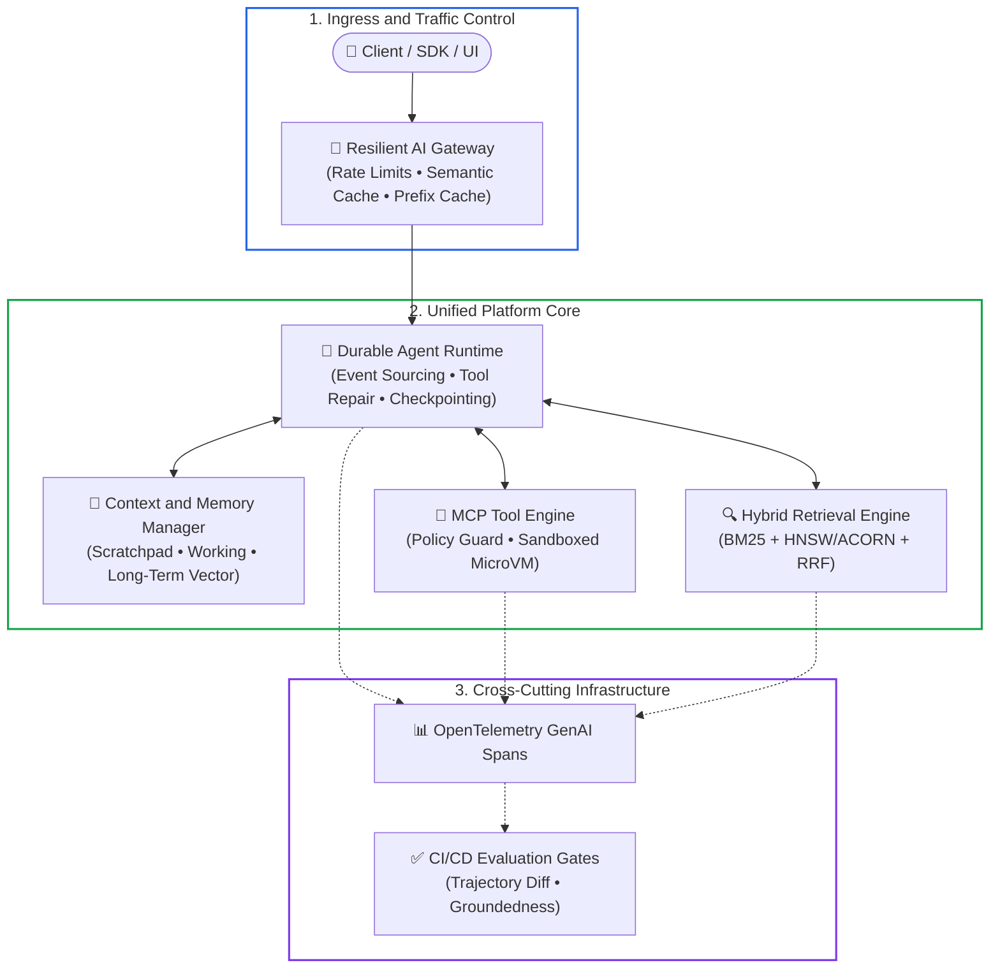
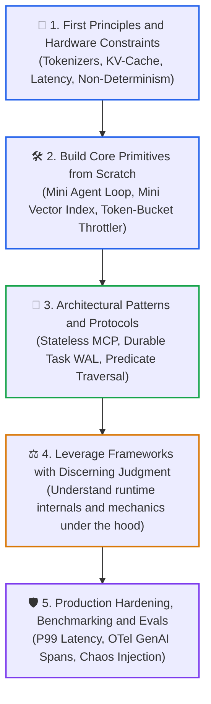
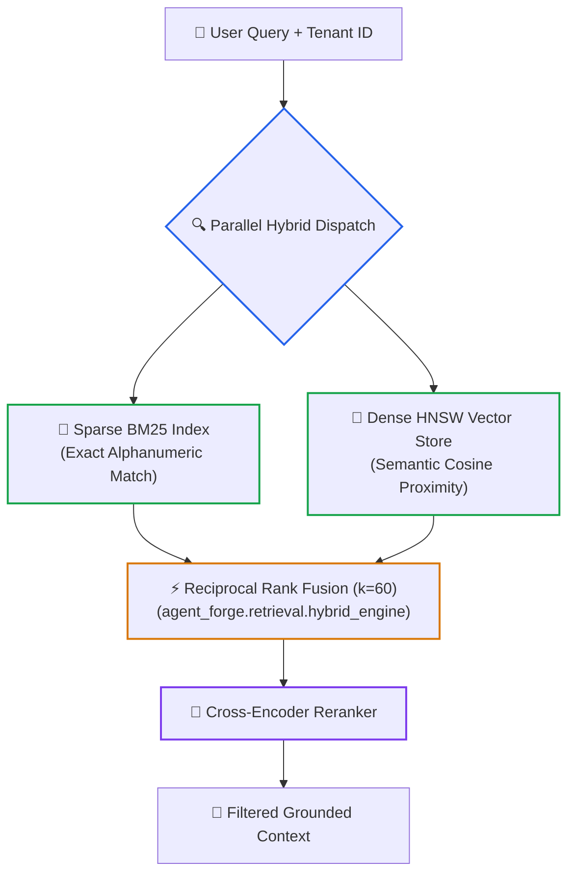
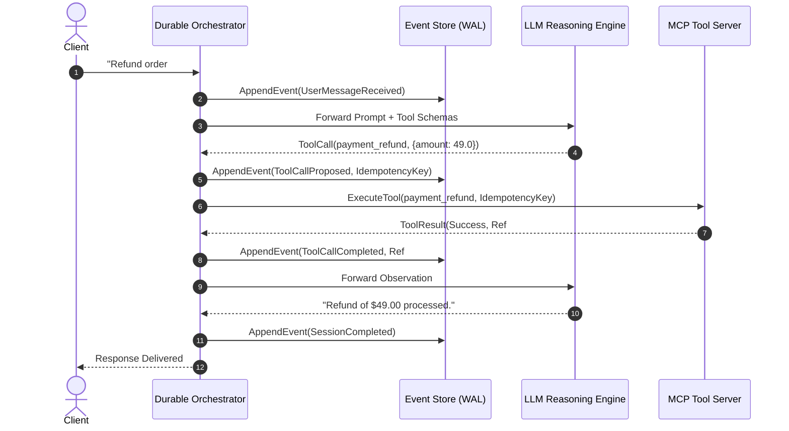
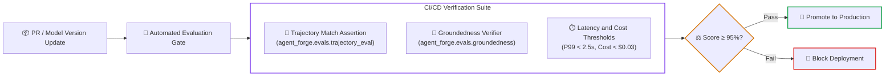
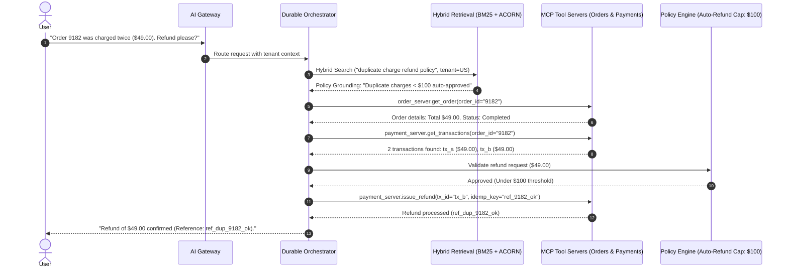

# 🏗️ The Senior AI Platform & Agent Infrastructure Roadmap
### From Traditional Distributed Systems to Autonomous Agent Runtimes & Vector Platforms

[](#the-big-picture-two-roles-one-architecture)
[](#the-paradigm-shift-from-framework-first-to-systems-first)
[](./agent-forge)

> **For Tech Leads and Distributed Systems Engineers**: How to master the AI infrastructure plane—agent loops, durable state machines, Model Context Protocol (MCP), vector retrieval internals (HNSW/ACORN), and OpenTelemetry GenAI observability—without getting trapped in toy chatbot tutorials.

---

## 🧭 Table of Contents

1. [The Big Picture: Two Roles, One Architecture](#the-big-picture-two-roles-one-architecture)
2. [The Paradigm Shift: From Framework-First to Systems-First](#the-paradigm-shift-from-framework-first-to-systems-first)
3. [The Canonical 9-Phase Master Curriculum (Phases 00–08)](#the-canonical-9-phase-master-curriculum-phases-0008)
   - [Phase 00: LLM Foundations, Hardware Physics & Cache-Aware Gateways](#phase-00-llm-foundations-hardware-physics--cache-aware-gateways)
   - [Phase 01: Context Management, Prompt ASTs & Token Budgeting](#phase-01-context-management-prompt-asts--token-budgeting)
   - [Phase 02: Vector Search Internals, ACORN & Enterprise Hybrid Retrieval](#phase-02-vector-search-internals-acorn--enterprise-hybrid-retrieval)
   - [Phase 03: Model Context Protocol (MCP), CodeAct & MicroVM Sandboxes](#phase-03-model-context-protocol-mcp-codeact--microvm-sandboxes)
   - [Phase 04: Crash-Resilient Agent Runtimes, Durable WAL & Multi-Agent Swarms](#phase-04-crash-resilient-agent-runtimes-durable-wal--multi-agent-swarms)
   - [Phase 05: Enterprise AI Security, Policy Engines & Zero-Trust Guardrails](#phase-05-enterprise-ai-security-policy-engines--zero-trust-guardrails)
   - [Phase 06: Evaluation Platforms, CI/CD Quality Gates & OTel Tracing](#phase-06-evaluation-platforms-cicd-quality-gates--otel-tracing)
   - [Phase 07: High-Throughput Serving Clusters, RadixAttention & Speculative Decoding](#phase-07-high-throughput-serving-clusters-radixattention--speculative-decoding)
   - [Phase 08: End-to-End Enterprise Scenario & Production Operations](#phase-08-end-to-end-enterprise-scenario--production-operations)
4. [Your Systems Advantage: Bridging .NET/Azure & Distributed Systems](#your-systems-advantage-bridging-netazure-distributed-systems)
5. [The Hands-On Portfolio: AgentForge Architecture](#the-hands-on-portfolio-agentforge-architecture)
6. [Whiteboard Interview Battlecards](#whiteboard-interview-battlecards)
7. [🧭 Navigation](#-navigation)

---

<a id="the-big-picture-two-roles-one-architecture"></a>
## 🎯 The Big Picture: Two Roles, One Architecture

If you examine senior job descriptions across top-tier AI companies, they usually present as two distinct specializations:

* **Role A — Agent Harness / Platform Engineer**: Focuses on the execution loop, tool protocol orchestration, memory compaction, state persistence, and multi-turn resilience.
* **Role B — Vector Store / RAG Platform Architect**: Focuses on high-scale approximate nearest neighbor (ANN) search, hybrid retrieval ranking, metadata filtering bottlenecks, and retrieval latency at 99th percentiles.

In production, these are not two separate disciplines. They are **two halves of the same distributed system**:



* **The Agent Engine** cannot make sound decisions without high-precision contextual grounding from the **Retrieval Engine**.
* **The Retrieval Engine** is useless in enterprise workflows unless governed by an **Agent Loop** that validates, filters, and takes authorized actions based on retrieved facts.

---

<a id="the-paradigm-shift-from-framework-first-to-systems-first"></a>
## 💡 The Paradigm Shift: From Framework-First to Systems-First

Most developers approach AI engineering backward:

```text
LangChain ──> LangGraph ──> CrewAI ──> Tutorial Fatigue
```

This produces surface-level familiarity with ephemeral APIs, but it leaves engineers completely unprepared for production outages. When an agent enters an infinite loop, leaks API keys via prompt injection, or burns $5,000 in API credits in 30 minutes, frameworks will not save you.

The senior engineering path reverses this pyramid:



When you understand how to build the primitives yourself, you can confidently explain in an architectural review:
> *"We chose not to use an off-the-shelf framework here because our workflows require cross-datacenter state rehydration and strict tool sandboxing that the framework's in-memory execution loop cannot guarantee."*

---

<a id="the-canonical-9-phase-master-curriculum-phases-0008"></a>
## 🗺️ The Canonical 9-Phase Master Curriculum (Phases 00–08)

> [!NOTE]
> **Platform Roadmap Alignment**: This roadmap specifically details the **platform systems execution plane** (gateways, runtimes, storage engines, OTel conventions, and sandboxes). It maps 1:1 to the repository's foundational 9-phase curriculum ([Phases 00–08](./README.md#master-curriculum-syllabus)) and the [`agent-forge`](./agent-forge) reference platform core.

```mermaid
flowchart LR
    P00["🚪 P00: Foundations and Gateways"] --> P01["🧠 P01: Context and AST"]
    P01 --> P02["🔍 P02: Vector and ACORN Retrieval"]
    P02 --> P03["🔌 P03: MCP and Sandboxes"]
    P03 --> P04["🔄 P04: Durable WAL Runtime"]
    P04 --> P05["🛡️ P05: Security and Policy Engine"]
    P05 --> P06["📊 P06: Evals and OTel Tracing"]
    P06 --> P07 --> P08

    subgraph ScaleOps["Scale and SDLC"]
        P07["⚡ P07: High-Throughput Serving"]
        P08["🏛️ P08: Enterprise Platform and SDLC"]
    end

    style ScaleOps fill:none,stroke:#7c3aed,stroke-width:2px
    style P00 stroke:#2563eb,stroke-width:2px
    style P01 stroke:#2563eb,stroke-width:2px
    style P02 stroke:#16a34a,stroke-width:2px
    style P03 stroke:#16a34a,stroke-width:2px
    style P04 stroke:#d97706,stroke-width:2px
    style P05 stroke:#d97706,stroke-width:2px
    style P06 stroke:#7c3aed,stroke-width:2px
    style P07 stroke:#7c3aed,stroke-width:2px
    style P08 stroke:#7c3aed,stroke-width:2px
```



---

### Phase 00: LLM Foundations, Hardware Physics & Cache-Aware Gateways

[Curriculum: Phase 00](./00-foundations-and-token-mechanics/README.md) • [Platform Core: `agent_forge/gateway/`](./agent-forge/agent_forge/gateway/)

#### The Conceptual Core
Treat Large Language Models not as magical chatbots, but as **remote, untrusted, stateless CPUs with variable clock speeds and pay-per-clock pricing**.

Every API request passes through three distinct phases:
1. **Tokenization & Prefill:** Converting text into discrete integer IDs and computing the initial Key-Value (KV) cache for your prompt. This phase is compute-bound.
2. **Autoregressive Decoding:** Generating one token at a time by running a forward pass and appending new KV states. This phase is memory-bandwidth bound.
3. **Structured Output Enforcement:** Using Context-Free Grammars (CFGs) or Finite State Machines (FSMs) at the sampling layer to guarantee valid JSON schemas without regex retries.

#### Production Reality: The Cost of Cache Invalidation
In multi-turn agent systems, sending 20,000 tokens of conversation history and tool definitions on every turn quickly exhausts budgets and spikes Time to First Token (TTFT).

Frontier providers support **Context / Prompt Caching**. If the prefix of your prompt is identical across requests, the server reuses the precomputed KV cache:
* Up to **80% lower latency** (TTFT).
* Up to **50–75% lower input token costs**.

**The Engineering Rule:** *Keep your static system instructions and tool definitions strictly at the top of your prompt envelope. Never inject dynamic timestamps or randomized UUIDs into the prefix.*

#### Silicon & Serving Hardware Realities: Native FP8 & Latent Attention
Senior platform engineers must understand the physical hardware constraints of LLM serving clusters (vLLM, SGLang, TensorRT-LLM):
* **Native FP8 Precision (E4M3 / E5M2):** On modern datacenter GPUs (NVIDIA Hopper and Blackwell), native FP8 Tensor Cores double GEMM compute throughput over FP16 with zero dequantization register stalls.
* **Multi-Head Latent Attention (MLA):** Modern architectures compress Key-Value (KV) cache tensors into low-dimensional latent vectors, reducing KV-cache VRAM consumption by 70–80% and allowing 4× higher concurrency per GPU node.
* **RadixAttention Shared Prefill Trees:** Serving runtimes manage GPU memory as a dynamic Radix Tree, matching token prefixes across multi-turn sessions to eliminate redundant prefill compute.

#### Practical Platform Implementation: `agent_forge.gateway`
The reference platform implements an enterprise AI Gateway (`agent_forge/gateway/model_router.py`):
* **Common Envelope:** Normalizes requests and streaming responses across providers.
* **Token-Bucket Throttler (`rate_limiter.py`):** Enforces tenant-level Tokens-Per-Minute (TPM) and Requests-Per-Minute (RPM).
* **Semantic Cache (`semantic_cache.py`):** Uses vector similarity to serve cached answers for semantically identical questions.
* **Smart Circuit Breaker:** Detects provider 429/503 errors and instantly fails over from primary to secondary models.

---

### Phase 01: Context Management, Prompt ASTs & Token Budgeting

[Curriculum: Phase 01](./01-prompt-and-context-engineering/README.md)

#### The Conceptual Core
Most developers treat prompts as messy, ad-hoc string concatenations: `f"System prompt: {x}\nUser: {y}"`. This naive approach breaks under production scale because it offers no token budgeting, no cache prefix stabilization, and no deterministic output guarantees.

In enterprise platform engineering, we treat context as an **Abstract Syntax Tree (AST)** that compiles dynamically into an optimized wire payload:
* **Node 1: Static System Persona & Policy (Immutable Prefix)**: Cached across 100% of user sessions.
* **Node 2: Declarative Tool Schemas (Immutable Prefix)**: Pre-compiled JSON schemas describing available functions.
* **Node 3: Working Memory & Dynamic RAG Context**: Grounding facts fetched from the retrieval engine with explicit token caps.
* **Node 4: User Query & Suffix**: Variable user input isolated by explicit XML boundaries (`<user_query>`).

#### Token Budgeting & Compaction
When context approaches the Maximum Effective Context Window (MECW):
* **Sliding Window Compaction**: Keep the initial system instructions and summarize turns 1 through $N-3$ into a single context rollup.
* **Attention Pruning**: Strip verbose XML tags and formatting overhead to maximize information density.

---

### Phase 02: Vector Search Internals, ACORN & Enterprise Hybrid Retrieval

[Curriculum: Phase 02](./02-rag-and-knowledge-systems/README.md) • [Platform Core: `agent_forge/retrieval/`](./agent-forge/agent_forge/retrieval/)

#### The Conceptual Core
Relying solely on dense semantic vector embeddings creates two major failure modes:
1. **The Exact-Match Blindspot**: Vector embeddings excel at conceptual synonym matching, but fail on exact alphanumeric strings, SKU numbers, error codes, and unique IDs (`SKU-9942`, `0x80070005`).
2. **Multi-Tenant Data Leakage**: In enterprise systems, returning unauthorized tenant records violates compliance. Post-filtering (retrieving top-K globally and discarding unauthorized tenants) leads to severe recall degradation.

#### The Hybrid Search Solution: BM25 + Dense Vectors + RRF
The reference platform combines sparse lexical search and dense semantic search via **Reciprocal Rank Fusion (RRF)**:
```text
RRF_Score(d) = Σ [ 1 / (60 + rank_m(d)) ]  for each search engine m
```



#### Graph Disconnection & ACORN-1 Predicate Search
When documents carry strict categorical metadata (e.g. `tenant_id`, `region`), pre-filtering nodes before graph search breaks HNSW navigation pathways (Graph Disconnection). 
* **ACORN-1 Solution**: Dynamically inspects multi-hop neighbors during graph navigation, hopping across non-matching intermediate nodes to discover valid matching candidates without breaking connectivity.
* **Vector Tombstones & Compaction**: Soft-deletes nodes via bitsets and triggers background segment compaction to maintain search recall.

---

### Phase 03: Model Context Protocol (MCP), CodeAct & MicroVM Sandboxes

[Curriculum: Phase 03](./03-tools-and-model-context-protocol/README.md) • [Platform Core: `agent_forge/mcp/`](./agent-forge/agent_forge/mcp/)

#### The Conceptual Core
Instead of writing bespoke, proprietary API bindings for every LLM framework, production architectures use the **Model Context Protocol (MCP)**, standardized under the Linux Foundation's **Agentic AI Foundation (AAIF)**.

MCP establishes a universal Client-Host-Server architecture based on JSON-RPC 2.0:
* **Tools**: Executable actions (e.g., executing SQL, querying transactions, processing refunds).
* **Resources**: Read-only data streams (file contents, database records) for zero-hallucination grounding.
* **Prompts**: Reusable server-managed workflow templates exposed to clients.
* **Roots & Reverse Sampling**: Workspace root discovery and server-initiated model completion requests (`sampling/createMessage`).

#### The CodeAct Paradigm
For complex algorithmic and data transformation tasks, the **CodeAct** paradigm (ICML 2024) allows models to generate and execute Python code in a sandboxed REPL instead of rigid JSON tool calls, completing multi-step tasks in fewer round-trips.

#### MicroVM Isolation: Firecracker & gVisor
Executing model-generated code requires strict hardware-level sandboxing:
* **Firecracker MicroVMs (E2B)**: Ephemeral Linux kernels booting in under 200ms with hardware-enforced hypervisor isolation.
* **gVisor (User-Space Syscalls)**: Intercepts system calls to prevent container breakout vulnerabilities.
* **Egress Firewalls**: Denies outbound network access by default, injecting API credentials securely on the host side.

---

### Phase 04: Crash-Resilient Agent Runtimes, Durable WAL & Multi-Agent Swarms

[Curriculum: Phase 04](./04-agentic-systems-and-orchestration/README.md) • [Platform Core: `agent_forge/runtime/`](./agent-forge/agent_forge/runtime/)

#### The Conceptual Core
Most agent tutorials showcase a naive while-loop:
```python
while not done:
    action = model.predict(...)
    result = execute(action)
```
This naive approach fails completely in enterprise production:
* If the worker pod restarts midway, **the entire session state is lost**.
* If a network timeout occurs during a payment call, **a blind retry charges the customer twice**.
* If the model hallucinates a parameter type, **the loop crashes with an unhandled exception**.

#### Event-Sourced Write-Ahead Logging (WAL)
The platform core (`agent_forge/runtime/event_store.py`) records every turn to an append-only ledger before executing actions:



#### Crash Simulation & State Rehydration
If the process terminates at step 5, a newly spawned orchestrator replays the event store:
1. Detects that `payment_refund` was proposed with idempotency key `idemp_9182`.
2. Queries the payment server with the key, discovering that the transaction already succeeded.
3. Reconstructs conversational state seamlessly without re-executing the charge.

#### Automated Tool Call Repair
When an LLM returns a malformed parameter (e.g. returning `"$49.00"` as a string instead of float `49.0`), the runtime automatically repairs the schema mismatch before execution, recording the diagnostic in the WAL.

---

### Phase 05: Enterprise AI Security, Policy Engines & Zero-Trust Guardrails

[Curriculum: Phase 05](./05-ai-security-and-guardrails/README.md) • [Platform Core: `agent_forge/mcp/policy_engine.py`](./agent-forge/agent_forge/mcp/policy_engine.py)

#### The Conceptual Core
Autonomous agents with write permissions introduce critical enterprise attack surfaces:
* **Indirect Prompt Injection**: Malicious instructions embedded in uploaded invoices or customer emails.
* **Excessive Agency**: An agent deciding to issue a $10,000 refund without human authorization.
* **PII & Credential Exfiltration**: Trick prompts designed to extract system instructions or database credentials.

#### Zero-Trust Policy Engine
Before any MCP tool executes, it must pass through the Zero-Trust Policy Engine (`policy_engine.py`):
* **Threshold-Based Approval (HITL)**: Automated refunds $\le \$100.00$ are permitted automatically; transactions $> \$100.00$ trigger an approval breakpoint.
* **Dual-LLM Quarantine**: External untrusted documents pass through an unprivileged reader model that extracts structured facts without tool access.
* **Canary Tokens**: Dynamic cryptographic tokens in prompts detect and block exfiltration attempts.

---

### Phase 06: Evaluation Platforms, CI/CD Quality Gates & OTel Tracing

[Curriculum: Phase 06](./06-evals-and-observability/README.md) • [Platform Core: `agent_forge/evals/` & `agent_forge/observability/`](./agent-forge/agent_forge/evals/)

#### The Three Levels of Evaluation
1. **RAG Retrieval Quality**: Faithfulness / Groundedness (does the output match retrieved facts?) and Context Recall.
2. **Agent Trajectory Evaluation**: Verifying that the sequence of tool calls matches the expected Finite State Machine (FSM) path.
3. **Platform Performance Metrics**: Time to First Token (TTFT), Time Per Output Token (TPOT), and total dollar cost per task.



#### OpenTelemetry GenAI Observability (`semantic-conventions-genai`)
Tracing instrumented directly with OpenTelemetry GenAI semantic conventions:
* `gen_ai.agent.id`: `"agent_support_dispute"`
* `gen_ai.request.model`: `"claude-3-5-sonnet"`
* `gen_ai.usage.input_tokens`: `1420`
* `gen_ai.usage.output_tokens`: `185`
* `gen_ai.tool.name`: `"payment_issue_refund"`

---

### Phase 07: High-Throughput Serving Clusters, RadixAttention & Speculative Decoding

[Curriculum: Phase 07](./07-production-deployment-and-llmops/README.md) • [Platform Core: `agent_forge/gateway/`](./agent-forge/agent_forge/gateway/)

#### The Conceptual Core
Deploying open-weight models in production clusters requires maximizing GPU memory utilization:
* **Continuous Batching (vLLM)**: Squeezes incoming requests dynamically into active iterations without waiting for prior sequences to finish.
* **PagedAttention**: Manages GPU KV-cache memory in non-contiguous pages, eliminating memory fragmentation and boosting throughput by 2x to 4x.
* **RadixAttention (SGLang)**: Organizes KV caches as a compressed prefix tree, reusing prefill computation across multi-turn agent sessions.
* **Speculative Decoding (EAGLE-3 & P-EAGLE)**: Generates candidate tokens with lightweight draft heads and verifies them in parallel, doubling generation speed with zero quality loss.

---

### Phase 08: End-to-End Enterprise Scenario & Production Operations

[Curriculum: Phase 08](./08-ai-augmented-sdlc-and-leadership/README.md) • [Platform Demo: `agent-forge/demo.py`](./agent-forge/demo.py)

#### Complete Enterprise Scenario: Automated Order & Dispute Resolution
The full production scenario demonstrated in `agent-forge/demo.py` ties the entire distributed stack together:



---

<a id="your-systems-advantage-bridging-netazure-distributed-systems"></a>
## 💼 Your Systems Advantage: Bridging .NET/Azure & Distributed Systems

If you come from a background in **C# / .NET, Azure, and distributed systems**, you possess an enormous unfair advantage. Most AI practitioners know how to write a Python prompt script, but have zero experience designing high-throughput, fault-tolerant platforms.

Here is how your background directly maps to the senior AI platform stack:

| Your Distributed Systems / .NET Foundation | The AI Platform Equivalent | How to Frame It in Technical Interviews |
| :--- | :--- | :--- |
| **ASP.NET Core Kestrel / YARP Reverse Proxy** | **High-Throughput Model Gateway** | *"I designed the gateway using low-allocation streaming pipelines to manage token-bucket throttling and connection pooling across upstream model endpoints."* |
| **Azure Service Bus / Durable Functions / Orleans** | **Durable Agent Runtime & Actor State** | *"I modeled the agent loop as an event-driven actor with checkpointed state machines, ensuring long-running tasks survive transient container restarts."* |
| **Azure AI Search (Hybrid BM25 + Vector + Semantic Ranker)** | **Production Enterprise Hybrid RAG** | *"I understand the balance between dense semantic recall, sparse lexical precision, and the computational trade-offs of cross-encoder rerankers."* |
| **Event Sourcing & CQRS (SQL Server / Cosmos DB)** | **Agent Event Log & Write-Ahead Logging (WAL)** | *"Every tool invocation and reasoning trace is appended to an immutable append-only ledger, enabling deterministic replays and auditability."* |
| **OpenTelemetry / Azure Monitor / App Insights** | **OpenTelemetry GenAI Semantic Conventions** | *"I instrumented end-to-end distributed traces linking client requests down to token metrics, vector search latencies, and tool execution spans."* |

---

<a id="the-hands-on-portfolio-agentforge-architecture"></a>
## 🛠️ The Hands-On Portfolio: AgentForge Architecture

To prove these skills conclusively, explore the **`agent-forge/`** directory in this repository. It provides an end-to-end, runnable implementation of the concepts discussed in this guide:

```
agent-forge/
├── README.md                      # Architecture guide & quickstart instructions
├── requirements.txt               # Lightweight dependencies (pure Python + NumPy)
├── demo.py                        # Complete runnable customer refund scenario
└── agent_forge/
    ├── gateway/
    │   ├── model_router.py        # Resilient routing with circuit breaker & fallback
    │   ├── semantic_cache.py      # Vector-based query cache
    │   └── rate_limiter.py        # Token-bucket rate limiting (TPM/RPM)
    ├── runtime/
    │   ├── orchestrator.py        # Durable agent loop with tool repair & max iterations
    │   ├── event_store.py         # Write-Ahead Log (WAL) with state checkpointing
    │   └── state_models.py        # Typed execution envelopes
    ├── mcp/
    │   ├── protocol.py            # Stateless MCP JSON-RPC 2.0 implementation
    │   ├── policy_engine.py       # RBAC/ABAC Zero-trust authorization guard
    │   └── servers/               # Micro-MCP servers (Order, Payment, Policy)
    ├── retrieval/
    │   ├── vector_store.py        # In-memory vector store with Cosine & L2 distance
    │   ├── bm25.py                # Sparse lexical BM25 search engine
    │   ├── hybrid_engine.py       # Reciprocal Rank Fusion (RRF) & ACORN-style filtering
    │   └── embeddings.py          # Deterministic embedding generator
    ├── evals/
    │   ├── trajectory_eval.py     # Multi-turn tool execution order validator
    │   └── groundedness.py        # Contextual faithfulness evaluator
    └── observability/
        ├── tracer.py              # OpenTelemetry GenAI semantic convention tracer
        └── exporter.py            # Console trace tree & cost attribution formatter
```

To run the full end-to-end demonstration:
```bash
cd agent-forge
python demo.py
```

---

<a id="whiteboard-interview-battlecards"></a>
## 🎯 Whiteboard Interview Battlecards

Prepare for these high-signal architecture interview questions:

### 1. "Design an Agent Runtime for 10 Million Users"
* **Key Architecture:** Decouple the HTTP ingress gateway from the agent execution engine via an asynchronous message queue (Service Bus / Kafka).
* **State Management:** Use an event-sourced checkpoint store (Cosmos DB / PostgreSQL). Never hold open thread pools waiting on upstream LLM tokens.
* **Resilience:** Implement deterministic idempotency keys for all state-mutating tool calls to guarantee that retry storms never cause double-charges.

### 2. "How Do You Handle Strict Metadata Filtering in Large Vector Indexes?"
* **The Pitfall:** Pre-filtering isolates nodes and breaks HNSW graph navigation; post-filtering discards so many candidates that top-K results return empty.
* **The Solution:** Use **ACORN-style predicate-guided graph traversal** (evaluating multi-hop neighbors dynamically during graph navigation) or maintain segmented per-tenant vector indexes when tenant isolation is paramount.

### 3. "How Do You Prevent an Agent from Hallucinating Tool Parameters?"
* **Layer 1:** Constrain sampling using formal JSON schema grammars (CFG/FSM enforcement).
* **Layer 2:** Validate payloads at the MCP host boundary using Pydantic / typed schemas.
* **Layer 3:** In the event of validation errors, trigger **Tool Call Repair**—pass the exact error back to the model with an explicit correction directive.

### 4. "How Do You Prove an Agentic System Is Production-Ready?"
* **Continuous Trajectory Testing:** Run regression suites against frozen test sets; verify that 99%+ of runs follow approved tool trajectories.
* **Groundedness Scoring:** Measure the ratio of generated claims supported by retrieved context chunks using automated verifier models.
* **Cost & Latency SLAs:** Enforce strict budget bounds via token-bucket quotas and monitor P99 latency breakdown across vector search, model reasoning, and tool executions using OpenTelemetry GenAI spans.

---

## 🧭 Navigation

- **Master Curriculum**: [← Back to Master Curriculum & Architecture (README.md)](./README.md)
- **Conceptual Roadmap**: [🗺️ The Complete AI Engineer Roadmap (Phases 00–08)](./AI_ENGINEER_ROADMAP.md)
- **Emerging Tech Strategy**: [🗺️ Emerging AI Technology Roadmap (2025–2026)](./ai-technology-roadmap-2025-2026.md)
- **Senior Transition Guide**: [🏛️ The Senior AI Transition Guide](./senior-transition-guide.md)
- **Hands-On Platform Core**: [⚒️ AgentForge Reference Implementation](./agent-forge/README.md)
- **Phase Hubs**:
  - [Phase 00: Foundations & Token Mechanics](./00-foundations-and-token-mechanics/README.md)
  - [Phase 01: Prompt & Context Engineering](./01-prompt-and-context-engineering/README.md)
  - [Phase 02: Retrieval & Knowledge Systems](./02-rag-and-knowledge-systems/README.md)
  - [Phase 03: Tools & Model Context Protocol](./03-tools-and-model-context-protocol/README.md)
  - [Phase 04: Agentic Systems & Orchestration](./04-agentic-systems-and-orchestration/README.md)
  - [Phase 05: AI Security & Guardrails](./05-ai-security-and-guardrails/README.md)
  - [Phase 06: Evals & Observability](./06-evals-and-observability/README.md)
  - [Phase 07: High-Throughput Serving & LLMOps](./07-production-deployment-and-llmops/README.md)
  - [Phase 08: AI-Augmented SDLC & Leadership](./08-ai-augmented-sdlc-and-leadership/README.md)
