# 🏗️ The Senior AI Platform & Agent Infrastructure Roadmap
### From Traditional Distributed Systems to Autonomous Agent Runtimes & Vector Platforms

[](#the-big-picture-two-roles-one-architecture)
[](#the-paradigm-shift-from-framework-first-to-systems-first)
[](./agent-forge)

> **For Tech Leads and Distributed Systems Engineers**: How to master the AI infrastructure plane—agent loops, durable state machines, Model Context Protocol (MCP), vector retrieval internals (HNSW/ACORN), and OpenTelemetry GenAI observability—without getting trapped in toy chatbot tutorials.

---

## 🧭 Table of Contents

1. [The Big Picture: Two Roles, One Architecture](#the-big-picture-two-roles-one-architecture)
2. [The Paradigm Shift: From Framework-First to Systems-First](#the-paradigm-shift-from-framework-first-to-systems-first)
3. [The 9-Phase Master Curriculum](#the-9-phase-master-curriculum)
   - [Phase 1: LLM Fundamentals & Cache-Aware Gateways](#phase-1-llm-fundamentals-cache-aware-gateways)
   - [Phase 2: Building a Crash-Resilient Agent Runtime](#phase-2-building-a-crash-resilient-agent-runtime)
   - [Phase 3: Deep Model Context Protocol (MCP 2026) & Zero-Trust Sandboxing](#phase-3-deep-model-context-protocol-mcp-2026-zero-trust-sandboxing)
   - [Phase 4: Context Management & The 4-Tier Memory Hierarchy](#phase-4-context-management-the-4-tier-memory-hierarchy)
   - [Phase 5: Vector Search Internals (From Brute Force to ACORN)](#phase-5-vector-search-internals-from-brute-force-to-acorn)
   - [Phase 6: Advanced Hybrid Retrieval & Reranking Realities](#phase-6-advanced-hybrid-retrieval-reranking-realities)
   - [Phase 7: End-to-End Enterprise Scenario (Order & Dispute Platform)](#phase-7-end-to-end-enterprise-scenario-order-dispute-platform)
   - [Phase 8: Evaluation Platforms & Automated CI Quality Gates](#phase-8-evaluation-platforms-automated-ci-quality-gates)
   - [Phase 9: OpenTelemetry GenAI Observability & Cost Attribution](#phase-9-opentelemetry-genai-observability-cost-attribution)
4. [Your Systems Advantage: Bridging .NET/Azure & Distributed Systems](#your-systems-advantage-bridging-netazure-distributed-systems)
5. [The Hands-On Portfolio: AgentForge Architecture](#the-hands-on-portfolio-agentforge-architecture)
6. [Whiteboard Interview Battlecards](#whiteboard-interview-battlecards)

---

<a id="the-big-picture-two-roles-one-architecture"></a>
## 🎯 The Big Picture: Two Roles, One Architecture

If you examine senior job descriptions across top-tier AI companies, they usually present as two distinct specializations:

* **Role A — Agent Harness / Platform Engineer**: Focuses on the execution loop, tool protocol orchestration, memory compaction, state persistence, and multi-turn resilience.
* **Role B — Vector Store / RAG Platform Architect**: Focuses on high-scale approximate nearest neighbor (ANN) search, hybrid retrieval ranking, metadata filtering bottlenecks, and retrieval latency at 99th percentiles.

In production, these are not two separate disciplines. They are **two halves of the same distributed system**:

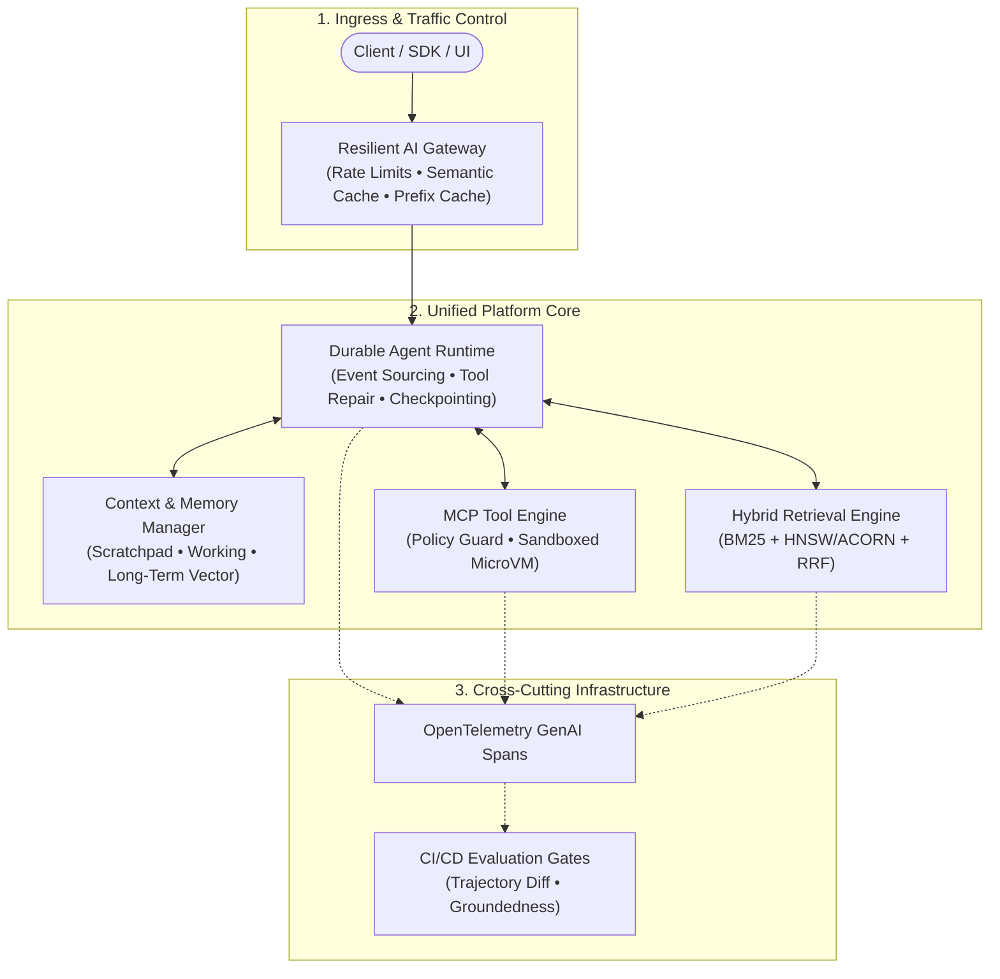

* **The Agent Engine** cannot make sound decisions without high-precision contextual grounding from the **Retrieval Engine**.
* **The Retrieval Engine** is useless in enterprise workflows unless governed by an **Agent Loop** that validates, filters, and takes authorized actions based on retrieved facts.

---

<a id="the-paradigm-shift-from-framework-first-to-systems-first"></a>
## 💡 The Paradigm Shift: From Framework-First to Systems-First

Most developers approach AI engineering backward:

```text
LangChain ──> LangGraph ──> CrewAI ──> Tutorial Fatigue
```

This produces surface-level familiarity with ephemeral APIs, but it leaves engineers completely unprepared for production outages. When an agent enters an infinite loop, leaks API keys via prompt injection, or burns $5,000 in OpenAI credits in 30 minutes, frameworks won't save you.

The senior engineering path reverses this pyramid:

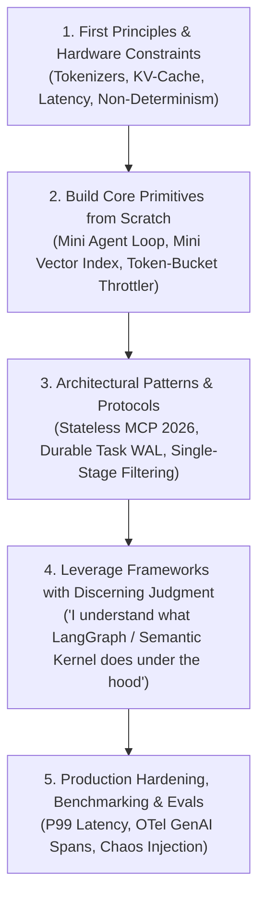

When you understand how to build the primitives yourself, you can confidently explain in an architectural review:
> *"We chose not to use an off-the-shelf framework here because our workflows require cross-datacenter state rehydration and strict tool sandboxing that the framework's in-memory execution loop cannot guarantee."*

---

<a id="the-9-phase-master-curriculum"></a>
## 🗺️ The 9-Phase Master Curriculum

> [!NOTE]
> **Platform Roadmap to Curriculum Alignment**: This roadmap specifically details the **platform systems execution plane** (gateways, runtimes, storage engines, OTel conventions). It maps directly to the repository's foundational 9-phase curriculum ([Phases 00–08](./README.md#master-curriculum-syllabus)):
> - **Roadmap Phase 1** (Gateways & Tokens) ⟷ **Phase 00** (Foundations) & **Phase 07** (Serving/Gateways)
> - **Roadmap Phase 2** (Durable Runtime & WAL) ⟷ **Phase 04** (Stateful Agent Orchestration)
> - **Roadmap Phase 3** (MCP & Sandboxing) ⟷ **Phase 03** (Tools & MCP) & **Phase 05** (Security)
> - **Roadmap Phase 4** (Context AST & Memory) ⟷ **Phase 01** (Context Engineering) & **Phase 04** (Memory)
> - **Roadmap Phases 5 & 6** (Vector Search & Hybrid RAG) ⟷ **Phase 02** (Enterprise Retrieval & RAG)
> - **Roadmap Phase 7** (Enterprise Scenario) ⟷ **Enterprise Blueprints & Labs 01–07**
> - **Roadmap Phases 8 & 9** (Evals & OTel Observability) ⟷ **Phase 06** (GenAI Evals & Observability)

```mermaid
flowchart LR
    P1["P1: Gateway & Tokens"] --> P2["P2: Durable Runtime"]
    P2 --> P3["P3: MCP & Sandboxes"]
    P3 --> P4["P4: Context & Memory"]
    P4 --> P5["P5: Vector Search Internals"]
    P5 --> P6["P6: Hybrid RAG & RRF"]
    P6 --> P7["P7: Enterprise Capstone"]
    P7 --> P8["P8: Evaluation Platform"]
    P8 --> P9["P9: OTel Observability"]
```

---

### Phase 1: LLM Fundamentals & Cache-Aware Gateways

#### The Conceptual Core
Treat Large Language Models not as magical chatbots, but as **remote, untrusted, stateless CPUs with variable clock speeds and pay-per-clock pricing**.

Every API call has three phases:
1. **Tokenization & Prefill:** Converting text into discrete integer IDs and computing the initial Key-Value (KV) cache for your prompt. This is compute-bound.
2. **Autoregressive Decoding:** Generating one token at a time by running a forward pass and appending new KV states. This is memory-bandwidth bound.
3. **Structured Output Enforcement:** Using Context-Free Grammars (CFGs) or Finite State Machines (FSMs) at the sampling layer to guarantee valid JSON schemas without regex retries.

#### Production Reality: The Cost of Cache Invalidation
In multi-turn agent systems, sending 20,000 tokens of conversation history and tool definitions on every turn quickly bankrupts your budget and spikes Time to First Token (TTFT).

Frontier providers (Gemini, Claude, OpenAI) support **Context / Prompt Caching**. If the prefix of your prompt is identical across requests, the server reuses the precomputed KV cache:
* Up to **80% lower latency** (TTFT).
* Up to **50–75% lower input token costs**.

**The Engineering Rule:** *Keep your static system instructions and tool definitions strictly at the top of your prompt envelope. Never inject dynamic timestamps or randomized UUIDs into the prefix.*

#### Silicon & Serving Hardware Realities: Native FP8 & Latent Attention
Senior platform engineers must understand the physical hardware constraints of LLM serving clusters (vLLM, SGLang, TensorRT-LLM):
* **Native FP8 Precision (E4M3 / E5M2):** On modern datacenter GPUs (NVIDIA Hopper H100/H200 and Blackwell B200), native FP8 Tensor Cores double GEMM compute throughput over FP16 with zero dequantization register stalls, replacing legacy 4-bit weight quantization schemes (AWQ/GPTQ) in enterprise serving clusters.
* **Multi-Head Latent Attention (MLA):** Modern architectures (e.g., DeepSeek V3/R1) compress Key-Value (KV) cache tensors into low-dimensional latent vectors, reducing KV-cache VRAM consumption by 70–80% and allowing 4× higher concurrency per GPU node.
* **RadixAttention Shared Prefill Trees:** Serving runtimes manage GPU memory as a dynamic Radix Tree, matching token prefixes across multi-turn sessions to eliminate redundant prefill compute.

#### Practical Project: The Resilient AI Gateway
Build a proxy service that sits between your applications and upstream LLM providers:
* **Common Envelope:** Normalizes requests and streaming responses across Gemini, Claude, and OpenAI.
* **Token-Bucket Throttler:** Enforces Tenant-level Tokens-Per-Minute (TPM) and Requests-Per-Minute (RPM).
* **Semantic Cache:** Uses a fast in-memory embedding comparison to serve cached answers for semantically identical questions.
* **Smart Circuit Breaker:** Detects provider 429/503 errors and instantly fails over from primary to secondary models (e.g., Claude 3.5 Sonnet → Gemini 1.5 Pro).

---

### Phase 2: Building a Crash-Resilient Agent Runtime

#### The Conceptual Core
Most agent tutorials showcase a naive while-loop:
```python
# The Junior Mistake: In-memory loop
while model_wants_tools:
    result = execute(tool)
    messages.append(result)
```
**Why this fails in enterprise production:**
1. **Container Restarts:** If the pod running your agent restarts during a 90-second workflow, the session state is lost forever.
2. **Human-in-the-Loop (HITL):** If a tool requires human managerial approval (e.g., approving a $500 refund), the process cannot hang open in a thread for 4 hours.
3. **Duplicate Side Effects:** If an upstream network glitch causes a retry, your agent might execute `charge_credit_card()` twice.

#### The Architecture: Event Sourcing & Durable Execution
Borrow a battle-tested pattern from distributed systems: **Write-Ahead Logging (WAL) and Event Sourcing**.

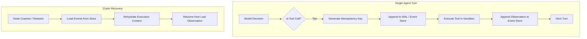

* **Idempotency Keys:** Every tool execution carries a deterministic hash:
  ```text
  Key = SHA256(SessionID + TurnIndex + ToolName + ArgsHash)
  ```
  If a tool step retries, the tool server recognizes the key and returns the previous output without re-running the operation.
* **Checkpoints:** State is externalized to durable storage (PostgreSQL, Cosmos DB, or Redis) after every tool completion.
* **Tool Call Repair:** If a model returns a malformed JSON argument, pass the raw string and schema error back to the model with an explicit corrective instruction: *"Schema validation failed for argument 'amount'. Expected float, received string. Correct the JSON."*

---

### Phase 3: Deep Model Context Protocol (MCP 2026) & Zero-Trust Sandboxing

#### The Conceptual Core
Before MCP, every AI framework had its own incompatible way of binding tools. **Model Context Protocol (MCP)**, standardized under the Linux Foundation's Agentic AI Foundation, is the universal **USB-C for AI applications**.

It establishes a clean separation between:
1. **The MCP Host:** The agent runtime coordinating execution.
2. **The MCP Client:** The component opening connections and managing protocol handshakes.
3. **The MCP Server:** The service exposing **Tools** (executable actions), **Resources** (read-only data streams), and **Prompts** (pre-packaged guidance).

#### The 2026 Protocol Reality: Stateless Streamable HTTP
While local IDE tools use `stdio` for process pipes, cloud-native enterprise agents use **Stateless Streamable HTTP / Server-Sent Events (SSE)**. This allows MCP tool servers to run as horizontally scalable microservices behind load balancers with standard authorization headers (`Bearer <token>`).

#### Zero-Trust Tool Sandboxing
Never allow an agent to execute shell commands, Python scripts, or database updates directly on your application host.

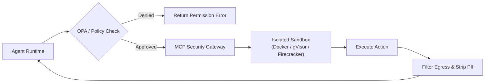

* **Deterministic Policy Gates:** Use Open Policy Agent (OPA) or Cedar engines to evaluate whether the authenticated caller has permissions for `order.refund` when `amount > 100`.
* **MicroVM Sandboxing:** Execute untrusted scripts in lightweight virtual machines (Firecracker or gVisor) with network egress locked down to explicitly allowlisted domains.
* **Indirect Prompt Injection Defense:** Never treat text retrieved from external APIs or emails as system instructions. Isolate retrieved content in a dedicated XML tag (e.g. `<untrusted_context>`) and apply heuristic scanners or secondary classifier checks before executing sensitive tools.

---

### Phase 4: Context Management & The 4-Tier Memory Hierarchy

#### The Conceptual Core
A common misconception is that a 1-million-token context window eliminates the need for memory management. In reality:
* **"Lost in the Middle":** Needle-in-a-haystack retrieval accuracy degrades as context sizes balloon with irrelevant chatter.
* **Inference Latency:** Processing 500,000 input tokens on every turn introduces a 5-to-10 second latency tax before the first output token begins streaming.
* **Cost Acceleration:** Quadratic attention mechanisms make huge contexts unsustainable for high-concurrency production systems.

#### The 4-Tier Memory Taxonomy
A production agent platform structures memory into four distinct, explicitly governed tiers:

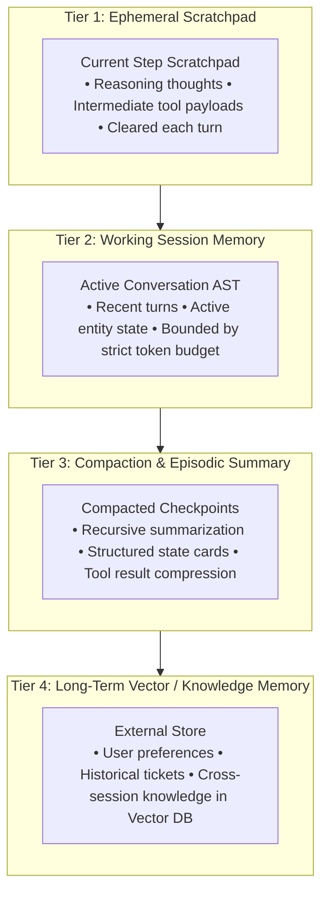

#### Token Budgeting & Progressive Compaction
Implement a deterministic **Context Budget Governor**:
1. **Reserve Allocations:** Allocate 20% to System Instructions & Tool Schemas, 50% to Retrieved Context, 20% to Conversation History, and 10% to Output Generation.
2. **Tool Result Compression:** If an MCP tool returns a 10,000-line JSON payload, never dump the raw text into the conversation history. Parse it, extract the 5 essential fields the model needs, and discard the rest.
3. **Recursive Compaction:** When history exceeds its threshold, summarize older turns into an evolving structured state card:
   ```json
   {
     "customer_id": "cust_481",
     "verified": true,
     "issue": "Charged twice for order 9182",
     "refund_status": "pending_approval"
   }
   ```

---

### Phase 5: Vector Search Internals (From Brute Force to ACORN)

#### The Conceptual Core
Vector search is simply finding the nearest data points in a high-dimensional mathematical space. 

* **Cosine Similarity:** Measures the angle between two vectors:
  ```text
  Cosine(u, v) = (u · v) / (||u|| ||v||)
  ```
* **Exact (Flat) Search:** Compares the query vector against every single vector in the database (O(N · D) complexity). Perfectly accurate, but computationally impossible at scale: searching 10 million 1536-dimensional vectors requires over 60 billion floating-point calculations per query.

#### Approximate Nearest Neighbor (ANN) Algorithms
To achieve sub-50ms latency across millions of vectors, we trade a tiny fraction of accuracy (recall) for massive speedups:

1. **Inverted File Index (IVF):**
   * Clusters vectors into K centroids using k-means.
   * At query time, finds the n_probe nearest centroids and searches only the vectors assigned to those clusters.
2. **Hierarchical Navigable Small World (HNSW):**
   * Builds a multi-layer graph where upper layers have long-range highway edges (fast traversal) and bottom layers have dense local edges (precise navigation).
   * **Key Parameters:** M (max connections per node), efConstruction (index build search depth), efSearch (query search depth).
3. **Vector Quantization:**
   * **Scalar Quantization (SQ8):** Compresses 32-bit floats into 8-bit integers, slashing RAM consumption by 75% with negligible recall loss.
   * **Product Quantization (PQ):** Splits vectors into sub-vectors and maps each to cluster codebooks, compressing embeddings by up to 90%.

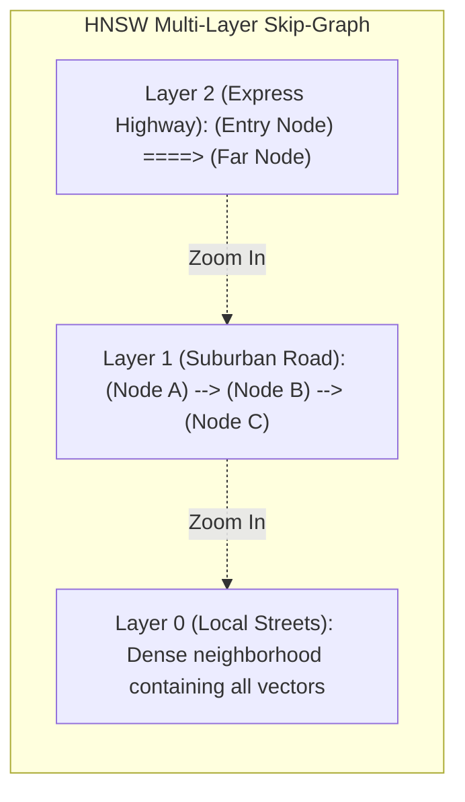

#### The Production Bottleneck: Filtered Vector Search
In enterprise systems, users rarely run pure vector searches. They search with strict business constraints:
```sql
SELECT * FROM documents 
WHERE tenant_id = 'org_42' 
  AND department = 'finance' 
  AND year = 2026
ORDER BY embedding <=> query_vector LIMIT 10;
```

* **Naive Post-Filtering Fails:** If you search the top 100 vectors in HNSW and then filter by metadata, a selective filter might leave you with 0 matching results.
* **Naive Pre-Filtering Fails:** If you filter documents first and try to traverse HNSW, you hit **Graph Disconnection**—the surviving nodes are isolated islands, causing the search algorithm to terminate early with terrible recall.

#### The Modern Solution: ACORN (SIGMOD 2024 / Production 2026)
**ACORN** (*Approximate Nearest Neighbor Search with Constrained Optimized Retrieval Networks*) solves this by dynamically traversing the graph through **predicate-guided multi-hop jumps**:
* If a direct neighbor node doesn't satisfy the metadata filter, ACORN-1 explores the 2-hop neighborhood in real-time during search without requiring a pre-filtered graph rebuild.
* Major enterprise engines (Qdrant, Elasticsearch, Lucene) use ACORN-style predicate traversal to achieve up to **1,000x higher throughput** under strict metadata filtering.

---

### Phase 6: Advanced Hybrid Retrieval & Reranking Realities

#### The Conceptual Core
Dense vector embeddings are great at semantic meaning, but they fail on exact keywords:
* If a user searches for `"SKU-9182-X"`, dense embeddings often match unrelated SKUs because embeddings group concepts, not exact serial numbers.
* Lexical search (**BM25**) excels at exact keyword matching, IDs, and acronyms, but fails when users use synonyms.

**Production Solution: The Hybrid Retrieval Triad**

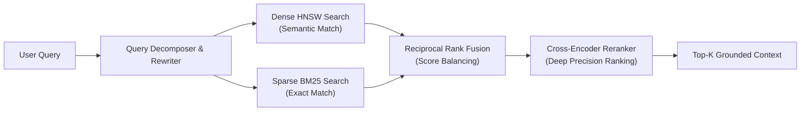

#### Reciprocal Rank Fusion (RRF)
How do you merge a BM25 score (ranging from 0 to 45+) with a Cosine Similarity score (ranging from 0.0 to 1.0) without arbitrary weighting hacks?

You use **Reciprocal Rank Fusion (RRF)**, which relies purely on the rank position:
```text
RRF_Score(d) = Σ [ 1 / (k + r_m(d)) ]  for each ranking system m in M
```
* Where M represents the search systems (Dense and Sparse).
* r_m(d) is the 1-based rank position of document d in system m.
* k is a smoothing constant (standard default is 60).

#### Cross-Encoder Reranking
Bi-encoder embedding models score query and document independently:
```text
Score = e_query · e_doc
```
A **Cross-Encoder** takes the query and document together: `[CLS] Query [SEP] Document [SEP]`, allowing full cross-attention across all tokens. Because cross-encoders are computationally expensive, use a two-stage funnel:
1. Fast retrieval (BM25 + HNSW + RRF) retrieves the top 50 candidates.
2. Cross-encoder scores and reranks those 50 candidates down to the top 5 pristine passages passed to the LLM.

---

### Phase 7: End-to-End Enterprise Scenario (Order & Dispute Platform)

Combine both specializations into a production-grade enterprise case study:

**Scenario:** An enterprise e-commerce platform receives customer inquiries regarding disputed charges, tracking, and refund authorizations.

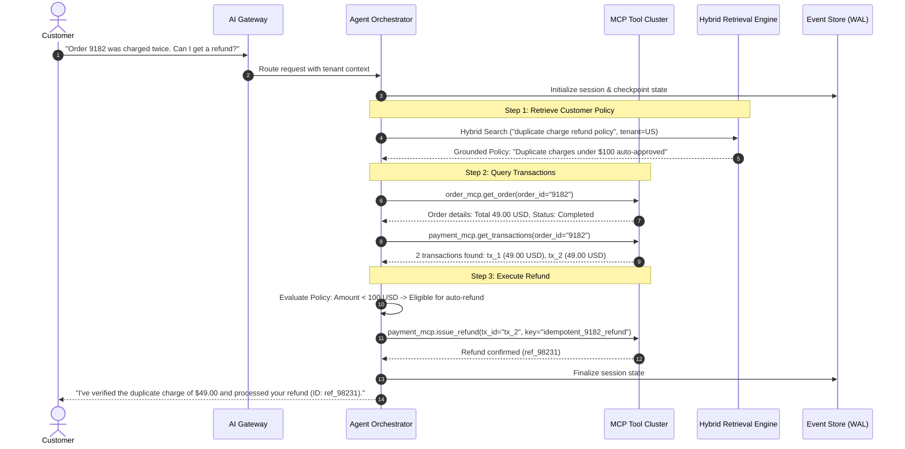

---

### Phase 8: Evaluation Platforms & Automated CI Quality Gates

#### The Conceptual Core
You cannot optimize what you do not measure. In non-deterministic AI systems, code that passed manual testing on Monday can silently break on Tuesday if an upstream model changes its tool-calling format or an embedding model is updated.

#### The Three Levels of Evaluation
1. **RAG Retrieval Quality:**
   * **Context Recall:** Did our hybrid search fetch all facts required to answer the prompt?
   * **Faithfulness / Groundedness:** Does the model's generated answer contain claims not supported by the retrieved context?
2. **Agent Trajectory Evaluation:**
   * It's not enough for the final answer to look pleasant; the agent's intermediate path must be correct.
   * **Trajectory Match:** Did the agent call `order_mcp.get_order` *before* attempting `payment_mcp.issue_refund`?
   * **Negative Constraints:** Did the agent avoid unauthorized tools?
3. **Platform Performance Metrics:**
   * P50 and P99 End-to-End Latency.
   * Token Efficiency: Input vs. Output token count per completed task.
   * Cost Attribution: Exact dollar cost per successful customer resolution.

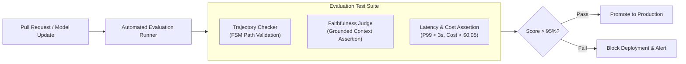

---

### Phase 9: OpenTelemetry GenAI Observability & Cost Attribution

#### The Conceptual Core
Standard web tracing (`http.method`, `http.status_code`) is completely inadequate for AI platforms. When a user requests a refund and the request takes 4.5 seconds, you must know:
* Did the time go to embedding generation, HNSW graph traversal, model reasoning, or an MCP tool retry?
* Which specific prompt tokens caused a context cache miss?

#### Standardized Spans: OpenTelemetry `semantic-conventions-genai`
Implement production tracing using the dedicated OpenTelemetry GenAI conventions:

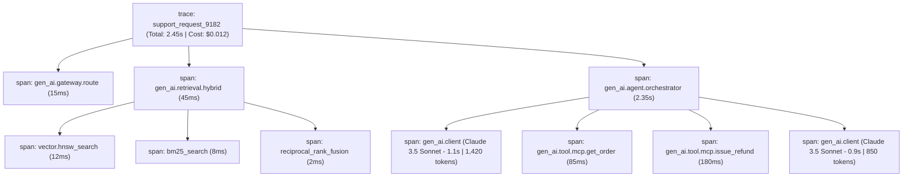

**Attributes to Record on Spans:**
* `gen_ai.system`: `"anthropic"` / `"google"` / `"openai"`
* `gen_ai.request.model`: `"claude-3-5-sonnet-20241022"`
* `gen_ai.usage.input_tokens`: `1420`
* `gen_ai.usage.output_tokens`: `185`
* `gen_ai.tool.name`: `"payment_mcp.issue_refund"`
* `gen_ai.tool.status`: `"success"`
* `app.tenant_id`: `"enterprise_corp_1"`

---

<a id="your-systems-advantage-bridging-netazure-distributed-systems"></a>
## 💼 Your Systems Advantage: Bridging .NET/Azure & Distributed Systems

If you come from a strong background in **C# / .NET, Azure, and distributed systems**, you possess an enormous unfair advantage. Most AI practitioners know how to write a Python prompt script, but have zero experience designing high-throughput, fault-tolerant platforms.

Here is how your background directly maps to the senior AI platform stack:

| Your Distributed Systems / .NET Foundation | The AI Platform Equivalent | How to Frame It in Technical Interviews |
| :--- | :--- | :--- |
| **ASP.NET Core Kestrel / YARP Reverse Proxy** | **High-Throughput Model Gateway** | *"I designed the gateway using low-allocation streaming pipelines to manage token-bucket throttling and connection pooling across upstream model endpoints."* |
| **Azure Service Bus / Durable Functions / Orleans** | **Durable Agent Runtime & Actor State** | *"I modeled the agent loop as an event-driven actor with checkpointed state machines, ensuring long-running tasks survive transient container restarts."* |
| **Azure AI Search (Hybrid BM25 + Vector + Semantic Ranker)** | **Production Enterprise Hybrid RAG** | *"I understand the balance between dense semantic recall, sparse lexical precision, and the computational trade-offs of cross-encoder rerankers."* |
| **Event Sourcing & CQRS (SQL Server / Cosmos DB)** | **Agent Event Log & Write-Ahead Logging (WAL)** | *"Every tool invocation and reasoning trace is appended to an immutable append-only ledger, enabling deterministic replays and auditability."* |
| **OpenTelemetry / Azure Monitor / App Insights** | **OpenTelemetry GenAI Semantic Conventions** | *"I instrumented end-to-end distributed traces linking client requests down to token metrics, vector search latencies, and tool execution spans."* |

---

<a id="the-hands-on-portfolio-agentforge-architecture"></a>
## 🛠️ The Hands-On Portfolio: AgentForge Architecture

To prove these skills conclusively, explore the **`agent-forge/`** directory in this repository. It provides an end-to-end, runnable implementation of the concepts discussed in this guide:

```
agent-forge/
├── README.md                      # Architecture guide & quickstart instructions
├── requirements.txt               # Lightweight dependencies (pure Python + NumPy)
├── demo.py                        # Complete runnable customer refund scenario
└── agent_forge/
    ├── gateway/
    │   ├── model_router.py        # Resilient routing with circuit breaker & fallback
    │   ├── semantic_cache.py      # Vector-based query cache
    │   └── rate_limiter.py        # Token-bucket rate limiting (TPM/RPM)
    ├── runtime/
    │   ├── orchestrator.py        # Durable agent loop with tool repair & max iterations
    │   ├── event_store.py         # Write-Ahead Log (WAL) with state checkpointing
    │   └── state_models.py        # Typed execution envelopes
    ├── mcp/
    │   ├── protocol.py            # Stateless MCP JSON-RPC 2.0 implementation
    │   ├── policy_engine.py       # RBAC/ABAC Zero-trust authorization guard
    │   └── servers/               # Micro-MCP servers (Order, Payment, Policy)
    ├── retrieval/
    │   ├── vector_store.py        # In-memory vector store with Cosine & L2 distance
    │   ├── bm25.py                # Sparse lexical BM25 search engine
    │   ├── hybrid_engine.py       # Reciprocal Rank Fusion (RRF) & ACORN-style filtering
    │   └── embeddings.py          # Deterministic embedding generator
    ├── evals/
    │   ├── trajectory_eval.py     # Multi-turn tool execution order validator
    │   └── groundedness.py        # Contextual faithfulness evaluator
    └── observability/
        ├── tracer.py              # OpenTelemetry GenAI semantic convention tracer
        └── exporter.py            # Console trace tree & cost attribution formatter
```

To run the full end-to-end demonstration:
```bash
cd agent-forge
python demo.py
```

---

<a id="whiteboard-interview-battlecards"></a>
## 🎯 Whiteboard Interview Battlecards

Prepare for these high-signal architecture interview questions:

### 1. "Design an Agent Runtime for 10 Million Users"
* **Key Architecture:** Decouple the HTTP ingress gateway from the agent execution engine via an asynchronous message queue (Service Bus / Kafka).
* **State Management:** Use an event-sourced checkpoint store (Cosmos DB / PostgreSQL). Never hold open thread pools waiting on upstream LLM tokens.
* **Resilience:** Implement deterministic idempotency keys for all state-mutating tool calls to guarantee that retry storms never cause double-charges.

### 2. "How Do You Handle Strict Metadata Filtering in Large Vector Indexes?"
* **The Pitfall:** Pre-filtering isolates nodes and breaks HNSW graph navigation; post-filtering discards so many candidates that top-K results return empty.
* **The Solution:** Use **ACORN-style predicate-guided graph traversal** (evaluating multi-hop neighbors dynamically during graph navigation) or maintain segmented per-tenant vector indexes when tenant isolation is paramount.

### 3. "How Do You Prevent an Agent from Hallucinating Tool Parameters?"
* **Layer 1:** Constrain sampling using formal JSON schema grammars (CFG/FSM enforcement).
* **Layer 2:** Validate payloads at the MCP host boundary using Pydantic / typed schemas.
* **Layer 3:** In the event of validation errors, trigger **Tool Call Repair**—pass the exact error back to the model with an explicit correction directive.

### 4. "How Do You Prove an Agentic System Is Production-Ready?"
* **Continuous Trajectory Testing:** Run regression suites against frozen test sets; verify that 99%+ of runs follow approved tool trajectories.
* **Groundedness Scoring:** Measure the ratio of generated claims supported by retrieved context chunks using automated verifier models.
* **Cost & Latency SLAs:** Enforce strict budget bounds via token-bucket quotas and monitor P99 latency breakdown across vector search, model reasoning, and tool executions using OpenTelemetry GenAI spans.
