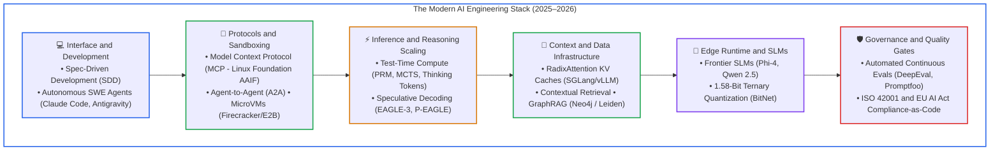
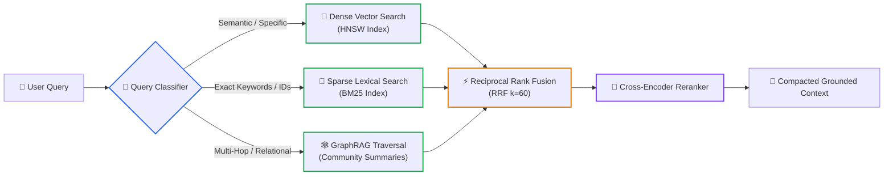

# 🗺️ Emerging AI Technology Roadmap (2025–2026)
### Breakthrough Architectures, Test-Time Compute, Agent Protocols & Systems Engineering

> **The Definitive Technology Roadmap for Tech Leads, Principal Architects, and Engineering Leadership.**  
> [Master Curriculum Syllabus](./README.md) • [The Complete AI Engineer Roadmap (Phases 00–08)](./AI_ENGINEER_ROADMAP.md) • [Senior Platform Infrastructure Roadmap](./ai-platform-and-agent-infrastructure-roadmap.md) • [Production Readiness Review (PRR)](./architecture/production-readiness-review.md) • [Architectural ADRs](./architecture/adrs/README.md) • [Post-Mortems](./architecture/post-mortems/README.md)

---

## 🎯 Executive Summary & Strategic Inflection Points

As of late 2026, AI engineering has passed several foundational inflection points:

1. **The Dual Scaling Law Paradigm:** Scaling compute is no longer confined to pre-training clusters. **Test-time compute (inference scaling)** has established a second scaling axis (System 2 thinking), trading inference latency for verified, multi-step problem solving.
2. **From Conversational Chat to Governed Agentic Infrastructure:** The ecosystem has converged on open interoperability protocols—specifically the **Model Context Protocol (MCP)** and Google's **Agent-to-Agent (A2A)** protocol under the Linux Foundation—and microVM execution sandboxes (Firecracker/E2B), transforming agents from fragile prompt loops into governed distributed systems.
3. **From "Vibe Coding" to Spec-Driven Development (SDD):** Engineering teams are abandoning uncontrolled prompt-driven coding in favor of formal, machine-readable specifications (`SPEC.md`, architectural contracts, and deterministic verification gates).
4. **Context-Augmented Infrastructure & Inference Acceleration:** Radical breakthroughs in KV-cache sharing (**RadixAttention**), **GraphRAG**, and **Speculative Decoding (EAGLE-3/P-EAGLE)** deliver 2–4x latency improvements and 70–80% cost reductions.
5. **Governance-as-Code:** Phased enforcement of the **EU AI Act** and certification under **ISO 42001** have made automated evaluation suites, LLM-as-a-judge guardrails, and adversarial red-teaming mandatory release criteria.

---

## 1. Agentic AI & Orchestration Architecture

### 1.1 Model Context Protocol (MCP) as the Open Standard
* **Current State & Evolution:** Donated to the Linux Foundation's **Agentic AI Foundation (AAIF)**, MCP is the industry-standard **"USB-C for AI."** It replaces bespoke tool integrations with a universal, client-host-server protocol based on JSON-RPC 2.0. The specification features a stateless, routable, and cacheable architecture supporting horizontal load balancing.
* **Core Primitives:**
  - **Tools:** Action-oriented executable functions (APIs, databases, bash runners) invoked by model decisions.
  - **Resources:** Data-oriented, read-only context streams (file descriptors, logs, database records) for zero-hallucination grounding.
  - **Prompts:** Workflow-oriented reusable templates and slash-commands exposed directly by the server.
  - **Roots & Reverse Sampling:** File system boundary declarations and server-initiated model completion requests (`sampling/createMessage`).
* **Transport Mechanisms:** Dual support for `stdio` (local IDE/CLI development) and **Streamable HTTP/SSE (Server-Sent Events)** for cloud-native, scalable production clusters.
* **Roadmap Recommendation:** Deprecate proprietary tool bindings; expose internal data sources and microservices through containerized MCP servers.

### 1.2 MicroVM Sandboxes & Secure Code Execution (Firecracker / E2B)
* **Threat Model:** AI agents generating and executing non-deterministic code introduce severe attack vectors: credential exfiltration, prompt injection jailbreaks, and container breakout escapes.
* **Architectural Solutions:**
  - **Firecracker MicroVMs (E2B):** Hardware-level virtualization providing an independent Linux kernel per agent session with sub-second startup (<200ms) for ephemeral task execution.
  - **gVisor Container Isolation (Modal):** Intercepts system calls in user space; ideal for serverless GPU-bound tasks and heavy ML pipelines.
  - **Persistent Workspaces (Daytona):** Stateful developer environments (Docker/Kata/Sysbox) where agents maintain dependencies and file state over long sessions.
  - **Egress & Syscall Governance:** Deny-by-default network firewalls, ephemeral credential injection (preventing the LLM from seeing raw API keys), and strict seccomp syscall filtering.

### 1.3 Multi-Agent Frameworks & Agent-to-Agent (A2A) Protocols
* **Orchestration Paradigms:** Moving away from monolithic prompt chains to deterministic Directed Acyclic Graphs (DAGs) and state machines (Google ADK / Antigravity, LangGraph, Microsoft Agent Framework).
* **Supervisor vs. Swarm Architectures:** Centralized supervisor agents handle routing and sub-task delegation, while choreographic swarms pass typed message payloads over shared event buses.
* **The Open Protocol Stack:** MCP governs the **Agent-to-Tool** foreign function boundary; Google's **Agent-to-Agent (A2A)** protocol (Linux Foundation standard) governs **Agent-to-Agent** task delegation, discovery, and Agent Cards.
* **Human-in-the-Loop Workflows:**
  - **Durable Execution & Breakpointing:** Agent execution pauses before executing state-mutating actions (financial transactions, DB writes, code deployment).
  - **Time-Travel Debugging:** State replay and state mutation allowing human reviewers to edit context or fork execution before resuming.

---

## 2. Inference, Reasoning & Compute Scaling

### 2.1 Test-Time Compute & System 2 Reasoning
* **System 1 vs. System 2 Thinking:** Traditional LLMs operate as System 1 (fixed compute per token, autoregressive probability matching). Frontier reasoning models (OpenAI o1/o3, DeepSeek-R1) leverage System 2 thinking, scaling compute dynamically during inference.
* **Core Mechanisms:**
  - **Long Chain-of-Thought (CoT):** Hidden or visible self-correction, backtracking, and exploration tokens before output generation.
  - **Search-Augmented Reasoning & MCTS:** Monte Carlo Tree Search exploring candidate branches, guided by **Process Reward Models (PRMs)** that score individual intermediate steps rather than just final outcomes (ORMs).
  - **Best-of-N / Verifier Voting:** Sampling multiple paths and filtering via deterministic test suites or validator models.
* **Roadmap Recommendation:** Implement intelligent task routing. Direct high-velocity queries to fast-path SLMs; route complex mathematical, architectural, and multi-step debugging tasks to reasoning models with defined token budget caps.

### 2.2 Speculative Decoding (EAGLE-3 & P-EAGLE)
* **The Memory-Bandwidth Bottleneck:** Autoregressive decoding is severely memory-bandwidth bound. Speculative decoding uses a lightweight draft mechanism to generate K candidate tokens verified in a single parallel forward pass by the target model.
* **Modern Approaches:**
  - **EAGLE-3:** State-of-the-art drafter operating on the top-layer hidden states of the target model with multi-layer feature fusion, closing distribution mismatch and achieving >80% acceptance rates.
  - **P-EAGLE:** Parallel drafting that outputs draft tokens in one step, optimized for NVIDIA Hopper and Blackwell architectures.
  - **Production Impact:** Supported natively in vLLM, SGLang, and TensorRT-LLM, achieving **2x to 4x throughput improvements** with zero loss in generation fidelity.

---

## 3. Modern AI Data & Context Infrastructure

### 3.1 RadixAttention & KV-Cache Infrastructure
* **The Prefill Bottleneck:** In agentic workflows, large system prompts, tool schemas, and document histories are repeatedly submitted, creating massive redundant prefill computation.
* **RadixAttention (SGLang) & PagedAttention (vLLM):** Organizes KV caches into a radix tree (compressed prefix tree), allowing instant KV reuse across divergent agent requests.
* **Context-Augmented Generation (CAG):** Instead of repeated retrieval queries, enterprises pre-load stable enterprise knowledge bases directly into cached memory, transforming latency from multi-second RAG to near-instant token generation.

### 3.2 Contextual Retrieval & Knowledge Graphs (GraphRAG)
* **Contextual Retrieval (Anthropic):** Prepending document-level context to each chunk before embedding and BM25 indexing, reducing retrieval failures by 35% to 67%.
* **Limitations of Vector-Only RAG:** Vector search fails at multi-hop reasoning, thematic aggregation, and understanding complex relationships across documents.
* **GraphRAG Architecture:**
  - Extracts entities and directed relationships into a Knowledge Graph (Neo4j, Microsoft GraphRAG).
  - Performs community detection (Leiden algorithm) and generates hierarchical summaries.
  - **Hybrid Retrieval Triad:** Combines dense semantic vector search + sparse BM25 lexical search + graph traversal queries, ranked via reciprocal rank fusion (RRF) and cross-encoder rerankers.

---

## 4. Small Language Models (SLMs) & Edge AI

### 4.1 Frontier SLMs (Phi-4, Qwen 2.5)
* **Market Leaders:**
  - **Microsoft Phi-4 (14B):** Sets the benchmark for synthetic-data-driven mathematical, reasoning, and coding capabilities, rivaling models 5x its size.
  - **Alibaba Qwen 2.5 (0.5B–72B, specifically 7B & 14B):** Outstanding multilingual performance, function calling, and structured JSON output.
  - **Google Gemma 2/3 & Meta Llama 3.2/3.3:** Efficient foundations for specialized on-premise fine-tuning.

### 4.2 Quantization & Local Execution Runtimes
* **Quantization Innovations:**
  - **BitNet 1.58-Bit (Ternary Weights {-1, 0, 1}):** Replaces matrix multiplications with integer additions, slashing compute energy by 70% and memory footprint by 80%. Supported via `bitnet.cpp`.
  - **AWQ, EXL2, GGUF:** Preserves salient weights, allowing 14B models to run comfortably within 8–10 GB of VRAM.
* **Edge Runtimes:**
  - **Apple MLX:** Optimized for Apple Silicon Unified Memory Architecture.
  - **WebGPU / WebLLM:** Executes models client-side inside user browsers with zero backend server costs and complete privacy.
  - **Ollama & llama.cpp:** The standard containerized runtime for local enterprise servers and developer workstations.

---

## 5. AI-Native Software Engineering & Governance

### 5.1 Spec-Driven Development (SDD)
* **The Problem:** "Vibe coding" (asking LLMs to write code from informal prompts) generates compounding technical debt, undetected edge-case bugs, and architectural drift.
* **The SDD Methodology:**
  1. **Formal Requirements:** Engineers write structured specifications (`SPEC.md`, system requirements, OpenAPI specs, behavioral assertions).
  2. **Architectural Guidelines:** Context files (`.cursorrules`, `CLAUDE.md`, `AGENTS.md`) define project boundaries, typing standards, and dependencies.
  3. **Agent Implementation:** AI agents generate code strictly bounded by the specification.
  4. **Automated Verification:** Deterministic compiler checks, linting, and unit tests validate conformance before human review.

### 5.2 Regulatory Compliance & Governance-as-Code (ISO 42001 & EU AI Act)
* **EU AI Act Timeline:** High-risk system transparency, audit trails, and risk management requirements are actively enforced.
* **ISO/IEC 42001 (AIMS):** The global standard for Artificial Intelligence Management Systems. Organizations use ISO 42001 to operationalize "Compliance-as-Code"—treating evaluation scorecards, guardrail logs, and agent audit trails as evidentiary documentation.

---

## 📊 Strategic Technology Roadmap Matrix (2025–2026)

| Technology / Capability | Maturity Level | Primary Architectural Benefit | Practical Adoption Advice | Anti-Patterns to Avoid |
| :--- | :--- | :--- | :--- | :--- |
| **Model Context Protocol (MCP)** | **Production-Ready** (Mainstream Standard) | Universal, vendor-neutral connectivity between AI hosts, databases, and APIs. | Implement remote MCP servers via Streamable HTTP/SSE; standardize internal APIs with MCP schemas. | Writing bespoke API wrappers for every LLM or agent tool framework. |
| **MicroVM Sandboxes (Firecracker / E2B)** | **Production-Ready** | Hardware-level kernel isolation for untrusted agent code execution; prevents system compromise. | Deploy ephemeral microVMs for any agent running shell, Python, or data analysis tasks; restrict network egress. | Running LLM-generated code in shared, long-lived, uncontained Docker containers. |
| **Speculative Decoding (EAGLE-3 / P-EAGLE)** | **Production-Ready** | 2x–4x inference speedup with zero quality degradation; slashes HBM bandwidth saturation. | Enable speculative drafting in vLLM/SGLang configurations for all high-throughput inference endpoints. | Using poorly trained, non-aligned draft models that cause verification rejections and latency penalties. |
| **Test-Time Compute (Reasoning Models)** | **Accelerating** | Autonomous System 2 verification, complex logic solving, self-correcting code generation. | Route high-complexity tasks (architecture design, bug diagnosis, math) to reasoning models; use token budget caps. | Defaulting every simple user prompt to reasoning models (wasting latency and budget). |
| **RadixAttention & Context Caching** | **Production-Ready** | Up to 80% reduction in Time to First Token (TTFT) and input token costs via shared KV caches. | Transition to SGLang/vLLM engines with prefix caching; structure system prompts with static prefixes first. | Frequently modifying the beginning of system prompts, invalidating KV-cache trees. |
| **GraphRAG + Contextual Retrieval** | **Accelerating** | Eliminates multi-hop reasoning failures; maps complex enterprise entity relationships. | Build community knowledge graphs for dense documentation; prepend chunk context before indexing. | Forcing simple FAQ/lookup queries through an expensive multi-hop knowledge graph query. |
| **Automated Eval Suites (DeepEval / Promptfoo)** | **Production-Ready** | Deterministic CI/CD release gates; prevents regression in prompts and agent capabilities. | Integrate Promptfoo/DeepEval into GitHub Actions; run pairwise evaluations against frozen ground-truth sets. | Relying on subjective manual eyeballing or a single uncalibrated LLM judge. |
| **ISO 42001 & Guardrails Governance** | **Accelerating / Mandatory** | Demonstrable compliance with EU AI Act; operationalizes enterprise AI risk management. | Implement runtime input/output guardrails (Llama Guard); create audit-ready logging of all model decisions. | Treating compliance as a post-launch manual audit rather than automated "Compliance-as-Code". |
| **Frontier SLMs (Phi-4, Qwen 2.5) on Edge** | **Production-Ready** | Zero API cost, sub-10ms latency, 100% on-premise data privacy; runs on commodity NPUs/Macs. | Deploy SLMs for localized extraction, classification, and drafting tasks using Ollama or vLLM; explore WebGPU for web clients. | Assuming frontier cloud LLMs are required for simple structured data transformation tasks. |
| **Spec-Driven Development (SDD)** | **Production-Ready** (High ROI) | Prevents code bloat, architectural decay, and hallucinated logic in AI-assisted development. | Enforce formal `SPEC.md` and repository guidelines (`.cursorrules`, `AGENTS.md`) before agents write code; verify via CI. | "Vibe coding" directly against production branches without specification bounds or deterministic tests. |

---

## 🗓️ Enterprise Adoption Horizon (0–12 Months)

```mermaid
flowchart LR
    subgraph H1["Horizon 1: Foundations (Months 0–3)"]
        T1["📝 IDE Contracts (SPEC.md / AGENTS.md)"]
        T2["🧪 Automated CI/CD Eval Gates (DeepEval)"]
        T3["🔌 Internal MCP Tool Servers (AAIF Standard)"]
        T1 --> T2 --> T3
    end

    subgraph H2["Horizon 2: Performance (Months 3–6)"]
        T4["⚡ RadixAttention and Prefix Caches"]
        T5["🎯 Speculative Decoding (EAGLE-3)"]
        T6["🔒 MicroVM Execution (Firecracker / E2B)"]
        T7["🕸️ Contextual Retrieval and GraphRAG"]
        T4 --> T5 --> T6 --> T7
    end

    subgraph H3["Horizon 3: Scale and Edge (Months 6–12)"]
        T8["🔀 Test-Time Compute Task Router"]
        T9["📱 Edge SLMs (Phi-4, BitNet 1.58b)"]
        T10["🛡️ ISO 42001 and EU AI Act Auditing"]
        T8 --> T9 --> T10
    end

    T3 --> T4
    T7 --> T8

    style H1 fill:none,stroke:#2563eb,stroke-width:2px
    style H2 fill:none,stroke:#d97706,stroke-width:2px
    style H3 fill:none,stroke:#16a34a,stroke-width:2px

    style T1 stroke:#2563eb,stroke-width:2px
    style T2 stroke:#2563eb,stroke-width:2px
    style T3 stroke:#2563eb,stroke-width:2px
    style T4 stroke:#d97706,stroke-width:2px
    style T5 stroke:#d97706,stroke-width:2px
    style T6 stroke:#d97706,stroke-width:2px
    style T7 stroke:#d97706,stroke-width:2px
    style T8 stroke:#16a34a,stroke-width:2px
    style T9 stroke:#16a34a,stroke-width:2px
    style T10 stroke:#16a34a,stroke-width:2px
```

### Key Takeaway for Engineering Leaders
The winning engineering organizations in 2025–2026 are not those frantically experimenting with every new model; they are those that build **modular, standardized infrastructure** (MCP, microVM sandboxes, RadixAttention KV caching, and Spec-Driven CI/CD pipelines) that can seamlessly incorporate whatever frontier reasoning model or edge SLM emerges tomorrow.

---

## 🧭 Navigation

- **Master Curriculum Syllabus**: [← Back to Master Curriculum & Architecture (README.md)](./README.md)
- **Conceptual Roadmap**: [🗺️ The Complete AI Engineer Roadmap (Phases 00–08)](./AI_ENGINEER_ROADMAP.md)
- **Senior Platform Infrastructure**: [🏗️ The Senior AI Platform & Agent Infrastructure Roadmap](./ai-platform-and-agent-infrastructure-roadmap.md)
- **Senior Transition Guide**: [🏛️ The Senior AI Transition Guide](./senior-transition-guide.md)
- **Production Audit**: [🛡️ Production Readiness Review (PRR)](./architecture/production-readiness-review.md)
- **Phase Hubs**:
  - [Phase 00: Foundations & Token Mechanics](./00-foundations-and-token-mechanics/README.md)
  - [Phase 01: Prompt & Context Engineering](./01-prompt-and-context-engineering/README.md)
  - [Phase 02: Retrieval & Knowledge Systems](./02-rag-and-knowledge-systems/README.md)
  - [Phase 03: Tools & Model Context Protocol](./03-tools-and-model-context-protocol/README.md)
  - [Phase 04: Agentic Systems & Orchestration](./04-agentic-systems-and-orchestration/README.md)
  - [Phase 05: AI Security & Guardrails](./05-ai-security-and-guardrails/README.md)
  - [Phase 06: Evals & Observability](./06-evals-and-observability/README.md)
  - [Phase 07: High-Throughput Serving & LLMOps](./07-production-deployment-and-llmops/README.md)
  - [Phase 08: AI-Augmented SDLC & Leadership](./08-ai-augmented-sdlc-and-leadership/README.md)
