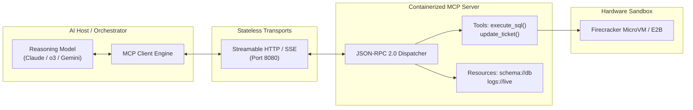

# ADR-002: Model Context Protocol (MCP) vs. Bespoke REST / gRPC Tool Bindings

## Status
`ACCEPTED` (Mandatory Standard for all External Tool & Data Integrations)

---

## Context & Problem Statement
In early agentic architectures, each development team built custom tool-calling wrappers: one team formatted OpenAPI specs for OpenAI Function Calling, another team wrote custom LangChain tool definitions, and another maintained direct gRPC stubs.

This fragmentation caused:
1. **Compounding Integration Tax:** Every new LLM provider or agent framework required rewriting tool adapters.
2. **Context Bloat & Token Inefficiency:** Dumping raw JSON schemas into every prompt consumed 3,000–8,000 tokens before the user entered a single word.
3. **Severe Security Vulnerabilities:** Tools executed with ambient server privileges in shared containers without isolation.

---

## Decision Drivers
1. **Vendor-Neutral Interoperability:** decouple tool implementations from specific LLM vendors (Anthropic, OpenAI, Google) and client frameworks (Cursor, Claude Code, custom agents).
2. **Standardized Context Primitives:** Distinguish between executable state-mutating actions (**Tools**) and passive, read-only data streams (**Resources**).
3. **Transport Flexibility:** Support local CLI execution via `stdio` and cloud-native scalable clusters via **Streamable HTTP/SSE (Server-Sent Events)**.
4. **Hardware-Level Security:** Enforce execution sandboxing between model orchestration and tool execution.

---

## Considered Alternatives

### Alternative 1: Bespoke Custom REST / OpenAPI Tool Adapters
* **Pros:** Familiar to existing web developers; uses standard HTTP clients.
* **Cons:** No standardized protocol for streaming output, bidirectional notifications, or context resources; leads to brittle, one-off glue code across every repository.

### Alternative 2: Framework-Specific Bindings (LangChain / Semantic Kernel Tools)
* **Pros:** Easy to bootstrap in framework tutorials.
* **Cons:** Deep vendor/library lock-in; breaks whenever the underlying library releases a major version; cannot be reused across languages (.NET, Go, Python).

### Alternative 3: Model Context Protocol (MCP - Linux Foundation Standard)
* **Pros:** Universal JSON-RPC 2.0 open standard; native separation of Tools, Resources, and Prompts; client-side schema caching; supported natively across major developer tools; clean separation of host and server.
* **Cons:** Relatively new protocol specification; requires managing containerized MCP sidecars in Kubernetes.

---

## Decision Outcome
* **Chosen Option:** **Alternative 3: Model Context Protocol (MCP)** as the non-negotiable enterprise standard for exposing databases, internal microservices, and file systems to AI agents.

### Architectural Blueprint

---

## Architectural Trade-Off Scorecard

| Evaluation Dimension | Bespoke REST Tool Bindings | Framework Plugins (LangChain) | Model Context Protocol (MCP) |
| :--- | :---: | :---: | :---: |
| **Cross-Language Portability** | Medium (Requires SDKs) | Zero (Python-Only) | **High (Standard JSON-RPC)** |
| **Token Schema Overhead** | High (Full schema per call) | High | **Low (Client-Side Caching)** |
| **Resource Grounding Support** | Manual RAG plumbing | Manual | **Native `resources/read`** |
| **Asynchronous Long Jobs** | Ad-hoc polling | None | **Native Tasks Extension** |
| **Security Sandboxing** | Manual per endpoint | Rare | **Standard MicroVM Sidecar** |

---

## Mandatory Engineering Rules

1. **Protocol Transport Standard:** All internal cloud microservices MUST expose MCP over **Streamable HTTP with Server-Sent Events (SSE)**. The `stdio` transport is permitted solely for local CLI tools.
2. **Resource vs. Tool Discipline:**
   * If an operation is read-only (fetching schema, reading logs, viewing documents), expose it as an **MCP Resource (`resources/list`, `resources/read`)**, NOT a Tool. This allows client caching and avoids accidental state mutations.
   * If an operation executes code or mutates state, expose it as an **MCP Tool (`tools/call`)**.
3. **Execution Sandboxing:** Any MCP server that evaluates dynamic code (Bash, Python, SQL) must run within an ephemeral **Firecracker microVM (E2B)** with deny-by-default egress.

---

## Negative Consequences & Mitigations

* **Consequence 1: Network Overhead of Additional Sidecar Hops:** Adding an MCP proxy hop introduces 5–12ms of network latency.  
  $\to$ **Mitigation:** Co-locate MCP servers in the same Kubernetes pod as the host application using `localhost` HTTP loopback.
* **Consequence 2: Dynamic Schema Invalidation:** If an underlying database schema changes, the cached MCP tool schema could become stale.  
  $\to$ **Mitigation:** Implement automated MCP server notification webhooks (`notifications/tools/list_changed`) that force clients to refresh tool definitions dynamically.
