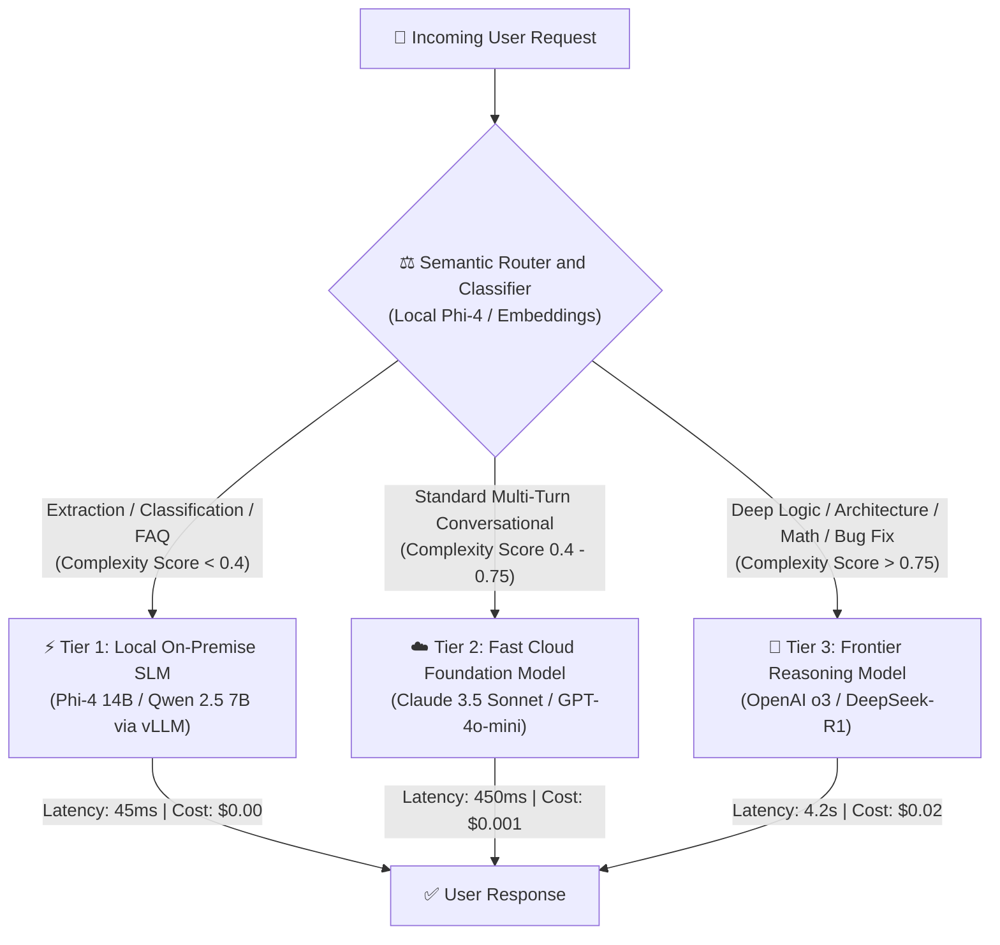

# ADR-003: Frontier Reasoning Models (Test-Time Compute) vs. Local Domain SLMs

## Status
`ACCEPTED` (Hybrid Dynamic Routing Policy)

---

## Context & Problem Statement
With the emergence of System 2 reasoning models (OpenAI o1/o3, DeepSeek-R1) and frontier Small Language Models (Microsoft Phi-4 14B, Alibaba Qwen 2.5 7B/14B), engineering teams face a stark trade-off:
* **Reasoning Models:** Excel at multi-step mathematical planning, complex code generation, and self-correction, but introduce high Time to First Token (TTFT > 2,500ms) and cost \$15–\$60 per 1M tokens.
* **Compact SLMs:** Offer sub-50ms latency, zero cloud API costs when run locally, and 100% data sovereignty, but struggle with complex planning and multi-hop constraint verification.

Defaulting every request to a frontier reasoning model creates unacceptable latency and bankrupts unit economics; defaulting everything to an SLM causes unacceptable error rates on complex tasks.

---

## Decision Drivers
1. **Unit Economics & Gross Margin:** Average cost per customer interaction must remain under **\$0.005**, while maintaining 99%+ accuracy on high-stakes tasks.
2. **User Experience SLA:** Real-time conversational search and extraction must respond in **< 400ms**. Complex code refactoring and data analysis can tolerate **up to 15 seconds**.
3. **Data Sovereignty & Compliance:** Sensitive employee data (PII, salary, legal documents) must not leave our sovereign VPC boundary.

---

## Decision Outcome
* **Chosen Option:** Implement an **Intelligent Tiered Routing Gateway** based on semantic intent classification and deterministic complexity scoring.

---

## Architectural Trade-Off Scorecard

| Metric | Local SLM (Phi-4 14B) | Fast Foundation (Claude 3.5 Sonnet) | Frontier Reasoning (OpenAI o3) |
| :--- | :---: | :---: | :---: |
| **P99 TTFT** | **35ms** | 480ms | 3,800ms (CoT Thinking) |
| **Cost per 1M Tokens** | **\$0.00 (Self-Hosted)** | \$3.00 In / \$15.00 Out | \$10.00 In / \$40.00 Out |
| **Logic & Math Accuracy** | 76% | 88% | **96% (Verified Search)** |
| **Data Privacy** | **100% In-VPC / On-Prem** | Cloud API (Trust Bound) | Cloud API |
| **Throughput (TPS)** | **120 tokens/sec** | 65 tokens/sec | 25 tokens/sec |

---

## Mandatory Routing Policies

1. **Deterministic Rule-Based Fast-Paths:** If a user query matches structured JSON extraction, regex formatting, or single-turn sentiment analysis, it **MUST be routed to Tier 1 (Local SLM)**. Calling a frontier reasoning model for basic extraction is treated as a P1 architectural defect.
2. **Reasoning Token Budget Caps:** When calling Tier 3 models, always set an explicit budget cap (`max_completion_tokens` or `thinking_budget = 4096`) to prevent models from generating runaway chains of thought on ambiguous prompts.
3. **Fallback Escalation Pattern:** If Tier 1 emits JSON that fails Pydantic schema validation twice, escalate the request dynamically to Tier 2 with the validation error attached in context.
