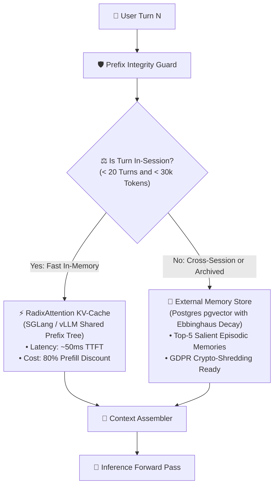

# ADR-004: RadixAttention Shared KV-Cache vs. External Semantic Memory Stores

## Status
`ACCEPTED` (Layered Context Memory Architecture)

---

## Context & Problem Statement
In agentic and multi-turn workflows, the agent accumulates state over time. Engineers have historically approached state management in two conflicting ways:
1. **The Pure RAG / Memory Store Camp (External MaaS):** Treating the LLM as stateless; persisting memories into external vector databases (Mem0, Zep, LangGraph Store) and retrieving top-K snippets on every turn.
2. **The In-Memory KV-Cache Camp (RadixAttention / Prefix Caching):** Pre-loading complete system guidelines, tool schemas, and full conversation history directly into GPU memory, leveraging radix tree prefix-caching (SGLang / vLLM) to achieve zero redundant prefill compute.

External retrieval suffers from retrieval blind spots (missing nuances from 5 turns ago), while in-memory caching risks high VRAM footprints and prefix cache eviction under traffic spikes.

---

## Decision Drivers
1. **Time to First Token (TTFT):** Keep latency under 300ms for continuous multi-turn conversations.
2. **Context Fidelity:** Eliminate "Lost-in-the-Middle" retrieval errors and context fragmentation.
3. **GPU VRAM Saturation:** Ensure our inference clusters (A100/H100 80GB) do not encounter Out-of-Memory (OOM) errors during peak concurrency.
4. **GDPR / Privacy Compliance:** Satisfy Article 17 "Right to be Forgotten" requirements without needing to retrain or fine-tune models.

---

## Decision Outcome
* **Chosen Option:** Implement a **Layered Hybrid Memory Hierarchy**:
  * **Layer 1 (Working Memory / Fast Session Context):** Use **RadixAttention prefix-caching** for in-flight conversation turns and static system prompts.
  * **Layer 2 (Long-Term Episodic Memory):** Offload compressed, semantic facts to an **External Memory Store (PostgreSQL `pgvector`)** with Ebbinghaus forgetting curves and user encryption keys for GDPR crypto-shredding.

---

## Architectural Trade-Off Scorecard

| Memory Layer | RadixAttention KV-Cache | External Vector Store (MaaS) |
| :--- | :---: | :---: |
| **Lookup Latency** | **Instant (Zero Retrieval Overhead)** | 25–60ms (Vector Embedding + DB query) |
| **Prefill Token Cost** | **80% discount on cache hits** | Full price on all retrieved tokens |
| **Memory Lifetime** | Ephemeral (Session / Node lifetime) | **Permanent (Cross-session persistence)** |
| **Recall Completeness** | **100% of session context** | Approximate (Top-K semantic similarity) |
| **Hardware Footprint** | Consumes GPU HBM memory | Consumes standard disk/RAM |

---

## Mandatory Engineering Rules

1. **Static System Prefix Invariant:** System instructions, tool JSON schemas, and static few-shot examples MUST be placed at the **absolute beginning of the prompt**. Dynamic metadata (timestamps, session IDs, user IDs) MUST be placed at the end of the prompt or inside the user turn. Violating this rule invalidates the Radix tree and destroys GPU cache reuse.
2. **Context Compaction Gate:** When working session length exceeds 30,000 tokens, trigger a background compaction agent that extracts salient facts into the external memory store, truncating older raw conversation turns.
3. **Crypto-Shredding on Deletion:** User profile memories stored in Layer 2 must be encrypted with a dedicated per-user AES-256 key stored in AWS KMS / HashiCorp Vault. When a user requests data deletion, destroying their KMS key renders all historical episodic memories cryptographically unrecoverable.
