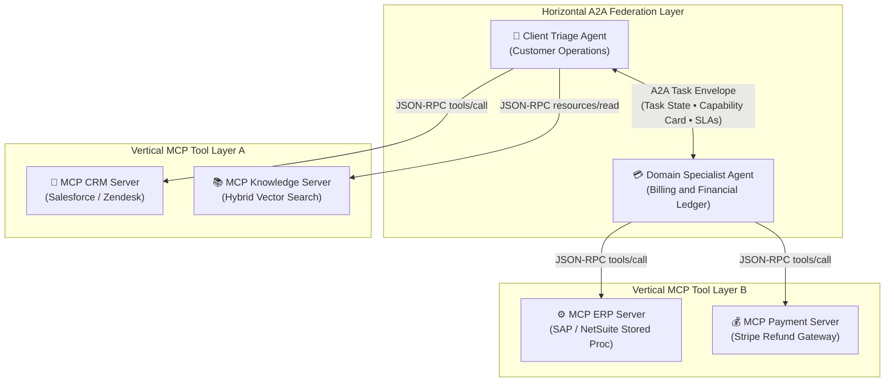

# ADR-005: Agent-to-Agent (A2A) vs. Model Context Protocol (MCP) Boundary

## Status
`ACCEPTED` (Universal Enterprise Architecture Standard)

---

## Context & Problem Statement

As enterprise AI systems evolve from single prompt-response workflows to complex multi-step platforms, engineering teams face an architectural dilemma: **How should autonomous components communicate with external capabilities and with each other?**

Teams frequently conflate two fundamentally different communication patterns:
1. **Vertical Integration (Model-to-Tool / Model-to-Data):** An agent model requires access to a database, external API, calculator, code sandbox, or enterprise ledger to complete a specific task.
2. **Horizontal Coordination (Agent-to-Agent Swarms):** Specialized, independently managed agents (e.g., Billing Agent, HR Compliance Agent, IT Infrastructure Agent) must collaborate, negotiate sub-goals, pass state, and orchestrate business processes across organizational boundaries.

Attempting to solve both problems with a single protocol leads to catastrophic anti-patterns:
* Using conversational multi-agent handoffs for simple database lookups wastes hundreds of seconds in latency and burns thousands of tokens per hop.
* Treating complex autonomous agents as raw Model Context Protocol (MCP) tools strips out multi-turn task negotiation, capability discovery, and asynchronous task tracking.

---

## Decision Drivers

1. **Protocol Orthogonality:** Clean architectural separation between vertical capability execution (low-latency, deterministic, strongly-typed tool schemas) and horizontal agent federation (asynchronous goal negotiation, dynamic task delegation, and capability cards).
2. **Security & Least Privilege:** Enforcing strict Attribute-Based Access Control (ABAC) and sandboxed execution boundaries on individual tools while enabling cryptographically signed, zero-trust delegation tokens between autonomous agents.
3. **Context Economy & Latency:** Preventing context bloat and prompt dilution by forbidding raw multi-turn conversation forwarding, enforcing compact structured task envelopes across agent handoffs.
4. **Standardization & Multi-Provider Interoperability:** Adopting open wire protocols governed by the **Agentic AI Foundation (Linux Foundation)** to prevent vendor lock-in across Anthropic, Google, Microsoft, and open-source ecosystems.

---

## Architectural Protocol Boundary Diagram



#### Diagram Walkthrough:
1. **Horizontal Plane (A2A Protocol)**: Autonomous agents federate peer-to-peer or via supervisors across domain boundaries using standardized A2A task envelopes, exchanging capability cards and negotiating SLA commitments.
2. **Vertical Plane (MCP Standard)**: Each individual agent communicates downwards to its registered databases, enterprise microservices, and execution sandboxes via Model Context Protocol JSON-RPC 2.0 primitives (`tools/call`, `resources/read`).

---

## Considered Alternatives

### Alternative 1: Monolithic Tool Registry (Everything as an MCP Tool)
* **Description:** Treat all capabilities—including other autonomous agents—as simple MCP tools exposed to a single central "Super Agent".
* **Pros:** Single protocol across the entire stack; simple mental model initially.
* **Cons:** Single point of failure; massive prompt bloat as tool registry exceeds 100+ tools; super-agent context window quickly degrades; impossible to model peer negotiation, asynchronous background tasks, or multi-tenant agent ownership across business units.

### Alternative 2: Pure Conversational Swarm (No MCP; Tools wrapped in Sub-Agents)
* **Description:** Every tool is wrapped in an individual LLM sub-agent. The primary agent uses natural language conversation to ask the "Database Agent" to run a query.
* **Pros:** Flexible, intuitive natural language routing.
* **Cons:** Devastating latency overhead (adds 1,000–3,000ms per tool invocation); non-deterministic tool calling; high token expenditure; extreme risk of hallucinated parameter values and prompt injection.

### Alternative 3: Layered Dual-Protocol Architecture (A2A Horizontal + MCP Vertical)
* **Description:** Standardize on **Model Context Protocol (MCP)** for all vertical tool and resource access; standardize on **Agent2Agent (A2A)** for all horizontal inter-agent delegation and lifecycle negotiation.
* **Pros:** Strict separation of concerns; individual agents maintain small, high-precision MCP tool sets; A2A capability cards enable dynamic agent discovery; compact task envelopes eliminate context rot; aligns with Linux Foundation industry consensus.
* **Cons:** Requires engineering teams to maintain two protocol specifications and serialization harnesses.

---

## Decision Outcome

* **Chosen Option:** **Alternative 3: Layered Dual-Protocol Architecture (A2A Horizontal + MCP Vertical)**.

### The Architectural Boundary Invariant
```text
IF Target == Resource, Deterministic API, File, or Database ⟹ Use Model Context Protocol (MCP)
IF Target == Autonomous Reasoning System, Multi-Turn Workflow, or External Domain ⟹ Use Agent2Agent (A2A)
```

---

## Architectural Comparison Matrix

| Architectural Dimension | Model Context Protocol (MCP 2026) | Agent2Agent Protocol (A2A) |
| :--- | :--- | :--- |
| **Primary Architectural Vector** | **Vertical**: Connects model to local/remote tools & data. | **Horizontal**: Connects autonomous agents to peer agents. |
| **Wire Protocol & Transport** | JSON-RPC 2.0 over `stdio` or HTTP `POST /sse`. | JSON / HTTP REST / gRPC with asynchronous Webhooks. |
| **Primary Interaction Primitives** | `tools/list`, `tools/call`, `resources/read`, `prompts/get`. | `tasks/submit`, `tasks/status`, `capability_card/get`, `handoff`. |
| **Discovery Mechanism** | Server capability negotiation with `ttlMs` cache headers. | Immutable **Agent Capability Cards** declaring competencies & SLAs. |
| **State & Context Sharing** | Ephemeral, per-request argument and result payloads. | Structured **Task Envelopes** with explicit memory handoffs (max 400 tokens). |
| **Security & Authorization** | ABAC tool policies, caller identity headers, local OS sandboxing. | Cryptographic JWT/mTLS token exchange, OIDC delegation scopes. |
| **Typical Execution Latency** | Low (< 50ms execution overhead). | Moderate to High (multi-turn reasoning loop). |

---

## Negative Consequences & Mitigations

* **Consequence 1:** Developers might wrap simple database queries inside an A2A agent, introducing unneeded latency.  
  → **Mitigation:** Enforce Architecture Review Board (ARB) policy: direct data queries must expose stateless MCP tools; agents are only permitted when autonomous multi-step reasoning or human escalation is mandatory.
* **Consequence 2:** Multi-agent swarms risk infinite cyclic delegation loops (Agent A delegates to Agent B, which delegates back to Agent A).  
  → **Mitigation:** Mandatory `max_hops` counter (default = 3) embedded in every A2A task envelope. If the hop limit is reached, execution halts and escalates to a human operator.

---

## References & Seminal Standards

* **Anthropic & Agentic AI Foundation:** *The Model Context Protocol Specification (2024–2026)*.
* **Google Cloud & Linux Foundation:** *Agent2Agent (A2A) Open Protocol Standard for Multi-Agent Interoperability*.
* **OpenTelemetry GenAI Working Group:** *Semantic Conventions for Multi-Agent Systems & Tool Invocations*.
