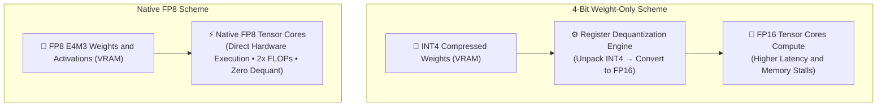

# ADR-006: Native FP8 Precision vs. 4-Bit Weight Quantization (AWQ / GPTQ)

## Status
`ACCEPTED` (Enterprise Standard for Modern Datacenter GPU Clusters)

---

## Context & Problem Statement

Serving large-scale foundation models (70B+ parameters and Mixture-of-Experts architectures like DeepSeek V3/R1 and Llama 3.3 70B) in enterprise production creates severe hardware cost and latency bottlenecks:
* Unquantized 16-bit floating point (FP16 / BF16) requires 140GB+ of VRAM just to store the static model weights of a 70B model, leaving little capacity for the Key-Value (KV) cache and necessitating at least two 80GB GPUs (e.g., 2× NVIDIA H100 or 4× A100).
* Engineering teams must select a production quantization standard to maximize throughput (tokens per second) and minimize hardware costs without degrading model reasoning precision.

The engineering organization is evaluating two primary quantization paths:
1. **4-Bit Weight-Only Quantization (AWQ / GPTQ):** Compresses weights to INT4, allowing large models to fit onto smaller VRAM footprints.
2. **Native 8-Bit Floating Point (FP8 - E4M3 / E5M2):** Directly supported by modern Tensor Cores (NVIDIA Hopper H100/H200, Blackwell B200, AMD Instinct MI300X), enabling native 8-bit matrix multiplications.

---

## Decision Drivers

1. **Hardware Tensor Core GEMM Throughput:** Maximize token generation throughput by running matrix multiplications directly on native low-precision silicon pipelines without dequantization compute stalls.
2. **Reasoning Quality & Perplexity Preservation:** Complex chain-of-thought reasoning, multi-step math, and software engineering katas degrade severely under aggressive sub-4-bit quantization.
3. **KV-Cache Memory Density:** KV-cache footprint dominates VRAM consumption during long-context and multi-turn agent sessions. The selected format must support native KV-cache quantization.
4. **Serving Engine Standardization:** Compatibility with high-throughput inference engines (vLLM, SGLang, TensorRT-LLM) using unified checkpoint formats.

---

## Hardware Execution Flow Comparison



#### Diagram Walkthrough:
1. **4-Bit Weight-Only Bottleneck**: In INT4 quantization, weights are stored in 4 bits but arithmetic executes in FP16. GPU registers must actively dequantize weights during each token generation step, introducing memory bandwidth stalls.
2. **Native FP8 Tensor Core Path**: On modern datacenter architectures, weights and activations flow directly into dedicated FP8 Tensor Core execution pipelines without register unpacking overhead, achieving double the FLOP throughput of FP16.

---

## Considered Alternatives

### Alternative 1: 4-Bit Weight-Only Quantization (AWQ / GPTQ)
* **Description:** Compress model weights to 4-bit integers; preserve activations in FP16.
* **Pros:** Drastically reduces static weight footprint (~35GB for a 70B model); runs on older hardware (NVIDIA Ampere A100/A10G).
* **Cons:** Introduces runtime dequantization overhead in GPU registers; activations remain 16-bit; does not reduce KV-cache memory pressure; measurably degrades complex mathematical and code-generation benchmarks (1.5–4.0% drop on HumanEval / GSM8K).

### Alternative 2: Unquantized FP16 / BF16
* **Description:** Serve models in native 16-bit precision.
* **Pros:** Zero accuracy degradation; gold-standard baseline.
* **Cons:** Prohibitive infrastructure cost; 2× VRAM requirements; saturates GPU memory bandwidth, leading to severe latency degradation under high concurrency.

### Alternative 3: Native FP8 Precision (E4M3 Weights & Activations + E5M2 KV-Cache)
* **Description:** Standardize on native 8-bit floating point formats directly accelerated by Hopper/Blackwell Tensor Cores.
* **Pros:** Doubles hardware compute throughput (TFLOPS) over FP16; zero runtime dequantization penalty; slashes static weight VRAM by 50%; native FP8 KV-cache halves memory consumption per context token; preserves >99.5% of baseline FP16 reasoning accuracy.
* **Cons:** Requires modern GPU hardware with native FP8 support (Hopper H100+, Blackwell B200, or AMD MI300X); less optimal on older Ampere GPUs.

---

## Decision Outcome

* **Chosen Option:** **Alternative 3: Native FP8 Precision (E4M3 / E5M2) as universal enterprise default for datacenter serving**, reserving 4-bit AWQ strictly for memory-constrained edge devices or legacy Ampere hardware.

### Hardware-to-Precision Routing Rule
```text
IF Target Hardware in [H100, H200, B200, MI300X] ⟹ Deploy Native FP8 (E4M3 Weights + FP8 KV Cache)
IF Target Hardware in [A100, A10G, L40S] AND VRAM Constrained ⟹ Deploy 4-bit AWQ via vLLM / SGLang
IF Workload requires High-Stakes Financial / Safety Certification ⟹ Validate FP8 against Golden Eval Set
```

---

## Architectural Trade-Off Scorecard

| Evaluation Criterion | Native FP8 (E4M3/E5M2) | 4-Bit AWQ / GPTQ | Full Precision (BF16) |
| :--- | :---: | :---: | :---: |
| **Tensor Core Throughput (TFLOPS)** | **Maximum (2× BF16)** | Moderate (Bound by FP16) | Baseline (1×) |
| **Dequantization Runtime Penalty** | **Zero (Native Hardware)** | High (Register unpack) | Zero |
| **70B Model VRAM Footprint** | **~72 GB (Fits on 1× H100)** | ~38 GB (Fits on 1× A100 40GB) | ~144 GB (Requires 2× H100) |
| **KV-Cache Quantization Support** | **Native (FP8 E5M2)** | None (Remains FP16) | None (FP16/BF16) |
| **Reasoning Benchmark Retention** | **> 99.5% of BF16** | 96.0% – 98.0% | 100% (Baseline) |
| **Minimum Hardware Generation** | **NVIDIA Hopper / Blackwell** | NVIDIA Ampere / Ada | Any GPU |

---

## Negative Consequences & Mitigations

* **Consequence 1:** FP8 scaling factors can encounter outlier activation clipping during long-context inference, resulting in perplexity spikes.  
  → **Mitigation:** Employ block-wise (128-element tile) dynamic scaling factors rather than per-tensor static quantization.
* **Consequence 2:** Developers testing locally on Apple Silicon or consumer RTX 3090 GPUs cannot run native FP8 Tensor Core operations.  
  → **Mitigation:** Development environments automatically fall back to 4-bit AWQ or GGUF via llama.cpp/Ollama, while staging and production enforce FP8 parity.

---

## References & Seminal Papers

* **Micikevicius et al. (NVIDIA / ARM / Intel):** *FP8 Formats for Deep Learning (2022)*.
* **vLLM & SGLang Engineering:** *High-Throughput Serving with Native FP8 GEMM Kernels (2025)*.
* **DeepSeek AI:** *DeepSeek-V3 Technical Report: Architecture, FP8 Mixed Precision Training & DualPipe Parallelism (2024)*.
