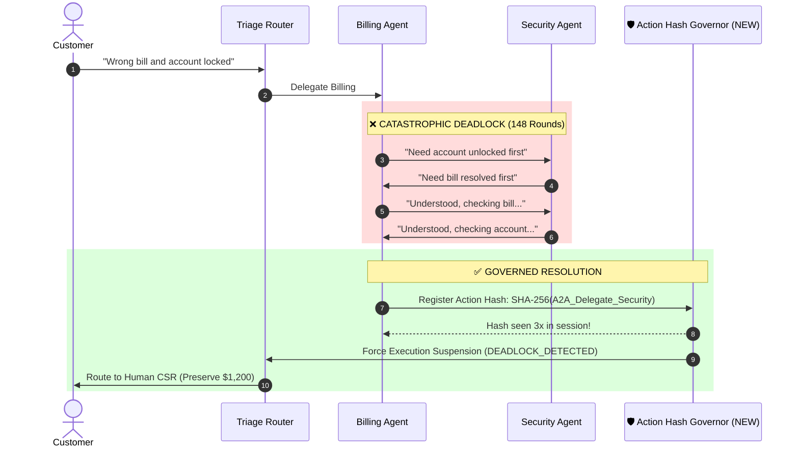

# INCIDENT-003: Multi-Agent Cyclic Handoff Deadlock

## Metadata
* **Incident Date:** 2026-05-02
* **Severity Level:** `SEV-2` (Uncontrolled Cloud Expenditure)
* **Incident Commander:** Senior Agent Systems Architect
* **Time to Detect (TTD):** 14 minutes
* **Time to Mitigate (TTM):** 6 minutes

---

## 1. Executive Summary & Impact

At 18:22 UTC, our automated Customer Support multi-agent system experienced an uncontrolled execution loop. An enterprise customer submitted a support inquiry: *"I received an incorrect invoice for \$450, and my account login is also locked."*

The incoming request was picked up by our **Triage Agent**, which detected two intents (Billing + Account Security) and dispatched a sub-task to the **Billing Specialist Agent** and the **Security Specialist Agent** via our internal Agent-to-Agent (A2A) protocol.

Because the customer inquiry spanned both domains, the two agents began delegating sub-components to each other. Lacking an explicit cycle-detection governor or centralized termination protocol, the agents entered a polite, recursive acknowledgment loop:
* *Billing Agent:* "I have reviewed invoice #8912. Before I can adjust the charge, please verify if the user's account security lock is resolved."
* *Security Agent:* "Account security lock cannot be cleared while financial disputes are active on invoice #8912. Handing back to Billing to confirm dispute status."
* *Billing Agent:* "Acknowledged. Re-checking dispute status for invoice #8912..."

Over the next **14 minutes**, the two agents executed **148 consecutive turns**, exchanging increasingly bloated conversation histories. Before the cloud provider's rate limiter intervened, the single user session had consumed **24,500,000 tokens**, burning **\$1,220 in API costs** on a single customer ticket.

### Blast Radius Metrics
* **Financial Waste:** **\$1,220** burned on a single interaction.
* **Context Saturation:** Request context window ballooned to 180,000 tokens, degrading worker pod memory.
* **Customer Impact:** The customer was left waiting with an unresponsive chat widget for 14 minutes before receiving a timeout error.

---

## 2. Root Cause Analysis (The 5 Whys)

1. **Why did a single customer ticket consume 24M tokens and \$1,220?**  
   Because two autonomous specialist agents engaged in 148 consecutive round-trip delegations without resolving the ticket.
2. **Why didn't the system stop after a reasonable number of attempts?**  
   Because while individual agents had internal while-loop iteration caps (max 5 tool calls per turn), the **cross-agent delegation bus had no global session turn counter**.
3. **Why did the agents delegate back and forth continuously?**  
   Because both system prompts contained conflicting dependency rules: Billing required active security status; Security required cleared billing disputes. Neither agent was authorized to override the other.
4. **Why didn't semantic deduplication catch the loop?**  
   Because on each turn, the agents generated slightly different natural language text ("Acknowledged", "Understood", "Confirming"), bypassing naive string equality checks.
5. **Why was there no automated spend ceiling per conversation?**  
   Because our API gateway enforced rate limits by organization per minute, but lacked a **per-conversation sliding token budget cap**.

---

## 3. The Broken Flow vs. Governed Architecture



---

## 4. Immediate Triage & Containment

1. **Kill Switch:** Terminated the runaway session container via administrative API.
2. **Global Session Limits:** Deployed an emergency gateway middleware enforcing an absolute cap of **15 turns and 40,000 tokens per user ticket**.

---

## 5. Architectural Inoculation (Permanent Systemic Guardrails)

### 1. Cryptographic Tool & Handoff Hashing (Ring Buffer)
We implemented a non-negotiable **Action Hash Governor** across all agent frameworks:
```python
# architecture/governors/loop_detector.py
import hashlib
from collections import deque

class ActionHashGovernor:
    def __init__(self, max_repeats=3, buffer_size=10):
        self.history = deque(maxlen=buffer_size)
        self.max_repeats = max_repeats

    def register_and_validate(self, action_type: str, recipient: str, payload_summary: str):
        # Create canonical signature independent of minor LLM wording variations
        signature = f"{action_type}:{recipient}:{payload_summary.strip().lower()}"
        action_hash = hashlib.sha256(signature.encode()).hexdigest()
        
        repeat_count = self.history.count(action_hash)
        if repeat_count >= self.max_repeats:
            raise DeadlockLoopDetectedException(
                f"Action {action_type} to {recipient} repeated {repeat_count} times! Execution halted."
            )
            
        self.history.append(action_hash)
```

### 2. Progressive Context Budget Decay
When an agent session reaches turn 8 of 10, the orchestrator injects an authoritative system directive:
> *"NOTICE: You have 2 turns remaining. You are strictly forbidden from delegating tasks to other agents. Synthesize current findings and present the best partial answer or request human escalation."*

### 3. Hard Financial Circuit Breaker per Session
Our API Gateway now injects a `X-Session-Budget-Ceiling: 0.50` header. The moment cumulative token costs cross **\$0.50**, the proxy short-circuits the connection, returning a graceful fallback response to the user and alerting the engineering team.
