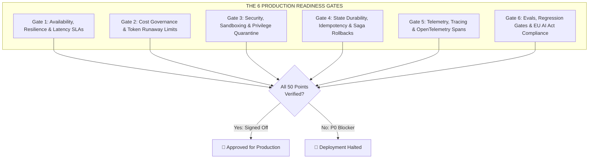

# 🛡️ The AI Systems Production Readiness Review (PRR)
### The 50-Point Enterprise Go-Live Audit Gate & Risk Assessment Framework

> **An authoritative, non-negotiable operational gate required before deploying non-deterministic GenAI, LLM pipelines, or autonomous agent systems to production.**  
> [Home / Master Curriculum](../README.md) • [Enterprise AI System Designs](./enterprise-ai-system-designs.md) • [Architecture Decision Records (ADRs)](./adrs/README.md) • [Production Post-Mortems](./post-mortems/README.md) • [Emerging AI Roadmap](../ai-technology-roadmap-2025-2026.md)

---

## 🎯 Executive Summary & Philosophy

In traditional software, a system passes production readiness if unit tests pass, load testing satisfies latency targets, and infrastructure metrics are green. 

In **AI-Native Systems (Software 3.0)**, traditional testing is insufficient. Because Large Language Models and multi-agent workflows are **probabilistic, non-deterministic reasoning engines**, systems rarely fail with loud, reproducible stack traces. Instead, they fail **silently and catastrophically**:
* A subtle change in user phrasing triggers an infinite tool loop that burns \$2,000 in API tokens in minutes.
* A cache stampede overwhelms connection pools when KV-cache prefix hits drop to 0%.
* An indirect prompt injection buried in an uploaded PDF tricks an agent into exfiltrating database credentials.
* Model drift causes customer-facing agents to hallucinate pricing commitments that bind the company legally.



This PRR establishes **50 concrete, verifiable criteria across 6 core operational gates**. A system must achieve **100% compliance on P0 Blockers** and **≥ 90% compliance on P1 Criteria** before receiving sign-off from the Tech Lead, Security Architect, and SRE Lead.

---

## 📋 The 50-Point Production Readiness Checklist

### Gate 1: Availability, Resilience & Latency SLAs

| # | Priority | Audit Check Item | Verification Standard |
| :---: | :---: | :--- | :--- |
| **1.1** | **P0** | **Deterministic Fallback Routing** | If upstream LLM latency exceeds SLA (e.g., >3,500ms) or returns `5xx/429`, the system fails over to a secondary provider (e.g., Azure OpenAI → Anthropic → local SLM) or serves a deterministic cached response. |
| **1.2** | **P0** | **Adaptive Outlier Circuit Breakers** | Envoy/Reverse Proxy circuit breaker trips when provider error rate exceeds 5% over a 30-second sliding window, isolating downstream workers from cascading thread exhaustion. |
| **1.3** | **P0** | **Cold-Cache Stampede Protection** | Embedding and prompt lookup caches implement **mutualized single-flight locking** (`singleflight` pattern) and **probabilistic early expiration (XFetch)** so expiring keys never trigger thousands of redundant LLM generation calls. |
| **1.4** | **P1** | **Prefill vs. Decode Latency Budgeting** | Time to First Token (TTFT) and Tokens Per Second (TPS) are tracked as independent metrics. P99 TTFT must remain under 800ms for conversational UI interfaces. |
| **1.5** | **P1** | **KV-Cache Prefix Preservation** | System prompts, static instructions, and tool definitions are placed at the **absolute beginning of the context window** and never modified dynamically per turn, guaranteeing ≥70% KV-cache hit rates under RadixAttention / vLLM. |
| **1.6** | **P1** | **Graceful Semantic Degradation** | When upstream token rate limits are approached, non-essential agent capabilities (e.g., speculative web search, reflection passes) are shed automatically, preserving core transaction throughput. |
| **1.7** | **P2** | **Batch API Offloading** | Asynchronous, non-real-time workloads (nightly document indexing, batch classification, dataset curation) are routed to 24-hour Batch APIs for a guaranteed 50% discount and dedicated throughput queues. |
| **1.8** | **P2** | **Multi-Region Failover Drills** | Chaos engineering simulations (e.g., simulating complete outage of `us-east-1` Azure OpenAI capacity) have been executed with automated DNS failover verified under live synthetic load. |

---

### Gate 2: Cost Governance & Token Runaway Limits

| # | Priority | Audit Check Item | Verification Standard |
| :---: | :---: | :--- | :--- |
| **2.1** | **P0** | **Hard Session Token Budget Caps** | Every user conversation and agent invocation has a hard ceiling (e.g., max 40,000 tokens or $0.50 per interaction). When exceeded, the agent terminates gracefully with a user-facing explanation rather than looping. |
| **2.2** | **P0** | **Cryptographic Loop & Deadlock Detection** | The orchestration engine hashes every tool call payload `SHA-256(tool_name + canonical_json_args)` into a bounded ring buffer (depth 10). If the same hash appears ≥ 3 times, execution terminates immediately. |
| **2.3** | **P0** | **Progressive Budget Decay** | As an agent session approaches its iteration limit (e.g., turn 8 of 10), reasoning budgets are systematically compressed, and the agent is instructed to emit final synthesis rather than initiating new tool searches. |
| **2.4** | **P1** | **Tenant-Level Distributed Rate Limiting** | Redis token-bucket governors enforce strict per-minute and per-day spend limits per customer organization, preventing a compromised API key from causing billing spikes. |
| **2.5** | **P1** | **Tool Schema Pruning (Context Compaction)** | Tools not relevant to the current user intent are dynamically masked out of the prompt schema, keeping tool definition overhead below 2,000 tokens per call. |
| **2.6** | **P1** | **Real-Time Cost Anomaly Alerts** | Cloud cost telemetry (Datadog / Prometheus) triggers PagerDuty alerts if hourly spend exceeds 150% of the 7-day rolling median for two consecutive hours. |
| **2.7** | **P2** | **Thinking Token Expenditure Caps** | On reasoning models (o1/o3, DeepSeek-R1), maximum thinking/reasoning token ceilings are enforced explicitly in API request parameters. |
| **2.8** | **P2** | **Unit Economics Dashboard** | Gross margin per AI operation is calculated and published in a live business dashboard: `Unit Margin = Revenue per Task - (LLM Token Cost + Vector DB Cost + MicroVM Cost)` |

---

### Gate 3: Security, Sandboxing & Privilege Quarantine

| # | Priority | Audit Check Item | Verification Standard |
| :---: | :---: | :--- | :--- |
| **3.1** | **P0** | **MicroVM / Container Tool Sandboxing** | All agent-generated code execution (Python, Bash, SQL, JavaScript) executes in ephemeral, hardware-isolated microVMs (Firecracker / E2B / gVisor) with sub-second spin-up, NOT on the host application container. |
| **3.2** | **P0** | **Deny-by-Default Network Egress** | Execution sandboxes block all external outbound network traffic by default. Specific external APIs must be explicitly allowlisted by domain name via firewall egress rules. |
| **3.3** | **P0** | **Dual-LLM Privilege Quarantine** | Untrusted external text (scraped web pages, user uploads, incoming emails) is processed exclusively by an unprivileged **Quarantine LLM**. Only validated, typed JSON DTOs cross into the privileged **Executive LLM**. |
| **3.4** | **P0** | **Indirect Prompt Injection Inoculation** | Prompt templates wrap all external input inside explicit XML boundary delimiters (e.g., `<user_data>`, `<untrusted_content>`) accompanied by negative behavioral assertions. |
| **3.5** | **P0** | **PII & Secret Scrubbing Vault** | Raw prompts pass through a deterministic tokenization filter (regex + Presidio / AWS Comprehend) that masks credit card numbers, SSNs, API keys, and email addresses *before* payload transmission to upstream model providers. |
| **3.6** | **P1** | **Cryptographic Canary Tokens** | High-entropy canary secrets (`CANARY_UUID_XYZ`) are injected into system prompts. Output guardrails inspect every generated response; if the canary string is detected, the response is blocked and a security incident is logged. |
| **3.7** | **P1** | **Ephemeral Credential Injection** | Agents never receive long-lived cloud credentials or database passwords in their context window. Tools access credentials via short-lived, scoped STS tokens or backend proxy wrappers. |
| **3.8** | **P1** | **Runtime Output Guardrails** | Model completions pass through real-time classification filters (e.g., Llama Guard 3, NeMo Guardrails) to detect PII leakage, toxicity, sexual violence, and prompt extraction. |
| **3.9** | **P2** | **Dependency Lock & Supply Chain Scanning** | All dynamic agent libraries, MCP servers, and Python runtime packages are pinned with cryptographic SHA-256 hashes in `requirements.txt` / `packages.lock.json` and scanned for CVEs via Trivy/Snyk. |

---

### Gate 4: State Durability, Idempotency & Saga Rollbacks

| # | Priority | Audit Check Item | Verification Standard |
| :---: | :---: | :--- | :--- |
| **4.1** | **P0** | **Pre-Mutation State Checkpointing** | Before executing any state-mutating external action (database write, Stripe refund, email dispatch), the complete agent state graph is serialized to durable storage (PostgreSQL / Redis / S3). |
| **4.2** | **P0** | **Idempotent Tool Execution** | Every external tool invocation includes an **Idempotency Key** generated as `UUIDv5(session_id, action_step_number)`. Upstream APIs verify that replaying the same step does not duplicate transactions. |
| **4.3** | **P0** | **Human-in-the-Loop (HITL) Gate for High-Risk Actions** | High-consequence mutations (financial transfers > $500, user deletion, code deployment to production) trigger an execution suspension (`AWAITING_APPROVAL`). Execution resumes only upon receiving a cryptographically signed HMAC token from a verified human reviewer. |
| **4.4** | **P1** | **Distributed Saga Compensating Actions** | Multi-step agent workflows define compensating rollback tools for every forward action (e.g., `reserve_inventory` ⟷ `release_inventory`; `charge_card` ⟷ `refund_card`). If Step 3 fails, Steps 1 and 2 roll back automatically. |
| **4.5** | **P1** | **Time-Travel Replay & State Forking** | In-flight execution graphs support time-travel debugging: SREs can inspect the historical state snapshot at Step N - 2, modify the conversation context, and fork execution along a new branch. |
| **4.6** | **P1** | **Zombie Execution Reaper** | Background worker daemons automatically reap agent sessions that have been orphaned or unresponsive for >15 minutes, transitioning state to `TIMEOUT_FAILED` and notifying the user. |
| **4.7** | **P2** | **Schema Evolution Compatibility** | Agent state schemas (Pydantic / Protobuf) maintain backward compatibility so that deploying a new model prompt version does not corrupt or invalidate in-flight session checkpoints. |

---

### Gate 5: Telemetry, Tracing & OpenTelemetry Spans

| # | Priority | Audit Check Item | Verification Standard |
| :---: | :---: | :--- | :--- |
| **5.1** | **P0** | **OpenTelemetry GenAI Semantic Conventions** | All model interactions export standard OpenTelemetry spans: `gen_ai.system`, `gen_ai.request.model`, `gen_ai.response.finish_reasons`, `gen_ai.usage.input_tokens`, and `gen_ai.usage.output_tokens`. |
| **5.2** | **P0** | **Tool Execution Trace Instrumentation** | Every tool invocation is nested as a child span within the parent LLM turn, recording: tool name, execution latency, return code, error messages, and payload size. |
| **5.3** | **P0** | **Correlation IDs Across Agent Swarms** | In multi-agent systems (A2A protocol), a unified `traceparent` W3C header is propagated across all inter-agent messages, enabling distributed trace visualization of the complete delegation graph. |
| **5.4** | **P1** | **Continuous Latency Percentile Dashboards** | Production dashboards track P50, P90, P95, and P99 latency broken down by: (1) Prompt Network Transmission, (2) TTFT, (3) Decoding duration, and (4) External tool execution latency. |
| **5.5** | **P1** | **Structured Sanitized Logging** | Production logs record full request/response metadata but redact sensitive user PII and confidential enterprise context using SHA-256 tokenization. |
| **5.6** | **P2** | **Feedback Loop Instrumentation** | User satisfaction signals (thumbs-up/down, copy-to-clipboard, retry click, manual edit distance) are logged as continuous quality tags attached to the root trace ID. |
| **5.7** | **P2** | **Cache Hit/Miss Metrics** | Prometheus metrics track cache performance: `llm_cache_hits_total{type="exact_sha256"}`, `llm_cache_hits_total{type="radix_prefix"}`, and `llm_cache_misses_total`. |

---

### Gate 6: Evals, Regression Gates & EU AI Act Compliance

| # | Priority | Audit Check Item | Verification Standard |
| :---: | :---: | :--- | :--- |
| **6.1** | **P0** | **CI/CD Frozen Golden Evaluation Gate** | Pull Requests cannot merge to `main` without passing an automated evaluation run against a frozen **Golden Dataset (≥300 curated enterprise queries)**, maintaining ≥95% accuracy and 0% regression on critical invariants. |
| **6.2** | **P0** | **Discrete Binary Judge Rubrics** | Automated LLM-as-a-judge evaluators use deterministic, binary pass/fail assertions (e.g., "Contains correct SQL syntax?", "Contains citation link?") rather than uncalibrated 1–5 likert scales. |
| **6.3** | **P0** | **RAG Faithfulness & Grounding Verification** | For retrieval-augmented systems, all emitted factual claims must pass a **Citation Entailment Check** (using NLI models or LLM judges) confirming that every assertion is strictly supported by retrieved context. |
| **6.4** | **P0** | **EU AI Act GPAI Transparency Compliance** | Systems categorized as high-risk under the EU AI Act provide verifiable technical documentation: model architecture identity, system limits, human oversight mechanisms, and an auditable decision log. |
| **6.5** | **P1** | **Adversarial Red-Team Regression Suite** | The CI/CD pipeline runs automated red-teaming fuzzers (e.g., Inspect AI, Garak, PyRIT) executing ≥100 prompt injection and jailbreak permutations with a 0% exploit pass rate. |
| **6.6** | **P1** | **Pairwise Judge Bias Mitigation** | LLM-as-a-judge scorecards randomize answer position (Position Bias), normalize token length (Verbosity Bias), and use multi-model ensembles (combining Claude 3.5, GPT-4o, and Gemini 1.5 Pro) to eliminate self-enhancement bias. |
| **6.7** | **P1** | **GDPR Article 17 "Right to be Forgotten" Crypto-Shredding** | User memory stores and vector embeddings are encrypted with dedicated per-tenant or per-user encryption keys. When a user requests data deletion, their encryption key is destroyed ("crypto-shredded"), rendering all historical embeddings unrecoverable. |
| **6.8** | **P2** | **Shadow / Canary Deployment Period** | New prompt templates or model versions run in shadow mode alongside live production traffic for 14 days, verifying statistical parity in conversion and hallucination rates before 100% cutover. |

---

## 🚦 PRR Decision Rubric & Sign-Off Scorecard

```
┌─────────────────────────────────────────────────────────────────────────────┐
│                     PRODUCTION READINESS SIGN-OFF STATUS                    │
├─────────────────────────────────────────────────────────────────────────────┤
│ 🟢 APPROVED FOR GENERAL AVAILABILITY (GA):                                  │
│    • 100% of P0 Blockers PASSED (24/24)                                    │
│    • ≥ 90% of P1 Criteria PASSED (18/20)                                    │
│    • Zero unresolved High/Critical Security CVEs                            │
│                                                                             │
│ 🟡 CONDITIONAL / LIMITED PILOT (Beta with Human Supervision):               │
│    • 100% of P0 Blockers PASSED                                             │
│    • 75%–89% of P1 Criteria PASSED                                          │
│    • Maximum 50 concurrent users; 100% human sign-off on tool mutations     │
│                                                                             │
│ 🔴 DEPLOYMENT BLOCKED:                                                      │
│    • Any single P0 Blocker FAILS                                            │
│    • Automatic CI/CD deployment lock engaged                                │
└─────────────────────────────────────────────────────────────────────────────┘
```

### Sign-Off Authorization Record

* **System Name:** __________________________________________________
* **Model Versions Tested:** ________________________________________
* **Date of Audit:** ________________________
* **Target Production Environment:** `[ ] US-East  [ ] EU-Central  [ ] Global Multi-Region`

| Role | Signee Name | Decision (`PASS` / `REJECT`) | Signature & Date |
| :--- | :--- | :---: | :--- |
| **Lead AI Architect** | | | |
| **Security & Privacy Lead** | | | |
| **Site Reliability Engineer (SRE Lead)** | | | |
| **VP / Director of Engineering** | | | |

---

## 🛠️ How to Automate this PRR in CI/CD

To prevent manual checklist fatigue, integrate this PRR into your GitHub Actions workflow:

```yaml
# .github/workflows/ai-production-readiness-gate.yml
name: AI Production Readiness Review Gate

on:
  pull_request:
    branches: [main]
  workflow_dispatch:

jobs:
  prr-verification:
    runs-on: ubuntu-latest
    steps:
      - uses: actions/checkout@v4

      - name: Set up Python
        uses: actions/setup-python@v5
        with:
          python-version: '3.12'

      - name: 1. Verify Prompt Injection Delimiters & Canary Tokens
        run: |
          python -m pytest tests/security/test_prompt_injection_boundaries.py
          python -m pytest tests/security/test_canary_leakage.py

      - name: 2. Run Frozen Golden Evals Gate (≥95% Accuracy)
        env:
          EVAL_API_KEY: ${{ secrets.EVAL_MODEL_KEY }}
        run: |
          python -m pytest tests/evals/test_golden_regression_suite.py --min-accuracy=0.95

      - name: 3. Verify Circuit Breakers & Timeout Handlers
        run: |
          python -m pytest tests/resilience/test_latency_circuit_breaker.py

      - name: 4. Verify Cryptographic Loop Hash Governors
        run: |
          python -m pytest tests/governance/test_infinite_loop_prevention.py

      - name: 5. Verify PII Vault Tokenization
        run: |
          python -m pytest tests/security/test_pii_scrubbing_vault.py

      - name: Publish PRR Scorecard Artifact
        if: always()
        uses: actions/upload-artifact@v4
        with:
          name: prr-audit-scorecard
          path: reports/prr-audit-scorecard.json
```
