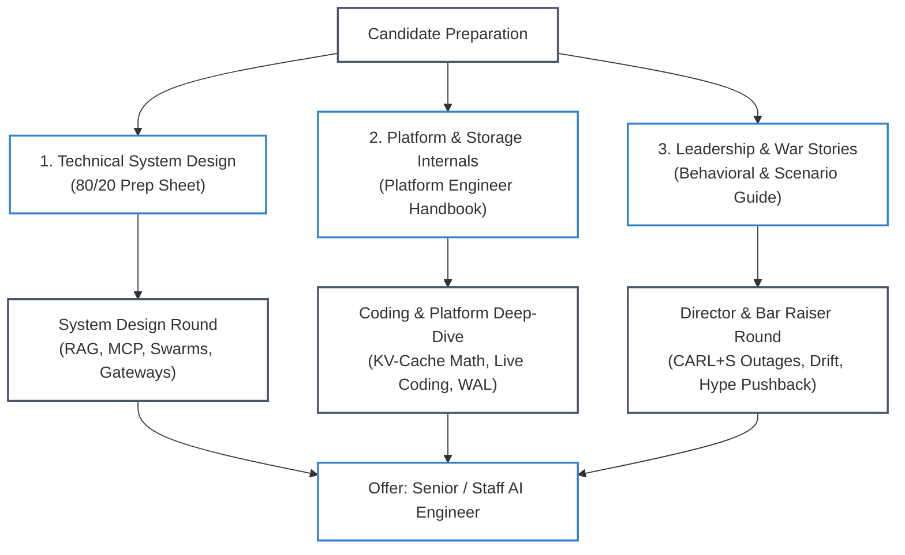

# 🎙️ Senior & Staff AI Engineer Interview Mastery Hub

> **The Definitive Interview Preparation Core**: Built for Senior Developers, Tech Leads, and Systems Architects interviewing for Senior AI Engineer, Staff AI Platform Architect, and Lead AI Systems roles at tier-1 technology organizations.

---

## 🧭 Interview Mastery Track Architecture

#### Walkthrough:
1. **System Design Track**: Master high-level enterprise blueprints, including hybrid retrieval, multi-provider gateways, and Model Context Protocol (MCP) agents.
2. **Platform & Storage Internals**: Drill hardware capacity math, vector index tombstoning, and 45-minute live coding challenges with the companion reference platform.
3. **Leadership & Incident War Stories**: Structure answers using the CARL+S framework to demonstrate crisis composure, hype pushback, and blameless triage.

---

## 📚 Master Study Guides

| Guide | Focus Area | Key Architectural Deliverables | Target Interview Stage |
| :--- | :--- | :--- | :--- |
| [**80/20 System Design Prep Sheet**](80-20-ai-interview-prep-sheet.md) | Technical System Design & Architectural Blueprints | 5 Production Blueprints (Hybrid RAG, AI Gateway, MCP Coding Agent, Customer Ops Swarm, A2A Mesh), Top 30 Technical Q&As, Pareto Trade-Offs | Technical System Design (60 min) |
| [**AI Platform Engineer Handbook**](ai-platform-engineer-handbook.md) | Storage Internals, Hardware Math & Live Coding | KV-Cache VRAM Equations, 1B Vector Sharding, 4 Live Coding Drills (Token Bucket, WAL Replay, RRF Ranker, Idempotency Proxy), SRE War Stories | Platform Core & Live Coding (45–60 min) |
| [**High-Stakes Behavioral & Scenario Guide**](high-stakes-behavioral-and-scenario-guide.md) | Crisis Leadership, Hype Pushback & Production Outages | 6 Hardest Story Archetypes, CARL+S Framework (Context, Action, Result, Learning, Systemic Change), Red Flags vs Senior Signals | Bar Raiser & Engineering Leadership (45 min) |

---

## ⚡ 2026 Core Interview Competencies

In 2026, tier-1 tech interviews evaluate candidates against concrete systems engineering truths rather than generic prompt engineering:

* **Model Context Protocol (MCP AAIF vs A2A)**: Explain why Anthropic's donation of MCP to the Agentic AI Foundation (Linux Foundation) standardizes client-to-tool integration, while Google Agent2Agent (A2A) addresses horizontal peer-agent discovery and routing.
* **Speculative Decoding & High-Throughput Serving**: Articulate how EAGLE-3 and Medusa draft-verify speculative decoding decouple token generation latency from memory bandwidth bottlenecks without degrading model accuracy.
* **Contextual Retrieval & RRF Fusion**: Defend combining BM25 keyword search with dense HNSW embeddings via Reciprocal Rank Fusion ($k=60$), incorporating chunk-level contextual prepending to solve the pronoun detachment trap.
* **Agentic Coding Architecture**: Distinguish between Skills (`SKILL.md` progressive disclosure), Hooks (pre/post-tool call deterministic lifecycle interceptors), Plugins (capability packages), and Environment Setup (sandboxed virtual environments via `uv`/`venv`), benchmarked against SWE-bench Verified.
* **OpenTelemetry GenAI Observability**: Instrument multi-turn agent execution with standardized `gen_ai.*` semantic conventions, attributing prompt tokens, completion tokens, and dollar costs across distributed span trees.
* **Durable Execution & Tool Idempotency**: Replace naive in-memory `while` loops with Write-Ahead Logging (WAL) and cryptographically deterministic idempotency keys (`idempotency_key`) to eliminate double-spend and ghost execution during network timeouts.

---

## 🔗 Cross-Curriculum Alignment

* **Practice Labs**: Verify implementations against [Hands-On Practice Labs](../labs/README.md).
* **Reference Implementation**: Inspect working source code in the [AgentForge Platform Core](../agent-forge/README.md).
* **Architectural Decisions**: Review enterprise tradeoffs in [Architecture Decision Records (ADRs)](../architecture/adrs/README.md).
