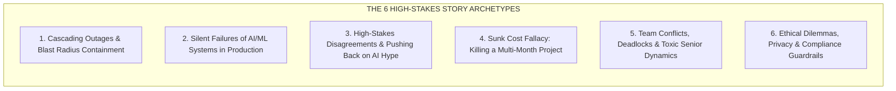

# 🎯 Master Guide: High-Stakes Behavioral & Scenario Interviews
### Crisis Leadership, Systemic Ownership & Non-Deterministic Production War Stories for Senior, Staff & AI Engineers

> **The definitive companion guide to technical system design interviews, covering how to answer the most difficult behavioral, scenario, and post-mortem questions asked by tier-1 tech companies.**  
> [Home / Master Curriculum](../README.md) • [System Design Interview Prep Sheet](./80-20-ai-interview-prep-sheet.md) • [Emerging AI Roadmap (2025–2026)](../ai-technology-roadmap-2025-2026.md) • [Senior Transition Guide](../senior-transition-guide.md)

---

## 1. The Staff & AI Paradigm Shift: Why Traditional Prep Fails

At the Senior (L5), Staff (L6/L7), and Staff AI Engineer levels, behavioral interviews are **work-signal simulations**, not generic personality checks. Interviewers at top-tier organizations (OpenAI, Anthropic, Google, Meta, Stripe, Databricks) are not testing whether you can recite textbook concepts or follow instructions. They are probing your **technical judgment under ambiguity, systemic thinking, influence without authority, and crisis leadership.**

### The Level Expectations
* **Senior Engineer (L5):** Evaluated on *independent execution*, technical depth, resolving local complexity, and unblocking oneself and immediate team members.
* **Staff Engineer (L6+):** Evaluated on *force multiplication*, setting architectural direction, mitigating organizational risk, managing cross-team trade-offs, and building durable architectures and processes that outlive their tenure.
* **AI/ML Engineer (Senior/Staff):** Faces the unique challenge of **probabilistic, non-deterministic systems**. Unlike traditional software where bugs are reproducible and fail loudly, AI systems degrade silently, hallucinate convincingly, leak data subtly, and drift continuously. Staff AI engineers are evaluated on how they establish evaluation rigor (evals), defend against hype, manage cost/latency Pareto frontiers, and implement defensive guardrails.

---

## 2. The 6 Hardest Story Archetypes Interviewers Probe



### Archetype 1: Major Production Incidents & Blast Radius Containment
* **What interviewers probe:** Crisis composure, triage under chaos, balancing immediate containment vs. permanent fixes, blast-radius isolation, blameless post-mortem culture, and systemic remediation.
* **Typical Prompts:**
  * *"Tell me about the worst production outage you caused or led the resolution for."*
  * *"Describe a time when a critical service failed and cascading degradation occurred. How did you contain the blast radius?"*
* **The High-Stakes Core:** In an incident, candidates often make the mistake of playing the "Lone Wolf Hero" who typed a magic bash command. Top interviewers look for **incident commander (IC) leadership**: establishing clear communication channels, rolling back rather than debugging in production, implementing circuit breakers, and converting the incident into systemic architectural defenses (e.g., rate-limiting tiers, automated canary rollouts, chaos engineering).

### Archetype 2: Silent Failures of AI/ML Systems in Production
* **What interviewers probe:** Handling non-deterministic system degradation, debugging probabilistic components, offline vs. online evaluation parity, data leakage, drift detection, and safety/guardrail breaches.
* **Typical Prompts:**
  * *"Tell me about a time an AI/ML model or LLM pipeline failed silently in production. How did you discover it, and how did you diagnose the root cause?"*
  * *"Describe a scenario where offline evaluation metrics looked stellar, but real-world production performance tanked."*
* **The High-Stakes Core:** ML/AI failures are rarely clean `500 Internal Server Errors`. They appear as **data leakage** (a future timestamp leaked into features, giving artificial 0.99 ROC-AUC offline), **concept/covariate drift** (user distribution shifted post-marketing campaign), **feedback loop cannibalization** (recommendation model maximizing short-term clicks while destroying catalog diversity and 90-day retention), or **RAG hallucination & prompt injection** (LLM generating fake APIs or leaking tenant data). The interviewer wants to see disciplined, hypothesis-driven debugging rather than haphazard retraining.

### Archetype 3: High-Stakes Architectural Disagreements & Technical Disputes
* **What interviewers probe:** Influence without authority, intellectual humility, ability to "steelman" the opposing argument, depersonalizing decisions, creating objective evaluation rubrics, and the "disagree and commit" muscle.
* **Typical Prompts:**
  * *"Tell me about a time you strongly disagreed with a Principal Architect, Director, or VP on a major technical decision. How did you handle it?"*
  * *"Describe a technical dispute that split the engineering team. How did you achieve alignment?"*
* **The High-Stakes Core:** Common flashpoints include:
  * *Build vs. Buy / Fine-Tuning vs. Commercial LLM API / Dedicated Vector DB vs. Postgres pgvector.*
  * *Microservices decomposition vs. Modular Monolith.*
  * *Synchronous gRPC vs. Asynchronous Event-Driven Pub/Sub.*
  Candidates who say "Eventually they saw I was right" receive an immediate red flag. Strong candidates demonstrate how they validated the other party's constraints (cost, team skillset, time-to-market), designed an empirical bake-off/pilot with agreed-upon success metrics, and reached consensus without creating lingering resentment.

### Archetype 4: Tough Trade-Offs (Velocity vs. Technical Debt, Precision vs. Latency/Cost)
* **What interviewers probe:** Business empathy, financial literacy, distinguishing between intentional vs. reckless technical debt, and navigating multi-objective optimization (Pareto frontiers).
* **Typical Prompts:**
  * *"Tell me about a time you intentionally cut corners or accrued technical debt to hit a business deadline."*
  * *"How did you balance model accuracy/precision against latency and inference cost in a customer-facing product?"*
* **The High-Stakes Core:** Engineers who refuse to incur debt are dogmatic and disconnected from business survival; engineers who incur debt haphazardly lack craft. The sweet spot is **intentional, quantified debt**: taking debt with an explicit repayment timeline, isolated interfaces, and documented risks. In AI, this means knowing when an 8B quantized model with 89% accuracy at 120ms ($0.0002/query) beats a 70B model with 94% accuracy at 1.8s ($0.01/query) for a real-time UI.

### Archetype 5: Managing a Failing Project, Missed Deadline, or Forced Pivot
* **What interviewers probe:** Sunk cost fallacy resistance, establishing "kill criteria" before starting, early warning escalation, protecting team morale, and salvaging reusable components.
* **Typical Prompts:**
  * *"Tell me about a project that was failing or off-track. Did you pivot, kill it, or push through, and why?"*
  * *"Describe a time you had to deliver the hard truth to leadership that a major initiative would not ship on time."*
* **The High-Stakes Core:** The mark of a Staff+ engineer is having the courage to kill their own project when the data invalidates the core hypothesis, rather than hiding behind vanity metrics to avoid embarrassment. Interviewers evaluate how you managed the narrative, shielded junior team members from psychological fallout, and repurposed architectural assets.

### Archetype 6: Handling Conflict, Underperforming Teammates, or Ethical Dilemmas
* **What interviewers probe:** Radical candor, empathy, psychological safety, navigating organizational politics, moral courage, and AI safety/compliance stewardship.
* **Typical Prompts:**
  * *"Tell me about a time you had to deal with a brilliant but abrasive/toxic senior colleague."*
  * *"Describe an ethical gray area you encountered in your work (e.g., training data copyright, model bias, dark patterns, bypassing safety filters for revenue)."*
* **The High-Stakes Core:** In peer conflicts, interviewers want to see issues addressed directly and constructively at the lowest possible organizational level before escalating to HR/management. In ethical dilemmas (especially rampant in AI), they look for engineers who stand their ground against reckless shortcuts, ground their pushback in business risk (regulatory fines, brand destruction, security breaches), and propose viable ethical alternatives.

---

## 3. Under-the-Hood Interviewer Rubrics: Signals vs. Red Flags

| Evaluative Dimension | Strong Hire Signals (L6+ / Staff / AI Lead) | Red Flags (No Hire / Downlevel) |
| :--- | :--- | :--- |
| **Technical Judgment & Pragmatism** | Evaluates 2–3 alternatives; articulates the cost of the path *not* taken; distinguishes 1-way from 2-way door decisions; chooses boring, dependable technology when appropriate. | Dogmatic ("X technology is always bad"); technology-chasing (using multi-agent LLM systems where a SQL query or regex suffices); zero cost/latency awareness. |
| **Ownership & Accountability** | Uses "I" for decisions, hypotheses, and errors; shares credit with "we" for execution; admits personal miscalculations without prompting; focuses on systemic remedies. | "The PM changed requirements," "The DevOps team dropped the ball," "The vendor API was buggy"; hides behind team "we"; deflects blame to juniors or other departments. |
| **Cross-Functional Influence** | Steelmans opposing viewpoints; uses data and empirical bake-offs to resolve debates; aligns technical goals with company revenue/retention metrics; achieves buy-in without authority. | "I proved them wrong"; uses authority/title to bulldoze consensus; creates adversarial relationships with Product, Sales, or Research teams; passive-aggressive compliance. |
| **Systemic Thinking & Post-Mortem Depth** | Implements guardrails, CI/CD gates, evals, and architectural patterns so a whole *class* of failure is permanently eliminated; mentors team through post-mortems. | Treats outages/bugs as isolated one-offs; "I fixed the typo in prod and we moved on"; lacks architectural curiosity regarding why the system permitted the mistake. |
| **AI/ML Production Maturity** | Implements continuous golden evaluation sets, shadow deployments, feature-store consistency checks, automated drift monitors, latency/cost budgets, and fallback heuristics. | Relies solely on offline test set metrics; assumes LLM outputs are deterministic; treats prompt engineering as the only optimization lever; no synthetic/human eval pipelines. |

---

## 4. The Anatomy of an Exceptional Answer: The CARL+S Framework

The standard school-taught STAR (Situation, Task, Action, Result) format frequently results in formulaic, junior-sounding answers. High-bar interviewers at Anthropic, OpenAI, and Meta explicitly warn against canned STAR answers because candidates spend 60% of their time reciting boring background context.

The industry-standard framework for Staff and AI roles is **CARL+S (Context & Constraints, Action & Influence, Result, Learning, Systemic Change)**.

```
       ┌────────────────────────────────────────────────────────┐
       │               TOTAL DURATION: 2.5 - 3.5 MIN            │
       └────────────────────────────────────────────────────────┘
          │                   │                 │            │
          ▼                   ▼                 ▼            ▼
     [CONTEXT]            [ACTION]          [RESULT]     [LEARNING &
   & CONSTRAINTS         & INFLUENCE     (Multi-Metric)    SYSTEMIC]
      (~30s)               (~90s)            (~30s)         (~45s)
  • Stakes/Scale        • What "I" did   • Business KPI  • What I got wrong
  • Time/Resource       • Trade-offs     • Tech health   • Policy/guardrails
  • Core Dilemma        • Alignment      • Team impact   • Never happen again
```

### The 5 Phases of CARL+S:
1. **Context & Constraints (~30 seconds):** Set the stage with high stakes, scale, and specific friction points. *Never give generic setup.* Include the constraint (e.g., "$15k daily burn rate," "150ms P99 latency SLA," "Zero customer downtime allowed").
2. **Action & Architectural Influence (~90 seconds):** Focus on **your** agency. 
   - State the hypothesis you formed.
   - Outline the trade-offs you evaluated (Alternative A vs. Alternative B).
   - Detail how you brought peers or leadership along (the pilot, the data matrix).
   - Describe the tactical interventions you led.
3. **Result - Multi-Dimensional (~30 seconds):** Provide a triad of outcomes:
   - **Business Metric:** Revenue saved, conversion lifted, churn avoided.
   - **Engineering Metric:** P99 latency dropped by X ms, MTTR reduced from 4h to 12m, cloud compute costs decreased by $Yk/month.
   - **Organizational Metric:** Developer velocity unlocked, on-call paging frequency reduced.
4. **Learning & Vulnerability (~20 seconds):** What did you initially get wrong? What surprised you? What would you do differently today with updated mental models?
5. **Systemic Prevention / Institutional Change (~25 seconds):** What durable guardrail, architectural constraint, automated evaluation test, or cultural practice did you institute so that neither you nor anyone else at the company can ever repeat that failure?

---

## 5. Concrete Illustrative Story Blueprints

Below are 4 fully fleshed-out, production-grade story narratives covering the most difficult prompts.

---

### Story 1: The Catastrophic Production Outage (Cascading Cache Invalidation & Connection Pool Exhaustion)
* **Prompt:** *"Tell me about a catastrophic production incident you dealt with. How did you contain the blast radius and prevent recurrence?"*

#### Story Script (CARL+S Breakdown):
* **[Context & Constraints]:**
  > "During Black Friday peak traffic at my previous e-commerce platform, our tier-1 Product Catalog service suffered a cascading failure. We were processing 45,000 requests/second when our primary Redis cluster experienced an unexpected node eviction. Within 90 seconds, all 120 downstream catalog microservice pods were overwhelmed by a cache stampede (dog-piling effect). Every incoming request bypassed the cache and hit our primary Aurora PostgreSQL cluster directly, saturating its max connection pool of 5,000 connections. Read latency spiked from 18ms to 14,000ms, and 504 Gateway Timeouts began cascading into checkout and payments, threatening an estimated $120,000/minute in lost GMV."
* **[Action & Influence]:**
  > "I immediately assumed the Incident Commander role. My first priority was **blast radius containment over root-cause debugging**. 
  > First, to protect our checkout and payment pipelines, I instructed the edge routing team to flip our Cloudflare Workers into an emergency degraded mode: we began serving stale product snapshots directly from edge storage for all read-only catalog browsing, cutting traffic to the origin database by 88%.
  > Second, when the catalog pods continued crashing due to restart-thundering herds against PostgreSQL, I halted the automated pod crash-restart loop and implemented a **probabilistic early expiration (XFetch algorithm)** and an in-memory single-flight request coalescing pattern (`singleflight` in Go) before bringing pods back up in controlled 10% batches.
  > Third, I kept engineering leadership and product updated on a single public incident channel with 15-minute cadence updates, freeing the response team from handling executive panic."
* **[Result]:**
  > "We brought total error rates back below 0.05% within 38 minutes. Checkout and payments remained functional throughout the degraded edge state, saving an estimated $2.8M in at-risk revenue during the window. Aurora CPU utilization stabilized from 100% back down to 42%."
* **[Learning & Vulnerability]:**
  > "What I learned the hard way was that our disaster recovery plan had a fatal blind spot: we had tested database failover under moderate traffic, but we had never simulated a cold-cache reboot under peak concurrency. We had assumed our cache layer was an optimization, but it had secretly become a hard existential dependency."
* **[Systemic Prevention]:**
  > "To ensure this class of failure could never happen again, I led three systemic changes:
  > 1. We introduced **Envoy circuit breakers** with outlier detection and adaptive rate-limiting that automatically throttles non-critical catalog requests the moment database connection saturation exceeds 75%.
  > 2. We enforced mutualized cache locks (single-flight) across all microservice templates as an organizational standard.
  > 3. I instituted monthly GameDay chaos engineering simulations where we deliberately terminate cache clusters under synthetic peak load."

---

### Story 2: Silent AI/ML Production Failure (Data Leakage, Real-Time Feature Drift, and Feedback Cannibalization)
* **Prompt:** *"Tell me about a time an AI/ML system failed silently in production. How did you diagnose the issue and fix the architecture?"*

#### Story Script (CARL+S Breakdown):
* **[Context & Constraints]:**
  > "At a fintech company, we built a real-time risk assessment model to approve instant merchant credit lines. In offline backtesting, our LightGBM + Transformer ensemble showed a stellar 0.94 ROC-AUC and an expected default rate under 1.8%. We rolled it out to 100% of merchant applications. Three months later, finance reported that the 90-day delinquency rate on new cohorts had jumped to 4.7%—costing an unexpected $1.4M in credit write-offs. Yet our model dashboard was glowing green, reporting an average approval confidence of 91%."
* **[Action & Influence]:**
  > "I knew this wasn't an operational infrastructure crash; it was a **silent statistical failure**. I halted autonomous approvals above $10k, routing them to human underwriting while I conducted a deep post-mortem.
  > I split the investigation into three hypotheses: feature pipeline drift, label delay distortion, and target leakage. 
  > 1. By comparing the distribution of inference features logged at runtime against the historical training warehouse using Kolmogorov-Smirnov statistical tests, I found zero significant distribution shift.
  > 2. However, when I audited the point-in-time feature extraction code, I discovered a insidious **target leakage bug**: one of our primary features—`total_chargeback_count_last_30d`—was pulling from a mutable operational database table that updated retroactively when a chargeback resolved, rather than capturing an immutable snapshot at the exact microsecond of credit application. In offline training, the model had learned to look into the future!
  > 3. Furthermore, our model created a **feedback loop**: approving riskier merchants changed user behavior in ways historical data had never captured."
* **[Result]:**
  > "I refactored our data pipeline to query an immutable, event-sourced feature store (Feast backed by BigQuery/Redis) with strict point-in-time (`AS OF`) joins. We retrained the model on strictly uncorrupted temporal slices. When redeployed with conservative credit limits, delinquency rates dropped back to 1.6% within the next quarterly cohort, and we recovered automated approval throughput to 82% without manual underwriter strain."
* **[Learning & Vulnerability]:**
  > "My biggest personal failure was that I had celebrated our high offline ROC-AUC (0.94) instead of treating it with intense suspicion. In machine learning, a metric that looks too good to be true is almost always data leakage. I failed to challenge my own baseline assumptions early."
* **[Systemic Prevention]:**
  > "I introduced a mandatory **Data Lineage & Leakage Audit Checklist** into our ML RFC process. Every new feature must now undergo automated temporal consistency testing (comparing backfilled values vs. streaming values captured over a 14-day shadow deployment period). Additionally, we instituted shadow canary rollouts where new model versions must run alongside human underwriters for 30 days before autonomous decisioning permissions are granted."

---

### Story 3: Pushing Back on Executive AI Hype (LLM Agent vs. Deterministic Architecture)
* **Prompt:** *"Tell me about a high-stakes technical disagreement you had with leadership or executives. How did you handle the friction?"*

#### Story Script (CARL+S Breakdown):
* **[Context & Constraints]:**
  > "Shortly after the generative AI boom, our VP of Product and Chief Commercial Officer wanted to replace our core deterministic e-commerce product search and recommendation engine with an autonomous multi-agent LLM pipeline. They had seen a splashy startup demo and wanted to announce '100% Agentic Generative Shopping' at our annual shareholder summit in 8 weeks. Our existing search system handled 120 million queries/day with a P99 latency of 85ms and an operational cost of $0.0001 per query."
* **[Action & Influence]:**
  > "I knew that flat-out saying 'No' to executives would label me as an obstructive, anti-innovation cynic. Instead, I **steelmanned their business objective**: they wanted conversational discovery, higher basket sizes, and investor excitement. 
  > Rather than arguing about philosophy, I proposed a 1-week rapid empirical bake-off.
  > 1. I built a prototype of their proposed multi-agent workflow using an LLM agent with tool calls to fetch products. I instrumented a 1,000-query golden test suite representing real user search patterns.
  > 2. The data was indisputable: the pure agentic approach pushed P99 latency from 85ms to 3,400ms, increased per-query cost by 42x (threatening a $350k/month cloud API deficit), and exhibited a 4.2% hallucination rate where it recommended out-of-stock or non-existent items.
  > 3. I scheduled a working session with the VP and CCO. Instead of a confrontation, I presented a **hybrid architecture** that satisfied both agendas:
  >    - We kept the deterministic BM25 + Vector Search (HNSW) reranker for sub-100ms instant keyword queries (92% of traffic).
  >    - We built an opt-in 'AI Personal Shopper' conversational mode powered by a fine-tuned 8B model with strict RAG constraints, caching frequent semantic queries via Redis.
  >    - We pitched this hybrid model to investors as 'Intelligent Hybrid Search,' which gave executive leadership their press release headline while protecting our core revenue pipeline."
* **[Result]:**
  > "The hybrid solution shipped on time for the summit. The conversational assistant drove a 14% lift in basket size for exploratory shoppers, while core search maintained its 80ms latency SLA and 99.99% availability. We kept monthly LLM API expenditures under $18k instead of the projected $350k."
* **[Learning & Vulnerability]:**
  > "I realized that technical pushback fails when engineers frame it as 'protecting the codebase from silly product ideas.' When I shifted my language from 'LLMs can't do this' to 'Here is the latency and margin impact on our unit economics, and here is how we can achieve your goal safely,' the friction dissolved immediately."
* **[Systemic Prevention]:**
  > "I established an **AI Architecture Evaluation Framework** across our engineering organization. Before any generative AI project is funded or moved to production, it must complete an empirical scorecard evaluating: (1) Token unit economics at 10x traffic, (2) Worst-case latency SLA, (3) Hallucination blast radius, and (4) Fallback behavior if upstream model providers suffer rate limits or outages."

---

### Story 4: The Courage to Kill a 6-Month Project (In-House Vector DB vs. Cloud Primitives)
* **Prompt:** *"Tell me about a time you had to kill a project or make a massive pivot. How did you manage the transition and team morale?"*

#### Story Script (CARL+S Breakdown):
* **[Context & Constraints]:**
  > "Two years ago, our engineering division kicked off an initiative to build a custom, distributed in-house vector database and indexing engine optimized for our multimodal embeddings. We had a team of 6 senior engineers and had invested 5 months of development. As the Tech Lead, I had written the original architecture design document. We were 6 weeks away from our planned production cutover."
* **[Action & Influence]:**
  > "During our final scale and reliability benchmarking, the open-source and managed cloud ecosystem underwent a massive leap forward. Managed vector solutions (Pinecone, pgvector on Aurora, and Qdrant) released clustering optimizations that closed the performance gap.
  > I ran a hard-headed total cost of ownership (TCO) analysis. Our in-house custom C++/Rust engine would require an estimated 1.5 full-time engineers indefinitely for ongoing maintenance, patch management, and on-call rotations, costing roughly $450,000/year in engineering overhead, compared to $3,200/month for a managed cloud vector database with equivalent p95 search latency (32ms vs. 28ms).
  > 
  > It was painful because I had designed the system and the team had poured nights and weekends into it. But continuing would have been a textbook **sunk cost fallacy**.
  > 1. I called a team meeting before speaking to executive leadership. I walked the engineers through the numbers transparently, acknowledging their brilliant technical accomplishments.
  > 2. I reframed the outcome: our work had developed deep domain expertise in ANN indexing (HNSW, IVFFlat) and embedding quantization that we could now leverage to build high-margin customer features rather than reinventing commoditized database plumbing.
  > 3. I presented the recommendation to our VP of Engineering to sunset the internal engine and migrate our ingestion pipeline to managed primitives, taking full responsibility for the recommendation."
* **[Result]:**
  > "Leadership approved the pivot. We migrated our entire vector indexing pipeline to the managed solution in just 3 weeks. We reallocated the 6 engineers to our highest-priority RAG and recommendation projects, which resulted in shipping our enterprise semantic search product 2 months ahead of schedule and saving an estimated $400k in annual maintenance costs."
* **[Learning & Vulnerability]:**
  > "The hardest lesson was confronting my own ego and attachment to custom-built architecture. I learned that as a Staff Engineer, **my value is measured by business outcomes and velocity unlocked, not by lines of complex code written or custom wheels reinvented**."
* **[Systemic Prevention]:**
  > "I introduced a formal **'Kill Criteria & Re-evaluation Gate'** into our engineering RFC template. Now, every major internal infrastructure project must define explicit TCO boundaries and ecosystem parity triggers every 90 days. If the open-source or managed ecosystem catches up to within 80% of our custom capability at lower TCO, a deprecation review is automatically triggered."

---

## 6. The Behavioral Story Matrix: Map 6 Stories to 30+ Questions

Candidates do not need 30 stories; they need **6 versatile, highly refined war stories** mapped across a matrix of competencies.

| Core Story Archetype | Production Outage | Silent ML Failure | High-Stakes Disagreement | Sunk Cost & Pivot | Team Conflict & Politics | Ethical Dilemma / Safety |
| :--- | :---: | :---: | :---: | :---: | :---: | :---: |
| **1. Cascading Cache Outage (Prod)** | **Primary** | | Secondary | | Secondary | |
| **2. Silent ML Feature Leakage (AI)** | | **Primary** | | Secondary | | Secondary |
| **3. LLM Hype vs. Hybrid Search** | | Secondary | **Primary** | | Secondary | |
| **4. Killing In-House Vector DB** | | | Secondary | **Primary** | Secondary | |
| **5. Deadlocked PR / Senior Peer** | | | Secondary | | **Primary** | |
| **6. Ethical Dilemma / PII in Evals** | | Secondary | Secondary | | | **Primary** |

---

## 7. Actionable Checklist for Interview Day

1. **The 3-Minute Rule:** Keep your initial response under 3 minutes. Stop and check in: *"I can pause here, or we can dive deeper into how I isolated the feature leakage in the feature store or how we structured the post-mortem."* This transforms the interview from an exhausting monologue into an engaging, collaborative dialogue.
2. **Never Hide Behind "We":** When discussing the team, use "we" for shared labor and shared credit. But for decisions, hypotheses, trade-offs, and mistakes, **always use "I"**: *"I decided," "My hypothesis was," "I overlooked."*
3. **Always End with the 'L' (Learnings) & 'S' (Systemic Prevention):** Even if the prompt is purely technical ("How did you fix it?"), always proactively add: *"What I took away from that incident was [X], and to make sure it never happened again, I instituted [Y guardrail/process]."* This is the single highest-scoring behavioral signal for Staff and Lead levels.
4. **Be Vulnerable About Real Mistakes:** Do not offer humble-brag fake failures (*"I worked too hard"* or *"I cared too much about perfection"*). Elite interviewers will immediately press you for a real, painful failure where money was lost, an outage occurred, or a timeline slipped because of your misjudgment. Own it unapologetically, explain the remediation, and show how it made you a significantly wiser engineering leader.
