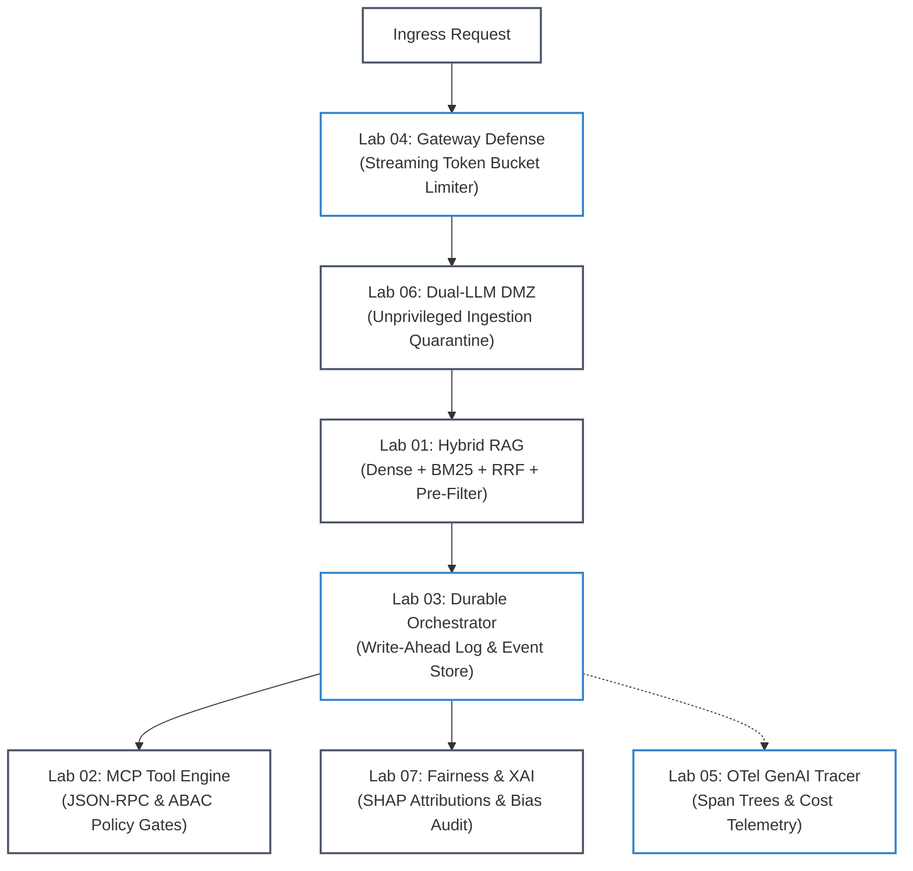

# 🧪 Hands-On Platform Labs & Practice Showcase

[](scripts/verify_lab.py)
[](requirements.txt)
[](agent-forge/)

> **Production Engineering Labs**: 7 self-contained, offline-runnable reference implementations modeling real-world AI distributed systems challenges. Each lab pairs typed Python code with an automated CI evaluation harness.

---

## 🗺️ Lab-to-Phase Mapping Matrix

| Lab | Name | Core Architectural Pattern | Target Phase Hub | Verification Command |
| :--- | :--- | :--- | :--- | :--- |
| **Lab 01** | [Multi-Tenant Hybrid RAG](lab-01-multi-tenant-hybrid-rag.md) | Dense HNSW + Sparse BM25 + RRF ($k=60$) + Tenant Pre-Filtering | [Phase 02: Retrieval & Knowledge Systems](../phase-02/) | `python scripts/verify_lab.py --lab 1` |
| **Lab 02** | [Tool Execution with MCP](lab-02-tool-execution-with-mcp.md) | JSON-RPC 2.0 Discovery + ABAC Policy Engine + HITL Approval | [Phase 03: Tools & Model Context Protocol](../phase-03/) | `python scripts/verify_lab.py --lab 2` |
| **Lab 03** | [Stateful Agent Orchestration](lab-03-stateful-agent-orchestration.md) | Event-Sourced Write-Ahead Log (WAL) + State Rehydration | [Phase 04: Agentic Systems & Orchestration](../phase-04/) | `python scripts/verify_lab.py --lab 3` |
| **Lab 04** | [Agent Failure Defense](lab-04-agent-failure-defense.md) | Dual-Phase Streaming Token Bucket (Acquire/Settle) + TPM/RPM | [Phase 01: Prompt Engineering](../phase-01/) / [Phase 07](../phase-07/) | `python scripts/verify_lab.py --lab 4` |
| **Lab 05** | [AI Observability & Tracing](lab-05-ai-observability-tracing.md) | OpenTelemetry GenAI Semantic Conventions (`gen_ai.*`) | [Phase 06: Evals & Observability](../phase-06/) / [Phase 07](../phase-07/) | `python scripts/verify_lab.py --lab 5` |
| **Lab 06** | [Dual-LLM Quarantine Defenses](lab-06-dual-llm-quarantine-guardrails.md) | Unprivileged Ingestion DMZ + Privilege Separation + ABAC | [Phase 05: AI Security & Guardrails](../phase-05/) | `python scripts/verify_lab.py --lab 6` |
| **Lab 07** | [Hybrid ML Fairness & XAI](lab-07-hybrid-ml-fairness-and-explainability.md) | Tabular Risk Scoring + 4/5ths Bias Audit + SHAP Attributions | [Phase 05: AI Security](../phase-05/) / [Phase 06: Evals](../phase-06/) | `python scripts/verify_lab.py --lab 7` |

---

## 🏛️ End-to-End Enterprise Lab Architecture

The 7 labs together form the foundational layers of a hardened enterprise AI runtime:



#### Diagram Walkthrough:
1. **Gateway Ingress Defense (Lab 04)**: Incoming traffic is throttled using a two-phase streaming token bucket to protect upstream TPM/RPM quotas.
2. **Quarantine Ingestion DMZ (Lab 06)**: Untrusted prompts pass through an isolated extraction LLM to neutralize prompt injection before execution.
3. **Multi-Tenant Hybrid RAG (Lab 01)**: The agent retrieves context via sparse BM25 and dense vector search fused via RRF with strict tenant isolation.
4. **Durable Agent Loop (Lab 03)**: Every reasoning step is committed to an append-only event store WAL to survive pod restarts and crashes.
5. **Governed Tool Invocation (Lab 02)**: Tools execute over standardized JSON-RPC 2.0 schemas guarded by deterministic ABAC policy limits and HITL approvals.
6. **Regulatory Fairness & XAI (Lab 07)**: Automated tabular scoring evaluates the EEOC 4/5ths rule and generates SHAP-grounded adverse action notices.
7. **Distributed Observability (Lab 05)**: Every operation emits standardized OpenTelemetry spans for end-to-end latency and token spend tracking.

---

## ⚡ Quickstart: Running the Automated Lab Harness

Verify all 7 labs offline in under 2 seconds:

```bash
# Run the complete test harness across all labs
python scripts/verify_lab.py --all

# Or verify an individual lab (e.g. Lab 1)
python scripts/verify_lab.py --lab 1
```

All labs rely strictly on standard library Python or minimal dependencies (`pydantic` v2, `typing`), requiring zero third-party cloud API keys or external GPU resources to complete.
