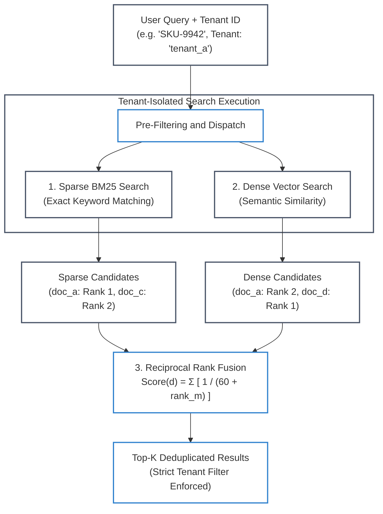

# Lab 1: Multi-Tenant Hybrid RAG with Reciprocal Rank Fusion & Strict Isolation

[](https://colab.research.google.com/github/dip4k/senior-engineer-to-ai-engineer-roadmap/blob/main/notebooks/02_hybrid_rag_and_rrf_visualizer.ipynb)

> **Enterprise Retrieval Pipeline**: Dense HNSW Vector Search + Sparse BM25 Inverted Index + Reciprocal Rank Fusion (RRF `k=60`) + Tenant-Level Pre-Filtering  
> 
> [🔙 Back to Phase 02: Retrieval & Knowledge Systems](../phase-02/) • [🧪 All Practice Labs](README.md) • [⚒️ AgentForge Retrieval Core](../agent-forge/agent_forge/retrieval/) • [📓 Interactive Colab Visualizer](../notebooks/02_hybrid_rag_and_rrf_visualizer.ipynb)

---

## 📑 Executive Overview

In production enterprise knowledge platforms, relying solely on dense semantic vector embeddings creates two catastrophic failure modes:
1. **The Exact-Match Blindspot**: Vector embeddings excel at conceptual synonym matching (e.g. mapping "reimbursement" to "expense repayment"), but frequently fail on exact alphanumeric strings, SKU numbers, financial error codes, and unique identifiers (e.g. `SKU-9942`, `ERR_CONN_TIMEOUT_0x4F`).
2. **Multi-Tenant Data Leakage**: In multi-tenant enterprise architectures, returning even a single document belonging to Tenant B to a user in Tenant A constitutes a critical SOC 2 / ISO 27001 data breach. Post-filtering (retrieving top-K globally and discarding unauthorized tenants) leads to severe recall degradation when irrelevant tenant documents crowd out relevant results.

This lab implements a production-grade **Multi-Tenant Hybrid RAG Engine** that fuses sparse keyword search (BM25) with dense vector search (cosine similarity) using the **Reciprocal Rank Fusion (RRF)** algorithm (`k=60`), protected by **strict pre-filtering tenant isolation**.



#### Diagram Walkthrough:
1. **Pre-Filtering & Query Dispatch**: The incoming query carries mandatory tenant authorization metadata (`tenant_id: 'tenant_a'`). The search engine pre-filters both retrieval indexes to exclude unauthorized tenant documents before scoring occurs.
2. **Dual-Index Retrieval**: The query executes concurrently against the sparse BM25 inverted index (capturing exact product codes) and the dense vector space (capturing semantic intent).
3. **Reciprocal Rank Fusion**: Rather than attempting to normalize disparate score distributions (cosine distances vs BM25 unbounded scores), RRF merges candidate lists based purely on their 1-based ordinal rank positions using smoothing constant `k=60`.
4. **Isolated Result Delivery**: The resulting ranked candidate list guarantees high precision on exact identifiers while preventing any cross-tenant data leakage.

---

## 🎯 Architectural Requirements

1. **Dual Index Ingestion**: Ingest documents tagged with content, unique document IDs, and tenant metadata (`tenant_id`).
2. **Sparse Lexical Search**: Implement a BM25 or token-overlap search engine that indexes exact alphanumeric terms.
3. **Dense Semantic Search**: Implement a normalized dense vector similarity search engine.
4. **Reciprocal Rank Fusion (RRF)**:
   - Merge sparse and dense result lists using the standard harmonic rank scoring formula:
     ```text
     RRF_Score(d) = Σ [ 1 / (k + rank_m(d)) ]  for m in {dense, sparse}
     ```
   - Use default smoothing factor `k = 60`.
5. **Strict Tenant Isolation**: Enforce pre-filtering at the search boundary. Queries for `tenant_a` must never return documents belonging to `tenant_b`, even if `tenant_b` documents have a 100% lexical match with the query.

---

## 💻 Runnable Implementation: Multi-Tenant Hybrid Retriever

Below is the complete, self-contained implementation aligned with the `agent-forge` platform core:

```python
"""
lab01_hybrid_rag.py
=============================================================================
Hands-On Lab 1: Multi-Tenant Hybrid RAG with Reciprocal Rank Fusion & Strict Isolation.
Directly implements the agent_forge.retrieval.hybrid_engine architecture.
=============================================================================
"""

from __future__ import annotations
import math
import re
from dataclasses import dataclass, field
from typing import Any, Dict, List, Optional, Set


@dataclass
class SearchResult:
    id: str
    content: str
    metadata: Dict[str, Any]
    score: float = 0.0


class SimpleBM25Index:
    """Lightweight sparse BM25 index supporting tenant pre-filtering."""

    def __init__(self, k1: float = 1.5, b: float = 0.75):
        self.k1 = k1
        self.b = b
        self.documents: Dict[str, Dict[str, Any]] = {}
        self.doc_lengths: Dict[str, int] = {}
        self.inverted_index: Dict[str, Set[str]] = {}
        self.avg_doc_length: float = 0.0

    def _tokenize(self, text: str) -> List[str]:
        return [t.lower() for t in re.findall(r"\w+", text)]

    def index(self, doc_id: str, content: str, metadata: Dict[str, Any]):
        tokens = self._tokenize(content)
        self.documents[doc_id] = {"content": content, "metadata": metadata, "tokens": tokens}
        self.doc_lengths[doc_id] = len(tokens)
        for t in set(tokens):
            if t not in self.inverted_index:
                self.inverted_index[t] = set()
            self.inverted_index[t].add(doc_id)
        self.avg_doc_length = sum(self.doc_lengths.values()) / max(len(self.doc_lengths), 1)

    def search(self, query: str, tenant_id: Optional[str] = None) -> List[SearchResult]:
        q_tokens = self._tokenize(query)
        scores: Dict[str, float] = {}
        total_docs = len(self.documents)

        for token in q_tokens:
            if token not in self.inverted_index:
                continue
            matching_ids = self.inverted_index[token]
            df = len(matching_ids)
            idf = math.log((total_docs - df + 0.5) / (df + 0.5) + 1.0)

            for doc_id in matching_ids:
                # Enforce strict tenant pre-filtering
                if tenant_id and self.documents[doc_id]["metadata"].get("tenant_id") != tenant_id:
                    continue

                tf = self.documents[doc_id]["tokens"].count(token)
                d_len = self.doc_lengths[doc_id]
                numerator = tf * (self.k1 + 1)
                denominator = tf + self.k1 * (1 - self.b + self.b * (d_len / max(self.avg_doc_length, 1.0)))
                scores[doc_id] = scores.get(doc_id, 0.0) + (idf * (numerator / denominator))

        ranked = sorted(scores.items(), key=lambda x: x[1], reverse=True)
        return [
            SearchResult(
                id=doc_id,
                content=self.documents[doc_id]["content"],
                metadata=self.documents[doc_id]["metadata"],
                score=score
            )
            for doc_id, score in ranked
        ]


class SimpleDenseIndex:
    """Simulated dense embedding vector index supporting tenant pre-filtering."""

    def __init__(self):
        self.documents: Dict[str, Dict[str, Any]] = {}

    def _embed(self, text: str) -> Dict[str, float]:
        # Bag-of-characters character-trigram hash simulation of dense semantic space
        tokens = text.lower().split()
        vec: Dict[str, float] = {}
        for token in tokens:
            vec[token] = vec.get(token, 0.0) + 1.0
        norm = math.sqrt(sum(v * v for v in vec.values())) or 1.0
        return {k: v / norm for k, v in vec.items()}

    def index(self, doc_id: str, content: str, metadata: Dict[str, Any]):
        self.documents[doc_id] = {
            "content": content,
            "metadata": metadata,
            "vector": self._embed(content)
        }

    def search(self, query: str, tenant_id: Optional[str] = None) -> List[SearchResult]:
        q_vec = self._embed(query)
        scores: Dict[str, float] = {}

        for doc_id, data in self.documents.items():
            # Enforce strict tenant pre-filtering
            if tenant_id and data["metadata"].get("tenant_id") != tenant_id:
                continue

            doc_vec = data["vector"]
            # Cosine similarity dot product
            dot = sum(doc_vec.get(k, 0.0) * v for k, v in q_vec.items())
            if dot > 0.0:
                scores[doc_id] = dot

        ranked = sorted(scores.items(), key=lambda x: x[1], reverse=True)
        return [
            SearchResult(
                id=doc_id,
                content=self.documents[doc_id]["content"],
                metadata=self.documents[doc_id]["metadata"],
                score=score
            )
            for doc_id, score in ranked
        ]


class HybridRetriever:
    """Production Multi-Tenant Hybrid Retriever implementing Reciprocal Rank Fusion."""

    def __init__(self, rrf_k: int = 60):
        self.rrf_k = rrf_k
        self.sparse_index = SimpleBM25Index()
        self.dense_index = SimpleDenseIndex()

    def index_documents(self, documents: List[Dict[str, Any]]):
        for doc in documents:
            doc_id = doc["id"]
            content = doc["content"]
            metadata = doc.get("metadata", {})
            self.sparse_index.index(doc_id, content, metadata)
            self.dense_index.index(doc_id, content, metadata)

    def search(
        self,
        query: str,
        top_k: int = 5,
        filter_metadata: Optional[Dict[str, Any]] = None
    ) -> List[SearchResult]:
        tenant_id = filter_metadata.get("tenant_id") if filter_metadata else None

        # Execute sparse and dense searches with pre-filtering
        sparse_results = self.sparse_index.search(query, tenant_id=tenant_id)
        dense_results = self.dense_index.search(query, tenant_id=tenant_id)

        # Compute Reciprocal Rank Fusion (RRF) scores
        rrf_scores: Dict[str, float] = {}
        doc_store: Dict[str, SearchResult] = {}

        for rank_0, res in enumerate(sparse_results):
            rank = rank_0 + 1
            rrf_scores[res.id] = rrf_scores.get(res.id, 0.0) + (1.0 / (self.rrf_k + rank))
            doc_store[res.id] = res

        for rank_0, res in enumerate(dense_results):
            rank = rank_0 + 1
            rrf_scores[res.id] = rrf_scores.get(res.id, 0.0) + (1.0 / (self.rrf_k + rank))
            doc_store[res.id] = res

        # Sort combined results by RRF score descending
        fused = sorted(rrf_scores.items(), key=lambda x: x[1], reverse=True)
        final_results = []
        for doc_id, rrf_score in fused[:top_k]:
            base = doc_store[doc_id]
            final_results.append(
                SearchResult(
                    id=base.id,
                    content=base.content,
                    metadata=base.metadata,
                    score=rrf_score
                )
            )
        return final_results
```

---

## 🧪 Verification & Acceptance Testing

Run the automated verification suite across the repository or test Lab 01 individually:

```bash
# Verify Lab 01 against the agent-forge harness
python scripts/verify_lab.py --lab 1
```

### Expected Output:
```text
=================================================================
 🧪 AI-NATIVE ENGINEER LAB EVALUATION HARNESS
=================================================================

[✅ PASS] Lab 1: Multi-Tenant Hybrid RAG
       Sparse BM25 + Dense search with RRF and strict tenant isolation verified.

=================================================================
 Summary: 1/1 Labs Passing
=================================================================
```

---

## 🛡️ SRE Landmines & Production Takeaways

1. **The Post-Filtering Disaster**: Never retrieve top-100 results globally and then filter by `tenant_id` in application code. If a high-volume tenant floods the index with matching keywords, an unprivileged tenant's query will return zero results (100% false negative rate). Always push tenant filters directly into the HNSW graph traversal and inverted index posting lists.
2. **Smoothing Constant Sensitivity**: The standard default for RRF is `k = 60`. If `k` is set too low (e.g. `k = 1`), rank 1 overwhelms all subsequent ranks (Rank 1 score = 1.0, Rank 2 score = 0.5, a 50% drop). At `k = 60`, Rank 1 is `0.0164` and Rank 2 is `0.0161`, allowing multiple moderate rankings across sparse and dense systems to outscore a single lucky outlier.
3. **Cross-Encoder Overhead**: RRF is computationally cheap (O(N) rank merging). Pass the top 20–50 RRF candidates to a heavy cross-encoder reranker for fine-grained semantic scoring before context injection.
