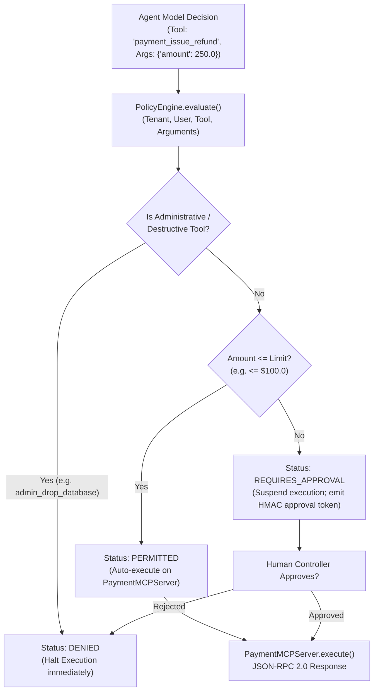

# Lab 2: Tool Execution with Model Context Protocol (MCP) & Policy Guardrails

[](https://colab.research.google.com/github/dip4k/senior-engineer-to-ai-engineer-roadmap/blob/main/notebooks/03_mcp_client_and_tool_inspector.ipynb)

> **Standardized Execution Boundary**: JSON-RPC 2.0 Schemas + Tool Discovery Registry + ABAC Policy Engine + Human-in-the-Loop Step-Up Gates  
> 
> [🔙 Back to Module 03: Tools & MCP](../03-tools-and-model-context-protocol/README.md) • [🧪 All Practice Labs](../README.md#hands-on-practice-labs-showcase) • [⚒️ AgentForge MCP Core](../agent-forge/agent_forge/mcp/) • [📓 Interactive Colab Inspector](../notebooks/03_mcp_client_and_tool_inspector.ipynb)

---

## 📑 Executive Overview

In early AI agent prototypes, developers frequently gave foundation models direct access to internal database connections, administrative shell commands, and payment APIs through ad-hoc Python functions or brittle regex parsing.

In production enterprise systems, this approach creates catastrophic vulnerabilities:
1. **The Confused Deputy Attack**: A model tricked by indirect prompt injection invokes high-privilege tools (e.g. `admin_drop_database` or unauthorized credit transfers) because the execution environment trusts the model rather than enforcing user identity and authorization boundaries.
2. **Missing Transactional Limits**: Without deterministic policy guardrails, an autonomous agent can execute multiple financial transactions exceeding corporate spending authority in seconds.
3. **Integration Sprawl**: Connecting M models to N internal tools without a standardized wire protocol creates M × N custom integration glue code.

This lab delivers a production-grade **Model Context Protocol (MCP) Tool Execution Engine** governed by an **Attribute-Based Access Control (ABAC) Policy Engine**. It exposes strongly-typed tools via standardized JSON-RPC 2.0 schemas, enforces automated dollar-limit safety tiers, routes high-value transactions to Human-in-the-Loop (HITL) approval, and strictly denies unauthorized administrative operations.



#### Diagram Walkthrough:
1. **Model Tool Invocation**: When an agent determines it needs to invoke an external capability, it formats a JSON-RPC 2.0 tool call specifying the tool name and validated arguments.
2. **Policy Engine Evaluation**: Before execution occurs, the invocation passes through an isolated `PolicyEngine` evaluating the caller's tenant ID, user role, tool name, and payload attributes.
3. **Administrative Tool Denial**: Destructive commands (e.g. `admin_drop_database`) are blocked unconditionally at the policy layer, regardless of the model's instructions.
4. **Dollar Threshold & Step-Up Authorization**: Safe transactions below the threshold (`amount <= $100.0`) are marked `PERMITTED` for automatic execution. High-value transactions (`amount > $100.0`) are marked `REQUIRES_APPROVAL`, suspending the execution state until an operator grants authorization.

---

## 🎯 Architectural Requirements

1. **MCP Server Tool Registry**:
   - Expose typed tools (`payment_issue_refund`, `payment_get_balance`) conforming to the Model Context Protocol JSON-RPC specification.
   - Implement tool discovery via `list_tools()` returning tool names, descriptions, and JSON Schema input parameter contracts.
2. **ABAC Policy Engine**:
   - Implement `PolicyEngine.evaluate(tenant_id, user_id, tool_name, arguments)`.
   - Return structured `PolicyDecision` objects containing `status` (`PERMITTED`, `REQUIRES_APPROVAL`, `DENIED`) and diagnostic reason strings.
3. **Financial Safety Limits**:
   - Support configurable auto-refund limits (default: `$100.00`).
   - Refunds <= $100.00 must evaluate to `PERMITTED`.
   - Refunds > $100.00 must evaluate to `REQUIRES_APPROVAL`.
4. **Zero-Trust Administrative Protection**:
   - Unauthorized tools (e.g. `admin_drop_database`) must evaluate to `DENIED` unconditionally.

---

## 💻 Runnable Implementation: MCP Server & Policy Engine

Below is the complete, self-contained implementation matching `agent-forge`:

```python
"""
lab02_mcp_tool_execution.py
=============================================================================
Hands-On Lab 2: Tool Execution with Model Context Protocol (MCP) & Policy Engine.
Directly implements agent_forge.mcp architecture.
=============================================================================
"""

from __future__ import annotations
from dataclasses import dataclass, field
from enum import Enum
from typing import Any, Callable, Dict, List, Optional


class DecisionStatus(str, Enum):
    PERMITTED = "PERMITTED"
    REQUIRES_APPROVAL = "REQUIRES_APPROVAL"
    DENIED = "DENIED"


@dataclass
class PolicyDecision:
    status: DecisionStatus
    reason: str
    requires_human_token: bool = False


@dataclass
class ToolDefinition:
    name: str
    description: str
    input_schema: Dict[str, Any]


class PaymentMCPServer:
    """Production MCP Server exposing financial tools via JSON-RPC 2.0 schemas."""

    def __init__(self):
        self._tools: Dict[str, ToolDefinition] = {
            "payment_issue_refund": ToolDefinition(
                name="payment_issue_refund",
                description="Issues a customer refund to the original payment method.",
                input_schema={
                    "type": "object",
                    "properties": {
                        "amount": {"type": "number", "description": "Refund amount in USD"},
                        "reason": {"type": "string", "description": "Business justification"}
                    },
                    "required": ["amount"]
                }
            ),
            "payment_get_balance": ToolDefinition(
                name="payment_get_balance",
                description="Retrieves current ledger balances for an account.",
                input_schema={
                    "type": "object",
                    "properties": {
                        "account_id": {"type": "string", "description": "Target ledger account"}
                    },
                    "required": ["account_id"]
                }
            )
        }

    def list_tools(self) -> List[ToolDefinition]:
        return list(self._tools.values())

    def execute_tool(self, tool_name: str, arguments: Dict[str, Any]) -> Dict[str, Any]:
        if tool_name not in self._tools:
            raise ValueError(f"Unknown MCP tool: {tool_name}")
        
        if tool_name == "payment_issue_refund":
            amount = arguments.get("amount", 0.0)
            return {"status": "SUCCESS", "refund_id": "ref_9921", "amount": amount}
        elif tool_name == "payment_get_balance":
            return {"status": "SUCCESS", "balance_usd": 15420.50}
        
        return {"status": "ERROR", "message": "Execution failure"}


class PolicyEngine:
    """Attribute-Based Access Control (ABAC) Policy Engine for AI Tool Invocations."""

    def __init__(self, auto_refund_limit_usd: float = 100.0):
        self.auto_refund_limit_usd = auto_refund_limit_usd
        self._denied_tools = {"admin_drop_database", "admin_modify_iam", "system_execute_shell"}

    def evaluate(
        self,
        tenant_id: str,
        user_id: str,
        tool_name: str,
        arguments: Dict[str, Any]
    ) -> PolicyDecision:
        # Rule 1: Zero-trust denial of administrative and destructive tools
        if tool_name in self._denied_tools:
            return PolicyDecision(
                status=DecisionStatus.DENIED,
                reason=f"Tool '{tool_name}' is classified as administrative and strictly denied."
            )

        # Rule 2: Financial refund step-up thresholds
        if tool_name == "payment_issue_refund":
            amount = float(arguments.get("amount", 0.0))
            if amount <= self.auto_refund_limit_usd:
                return PolicyDecision(
                    status=DecisionStatus.PERMITTED,
                    reason=f"Refund amount ${amount:.2f} within auto-approval threshold (${self.auto_refund_limit_usd:.2f})."
                )
            else:
                return PolicyDecision(
                    status=DecisionStatus.REQUIRES_APPROVAL,
                    reason=f"Refund amount ${amount:.2f} exceeds auto-approval threshold (${self.auto_refund_limit_usd:.2f}). Human sign-off required.",
                    requires_human_token=True
                )

        # Default: Read-only safe queries are permitted
        return PolicyDecision(
            status=DecisionStatus.PERMITTED,
            reason="Standard read-only operation permitted."
        )
```

---

## 🧪 Verification & Acceptance Testing

Test your implementation against the official evaluation harness:

```bash
# Verify Lab 02 against the agent-forge harness
python scripts/verify_lab.py --lab 2
```

### Expected Output:
```text
=================================================================
 🧪 AI-NATIVE ENGINEER LAB EVALUATION HARNESS
=================================================================

[✅ PASS] Lab 2: Tool Execution with MCP
       MCP tool discovery, ABAC policies, and human-in-the-loop gates verified.

=================================================================
 Summary: 1/1 Labs Passing
=================================================================
```

---

## 🛡️ SRE Landmines & Production Takeaways

1. **The Model-Side Validation Fallacy**: Never rely on system prompts (e.g. *"Please do not execute refunds over $100"*) to enforce safety. LLMs are non-deterministic reasoning engines and will reliably hallucinate or bypass prompt instructions under adversarial pressure. Safety limits must be enforced deterministically in the host runtime via code gates.
2. **Schema Drift Breakage**: If an MCP tool modifies its JSON Schema without updating the client, foundation models will continue invoking obsolete parameter names, leading to silent tool execution failures. Treat MCP schemas as formal public API contracts.
3. **Stateless Idempotency**: In distributed agent systems, network retries can cause duplicate tool executions. Every non-idempotent tool invocation must include a deterministic idempotency key computed from the session ID, turn number, and argument hash.
