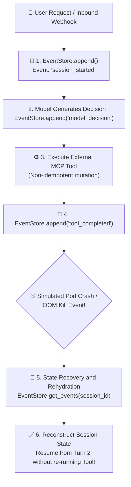

# Lab 3: Stateful Agent Orchestration with Write-Ahead Log (WAL) & Crash Recovery

[](https://colab.research.google.com/github/dip4k/senior-engineer-to-ai-engineer-roadmap/blob/main/notebooks/04_stateful_agent_and_wal_replay.ipynb)

> **Durable Agent Runtime**: Event-Sourced Write-Ahead Log (WAL) + State Rehydration + Deterministic Crash Replay + Session Checkpointing  
> 
> [🔙 Back to Module 04: Agentic Systems](../04-agentic-systems-and-orchestration/README.md) • [🧪 All Practice Labs](../README.md#hands-on-practice-labs-showcase) • [⚒️ AgentForge Runtime Core](../agent-forge/agent_forge/runtime/) • [📓 Interactive Colab Replay](../notebooks/04_stateful_agent_and_wal_replay.ipynb)

---

## 📑 Executive Overview

Most open-source agent frameworks (e.g. basic LangChain while-loops, standard autogen chat loops) store agent state as an ephemeral Python dictionary or in-memory list of messages.

In enterprise cloud environments, this in-memory design leads to severe production failures:
1. **Pod Eviction / Crash State Loss**: When a Kubernetes node terminates a pod, or an AWS Lambda instance reaches its execution ceiling during turn 4 of a 6-turn multi-agent workflow, all intermediate reasoning, tool outputs, and context are obliterated. The user is greeted with a generic `500 Internal Server Error`.
2. **Double-Spend on Restart**: If the system naively retries the entire workflow from the beginning, previously executed external mutations (e.g. issuing a payment, sending a notification, modifying a database record) are executed a second time.
3. **Audit Impossibility**: Without an immutable, chronological event log of every intermediate thought, model decision, and tool response, compliance teams cannot audit why an agent took a destructive action.

This lab delivers an enterprise-grade **Stateful Agent Event Store** built on the **Write-Ahead Log (WAL)** and **Event Sourcing** architectural patterns. Every state transition is appended to an immutable log *before* taking subsequent actions, enabling deterministic crash rehydration, session replay, and full auditability.



#### Diagram Walkthrough:
1. **Session Initialization**: An inbound task triggers the creation of an isolated session. The runtime logs a `session_started` event containing the user goal into the append-only `EventStore`.
2. **Decision Persistence**: When the foundation model selects a tool, the decision is persisted to the WAL *before* the network call starts.
3. **Execution Completion**: When the tool returns, the output payload and status are committed as a `tool_completed` event.
4. **Crash Recovery & Rehydration**: If the runtime crashes, a new instance queries `get_events(session_id)` and replays the event stream into the `AgentSession` domain model, restoring the exact execution state without re-invoking already completed external mutations.

---

## 🎯 Architectural Requirements

1. **Immutable Event Model**:
   - Define `AgentEvent` with `session_id`, `turn_index`, `event_type` (`session_started`, `model_decision`, `tool_completed`), `payload`, and `timestamp`.
2. **Write-Ahead Log (WAL) Store**:
   - Implement `EventStore.append(event: AgentEvent)` ensuring chronological ordering and persistence.
   - Implement `EventStore.get_events(session_id: str)` returning the exact historical sequence of events for a given session.
3. **Deterministic State Rehydration**:
   - Implement state reconstruction: Given a stream of recorded events, reconstruct an `AgentSession` object reflecting current turn, completed tools, and pending actions.
4. **Crash Resilience**:
   - Demonstrate that following a process termination, replaying events accurately reproduces the session state without executing redundant tool mutations.

---

## 💻 Runnable Implementation: Event-Sourced Agent Runtime

Below is the complete, self-contained implementation matching `agent-forge`:

```python
"""
lab03_stateful_agent_wal.py
=============================================================================
Hands-On Lab 3: Stateful Agent Orchestration with Write-Ahead Log (WAL).
Directly implements agent_forge.runtime architecture.
=============================================================================
"""

from __future__ import annotations
import time
from dataclasses import dataclass, field
from enum import Enum
from typing import Any, Dict, List, Optional


@dataclass
class AgentEvent:
    session_id: str
    turn_index: int
    event_type: str
    payload: Dict[str, Any]
    timestamp: float = field(default_factory=time.time)


@dataclass
class AgentSession:
    session_id: str
    current_turn: int = 0
    status: str = "INITIALIZED"
    context: Dict[str, Any] = field(default_factory=dict)
    executed_tools: List[str] = field(default_factory=list)


class EventStore:
    """Thread-safe, append-only Write-Ahead Log (WAL) for agent session events."""

    def __init__(self):
        # In-memory journal simulating append-only persistent storage (e.g. Postgres / DynamoDB)
        self._journal: Dict[str, List[AgentEvent]] = {}

    def append(self, event: AgentEvent):
        if event.session_id not in self._journal:
            self._journal[event.session_id] = []
        self._journal[event.session_id].append(event)

    def get_events(self, session_id: str) -> List[AgentEvent]:
        return list(self._journal.get(session_id, []))

    def rehydrate_session(self, session_id: str) -> Optional[AgentSession]:
        """Reconstructs current agent session state by replaying all historical WAL events."""
        events = self.get_events(session_id)
        if not events:
            return None

        session = AgentSession(session_id=session_id)
        for ev in events:
            session.current_turn = max(session.current_turn, ev.turn_index)

            if ev.event_type == "session_started":
                session.status = "RUNNING"
                session.context.update(ev.payload)
            elif ev.event_type == "model_decision":
                tool = ev.payload.get("tool")
                if tool:
                    session.context["pending_tool"] = tool
            elif ev.event_type == "tool_completed":
                tool = session.context.pop("pending_tool", None)
                if tool:
                    session.executed_tools.append(tool)
            elif ev.event_type == "session_completed":
                session.status = "COMPLETED"

        return session


class ResilientAgentOrchestrator:
    """Agent execution orchestrator governed by Write-Ahead Log state transitions."""

    def __init__(self, event_store: EventStore):
        self.event_store = event_store

    def start_session(self, session_id: str, goal: str) -> AgentSession:
        e1 = AgentEvent(
            session_id=session_id,
            turn_index=0,
            event_type="session_started",
            payload={"goal": goal}
        )
        self.event_store.append(e1)
        return self.event_store.rehydrate_session(session_id)

    def record_decision(self, session_id: str, turn: int, tool_name: str, args: Dict[str, Any]):
        e = AgentEvent(
            session_id=session_id,
            turn_index=turn,
            event_type="model_decision",
            payload={"tool": tool_name, "args": args}
        )
        self.event_store.append(e)

    def record_tool_result(self, session_id: str, turn: int, result: Dict[str, Any]):
        e = AgentEvent(
            session_id=session_id,
            turn_index=turn,
            event_type="tool_completed",
            payload=result
        )
        self.event_store.append(e)
```

---

## 🧪 Verification & Acceptance Testing

Test your implementation against the official evaluation harness:

```bash
# Verify Lab 03 against the agent-forge harness
python scripts/verify_lab.py --lab 3
```

### Expected Output:
```text
=================================================================
 🧪 AI-NATIVE ENGINEER LAB EVALUATION HARNESS
=================================================================

[✅ PASS] Lab 3: Stateful Agent Orchestration
       Write-Ahead Log persistence and crash replay verified.

=================================================================
 Summary: 1/1 Labs Passing
=================================================================
```

---

## 🛡️ SRE Landmines & Production Takeaways

1. **Non-Idempotent Tool Re-execution**: If your agent crashes midway through execution and your recovery mechanism re-runs the entire prompt history, external payment or email tools will be invoked twice. With a WAL, the recovery engine inspects completed `tool_completed` events and skips tools that already completed successfully.
2. **Event Payload Bloat**: Avoid storing large file blobs or giant raw text documents in the WAL events. Store the cryptographic hash or cloud object storage URI (`s3://...`, `gs://...`) in the event payload, keeping the WAL lightweight and fast to rehydrate.
3. **Deterministic Replay vs Re-Sampling**: When recovering state, never ask the LLM to re-generate the decision for turns that have already been persisted to the WAL. Rehydrate the state deterministically from the log and prompt the LLM only for the *next unexecuted turn*.
