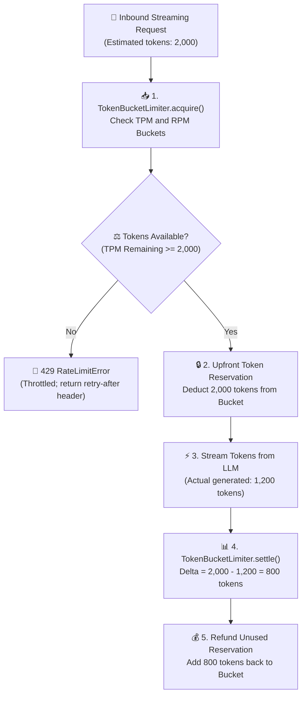

# Lab 4: Agent Failure Defense, Rate Limiting & Streaming Token Buckets

[](https://colab.research.google.com/github/dip4k/senior-engineer-to-ai-engineer-roadmap/blob/main/notebooks/05_token_bucket_and_failure_defense.ipynb)

> **Production Gateway Defense**: Dual-Phase Streaming Token Bucket + Upfront Token Reservation + Post-Stream Settlement + TPM/RPM Throttling  
> 
> [🔙 Back to Module 07: Production Deployment & LLMOps](../07-production-deployment-and-llmops/README.md) • [🧪 All Practice Labs](../README.md#hands-on-practice-labs-showcase) • [⚒️ AgentForge Gateway Core](../agent-forge/agent_forge/gateway/) • [📓 Interactive Colab Defense](../notebooks/05_token_bucket_and_failure_defense.ipynb)

---

## 📑 Executive Overview

In production generative AI applications, rate limiting differs fundamentally from traditional REST APIs:
1. **The Unknown Payload Problem**: In standard web services, a request rate limiter tracks requests per second (`RPM`). In LLM serving, a single request can generate 10 tokens or 4,000 tokens. Rate limiting solely on `RPM` leaves upstream LLM quotas (e.g. 100K TPM) completely unprotected against exhaustion.
2. **The Streaming Latency Gap**: Streaming responses (Server-Sent Events) take 500ms to 30 seconds to complete. If a gateway only counts tokens *after* generation finishes, 50 concurrent requests can enter simultaneously, trigger an upstream `HTTP 429 Too Many Requests` outage, and crash active user sessions.
3. **The Thundering Herd Collapse**: When rate limits are tripped, naive retries sleep for a fixed interval and strike the upstream provider in unison, re-triggering quota exhaustion in an unyielding cascade.

This lab delivers an enterprise-grade **Dual-Phase Token Bucket Limiter** designed specifically for streaming LLM workloads. It reserves estimated tokens *before* streaming begins (`acquire`), settles the delta once exact token counts are known (`settle`), and enforces hard per-tenant ceilings across both Requests Per Minute (RPM) and Tokens Per Minute (TPM).



#### Diagram Walkthrough:
1. **Inbound Token Estimation**: Before dispatching to the LLM, the gateway calculates an upper-bound token estimate based on prompt length and `max_tokens`.
2. **Upfront Reservation**: The `TokenBucketLimiter` checks both the RPM and TPM buckets. If capacity exists, it immediately reserves the full 2,000 tokens, blocking subsequent requests from exceeding upstream limits while the stream is active.
3. **Streaming Generation**: The LLM streams tokens to the client over HTTP SSE.
4. **Post-Stream Settlement**: Once streaming finishes, the exact usage is reported (e.g. 1,200 tokens). The gateway settles the transaction, refunding the unconsumed 800 tokens back into the tenant's bucket.

---

## 🎯 Architectural Requirements

1. **Dual Metric Tracking**: Track both Requests Per Minute (RPM) and Tokens Per Minute (TPM) independently per tenant.
2. **Continuous Token Refill**: Implement smooth, continuous token bucket replenishment based on elapsed time rather than periodic batch resets.
3. **Upfront Token Reservation**:
   - `acquire(tenant_id, estimated_tokens)` checks if both RPM and TPM buckets have sufficient capacity.
   - If capacity is sufficient, deduct 1 request and `estimated_tokens`, returning `(True, "OK")`.
   - If capacity is exceeded, deny the request immediately without blocking, returning `(False, "RateLimitError: ...")`.
4. **Post-Stream Settlement**:
   - `settle(tenant_id, estimated_tokens, actual_tokens)` calculates the difference and refunds `estimated - actual` tokens back to the tenant's bucket.

---

## 💻 Runnable Implementation: Streaming Token Bucket Limiter

Below is the complete, self-contained implementation matching `agent-forge`:

```python
"""
lab04_token_bucket_limiter.py
=============================================================================
Hands-On Lab 4: Agent Failure Defense, Rate Limiting & Streaming Token Buckets.
Directly implements agent_forge.gateway.rate_limiter architecture.
=============================================================================
"""

from __future__ import annotations
import time
from dataclasses import dataclass, field
from typing import Dict, Tuple


@dataclass
class BucketState:
    tpm_capacity: float
    rpm_capacity: float
    current_tokens: float
    current_requests: float
    last_refill_timestamp: float = field(default_factory=time.time)


class TokenBucketLimiter:
    """Production Two-Phase Streaming Token Bucket Rate Limiter."""

    def __init__(self, default_rpm: int = 10, default_tpm: int = 5000):
        self.default_rpm = float(default_rpm)
        self.default_tpm = float(default_tpm)
        self._buckets: Dict[str, BucketState] = {}

    def _get_or_create_bucket(self, tenant_id: str) -> BucketState:
        if tenant_id not in self._buckets:
            self._buckets[tenant_id] = BucketState(
                tpm_capacity=self.default_tpm,
                rpm_capacity=self.default_rpm,
                current_tokens=self.default_tpm,
                current_requests=self.default_rpm,
                last_refill_timestamp=time.time()
            )
        return self._buckets[tenant_id]

    def _refill(self, bucket: BucketState):
        now = time.time()
        elapsed = now - bucket.last_refill_timestamp

        # Tokens refilled per second = capacity / 60.0
        token_refill_rate = bucket.tpm_capacity / 60.0
        request_refill_rate = bucket.rpm_capacity / 60.0

        bucket.current_tokens = min(
            bucket.tpm_capacity,
            bucket.current_tokens + (elapsed * token_refill_rate)
        )
        bucket.current_requests = min(
            bucket.rpm_capacity,
            bucket.current_requests + (elapsed * request_refill_rate)
        )
        bucket.last_refill_timestamp = now

    def acquire(self, tenant_id: str, estimated_tokens: int = 1000) -> Tuple[bool, str]:
        """Upfront reservation check before dispatching streaming request."""
        bucket = self._get_or_create_bucket(tenant_id)
        self._refill(bucket)

        if bucket.current_requests < 1.0:
            return False, f"RPM limit exceeded for tenant '{tenant_id}'."

        if bucket.current_tokens < estimated_tokens:
            return False, f"TPM limit exceeded for tenant '{tenant_id}'. Requested: {estimated_tokens}, Available: {int(bucket.current_tokens)}"

        # Reserve estimated tokens and 1 request upfront
        bucket.current_requests -= 1.0
        bucket.current_tokens -= estimated_tokens
        return True, "Reservation successful."

    def settle(self, tenant_id: str, estimated_tokens: int, actual_tokens: int):
        """Post-stream settlement releasing unconsumed reserved tokens."""
        if tenant_id not in self._buckets:
            return

        bucket = self._buckets[tenant_id]
        self._refill(bucket)

        # Refund difference if actual usage was less than estimated reservation
        delta = estimated_tokens - actual_tokens
        if delta > 0:
            bucket.current_tokens = min(bucket.tpm_capacity, bucket.current_tokens + delta)
        elif delta < 0:
            # Under-estimated: deduct additional consumed tokens
            bucket.current_tokens = max(0.0, bucket.current_tokens - abs(delta))
```

---

## 🧪 Verification & Acceptance Testing

Test your implementation against the official evaluation harness:

```bash
# Verify Lab 04 against the agent-forge harness
python scripts/verify_lab.py --lab 4
```

### Expected Output:
```text
=================================================================
 🧪 AI-NATIVE ENGINEER LAB EVALUATION HARNESS
=================================================================

[✅ PASS] Lab 4: Agent Failure Defense
       Streaming token bucket reservation, settlement, and throttling verified.

=================================================================
 Summary: 1/1 Labs Passing
=================================================================
```

---

## 🛡️ SRE Landmines & Production Takeaways

1. **The Negative Bucket Trap**: In naive token bucket code, refunding tokens can cause `current_tokens` to exceed `tpm_capacity` if another request refilled in between. Always wrap additions with `min(bucket.tpm_capacity, ...)`.
2. **Jittered Exponential Backoff**: When clients receive an `HTTP 429`, never sleep for a fixed duration. Always use decorrelated jitter:
   ```text
   sleep = min(max_delay, uniform(base_delay, prev_sleep * 3))
   ```
3. **Decoupled Gateway Storage**: In multi-instance gateway deployments (e.g. 5 Kubernetes gateway pods), storing buckets in local process memory allows tenants to bypass rate limits by round-robining pods. Production gateways store token bucket counters in Redis using atomic Lua scripts.
