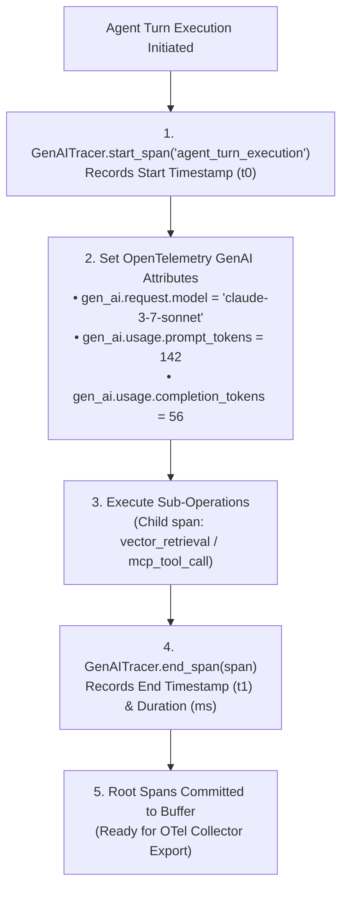

# Lab 5: AI Observability, Distributed Tracing & OpenTelemetry GenAI Semantic Conventions

> **Production AI Observability**: OpenTelemetry GenAI Conventions + Span Lifecycle Tracking + Prompt/Completion Token Accounting + Duration Telemetry  
> 
> [🔙 Back to Module 06: Evals & Observability](../06-evals-and-observability/README.md) • [🧪 All Practice Labs](../README.md#hands-on-practice-labs-showcase) • [⚒️ AgentForge Observability Core](../agent-forge/agent_forge/observability/)

---

## 📑 Executive Overview

In classical microservices architectures, distributed tracing records HTTP status codes, DB query latencies, and service hops via standard APM agents.

In production generative AI systems, standard HTTP tracing leaves engineers completely blind:
1. **The Opaque Latency Black Box**: An agent request takes 8.4 seconds. Did the delay occur in dense vector retrieval (HNSW), an external MCP database tool call, network serialization, or LLM autoregressive token generation?
2. **Missing Token & Cost Attribution**: Without tracing model metadata (`gen_ai.request.model`) and token metrics (`gen_ai.usage.prompt_tokens`, `gen_ai.usage.completion_tokens`) directly on distributed trace spans, finance and platform teams cannot attribute token spend to individual tenants, features, or autonomous agent loops.
3. **Vendor Telemetry Silos**: Ad-hoc proprietary logging libraries (e.g. LangSmith, Phoenix) lock enterprises into proprietary walled gardens instead of open, vendor-neutral telemetry backbones.

This lab delivers a lightweight, production-grade **OpenTelemetry GenAI Tracer** implementing the official **OpenTelemetry GenAI Semantic Conventions** (`gen_ai.*`). It captures hierarchical span trees across multi-turn reasoning steps, tracks token usage, calculates millisecond durations, and prepares traces for open APM ingestion (Jaeger, OpenTelemetry Collector, Datadog).



#### Diagram Walkthrough:
1. **Span Initialization**: The tracer creates an isolated span context, assigning a unique span ID and recording the starting wall-clock timestamp.
2. **GenAI Attribute Annotation**: The runtime annotates the active span with standardized OpenTelemetry semantic attributes (`gen_ai.request.model`, prompt tokens, completion tokens).
3. **Hierarchical Span Nesting**: Internal sub-operations (retrieval, tool calling) spawn child spans linked to the root trace ID.
4. **Duration Calculation & Finalization**: `end_span()` computes duration in milliseconds (`(t_end - t_start) * 1000`) and commits the finalized span to the trace export queue.

---

## 🎯 Architectural Requirements

1. **OpenTelemetry Semantic Attributes**:
   - Adhere strictly to official `gen_ai.*` attribute naming standards:
     - `gen_ai.system`: Provider or framework identifier.
     - `gen_ai.request.model`: Target foundation model name (e.g. `claude-3-7-sonnet`).
     - `gen_ai.usage.prompt_tokens`: Input prompt token count.
     - `gen_ai.usage.completion_tokens`: Generated output token count.
2. **Span Lifecycle & Timing**:
   - `start_span(name)` initializes a span and captures `start_time`.
   - `end_span(span)` captures `end_time` and computes non-negative duration in milliseconds.
3. **Trace Buffer & Root Span Registry**:
   - Tracer retains finalized root spans in memory (`tracer.root_spans`), verifying that span attributes are accurately stored.

---

## 💻 Runnable Implementation: OpenTelemetry GenAI Tracer

Below is the complete, self-contained implementation matching `agent-forge`:

```python
"""
lab05_opentelemetry_tracer.py
=============================================================================
Hands-On Lab 5: AI Observability, Tracing & OTel Telemetry.
Directly implements agent_forge.observability architecture.
=============================================================================
"""

from __future__ import annotations
import time
import uuid
from dataclasses import dataclass, field
from typing import Any, Dict, List, Optional


@dataclass
class GenAISpan:
    name: str
    trace_id: str = field(default_factory=lambda: str(uuid.uuid4()))
    span_id: str = field(default_factory=lambda: str(uuid.uuid4())[:8])
    parent_span_id: Optional[str] = None
    start_time: float = field(default_factory=time.time)
    end_time: Optional[float] = None
    duration_ms: float = 0.0
    attributes: Dict[str, Any] = field(default_factory=dict)
    events: List[Dict[str, Any]] = field(default_factory=list)

    def set_attribute(self, key: str, value: Any):
        self.attributes[key] = value

    def add_event(self, name: str, attributes: Optional[Dict[str, Any]] = None):
        self.events.append({
            "name": name,
            "timestamp": time.time(),
            "attributes": attributes or {}
        })

    def finish(self):
        if self.end_time is None:
            self.end_time = time.time()
            self.duration_ms = max(0.0, (self.end_time - self.start_time) * 1000.0)


class GenAITracer:
    """Production OpenTelemetry GenAI Tracer capturing distributed AI spans."""

    def __init__(self, service_name: str = "agent-service"):
        self.service_name = service_name
        self.root_spans: List[GenAISpan] = []

    def start_span(self, name: str, parent: Optional[GenAISpan] = None) -> GenAISpan:
        span = GenAISpan(
            name=name,
            trace_id=parent.trace_id if parent else str(uuid.uuid4()),
            parent_span_id=parent.span_id if parent else None,
            start_time=time.time()
        )
        span.set_attribute("service.name", self.service_name)
        return span

    def end_span(self, span: GenAISpan):
        span.finish()
        if span.parent_span_id is None:
            self.root_spans.append(span)

    def export_spans_json(self) -> List[Dict[str, Any]]:
        return [
            {
                "trace_id": s.trace_id,
                "span_id": s.span_id,
                "name": s.name,
                "duration_ms": s.duration_ms,
                "attributes": s.attributes,
                "events": s.events
            }
            for s in self.root_spans
        ]
```

---

## 🧪 Verification & Acceptance Testing

Test your implementation against the official evaluation harness:

```bash
# Verify Lab 05 against the agent-forge harness
python scripts/verify_lab.py --lab 5
```

### Expected Output:
```text
=================================================================
 🧪 AI-NATIVE ENGINEER LAB EVALUATION HARNESS
=================================================================

[✅ PASS] Lab 5: AI Observability & Tracing
       OTel GenAI span telemetry and duration tracking verified.

=================================================================
 Summary: 1/1 Labs Passing
=================================================================
```

---

## 🛡️ SRE Landmines & Production Takeaways

1. **PII in Prompt Spans**: By default, recording the entire raw prompt and completion text inside trace attributes creates severe GDPR, HIPAA, and SOC 2 data exposure risks. Production OTel exporters must hash, redact, or strip raw text fields, recording only token counts and model hyperparameters unless explicit debug mode is enabled.
2. **Clock Drift on Distributed Workers**: When calculating span durations across multiple worker pods, never compare start and end timestamps generated by different machines. Always record monotonic durations locally within the worker executing the task.
3. **Trace Sampling Strategy**: Storing 100% of LLM spans in high-throughput environments generates enormous APM storage bills. Implement tail-based sampling: retain 100% of traces with errors (`status_code >= 400`), 100% of high-latency outliers (duration > p95), and 5% of healthy normal requests.
