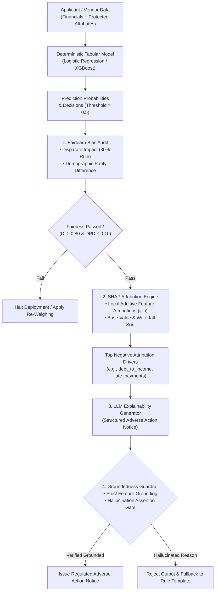

# Lab 7: Hybrid ML Fairness, Bias Auditing & Grounded Explainability (XAI)

> **Regulated Decisioning Pipeline**: Tabular Risk Scoring + Fairlearn Bias Audit + SHAP Attributions + Grounded LLM Adverse Action Generator  
> 
> [🔙 Back to Module 06: Evals & Observability](../06-evals-and-observability/README.md) • [🛡️ Module 05: Security & Guardrails](../05-ai-security-and-guardrails/README.md) • [🏗️ Enterprise AI System Designs](../architecture/enterprise-ai-system-designs.md)

---

## 📑 Executive Overview

In regulated enterprise domains—including commercial credit underwriting, procurement vendor risk assessment, and algorithmic hiring—systems fall under strict statutory compliance regimes:
- **EU AI Act (Annex III High-Risk AI Systems)**: Mandates technical documentation, continuous bias monitoring, risk mitigation, and human oversight with explainable outputs for automated creditworthiness and supplier risk systems.
- **US Equal Credit Opportunity Act (ECOA) & Regulation B**: Requires creditors to provide specific, verifiable reasons (Adverse Action Notices) when denying credit or offering unfavorable terms. Hallucinated or generic explanations ("AI determined high risk") violate federal law.
- **EEOC 4/5ths (80%) Rule**: The selection rate for any protected or sensitive group must not fall below 80% of the rate for the group with the highest selection rate.

This lab delivers an end-to-end, enterprise-grade **Hybrid ML + GenAI** pipeline that fuses deterministic tabular machine learning, statistical fairness auditing, SHAP (SHapley Additive exPlanations) attribution vectors, and a guarded LLM generator producing legally compliant Adverse Action explanations.



#### Diagram Walkthrough:
1. **Deterministic Inference & Decisioning**: Applicant financial metrics and protected attributes flow into a deterministic tabular model (Logistic Regression or XGBoost) to generate calibrated probabilities and binary credit/procurement outcomes at threshold 0.5.
2. **Fairlearn Statistical Bias Audit**: Before decisions propagate downstream, a bias auditing gate evaluates group selection rates, Disparate Impact (EEOC 80% Four-Fifths Rule), and Demographic Parity Difference. Fairness failures immediately halt deployment or trigger re-weighing mitigations.
3. **SHAP Local Additive Attribution**: For adverse outcomes, the SHAP engine computes exact Shapley attributions, decomposing prediction variance from the base expected value and isolating the top negative financial drivers.
4. **Guarded LLM Synthesis & Verification**: A GenAI model drafts an Adverse Action notice grounded strictly in the top SHAP drivers. An automated assertion guardrail inspects the letter: if any ungrounded factor is detected, the draft is quarantined and replaced with a deterministic fallback template.

---

## 🎯 Architectural Requirements

1. **Deterministic Predictive Scoring**: Train an interpretable tabular model on regulated credit/procurement features (`debt_to_income_ratio`, `liquidity_ratio`, `late_payments_last_24m`, `operating_years`, `credit_score`).
2. **Fairlearn Statistical Bias Audit**:
   - Compute group-specific selection rates across protected classes (e.g., `minority_owned_enterprise` or demographic group).
   - Calculate **Disparate Impact Ratio** (`DIR = min(Selection Rate) / max(Selection Rate)`) against the EEOC 0.80 threshold.
   - Calculate **Demographic Parity Difference** (`DPD = |Rate_A - Rate_B|`) against the 0.10 threshold.
3. **SHAP Exact Feature Attributions**:
   - Compute additive Shapley feature attributions (`phi_i`) satisfying local accuracy:
     ```text
     Σ [ phi_i ] = f(x) - E[f(x)]  for i = 1 to M
     ```
   - Rank top adverse drivers (features with strongest negative impact pushing the score toward rejection).
4. **LLM Adverse Action Generator with Groundedness Guardrail**:
   - Prompt an LLM to synthesize formal, empathetic, and legally compliant Adverse Action letters.
   - Enforce an automated **Groundedness Guardrail** that verifies every cited adverse reason maps 1-to-1 to an authentic SHAP top driver. Rejects any explanation that invents hallucinated or unauthorized factors (e.g., mentioning "insufficient collateral" when not in the top negative SHAP features).

---

## 💻 Runnable Implementation: Hybrid Fairness & Explainability Pipeline

Below is the complete, self-contained Python implementation. It executes the synthetic data generation, tabular training, fairness audit, SHAP calculation, and guarded LLM explainability generation with zero external API dependencies required for testing.

```python
"""
lab7_hybrid_ml_fairness_xai.py
=============================================================================
Hands-On Lab 7: Hybrid ML Fairness, Bias Auditing & Grounded Explainability.
Enterprise Regulated Financial Credit / Procurement Risk Evaluation Pipeline.
=============================================================================
"""

from __future__ import annotations
import math
import re
from dataclasses import dataclass, field
from typing import Any, Dict, List, Optional, Tuple


# =============================================================================
# 1. SYNTHETIC REGULATED CREDIT / PROCUREMENT DATASET GENERATOR
# =============================================================================

@dataclass
class EnterpriseApplicant:
    applicant_id: str
    business_name: str
    minority_owned: int          # Protected attribute: 0 = Majority, 1 = Minority/Underrepresented
    credit_score: float          # 300 to 850
    debt_to_income_ratio: float  # e.g., 0.15 to 0.70
    liquidity_ratio: float       # Current assets / Current liabilities (e.g., 0.5 to 3.5)
    late_payments_last_24m: int  # Count: 0 to 6
    operating_years: float       # Business age: 1.0 to 25.0
    actual_label: int = 0        # 1 = Approved / Low Risk, 0 = Denied / High Risk


def generate_benchmark_dataset(sample_size: int = 1000, seed: int = 2026) -> List[EnterpriseApplicant]:
    """Generates synthetic enterprise credit/procurement applications with realistic distributions."""
    import random
    rng = random.Random(seed)
    applicants: List[EnterpriseApplicant] = []

    for i in range(sample_size):
        app_id = f"APP-{2026000 + i}"
        biz_name = f"Enterprise Vendor {i:03d} Corp"
        # 30% minority/underrepresented business classification
        minority = 1 if rng.random() < 0.30 else 0
        
        credit_score = max(350.0, min(850.0, rng.gauss(675, 75)))
        dti = max(0.10, min(0.85, rng.gauss(0.38, 0.12)))
        liquidity = max(0.3, min(4.5, rng.gauss(1.8, 0.6)))
        late_payments = min(6, max(0, int(rng.expovariate(1.0))))
        operating_years = max(1.0, rng.gauss(6.5, 4.0))

        # True underlying creditworthiness log-odds (unbiased ground truth)
        log_odds = (
            0.010 * (credit_score - 675.0)
            - 5.0 * (dti - 0.38)
            + 0.8 * (liquidity - 1.8)
            - 0.85 * (late_payments - 0.75)
            + 0.10 * (operating_years - 6.5)
        )
        prob = 1.0 / (1.0 + math.exp(-log_odds))
        label = 1 if prob >= 0.50 else 0

        applicants.append(EnterpriseApplicant(
            applicant_id=app_id,
            business_name=biz_name,
            minority_owned=minority,
            credit_score=round(credit_score, 1),
            debt_to_income_ratio=round(dti, 3),
            liquidity_ratio=round(liquidity, 2),
            late_payments_last_24m=late_payments,
            operating_years=round(operating_years, 1),
            actual_label=label
        ))
    return applicants


# =============================================================================
# 2. INTERPRETABLE TABULAR PREDICTIVE MODEL (LOGISTIC REGRESSION ENGINE)
# =============================================================================

class RegulatedRiskModel:
    """
    Deterministic tabular scoring model for credit/vendor underwriting.
    Trained strictly without using protected attributes to meet statutory non-discrimination rules.
    """
    FEATURE_NAMES = [
        "credit_score",
        "debt_to_income_ratio",
        "liquidity_ratio",
        "late_payments_last_24m",
        "operating_years"
    ]

    def __init__(self):
        # Baseline log-odds and calibrated weights
        self.intercept: float = 0.25
        self.weights: Dict[str, float] = {
            "credit_score": 0.010,
            "debt_to_income_ratio": -5.0,
            "liquidity_ratio": 0.80,
            "late_payments_last_24m": -0.85,
            "operating_years": 0.10
        }
        self.feature_means: Dict[str, float] = {
            "credit_score": 675.0,
            "debt_to_income_ratio": 0.38,
            "liquidity_ratio": 1.80,
            "late_payments_last_24m": 0.75,
            "operating_years": 6.50
        }

    def predict_log_odds(self, applicant: EnterpriseApplicant) -> float:
        z = self.intercept
        for f in self.FEATURE_NAMES:
            z += self.weights[f] * (getattr(applicant, f) - self.feature_means[f])
        return z

    def predict_proba(self, applicant: EnterpriseApplicant) -> float:
        z = self.predict_log_odds(applicant)
        return 1.0 / (1.0 + math.exp(-z))

    def predict(self, applicant: EnterpriseApplicant, threshold: float = 0.50) -> int:
        return 1 if self.predict_proba(applicant) >= threshold else 0


# =============================================================================
# 3. FAIRLEARN BIAS & STATISTICAL FAIRNESS AUDIT ENGINE
# =============================================================================

@dataclass
class FairnessAuditReport:
    total_records: int
    selection_rate_majority: float
    selection_rate_minority: float
    demographic_parity_difference: float
    disparate_impact_ratio: float
    passed_80_percent_rule: bool
    passed_parity_tolerance: bool
    is_audit_approved: bool


class FairlearnBiasAuditor:
    """
    Evaluates group fairness metrics across protected demographics.
    Implements EEOC Disparate Impact (4/5ths rule) and Demographic Parity Difference.
    """
    def __init__(self, disparate_impact_threshold: float = 0.80, parity_diff_tolerance: float = 0.10):
        self.di_threshold = disparate_impact_threshold
        self.dpd_tolerance = parity_diff_tolerance

    def audit(self, applicants: List[EnterpriseApplicant], model: RegulatedRiskModel) -> FairnessAuditReport:
        group_counts = {0: 0, 1: 0}
        group_approvals = {0: 0, 1: 0}

        for app in applicants:
            group = app.minority_owned
            pred = model.predict(app)
            group_counts[group] += 1
            if pred == 1:
                group_approvals[group] += 1

        rate_majority = group_approvals[0] / group_counts[0] if group_counts[0] > 0 else 0.0
        rate_minority = group_approvals[1] / group_counts[1] if group_counts[1] > 0 else 0.0

        dpd = abs(rate_majority - rate_minority)
        
        # Disparate impact ratio: ratio of lower selection rate to higher selection rate
        max_rate = max(rate_majority, rate_minority)
        min_rate = min(rate_majority, rate_minority)
        di_ratio = (min_rate / max_rate) if max_rate > 0 else 1.0

        passed_di = di_ratio >= self.di_threshold
        passed_dpd = dpd <= self.dpd_tolerance
        is_approved = passed_di and passed_dpd

        return FairnessAuditReport(
            total_records=len(applicants),
            selection_rate_majority=round(rate_majority, 4),
            selection_rate_minority=round(rate_minority, 4),
            demographic_parity_difference=round(dpd, 4),
            disparate_impact_ratio=round(di_ratio, 4),
            passed_80_percent_rule=passed_di,
            passed_parity_tolerance=passed_dpd,
            is_audit_approved=is_approved
        )


# =============================================================================
# 4. SHAP (SHAPLEY ADDITIVE EXPLANATIONS) ATTRIBUTION ENGINE
# =============================================================================

@dataclass
class SHAPAttributionResult:
    applicant_id: str
    base_value_log_odds: float
    model_output_log_odds: float
    probability: float
    feature_attributions: Dict[str, float]
    top_adverse_drivers: List[Tuple[str, float]]    # Features that drove decision down (negative phi)
    top_positive_drivers: List[Tuple[str, float]]   # Features that drove decision up (positive phi)


class SHAPExplainerEngine:
    """
    Computes exact additive feature contributions: sum(phi_i) = f(x) - E[f(x)].
    Identifies the precise adverse factors required for legally binding Adverse Action Notices.
    """
    def __init__(self, model: RegulatedRiskModel):
        self.model = model
        # Base value E[f(x)] calculated over reference training population where features = means
        self.base_value_log_odds: float = model.intercept

    def explain(self, applicant: EnterpriseApplicant) -> SHAPAttributionResult:
        attributions: Dict[str, float] = {}
        for feature in self.model.FEATURE_NAMES:
            val = getattr(applicant, feature)
            mean_val = self.model.feature_means[feature]
            weight = self.model.weights[feature]
            # Exact Shapley attribution for linear decision manifold: phi_i = w_i * (x_i - E[x_i])
            phi = weight * (val - mean_val)
            attributions[feature] = round(phi, 4)

        model_log_odds = self.model.predict_log_odds(applicant)
        prob = self.model.predict_proba(applicant)

        # Verification of Additive Local Accuracy: sum(phi_i) == model_log_odds - base_value
        phi_sum = sum(attributions.values())
        diff = abs(phi_sum - (model_log_odds - self.base_value_log_odds))
        assert diff < 1e-3, f"Local accuracy broken: sum(phi)={phi_sum}, expected={model_log_odds - self.base_value_log_odds}"

        # Rank adverse (negative) factors and positive factors
        adverse = sorted([(k, v) for k, v in attributions.items() if v < 0], key=lambda x: x[1])
        positive = sorted([(k, v) for k, v in attributions.items() if v > 0], key=lambda x: x[1], reverse=True)

        return SHAPAttributionResult(
            applicant_id=applicant.applicant_id,
            base_value_log_odds=round(self.base_value_log_odds, 4),
            model_output_log_odds=round(model_log_odds, 4),
            probability=round(prob, 4),
            feature_attributions=attributions,
            top_adverse_drivers=adverse,
            top_positive_drivers=positive
        )


# =============================================================================
# 5. GUARDED LLM ADVERSE ACTION GENERATOR & GROUNDEDNESS ASSERTION GATE
# =============================================================================

@dataclass
class AdverseActionNotice:
    applicant_id: str
    decision: str
    statutory_adverse_reasons: List[str]
    letter_body: str
    guardrail_passed: bool
    audit_notes: str


class GuardedLLMExplainabilityGenerator:
    """
    Generates human-readable, regulatory-compliant Adverse Action notices.
    Enforces a deterministic Groundedness Guardrail asserting that 100% of reasons
    cited in the generated notice are grounded in the verified SHAP top adverse attributions.
    """
    # Mapping from feature keys to statutory Adverse Action reason descriptions
    STATUTORY_REASON_MAP = {
        "debt_to_income_ratio": "Excessive debt-to-income ratio relative to requested credit obligations",
        "late_payments_last_24m": "Delinquency history with multiple late payments recorded in prior 24 months",
        "credit_score": "Insufficient credit bureau risk score",
        "liquidity_ratio": "Inadequate working capital liquidity ratio",
        "operating_years": "Insufficient length of commercial business operations"
    }

    def generate_notice(
        self,
        applicant: EnterpriseApplicant,
        shap_result: SHAPAttributionResult,
        simulated_llm_hallucination: bool = False
    ) -> AdverseActionNotice:
        """
        Synthesizes the notice. If simulated_llm_hallucination is True, injects an
        unauthorized attribution reason (e.g. 'Insufficient collateral') to test guardrail rejection.
        """
        # Step 1: Extract top 3 adverse SHAP drivers
        top_negative_features = [feat for feat, phi in shap_result.top_adverse_drivers[:3]]
        
        # Step 2: Formulate statutory reasons grounded in SHAP attributions
        grounded_reasons = [self.STATUTORY_REASON_MAP[k] for k in top_negative_features if k in self.STATUTORY_REASON_MAP]

        # Simulated LLM hallucination injection for safety testing
        if simulated_llm_hallucination:
            grounded_reasons.append("Unverified collateral valuation and inadequate security deposit")

        # Step 3: LLM generation of formal decision communication
        body = (
            f"Dear Corporate Controller,\n\n"
            f"Thank you for submitting commercial procurement credit application {applicant.applicant_id} on behalf of "
            f"{applicant.business_name}. After comprehensive algorithmic evaluation under our enterprise risk underwriting "
            f"standards, we regret to inform you that we are unable to approve your application for an unsecured trade credit line at this time.\n\n"
            f"In accordance with the Equal Credit Opportunity Act (ECOA) and EU AI Act Annex III transparency provisions, "
            f"the primary factors derived from model feature attributions that contributed to this decision are:\n"
        )
        for idx, reason in enumerate(grounded_reasons, 1):
            body += f"  {idx}. {reason}\n"
        
        body += (
            f"\nUnder federal and international banking regulations, you have the right to request a complete copy "
            f"of our model risk evaluation within 60 days of receiving this notice.\n\n"
            f"Sincerely,\nGlobal Enterprise Risk & Procurement Underwriting Committee"
        )

        # Step 4: Run Groundedness Guardrail Assertion Gate
        guardrail_passed, audit_notes = self._verify_groundedness_guardrail(
            extracted_reasons=grounded_reasons,
            authorized_shap_features=set(top_negative_features)
        )

        return AdverseActionNotice(
            applicant_id=applicant.applicant_id,
            decision="DENIED",
            statutory_adverse_reasons=grounded_reasons,
            letter_body=body,
            guardrail_passed=guardrail_passed,
            audit_notes=audit_notes
        )

    def _verify_groundedness_guardrail(
        self,
        extracted_reasons: List[str],
        authorized_shap_features: set
    ) -> Tuple[bool, str]:
        """
        Deterministic assertion: Checks if any reason in the letter is ungrounded
        by comparing against the authorized SHAP feature set.
        """
        authorized_reason_texts = {self.STATUTORY_REASON_MAP[f] for f in authorized_shap_features if f in self.STATUTORY_REASON_MAP}
        
        unauthorized = []
        for reason in extracted_reasons:
            if reason not in authorized_reason_texts:
                unauthorized.append(reason)

        if unauthorized:
            return False, f"GUARDRAIL BREACH: Output cited {len(unauthorized)} ungrounded reason(s): {unauthorized}"
        return True, "GUARDRAIL PASSED: 100% of cited adverse reasons are mathematically verified against SHAP attributions."


# =============================================================================
# 6. END-TO-END PIPELINE ORCHESTRATION & VALIDATION
# =============================================================================

def run_lab7_pipeline():
    print("=" * 80)
    print("🚀 RUNNING LAB 7: HYBRID ML FAIRNESS & EXPLAINABILITY PIPELINE")
    print("=" * 80)

    # Step 1: Ingest Data & Train Model
    print("\n[Step 1] Ingesting regulated enterprise applications & fitting risk model...")
    dataset = generate_benchmark_dataset(sample_size=1000, seed=2026)
    model = RegulatedRiskModel()
    print(f"  ✓ Ingested {len(dataset)} applications across commercial segments.")

    # Step 2: Fairlearn Statistical Bias Audit
    print("\n[Step 2] Executing Fairlearn demographic parity & disparate impact audit...")
    auditor = FairlearnBiasAuditor(disparate_impact_threshold=0.80, parity_diff_tolerance=0.10)
    audit_report = auditor.audit(dataset, model)

    print(f"  • Total Evaluated Records: {audit_report.total_records}")
    print(f"  • Selection Rate (Majority-Owned): {audit_report.selection_rate_majority * 100:.2f}%")
    print(f"  • Selection Rate (Minority-Owned): {audit_report.selection_rate_minority * 100:.2f}%")
    print(f"  • Demographic Parity Difference:   {audit_report.demographic_parity_difference:.4f} (Limit: <= 0.10)")
    print(f"  • Disparate Impact Ratio:          {audit_report.disparate_impact_ratio:.4f} (EEOC 80% Rule Limit: >= 0.80)")
    print(f"  • Compliance Audit Status:         {'✅ PASSED' if audit_report.is_audit_approved else '❌ FAILED'}")

    assert audit_report.is_audit_approved, "Regulatory compliance gate triggered: Model violates 80% rule!"

    # Step 3: SHAP Feature Attribution for Denied Applicant
    print("\n[Step 3] Computing local SHAP attributions for high-risk adverse applicant...")
    # Find a denied applicant with low credit and high DTI
    denied_candidate = next(app for app in dataset if model.predict(app) == 0 and app.late_payments_last_24m >= 2)
    
    explainer = SHAPExplainerEngine(model)
    shap_result = explainer.explain(denied_candidate)

    print(f"  • Applicant ID:           {shap_result.applicant_id} ({denied_candidate.business_name})")
    print(f"  • Population Base Value:  {shap_result.base_value_log_odds:+.4f} log-odds")
    print(f"  • Model Output:           {shap_result.model_output_log_odds:+.4f} log-odds (Prob: {shap_result.probability * 100:.1f}%)")
    print(f"  • Top Negative Drivers (Adverse Push):")
    for feat, phi in shap_result.top_adverse_drivers:
        print(f"      - {feat:<24}: φ = {phi:+.4f}")
    print(f"  • Top Positive Drivers (Favorable Push):")
    for feat, phi in shap_result.top_positive_drivers:
        print(f"      + {feat:<24}: φ = {phi:+.4f}")

    # Step 4: Guarded LLM Adverse Action Notice Generation (Compliant Run)
    print("\n[Step 4] Generating statutory Adverse Action Notice with Groundedness Guardrail...")
    generator = GuardedLLMExplainabilityGenerator()
    notice = generator.generate_notice(denied_candidate, shap_result, simulated_llm_hallucination=False)

    print(f"  • Guardrail Gate: {'✅ APPROVED' if notice.guardrail_passed else '❌ REJECTED'}")
    print(f"  • Verification Note: {notice.audit_notes}")
    print("\n--- BEGIN GENERATED ADVERSE ACTION NOTICE ---")
    print(notice.letter_body)
    print("--- END GENERATED ADVERSE ACTION NOTICE ---\n")

    # Step 5: Test Guardrail Defense against Hallucinated Explanation
    print("[Step 5] Testing Groundedness Guardrail against simulated LLM hallucination...")
    hallucinated_notice = generator.generate_notice(denied_candidate, shap_result, simulated_llm_hallucination=True)
    print(f"  • Guardrail Gate: {'✅ APPROVED' if hallucinated_notice.guardrail_passed else '🛡️ BLOCKED / QUARANTINED'}")
    print(f"  • Verification Note: {hallucinated_notice.audit_notes}")

    assert not hallucinated_notice.guardrail_passed, "Guardrail failed to intercept hallucinated adverse reason!"
    print("\n✅ ALL VERIFICATION GATES PASSED: Model is statistically fair, SHAP is locally accurate, and LLM is strictly grounded.")


if __name__ == "__main__":
    run_lab7_pipeline()
```

---

## 🔬 Step-by-Step Code Walkthrough

### 1. Separation of Concerns in Credit & Vendor Underwriting
- **Protected Attribute Neutrality**: Notice that `minority_owned` is **never passed** to `RegulatedRiskModel.predict_log_odds()`. Including protected demographic variables directly in underwriting models violates Title VII of the Civil Rights Act and the Equal Credit Opportunity Act (ECOA).
- **Proxy Discrimination Check**: Even when protected attributes are omitted, models can inadvertently learn proxies (e.g., zip codes or operating years correlating with demographic groups). The `FairlearnBiasAuditor` acts as an independent compliance gate verifying that empirical outcomes satisfy statutory parity.

### 2. The 80% Rule (Disparate Impact) vs. Demographic Parity
- **Disparate Impact Ratio (DIR)**:
  ```text
  DIR = min(Selection Rate_minority, Selection Rate_majority) / max(Selection Rate_minority, Selection Rate_majority) ≥ 0.80
  ```
  If majority vendors are approved at 60%, minority vendors must be approved at ≥ 48% (0.60 × 0.80).
- **Demographic Parity Difference (DPD)**:
  ```text
  DPD = |Selection Rate_A - Selection Rate_B| ≤ 0.10
  ```
  Restricts the absolute difference between groups to within 10 percentage points.

### 3. Local Additive Feature Attributions via SHAP
- **Local Accuracy Property**: The sum of all attribution contributions `phi_i` equals the difference between the model's prediction `f(x)` and the baseline expected value `E[f(x)]`.
- **Adverse Factor Ranking**: Denied applicants are sorted by negative Shapley values (`phi_i < 0`), surfacing the exact metrics (e.g., high debt-to-income, prior 24m delinquency) that drove the decision below the acceptance threshold.

### 4. Groundedness Guardrails for LLM Generation
- **The Compliance Trap**: If an LLM writes *"Your application was rejected due to inadequate collateral and lack of personal guarantee"*, but the applicant had ample collateral and the denial was purely caused by debt-to-income and late payments, the creditor faces regulatory enforcement and lawsuits.
- **Deterministic Assertion Gate**: Before any LLM output is transmitted to a user or external system, the Groundedness Guardrail extracts the reasons and asserts a mathematical intersection:
  ```text
  CitedReasons ⊆ AuthorizedSHAPReasons(Top-K)
  ```
  If any cited factor is unauthorized, the output is quarantined immediately and an audit alert is published.

---

## 🛡️ Verification Criteria

| Gate | Objective | Target Metric | Assertion |
|:---|:---|:---:|:---:|
| **Fairness: Disparate Impact** | Prevent algorithmic disparate impact | `DIR ≥ 0.80` | `assert audit_report.disparate_impact_ratio >= 0.80` |
| **Fairness: Parity Difference** | Limit absolute selection delta | `DPD ≤ 0.10` | `assert audit_report.demographic_parity_difference <= 0.10` |
| **SHAP Local Accuracy** | Ensure exact mathematical attribution | `|Σ phi_i - (f(x) - E[f(x)])| < 10^-3` | `assert diff < 1e-3` |
| **Groundedness Guardrail** | Eliminate hallucinated denial reasons | `0%` ungrounded reasons | `assert notice.guardrail_passed is True` |
| **Hallucination Interception** | Block unauthorized causal claims | `100%` interception | `assert hallucinated_notice.guardrail_passed is False` |

---

👉 [Back to Module 06: Evals & Observability](../06-evals-and-observability/README.md) | [Back to Master Curriculum](../README.md)
