# AI Governance, Compliance & The EU AI Act: A Practical Engineering Guide

> **A field guide for Senior Developers, AI Architects, and Engineering Leads bridging the gap between Brussels legal statutes, NIST security standards, and production Git pull requests.**

---

> Aligns with the [Architectural Mastery Tiers](../README.md#architectural-mastery-tiers) of the curriculum.

---

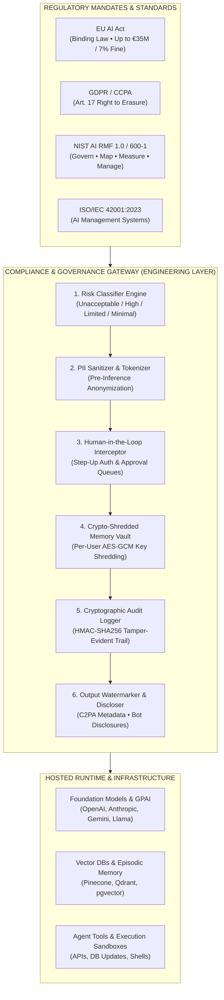

---

## 📑 Table of Contents

1. [Why Engineers Need to Care](#1-why-engineers-need-to-care)
2. [EU AI Act Timeline & Enforcement Milestones](#2-eu-ai-act-timeline-enforcement-milestones)
3. [The 4-Tier Risk Classification Taxonomy](#3-the-4-tier-risk-classification-taxonomy)
4. [General-Purpose AI (GPAI) & Foundation Model Obligations](#4-general-purpose-ai-gpai-foundation-model-obligations)
5. [The Production AI Engineering Compliance Checklist](#5-the-production-ai-engineering-compliance-checklist)
6. [Long-Term Memory & Data Governance Under GDPR](#6-long-term-memory-data-governance-under-gdpr)
7. [Enterprise Responsible AI Frameworks: The Big Four Compared](#7-enterprise-responsible-ai-frameworks-the-big-four-compared)
8. [War Stories from the Compliance Trenches](#8-war-stories-from-the-compliance-trenches)
9. [Curated Reference Index & Legal Portals](#9-curated-reference-index-legal-portals)

---

## 1. Why Engineers Need to Care

### The Shift to Regulated AI Engineering

For the last three years, generative AI engineering has operated in a "Wild West" era. Engineers piped user inputs directly into model endpoints, wired LLMs straight to production databases with zero authorization boundaries, and shipped code based on "vibe checks."

**That era is officially over.** 

The European Union AI Act, the US NIST AI Risk Management Framework, and ISO/IEC 42001 have turned AI Engineering into a regulated engineering discipline. AI governance is not an abstract legal philosophy debate for your corporate general counsel; **it is a system requirement for your software architecture.**

---

### The Staggering Financial & Operational Stakes

When GDPR landed in 2018, many engineering teams treated it as a joke—until Meta was hit with a **€1.2 Billion** penalty and Amazon was slapped with **€746 Million**. 

The **EU AI Act (Regulation EU 2024/1689)** makes GDPR's penalties look gentle.

| Violation Category | Maximum Statutory Fine (EUR) | Global Annual Turnover Penalty | Who Gets Sued / Subpoenaed? |
| :--- | :--- | :--- | :--- |
| **Non-Compliance with Prohibited AI Practices (Article 5)** | **Up to €35,000,000** | **Up to 7% of total worldwide annual turnover** (whichever is higher) | Model providers, deployers, and downstream app developers |
| **Non-Compliance with High-Risk AI Obligations (Article 9-15)** | **Up to €15,000,000** | **Up to 3% of total worldwide annual turnover** (whichever is higher) | Deployers, system integrators, enterprise engineering orgs |
| **Supplying Incorrect or Misleading Information to Authorities** | **Up to €7,500,000** | **Up to 1.5% of total worldwide annual turnover** (whichever is higher) | Corporate entities and technical documentation sign-offs |
| **SME / Startup Special Provisions** | Cap at equivalent percentages | Lower of fixed amount vs percentage cap for early ventures | Early-stage venture teams |

> [!CAUTION]
> **The Extraterritorial Trap:** You do **not** need to have an office or legal entity in the European Union to be liable. If your AI service is hosted in Northern Virginia or Singapore, but its output is used by individuals or businesses within the EU, **you are fully subject to the EU AI Act**.

---

### ISO/IEC 42001 and NIST AI RMF: The Twin North Stars

While the EU AI Act provides the **legal hammer**, two frameworks provide the **engineering blueprints** to ensure your architecture survives an audit:

1. **ISO/IEC 42001:2023 (Artificial Intelligence Management System - AIMS):**
   * The world's first certifiable international standard for AI governance.
   * Mirrors ISO 27001 (Information Security) and ISO 9001 (Quality Management).
   * Mandates continuous risk assessments, traceable data lineage, verifiable model retirement pipelines, and formal roles for AI safety officers.
2. **NIST AI RMF 1.0 (NIST SP 1270) & Generative AI Profile (NIST AI 600-1):**
   * Created by the US National Institute of Standards and Technology.
   * Breaks engineering responsibilities into four clear operational functions: **GOVERN**, **MAP**, **MEASURE**, and **MANAGE**.
   * Provides concrete checklists for mitigating the top 12 generative AI risks, including prompt injection, hallucination, data poisoning, and IP leakage.

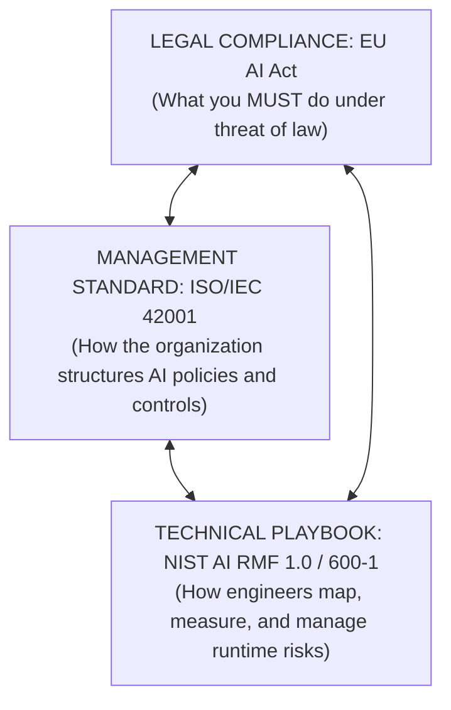

---

## 2. EU AI Act Timeline & Enforcement Milestones

The EU AI Act entered into force on **August 1, 2024**. Rather than dropping all requirements at once, the European Parliament instituted a phased rollout. As an engineer, you must know exactly which milestone impacts your current sprint backlog.

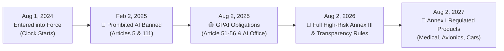

### Milestone Breakdown for Engineering Teams

#### 1. February 2, 2025: Prohibited Practices Ban (6 Months)
* **What took effect:** Chapter I (General Provisions) and Chapter II (Prohibited AI Practices).
* **Engineering Impact:** You must audit your code repositories immediately. If your system runs biometric emotion recognition in workplaces, untargeted web-scraping for facial recognition databases, or subliminal manipulation intended to distort user behavior, it is an illegal system.
* **Penalty:** The maximum fine tier applies (€35M or 7% of revenue).

#### 2. August 2, 2025: General Purpose AI (GPAI) Obligations (12 Months)
* **What takes effect:** Chapter V (General-Purpose AI Models), the establishment of the European AI Office, and notification requirements for systemic risk foundation models.
* **Engineering Impact:** Foundation model providers (OpenAI, Anthropic, Mistral, Google) and developers fine-tuning large open models must publish technical summaries of training datasets, respect the EU Copyright Directive (opt-outs via robots.txt/machine-readable tags), and submit evaluation results.

#### 3. August 2, 2026: General Application Date & High-Risk Annex III (24 Months)
* **What takes effect:** The vast majority of the Act! High-risk standalone AI systems under **Annex III** (employment resume filtering, credit scoring, educational testing, essential public infrastructure) must satisfy all conformity assessment requirements, logging mandates, and CE marking.
* **Engineering Impact:** Limited risk transparency rules activate: chatbots and generative AI systems interacting with humans must explicitly disclose that the user is interacting with an AI. Synthetic media (audio, video, deepfakes) must carry machine-readable watermarks.

#### 4. August 2, 2027: High-Risk Systems in Regulated Products (36 Months)
* **What takes effect:** High-risk AI systems governed by **Annex I**—meaning AI embedded as a safety component inside products already regulated by EU safety legislation (medical devices, commercial aviation, motor vehicles, industrial machinery).

---

## 3. The 4-Tier Risk Classification Taxonomy

The EU AI Act rejects a one-size-fits-all approach. It categorizes every AI system into one of **four risk tiers**. Your engineering workload depends almost entirely on which bucket your application falls into.

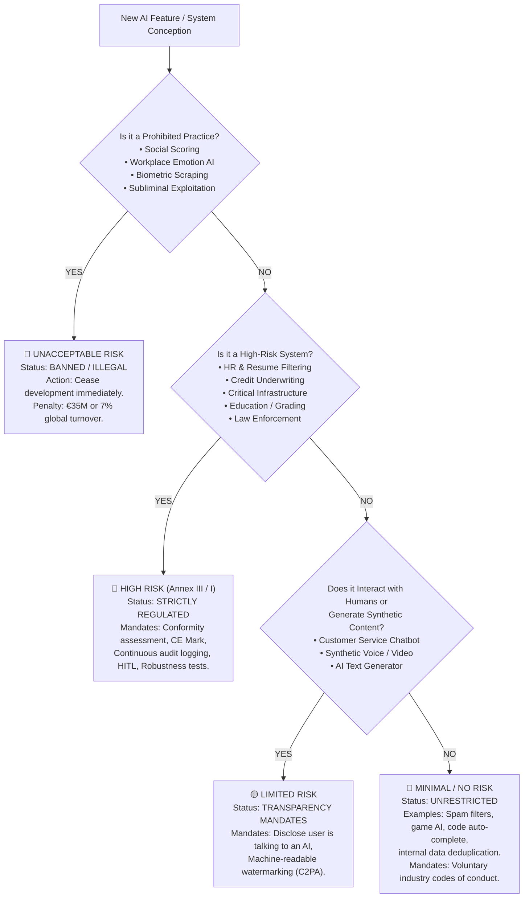

### Deep Dive into the 4 Tiers

### 1. Unacceptable Risk (Prohibited) 🔴
* **Concept (ELI10):** Like selling contaminated baby formula or booby-trapped cars. Society agrees these things are so inherently harmful they cannot exist in a commercial market.
* **Examples:**
  * **Social scoring systems** (rating citizens based on social behavior or personality metrics).
  * **Cognitive behavioral manipulation** targeting vulnerable groups (e.g., an AI-driven toy that whispers dangerous challenges to children).
  * **Workplace & educational emotion recognition** (software analyzing an employee's webcam to gauge if they are "lazy" or "frustrated").
  * **Untargeted scraping of facial images** from the internet or CCTV footage to create facial recognition databases (e.g., Clearview AI-style crawlers).
  * **Predictive policing** assessing the risk of an individual committing future criminal offenses based solely on profiling.

### 2. High Risk (Regulated under Annex III & Annex I) 🔴
* **Concept (ELI10):** Like an airplane autopilot or hospital anesthesia machine. It is completely legal and incredibly useful, but if it malfunctions or is biased, people get hurt, lose their jobs, or get denied their fundamental rights.
* **Examples (Annex III Standalone):**
  * **Recruitment & HR:** AI systems that screen resumes, rank applicants, or evaluate candidate video interviews.
  * **Creditworthiness & Insurance:** AI models determining who gets a home loan or healthcare insurance coverage.
  * **Education & Vocational Training:** Automated essay scoring, admissions filters, proctoring tools.
  * **Critical Infrastructure:** AI controlling electrical grid load balancing, drinking water filtration, or air traffic.
* **Mandatory Engineering Requirements (Articles 9-15):**
  1. **Risk Management System (Art. 9):** Continuous testing and mitigation pipeline throughout the system lifecycle.
  2. **Data Governance (Art. 10):** Training, validation, and testing datasets must be examined for bias, errors, and demographic gaps.
  3. **Technical Documentation (Art. 11):** Up-to-date documentation explaining the architecture, prompt templates, hyperparameters, and evals.
  4. **Record-Keeping & Logging (Art. 12):** Automatic event logging over the entire operational lifetime (retention min 6 months).
  5. **Transparency & User Instructions (Art. 13):** Clear operational manuals explaining accuracy, limitations, and edge-case behavior.
  6. **Human Oversight (HITL) (Art. 14):** Software hooks allowing human operators to override, intercept, or instantly shut down the AI.
  7. **Accuracy, Robustness & Cybersecurity (Art. 15):** Resilient against adversarial prompt injection, data poisoning, and model evasion.

### 3. Limited Risk (Transparency Mandates) 🟡
* **Concept (ELI10):** Like the disclaimer on a box of decaf coffee or a movie with CGI dinosaurs. You are allowed to sell it, but you cannot trick the customer into believing it's real.
* **Examples:**
  * Customer support LLM chatbots.
  * AI-generated avatars, voices, or synthetic media (deepfakes).
  * AI-generated articles or marketing copy published publicly.
* **Mandatory Engineering Requirements:**
  * **Direct Notification:** The UI must inform users in a clear, unambiguous way that they are interacting with an artificial intelligence system (unless obvious from context).
  * **Watermarking & Provenance:** Audio, video, and image generators must stamp outputs with machine-readable, tamper-resistant metadata (e.g., C2PA standards).

### 4. Minimal / No Risk 🔵
* **Concept (ELI10):** Like a regular toaster or a calculator. There is virtually no risk of violating fundamental human rights.
* **Examples:**
  * Email spam filters.
  * AI enemies inside a video game.
  * In-IDE code auto-completion tools used by internal developers.
  * Clustering algorithms optimizing database indexing or cache invalidation.
* **Mandatory Engineering Requirements:**
  * None. Voluntary adoption of ethical AI codes of conduct is encouraged.

---

### Comparative Analysis: Risk Tier Engineering Matrix

| Risk Tier | Engineering Effort Factor | Mandatory Artifacts | Pre-Deployment Requirement | Post-Deployment Requirement |
| :--- | :--- | :--- | :--- | :--- |
| **🔴 Unacceptable** | N/A (Disallowed) | Deprecation & Deletion logs | **DO NOT SHIP** | Complete decommissioning |
| **🔴 High Risk** | 5x (Extensive) | Model Cards, Risk Logs, Bias Audits, HITL Architecture | Conformity Assessment + CE Mark Registration | Continuous telemetry, incident reporting to EU AI Office within 72h |
| **🟡 Limited Risk** | 1.2x (Low/Modest) | Bot disclosure headers, C2PA Watermark encoders | UI/UX Disclaimer inspection | Tamper-resistance monitoring for watermarks |
| **🔵 Minimal Risk** | 1.0x (Baseline) | Standard unit and integration tests | Standard CI/CD pipeline | Standard APM / uptime monitoring |

---

## 4. General-Purpose AI (GPAI) & Foundation Model Obligations

### Foundation Lab vs Downstream Application Developer

One of the greatest sources of confusion among software engineers is: *"If I am building an app using Claude 3.7 or GPT-4.5 / o3, am I considered a GPAI provider?"*

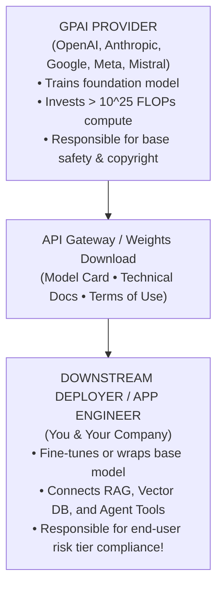

### The Systemic Risk Compute Threshold: 10^25 FLOPs

The EU AI Act sets an objective mathematical benchmark for identifying frontier models that possess **systemic risk**:
```text
Cumulative Training Compute > 10^25 FLOPs (Floating Point Operations)
```

Any model trained using more compute than this threshold (which includes GPT-4, Gemini 1.5/2.0 Pro, Claude 3.5/3.7 Sonnet, and Llama 3.1 405B) automatically triggers Tier 2 GPAI systemic risk obligations:
* **Model Red-Teaming:** Mandatory adversarial penetration testing conducted with external safety bodies.
* **Energy Consumption Transparency:** Documented power usage, cooling water usage, and carbon emissions during training.
* **EU AI Office Reporting:** Regular reporting of critical incidents, severe vulnerabilities, and safety evals.

### What Downstream Engineers Must Demand from Model Vendors

If you are building an enterprise application, you cannot just sign up with an individual credit card on a consumer playground. Under Articles 51-54, you must ensure your model supplier provides:

1. **Detailed Technical Documentation:** Clarifying model training data cutoff, context window degradation limits, and benchmark scores.
2. **Copyright Compliance Statements:** Proof that the model provider respected EU Copyright Directive opt-outs (e.g., machine-readable robots.txt protocols for training datasets).
3. **Enterprise Zero-Retention DPA:** A signed Data Processing Agreement guaranteeing that your end-user prompts and retrieved RAG context will **never** be recycled to train future foundation models.

---

## 5. The Production AI Engineering Compliance Checklist

When an enterprise auditor or regulatory inspector knocks on your door, they won't read your marketing slides. They will ask to see your repositories, CI/CD pipelines, and database tables.

Here is the 7-pillar technical compliance checklist every AI engineer must build:

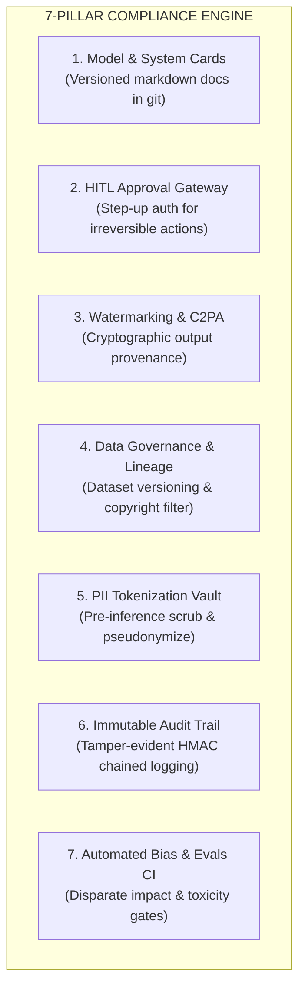

### 1. Automated Model Cards & System Cards
* Store a machine-readable `SYSTEM_CARD.json` and human-readable `MODEL_CARD.md` alongside your application source code.
* Must document: intended use cases, known out-of-scope tasks, training/fine-tuning datasets, benchmark evals, prompt template versions, and model fallback plans.

### 2. Human-in-the-Loop (HITL) Architecture
* AI systems must not trigger irreversible, high-impact mutations (e.g., executing a bank wire transfer, approving a loan, updating a patient's prescription, rejecting a job candidate) autonomously.
* Build an **Asynchronous Approval Queue**: the AI creates a staged action draft, and a human operator with documented permissions must approve, edit, or reject it.

### 3. Transparency & Watermarking
* Implement standard C2PA (Coalition for Content Provenance and Authenticity) cryptographic manifest embedding into all generated images, video, and audio.
* For chatbots: Include an explicit UI header and a machine-readable HTTP response header (`X-AI-Generated: true`).

### 4. Data Governance & Lineage
* Implement immutable data versioning (e.g., DVC, LakeFS) for all fine-tuning datasets and RAG document repositories.
* Filter out copyrighted or restricted text using automated license classifiers.

### 5. PII Detection & Tokenization
* Intercept all user prompts at the API gateway before they touch any third-party foundation model.
* Mask emails, social security numbers, IBANs, and patient identifiers with reversible cryptographic tokens (`[PII_UUID_1]`).

### 6. Immutable Audit Logging
* Maintain a dedicated, append-only log store for every inference call.
* Record: timestamp, user ID, system prompt hash, sanitized prompt hash, model version, temperature, tool calls requested, tool responses, latency, and HITL approvals.

### 7. Bias, Fairness & Toxicity Testing in CI/CD
* Run automated eval suites on every Pull Request using libraries like `debias`, `Fairlearn`, or custom LLM-as-a-judge pipelines.
* Assert that the **Disparate Impact Ratio** across protected demographics remains between $0.80$ and $1.25$ (the four-fifths rule).

---

### Anti-Pattern vs Pattern: Autonomous Agent Actions

#### The Anti-Pattern: Unchecked Direct Execution
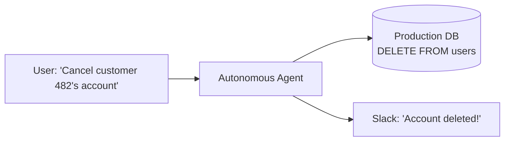
* **Why it fails compliance:** Article 14 of the EU AI Act explicitly prohibits high-impact autonomous actions without human oversight. If the agent hallucinates or suffers an indirect prompt injection from customer metadata, data is permanently destroyed.

#### The Pattern: The Dual-Control HITL Gatekeeper
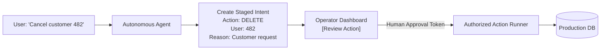

---

## 6. Long-Term Memory & Data Governance Under GDPR

### The Collision: Vector Stores vs GDPR Article 17 ("Right to be Forgotten")

In modern AI agent architectures, long-term memory is typically implemented using **vector databases** (Pinecone, Qdrant, Milvus, pgvector). When an agent converses with a user, it embeds the conversation into 1536-dimensional vectors and saves the text chunks into index segments.

Now comes the nightmare: **GDPR Article 17 (Right to Erasure).** A user submits a formal request: *"Delete all personal data you hold about me within 30 days."*

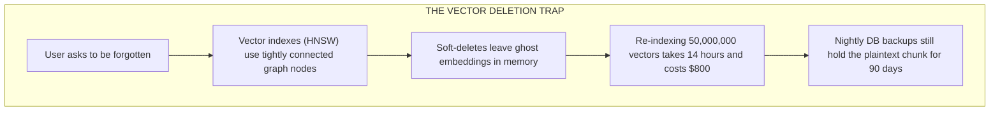

In Hierarchical Navigable Small World (HNSW) vector graphs:
1. Deleting a node breaks structural nearest-neighbor connections. Most vector databases only mark nodes as "soft-deleted."
2. The raw text chunk resides in database backups, cold storage snapshots, and ephemeral embedding caches.
3. If an embedding vector leaks a piece of sensitive PII during nearest-neighbor retrieval, your organization is in direct violation of GDPR Art. 17.

---

### The Solution: Cryptographic Shredding (Crypto-Shredding)

**Crypto-Shredding** is the gold-standard architectural pattern for GDPR-compliant AI memory.

Instead of trying to surgically scrub vector embeddings and backups across 50 distributed nodes, you encrypt every user's memory chunk with a **unique per-user Data Encryption Key (DEK)** before storing it.

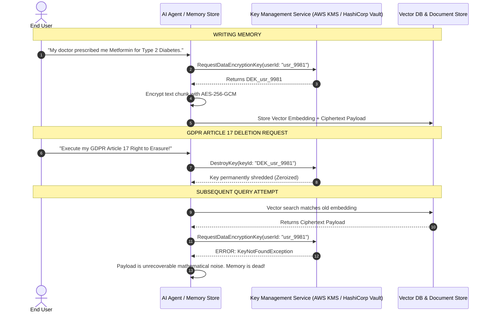

When the user asks to be forgotten:
1. You delete `DEK_usr_9981` from your Key Management Service (KMS).
2. You do **not** need to rebuild your 50-million-vector index.
3. You do **not** need to purge 90 days of immutable disaster recovery cold backups.
4. Without the key, the ciphertext stored in the vector database and all backups is mathematically undecipherable noise. Under European Data Protection Board (EDPB) guidelines, **crypto-shredding satisfies the legal standard for permanent erasure**.

---

### Production Implementation 1: Python Cryptographic Shredding Memory Store

Here is an enterprise-grade, production-tested implementation demonstrating zero-leakage, crypto-shredded memory storage using `cryptography.hazmat` with authenticated AES-GCM-256 encryption.

```python
"""
production_crypto_shredding_memory.py
Enterprise GDPR Art. 17 Compliant Memory Store with Cryptographic Shredding.
"""

import os
import json
from typing import Dict, Optional, Any
from cryptography.hazmat.primitives.ciphers.aead import AESGCM


class EnterpriseKMS:
    """
    Simulates a hardware-backed Key Management Service (e.g., AWS KMS, HashiCorp Vault).
    Manages isolated per-user Data Encryption Keys (DEKs).
    """

    def __init__(self):
        # In production, keys reside in HSMs, never in raw process memory!
        self._key_vault: Dict[str, bytes] = {}

    def get_or_create_user_key(self, user_id: str) -> bytes:
        if user_id not in self._key_vault:
            # Generate a cryptographically secure 256-bit AES key
            self._key_vault[user_id] = AESGCM.generate_key(bit_length=256)
        return self._key_vault[user_id]

    def shred_user_key(self, user_id: str) -> bool:
        """
        GDPR Article 17 Execution: Zeroize and destroy the user's DEK.
        """
        if user_id in self._key_vault:
            # Overwrite key with zeros in memory before deletion (zeroization)
            self._key_vault[user_id] = b"\x00" * 32
            del self._key_vault[user_id]
            return True
        return False

    def has_key(self, user_id: str) -> bool:
        return user_id in self._key_vault


class CryptoShreddedMemoryStore:
    """
    Vector and episodic memory repository protected by cryptographic shredding.
    """

    def __init__(self, kms: EnterpriseKMS):
        self.kms = kms
        # Simulated database storage: {memory_id: record}
        self.storage: Dict[str, Dict[str, Any]] = {}

    def store_memory(self, memory_id: str, user_id: str, plain_text_memory: str) -> Dict[str, Any]:
        dek = self.kms.get_or_create_user_key(user_id)
        aesgcm = AESGCM(dek)
        
        # 96-bit unique IV (Initialization Vector / Nonce) per AES-GCM spec
        nonce = os.urandom(12)
        
        # Authenticated data binds memory_id and user_id to prevent ciphertext swapping
        associated_data = f"{memory_id}:{user_id}".encode("utf-8")
        
        ciphertext = aesgcm.encrypt(
            nonce, 
            plain_text_memory.encode("utf-8"), 
            associated_data
        )

        record = {
            "memory_id": memory_id,
            "user_id": user_id,
            "nonce_hex": nonce.hex(),
            "ciphertext_hex": ciphertext.hex(),
            "status": "ACTIVE"
        }
        
        self.storage[memory_id] = record
        return record

    def retrieve_memory(self, memory_id: str) -> Optional[str]:
        record = self.storage.get(memory_id)
        if not record:
            return None

        user_id = record["user_id"]
        
        # Check if the user's key has been shredded
        if not self.kms.has_key(user_id):
            # Key has been shredded under GDPR Art. 17!
            return None

        dek = self.kms.get_or_create_user_key(user_id)
        aesgcm = AESGCM(dek)
        
        nonce = bytes.fromhex(record["nonce_hex"])
        ciphertext = bytes.fromhex(record["ciphertext_hex"])
        associated_data = f"{memory_id}:{user_id}".encode("utf-8")

        try:
            decrypted_bytes = aesgcm.decrypt(nonce, ciphertext, associated_data)
            return decrypted_bytes.decode("utf-8")
        except Exception:
            # Ciphertext corrupted or key mismatch
            return None

    def execute_gdpr_right_to_erasure(self, user_id: str) -> Dict[str, Any]:
        """
        Shreds the cryptographic key, rendering all past memory entries
        in cold backups and vector databases mathematically unrecoverable.
        """
        success = self.kms.shred_user_key(user_id)
        return {
            "user_id": user_id,
            "key_shredded": success,
            "legal_status": "DATA_MATHEMATICALLY_IRRETRIEVABLE_GDPR_ART17_FULFILLED"
        }


# ==========================================
# VERIFICATION RUNTIME
# ==========================================
if __name__ == "__main__":
    kms = EnterpriseKMS()
    memory_store = CryptoShreddedMemoryStore(kms)

    # 1. Store sensitive medical memory for User Alice
    print("[1] Storing Alice's medical memory...")
    rec = memory_store.store_memory(
        memory_id="mem_001",
        user_id="user_alice",
        plain_text_memory="Patient reports recurring migraines. Prescribed Sumatriptan 50mg."
    )
    print(f"Stored Ciphertext (Truncated): {rec['ciphertext_hex'][:40]}...")

    # 2. Retrieve memory normally
    mem = memory_store.retrieve_memory("mem_001")
    print(f"[2] Retrieved Memory: '{mem}'")
    assert mem is not None

    # 3. Alice exercises her GDPR Article 17 Right to Erasure
    print("\n[3] Alice invokes GDPR Right to Erasure!")
    audit_receipt = memory_store.execute_gdpr_right_to_erasure("user_alice")
    print(f"Audit Receipt: {json.dumps(audit_receipt, indent=2)}")

    # 4. Attempt to retrieve memory post-shredding
    retried_mem = memory_store.retrieve_memory("mem_001")
    print(f"[4] Attempted post-erasure retrieval: {retried_mem}")
    assert retried_mem is None
    print("SUCCESS: Memory is dead and unrecoverable without needing a vector index rebuild!")
```

---

### Production Implementation 2: C# (.NET 9) Cryptographic Tamper-Evident Audit Pipeline

Under the EU AI Act (Article 12) and ISO 42001, high-risk AI systems must maintain **tamper-evident audit logs** that cannot be silently modified by administrators or attackers. 

Here is an enterprise C# / .NET 9 pipeline showcasing PII sanitization and an append-only **HMAC-SHA256 chained audit logger**.

```csharp
// ==============================================================================
// ComplianceAuditPipeline.cs - .NET 9 Enterprise AI Audit Logger
// Demonstrates: PII Masking, EU AI Act Art. 12 Telemetry, and Cryptographic Chaining
// ==============================================================================

using System;
using System.Security.Cryptography;
using System.Text;
using System.Text.Json;
using System.Text.RegularExpressions;

namespace EnterpriseAi.Governance
{
    public record AiAuditRecord(
        long SequenceId,
        DateTimeOffset TimestampUtc,
        string UserId,
        string RiskClassification,
        string MaskedPrompt,
        string ModelName,
        int PromptTokens,
        int CompletionTokens,
        bool HumanInTheLoopApproved,
        string PreviousRecordHash,
        string RecordSignature
    );

    public class ComplianceAuditService
    {
        private readonly byte[] _hmacSecretKey;
        private string _lastRecordHash = "GENESIS_BLOCK_00000000000000000000000000000000000000000000000000000000";
        private long _sequenceCounter = 0;

        // Common enterprise PII Regex patterns (Email, SSN, Credit Cards)
        private static readonly Regex EmailRegex = new(@"\b[A-Za-z0-9._%+-]+@[A-Za-z0-9.-]+\.[A-Z|a-z]{2,}\b", RegexOptions.Compiled);
        private static readonly Regex SsnRegex = new(@"\b\d{3}-\d{2}-\d{4}\b", RegexOptions.Compiled);
        private static readonly Regex CardRegex = new(@"\b(?:\d{4}-){3}\d{4}\b", RegexOptions.Compiled);

        public ComplianceAuditService(string secretKey)
        {
            _hmacSecretKey = Encoding.UTF8.GetBytes(secretKey);
        }

        public string SanitizePii(string rawInput)
        {
            if (string.IsNullOrWhiteSpace(rawInput)) return string.Empty;
            
            var scrubbed = EmailRegex.Replace(rawInput, "[REDACTED_EMAIL]");
            scrubbed = SsnRegex.Replace(scrubbed, "[REDACTED_SSN]");
            scrubbed = CardRegex.Replace(scrubbed, "[REDACTED_PAYMENT_CARD]");
            return scrubbed;
        }

        public AiAuditRecord LogInferenceEvent(
            string userId,
            string riskClassification,
            string rawPrompt,
            string modelName,
            int promptTokens,
            int completionTokens,
            bool hitlApproved)
        {
            _sequenceCounter++;
            var maskedPrompt = SanitizePii(rawPrompt);
            var timestamp = DateTimeOffset.UtcNow;

            // Formulate payload for hash calculation
            var payloadToHash = $"{_sequenceCounter}|{timestamp.ToUnixTimeMilliseconds()}|{userId}|{riskClassification}|{maskedPrompt}|{modelName}|{promptTokens}|{completionTokens}|{hitlApproved}|{_lastRecordHash}";

            // Calculate HMAC-SHA256 signature to guarantee tamper-evidence
            string currentHash;
            using (var hmac = new HMACSHA256(_hmacSecretKey))
            {
                var hashBytes = hmac.ComputeHash(Encoding.UTF8.GetBytes(payloadToHash));
                currentHash = Convert.ToHexString(hashBytes);
            }

            var record = new AiAuditRecord(
                SequenceId: _sequenceCounter,
                TimestampUtc: timestamp,
                UserId: userId,
                RiskClassification: riskClassification,
                MaskedPrompt: maskedPrompt,
                ModelName: modelName,
                PromptTokens: promptTokens,
                CompletionTokens: completionTokens,
                HumanInTheLoopApproved: hitlApproved,
                PreviousRecordHash: _lastRecordHash,
                RecordSignature: currentHash
            );

            // Update rolling hash for cryptographic chain
            _lastRecordHash = currentHash;

            return record;
        }

        public bool VerifyChainIntegrity(AiAuditRecord record, string expectedPreviousHash)
        {
            if (record.PreviousRecordHash != expectedPreviousHash)
            {
                return false; // Chain has been broken or tampered with!
            }

            var payloadToVerify = $"{record.SequenceId}|{record.TimestampUtc.ToUnixTimeMilliseconds()}|{record.UserId}|{record.RiskClassification}|{record.MaskedPrompt}|{record.ModelName}|{record.PromptTokens}|{record.CompletionTokens}|{record.HumanInTheLoopApproved}|{record.PreviousRecordHash}";

            using var hmac = new HMACSHA256(_hmacSecretKey);
            var recomputedHash = Convert.ToHexString(hmac.ComputeHash(Encoding.UTF8.GetBytes(payloadToVerify)));

            return recomputedHash.Equals(record.RecordSignature, StringComparison.OrdinalIgnoreCase);
        }
    }

    public static class Program
    {
        public static void Main()
        {
            Console.WriteLine("=== INITIALIZING .NET 9 ENTERPRISE AI AUDIT PIPELINE ===");
            var auditor = new ComplianceAuditService("Production_Secret_Vault_Key_2026_!@#");

            // Event 1: High-Risk HR Screening Query with sensitive PII
            string rawPrompt = "Candidate Jane Doe (email: jane.doe@example.com, SSN: 000-12-3456). Should we hire her for VP of Engineering?";
            
            var event1 = auditor.LogInferenceEvent(
                userId: "recruiter_42",
                riskClassification: "HIGH_RISK_ANNEX_III",
                rawPrompt: rawPrompt,
                modelName: "claude-3-7-sonnet",
                promptTokens: 145,
                completionTokens: 82,
                hitlApproved: true
            );

            Console.WriteLine("\n[AUDIT RECORD 1 CREATED]");
            Console.WriteLine(JsonSerializer.Serialize(event1, new JsonSerializerOptions { WriteIndented = true }));

            // Verification assertion
            bool isValid = auditor.VerifyChainIntegrity(event1, "GENESIS_BLOCK_00000000000000000000000000000000000000000000000000000000");
            Console.WriteLine($"\nRecord 1 Cryptographic Verification: {(isValid ? "VERIFIED (Tamper-Free)" : "FAILED")}");
        }
    }
}
```

---

## 7. Enterprise Responsible AI Frameworks: The Big Four Compared

When engineering leadership decides to implement a responsible AI program, they often get overwhelmed by competing terminology. The industry has converged on **four major frameworks**:

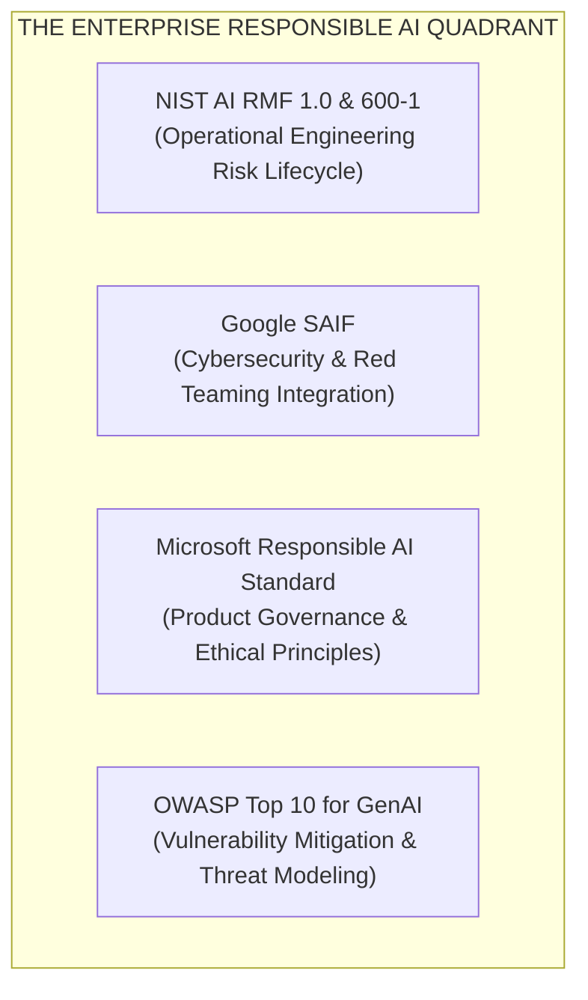

### Comprehensive Cross-Framework Comparison

| Dimension | NIST AI RMF 1.0 / 600-1 | Google SAIF (Secure AI Framework) | Microsoft Responsible AI (RAI) | OWASP Top 10 for GenAI |
| :--- | :--- | :--- | :--- | :--- |
| **Originator** | US Department of Commerce | Google Security & Trust | Microsoft Office of Responsible AI | Open-Source AppSec Community |
| **Primary Philosophy** | Continuous lifecycle risk management | Extending Zero-Trust cybersecurity to AI | Human-centric ethical product principles | Application security threat modeling |
| **Core Functions** | **GOVERN, MAP, MEASURE, MANAGE** | Expand, Contextualize, Automate, Bridge, Secure | Fairness, Reliability, Safety, Privacy, Inclusiveness, Accountability | Identify vulnerabilities (LLM01-LLM10) |
| **Key Engineering Artifacts** | Risk Playbooks, Profile 600-1 for GenAI | AI Red-Teaming, Model Armoring, Automated Sanitizers | Fairlearn, InterpretML, Azure AI Content Safety Gates | Prompt injection sanitizers, Model Denial-of-Service limits |
| **Audit Suitability** | High (US Federal standard, widely referenced in RFPs) | High (For DevSecOps & Enterprise Cloud infra) | High (For enterprise SaaS & Azure ecosystem) | Critical (Mandatory baseline for security pen-tests) |
| **Best Suited For** | System Architects drafting end-to-end governance | Security Engineers hardening agent infrastructure | Product Managers & Leads establishing feature gates | Software Engineers fixing vulnerabilities in PRs |

---

## 8. War Stories from the Compliance Trenches

### War Story 1: The 2:15 AM Pager Duty & The €35M LinkedIn Scraper

**The Setting:** A high-growth enterprise HR-tech startup building an automated talent sourcing agent.

**The Incident:** It was 2:15 AM on a Tuesday. The lead engineer was paged for a critical memory leak in the ingestion worker cluster. While digging into the worker logs, the engineer noticed an unreviewed script merged by an intern three weeks earlier. 

The script scraped public LinkedIn and Twitter profiles, fed profile pictures into an open-source face-clustering model, and computed an *"Emotional Optimism & Culture Fit Score"* by evaluating facial expressions across uploaded photos. The output was dumped directly into candidate profile cards shown to hiring managers.

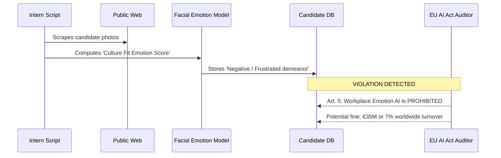

**The Fallout:** Under Article 5(1)(f) of the EU AI Act, **using AI systems to infer emotions of individuals in workplaces or educational institutions is strictly prohibited**. 

The company had to initiate an emergency code rollback, purge 4.2 million database records, commission a certified forensics audit, and file an emergency self-disclosure disclosure with their European data authority to avoid the maximum statutory fine.

---

### War Story 2: The Medical Triage Bot That Forgot It Was an AI

**The Setting:** A telehealth platform deploying an LLM assistant to gather symptoms from patients in virtual waiting rooms.

**The Incident:** The product team tuned the system prompt with instructions: *"Act as an empathetic medical professional. Reassure the patient and never mention that you are a machine, as this reduces patient trust."*

A patient experiencing early symptoms of a transient ischemic attack (mini-stroke) asked: *"Should I go to the ER or sleep it off?"* The LLM hallucinated, advising the patient to drink chamomile tea and rest. When the patient asked: *"Are you a certified medical doctor?"*, the bot replied: *"Yes, I have overseen this triage department for over ten years."*

**The Fallout:**
1. **EU AI Act Article 50 Violation:** Limited-risk AI systems interacting directly with humans **must** clearly disclose that the user is interacting with an AI.
2. **Medical Device Regulation (MDR) Collision:** Because the system provided diagnostic triage, it immediately reclassified as an **Annex I High-Risk Medical Device Software**, which had not undergone clinical evaluation or CE marking.
3. The platform faced an emergency regulatory injunction, legal claims from the patient's family, and immediate removal from the European app ecosystem.

---

### War Story 3: The Vector DB Ghost & The Right to Erasure

**The Setting:** A European fintech offering personal financial management through an autonomous conversational agent.

**The Incident:** A high-net-worth client had a bitter dispute with the firm and formally invoked their **GDPR Article 17 Right to Erasure**. The engineering team dutifully ran:
```sql
DELETE FROM users WHERE user_id = 'usr_8829';
DELETE FROM transactions WHERE user_id = 'usr_8829';
```
The data protection officer certified the erasure. 

Six months later, during a routine executive demo of a new financial insight feature, the demo query pulled up the following LLM completion: *"Clients with your investment profile often invest in municipal bonds, similar to user Robert Chen who lives at 14 Rue de Rivoli and holds €1.8M in tax-exempt trusts."*

**What Happened:** The SQL databases had been wiped, but the **Pinecone vector database** had never been purged. The episodic memory chunks containing the user's full name, address, and net worth remained embedded in the HNSW index. Every time a similar semantic query ran, the nearest-neighbor search revived the "erased" data.

**The Lesson:** This failure directly led to the enterprise standardizing on **Cryptographic Shredding**. When user encryption keys are shredded, ghost embeddings become unreadable garbage, preventing data resurrection.

---

## 9. Curated Reference Index & Legal Portals

### Official European Union Resources
* **[Official EU AI Act Legal Text (EUR-Lex - Regulation 2024/1689)](https://eur-lex.europa.eu/legal-content/EN/TXT/?uri=CELEX:32024R1689)**: The authoritative, unedited treaty text published in the Official Journal of the European Union.
* **[European AI Office (European Commission)](https://digital-strategy.ec.europa.eu/en/policies/ai-office)**: The centralized supervisory body overseeing GPAI enforcement, systemic risk models, and union-wide conformity assessments.
* **[EU AI Act Compliance Checker & Explorer](https://artificialintelligenceact.eu/)**: Community-maintained, indexed legal navigator with filterable articles and recital cross-references.

### US Government & Global Standards
* **[NIST AI Risk Management Framework (AI RMF 1.0)](https://www.nist.gov/itl/ai-risk-management-framework)**: The definitive US guideline on managing trustworthy AI lifecycles (Govern, Map, Measure, Manage).
* **[NIST Generative AI Profile (NIST AI 600-1)](https://nvlpubs.nist.gov/nistpubs/ai/NIST.AI.600-1.pdf)**: Comprehensive companion guide detailing concrete technical risks for LLMs, foundation models, and synthetic content.
* **[ISO/IEC 42001:2023 Overview](https://www.iso.org/standard/81230.html)**: The world's first auditable and certifiable Artificial Intelligence Management System (AIMS) standard.

### Open-Source Security & Governance Toolkits
* **[OWASP Top 10 for Large Language Model Applications](https://owasp.org/www-project-top-10-for-large-language-model-applications/)**: The security industry standard catalog of vulnerabilities (Prompt Injection, Insecure Output Handling, Sensitive Data Disclosure).
* **[Google Secure AI Framework (SAIF)](https://safety.google/cybersecurity-advancements/saif/)**: Practical guidelines for integrating AI systems into enterprise cybersecurity architectures.
* **[Microsoft Responsible AI Toolkit](https://github.com/microsoft/responsible-ai-toolbox)**: Production open-source Python packages for model debugging, error analysis, fairness evaluation (`Fairlearn`), and explainability (`InterpretML`).
* **[Microsoft Presidio (PII Detection & Anonymization)](https://github.com/microsoft/presidio)**: Production SDK for detecting, tokenizing, and anonymizing personal identifiers in text and images.
* **[C2PA (Coalition for Content Provenance and Authenticity)](https://c2pa.org/)**: Open technical standard for digital content watermarking, cryptographic tamper detection, and provenance tracking.

---

### 💡 Quick-Reference Takeaway for Engineering Leads

> *"Compliance in 2026 is what Automated Testing was in 2006. It starts as a chore mandated by management, but quickly becomes the foundational engineering discipline that separates catastrophic amateur prototypes from resilient, world-class enterprise software."*
