# 🚨 The Top 15 Beginner Mistakes in AI Engineering (And How to Avoid Them)

> **The battle-tested field guide for developers transitioning from prototype demos to resilient, cost-controlled, enterprise-grade AI production systems.**

---

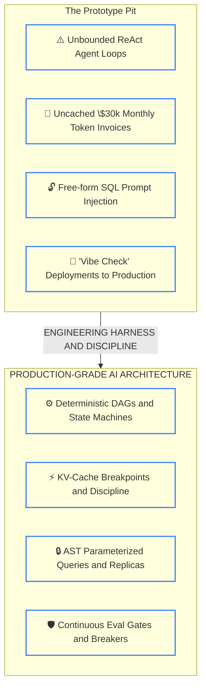

#### Transition Walkthrough
1. **Unbounded Loops → Deterministic State Machines**: Move from open-ended agent loops to bounded state machines with strict turn caps.
2. **Uncached Invoices → KV-Cache Discipline**: Pin static system instructions to prompt prefixes to leverage 90% prompt caching discounts.
3. **Free-Form SQL → AST Validation**: Restrict database tools to read-only replicas and validate abstract syntax trees before execution.
4. **Vibe Checks → Continuous Eval Gates**: Replace subjective reviews with automated binary test assertions and CI/CD quality gates.


---

## 📑 Table of Contents

- [Introduction: The Honeymoon is Over](#introduction-the-honeymoon-is-over)
- [1. Building an Agent When a DAG Works](#1-building-an-agent-when-a-dag-works)
- [2. Not Caching the System Prompt](#2-not-caching-the-system-prompt)
- [3. Dynamic Data at the Top of Prompt (Prefix Taint)](#3-dynamic-data-at-the-top-of-prompt-prefix-taint)
- [4. No Loop Limits (The $500 Runaway at 2 AM)](#4-no-loop-limits-the-500-runaway-at-2-am)
- [5. Free-Form SQL Tools (Prompt Injection to DROP TABLE)](#5-free-form-sql-tools-prompt-injection-to-drop-table)
- [6. Skipping Evals (The "Vibe Check" Trap)](#6-skipping-evals-the-vibe-check-trap)
- [7. Single-Provider API Dependency](#7-single-provider-api-dependency)
- [8. Not Streaming (The 15-Second Blank Screen)](#8-not-streaming-the-15-second-blank-screen)
- [9. Lost-in-the-Middle (The U-Shaped Attention Trap)](#9-lost-in-the-middle-the-u-shaped-attention-trap)
- [10. Fine-Tuning When RAG Works](#10-fine-tuning-when-rag-works)
- [11. No Semantic Caching (Paying for Identical Answers)](#11-no-semantic-caching-paying-for-identical-answers)
- [12. Dumping 100+ Tools on a Single Agent](#12-dumping-100-tools-on-a-single-agent)
- [13. No Context Budgeting (Context Window Overflow)](#13-no-context-budgeting-context-window-overflow)
- [14. Ignoring GDPR for Agent Memory (Crypto-Shredding)](#14-ignoring-gdpr-for-agent-memory-crypto-shredding)
- [15. Treating the LLM as a Reliable Microservice](#15-treating-the-llm-as-a-reliable-microservice)
- [Quick Reference Summary Matrix](#quick-reference-summary-matrix)
- [Production Readiness Audit Checklist](#production-readiness-audit-checklist)

---

## Introduction: The Honeymoon is Over

Here is a universal truth every engineer discovers three weeks into their first AI project:

> **Building a 5-minute prototype in a Jupyter notebook is trivial. Building a 99.9% reliable AI microservice that handles edge cases, security exploits, API rate limits, and runaways costs without bankrupting your startup is brutal software engineering.**

When we first discover LLMs, we treat them like magical genies. We give them autonomous tools, send them 40,000 unbudgeted tokens, skip automated tests because "the vibes look great," and pray that our single API provider never has a bad gateway.

Then production happens.

This cheatsheet catalogs the **Top 15 Beginner Mistakes** that cause production outages, burned venture capital, data leaks, and 2 AM PagerDuty alerts—along with the exact architectural patterns, code fixes, and mental models to avoid them.

---

## 1. Building an Agent When a DAG Works

### 💡 Explain Like I'm 10 (ELI10)
Imagine you want to make a ham and cheese sandwich. 
- **The Agent way**: You hire three independent robots, give them kitchen knives, and tell them: *"Figure it out yourselves, collaborate, and surprise me."* Two hours later, they have debated the socio-economic impact of mustard, set a pan on fire, and charged your credit card $40.
- **The DAG (Directed Acyclic Graph) way**: You use an automated conveyor belt with three fixed stations: Station 1 cuts the bread, Station 2 lays the ham, Station 3 wraps the sandwich. Done in 3 seconds for 2 cents.

### 💀 The 2 AM War Story
> *"Our team was tasked with building an automated invoice extraction system. The lead engineer watched a YouTube tutorial on autonomous ReAct agents and built a multi-agent swarm using LangChain. An orchestrator agent talked to a parser agent, which talked to a validation agent.*
>
> *At 2:15 AM on the first night of processing a batch of 2,000 PDF invoices, an invoice with a slightly blurry watermark caused the validation agent to reject the parser's output. Instead of flagging it for human review, the orchestrator reasoned: 'I must try harder.' It spawned a sub-agent, re-read the PDF with varying temperatures, argued back and forth for 42 turns, and locked up an entire worker thread. By dawn, 400 invoices had blown through $3,400 in API credits and our background queue crashed under memory exhaustion."*

### ❌ The Anti-Pattern
Wrapping an unpredictable, open-ended autonomous loop around a deterministic, sequential business process:

```python
# ANTI-PATTERN: Open-ended ReAct agent for a fixed 3-step pipeline
from langchain.agents import initialize_agent, AgentType

# Giving an autonomous agent full autonomy over a predictable pipeline
agent = initialize_agent(
    tools=[extract_pdf_text, query_database, format_email],
    llm=chat_model,
    agent=AgentType.ZERO_SHOT_REACT_DESCRIPTION,
    max_iterations=50  # Praying it terminates before running out of cash
)
result = agent.run("Extract invoice #9812 and email the summary to finance.")
```

### ✅ The Production Fix: Anthropic's 5 Workflow Patterns
Anthropic's seminal paper *"Building Effective Agents"* demonstrates that 90% of successful "agentic" applications are actually **deterministic workflows**:

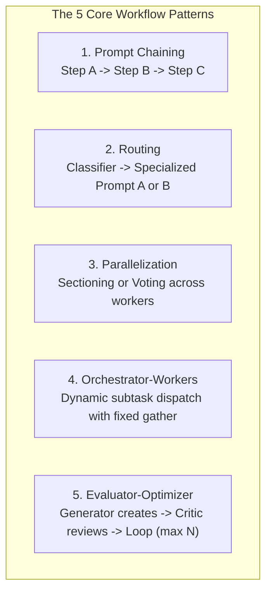

Use a **DAG (Directed Acyclic Graph)** or **Prompt Chain** with explicit state transitions:

```python
# PRODUCTION FIX: Deterministic Prompt Chain / DAG with typed states
from pydantic import BaseModel, Field
from typing import Optional

class InvoiceData(BaseModel):
    invoice_id: str
    total_amount: float
    vendor: str

def process_invoice_pipeline(pdf_bytes: bytes) -> InvoiceData:
    # Step 1: Deterministic OCR / Extraction (Fast & Structured)
    raw_text = extract_text_from_pdf(pdf_bytes)
    
    # Step 2: Constrained LLM Extraction with Strict Pydantic Schema
    extracted = llm.with_structured_output(InvoiceData).invoke(
        f"Extract key invoice fields from:\n{raw_text}"
    )
    
    # Step 3: Pure Deterministic Python Validation (NO LLM here!)
    if extracted.total_amount <= 0:
        raise ValueError(f"Invalid invoice total: {extracted.total_amount}")
        
    return extracted
```

#### C# / .NET Enterprise Implementation
```csharp
// PRODUCTION FIX: Strongly-typed Pipeline in C# (.NET 9)
public async Task<InvoiceData> ProcessInvoiceAsync(byte[] pdfBytes, CancellationToken ct)
{
    string rawText = await _pdfExtractor.ExtractTextAsync(pdfBytes, ct);
    
    // Explicit, deterministic step execution without unbounded agent loops
    var options = new ChatOptions { ResponseFormat = ChatResponseFormat.Json };
    var prompt = $"Extract invoice JSON: {rawText}";
    
    var response = await _chatClient.CompleteAsync(prompt, options, ct);
    var data = JsonSerializer.Deserialize<InvoiceData>(response.Message.Text);
    
    if (data.TotalAmount <= 0) 
        throw new InvalidOperationException("Negative or zero amount detected.");
        
    return data;
}
```

### 📌 One-Liner Takeaway
> **If you can draw your business problem as a flowchart with boxes and arrows, you need a deterministic DAG, not an autonomous agent.**

---

## 2. Not Caching the System Prompt

### 💡 Explain Like I'm 10 (ELI10)
Imagine you visit the same coffee shop every morning. Before the barista lets you order your $4 latte, you force them to read the entire 500-page *Encyclopedia of World Beans* out loud, and you pay them $10 every single time for reading it. 

Prompt caching lets the barista say: *"I already read that book 5 minutes ago. What's your order?"*

### 💀 The 2 AM War Story
> *"Our enterprise RAG bot served 15,000 queries a day for an insurance firm. To enforce strict compliance, our system prompt included our 60-page regulatory handbook—totaling 35,000 tokens of static instructions.
>
> At the end of month one, the AWS Bedrock bill arrived: **$31,500**.
>
> We looked at our Anthropic token analytics: 98% of our bill was paying full price to prefill that identical 35,000-token system prompt 15,000 times a day. We spent 20 minutes adding two cache breakpoint headers (`cache_control: {"type": "ephemeral"}`). The next month's bill was **$3,600**. We literally set $27,900 on fire because we didn't enable prompt caching."*

### ❌ The Anti-Pattern
Sending giant system prompts repeatedly without cache headers:

```python
# ANTI-PATTERN: Paying 100% price on 35k tokens for every single request
import anthropic

client = anthropic.Anthropic()

response = client.messages.create(
    model="claude-3-7-sonnet-20241022",
    max_tokens=1000,
    system=HEAVY_35K_REGULATORY_PROMPT,  # Paid at FULL price ($3.00 / 1M) every call!
    messages=[{"role": "user", "content": "What is our deductible?"}]
)
```

### ✅ The Production Fix: Explicit Cache Breakpoints
Modern LLM providers offer massive prompt caching discounts when your static context exceeds minimum thresholds (1,024 tokens for Anthropic, 1,024 for OpenAI, 32,768 for Gemini):

| Provider | Prompt Cache Discount | Latency Reduction (TTFT) | Cache Eviction Window |
|---|---|---|---|
| **Anthropic Claude** | **90% discount** ($0.30 vs $3.00/1M) | Up to **85% faster** | 5 minutes (refreshes on hit) |
| **Google Gemini** | **75% discount** on cached tokens | Up to **80% faster** | User-defined TTL (minutes/hours) |
| **OpenAI GPT-4.5 / o3** | **50% discount** (Automatic prefix) | Up to **50% faster** | Automatic (5-10 minutes) |

```python
# PRODUCTION FIX: Tagging static context with Anthropic's ephemeral cache breakpoint
import anthropic

client = anthropic.Anthropic()

response = client.messages.create(
    model="claude-3-7-sonnet-20241022",
    max_tokens=1024,
    system=[
        {
            "type": "text",
            "text": HEAVY_35K_REGULATORY_PROMPT,
            # Explicit cache breakpoint: 90% cost savings on subsequent calls
            "cache_control": {"type": "ephemeral"}
        }
    ],
    messages=[
        {"role": "user", "content": "What is our deductible?"}
    ]
)

print(f"Tokens written to cache: {response.usage.cache_creation_input_tokens}")
print(f"Tokens read from cache: {response.usage.cache_read_input_tokens}")  # 90% DISCOUNT!
```

### 📌 One-Liner Takeaway
> **Paying full prefill price for static system instructions is a volunteer tax on developers who don't read API release notes.**

---

## 3. Dynamic Data at the Top of Prompt (Prefix Taint)

### 💡 Explain Like I'm 10 (ELI10)
Imagine you have a giant 500-page book with a golden bookmark at page 450. But before you read it, someone scribbles today's exact second-by-second timestamp on **Page 1**. Because Page 1 changed, the whole book has to be re-printed and re-bound from scratch. Your bookmark is completely destroyed.

### 💀 The 2 AM War Story
> *"A developer proudly added prompt caching to our main chatbot. But our telemetry dashboard showed a baffling **0.0% cache hit rate**. Our bill was identical.
>
> We inspected the raw payloads. On line 1 of the prompt template, someone had written:
> `f"Current timestamp: {datetime.utcnow().isoformat()} | User Session ID: {uuid.uuid4()}"`
>
> Because the timestamp and UUID were at index 0, every single request changed the very first 30 tokens of the prompt. Modern LLM KV-caches match from left to right. That tiny timestamp tainted the prefix and wiped out the cache for the entire 20,000 tokens of static guidance that followed."*

### ❌ The Anti-Pattern: Prefix Taint

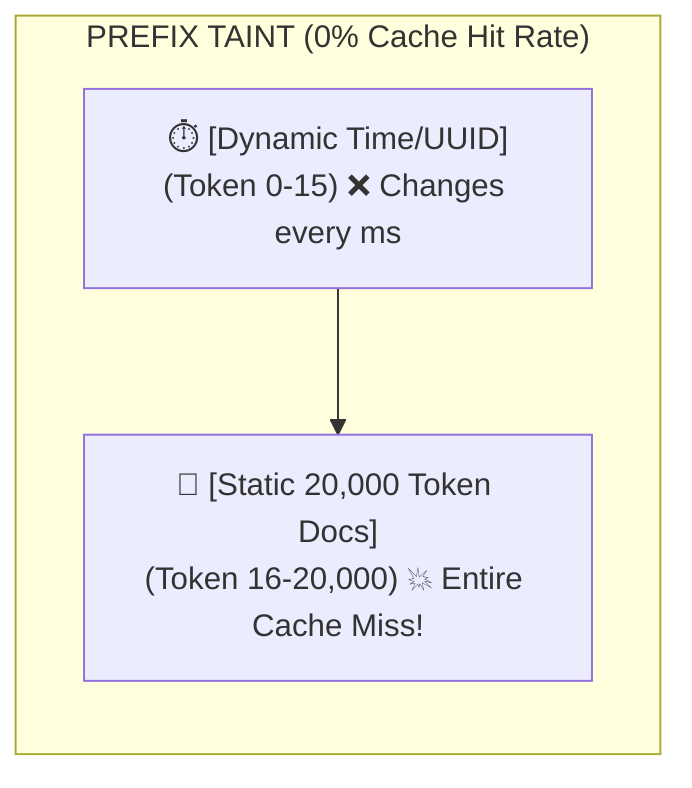

```python
# ANTI-PATTERN: Dynamic data at prefix ruins KV cache for the entire prompt
prompt = f"""
Today's Date: {datetime.datetime.now()}  # <-- TAINTED PREFIX! Changes every millisecond!
Session ID: {request.session_id}         # <-- TAINTED PREFIX! Unique per user!

{MASSIVE_STATIC_COMPANY_POLICIES}        # <-- 25,000 tokens NEVER cached!
"""
```

### ✅ The Production Fix: "Static Prefix First, Dynamic Suffix Last"
Always structure prompts into two immutable zones:
1. **The Static Prefix (Frozen)**: System identity, behavior rules, static few-shot examples, tool schemas.
2. **The Dynamic Suffix (Volatile)**: Current date, user query, retrieved RAG context, session variables.

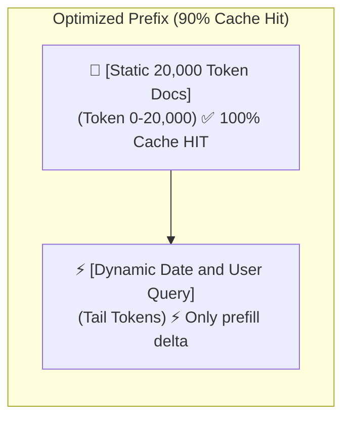

```python
# PRODUCTION FIX: Static system prompt is pristine; dynamic data placed in trailing messages
system_prompt = [
    {
        "type": "text",
        "text": MASSIVE_STATIC_COMPANY_POLICIES,  # Clean prefix, 100% cacheable!
        "cache_control": {"type": "ephemeral"}
    }
]

# Dynamic runtime variables injected strictly at the end
user_message = f"""
[Context Metadata]
Current Timestamp: {datetime.datetime.now(datetime.timezone.utc).strftime('%Y-%m-%d')}
User Session: {request.session_id}

[User Question]
{request.user_query}
"""
```

### 📌 One-Liner Takeaway
> **Put one volatile variable at the top of your prompt, and you've set your KV-cache on fire.**

---

## 4. No Loop Limits (The $500 Runaway at 2 AM)

### 💡 Explain Like I'm 10 (ELI10)
Imagine you tell a vacuum cleaning robot: *"Keep vacuuming until you find my lost earring."* You leave for a week. The earring was never in the house. The robot runs continuously, overheats, burns a hole in your carpet, and runs up a $500 electricity bill.

### 💀 The 2 AM War Story
> *"At 2:48 AM on a Sunday, our autonomous data cleaning agent picked up a corrupted CSV file where a date column had the value `'N/A'`. The agent's prompt was: `'Parse all dates. If a date fails, reflect on the error, adjust your regex tool, and retry until clean.'`
>
> The LLM tried regex 1, failed. Reflected. Tried regex 2, failed. Reflected. It ran in a tight `while not completed:` loop with no maximum turn counter. Over 5 hours, it executed **6,420 sequential LLM calls**, accumulating 14 million tokens.
>
> Our on-call engineer woke up to an emergency billing alert from OpenAI: **$485 spent on a single 10-line CSV file**. The agent was still running when we killed the pod."*

### ❌ The Anti-Pattern: Unbounded While Loops & Compounding Errors
Beginners assume agents will eventually succeed. But probability works against you!
If an LLM has a **95% success rate** at each individual step (`p = 0.95`):
- After 3 steps: `0.95^3 ≈ 85.7%`
- After 10 steps: `0.95^10 ≈ 59.9%`
- After 20 steps: `0.95^20 ≈ 35.8%`

By step 15, your agent is almost guaranteed to be hallucinating in circles.

```python
# ANTI-PATTERN: The infinite runaway loop
while not task_finished:
    # No max iterations, no timeout, no token ceiling
    response = agent.step()
    if "TASK COMPLETE" in response:
        task_finished = True
```

### ✅ The Production Fix: The 4-Tier Execution Governor
Every agentic loop MUST enforce **four independent hard boundaries**:
1. `max_steps` (Absolute iteration ceiling, e.g., max 5 turns)
2. `max_tokens` (Cumulative token governor)
3. `max_time_seconds` (Wall-clock timeout)
4. `max_consecutive_failures` (Circuit breaker on tool errors)

```python
# PRODUCTION FIX: Production Agent Governor in Python
import time
from dataclasses import dataclass

@dataclass
class GovernorLimits:
    max_steps: int = 5
    max_cost_usd: float = 0.50
    timeout_seconds: float = 30.0

class AgentLoopGovernor:
    def __init__(self, limits: GovernorLimits):
        self.limits = limits
        self.start_time = time.time()
        self.current_step = 0
        self.total_cost = 0.0

    def check_can_proceed(self, estimated_step_cost: float = 0.02):
        self.current_step += 1
        elapsed = time.time() - self.start_time
        self.total_cost += estimated_step_cost

        if self.current_step > self.limits.max_steps:
            raise RuntimeError(f"🚨 GOVERNOR TRIP: Max steps ({self.limits.max_steps}) exceeded!")
        if elapsed > self.limits.timeout_seconds:
            raise TimeoutError(f"🚨 GOVERNOR TRIP: Wall-clock timeout ({self.limits.timeout_seconds}s) breached!")
        if self.total_cost > self.limits.max_cost_usd:
            raise RuntimeError(f"🚨 GOVERNOR TRIP: Cost ceiling (${self.limits.max_cost_usd}) reached!")

# Usage inside any agent loop:
governor = AgentLoopGovernor(GovernorLimits(max_steps=5, max_cost_usd=0.25))

while agent.is_active():
    governor.check_can_proceed()
    agent.execute_next_turn()
```

### 📌 One-Liner Takeaway
> **Never write `while True` around an LLM unless your bank account has an infinite balance.**

---

## 5. Free-Form SQL Tools (Prompt Injection to DROP TABLE)

### 💡 Explain Like I'm 10 (ELI10)
Imagine you run a bank. Instead of letting tellers do standard transactions, you give every customer who walks in the front door a master crowbar, access to the vault computer, and say: *"Just type whatever database query you feel like into the screen."*

### 💀 The 2 AM War Story
> *"A B2B SaaS startup built a 'Talk to your Data' feature for their enterprise CRM. They gave the LLM an `execute_sql(query: str)` tool connected to a PostgreSQL database with standard read-write credentials.
>
> A customer invited a third-party contractor into their workspace. In the company name field of a contact record, the contractor entered:
> `Acme Corp'; DROP TABLE accounts CASCADE; --`
>
> When the company CEO asked the AI: 'Show me all new contacts added this week', the LLM retrieved the poisoned contact name via RAG, ingested the indirect prompt injection, and constructed the query:
> `SELECT * FROM contacts WHERE name = 'Acme Corp'; DROP TABLE accounts CASCADE; --';`
>
> The read-write connection happily executed both statements. The primary `accounts` table evaporated in 4 milliseconds. Staging was down for 18 hours while the DBAs scrambled to restore from point-in-time backups."*

### ❌ The Anti-Pattern: Unsanitized SQL Tool
```python
# ANTI-PATTERN: Allowing the LLM to generate arbitrary raw SQL strings
@tool
def execute_sql(query: str) -> str:
    """Executes arbitrary SQL on the production database."""
    # CRITICAL SECURITY VULNERABILITY: Raw execution with write permissions
    with db_engine.connect() as conn:
        result = conn.execute(text(query))  # Can execute DROP, ALTER, UPDATE, DELETE!
        return str(result.fetchall())
```

### ✅ The Production Fix: The Defense-in-Depth SQL Harness

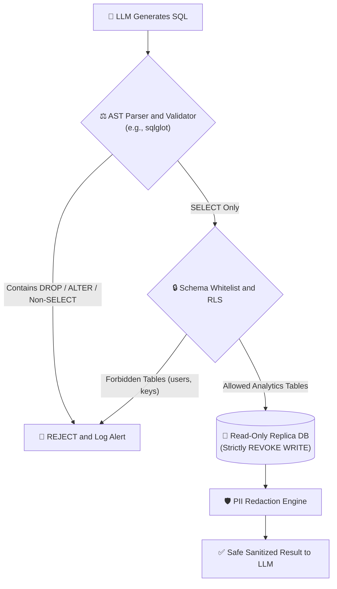

#### Production Defense Requirements:
1. **Physical Read-Only Replica**: The database user MUST only have `GRANT SELECT` on specific tables. No DDL, no DML.
2. **AST (Abstract Syntax Tree) Query Validation**: Reject multi-statement queries, subquery injections, and system table queries.
3. **Prepared Statements / Parameterized Views**: Prefer calling predefined stored procedures (e.g. `get_quarterly_revenue(year=2026)`) over arbitrary text SQL.

```python
# PRODUCTION FIX: Strict AST Validation with sqlglot + Read-Only Enforcement
import sqlglot
from sqlglot import exp

FORBIDDEN_TABLES = {"users", "api_keys", "credit_cards", "passwords"}

def validate_and_execute_safe_sql(raw_query: str, read_only_session) -> list:
    try:
        # Parse query into Abstract Syntax Tree
        parsed = sqlglot.parse_one(raw_query, read="postgres")
    except Exception as e:
        raise ValueError(f"Invalid SQL syntax: {e}")

    # Enforce: MUST BE A SINGLE SELECT STATEMENT
    if not isinstance(parsed, exp.Select):
        raise PermissionError("🚨 SECURITY ALERT: Only pure SELECT queries are permitted!")

    # Check for forbidden tables in AST
    tables_referenced = {table.name.lower() for table in parsed.find_all(exp.Table)}
    prohibited = tables_referenced.intersection(FORBIDDEN_TABLES)
    if prohibited:
        raise PermissionError(f"🚨 ACCESS DENIED: Access to table(s) {prohibited} is forbidden!")

    # Execute strictly on read-only transaction with query timeout
    result = read_only_session.execute(
        raw_query,
        execution_options={"timeout": 5.0}  # Prevent denial-of-service queries
    )
    return result.fetchall()
```

### 📌 One-Liner Takeaway
> **If your LLM can execute `DROP TABLE`, you haven't built an AI assistant; you've built an unauthenticated remote code execution backdoor.**

---

## 6. Skipping Evals (The "Vibe Check" Trap)

### 💡 Explain Like I'm 10 (ELI10)
Imagine you are building a bridge for cars. To test if the bridge is safe, the builder drives their bicycle across it once, smiles, says *"Feels sturdy to me!"*, and immediately opens it to 80,000 eighteen-wheeler trucks.

### 💀 The 2 AM War Story
> *"A developer was tasked with reducing costs by switching our customer service prompt from GPT-4.5 / o3 to a cheaper model. They tested 4 friendly questions in the OpenAI Playground. The responses looked concise and polite. 'The vibe is immaculate,' they posted in Slack, and merged the PR directly to main on a Thursday afternoon.
>
> On Friday morning, 400 customer support tickets went unanswered. 
>
> It turned out that when customers expressed anger or used Spanish, the new model omitted the required `ticket_category` JSON field. Our downstream microservices encountered null reference exceptions and silently dropped the messages. We had zero unit tests, zero assertion gates, and zero CI/CD evals. We tested a mission-critical enterprise product with a 4-query vibe check."*

### ❌ The Anti-Pattern: The Playground "Vibe Check"
- Testing 3-5 cherry-picked queries in a web UI.
- No historical benchmark dataset.
- Merging prompt edits without regression testing.

### ✅ The Production Fix: The 3-Tier Eval Pyramid

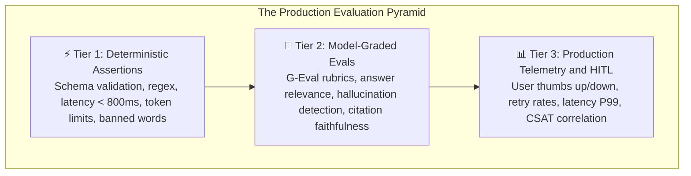

```python
# PRODUCTION FIX: Automated CI/CD Regression Eval Suite with pytest
import pytest
from pydantic import BaseModel, ValidationError

GOLDEN_DATASET = [
    {
        "input": "Where is my order #12345?",
        "expected_intent": "order_status",
        "must_contain": ["12345"]
    },
    {
        "input": "I hate this product and want my money back immediately!",
        "expected_intent": "refund_request",
        "must_contain": ["refund", "policy"]
    }
]

@pytest.mark.parametrize("test_case", GOLDEN_DATASET)
def test_prompt_regression(test_case):
    response = call_production_llm(test_case["input"])
    
    # Tier 1: Deterministic Structural Assertions
    assert response.status_code == 200
    assert response.latency_ms < 1500, "Latency SLA violated!"
    
    # Tier 2: Exact Semantic Assertions
    parsed = response.json()
    assert parsed.get("intent") == test_case["expected_intent"]
    
    for token in test_case["must_contain"]:
        assert token.lower() in parsed.get("reply").lower(), f"Missing required term: {token}"
```

### 📌 One-Liner Takeaway
> **If you don't have an automated evaluation suite running in CI/CD, your paying users are your QA team.**

---

## 7. Single-Provider API Dependency

### 💡 Explain Like I'm 10 (ELI10)
Imagine you run a busy pizza delivery shop, and you only have one single delivery driver. When that driver gets a flat tire or catches the flu, your entire business shuts down, customers starve, and your shop goes bankrupt.

### 💀 The 2 AM War Story
> *"On Cyber Monday, our primary LLM provider suffered a catastrophic global outage: 503 Service Unavailable for 87 consecutive minutes. 
>
> Our checkout assistant, which generated personalized discount bundles for holiday shoppers, completely cratered. Because the OpenAI client was hardcoded into our core checkout controller with a 30-second blocking timeout, web requests piled up, our thread pools were exhausted, and our entire website crashed.
>
> We lost an estimated **$180,000 in sales** in under two hours. Our competitor's gateway automatically rerouted failed traffic to Claude 3.5 Haiku in 200 milliseconds and had a record-breaking sales day."*

### ❌ The Anti-Pattern: Hardcoded Single Vendor
```python
# ANTI-PATTERN: Single point of failure hardcoded throughout the codebase
from openai import OpenAI

client = OpenAI()

def answer_user(prompt: str):
    # If OpenAI has a 503, an outage, or rate limit, your entire business dies
    return client.chat.completions.create(
        model="gpt-4.5",
        messages=[{"role": "user", "content": prompt}]
    )
```

### ✅ The Production Fix: Multi-Provider Fallback Gateway
Use an abstracted gateway router (or tools like LiteLLM / Portkey) with automatic failover, circuit breaking, and standardized schema translation:

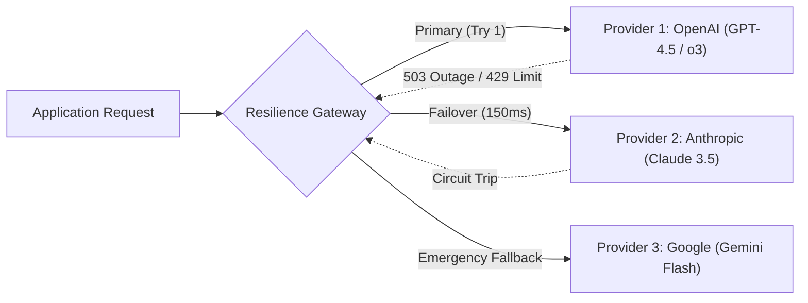

```python
# PRODUCTION FIX: Resilient Multi-Provider Fallback Router in Python
import logging
from typing import List, Dict

logger = logging.getLogger("LLMRouter")

PROVIDERS = [
    {"name": "Anthropic", "model": "claude-3-7-sonnet-20241022", "client": anthropic_client},
    {"name": "OpenAI", "model": "gpt-4.5", "client": openai_client},
    {"name": "Google", "model": "gemini-2.5-flash", "client": gemini_client}
]

async def resilient_complete(messages: List[Dict[str, str]]) -> str:
    last_error = None
    for provider in PROVIDERS:
        try:
            logger.info(f"Attempting inference via {provider['name']}...")
            return await provider["client"].complete_async(
                model=provider["model"],
                messages=messages,
                timeout=5.0
            )
        except Exception as ex:
            logger.warning(f"Provider {provider['name']} failed with error: {ex}. Falling back...")
            last_error = ex
            continue

    logger.critical("All AI providers exhausted! Tripping global circuit breaker.")
    raise RuntimeError(f"All providers failed. Last exception: {last_error}")
```

### 📌 One-Liner Takeaway
> **In production, a single LLM provider is a single point of failure; multi-provider redundancy is not paranoia, it's basic architecture.**

---

## 8. Not Streaming (The 15-Second Blank Screen)

### 💡 Explain Like I'm 10 (ELI10)
Imagine you sit down at a restaurant. Instead of bringing you water and bread while you wait, the waiter makes you sit in dead silence staring at an empty table for 45 minutes until the entire 5-course feast is ready all at once. You assume they forgot your order and walk out.

### 💀 The 2 AM War Story
> *"We built an AI contract comparison tool for attorneys. It analyzed 50-page NDAs and generated comprehensive 600-word legal comparisons.
>
> We used standard blocking HTTP requests (`await client.chat(...)`). Generating 600 tokens on a dense model took **14.2 seconds**.
>
> During user testing, attorneys stared at a static grey spinner. After 4 seconds, they assumed the browser had frozen. They furiously clicked 'Analyze' 5 more times, spawned 5 duplicate concurrent LLM jobs, overloaded our backend server, and flooded our feedback channel with: *'Broken software, doesn't work.'*
>
> When we converted the endpoint to Server-Sent Events (SSE) streaming, the **Time-To-First-Token (TTFT) dropped to 380 milliseconds**. The exact same 14-second generation felt instantaneous because words appeared immediately."*

### ❌ The Anti-Pattern: Blocking Monolithic Responses
```python
# ANTI-PATTERN: Waiting 15 seconds for the entire completion before returning anything
@app.post("/analyze")
async def analyze_document(request: DocRequest):
    # Customer stares at a spinning circle for 15 seconds!
    response = await openai_client.chat.completions.create(
        model="gpt-4.5",
        messages=[{"role": "user", "content": request.text}]
    )
    return {"analysis": response.choices[0].message.content}
```

### ✅ The Production Fix: Server-Sent Events (SSE) Streaming
Stream tokens to the client over HTTP SSE or WebSockets as they are emitted from the GPU memory bus:

```python
# PRODUCTION FIX: FastAPI Streaming Endpoint using Server-Sent Events (SSE)
from fastapi import FastAPI
from fastapi.responses import StreamingResponse
import openai

app = FastAPI()
client = openai.AsyncOpenAI()

async def token_generator(prompt: str):
    stream = await client.chat.completions.create(
        model="gpt-4.5",
        messages=[{"role": "user", "content": prompt}],
        stream=True  # Enable token streaming from provider
    )
    async for chunk in stream:
        token = chunk.choices[0].delta.content or ""
        if token:
            # Format as standard Server-Sent Event data packet
            yield f"data: {token}\n\n"

@app.post("/analyze-stream")
async def analyze_stream(request: DocRequest):
    return StreamingResponse(
        token_generator(request.text),
        media_type="text/event-stream"
    )
```

#### C# / ASP.NET Core Implementation
```csharp
// PRODUCTION FIX: C# ASP.NET Core IAsyncEnumerable streaming
[HttpPost("stream-analysis")]
public async IAsyncEnumerable<string> StreamAnalysisAsync(
    [FromBody] DocRequest request, 
    [EnumeratorCancellation] CancellationToken ct)
{
    var stream = _chatClient.CompleteStreamingAsync(request.Text, cancellationToken: ct);
    
    await foreach (var update in stream)
    {
        if (!string.IsNullOrEmpty(update.Text))
        {
            yield return update.Text; // Pushes token chunks directly to client HTTP stream
        }
    }
}
```

### 📌 One-Liner Takeaway
> **Perceived latency is the only latency humans care about; stream your tokens or watch your users smash the refresh button.**

---

## 9. Lost-in-the-Middle (The U-Shaped Attention Trap)

### 💡 Explain Like I'm 10 (ELI10)
Imagine you read a massive 1,000-page mystery novel in one night. You remember the thrilling first chapter clearly. You remember the twist ending clearly. But everything between pages 300 and 700 is a fuzzy, forgotten blur in your mind.

### 💀 The 2 AM War Story
> *"Our financial research bot was supposed to answer: 'What was the specific indemnity liability cap mentioned in Section 14.3 of the merger agreement?'.
>
> We had a huge 128k context window model, so we retrieved 35 chunks from our vector store and dumped them all into the prompt context. The LLM replied: *'The provided documents do not mention an indemnity liability cap.'*
>
> We looked at our prompt: chunk #19, right at token 45,000 in the dead center of the prompt, contained the exact sentence: *'Indemnity liability is capped strictly at $5,000,000.'* The LLM was blind to it. Because it was buried in the middle of 35 noisy chunks, the Transformer's self-attention mechanism suffered severe U-shaped attention degradation and missed the fact completely."*

### ❌ The Anti-Pattern: Context Dumping & The U-Shaped Attention Curve
Research by Liu et al. (*"Lost in the Middle: How Language Models Use Long Contexts"*) proved that LLMs recall information at the **very beginning** (Primacy) and **very end** (Recency) of context with high accuracy, but accuracy plummets by **20% to 40%** in the middle 60%:

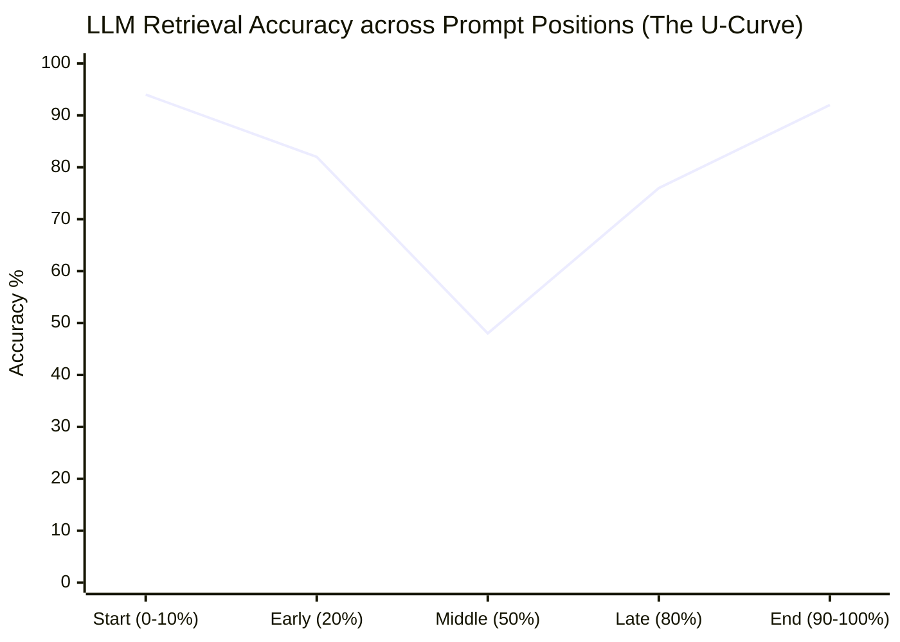

### ✅ The Production Fix: Reranking & The "Sandwich" Strategy
1. **Never dump 30+ chunks into prompt context**. Use a Cross-Encoder Reranker (Cohere Rerank, BGE-Reranker) to compress down to the top 3-5 high-density chunks.
2. **Apply the Sandwich Strategy**: Place the highest-relevance chunk at the **very bottom** (closest to the user query) and the second highest at the **very top** (under the system instruction).

```python
# PRODUCTION FIX: Sandwich Context Placement Strategy
from typing import List

def sandwich_context_placement(ranked_chunks: List[str]) -> str:
    """
    Arranges chunks to combat U-shaped attention loss:
    - Chunk #0 (Highest score) -> Placed at the END (closest to query)
    - Chunk #1 (Second score)  -> Placed at the BEGINNING
    - Lower scores             -> Sandwiched in between
    """
    if len(ranked_chunks) <= 2:
        return "\n\n".join(ranked_chunks)

    best_chunk = ranked_chunks[0]
    second_best = ranked_chunks[1]
    middle_chunks = ranked_chunks[2:]

    reordered = [second_best] + middle_chunks + [best_chunk]
    
    formatted = []
    for idx, chunk in enumerate(reordered, 1):
        formatted.append(f"--- Reference Document [{idx}] ---\n{chunk}")
        
    return "\n\n".join(formatted)
```

### 📌 One-Liner Takeaway
> **Stashing your most critical document in the middle of a massive context window is the fastest way to make an LLM blind.**

---

## 10. Fine-Tuning When RAG Works

### 💡 Explain Like I'm 10 (ELI10)
Imagine you want your student to know today's weather forecast.
- **The Fine-Tuning way**: You perform neurosurgery on the student's brain to burn today's weather into their permanent neurons. Tomorrow, when the weather changes, you have to do brain surgery all over again.
- **The RAG way**: You simply hand the student today's morning newspaper and say: *"Read the weather section."*

### 💀 The 2 AM War Story
> *"A B2B SaaS startup spent **$45,000 on GPU cluster rentals** and 3 months of senior engineering time fine-tuning Llama-3-70B on their internal customer support documentation and pricing tables.
>
> The day after the fine-tuned model was deployed to production, the sales department updated the enterprise pricing tier from $99/mo to $149/mo.
>
> The fine-tuned model immediately hallucinated outdated $99 pricing to prospective enterprise leads with absolute, unwavering confidence. Because the knowledge was baked into the static weights, updating it required an entire re-training run, dataset curation, and regression testing.
>
> Two weeks later, they replaced the entire fine-tuned model with a vanilla Claude 3.7 Sonnet connected to a $25/month pgvector RAG database. It took 3 days to build, answered questions with live source citations, and updated instantly whenever docs changed in Notion."*

### ❌ The Anti-Pattern: Fine-Tuning for Factual Knowledge Retrieval
| Dimension | Fine-Tuning (Parametric Memory) | RAG (Non-Parametric Context Retrieval) |
|---|---|---|
| **Primary Purpose** | Learning **style, tone, syntax, domain vocabulary, or formatting** | Ingesting **facts, live documents, dynamic data, and policies** |
| **Update Frequency** | Slow & Expensive (Requires dataset prep & GPU training) | Instant (Insert/update row in vector database) |
| **Citations & Verifiability** | ❌ None (Black-box weight activations) | ✅ Exact source document citations & line numbers |
| **Data Access Control (RBAC)** | ❌ Impossible (All users see all trained knowledge) | ✅ Document-level metadata filtering per user role |
| **Cost to Maintain** | 💸 High ($1,000s in compute per model update) | 💰 Low ($10s - $100s for vector DB storage) |

### ✅ The Production Fix: The Architectural Rule of Thumb
- Use **RAG** for 95% of enterprise knowledge retrieval.
- Use **Fine-Tuning** ONLY when you need to teach a small open-source model (e.g. 8B parameters) to output an esoteric internal JSON dialect, speak in a specialized medical syntax, or emulate a highly specific brand voice.

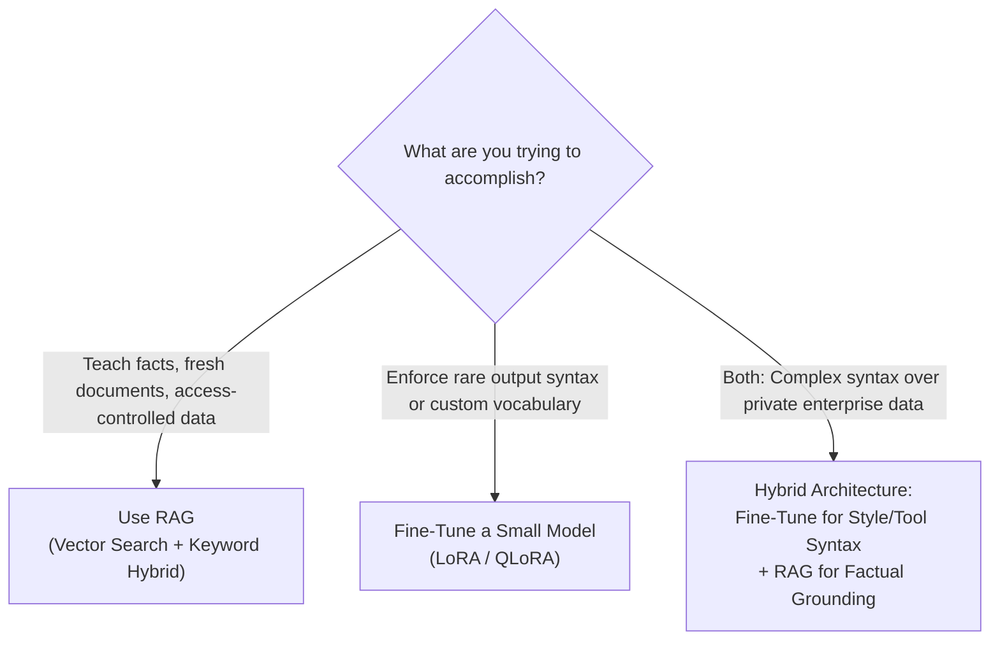

### 📌 One-Liner Takeaway
> **Fine-tuning is for teaching a model a new skill or tone; RAG is for giving it facts.**

---

## 11. No Semantic Caching (Paying for Identical Answers)

### 💡 Explain Like I'm 10 (ELI10)
Imagine you run a front desk. Every day, 200 tourists ask: *"Where is the Eiffel Tower?"* Instead of answering from memory or pointing to the map on your desk, you call a luxury tour guide in France on an expensive international satellite phone every single time.

### 💀 The 2 AM War Story
> *"Our customer support bot handled 60,000 queries per day. When we analyzed user query logs, we discovered that **32% of all inbound traffic** was identical variations of the same 10 questions:
> - 'How do I reset my password?'
> - 'Forgot password, need help'
> - 'Where to change my login password?'
>
> Because human users phrase things with different words and typos, traditional exact-match caching (`hash(user_query)`) had a miserable 1.8% hit rate. We were spending **$8,200 every month** asking GPT-4 to regenerate the exact same password-reset instructions over and over with 3 seconds of latency."*

### ❌ The Anti-Pattern: Exact-String Match Caching
```python
# ANTI-PATTERN: Exact string hashing fails on natural language variation
cache = {}

def get_answer(query: str):
    # Fails if user adds a typo, a comma, or says "Hey bot"
    query_hash = hashlib.sha256(query.strip().lower().encode()).hexdigest()
    if query_hash in cache:
        return cache[query_hash]
    
    answer = call_expensive_llm(query)
    cache[query_hash] = answer
    return answer
```

### ✅ The Production Fix: Semantic Vector Caching
1. Convert user query into an embedding vector using a cheap, ultra-fast embedding model (`text-embedding-3-small` or local ONNX MiniLM).
2. Query an in-memory vector cache (Redis VSS or Qdrant) using Cosine Similarity.
3. If similarity exceeds a strict threshold (e.g., **≥ 0.94**), return the cached answer in **12 milliseconds** at zero LLM generation cost!

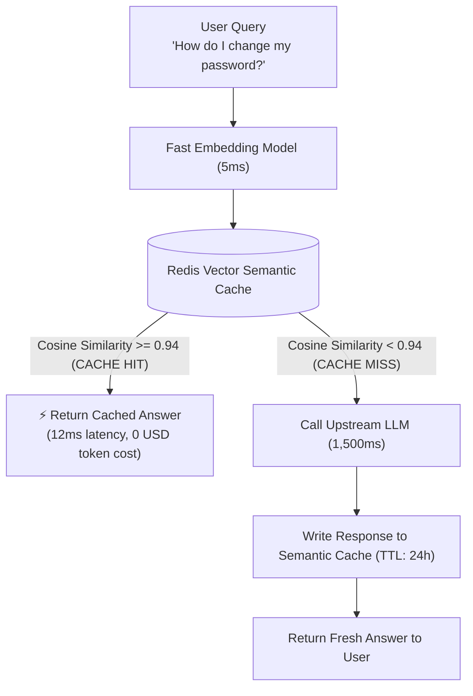

```python
# PRODUCTION FIX: Semantic Cache with Cosine Similarity Threshold
import numpy as np

class SemanticCache:
    def __init__(self, similarity_threshold: float = 0.94):
        self.threshold = similarity_threshold
        self.entries = []  # In production, use Redis VSS or Qdrant

    def lookup(self, query_vector: np.ndarray) -> str | None:
        if not self.entries:
            return None

        # Compute cosine similarity across all cached query vectors
        best_score = -1.0
        best_answer = None

        for cached_vector, cached_answer in self.entries:
            score = np.dot(query_vector, cached_vector) / (
                np.linalg.norm(query_vector) * np.linalg.norm(cached_vector)
            )
            if score > best_score:
                best_score = score
                best_answer = cached_answer

        if best_score >= self.threshold:
            return best_answer  # CACHE HIT!
        return None  # CACHE MISS
```

### 📌 One-Liner Takeaway
> **Exact-match caching is useless for natural language; semantic caching saves thousands of dollars before queries even touch an LLM.**

---

## 12. Dumping 100+ Tools on a Single Agent

### 💡 Explain Like I'm 10 (ELI10)
Imagine you hand a handyman a Swiss Army knife that has 150 different miniature attachments that all look almost identical. When you ask them to tighten a Phillips screw, they spend 15 minutes squinting, opening and closing the wrong blades, and eventually strip your screw with a file.

### 💀 The 2 AM War Story
> *"Our DevOps team built a 'Cloud Infrastructure Copilot'. They took our company's entire internal microservice OpenAPI specification—all **118 REST endpoints**—and converted every single endpoint into an LLM tool.
>
> The results were catastrophic:
> 1. Tool JSON schemas alone consumed **18,500 tokens of prefill on every single turn**, costing $0.06 per message before the user even asked anything!
> 2. The agent suffered severe tool hallucination. When asked to restart a container, it confused `restart_service_v1` with `reboot_cluster_node_v2`, hallucinated missing parameters, and accidentally rebooted a primary Redis node during business hours."*

### ❌ The Anti-Pattern: Tool Saturation & Distraction
Research shows that LLM tool selection accuracy degrades precipitously when an agent is given more than **10 to 15 tools**:

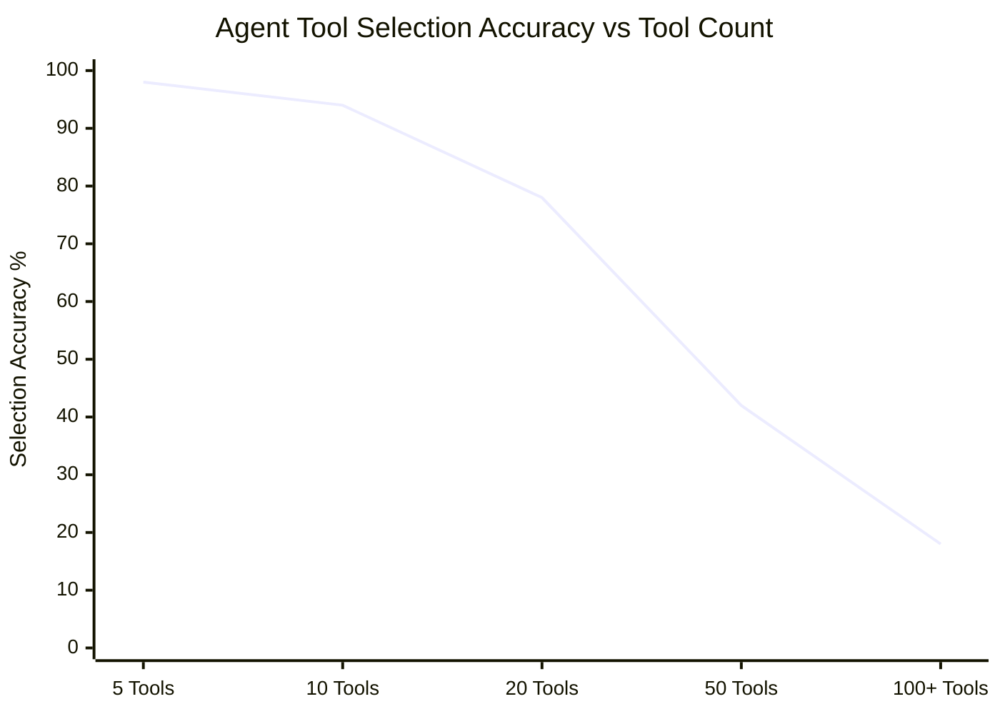

### ✅ The Production Fix: Dynamic Tool Retrieval (Tool-RAG) & Hierarchical Routers
Instead of passing 100 tools on every request:
1. Store tool descriptions in a vector index.
2. Use **Tool-RAG** to retrieve only the top 3-5 relevant tools dynamically based on the user's intent.
3. Or deploy a **Hierarchical Router**: A lightweight triage router directs the user to specialized domain agents (e.g. `BillingAgent` with 3 tools, `ClusterAgent` with 4 tools).

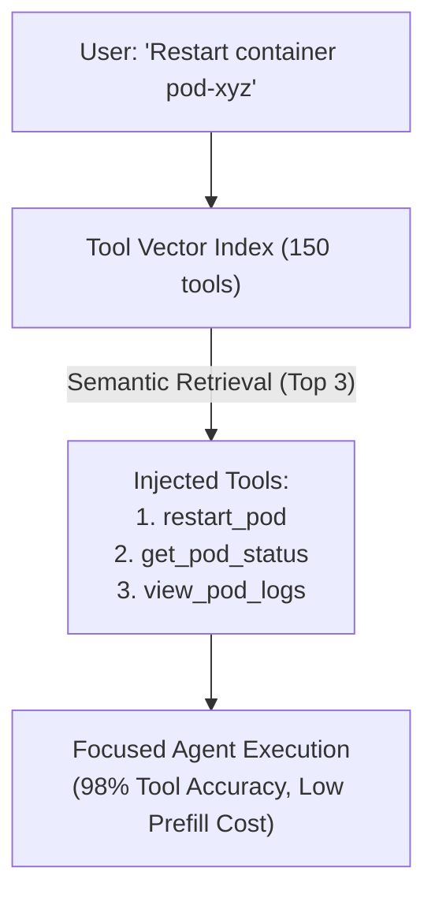

```python
# PRODUCTION FIX: Tool-RAG (Dynamic Tool Selection via Vector Search)
from typing import List, Callable

class DynamicToolRouter:
    def __init__(self, all_tools: List[Callable], vector_store):
        self.all_tools = {t.__name__: t for t in all_tools}
        self.vector_store = vector_store

    def get_tools_for_query(self, user_query: str, top_k: int = 3) -> List[Callable]:
        # Semantically retrieve only the most relevant tools for this specific prompt
        relevant_tool_names = self.vector_store.search(user_query, limit=top_k)
        return [self.all_tools[name] for name in relevant_tool_names if name in self.all_tools]

# Now the LLM prompt only receives 3 tools instead of 118!
active_tools = tool_router.get_tools_for_query("Can you restart pod 4B?")
response = llm.bind_tools(active_tools).invoke(user_prompt)
```

### 📌 One-Liner Takeaway
> **Give an agent 5 tools and it's an expert; give it 100 tools and it's a confused intern with production API keys.**

---

## 13. No Context Budgeting (Context Window Overflow)

### 💡 Explain Like I'm 10 (ELI10)
Imagine you are packing a suitcase for a flight. You keep throwing shoes, jackets, and books inside without checking the airline's weight scale. At the boarding gate, the zipper rips open, your clothes spill across the runway, and security throws your bag in the trash.

### 💀 The 2 AM War Story
> *"A customer was 35 minutes into a complex technical troubleshooting conversation with our enterprise SaaS support bot. On turn 29, the customer sent their error log.
>
> The bot immediately crashed with:
> `400 BadRequest: ContextWindowExceededError (Max tokens: 128,000, Requested: 131,240)`.
>
> Because our backend did a naive `conversation_history.append(user_message)` on every turn, the conversation grew unchecked until it slammed directly into the model's hard token ceiling. The session crashed unceremoniously, lost state, and forced the furious enterprise customer to start over from scratch."*

### ❌ The Anti-Pattern: Unbounded Conversation History Appending
```python
# ANTI-PATTERN: Blindly appending messages until the API throws a 400 error
chat_history = []

def chat(user_message: str):
    chat_history.append({"role": "user", "content": user_message})
    
    # 💥 BOOM: Crashes on turn 25 when history exceeds context window!
    response = client.messages.create(
        model="claude-3-7-sonnet-20241022",
        messages=chat_history
    )
    chat_history.append({"role": "assistant", "content": response.content[0].text})
    return response
```

### ✅ The Production Fix: Strict Context Budgeting & Sliding Windows
Treat your context window as a **strictly allocated financial budget**:

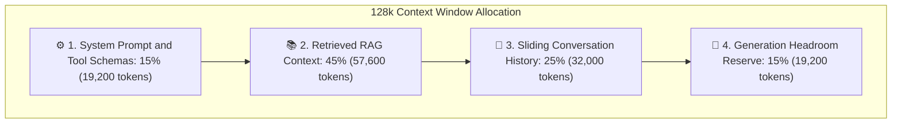

```python
# PRODUCTION FIX: Token-Budgeted Sliding Window Manager in Python
import tiktoken

class ContextBudgetGovernor:
    def __init__(self, max_history_tokens: int = 4000, model: str = "gpt-4.5"):
        self.encoder = tiktoken.encoding_for_model(model)
        self.max_tokens = max_history_tokens

    def prune_history(self, messages: list[dict]) -> list[dict]:
        """Prunes oldest messages using FIFO, keeping the system prompt intact."""
        total_tokens = sum(len(self.encoder.encode(m["content"])) for m in messages)
        
        # While history exceeds token budget, drop oldest non-system message
        while total_tokens > self.max_tokens and len(messages) > 1:
            dropped = messages.pop(1)  # Keep index 0 (system prompt), drop oldest user/assistant turn
            total_tokens -= len(self.encoder.encode(dropped["content"]))
            
        return messages
```

### 📌 One-Liner Takeaway
> **An unbudgeted context window is a ticking time bomb that explodes in your most engaged users' faces.**

---

## 14. Ignoring GDPR for Agent Memory (Crypto-Shredding)

### 💡 Explain Like I'm 10 (ELI10)
Imagine you write down someone's phone number on a brick, bake the brick into the concrete foundation of a 40-story skyscraper, and then the person says: *"By law, you must erase my phone number without damaging the building."*

### 💀 The 2 AM War Story
> *"Our AI executive assistant app maintained long-term semantic memory for users using vector embeddings and graph databases. Users loved that the agent remembered their spouse's name, favorite airlines, and passport expiration dates across months of conversations.
>
> Then came an official GDPR Article 17 **Right to be Forgotten** legal notice from an EU user demanding immediate permanent erasure of all their personal data.
>
> Our engineering team went into full panic mode:
> - User memory embeddings were scattered across a shared 10-million-vector HNSW index.
> - Deleting rows from the vector database didn't immediately purge underlying index segments.
> - Worse, does high-dimensional vector distance leak PII? Can an auditor verify complete destruction?
> We faced potential **fines of €20,000,000 or 4% of annual global turnover** because our memory architecture wasn't designed for compliance."*

### ❌ The Anti-Pattern: Unencrypted Global Memory Storage
Storing plaintext user memories and embeddings in shared multi-tenant tables where selective erasure requires massive index rebuilds.

### ✅ The Production Fix: Per-User Crypto-Shredding
Instead of physically hunting down every vector fragment across multiple storage engines:
1. Every individual user is assigned a unique **Data Encryption Key (DEK)** managed in AWS KMS or HashiCorp Vault.
2. All memory text and raw vector payloads are encrypted with that user's DEK before storage.
3. When a GDPR "Right to be Forgotten" request arrives, you **destroy the user's DEK**.
4. Instantly, all historical vectors, raw text, and backups become mathematically unrecoverable white noise. Compliance is guaranteed in **10 milliseconds** without rebuilding vector indexes!

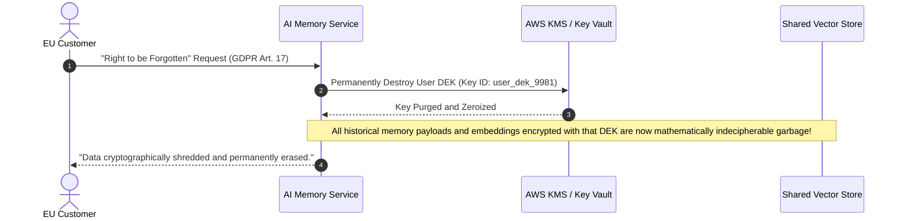

```python
# PRODUCTION FIX: Crypto-Shredding Memory Architecture Concept
from cryptography.fernet import Fernet

class CryptoShreddedMemoryStore:
    def __init__(self, kms_client):
        self.kms = kms_client  # KMS manages per-user encryption keys

    def write_memory(self, user_id: str, memory_text: str):
        user_dek = self.kms.get_or_create_user_key(user_id)
        cipher = Fernet(user_dek)
        encrypted_payload = cipher.encrypt(memory_text.encode())
        vector_db.insert(user_id=user_id, payload=encrypted_payload)

    def execute_gdpr_forget_request(self, user_id: str):
        # CRYPTO-SHREDDING: Destroying the key renders all data unrecoverable instantly
        self.kms.destroy_key(user_id)
        logger.info(f"User {user_id} data cryptographically shredded.")
```

### 📌 One-Liner Takeaway
> **If you can't erase a user's memory with a single cryptographic key deletion, GDPR penalties will erase your startup's bank account.**

---

## 15. Treating the LLM as a Reliable Microservice

### 💡 Explain Like I'm 10 (ELI10)
Imagine you have a coworker who is a brilliant genius, but they randomly fall asleep for 20 seconds, sometimes get overwhelmed and lock their office door, and occasionally shout random gibberish. If your entire company stops functioning every time they take a nap, your company is built wrong.

### 💀 The 2 AM War Story
> *"Our microservices architecture treated the OpenAI API like our local PostgreSQL database. We made direct, synchronous HTTP calls inside our primary request handling pipeline.
>
> At 2:10 AM, OpenAI experienced a transient 15-second rate-limit spike (HTTP 429).
>
> Our backend code reacted with a naive immediate retry loop: `for attempt in range(5): make_request()`. 
>
> Five hundred incoming customer requests multiplied into **2,500 simultaneous retry calls in under two seconds**. We created our own self-inflicted Distributed Denial of Service (DDoS) thundering herd! Our API gateway's thread pools saturated, CPU hit 100%, health checks failed, and Kubernetes killed all our pods simultaneously. A minor 15-second cloud hiccup turned into a total 45-minute cascading blackout."*

### ❌ The Anti-Pattern: Naive Immediate Retries
```python
# ANTI-PATTERN: Immediate retry storm (Thundering Herd DDoS)
def call_llm(prompt: str):
    for attempt in range(5):
        try:
            return client.chat.completions.create(model="gpt-4.5", messages=[...])
        except Exception:
            # Immediate retry with NO backoff and NO jitter!
            pass  # 💥 Overwhelms the API and guarantees rate-limit IP ban!
```

### ✅ The Production Fix: Circuit Breakers & Jittered Exponential Backoff
All production AI integrations must implement:
1. **Exponential Backoff with Full Jitter**:
   ```text
   Delay = random(0, min(M, B · 2^attempt))
   ```
2. **Circuit Breakers**: When error rates exceed 50% in a 10-second window, trip the circuit to **OPEN**. Immediately fail fast or serve fallback cached responses without touching the upstream provider.

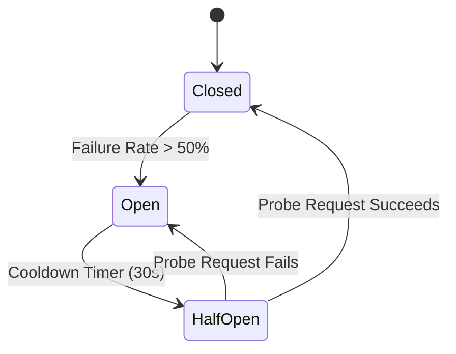

#### Production Python Implementation (using `tenacity`)
```python
# PRODUCTION FIX: Jittered Exponential Backoff in Python
from tenacity import retry, stop_after_attempt, wait_random_exponential, retry_if_exception_type
import openai

@retry(
    # Exponential backoff with random jitter (prevents thundering herds)
    wait=wait_random_exponential(multiplier=1, max=30),
    stop=stop_after_attempt(4),
    retry=retry_if_exception_type((openai.RateLimitError, openai.APIConnectionError))
)
def call_resilient_llm(prompt: str):
    return client.chat.completions.create(
        model="gpt-4.5",
        messages=[{"role": "user", "content": prompt}],
        timeout=10.0
    )
```

#### Enterprise C# Polly Resilience Pipeline (.NET 9)
```csharp
// PRODUCTION FIX: Polly Resilience Pipeline in C# (.NET 9)
var resiliencePipeline = new ResiliencePipelineBuilder()
    .AddRetry(new RetryStrategyOptions
    {
        MaxRetryAttempts = 3,
        BackoffType = DelayBackoffType.Exponential,
        UseJitter = true, // Prevents synchronized client retry spikes
        Delay = TimeSpan.FromSeconds(1)
    })
    .AddCircuitBreaker(new CircuitBreakerStrategyOptions
    {
        FailureRatio = 0.5, // Trip if 50% of calls fail
        SamplingDuration = TimeSpan.FromSeconds(30),
        BreakDuration = TimeSpan.FromSeconds(60)
    })
    .AddTimeout(TimeSpan.FromSeconds(15))
    .Build();

// Execute inference inside resilience envelope
var result = await resiliencePipeline.ExecuteAsync(async token => 
    await _chatClient.CompleteAsync(prompt, cancellationToken: token)
);
```

### 📌 One-Liner Takeaway
> **Treating an LLM API like a local database call will turn the first transient 429 rate limit into a catastrophic enterprise blackout.**

---

## Quick Reference Summary Matrix

| # | Mistake | The Horror (War Story) | The Root Cause | The Production Fix | One-Liner Takeaway |
|:---:|:---|:---|:---|:---|:---|
| **1** | **Building an Agent when a DAG Works** | $3,400 runaway invoice parser debating ethics | Over-engineering autonomous ReAct loops for fixed workflows | Anthropic's 5 Patterns: Deterministic DAGs & State Machines | *If you can draw your business process as a flowchart, use a DAG.* |
| **2** | **Not Caching System Prompt** | $31,500 monthly bill on repetitive 35k system prompts | Re-paying 100% prefill price on static tokens every call | Anthropic cache breakpoints (`cache_control: ephemeral`) | *Paying full price for static prompts is a volunteer tax on developers.* |
| **3** | **Dynamic Data at Top of Prompt** | 0% cache hit rate due to line-1 timestamp | Prefix Taint: KV-cache matches from left-to-right | "Static Prefix First, Dynamic Suffix Last" architecture | *Put one volatile variable at the top, and your cache is on fire.* |
| **4** | **No Loop Limits** | $485 runaway on a single 10-line CSV at 2 AM | Unbounded `while not done:` loops; compounding errors (0.95^10 ≈ 60%) | 4-Tier Governor: `max_steps`, token budget, timeout, circuit breaker | *Never write `while True` around an LLM unless you have infinite cash.* |
| **5** | **Free-Form SQL Tools** | Staging database deleted via prompt injection | Passing raw LLM text to write-permission DB engine | AST validation (`sqlglot`) + physical read-only replica | *If your LLM can execute `DROP TABLE`, you built an RCE backdoor.* |
| **6** | **Skipping Evals** | Weekend outage after "good vibes" prompt change | Relying on playground checks instead of regression suites | 3-Tier Eval Pyramid (Deterministic asserts, LLM-as-a-Judge, CI/CD) | *If you don't have evals in CI/CD, your users are your QA team.* |
| **7** | **Single-Provider API** | $180k Cyber Monday loss during 87-min vendor outage | Hardcoded single vendor client in business logic | Multi-provider fallback gateway (OpenAI → Claude → Gemini) | *A single LLM provider is a single point of failure; redundancy is survival.* |
| **8** | **Not Streaming** | Users rage-clicking refresh on 15s blank screen | Blocking HTTP requests awaiting full generation | Server-Sent Events (SSE) streaming (TTFT < 400ms) | *Perceived latency is all users care about; stream your tokens.* |
| **9** | **Lost-in-the-Middle** | LLM misses critical clause at token 45k of 100k | U-shaped attention curve: degradation in middle 60% | Cross-encoder reranking + "Sandwich" context placement | *Stashing critical docs in the middle makes your LLM blind.* |
| **10** | **Fine-Tuning when RAG Works** | $45k GPU bill on outdated company wiki weights | Confusing parametric memory (style) with retrieval (facts) | Modern RAG with hybrid search, metadata filters, and citations | *Fine-tuning is for teaching skills; RAG is for giving facts.* |
| **11** | **No Semantic Caching** | $8,200/mo spent answering identical FAQ queries | Exact-match hashing fails on natural language variations | Vector Semantic Cache (Redis VSS, Cosine Similarity ≥ 0.94) | *Semantic caching saves thousands before queries even touch an LLM.* |
| **12** | **Dumping 100+ Tools** | 18k prefill token waste and wrong endpoint called | Tool saturation: LLM selection accuracy tanks past 15 tools | Tool-RAG (retrieve top 3 tools) or Hierarchical Routers | *Give an agent 5 tools it's an expert; give it 100 it's a confused intern.* |
| **13** | **No Context Budgeting** | Crash on turn 29 during live customer support dispute | Unbounded message appending until 128k limit exceeded | Strict context budgeting (15% Sys, 45% RAG, 25% Hist, 15% Out) | *An unbudgeted context window is a ticking time bomb.* |
| **14** | **Ignoring GDPR for Memory** | €20M fine panic on vector memory erasure request | Vector index deletion doesn't erase embedded data | Crypto-Shredding: Encrypt with user DEK; destroy key on forget | *If you can't shred memory with one key deletion, GDPR will shred you.* |
| **15** | **Treating LLM as Reliable** | 2,500 thundering-herd retries crash Kubernetes cluster | Assuming 100% microservice availability without backoff | Circuit breakers + Exponential Backoff with Full Jitter | *Treating an LLM like a local DB turns a transient 429 into a blackout.* |

---

## Production Readiness Audit Checklist

Before merging any AI feature into staging or production, run through this 10-point architectural gate:

```markdown
- [ ] 1. WORKFLOW AUDIT: Can this feature be solved with a deterministic DAG or prompt chain instead of an open-ended agent?
- [ ] 2. PROMPT CACHE DISCIPLINE: Is the static system prompt >= 1,024 tokens tagged with cache breakpoints? Is the prefix 100% free of timestamps and dynamic variables?
- [ ] 3. LOOP GOVERNOR: Does every iterative LLM call have a strict `max_steps` (<= 5) and wall-clock timeout?
- [ ] 4. TOOL ISOLATION: Are all database tools restricted to read-only replicas with AST query validation? Are tool schemas capped at <= 10 per agent turn?
- [ ] 5. AUTOMATED EVALS: Is there a golden dataset running assertions in CI/CD that blocks PR merges on regression?
- [ ] 6. MULTI-PROVIDER FAILOVER: Does the system automatically reroute to a secondary provider if the primary returns 503 or 429?
- [ ] 7. STREAMING UX: Is user-facing generation streamed via Server-Sent Events (SSE) with Time-To-First-Token < 800ms?
- [ ] 8. CONTEXT BUDGETING: Is conversation history pruned via a token-budgeted sliding window before reaching the model ceiling?
- [ ] 9. PRIVACY & COMPLIANCE: Can long-term user memories and vectors be cryptographically shredded upon request?
- [ ] 10. RESILIENCE HARNESS: Are all external API calls protected by exponential backoff with full jitter and circuit breakers?
```
