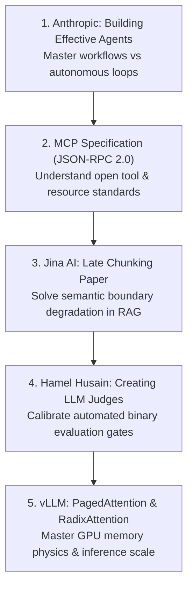

# AI Engineering & Agentic AI — Comprehensive Resource Map

> **A definitive, phase-by-phase reference mapping core topics directly to authoritative official documentation, free courses, GitHub repositories, and seminal engineering guides.**

---

## 📑 Index of Curriculum Phases (Phases 00–08)

| Phase | Domain | Primary Focus |
|:---:|:---|:---|
| **00** | [**Foundations & Token Mechanics**](#phase-00-foundations-token-mechanics) | Transformer inference physics, BPE tokens, KV-cache VRAM math, test-time compute, reasoning models, and quantization. |
| **01** | [**Prompt & Context Engineering**](#phase-01-prompt-context-engineering) | Context AST architecture, 13K budgeting, 4-tier compaction, prefix caching, schema FSMs, and MECW context rot. |
| **02** | [**Enterprise Retrieval & Knowledge Systems (RAG)**](#phase-02-enterprise-retrieval-knowledge-systems-rag) | Chunking strategies, Late Chunking, hybrid search (BM25 + HNSW), Reciprocal Rank Fusion (RRF), cross-encoders, and GraphRAG. |
| **03** | [**Tools & Model Context Protocol (MCP)**](#phase-03-tools-model-context-protocol-mcp) | Function calling wire specs, Linux Foundation MCP, stdio/SSE transports, ABAC policy engine, and zero-trust sandboxing. |
| **04** | [**Stateful Agent Orchestration**](#phase-04-stateful-agent-orchestration) | Bounded ReAct loops, CodeAct, EventStore WAL crash recovery, Saga distributed rollbacks, 4-tier memory, and Google A2A protocol. |
| **05** | [**AI Security & Guardrails**](#phase-05-ai-security-guardrails) | OWASP GenAI Top 10, prompt injection defenses, Dual-LLM privilege quarantine, canary tokens, and EU AI Act Fairlearn audits. |
| **06** | [**GenAI Evals & Observability**](#phase-06-genai-evals-observability) | The 3 levels of evals, binary LLM judges, golden datasets, OpenTelemetry GenAI semantic conventions, and TreeSHAP explainability. |
| **07** | [**High-Throughput Serving & LLMOps**](#phase-07-high-throughput-serving-llmops) | Resilient multi-provider gateways, Token-Bucket rate limiting, dual-tier caching, vLLM continuous batching, RadixAttention, and multi-LoRA. |
| **08** | [**AI-Augmented SDLC & Leadership**](#phase-08-ai-augmented-sdlc-leadership) | Software 3.0 SDLC, agentic coding tools (Claude Code, Cursor), machine-readable `AGENT.md` contracts, and AI Architecture Review Boards. |
| **ECO** | [**Enterprise Ecosystem Standards & SDKs**](#enterprise-ecosystem-standards-provider-sdks) | Provider reference documentation across Anthropic Claude, Google GenAI & ADK, Microsoft Azure AI, and OpenAI. |
| **REPO** | [**Core GitHub Repositories to Bookmark**](#core-github-repositories-to-bookmark) | Centralized directory of essential production libraries, frameworks, and benchmark suites. |

---

## Phase 00 — Foundations & Token Mechanics

### Core Topics
- LLM fundamentals & Transformer inference physics
- Scaled Dot-Product Attention & Multi-Head vs. Grouped-Query Attention (MHA / GQA / MQA)
- Tokens, Byte-Pair Encoding (BPE), vocabulary tokenization, and multi-language penalties
- Memory bandwidth wall: Compute-bound (prefill) vs. memory-bandwidth-bound (decode) regimes
- KV-Cache physical mechanics, growth equations, and GPU VRAM capacity math
- Sampling parameters: Temperature, Top-P (Nucleus), Top-K, Min-P, Seed
- Reasoning & Thinking models (OpenAI o1/o3, Claude 3.7 Sonnet extended thinking, Gemini 2.5 Thinking, DeepSeek-R1)
- Thinking token economics: Reasoning token pricing, hidden scratchpad billing, and inference budget caps
- Small Language Models (SLMs) on device and edge: Microsoft Phi-4, Google Gemma 2, Alibaba Qwen 2.5
- Model precision & Quantization mechanics (FP16, BF16, FP8, INT4, AWQ, GPTQ)
- Test-Time Compute: Inference scaling laws and search over thinking trajectories

### Curated Resources
- [Google AI for Developers](https://ai.google.dev/) — *Official Gemini 2.0/2.5 APIs, models, and quickstarts*
- [Anthropic Claude Documentation](https://docs.anthropic.com/) — *Claude 3.7 Sonnet models, hybrid reasoning, and capabilities*
- [DeepSeek-R1 Research Paper](https://arxiv.org/abs/2501.12948) — *Incentivizing reasoning capability in LLMs via reinforcement learning (GRPO)*
- [DeepLearning.AI — Reasoning with o1](https://www.deeplearning.ai/short-courses/reasoning-with-o1/) — *Test-time compute, chain-of-thought, and reasoning budgets with OpenAI*
- [Andrej Karpathy — Let's build GPT: from scratch, in code, spelled out](https://www.youtube.com/watch?v=kCc8FmEb1nY) — *The definitive mechanics walkthrough of transformer architecture*
- [Hugging Face — Transformers Documentation](https://huggingface.co/docs/transformers/) — *Architecture internals, tokenizer mechanics, and quantization guides*
- [Transformer Inference Arithmetic (KiVi / Tim Dettmers)](https://timdettmers.com/) — *Deep dive into memory bandwidth, KV-cache sizing, and matrix multiplication overhead*

---

## Phase 01 — Prompt & Context Engineering

### Core Topics
- Context Abstract Syntax Tree (AST) architecture and structured context assembly
- The Prompt Hierarchy: System instructions, developer messages, few-shot anchors, and user turns
- Dynamic token budgeting: 13K / 32K / 128K context allocation portfolios
- Context Compaction Pipeline: Drop, truncate, summarize, and evict strategies
- Lost-in-the-Middle mitigation: Attention distribution and primacy/recency bias
- Prefix & Context Caching mechanics (Anthropic 5-minute ephemeral cache, Gemini context caching)
- Constrained grammar decoding: Finite State Machine (FSM) decoders, JSON Schema enforcement
- Maximum Effective Context Window (MECW) and multi-turn context rot / entropy degradation

### Curated Resources
- [Anthropic Prompt Engineering Interactive Tutorial](https://github.com/anthropics/courses/tree/master/prompt_engineering_interactive_tutorial) — *XML tags, system prompts, few-shot, and chain-of-thought*
- [Anthropic Prompt Caching Guide](https://docs.anthropic.com/en/docs/build-with-claude/prompt-caching) — *Mechanics of 5-minute ephemeral prefix caching, achieving 90% cost reductions*
- [OpenAI Structured Outputs Guide](https://platform.openai.com/docs/guides/structured-outputs) — *Constrained grammar decoding and 100% strict JSON schema enforcement*
- [Google Gemini Context Caching Documentation](https://ai.google.dev/gemini-api/docs/caching) — *Implicit and explicit context caching for large token context windows*
- [Outlines Library (dottxt)](https://github.com/dottxt-ai/outlines) — *Fast, structured text generation with regular expressions and JSON schemas*
- [Pydantic v2 Documentation](https://docs.pydantic.dev/latest/) — *Type-safe data parsing, schema export, and model validation*

---

## Phase 02 — Enterprise Retrieval & Knowledge Systems (RAG)

### Core Topics
- Document ingestion & layout-aware parsing (unstructured tables, headers, PDFs)
- Chunking strategies: Fixed-size, recursive character, sliding window, and semantic boundary chunking
- Late Chunking: Document-level transformer embeddings with token pooling across chunk boundaries
- Dense vector search (HNSW spatial graphs, cosine similarity, inner product)
- Sparse lexical search (BM25 inverted indexes, term frequency / inverse document frequency)
- Hybrid Retrieval: Merging dense and sparse result lists
- Reciprocal Rank Fusion (RRF): Harmonic rank distribution algorithms (`k=60`)
- Cross-Encoder Reranking: Two-stage retrieval pipelines with query-chunk full attention scoring
- Predicate-Filtered search (ACORN) and multi-tenant document-level RBAC isolation
- GraphRAG: Entity/relationship extraction, Leiden community clustering, and hierarchical summaries

### Curated Resources
- [Pinecone — Retrieval-Augmented Generation](https://www.pinecone.io/learn/retrieval-augmented-generation/) — *Production RAG architectures and indexing patterns*
- [Weaviate — Hybrid Search Explained](https://weaviate.io/blog/hybrid-search-explained) — *Dense + Sparse fusion mechanics and score normalization*
- [Jina AI — Late Chunking Research Paper](https://arxiv.org/abs/2409.04701) — *Passing full context through transformers before pooling embeddings*
- [Microsoft Research — GraphRAG Paper & Repository](https://github.com/microsoft/graphrag) — *Modular Graph-based Retrieval-Augmented Generation*
- [Cohere Rerank Documentation](https://docs.cohere.com/docs/reranking) — *Cross-encoder scoring, relevance thresholds, and precision tuning*
- [FAISS Documentation (Meta AI)](https://github.com/facebookresearch/faiss) — *Billion-scale similarity search and clustering algorithms*
- [Qdrant Vector Database Documentation](https://qdrant.tech/documentation/) — *Payload-based filtering, HNSW indexing, and multi-tenant isolation*

---

## Phase 03 — Tools & Model Context Protocol (MCP)

### Core Topics
- Function Calling & Tool Execution wire protocol: JSON-RPC 2.0 schemas
- Model Context Protocol (MCP) Architecture: Host, Client, and Server specifications
- MCP Transports: Local `stdio` inter-process communication vs. remote Streamable HTTP / Server-Sent Events (SSE)
- Stateless MCP 2026 specification: Horizontal scaling and decoupled connection lifecycles
- Attribute-Based Access Control (ABAC) policy engines for high-risk tool execution
- Financial idempotency keys: `SHA-256(SessionID + TurnIndex + ToolName + ArgsHash)`
- Zero-Trust Tool Sandboxes: Process isolation, Linux namespaces, seccomp filters, and MicroVMs (Firecracker / gVisor)
- Enterprise PaaS MCP Bridge: Connecting Microsoft Copilot Studio to cloud microservices

### Curated Resources
- [Model Context Protocol Official Site](https://modelcontextprotocol.io/) — *Protocol overview, quickstarts, and client/server tutorials*
- [MCP Specification (JSON-RPC 2.0)](https://spec.modelcontextprotocol.io/) — *Complete open standard governing Transports, Tools, Resources, and Prompts*
- [MCP GitHub Organization](https://github.com/modelcontextprotocol) — *Official TypeScript, Python, and Kotlin SDKs and reference servers*
- [FastMCP Python Library](https://github.com/jlowin/fastmcp) — *High-level, ergonomic framework for authoring production MCP servers*
- [Anthropic MCP Tool Use Guide](https://docs.anthropic.com/en/docs/agents-and-tools/mcp) — *Connecting Claude Desktop, Cursor, and Claude Code to external tools*
- [Firecracker MicroVM Documentation](https://firecracker-microvm.github.io/) — *Secure, fast, lightweight micro-virtual machines for tool execution sandboxes*

---

## Phase 04 — Stateful Agent Orchestration

### Core Topics
- The Spectrum of Agency: Workflow patterns (prompt chaining, routing, parallelization) vs. Autonomous Agents
- Bounded ReAct loops: Thought → Action → Observation iterations
- Loop Engineering: SHA-256 action hashing, ring-buffer cycle detection, and progressive budget decay governors
- Code-as-Action (CodeAct): Executable Python scripts vs. multi-turn JSON tool-calling ping-pong
- Stateful session management: Event-Sourced Write-Ahead Log (WAL) and crash rehydration
- Distributed Agent Sagas: Forward actions, compensating rollback tools, and two-phase commits
- 4-Tier Memory Hierarchy: Working context, short-term buffer, long-term semantic/episodic, and MaaS (Memory-as-a-Service)
- Memory lifecycle: Ebbinghaus decay curves, recency scoring, and GDPR crypto-shredding
- Multi-Agent Coordination: Supervisor-worker topologies, peer swarms, and the Google Agent2Agent (A2A) protocol

### Curated Resources
- [Anthropic Research — Building Effective Agents](https://www.anthropic.com/research/building-effective-agents) — *Workflows vs. Agents, ReAct patterns, and evaluators*
- [DeepLearning.AI — AI Agents in Practice](https://www.deeplearning.ai/courses/) — *Multi-agent orchestration and production tool calling*
- [LangGraph Documentation](https://langchain-ai.github.io/langgraph/) — *Cyclical state graphs, persistence checkpoints, and human-in-the-loop interrupts*
- [PydanticAI Framework](https://ai.pydantic.dev/) — *Type-safe, production-first agent framework built by the Pydantic team*
- [Google Agent Development Kit (ADK)](https://google.github.io/adk-docs/) — *Code-first multi-agent orchestration framework with A2A protocol support*
- [CodeAct Research Paper (Xingyao Wang et al.)](https://arxiv.org/abs/2402.01030) — *Executable Python actions for efficient agent reasoning*

---

## Phase 05 — AI Security & Guardrails

### Core Topics
- OWASP Top 10 for Large Language Model Applications (2025/2026 edition)
- The Harvard vs. Von Neumann architecture duality in LLMs (instruction and data mixing)
- Prompt Injection attacks: Direct jailbreaks, indirect injection via ingested documents, and recursive extraction
- Dual-LLM Privilege Quarantine: Isolating untrusted data parsers from privileged tool executors
- Cryptographic Canary Tokens: Secret injection markers and data exfiltration monitoring
- Zero-Knowledge PII Tokenization Vaults: Reversible masking and enterprise DLP
- Multi-Tier Guardrails: NeMo Guardrails, Llama Guard, embedding safety classifiers, and real-time semantic firewalls
- Algorithmic Fairness & Bias Audits: Disparate Impact Ratio (DIR), EEOC Four-Fifths rule, and Fairlearn compliance

### Curated Resources
- [OWASP Top 10 for LLM Applications](https://owasp.org/www-project-top-10-for-large-language-model-applications/) — *Authoritative vulnerability classifications and enterprise mitigations*
- [NVIDIA NeMo Guardrails](https://github.com/NVIDIA/NeMo-Guardrails) — *Programmable guardrails for dialog flow, safety, and topical control using Colang*
- [Meta Llama Guard Documentation](https://llama.meta.com/docs/model-cards-and-prompt-formats/llama-guard-3/) — *Input/output safety moderation models aligned with hazard taxonomies*
- [Microsoft Fairlearn Toolkit](https://fairlearn.org/) — *Assessment and mitigation of fairness metrics, disparate impact, and demographic parity*
- [EU AI Act Official Compliance Portal](https://artificialintelligenceact.eu/) — *Four-tier risk classification, GPAI transparency rules, and technical compliance*

---

## Phase 06 — GenAI Evals & Observability

### Core Topics
- Moving beyond vibe checks: The Hamel Husain 3-Level Evaluation Framework
- Level 1 Evals: Deterministic unit tests, exact string matches, schema validation, and regex assertions
- Level 2 Evals: Model-based evaluation (LLM-as-a-Judge), binary pass/fail rubrics, and pairwise comparison
- Judge calibration: Mitigating position bias, verbosity bias, and measuring Cohen's kappa agreement
- Multi-turn Agent Trajectory Evaluation: Finite State Machine path compliance and tool efficiency ratios
- Golden dataset curation: Production edge-case harvesting and synthetic generation via frontier teacher models
- OpenTelemetry GenAI Semantic Conventions: Standardized distributed tracing across prompts, completions, and tools
- Explainable AI (XAI): TreeSHAP local feature attribution, ECOA adverse action notices, and drift monitoring (PSI)

### Curated Resources
- [Hamel Husain — Creating a LLM-as-a-Judge That Drives Business Results](https://hamel.dev/blog/posts/llm-judge/) — *The definitive guide to calibrating model judges and golden datasets*
- [OpenTelemetry GenAI Semantic Conventions](https://opentelemetry.io/docs/specs/semconv/gen-ai/) — *Official distributed tracing attributes for generative AI runtimes*
- [DeepLearning.AI — Evaluating and Debugging Generative AI Models](https://www.deeplearning.ai/short-courses/evaluating-debugging-generative-ai/) — *Systematic evaluation harnesses and metric tracking*
- [Ragas Framework Documentation](https://docs.ragas.io/) — *Automated evaluation of RAG pipelines (faithfulness, answer relevance, context precision)*
- [SHAP (SHapley Additive exPlanations) Documentation](https://shap.readthedocs.io/) — *Game-theoretic local feature attributions for regulated tabular and hybrid models*

---

## Phase 07 — High-Throughput Serving & LLMOps

### Core Topics
- Enterprise hosting topologies: Managed SaaS, dedicated VPC endpoints, and self-hosted inference
- Resilient Multi-Provider AI Gateways: Fallback cascades, circuit breakers, and thundering herd mitigation
- Rate limiting at scale: Sliding-window Token Bucket algorithms governing TPM and RPM ceilings
- Dual-Tier Caching: Exact prefix caching + Semantic vector caching with cosine similarity thresholds
- Asynchronous Batch Processing: Off-peak execution with 50% API cost discounts
- High-Throughput Serving Engines: vLLM, PagedAttention block tables, and continuous batching
- RadixAttention: Tree-based KV-cache prefix sharing across multi-turn agent conversations (SGLang)
- Dynamic Multi-LoRA Adapter Serving: Serving 100+ tenant adapters on a single frozen base model (S-LoRA)
- Edge AI & Client-Side Inference: WebLLM / WebGPU limitations, VRAM probing, and ONNX Runtime

### Curated Resources
- [vLLM Project Documentation](https://docs.vllm.ai/) — *PagedAttention, continuous batching, chunked prefill, and multi-GPU serving*
- [SGLang Project Repository](https://github.com/sgl-project/sglang) — *Fast serving engine featuring RadixAttention trie KV-cache reuse*
- [LiteLLM Proxy & Gateway Documentation](https://docs.litellm.ai/) — *Resilient multi-provider AI gateway with load balancing, caching, and rate limiting*
- [Portkey AI Gateway Documentation](https://docs.portkey.ai/) — *Production LLM gateway with fallback routing, retry budgets, and analytics*
- [S-LoRA Research Paper (Zheng et al.)](https://arxiv.org/abs/2311.03285) — *Serving thousands of concurrent LoRA adapters on a single GPU cluster*
- [WebLLM Project (MLC AI)](https://webllm.mlc.ai/) — *High-performance in-browser LLM inference powered by WebGPU*

---

## Phase 08 — AI-Augmented SDLC & Leadership

### Core Topics
- The Karpathy Continuum: Software 1.0 (imperative logic) → Software 2.0 (weights) → Software 3.0 (reasoning microservices)
- The Shift in Senior Engineering: From code synthesizer to specification author, reviewer, and verification arbiter
- The Enterprise Trust Gap: Reconciling 90% developer adoption with 29% architectural trust
- The Big Seven Agentic Coding Assistants: Claude Code CLI, Cursor, Windsurf, GitHub Copilot, Codex, Aider, and Cline
- Machine-Readable Codebase Contracts: Hierarchical `AGENT.md` specifications and context boundaries
- Spec-Driven Development (SDD): Architectural Decision Records (ADRs) as prompt inputs and verification targets
- Automated PR Verification: AI-driven review bots, AST syntax checks, and test assertion gates
- Developer Productivity Metrics: AI Code Share vs. 14-Day Rework Rate and Mean-Time-To-Remediate (MTTR)
- Establishing an enterprise AI Architecture Review Board (ARB) and 50-point Production Readiness Review (PRR)

### Curated Resources
- [Anthropic Claude Code CLI Documentation](https://docs.anthropic.com/en/docs/agents-and-tools/claude-code) — *Terminal-native agentic coding assistant with MCP support*
- [Cursor Documentation & Best Practices](https://docs.cursor.com/) — *Repository indexing, `.cursorrules`, and agentic multi-file editing*
- [Andrej Karpathy — Software 2.0 & Software 3.0 Essays](https://karpathy.medium.com/) — *The paradigm shift from handcrafted code to probabilistic neural systems*
- [GitClear — Coding on Copilot: 2024 Developer Research](https://www.gitclear.com/coding_on_copilot_data_2024) — *Empirical analysis of code churn, duplicate code, and the 14-day rework rate*
- [ThoughtWorks Technology Radar](https://www.thoughtworks.com/radar) — *Emerging software engineering techniques, platforms, and AI tools*

---

## Enterprise Ecosystem Standards & Provider SDKs

### Google AI & Google Cloud
- **[Google AI for Developers](https://ai.google.dev/)**: Central hub for Gemini 2.0 & 2.5 models, multimodal capabilities, and APIs.
- **[Google GenAI Python SDK (`google-genai`)](https://github.com/googleapis/python-genai)**: The current official unified SDK for Gemini (replaces legacy `google-generativeai`).
- **[Gemini API Documentation](https://ai.google.dev/gemini-api/docs)**: Reference for multimodal streaming, structured outputs, code execution, and context caching.
- **[Google Agent Development Kit (ADK)](https://google.github.io/adk-docs/)**: Code-first multi-agent orchestration framework with first-class MCP support and `agents-cli`.
- **[Google Vertex AI Documentation](https://cloud.google.com/vertex-ai/generative-ai/docs)**: Enterprise grounding with Google Search and BigQuery, model garden, and dedicated agent endpoints.

### Anthropic & Claude
- **[Anthropic Claude Documentation](https://docs.anthropic.com/)**: Primary reference for Claude 3.7 Sonnet (hybrid reasoning & extended thinking) and Claude 3.5 Haiku.
- **[Anthropic Claude Code CLI](https://docs.anthropic.com/en/docs/agents-and-tools/claude-code)**: Official agentic coding assistant CLI with native MCP integration and terminal tool execution.
- **[Anthropic Prompt Engineering Guide](https://docs.anthropic.com/en/docs/build-with-claude/prompt-engineering/overview)**: Authoritative guidance on XML boundaries, system instructions, and extended thinking budgets.
- **[Anthropic Tool Use & Function Calling Guide](https://docs.anthropic.com/en/docs/build-with-claude/tool-use)**: Detailed specifications for JSON tool definition schemas, parallel tool calls, and error handling.
- **[Claude Prompt Caching](https://docs.anthropic.com/en/docs/build-with-claude/prompt-caching)**: Mechanics of 5-minute ephemeral prefix caching, achieving 90% cost and 80% latency reductions.

### Microsoft & Azure AI
- **[Azure AI Foundry Documentation](https://learn.microsoft.com/azure/ai-services/)**: Enterprise model catalog, fine-tuning, hosted agent services, and evaluation pipelines.
- **[Microsoft Semantic Kernel](https://learn.microsoft.com/semantic-kernel/)**: Enterprise AI orchestration SDK for C# / .NET 9, Python, and Java with dependency-injected plugins.
- **[Azure AI Search Documentation](https://learn.microsoft.com/azure/search/)**: Vector search, hybrid search (BM25 + Dense), semantic reranking, and chunking.
- **[Azure AI Agent Service](https://learn.microsoft.com/azure/ai-services/agents/)**: Cloud-native agent hosting with isolated execution sandboxes and Microsoft Entra ID governance.

### OpenAI Platform
- **[OpenAI Documentation](https://platform.openai.com/docs/)**: API reference for frontier reasoning models (o1, o3-mini) and multimodal models (GPT-4o, GPT-4o-mini).
- **[OpenAI Function Calling Guide](https://platform.openai.com/docs/guides/function-calling)**: Model-level tool-calling specifications, strict JSON mode, and multi-turn function execution loops.
- **[OpenAI Structured Outputs Guide](https://platform.openai.com/docs/guides/structured-outputs)**: Constrained grammar decoding and 100% strict JSON schema enforcement.
- **[OpenAI Reasoning Models Guide](https://platform.openai.com/docs/guides/reasoning)**: Test-time compute mechanics, reasoning tokens, and `reasoning_effort` tuning.

---

## 🏛️ Core GitHub Repositories to Bookmark

| Repository | Maintainer | Description | Primary Phase |
|:---|:---|:---|:---:|
| [modelcontextprotocol/specification](https://github.com/modelcontextprotocol/specification) | Linux Foundation | The JSON-RPC 2.0 open standard specification for Model Context Protocol | Phase 03 |
| [anthropics/courses](https://github.com/anthropics/courses) | Anthropic | Interactive developer masterclasses on Tool Use, Prompting, and MCP | Phase 01, 03 |
| [google/adk-docs](https://github.com/google/adk-docs) | Google | Documentation and code-first guides for Google Agent Development Kit | Phase 04 |
| [googleapis/python-genai](https://github.com/googleapis/python-genai) | Google | Current official Python SDK for Gemini 2.0/2.5 and Vertex AI | Phase 00, 01 |
| [microsoft/semantic-kernel](https://github.com/microsoft/semantic-kernel) | Microsoft | Enterprise agent orchestration SDK for C# / .NET 9 and Python | Phase 04 |
| [microsoft/graphrag](https://github.com/microsoft/graphrag) | Microsoft Research | Graph-based retrieval-augmented generation engine using community clustering | Phase 02 |
| [pydantic/pydantic-ai](https://github.com/pydantic/pydantic-ai) | Pydantic | Type-safe, production-grade agent framework with strict schema validation | Phase 04 |
| [langchain-ai/langgraph](https://github.com/langchain-ai/langgraph) | LangChain | Cyclical state graph orchestrator with durable checkpointing and interrupts | Phase 04 |
| [vllm-project/vllm](https://github.com/vllm-project/vllm) | vLLM Team | High-throughput serving engine with PagedAttention and continuous batching | Phase 07 |
| [sgl-project/sglang](https://github.com/sgl-project/sglang) | SGLang Team | Fast serving framework with RadixAttention trie KV-cache prefix sharing | Phase 07 |
| [NVIDIA/NeMo-Guardrails](https://github.com/NVIDIA/NeMo-Guardrails) | NVIDIA | Programmable conversational rails for enterprise security and safety | Phase 05 |
| [fairlearn/fairlearn](https://github.com/fairlearn/fairlearn) | Fairlearn Team | Statistical fairness audit library for disparate impact and demographic parity | Phase 05 |

---

## ⚡ The 80/20 Priority Reading Order

If you have limited time and need to maximize your architectural ROI, study these materials in sequence:

