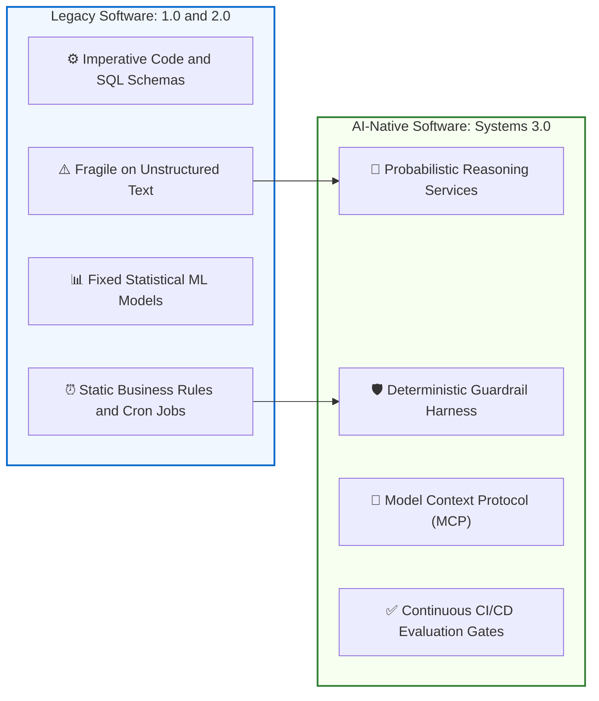
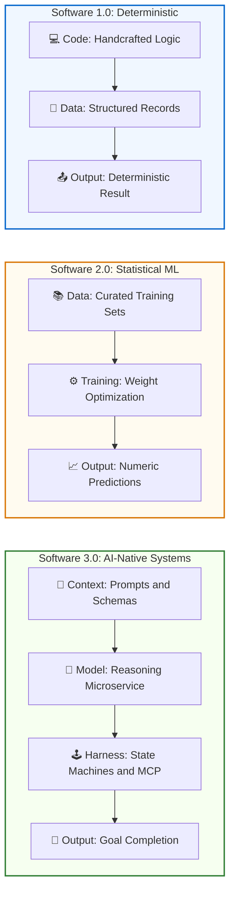
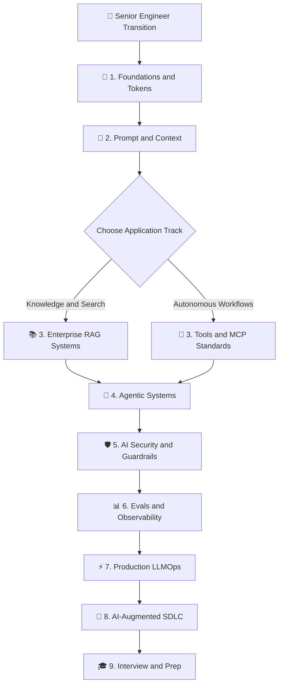

# The Senior AI Engineer & Architect Transition Guide
## Enterprise Architecture, Decision Frameworks, and Implementation Playbook

> **An authoritative architectural guide for Senior Engineers, Tech Leads, Principal Developers, and Software Architects designing and deploying production AI applications and autonomous agentic systems.**

---

### Visual Architecture Walkthrough:
1. **The Traditional Baseline**: Software 1.0 & 2.0 excel at deterministic business logic and specialized statistical classification, but break when confronted with unstructured ambiguity or multi-step reasoning.
2. **The Systems Harness**: Software 3.0 pairs probabilistic reasoning engines with deterministic software harnesses (schemas, MCP tools, stateful WALs, and CI/CD evaluation gates) to deliver reliable production systems.

---

## 1. Architectural Foundations: The Senior AI Transition

If you have spent 8+ years building enterprise software, you already know how to architect distributed systems, design relational schemas, write resilient microservices, and configure CI/CD pipelines.

The transition to AI engineering does **not** require throwing away that experience or becoming an ML researcher. In fact, your traditional software engineering discipline is the exact skill set missing in today's fragile AI prototypes.

### The Evolution: From Non-AI Software to AI Solutions

To understand where foundation models fit in production, let's trace how we got here:

### 📊 Software Evolution Comparison Table

| Dimension | Software 1.0 (Deterministic) | Software 2.0 (Statistical ML) | Software 3.0 (AI-Native / Agentic) |
|---|---|---|---|
| **Core Primitives** | Handcrafted imperative code & SQL | Trained neural weights & vectors | Prompt Context AST + Reasoning Microservice |
| **System Behavior** | 100% deterministic logic | Statistical classification & scoring | Probabilistic planning & autonomous tool calls |
| **Failure Modes** | Fails on unstructured text & ambiguity | Fails on out-of-distribution domain shifts | Fails on hallucinations & unconstrained loops |
| **Engineering Harness** | Unit tests & static compilers | Data curation & GPU training pipelines | Pydantic schemas, MCP, WAL event stores & CI/CD evals |

#### Step 1: Software 1.0 — The Non-AI Deterministic Baseline
- **How we built it**: Handcrafted imperative code (`if/else`, switch statements, procedural logic) operating over strictly structured relational databases (SQL, schemas, ACID transactions).
- **The Strength**: 100% deterministic, highly predictable, easily tested with standard unit test assertions.
- **Where it hits a wall**: Real-world ambiguity. Traditional code fails when dealing with unstructured natural language, messy PDFs, free-text customer inquiries, or fuzzy multi-step problem solving. Every single edge case has to be manually anticipated and coded by a developer.

#### Step 2: Software 2.0 — Specialized Statistical Machine Learning
- **How we built it**: Instead of writing the rules manually, data science teams trained neural networks or gradient-boosted trees on domain datasets to learn statistical patterns (e.g., spam classifiers, recommendation engines, fraud scoring).
- **The Strength**: Handled high-dimensional patterns that humans couldn't write rules for.
- **Where it hits a wall**: Extremely fragile, task-specific, and expensive to maintain. A model trained for sentiment analysis cannot extract structured entities from an invoice. They output probabilities or classifications, not dynamic multi-step actions.

#### Step 3: Software 3.0 — The AI-Native Reasoning Harness
- **How we build it**: We treat large language models as **probabilistic reasoning microservices**. They consume rich context (prompts, schemas, tools) and generate decisions or structured calls.
- **The Senior Architect's Role**: We do not let models roam free. We build a **deterministic software harness** around the probabilistic core:
  - We constrain model outputs using strict JSON schemas and FSM logit masking.
  - We ground reasoning with hybrid vector search and document-level RBAC.
  - We isolate external actions behind sandboxed runtimes and Human-in-the-Loop step-up authorization gates.
  - We track execution traces with OpenTelemetry and enforce regression test suites in CI/CD.

---

### Polyglot Enterprise Runtime Matrix

AI system architecture is language-agnostic. Enterprise architectures frequently deploy across multiple runtime ecosystems:

| Runtime Ecosystem | Primary Roles & Strengths | Recommended Libraries & Frameworks |
|:---|:---|:---|
| **Python** | Prototyping, data ingestion, scientific computing, orchestrators | `google-genai`, `anthropic`, `langgraph`, `pydantic`, `fastmcp` |
| **TypeScript / Node.js** | Web frontends, edge handlers, event streaming, CLI agents | `@modelcontextprotocol/sdk`, `@google/genai`, `@anthropic-ai/sdk`, `zod` |
| **C# / .NET 9+** | High-throughput enterprise backends, microservice pipelines | Microsoft Semantic Kernel, `Google.GenAI`, Polly resilience policies |
| **Java / Go** | Distributed backend workers, high-concurrency microservices | Spring AI, Vertex AI Java SDK, containerized cloud workers |

---

## 2. The 4-Tier Lesson Depth Model

To calibrate depth, prerequisites, and pacing, all topics in this curriculum are classified into a 4-tier taxonomy:

> 📋 See the [Architectural Mastery Tiers](./README.md#architectural-mastery-tiers) in the main curriculum for the full taxonomy definition.

1. **`🟢 Core`**: Non-negotiable foundation every engineer must master. Establishes primary mental models, basic mechanics, failure modes of the naive approach, and working reference implementations.
2. **`🟡 Engineering Depth`**: Production systems engineering. Covers edge cases, concurrency, failure modes, memory budgeting, latency limits, and OpenTelemetry instrumentation.
3. **`🔵 Advanced`**: High-scale distributed patterns, specialized enterprise extensions (e.g., GraphRAG, multi-agent sagas, speculative decoding, custom kernel optimizations).
4. **`⚫ Deep Dive`**: Zero-abstraction systems internals, mathematical proofs, hardware physics, wire protocol specifications, and memory layouts.

### Comprehensive 4-Tier Enterprise Classification Matrix

| Domain | Topic | Tier | Enterprise Focus & Technical Rationale | Prior Knowledge Leveraged |
|:---|:---|:---:|:---|:---|
| **Foundations** | **Transformer Inference & KV-Cache Mechanics** | `🟢 Core` | Sizing memory budgets, Time-To-First-Token (TTFT), and Tokens-Per-Second (TPS). | Hardware memory hierarchy, Caching |
| **Foundations** | **PagedAttention & FlashAttention** | `🟡 Engineering Depth` | Efficient GPU memory management in hosted inference engines (vLLM). | OS virtual memory, Paging |
| **Foundations** | **Training from Scratch / Custom CUDA Kernels** | `⚫ Deep Dive` | Conceptual reference; enterprise applications consume foundation models via APIs or runtimes. | Compilers, Matrix arithmetic |
| **Prompt Engineering** | **Structured Outputs & Schema Constraints** | `🟢 Core` | Enforcing typed JSON responses to prevent serialization failures in downstream services. | Type systems, JSON Schema, Pydantic |
| **Prompt Engineering** | **Prompt Caching Mechanics** | `🟢 Core` | Reusing KV-cache blocks across requests to reduce latency and API token costs. | HTTP caching (ETags), Memoization |
| **Knowledge Systems** | **Hybrid Retrieval (Dense HNSW + Sparse BM25)** | `🟢 Core` | Combining semantic meaning with exact keyword/code matching for high accuracy. | Database indexing, Inverted indexes |
| **Knowledge Systems** | **Reciprocal Rank Fusion (RRF) & Reranking** | `🟡 Engineering Depth` | Fusing heterogeneous candidate lists and scoring deep relevance with cross-encoders. | Search ranking algorithms, Sorting |
| **Tooling & Protocols** | **Model Context Protocol (MCP) JSON-RPC 2.0** | `🟢 Core` | Standardized open protocol connecting models to internal data sources and tools. | JSON-RPC, REST, Microservices |
| **Tooling & Protocols** | **Tool Sandboxing & Ephemeral Execution** | `🟡 Engineering Depth` | Isolating dynamic code and file modifications inside containerized boundaries. | Container isolation (Docker, gVisor) |
| **Agentic Systems** | **Deterministic State Machines** | `🟢 Core` | Replacing loose loops with explicit state transitions, graph reducers, and checkpointing. | Finite State Machines, Saga pattern |
| **Agentic Systems** | **Human-in-the-Loop (HITL) Step-Up Approval** | `🟡 Engineering Depth` | Enforcing human approval tokens for irreversible state mutations (writes, payments). | 2FA, Authorization gates, Workflow engines |
| **Security & Guardrails** | **Dual-LLM Privilege Separation (Quarantine)** | `🟢 Core` | Isolating untrusted external data in an unprivileged model before calling internal tools. | DMZ architecture, Privilege separation |
| **Security & Guardrails** | **Cryptographic Canary Tokens** | `🟡 Engineering Depth` | Detecting system prompt exfiltration through high-entropy gateway trap tokens. | Honeypots, Intrusion detection |
| **Evals & Telemetry** | **Discrete Binary Evals & CI/CD Regression** | `🟢 Core` | Objective Pass/Fail assertions and automated regression test suites for prompt changes. | Unit testing, TDD, CI/CD pipelines |
| **Evals & Telemetry** | **OpenTelemetry GenAI Semantic Conventions** | `🟡 Engineering Depth` | Standardized distributed tracing spans across model calls, retrieval, and tool executions. | OpenTelemetry (OTel), APM, Tracing |
| **LLMOps & Infra** | **Multi-Provider AI Gateway & Fallbacks** | `🟢 Core` | Routing traffic with circuit breakers, rate limiters, and automated provider failover. | API Gateway, Reverse proxy, Polly |
| **LLMOps & Infra** | **Dual-Tier Caching (SHA-256 + Semantic Vector)** | `🟡 Engineering Depth` | Serving exact and near-match requests from memory caches to eliminate LLM invocation costs. | Redis, Distributed caching |
| **SDLC & Engineering** | **Autonomous Coding Agents & Repository Directives** | `🟢 Core` | Accelerating developer workflows using explicit machine-readable guidelines (`AGENT.md`). | Code review, Linting, Architecture ADRs |

---

## 3. What to Read: Recommended Reading Order for Senior Engineers

---

## 4. Deep-Dive Enterprise Architecture Use Cases

Each enterprise use case has been extracted into a standalone architectural blueprint with production topologies, code patterns, and governance checklists:

| # | Enterprise Use Case | Core Architectural Pattern | Dedicated Blueprint |
|:---:|:---|:---|:---:|
| **01** | **AI-Assisted SDLC & Software 3.0** | Machine-readable repository contracts (`AGENT.md`), AST-driven CI/CD review gates, and automated TDD loops. | [View Blueprint](./use-cases/use-case-01-ai-assisted-sdlc.md) |
| **02** | **Enterprise AI Clients & SDK Resilience** | Distributed rate limiting, connection pooling, and exponential backoff with jitter across multi-cloud SDKs. | [View Blueprint](./use-cases/use-case-02-enterprise-sdks-resilience.md) |
| **03** | **MCP Tooling, Sandboxing & Deployment** | Model Context Protocol JSON-RPC 2.0 standards, gVisor container sandboxing, and Human-in-the-Loop step-up gates. | [View Blueprint](./use-cases/use-case-03-mcp-sandboxing-tooling.md) |
| **04** | **Enterprise Failure Modes & Defense** | Mitigating indirect prompt injection, runaway iteration deadlocks, context drift, and unbounded token spend. | [View Blueprint](./use-cases/use-case-04-failure-modes-defense.md) |
| **05** | **OpenTelemetry, Evals & LLMOps** | OpenTelemetry GenAI spans, discrete binary evaluation gates, and cryptographic canary token leakage filters. | [View Blueprint](./use-cases/use-case-05-otel-evals-telemetry.md) |
| **06** | **Agent-to-Agent (A2A) & Multi-Agent Swarms** | Hierarchical supervisor orchestration vs peer-to-peer swarm handoffs with asynchronous event messaging. | [View Blueprint](./use-cases/use-case-06-agent-swarms-a2a.md) |
| **07** | **Copilot Studio & Enterprise PaaS MCP Bridge** | Bridging Microsoft Copilot Studio & low-code PaaS to serverless Python/.NET MCP servers over SSE with Azure AI Search grounding. | [View Blueprint](./use-cases/use-case-07-copilot-studio-and-paas-mcp-bridge.md) |

*For the complete directory of architectural blueprints, see [**`use-cases/README.md`**](./use-cases/README.md).*

---

## 5. Hands-On Practice Labs for Senior Engineers

| Lab | Name | Module Reference | Standalone Lab Specification |
|:---:|:---|:---|:---|
| **1** | Multi-Tenant Hybrid RAG | [Module 02: RAG & Knowledge](./02-rag-and-knowledge-systems/README.md) | [Lab 1 Specification](./labs/lab-01-multi-tenant-hybrid-rag.md) |
| **2** | Tool Execution with MCP | [Module 03: Tools & MCP](./03-tools-and-model-context-protocol/README.md) | [Lab 2 Specification](./labs/lab-02-tool-execution-with-mcp.md) |
| **3** | Stateful Agent Orchestration | [Module 04: Agentic Systems](./04-agentic-systems-and-orchestration/README.md) | [Lab 3 Specification](./labs/lab-03-stateful-agent-orchestration.md) |
| **4** | Agent Failure Defense | [Module 04: Agentic Systems](./04-agentic-systems-and-orchestration/README.md) | [Lab 4 Specification](./labs/lab-04-agent-failure-defense.md) |
| **5** | AI Observability & Tracing | [Module 06: Evals & Observability](./06-evals-and-observability/README.md) | [Lab 5 Specification](./labs/lab-05-ai-observability-tracing.md) |
| **6** | Dual-LLM Quarantine & Guardrails | [Module 05: Security & Guardrails](./05-ai-security-and-guardrails/README.md) | [Lab 6 Specification](./labs/lab-06-dual-llm-quarantine-guardrails.md) |
| **7** | Hybrid ML Fairness & Explainability | [Module 06: Evals & Observability](./06-evals-and-observability/README.md) | [Lab 7 Specification](./labs/lab-07-hybrid-ml-fairness-and-explainability.md) |

---

## 6. The Senior Engineer's Accelerated 90-Day Execution Roadmap

```mermaid
flowchart LR
    subgraph Month1["Month 1: Precision Core"]
        M1A["💰 Token Budgets and Economics"] --> M1B["⚡ Prompt Caching and Schemas"]
        M1B --> M1C["🔍 Hybrid RAG and Reranking"]
        M1C --> M1D["🔌 Model Context Protocol Tools"]
    end

    subgraph Month2["Month 2: Industrial Systems"]
        M2A["🔄 State Machines and Reducers"] --> M2B["🛡️ SDK Resilience (Polly/Tenacity)"]
        M2B --> M2C["🔒 Dual-LLM Security and Sandboxes"]
        M2C --> M2D["👤 Human-in-the-Loop Approval"]
    end

    subgraph Month3["Month 3: Production LLMOps"]
        M3A["📈 OpenTelemetry GenAI Tracing"] --> M3B["🧪 Discrete Binary CI/CD Evals"]
        M3B --> M3C["🌐 Resilient Multi-Provider Gateway"]
        M3C --> M3D["🐝 Multi-Agent Swarms and SDLC"]
    end

    M1D --> M2A
    M2D --> M3A

    style Month1 fill:#f0f7ff,stroke:#0066cc,stroke-width:2px
    style Month2 fill:#fffbf0,stroke:#d97706,stroke-width:2px
    style Month3 fill:#f6fff0,stroke:#2e7d32,stroke-width:2px
```

### Visual 90-Day Progression Walkthrough:
1. **Month 1 (Blue / Precision Core)**: Build rock-solid foundations: token economics, structured prompt ASTs, hybrid search retrieval, and MCP tools.
2. **Month 2 (Amber / Industrial Systems)**: Advance to stateful actor loops, resilient client SDKs, dual-LLM quarantine security, and human approval gates.
3. **Month 3 (Green / Production LLMOps)**: Productionize with OpenTelemetry tracing, automated CI/CD binary evaluation gates, resilient AI gateways, and spec-driven agent leadership.

### Phase Breakdown

#### Month 1: The Precision Core (Days 1–30)
- **Week 1**: Foundation Mechanics: Transformer inference, KV-cache sizing, TTFT vs TPS economics. ([`./00-foundations-and-token-mechanics/README.md`](./00-foundations-and-token-mechanics/README.md))
- **Week 2**: Context Engineering: Prompt hierarchy, XML delimiters, prompt caching, typed schema validation. ([`./01-prompt-and-context-engineering/README.md`](./01-prompt-and-context-engineering/README.md))
- **Week 3**: Enterprise RAG: Hybrid search (BM25 + HNSW), Reciprocal Rank Fusion, cross-encoders, multi-tenant isolation. ([`./02-rag-and-knowledge-systems/README.md`](./02-rag-and-knowledge-systems/README.md))
- **Week 4**: Standardized Tools: Model Context Protocol (MCP) JSON-RPC 2.0, server and client development. ([`./03-tools-and-model-context-protocol/README.md`](./03-tools-and-model-context-protocol/README.md))

#### Month 2: Industrial Systems & Security (Days 31–60)
- **Week 5**: Agent Orchestration: ReAct execution loops, deterministic state machines, checkpointing. ([`./04-agentic-systems-and-orchestration/README.md`](./04-agentic-systems-and-orchestration/README.md))
- **Week 6**: Client SDK Resilience: Connection pooling, rate limiters, exponential backoff with jitter, circuit breakers. ([`./use-cases/use-case-02-enterprise-sdks-resilience.md`](./use-cases/use-case-02-enterprise-sdks-resilience.md))
- **Week 7**: Defensive Architecture: OWASP Top 10 for LLMs, Dual-LLM quarantine, canary tokens. ([`./05-ai-security-and-guardrails/README.md`](./05-ai-security-and-guardrails/README.md))
- **Week 8**: Execution Boundaries: Sandboxed runtimes (Docker, gVisor) and asynchronous Human-in-the-Loop authorization. ([`./use-cases/use-case-03-mcp-sandboxing-tooling.md`](./use-cases/use-case-03-mcp-sandboxing-tooling.md))

#### Month 3: Production LLMOps & Leadership (Days 61–90)
- **Week 9**: Observability: OpenTelemetry GenAI semantic conventions, distributed tracing (Langfuse/Arize Phoenix). ([`./06-evals-and-observability/README.md`](./06-evals-and-observability/README.md))
- **Week 10**: Continuous Evaluation: Discrete binary LLM-as-a-judge rubrics, CI/CD regression gates. ([`./use-cases/use-case-05-otel-evals-telemetry.md`](./use-cases/use-case-05-otel-evals-telemetry.md))
- **Week 11**: Production Infrastructure: Multi-provider AI gateway routing, circuit breakers, exact SHA-256 and semantic caching. ([`./07-production-deployment-and-llmops/README.md`](./07-production-deployment-and-llmops/README.md))
- **Week 12**: Multi-Agent Swarms & SDLC Leadership: Supervisor and swarm architectures, repository contracts (`AGENT.md`), technical leadership. ([`./08-ai-augmented-sdlc-and-leadership/README.md`](./08-ai-augmented-sdlc-and-leadership/README.md))

---

## 7. Architectural Production Readiness Checklist

Before approving any LLM or agent application for enterprise production, verify every requirement on this checklist:

### 1. Deterministic Reliability & Contracts
- [ ] **Strict Output Schemas**: All model outputs intended for programmatic use are constrained to strict JSON schemas with runtime validation (Pydantic / Zod / JSON Schema).
- [ ] **Prompt Caching Active**: Prompts and context exceeding 1,024 tokens leverage ephemeral prompt caching headers to minimize latency and token expenditure.
- [ ] **Resilience Policies**: Outgoing model calls are protected by exponential backoff with jitter, circuit breakers, and explicit timeouts.
- [ ] **Graceful Degradation**: Fallback routing handles primary provider outages without crashing client applications.

### 2. Knowledge Retrieval & Grounding
- [ ] **Hybrid Search Architecture**: Retrieval combines sparse keyword search (BM25) and dense vector search (HNSW) to ensure exact identifier recall.
- [ ] **Reranking Step**: A cross-encoder reranker filters candidate documents before context window injection.
- [ ] **Multi-Tenant Isolation**: Queries enforce tenant-level partition filters at the index layer to prevent cross-tenant data leaks.

### 3. Agentic Governance & Sandboxing
- [ ] **Bounded Execution Loops**: State machines enforce hard iteration limits (e.g. max 5–8 steps) and detect cyclic oscillations.
- [ ] **Human-in-the-Loop Gates**: Destructive or sensitive mutations require signed human approval tokens before execution.
- [ ] **Isolated Tool Sandboxes**: Arbitrary code execution and system commands are isolated within ephemeral containers (gVisor / Docker).
- [ ] **Protocol Standardization**: Tool endpoints implement the Model Context Protocol (MCP) JSON-RPC 2.0 standard.

### 4. Defensive Security & Guardrails
- [ ] **Dual-LLM Quarantine**: Untrusted external documents are parsed by an unprivileged model without tool access before passing to controller agents.
- [ ] **Canary Tokens**: Cryptographic canary GUIDs are injected into system prompts; gateway egress filters abort on canary detection.
- [ ] **Content Safety**: Input and output moderation rails prevent policy violations.

### 5. Telemetry & Continuous Evals
- [ ] **OpenTelemetry GenAI Spans**: Invocations emit standardized telemetry attributes (`gen_ai.system`, `gen_ai.usage.*`) to an observability backend.
- [ ] **Binary CI/CD Evals**: Pull requests run automated regression evaluations using discrete Pass/Fail criteria against golden test sets.
- [ ] **Usage Metering**: Centralized token ledgers track usage against departmental quotas.

---

👉 [Back to Master Curriculum Roadmap](./README.md) | [Comprehensive Resource Map](./resources/topics-and-resource-map.md) | [80/20 Interview Prep Sheet](./interview/80-20-ai-interview-prep-sheet.md)
