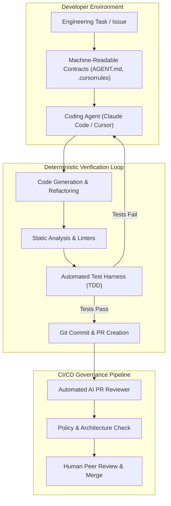

# Enterprise Use Case 1: AI-Assisted SDLC & Software 3.0

> [🔙 Back to Senior Transition Guide](../senior-transition-guide.md)

---

## Architectural Context
AI-assisted software development integrates autonomous coding tools (Claude Code, Cursor, Aider) directly into existing enterprise CI/CD pipelines and developer environments. Rather than letting models generate unconstrained code, senior architects structure repository boundaries so that AI agents operate inside strict, machine-readable architectural contracts.

---

## Key Architecture Patterns

### 1. Machine-Readable Repository Directives (`AGENT.md`, `.cursorrules`)
Natural language instructions must be structured into unambiguous directives: language version, allowed frameworks, test commands, and architectural layer boundaries. Directives prevent agents from introducing unapproved third-party dependencies or violating package boundaries.

### 2. AST-Driven CI/CD Review Gates
Automated review bots parse git diffs into Abstract Syntax Trees (ASTs) to evaluate structural changes, check test coverage, and scan for security vulnerabilities before human reviewers are notified.

### 3. Automated Schema Migrations
Reversible expand-and-contract migration patterns generated from updated domain entity models, validated in temporary test containers before merging.

---

## Production Implementation Checklist
- [ ] Root `AGENT.md` exists with explicit tech stack versions, test execution commands, and forbidden packages.
- [ ] Pre-commit hooks run linters and formatting before agents commit changes.
- [ ] CI pipeline runs deterministic unit tests in an isolated runner before triggering any LLM evaluation.
- [ ] PR reviews require at least one human sign-off for any production-bound pull request.
