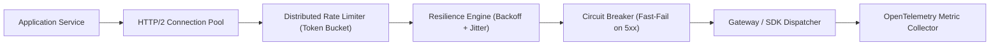

# Enterprise Use Case 2: Enterprise AI Clients, SDKs & Resilience

> [🔙 Back to Senior Transition Guide](../senior-transition-guide.md)

---

## Architectural Context
Enterprise applications require robust connection management, client-side resilience, rate-limiting, and cost allocation across upstream foundation model providers. Foundation models behave like external third-party microservices: they suffer rate limits, transient HTTP 500/503 errors, and network jitter.



---

## Polyglot SDK Comparison Matrix

| Ecosystem / SDK | Languages | Strengths | Enterprise Considerations |
|:---|:---|:---|:---|
| **Anthropic Claude SDK** | Python, TypeScript | Native prompt caching headers, strict XML structure handling, tool streaming. | Explicit cache breakpoint management (`cache_control: {"type": "ephemeral"}`). |
| **Google GenAI / Gemini SDK** | Python, Go, Node.js, Java, .NET | Multimodal inputs, large context windows (1M+ tokens), explicit context cache TTLs. | Native Vertex AI IAM auth, enterprise VPC service controls, BigQuery grounding. |
| **OpenAI / Azure AI Foundry SDK** | Python, TypeScript, .NET | Native Structured Outputs (`strict: true`), schema enforcement. | Azure Private Link endpoints, managed identities, provisioned throughput units (PTUs). |
| **Microsoft Semantic Kernel** | C# / .NET, Python, Java | Deep dependency injection, pipeline filters, enterprise OpenAPI plugins. | Native integration with .NET enterprise ecosystems and Polly resilience policies. |
| **Spring AI** | Java (Spring Boot) | Enterprise Java standards, portable Client abstraction, vector store integrations. | Integrates cleanly with Spring Cloud configurations and enterprise microservices. |

---

## Resilience Implementation (Python + Tenacity)

```python
import time
from tenacity import retry, stop_after_attempt, wait_exponential_jitter, retry_if_exception_type
from anthropic import Anthropic, RateLimitError, APIConnectionError, InternalServerError

client = Anthropic()

@retry(
    retry=retry_if_exception_type((RateLimitError, APIConnectionError, InternalServerError)),
    stop=stop_after_attempt(5),
    wait=wait_exponential_jitter(initial=1.0, max=30.0, jitter=2.0),
    reraise=True
)
def call_resilient_model(system_prompt: str, user_prompt: str, model: str = "claude-3-7-sonnet-latest") -> str:
    """Invokes foundation model with exponential backoff and jitter."""
    response = client.messages.create(
        model=model,
        max_tokens=4096,
        system=[
            {
                "type": "text",
                "text": system_prompt,
                "cache_control": {"type": "ephemeral"} # Prompt Caching
            }
        ],
        messages=[{"role": "user", "content": user_prompt}]
    )
    return response.content[0].text
```
