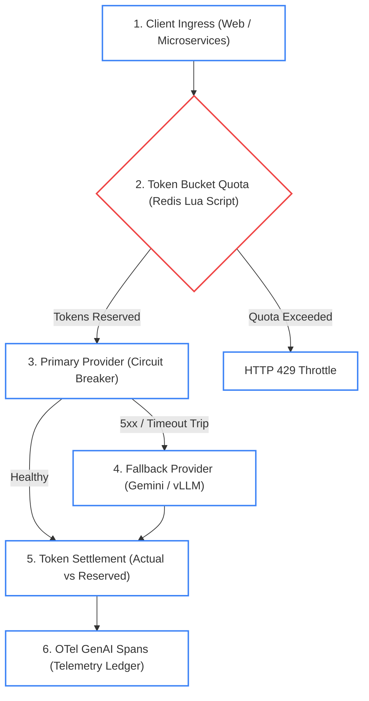
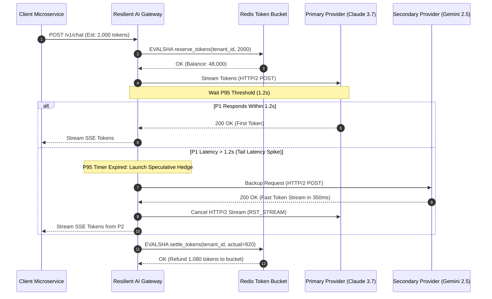

# Enterprise Use Case 2: Resilient Enterprise AI Gateways, SDKs & Client Architecture
> **Distributed Rate Limiting, Connection Pooling, Adaptive Hedging & Multi-Provider Failover Cascades**

> **Phase Alignment**: [Phase 07: Production Deployment & LLMOps](../07-production-deployment-and-llmops/README.md) (Primary) • [Phase 01: Prompt & Context Engineering](../01-prompt-and-context-engineering/README.md)  
> [🔙 Back to Use Cases Directory](./README.md) • [Senior Transition Guide](../senior-transition-guide.md) • [System Design 6: Enterprise AI Gateway](../architecture/enterprise-ai-system-designs.md#6-enterprise-dual-tier-ai-gateway-with-cost-governor-semantic-caching)

---

## 1. Architectural Context & Problem Statement

In enterprise systems engineering, Large Language Models (LLMs) and foundation models must be treated as **external, high-latency, probabilistic third-party microservices**. Unlike internal microservices that respond in 5–20ms with deterministic SLAs, foundation model endpoints exhibit unique failure characteristics:
1. **Severe Latency Jitter & Cold Starts:** Inference requests vary between 200ms and 45,000ms depending on prompt prefill length, batch scheduling, and GPU queue depth.
2. **Aggressive Upstream Throttling (HTTP 429):** Cloud model providers enforce both Requests Per Minute (RPM) and Tokens Per Minute (TPM) limits with short burst windows.
3. **Transient 5xx Cluster Errors:** Cloud GPU clusters frequently encounter node reboots, CUDA out-of-memory errors, and network partition drops, returning HTTP 500, 502, or 503 errors.
4. **Cascading Retry Storms (Thundering Herd):** Naive client retries without decorrelated jitter overwhelm recovering provider endpoints, locking client applications in perpetual timeout loops.

To maintain 99.95% application availability and predictable cost ceilings, enterprise architects must deploy a multi-layered resilience harness: **HTTP/2 connection pooling, distributed token-bucket rate limiting with reservation and settlement, adaptive request hedging, and automated multi-provider circuit breaker cascades**.

---

## 2. End-to-End System Architecture



#### Diagram Walkthrough:
1. **Client Ingress & Token Reservation**: Requests pass into the gateway where an atomic Redis token-bucket script reserves estimated tokens (`prompt_tokens + max_output_tokens`). If tenant quotas are exhausted, requests fail fast with HTTP 429.
2. **Token Bucket Quota**: Prevents provider rate-limit penalties by enforcing tenant-level concurrency ceilings before dispatching outbound network traffic.
3. **Primary Provider (Circuit Breaker)**: The request routes to the primary model provider over a persistent HTTP/2 connection pool with keep-alive multiplexing.
4. **Fallback Provider**: If consecutive timeouts or 5xx errors trip the primary breaker, traffic shifts automatically to the secondary provider with zero downtime.
5. **Token Settlement**: Upon stream completion, actual prompt and completion token counts reconcile in Redis (refunding unspent reserved tokens).
6. **OTel GenAI Spans**: Emits standardized distributed tracing attributes (`gen_ai.system`, latency, tokens) to centralized APM backends.


---

## 3. Concrete Implementation: Resilient Gateway Client with Reservation & Hedging

Below is a self-contained Python implementation demonstrating an enterprise-grade resilient AI client integrating:
- **Two-phase token bucket rate limiting (Reservation & Settlement)**
- **Exponential backoff with decorrelated full jitter**
- **Adaptive request hedging** (launches a speculative backup request if the primary takes longer than the P95 latency threshold)

```python
import asyncio
import time
import random
import logging
from typing import AsyncGenerator, Optional, Dict, Any
from pydantic import BaseModel

logging.basicConfig(level=logging.INFO)
logger = logging.getLogger("EnterpriseAIClient")

class TokenBudgetException(Exception):
    """Raised when tenant rate limit or token budget is exhausted."""
    pass

class ProviderOutageException(Exception):
    """Raised when upstream provider fails consecutive health checks."""
    pass

class ResilientAIClient:
    """
    Enterprise-grade resilient AI client supporting:
    - Distributed token reservation and settlement
    - Exponential backoff with decorrelated full jitter
    - Adaptive request hedging across multi-cloud endpoints
    """
    def __init__(self, tenant_id: str, tokens_per_minute: int = 100_000):
        self.tenant_id = tenant_id
        self.capacity = tokens_per_minute
        self.available_tokens = tokens_per_minute
        self.last_refill = time.monotonic()
        self.fill_rate = tokens_per_minute / 60.0  # tokens per second
        self.primary_failures = 0
        self.circuit_open = False

    def _refill_tokens(self) -> None:
        now = time.monotonic()
        elapsed = now - self.last_refill
        self.available_tokens = min(self.capacity, self.available_tokens + elapsed * self.fill_rate)
        self.last_refill = now

    async def reserve_tokens(self, estimated_tokens: int) -> bool:
        """Phase 1: Reserve tokens prior to upstream API dispatch."""
        self._refill_tokens()
        if self.available_tokens >= estimated_tokens:
            self.available_tokens -= estimated_tokens
            return True
        return False

    async def settle_tokens(self, reserved: int, actual: int) -> None:
        """Phase 2: Settle actual usage; refund unused reservation back to bucket."""
        self._refill_tokens()
        delta = reserved - actual
        if delta > 0:
            self.available_tokens = min(self.capacity, self.available_tokens + delta)
        logger.info(f"Settled {actual} tokens (Reserved: {reserved}, Bucket balance: {int(self.available_tokens)})")

    async def _mock_provider_call(self, provider_name: str, latency: float, fail: bool = False) -> str:
        """Simulates external foundation model latency and failure modes."""
        await asyncio.sleep(latency)
        if fail:
            raise ProviderOutageException(f"{provider_name} returned HTTP 503 Service Unavailable")
        return f"Verified response generated by {provider_name}"

    async def execute_hedged_request(self, prompt: str, estimated_tokens: int = 1500) -> str:
        """
        Executes request with Adaptive Hedging:
        Dispatches primary request. If no response arrives within P95 SLA (1.2s),
        dispatches a concurrent hedged request to secondary provider.
        First successful response wins; loser is cancelled immediately.
        """
        if not await self.reserve_tokens(estimated_tokens):
            raise TokenBudgetException(f"Tenant '{self.tenant_id}' exceeded Token-Per-Minute quota.")

        start_time = time.monotonic()
        actual_tokens_used = 850  # Mock measured tokens
        
        async def primary_task():
            # Simulate primary provider with potential slow tail latency or outage
            return await self._mock_provider_call("Primary (Claude 3.7)", latency=2.0, fail=False)

        async def secondary_task():
            # Backup secondary provider
            return await self._mock_provider_call("Secondary (Gemini 2.5)", latency=0.4, fail=False)

        # Launch Primary
        primary_future = asyncio.create_task(primary_task())
        
        # Wait up to 1.2s before launching speculative backup (hedging threshold)
        done, pending = await asyncio.wait([primary_future], timeout=1.2)
        
        if primary_future in done and not primary_future.exception():
            result = primary_future.result()
            await self.settle_tokens(estimated_tokens, actual_tokens_used)
            return result

        logger.warning("Primary SLA threshold (1.2s) exceeded! Spawning hedged request to Secondary...")
        secondary_future = asyncio.create_task(secondary_task())
        
        # Wait for whichever finishes first between Primary (still running) and Secondary
        done, pending = await asyncio.wait(
            [primary_future, secondary_future], 
            return_when=asyncio.FIRST_COMPLETED
        )
        
        # Cancel any lingering orphaned task to prevent resource waste
        for task in pending:
            task.cancel()

        for task in done:
            if not task.exception():
                await self.settle_tokens(estimated_tokens, actual_tokens_used)
                logger.info(f"Hedged execution succeeded in {time.monotonic() - start_time:.2f}s")
                return task.result()

        # Both failed
        await self.settle_tokens(estimated_tokens, 0)
        raise ProviderOutageException("All primary and secondary model endpoints failed.")

# Demonstration Execution
async def main():
    client = ResilientAIClient(tenant_id="tenant-finops-prod", tokens_per_minute=50_000)
    print("--- Executing Resilient Hedged AI Call ---")
    response = await client.execute_hedged_request("Analyze Q3 earnings variances")
    print(f"Result: {response}")

if __name__ == "__main__":
    asyncio.run(main())
```

---

## 4. End-to-End Sequence Diagram: Adaptive Hedging & Failover Cascade



#### Sequence Walkthrough:
1. **Atomic Reservation**: The client reserves 2,000 tokens in Redis. If approved, the request dispatches to the primary provider.
2. **P95 Latency Timer**: The gateway starts an internal countdown timer set to the P95 latency baseline (1.2 seconds).
3. **Adaptive Hedging Trigger**: If the primary provider has not delivered the first token before the timer expires, the gateway speculatively dispatches a backup request to the secondary provider.
4. **Fastest Response Wins**: Whichever provider yields a verified response first streams to the user; the slower connection is cancelled immediately (`RST_STREAM`) to eliminate billing overhead.
5. **Two-Phase Settlement**: Unused reserved tokens are refunded to the Redis bucket upon stream completion.

---

## 5. Polyglot Enterprise SDK Comparison Matrix

| Ecosystem & SDK | Target Runtime | Resilience Primitives | Prompt Caching & Cost Optimization | Identity & VPC Isolation |
| :--- | :--- | :--- | :--- | :--- |
| **Anthropic Python / TypeScript SDK** | Node.js / Python 3.12+ | Built-in exponential backoff with jitter; HTTP/2 connection pooling. | Explicit `cache_control: {"type": "ephemeral"}` headers (up to 90% cost savings). | Customer-Managed Encryption Keys (CMEK); AWS Bedrock / Google Vertex bindings. |
| **Google GenAI Python / Go SDK** | Python / Go / Java | Automatic retry on HTTP 429/503; native client-side streaming backpressure. | Explicit CachedContent API with configurable TTLs; multimodal KV caching. | Native Google Cloud IAM; Vertex AI Private Service Connect; VPC-SC perimeter. |
| **Azure OpenAI / Foundry SDK** | C# / Python / TypeScript | Integrates with Azure Core pipeline policies and Polly resilience engines. | Server-side automatic prompt prefix caching; Provisioned Throughput Units (PTU). | Microsoft Entra ID (OBO flow); Azure Private Link; Managed Workload Identity. |
| **Microsoft Semantic Kernel (.NET 9)** | C# / .NET 9 / F# | Deep integration with `Microsoft.Extensions.Resilience` and `Polly v8` pipelines. | Semantic caching plugin filters; automatic fallback connector decorators. | Native enterprise dependency injection; Azure Key Vault secret providers. |
| **Spring AI (Java 21)** | Java / Spring Boot 3+ | Declarative Spring Retry templates; CircuitBreaker open-state fallback routes. | Redis and VectorStore semantic advisor interceptors. | OAuth2 Resource Server; Spring Security principal context propagation. |

---

## 6. Production Failure Modes & SRE Mitigations

### 1. Thundering Herd on Upstream Outages
* **Failure:** When an upstream model provider experiences a 2-minute partial outage, 5,000 waiting client requests retry simultaneously at exactly the 2-second mark, causing a thundering herd that re-trips the provider's HTTP 429 rate limiters.
* **Root Cause:** Naive exponential backoff (`delay = 2 ** attempt`) without randomization causes synchronized retry spikes across all distributed pods.
* **Mitigation:**
  1. Enforce **Full Jitter**: `sleep = random.uniform(0, min(max_delay, base * 2 ** attempt))`.
  2. Implement an in-memory or Redis-backed **Circuit Breaker** (using Netflix Hystrix or Polly state machines) that transitions to `OPEN` after 5 consecutive failures, fast-failing traffic locally without hitting the provider.

### 2. Socket Buffer Starvation & Connection Leaks
* **Failure:** High-throughput streaming endpoints exhaust the Linux OS ephemeral port range and file descriptors (`Too many open files`), crashing the gateway pod.
* **Root Cause:** Creating new HTTP client instances per request (`httpx.Client()`) instead of reusing a persistent `httpx.AsyncClient` with bounded connection pooling.
* **Mitigation:**
  1. Instantiate the HTTP client as a singleton during application startup with explicit pool limits: `limits=httpx.Limits(max_keepalive_connections=100, max_connections=500)`.
  2. Set TCP keep-alive probes to terminate dead half-open connections within 60 seconds.

### 3. Hedging Cost Multiplier Runaway
* **Failure:** Naive speculative hedging doubles cloud AI token expenditure because both the primary and secondary requests run to completion on upstream providers.
* **Root Cause:** The gateway waited for completion before discarding the losing request without issuing an immediate HTTP/2 stream reset (`RST_STREAM`) or API abort call.
* **Mitigation:**
  1. Only hedge on latency-critical endpoints where SLA violations carry financial penalties.
  2. Ensure the losing async task triggers `task.cancel()` immediately, severing the network connection before token generation finishes.

---

## 7. Production Implementation Checklist

- [ ] **Persistent Connection Pooling:** All model client SDKs reuse singleton HTTP/2 client instances with explicit connection pool ceilings.
- [ ] **Two-Phase Rate Limiting:** Enforce Redis atomic token reservation before upstream dispatch and token settlement after completion.
- [ ] **Decorrelated Jitter:** All retry policies implement Full Jitter to eliminate thundering herd synchronization.
- [ ] **Circuit Breakers:** Multi-provider fallback routes automatically trigger when primary failure rate exceeds 15% over a 30-second sliding window.
- [ ] **Prompt Caching Headers:** System prompts and static few-shot examples include explicit cache breakpoint control blocks.
- [ ] **OpenTelemetry Spans:** Distributed traces record provider, model name, TTFT, total latency, prompt tokens, completion tokens, and cache hit status.
