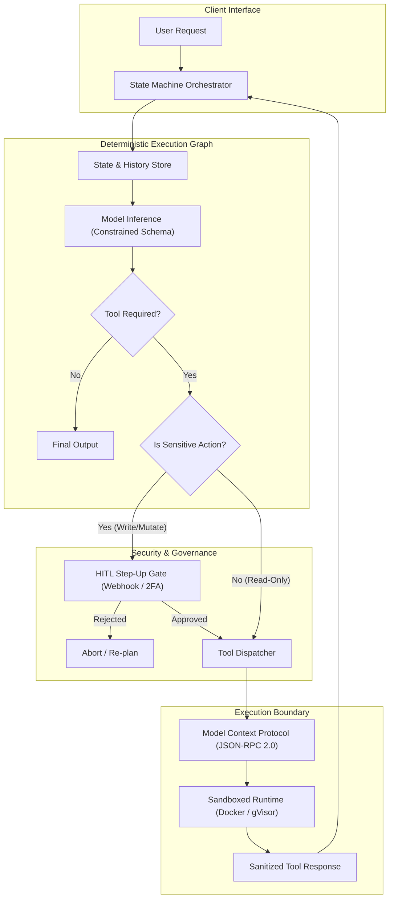

# Enterprise Use Case 3: MCP Tooling, Sandboxing & Production Deployment

> [🔙 Back to Senior Transition Guide](../senior-transition-guide.md)

---

## Architectural Context
Moving beyond simple open-ended chat loops requires **deterministic state machines** combined with the open **Model Context Protocol (MCP)**, strict schema validation, and step-up Human-in-the-Loop (HITL) approval gates.

---

## Core Architectural Components

### 1. Model Context Protocol (MCP)
- Uses **JSON-RPC 2.0** to define a standardized client-server boundary for AI tools.
- Transports: `stdio` for local subprocesses; `SSE` (Server-Sent Events) over HTTP for remote microservices with mTLS.
- Primitives: `Tools` (executable operations), `Resources` (read-only data/context), `Prompts` (reusable workflows), and `Roots` (boundary declarations).

### 2. Constrained Grammar Decoding
- Validates JSON schemas at token generation time using Finite State Machine (FSM) logit masking, guaranteeing well-formed payloads that never fail JSON deserialization in downstream microservices.

### 3. Execution Sandboxing
- Any dynamic code execution is confined to ephemeral, unprivileged containers (Docker `--network none`, gVisor `runsc`, or WebAssembly) with strict memory and CPU limits.

### 4. Human-in-the-Loop (HITL) Step-Up Gates
- State machines persist checkpoints and emit suspend tokens when encountering sensitive operations (e.g. database deletes, wire transfers), resuming only after an authenticated human approval is received.
